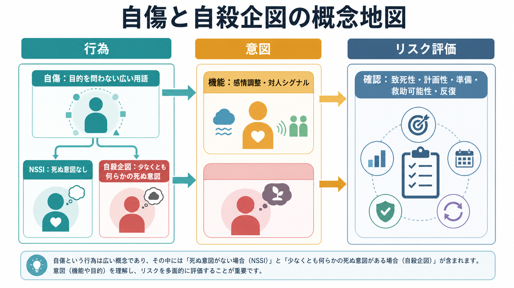
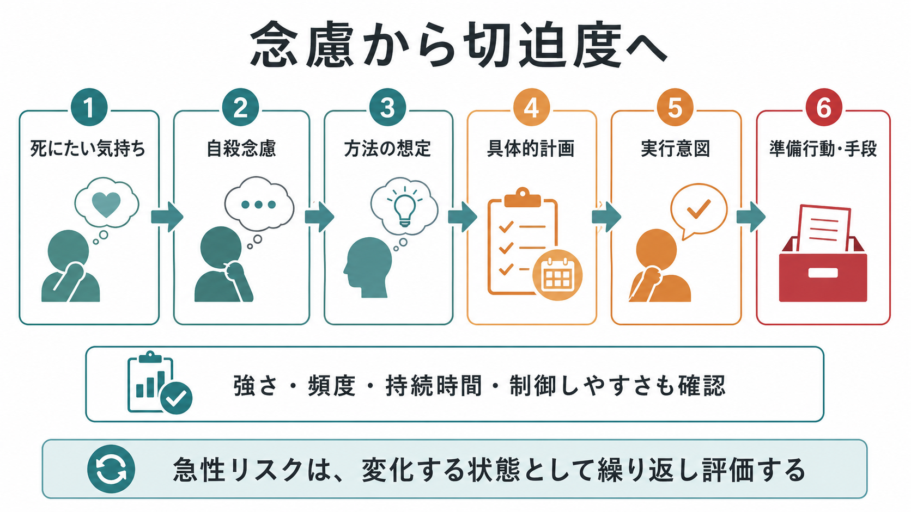
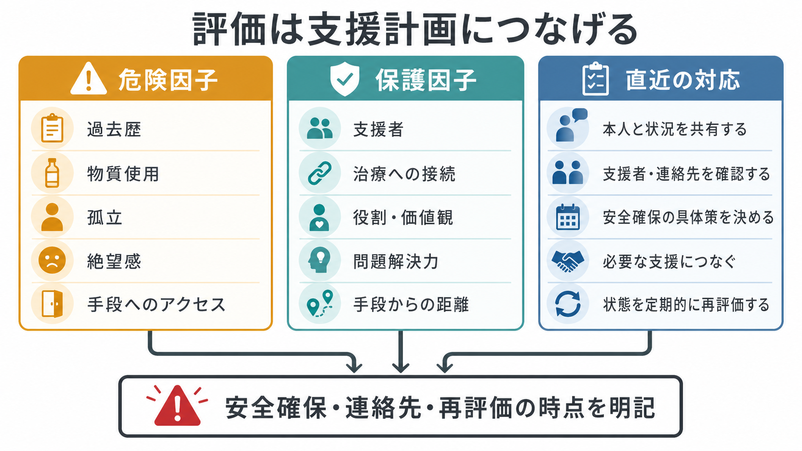

# 自殺リスク評価では何を聞くべきか

## 要点

- 自殺リスク評価は「危険度を当てる」作業ではなく、いま何が危険を高め、何が本人を支え、どの支援をいつ実行するかを組み立てる[[精神科面接とは何か|精神科面接]]である。
- 最低限確認する軸は、希死念慮、自殺念慮、方法・計画、実行意図、準備行動、手段へのアクセス、過去の自殺企図・自傷、急性の変化、保護因子である[1][2][3]。
- 数値スコアや「低・中・高」だけで処遇を決めてはならない。NICE は、リスク評価尺度を将来の自殺・自傷反復の予測や退院・治療可否の決定に使わず、ニーズと安全を中心にリスク・フォーミュレーションを行うことを推奨している[4]。
- 聞くこと自体が自殺念慮を誘発するという懸念は、現在のエビデンスでは支持されにくい。むしろ、直接的で落ち着いた質問は、本人が話せる余地を作る[6]。
- 評価の終点は記録ではなく、安全確保、手段からの距離、支援者・医療への接続、フォローアップ時点の明記である[1][5][8]。

## この記事で答える問い

1. 自殺リスク評価で、どの順番で何を聞くべきか。
2. 希死念慮、自殺念慮、計画性、手段へのアクセス、過去歴、保護因子をどう区別するか。
3. 評価結果を、支援計画と記録にどう落とし込むか。

## まず結論

自殺リスク評価では、最初に本人の苦痛と受診理由を受け止め、そのうえで「死にたい気持ちがあるか」「自分で命を絶つことを考えたか」「方法を考えたか」「具体的な時期・場所・準備があるか」「実行するつもりがどれくらいあるか」「利用可能な手段が身近にあるか」を、遠回しにせず確認する。続いて、過去の自殺企図・自傷、最近の悪化、物質使用、精神症状、身体疾患、孤立、喪失、支援者、治療への接続、本人が生きる理由として挙げるものを確認する[1][2][3]。

ただし、この情報は「点数化して終わる」ためではない。何が急性リスクを押し上げているか、どの危険因子が修正可能か、保護因子が実際に機能しているか、誰がいつ何をするかを、本人と支援者に伝わる言葉でまとめるために聞く[4][5]。

## 背景

臨床現場では、自殺リスク評価が「危ない人を見分けるチェックリスト」と誤解されやすい。しかし自殺関連行動は、診断名だけで説明できるものではなく、急性の絶望感、衝動性、物質使用、対人危機、身体疾患、社会的孤立、手段へのアクセス、治療中断などが重なって変動する。したがって評価は、[[現病歴はどのように構造化するべきか|現病歴]]と同じく時間軸を持つ必要がある。

Joint Commission の患者安全目標は、陽性スクリーニング後の自殺評価では、自殺念慮、計画、意図、自殺・自傷行動、危険因子、保護因子を直接尋ね、全体的なリスク水準と軽減計画を文書化することを求めている[2]。SAMHSA の SAFE-T も、危険因子、保護因子、自殺に関する直接質問、リスク水準と介入、記録という 5 段階で評価を整理している[1]。

日本の文脈でも、自殺対策は「生きることの包括的な支援」として位置づけられており、自殺未遂者支援では救急医療、精神科医療、地域支援の連携が重要になる。この点で、自殺リスク評価は[[治療関係とは何か|治療関係]]の外にある管理手続きではなく、本人が支援につながるための面接技法である。

## 基本概念

### 希死念慮と自殺念慮

希死念慮は「消えてしまいたい」「眠ったまま目覚めたくない」のような、死への願望を含む広い概念である。自殺念慮は、自分で命を絶つことを考える状態を指す。C-SSRS は、死にたい願望、非特異的な自殺念慮、方法を伴う念慮、意図、具体的計画と意図を段階的に区別し、行動面では実際の企図、中断・中止された企図、準備行動、自傷を区別する[3]。

面接では、まず広く聞き、次に具体化する。

| 確認すること | 質問例 |
|---|---|
| 死にたい気持ち | 「つらさが強くて、死んでしまいたいと思うことはありますか」 |
| 自殺念慮 | 「自分で命を絶つことを考えたことはありますか」 |
| 頻度・持続 | 「その考えはどれくらいの頻度で、どれくらい続きますか」 |
| 制御可能性 | 「考えが出たとき、離れられますか。それとも引き込まれますか」 |
| 理由 | 「死にたい理由と、生きていたい理由はそれぞれ何ですか」 |

### 計画性・意図・準備行動

重要なのは「考えがあるか」だけではなく、それがどれほど実行に近づいているかである。方法の想定、時期、場所、準備、遺書・身辺整理、支援を避ける行動、直近の急性悪化を確認する。ここでは具体的な方法を教えるのではなく、本人がすでに考えている内容と手段へのアクセスを安全確認として把握する。

### 手段へのアクセス

手段へのアクセスは、急性リスクを大きく左右する修正可能因子である[1][5]。確認するのは、本人の身近に危険な手段があるか、それをすぐ使える状態か、誰が安全に距離を置く手助けをできるかである。面接では、羞恥や責めを生まないように「安全のために確認します」と前置きする。

確認後は、本人だけに管理責任を負わせず、同意を得て家族・支援者・医療者・地域資源と安全確保を組み立てる。手段への距離を作ることは、本人の意思を疑う行為ではなく、危機が短時間で変動するという前提に立つ支援である。

### 過去歴

過去の自殺企図は重要なリスク情報である。時期、回数、直近性、当時の意図、救助可能性、準備、医学的重症度、企図後の受療、何が危機を収めたかを確認する。自傷についても、自殺意図の有無だけで単純に分けず、感情調整、対人シグナル、解離、自己処罰、習慣化、エスカレーションの有無を聞く。

過去歴は「危険な人」というラベルではない。危機に至るパターン、危機を和らげた条件、今後再利用できる支援資源を見つけるために聞く。

### 保護因子

保護因子は、家族、友人、治療者、仕事・学業上の役割、宗教・価値観、ペット、問題解決力、治療への希望などである[1]。ただし「家族がいるから大丈夫」とは言えない。保護因子は、本人が危機の瞬間に実際に使えるときだけ保護因子として働く。

したがって、「誰に連絡できますか」だけではなく、「その人に今日連絡できますか」「連絡したら何と言えそうですか」「夜間や休日はどうしますか」「支援者は状況を知っていますか」まで具体化する。

## 仕組み

自殺リスク評価は、次の 4 層で整理すると実践しやすい。

| 層 | 見るもの | 面接での焦点 |
|---|---|---|
| 長期リスク | 過去の企図、精神疾患、物質使用、慢性疼痛、トラウマ、孤立 | 背景脆弱性 |
| 急性リスク | 最近の悪化、喪失、絶望感、不眠、焦燥、衝動性、手段へのアクセス | 今日から数日単位の切迫度 |
| 保護因子 | 支援者、治療への接続、価値観、役割、危機時の対処 | 実際に使える支え |
| 対応計画 | 安全確保、支援者への連絡、診療間隔、危機時連絡先、再評価 | 誰がいつ何をするか |

この整理は、リスクを静的な属性としてではなく、変化する状態として扱うためのものだ。NICE が強調するように、尺度やグローバルなリスク分類だけで処遇を決めると、本人のニーズ、安全、支援計画が後景に退きやすい[4]。Quinlivan らの多施設研究でも、自傷後のリスク尺度は臨床的有用性に限界があり、管理判断の根拠として過信すべきでないことが示されている[7]。

## 図解

図のように、評価は危険因子、保護因子、直近の対応を同時に扱う。たとえば「希死念慮あり、計画なし」と書くだけでは不十分である。実際には、念慮の頻度、制御可能性、急性悪化、手段へのアクセス、過去企図、支援者への連絡可能性、次回診療までの安全性を合わせて記述する。

## 臨床・研究との接続

臨床では、自殺リスク評価は[[精神科初診で何を確認するべきか|精神科初診]]、救急対応、入退院判断、外来フォロー、心理療法導入のどこでも必要になる。高リスクが疑われる場合は、所属機関のプロトコルに従い、単独判断を避け、上級医・チーム・救急・地域資源と連携する。

支援計画としては、安全計画とフォローアップが重要である。Stanley らの救急部門研究では、安全計画介入と構造化フォローアップを受けた群で、その後 6 か月の自殺行動が少なく、外来精神保健受診への接続が高かった[8]。これは、評価の価値が「リスクを分類すること」ではなく「危機の場面で使える行動計画を作ること」にあることを示している。

研究では、C-SSRS などの標準化された質問は、概念の混同を減らし、念慮と行動を比較可能にする利点がある[3]。一方で、尺度は臨床的文脈を置き換えない。本人の生活史、文化、支援資源、治療関係を踏まえたフォーミュレーションが必要である。

## よくある誤解

### 「聞くと自殺を誘発する」

エビデンスはこの懸念を強く支持していない。Dazzi らのレビューでは、自殺について尋ねられた参加者で自殺念慮が統計的に有意に増えるという結果は見いだされず、話題にすることがむしろ苦痛の軽減につながりうると整理されている[6]。重要なのは、唐突に詰問することではなく、落ち着いた前置きと共感的姿勢で直接聞くことである。

### 「計画がなければ安全」

計画がないことは重要な情報だが、それだけで安全とは言えない。衝動性、物質使用、急性の焦燥、不眠、手段へのアクセス、過去企図、孤立が重なる場合、計画が明確でなくても切迫度は高まりうる[5]。

### 「保護因子があれば大丈夫」

保護因子は、危機時に利用可能で、本人が受け入れられ、支援者も役割を理解しているときに機能する。名前だけの支援者や、本人が連絡できない家族は、危機時の保護因子としては弱い。

### 「リスク分類が評価のゴール」

分類は申し送りには役立つが、ゴールではない。NICE は、将来の自殺や自傷反復の予測、治療可否や退院判断にリスク尺度やグローバル分類を用いないよう推奨している[4]。評価のゴールは、支援計画、再評価、記録である。

## 関連ノート

既存ノート:

- [[精神科面接とは何か]]
- [[精神科初診で何を確認するべきか]]
- [[現病歴はどのように構造化するべきか]]
- [[治療関係とは何か]]
- [[ラポールはどのように形成されるのか]]
- [[生物心理社会モデルとは何か]]
- [[精神医学におけるレジリエンスとは何か]]

今後の作成候補:

- 自殺安全計画とは何か
- 自傷と自殺企図はどう区別するか
- 救急外来での自殺未遂者支援
- 希死念慮をどう記録するか

MOC 更新候補:

- `content/00_MOC/MOC｜精神医学.md`
- `content/00_MOC/MOC｜臨床実践・治療.md`

## 理解チェック

1. 希死念慮と自殺念慮はどう違うか。
2. 「計画なし」と記録する前に、追加で何を確認すべきか。
3. 手段へのアクセスを聞くとき、どのような前置きが有用か。
4. 保護因子が「実際に機能する」ためには何が必要か。
5. リスク尺度や「低・中・高」分類だけで処遇を決めることの問題は何か。

## 未解決問題

- 自殺リスク評価を、予測モデルではなく支援計画として電子カルテに実装する最適な形式は何か。
- 短時間診療で、本人の負担を増やさずに必要情報を確認する質問順序はどう設計できるか。
- 文化的背景、年齢、神経発達特性、認知機能低下がある場合に、質問表現をどう調整するべきか。

## 参考文献

[1] Substance Abuse and Mental Health Services Administration. (2024). *SAFE-T Suicide Assessment Five-Step Evaluation and Triage*. https://library.samhsa.gov/product/safe-t-suicide-assessment-five-step-evaluation-and-triage/pep24-01-036

[2] The Joint Commission. (2024). *National Patient Safety Goals: Reduce the risk for suicide, NPSG.15.01.01*. https://www.jointcommission.org/standards/Standard-FAQs/Critical%20Access%20Hospital/National%20Patient%20Safety%20Goals%20NPSG/000002237

[3] The Columbia Lighthouse Project. (n.d.). *The Columbia Protocol / Columbia-Suicide Severity Rating Scale (C-SSRS)*. https://cssrs.columbia.edu/the-columbia-scale-c-ssrs/

[4] National Institute for Health and Care Excellence. (2022). *Self-harm: assessment, management and preventing recurrence (NG225), recommendations*. https://www.nice.org.uk/guidance/ng225/chapter/recommendations

[5] U.S. Department of Veterans Affairs & Department of Defense. (2024). *VA/DoD Clinical Practice Guideline for Assessment and Management of Patients at Risk for Suicide*. https://www.healthquality.va.gov/guidelines/mh/srb/

[6] Dazzi, T., Gribble, R., Wessely, S., & Fear, N. T. (2014). Does asking about suicide and related behaviours induce suicidal ideation? What is the evidence? *Psychological Medicine, 44*(16), 3361-3363. https://doi.org/10.1017/S0033291714001299

[7] Quinlivan, L., Cooper, J., Meehan, D., et al. (2017). Predictive accuracy of risk scales following self-harm: Multicentre, prospective cohort study. *The British Journal of Psychiatry, 210*(6), 429-436. https://doi.org/10.1192/bjp.bp.116.189993

[8] Stanley, B., Brown, G. K., Brenner, L. A., et al. (2018). Comparison of the Safety Planning Intervention with follow-up vs usual care of suicidal patients treated in the emergency department. *JAMA Psychiatry, 75*(9), 894-900. https://doi.org/10.1001/jamapsychiatry.2018.1776
