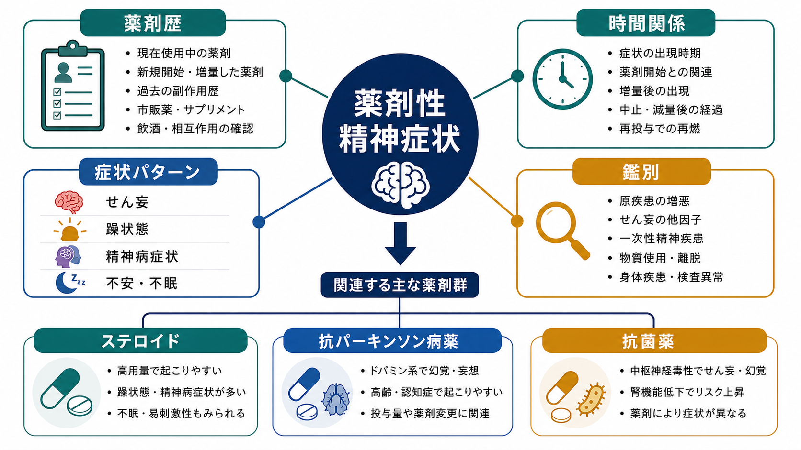
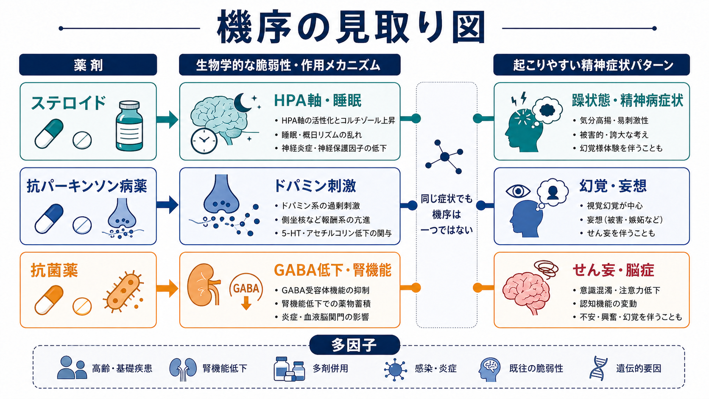
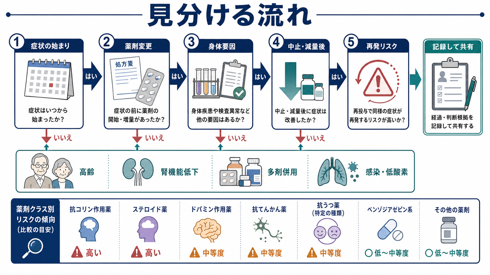

# 薬剤性精神症状とは何か

## 要点

- 薬剤性精神症状とは、処方薬、市販薬、サプリメント、物質使用・離脱などが、せん妄、幻覚・妄想、躁状態、不安、不眠、抑うつ、認知機能低下として現れる状態である。
- 見分ける軸は「薬剤変更と症状出現の時間関係」「中止・減量後の変化」「再投与や増量での再燃」「他の身体・精神医学的原因の有無」である。
- ステロイド、抗パーキンソン病薬、抗菌薬は、臨床で見落としやすい代表例である。
- せん妄、一次性精神疾患、物質使用・離脱、感染、低酸素、代謝異常、認知症を同時に評価する必要がある。
- 本記事は教育・研究目的の整理であり、個別の診断や薬剤中止を指示するものではない。

## この記事で答える問い

1. 「薬剤性」と考える根拠は何か。
2. ステロイド、抗パーキンソン病薬、抗菌薬では、どのような精神症状が起こりうるか。
3. 精神科面接では、薬剤性精神症状をどの順序で見分ければよいか。

## まず結論

薬剤性精神症状は、「薬が原因かどうか」を一発で当てる診断名ではなく、[[現病歴はどのように構造化するべきか|現病歴]]、薬剤歴、身体所見、検査、経過観察を合わせて確率を上げていく臨床推論である。DSM-5-TR 系の整理では、物質・医薬品により誘発される精神症状は、精神病症状、気分症状、不安症状、睡眠症状、神経認知症状などとして分類され、一般に原因物質との時間関係、既存疾患との関係、せん妄だけでは説明されないことなどを検討する[1][2]。

## 背景

精神症状は、心理社会的ストレスや一次性精神疾患だけでなく、薬剤、感染、低酸素、電解質異常、腎機能低下、肝機能低下、疼痛、睡眠障害でも生じる。したがって、精神科診断では[[鑑別診断とは何か|鑑別診断]]と[[器質性精神障害を見逃さないためには何を見るべきか|器質性精神障害の評価]]が不可欠である。

薬剤性を疑う場面は、典型的には次のようなときである。

| 観察点 | 具体的に見ること |
|---|---|
| 時間関係 | 新規開始、増量、減量、中止、腎機能低下後の蓄積、相互作用の後に症状が出たか |
| 症状パターン | 急性の注意障害、意識変動、幻視、睡眠覚醒リズムの乱れ、急な躁状態や精神病症状 |
| 脆弱性 | 高齢、認知症、脳疾患、腎機能低下、感染、低酸素、多剤併用、過去の同様反応 |
| 経過 | 原因候補薬の中止・減量、身体要因の改善後に症状が軽くなるか |
| 代替原因 | 原疾患の悪化、一次性精神疾患、物質使用・離脱、せん妄、神経疾患が説明しないか |

## 基本概念

### 薬剤性は「除外」だけでなく「経過」で見る

薬剤性精神症状を考えるとき、単に「他の原因がなかった」とするだけでは不十分である。薬剤投与後に症状が出現したか、中止・減量で改善したか、再投与で再燃したか、用量依存性があるか、同じ薬剤群で過去に同様反応があったかを確認する。Naranjo の有害薬物反応確率尺度は、時間関係、dechallenge、rechallenge、代替原因、用量反応などを点数化する枠組みを示しており、薬剤性を考えるチェックリストとして参考になる[7]。

ただし、精神症状では rechallenge を意図的に行うことは通常望ましくない。再燃リスクがあるため、実務上は過去の診療録、家族からの情報、薬局情報、服薬カレンダー、処方変更日を突き合わせることが重要である。

### せん妄との関係

薬剤性精神症状の多くはせん妄として現れるか、せん妄を悪化させる。NICE のせん妄ガイドラインは、高齢、認知機能障害、重症身体疾患などをリスク因子として挙げ、急な認知機能、知覚、身体機能、社会行動の変化を観察することを推奨している[6]。薬剤関連せん妄については、抗コリン薬、ベンゾジアゼピン、オピオイド、多剤併用などが疑われる一方、薬剤クラスごとの証拠の確実性は一様ではない[8]。

## 仕組み

薬剤性精神症状の機序は一つではない。脳内神経伝達、睡眠覚醒リズム、炎症、血液脳関門、代謝、腎排泄、薬物相互作用、もともとの脳脆弱性が重なって、同じ「幻覚」や「興奮」でも異なる病態として現れる。

### ステロイド

副腎皮質ステロイドは、躁状態、精神病症状、抑うつ、不安、不眠、認知変化、せん妄などと関連しうる。2025 年のシステマティックレビューでは、ステロイド関連の躁・精神病症状を扱った 40 報が整理され、高用量・長期使用、既存の精神疾患、高齢、女性などがリスク因子として示唆された[3]。機序としては、HPA 軸、睡眠覚醒リズム、炎症・免疫、神経可塑性への影響が考えられるが、症状の出方は用量だけでは説明しきれない。

### 抗パーキンソン病薬

パーキンソン病では、疾患そのものの進行、認知機能低下、睡眠障害、視覚処理の変化に加え、レボドパ、ドパミンアゴニスト、抗コリン薬などの治療薬が幻覚・妄想に関与しうる。レビューでは、パーキンソン病精神病はドパミン作動薬で治療中の患者に多く、薬剤性要因と疾患内在性要因の相互作用として理解される[4]。臨床では、運動症状を保つ必要性と精神症状の軽減をどう両立するかが問題になる。

### 抗菌薬

抗菌薬による神経精神毒性は比較的まれだが、めまい、混乱、せん妄、痙攣、精神病症状として現れることがある。2024 年のレビューは、抗菌薬クラスごとに頻度、機序、症状が異なり、βラクタム系、フルオロキノロン系、マクロライド系、メトロニダゾール、イソニアジドなどが問題になりうると整理している[5]。腎機能低下、血液脳関門の障害、高用量、併用薬、感染そのものによるせん妄が重なると、薬剤性か原疾患かの判別は難しくなる。

## 図解

薬剤性を疑うときは、次の順序で情報をそろえる。

1. 症状がいつ始まったかを、日単位で確認する。
2. その前後の新規開始、増量、減量、中止、飲み忘れ、過量、相互作用を確認する。
3. 高齢、認知症、腎機能低下、感染、低酸素、疼痛、睡眠不足などの身体要因を確認する。
4. 原因候補薬の調整後に改善するかを、治療チーム内で共有しながら観察する。
5. 再投与・同系統薬の使用時に再燃しうることを、記録として残す。

## 臨床・研究との接続

### 面接で聞くこと

薬剤性を見落とさないためには、[[精神科初診で何を確認するべきか|初診時]]から「薬剤名」だけでなく「変更日」を聞く。本人が覚えていない場合は、処方箋、お薬手帳、薬局アプリ、家族の服薬管理、退院時処方、他院処方を確認する。[[物質使用歴はどのように聞くべきか|物質使用歴]]、市販薬、漢方薬、サプリメント、カフェイン、アルコール、睡眠薬の自己調整も含める。

### 記録で残すこと

記録には「薬剤性疑い」とだけ書くのではなく、根拠を分解して残す。

| 記録項目 | 例 |
|---|---|
| 時間関係 | プレドニゾロン増量 3 日後から不眠と多弁が出現 |
| 症状 | 注意障害なし、気分高揚、易刺激性、誇大的発言 |
| 代替原因 | 発熱なし、電解質異常なし、既往の躁病エピソードなし |
| 対応 | 主治医と相談し、原疾患リスクを踏まえて用量調整を検討 |
| 経過 | 減量後 1 週間で睡眠と発語量が改善 |

薬剤調整は原疾患の悪化リスクを伴うため、精神科単独で決めず、処方科、薬剤師、本人・家族との[[共同意思決定とは何か|共同意思決定]]として扱う。

### 研究で見る問い

薬剤性精神症状の研究では、症例報告や薬剤疫学研究が重要である一方、因果推論が難しい。症状の自然経過、原疾患の重症度、感染や入院環境、多剤併用が交絡するためである。今後は、電子カルテ、薬剤投与時系列、せん妄評価、患者報告アウトカムを組み合わせ、発症時点と dechallenge 後の軌跡を精密に追う研究が必要である。

## よくある誤解

### 「薬剤性なら薬を止めればよい」

必ずしもそうではない。ステロイドや抗パーキンソン病薬、抗菌薬は、原疾患の治療に不可欠なことがある。急な中止が身体的危険を高める薬剤もあるため、調整は処方医と相談して行う。

### 「精神症状が出たら一次性精神疾患である」

急な発症、意識・注意の変動、視覚性幻覚、睡眠覚醒リズムの乱れ、身体疾患の悪化、多剤併用がある場合は、薬剤性やせん妄を先に考える。これは[[精神科診断における除外診断とは何か|除外診断]]の基本である。

### 「薬剤性なら検査で確定できる」

薬物血中濃度が有用な薬剤もあるが、多くの薬剤性精神症状は検査だけで確定できない。時間関係、身体要因、薬剤変更、臨床経過の組み合わせで判断する。

## 関連ノート

- [[精神科初診で何を確認するべきか]]
- [[現病歴はどのように構造化するべきか]]
- [[物質使用歴はどのように聞くべきか]]
- [[器質性精神障害を見逃さないためには何を見るべきか]]
- [[身体合併症は精神科診療でなぜ重要なのか]]
- [[精神科診断における除外診断とは何か]]
- [[鑑別診断とは何か]]
- [[精神科診察で睡眠をどう評価するか]]
- [[アドヒアランスとは何か]]
- [[共同意思決定とは何か]]

## MOC更新候補

- `content/00_MOC/` 配下の精神医学・診断関連 MOC に、本記事へのリンクを追加する候補。
- 並列ジョブとの競合を避けるため、本タスクでは MOC 本体は更新していない。

## 理解チェック

1. 薬剤性精神症状を疑うとき、薬剤名だけでなく「変更日」を確認する理由は何か。
2. ステロイド関連の躁状態と、一次性双極症の躁状態を区別するとき、どの情報が役立つか。
3. 抗菌薬使用中のせん妄で、感染そのものと薬剤性をどう切り分けるか。
4. Naranjo 尺度の考え方を精神症状に使うとき、どこに限界があるか。

## 未解決問題

- 薬剤クラスごとの精神症状リスクは、症例報告の蓄積に偏りやすく、絶対リスクを推定しにくい。
- ステロイド精神症状では、用量、投与期間、既往歴、炎症性疾患そのものの影響を分けることが難しい。
- 抗菌薬関連の神経精神毒性では、感染、発熱、腎機能低下、ICU環境、併用薬が強く交絡する。
- 精神症状の客観的評価尺度と薬剤時系列データを結びつける研究基盤がまだ十分ではない。

## 参考文献

[1] Merck Manual Professional Edition. Substance-Related Psychiatric Disorders. Reviewed/Revised 2025, Modified 2026. https://www.merckmanuals.com/professional/psychiatric-disorders/substance-related-disorders/substance-related-psychiatric-disorders

[2] Revadigar N, Gupta V. Substance-Induced Mood Disorders. *StatPearls*. Last Update: 2022. https://www.ncbi.nlm.nih.gov/books/NBK555887/

[3] Gostoli S, Carrozzino D, Raimondi G, Subach R, Gigante G, Rafanelli C. Corticosteroid-induced manic and/or psychotic symptoms: a systematic review. *Frontiers in Pharmacology*. 2025;16:1628765. https://doi.org/10.3389/fphar.2025.1628765

[4] Samudra N, Patel N, Womack KB, Khemani P, Chitnis S. Psychosis in Parkinson Disease: A Review of Etiology, Phenomenology, and Management. *Drugs & Aging*. 2016;33(12):855-863. https://doi.org/10.1007/s40266-016-0416-8

[5] Althubyani AA, Canto S, Pham H, Holger DJ, Rey J. Antibiotic-induced neuropsychiatric toxicity: epidemiology, mechanisms and management strategies - a narrative literature review. *Drugs in Context*. 2024;13:2024-3-3. https://doi.org/10.7573/dic.2024-3-3

[6] National Institute for Health and Care Excellence. Delirium: prevention, diagnosis and management in hospital and long-term care. NICE guideline CG103. Updated 2023. https://www.nice.org.uk/guidance/cg103/chapter/1-recommendations

[7] LiverTox: Clinical and Research Information on Drug-Induced Liver Injury. Adverse Drug Reaction Probability Scale (Naranjo) in Drug Induced Liver Injury. NCBI Bookshelf. 2019. https://www.ncbi.nlm.nih.gov/books/NBK548069/

[8] Reisinger M, et al. Delirium-associated medication in people at risk: A systematic update review, meta-analyses, and GRADE-profiles. *Acta Psychiatrica Scandinavica*. 2023;147(1):16-42. https://pmc.ncbi.nlm.nih.gov/articles/PMC10092229/
