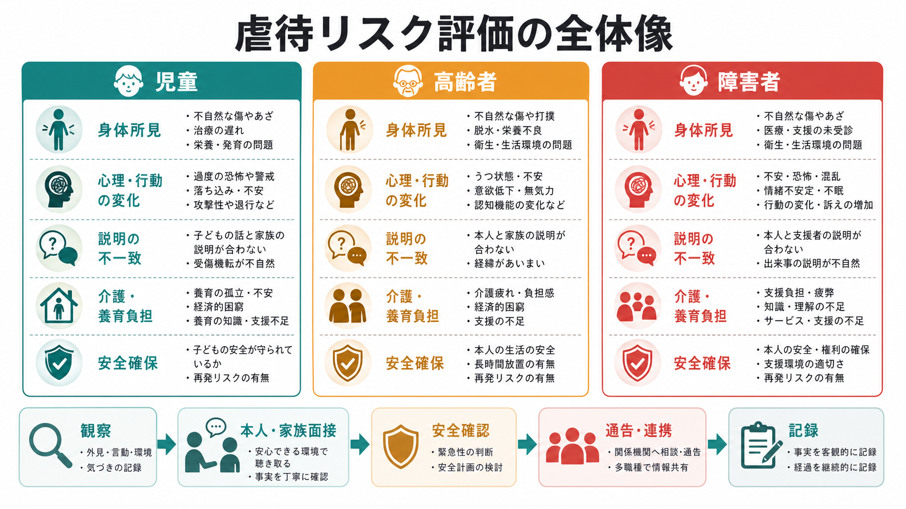
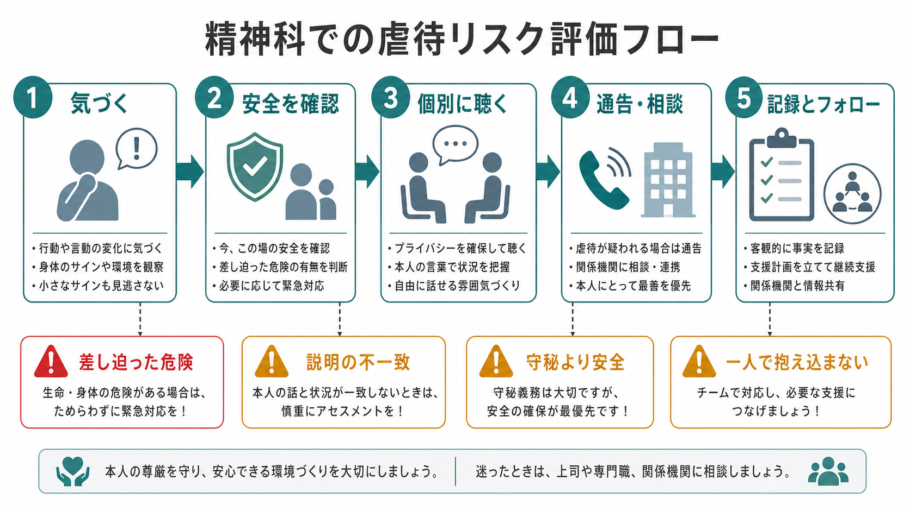
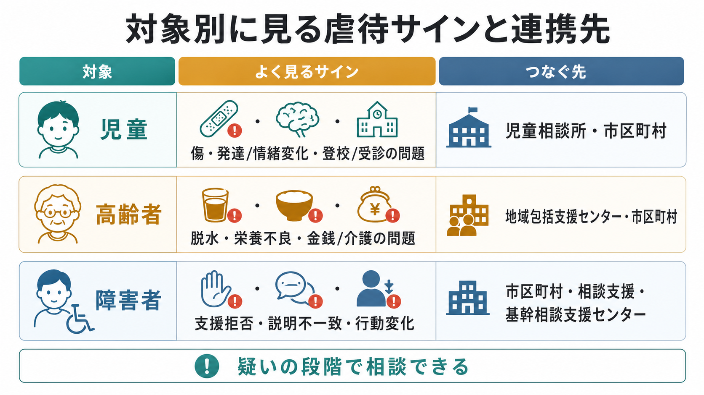

# 虐待リスクを精神科でどう評価するか

## 要点

- 虐待リスク評価の目的は、加害者をその場で断定することではなく、本人の安全、説明の整合性、支援資源、通告・相談の必要性を組織的に判断することである。
- 児童虐待では「虐待を受けたと思われる児童」を発見した者に通告義務があり、守秘義務は通告義務の遵守を妨げるものではない[3]。
- 高齢者・障害者虐待でも、身体的虐待、心理的虐待、性的虐待、ネグレクト、経済的虐待を含めて評価し、市区町村などの窓口と連携する[5][7]。
- 精神科では、症状だけでなく、外傷、栄養・衛生、服薬・受診中断、説明の不一致、介護・養育負担、孤立、本人の意思表明のしにくさを同時に見る。
- 迷う事例ほど、単独判断を避け、院内チーム、児童相談所、市区町村、地域包括支援センター、障害者虐待防止センターなどへ早めに相談する。

## この記事で答える問い

- 精神科外来・救急・病棟で、虐待を疑うサインをどう拾うか。
- 児童・高齢者・障害者で、評価の共通点と違いは何か。
- 守秘義務、本人同意、家族関係への配慮と、安全確保をどう両立するか。
- どの時点で通告・相談・多職種連携に進むべきか。

## まず結論

虐待リスクは、「本人の訴えがあるか」だけで判断しない。本人が恐怖、依存、認知機能低下、発達特性、精神症状、家族への遠慮、報復不安によって話せないことがあるためである。WHO も、虐待はしばしば隠れ、支援につながる被害者は一部に限られると整理している[1][2]。

精神科での実務は、次の順に考えると混乱しにくい。

1. 生命・身体の差し迫った危険を確認する。
2. 本人と同伴者の説明、身体所見、生活状況、受診経過の不一致を記録する。
3. 本人と同伴者を可能な範囲で分け、本人の言葉で安全と希望を確認する。
4. 疑いの段階で、法定窓口または院内責任者に相談する。
5. 通告・相談後も、精神症状、トラウマ反応、家族支援、再発予防を継続して扱う。

## 背景

虐待は、身体損傷だけでなく、恐怖、抑うつ、不安、PTSD 症状、睡眠障害、物質使用、対人不信、認知・学業・社会機能の低下と結びつく。児童虐待では、発達中の神経系・免疫系へのストレス影響や、成人期の精神・身体疾患リスクが指摘されている[1]。高齢者虐待でも、身体損傷、抑うつ、認知機能低下、経済的損失、施設入所、死亡リスクなどの帰結が問題になる[6]。

精神科は、虐待そのものを主訴にしない患者と接することが多い。例えば、子どもの不登校、摂食不良、自傷、解離、高齢者のせん妄様変化、うつ状態、介護拒否、障害者の行動変化や支援拒否が、背景の安全問題を示すことがある。したがって [[精神科初診で何を確認するべきか]] や [[生活歴はなぜ重要なのか]] の一部として、家庭・施設・学校・職場での安全を確認する必要がある。

## 基本概念

### 虐待の型

児童・高齢者・障害者で制度上の定義は異なるが、精神科でまず押さえる型は共通している。

| 型 | 精神科で拾いやすいサイン |
|---|---|
| 身体的虐待 | 不自然な傷、複数時期の外傷、説明と所見の不一致、受診の遅れ |
| 心理的虐待 | 極端な萎縮、恐怖、過覚醒、自己否定、特定人物への過度な警戒 |
| 性的虐待 | 性的言動の急変、身体症状、解離、強い羞恥・回避、妊娠・性感染症リスク |
| ネグレクト | 低栄養、脱水、不衛生、服薬・受診中断、必要な支援・介護・医療の欠如 |
| 経済的虐待 | 金銭管理の不透明化、本人の生活費不足、年金・財産の使途説明不一致 |

これらは単独では非特異的で、精神疾患、身体疾患、認知症、貧困、介護疲労、文化的背景でも似た形を取る。重要なのは、一つのサインを「証拠」とみなすことではなく、時間経過、説明、関係性、環境、本人の安全を重ねて評価することである。

### 「疑い」と「確定」を分ける

通告・相談は、精神科医が虐待を確定診断した後にだけ行うものではない。児童虐待では、通告対象は「虐待を受けたと思われる児童」に拡大されており、厚生労働省の手引きも、虐待が疑われる事例や将来虐待に至る可能性が高い事例を相談・通告として受理する考え方を示している[4]。精神科では、確証の不足を理由に安全確認を遅らせないことが重要である。

## 仕組み

### 評価の 5 ステップ

#### 1. 気づく

外傷、栄養、衛生、服薬、受診間隔、付き添いの態度、本人の表情、診察室での発言制限を見る。本人が同伴者の顔色をうかがう、質問への回答を遮られる、同伴者が常に代弁する、説明が毎回変わる場合は注意する。

#### 2. 安全を確認する

今日帰宅してよいか、帰宅後に暴力・放置・自殺他害・性的被害・金銭搾取が悪化しないかを確認する。差し迫った生命・身体の危険がある場合は、医療安全、救急、警察、児童相談所、市区町村などに即時につなぐ。

#### 3. 個別に聴く

可能なら本人と同伴者を分けて聴く。質問は誘導的にしすぎず、「家で怖い思いをすることはありますか」「必要な食事や薬を受け取れていますか」「お金や携帯を自由に使えますか」など、生活と安全から入る。子どもでは発達段階に応じ、責めない、約束できない秘密を約束しない、安全確保のため共有が必要な場合があると説明する[2]。

#### 4. 通告・相談する

児童では、市町村、福祉事務所、児童相談所などへの通告が法的に位置づけられている[3]。高齢者では市区町村・地域包括支援センター、障害者では市町村障害者虐待防止センターや都道府県障害者権利擁護センターが中心的な窓口になる[5][7][8]。緊急性が高いときは、院内の責任者・医療安全部門・救急体制を含めて並行して動く。

#### 5. 記録とフォローを続ける

記録は、推測よりも観察事実を中心にする。「母が虐待している」ではなく、「左上腕に 3 cm の紫斑。本人は『昨日転んだ』、同伴者は『先週ぶつけた』と説明。本人は同伴者の発言中に沈黙し、個別面接を希望」といった形で、発言者、日時、所見、判断、相談先を残す。

## 図解

対象別には、次の違いを意識する。

| 対象 | 重点的に見る点 | 主な相談・通告先の例 |
|---|---|---|
| 児童 | 発達段階、養育環境、学校・保育所情報、きょうだいの安全、保護者説明の変化 | 児童相談所、市区町村、福祉事務所 |
| 高齢者 | 認知機能、介護依存、介護者負担、セルフネグレクト、金銭管理、医療・介護サービス利用 | 市区町村、地域包括支援センター |
| 障害者 | 意思表明支援、合理的配慮、支援者依存、施設・就労先での権力関係、金銭・身体拘束 | 市町村障害者虐待防止センター、都道府県障害者権利擁護センター |

## 臨床・研究との接続

精神科面接では、虐待リスク評価を「詰問」ではなく [[支持的面接とは何か]] と安全評価の組み合わせとして行う。本人が話せない背景には、解離、恐怖、認知機能低下、発達特性、依存関係、経済的拘束、施設内権力関係がある。[[家族面接では何を評価するべきか]] では家族を単純に敵視せず、負担、孤立、支援不足、疾患理解、サービス未導入を同時に見立てる。

研究的には、虐待リスクは個人要因だけでなく、家族関係、介護・養育負担、貧困、孤立、サービスアクセス、制度的保護の不足が重なる [[生物心理社会モデルとは何か]] の問題である。WHO は児童虐待・高齢者虐待のいずれでも、多部門連携と早期支援の重要性を強調している[1][6]。

## よくある誤解

### 「本人が否定したら虐待ではない」

否定は安心材料の一つだが、十分条件ではない。本人が報復を恐れる、加害者に依存している、何が虐待か理解しにくい、認知機能や発達特性で説明しにくい場合がある。

### 「家族を疑うと治療関係が壊れる」

治療関係は大切だが、本人の安全と権利を後回しにはできない。家族を断罪するのではなく、「安全確認のために標準的に確認している」「支援を増やすために相談する」と説明し、必要な範囲で情報共有する。

### 「精神症状がある人の訴えは信頼できない」

妄想、記憶障害、解離、認知症があっても、実際の被害が併存することはある。内容の真偽を即断せず、身体所見、生活状況、第三者情報、経時変化、本人の安全を確認する。

### 「通告は最後の手段である」

少なくとも児童虐待では、疑いの段階で通告義務が生じうる[3][4]。高齢者・障害者でも、早期相談は本人保護だけでなく、介護者・支援者への支援につながる。

## 関連ノート

- [[精神科初診で何を確認するべきか]]
- [[精神科面接とは何か]]
- [[家族面接では何を評価するべきか]]
- [[生活歴はなぜ重要なのか]]
- [[生物心理社会モデルとは何か]]
- [[支持的面接とは何か]]

## 関連ノート候補

- 児童虐待とは何か
- 高齢者虐待とは何か
- 障害者虐待防止法とは何か
- トラウマインフォームドケアとは何か
- 精神科における守秘義務と情報共有
- 地域包括支援センターとは何か

## MOC更新候補

- `content/00_MOC/MOC｜精神医学.md` または精神医学総論の MOC がある場合、本記事を「面接・リスク評価・地域連携」に追加する。
- 並列ジョブとの競合を避けるため、このノートから MOC ファイルは直接更新しない。

## 理解チェック

1. 虐待リスク評価で、「虐待の確定」より先に確認すべきことは何か。
2. 児童虐待で、守秘義務を理由に通告をためらうべきでない根拠は何か。
3. 本人と同伴者の説明が一致しないとき、記録にはどのように残すべきか。
4. 高齢者虐待と障害者虐待で、精神科が早めに連携すべき窓口はどこか。

## 未解決問題

- 精神科外来で使いやすい、短時間の虐待リスク・安全確認チェックリストの標準化。
- 認知症、知的障害、発達障害、精神病症状がある本人から、誘導を避けつつ安全に情報を得る面接技法。
- 通告後に治療継続が途切れないための、医療機関と地域機関の情報共有ルール。
- 家族・介護者支援を強める介入が、虐待再発をどの程度減らすかについての実装研究。

## 参考文献

[1] World Health Organization. (2024). *Child maltreatment*. https://www.who.int/news-room/fact-sheets/detail/child-maltreatment

[2] World Health Organization. (2022). *Responding to child maltreatment: a clinical handbook for health professionals*. https://www.who.int/publications/i/item/9789240048737

[3] 厚生労働省. 児童虐待の防止等に関する法律（平成十二年法律第八十二号）. https://www.mhlw.go.jp/bunya/kodomo/dv22/01.html

[4] 厚生労働省. 子ども虐待対応の手引き 第3章「通告・相談への対応」. https://www.mhlw.go.jp/bunya/kodomo/dv12/03.html

[5] 厚生労働省. 市町村・都道府県における高齢者虐待への対応と養護者支援について（国マニュアル）. https://www.mhlw.go.jp/stf/seisakunitsuite/bunya/0000200478_00004.html

[6] World Health Organization. (2024). *Abuse of older people*. https://www.who.int/news-room/fact-sheets/detail/abuse-of-older-people

[7] 厚生労働省. 障害者虐待防止法. https://www.mhlw.go.jp/stf/seisakunitsuite/bunya/hukushi_kaigo/shougaishahukushi/gyakutaiboushi/index.html

[8] 厚生労働省. 虐待を受けたと思われる障害者を発見した場合の通報が義務付けられます. https://www.mhlw.go.jp/stf/houdou/2r9852000002kpq2.html
