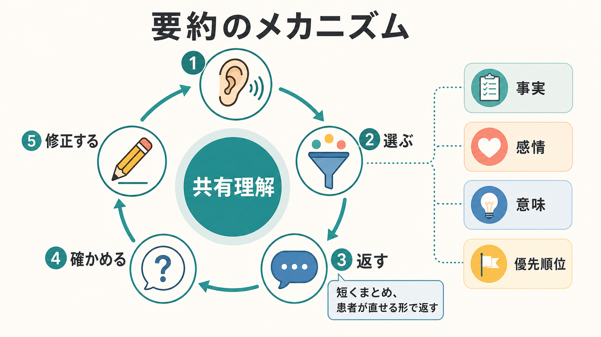

# 要約は面接でなぜ重要なのか

## 要点

- 要約は、患者の語りを面接者の理解として短く返し、患者が修正できる形にする技法である。
- 精神科面接では、症状だけでなく、時間経過、生活背景、感情、意味づけ、危険因子、希望を同時に扱うため、要約が面接の「整理」と「共有理解」の中継点になる。
- よい要約は、患者の語りを奪わず、次の問いを自然に開く。
- 要約は診断のためだけでなく、治療同盟、アドヒアランス、共同意思決定、心理教育にも関係する。

## この記事で答える問い

このノートでは、精神科・心理臨床の面接で「なぜ要約が重要なのか」を扱う。特に、[[精神科初診で何を確認するべきか]]、[[現病歴はどのように構造化するべきか]]、[[生活歴はなぜ重要なのか]]のような情報収集の場面で、要約が単なる確認作業ではなく、患者と面接者が同じ地図を見るための技法であることを整理する。

## まず結論

要約は「話を短くまとめる」だけではない。面接者が、患者の語りの中から重要な要素を選び、暫定的な理解として返し、患者に「合っているか」「抜けているか」「言い換えるならどうか」を確認する行為である。臨床面接は、診断仮説を作る作業であると同時に、患者が自分の困りごとを言葉にし直す対話でもある。したがって要約は、情報収集、関係形成、診断、治療計画をつなぐ節目になる[1][2]。

特に精神科面接では、患者の訴えが、症状名、生活史、対人関係、身体症状、服薬、家族の視点、本人の意味づけとして混ざって語られることが多い。要約はその混線をほどき、「いま共有できていること」と「まだ確認が必要なこと」を分ける。

## 背景

臨床面接は、単なる会話ではなく、患者の苦痛を理解し、診断と治療方針を作るための目的をもった対話である。古典的な臨床面接論でも、病歴は診断仮説の形成、身体診察や検査の焦点化、治療関係の形成に重要だとされてきた[1]。患者中心の面接法では、集めた情報を生物心理社会的な「患者の物語」として統合し、必要に応じて他者へ伝えられる形にまとめることが重視される[8]。精神科では、客観的検査だけでなく、患者の語り、観察、経過、生活機能、対人文脈を統合する必要があるため、面接中に情報を整理する力が診断精度に直結しやすい。

医療面接の教育では、患者の話を聴く、情報を集める、患者の視点を理解する、情報を共有する、問題と計画について合意する、といった課題が重要な要素として整理されている[2]。要約はこの複数の課題を横断する。たとえば、情報収集では「構造化と明確化」、計画合意では「理解確認」として働く。

## 基本概念

要約とは、患者の発言をそのまま反復することではない。反復は「今の言葉を聞いた」と示す短い応答であり、反映は感情や意味を汲んで返す応答である。要約は、それらを含みつつ、複数の発言を束ねて、面接の現在地を示す応答である。

たとえば、患者が「眠れない」「仕事でミスが増えた」「家族には言えていない」「薬は怖い」と話したとき、要約は次のようになる。

> ここまで伺うと、眠れなさと仕事でのミスが続いていて、家族にはまだ十分に話せていない。一方で、薬には不安がある、ということですね。いま一番困っているのは、仕事への影響という理解で合っていますか。

この応答には、事実の整理、感情の承認、優先順位の確認、次の探索の入口が含まれている。動機づけ面接の OARS でも、要約は開かれた質問、是認、反映と並ぶ中核技能として位置づけられ、患者中心の対話を保ちながら重要なテーマを整理するために使われる[3]。

## 仕組み

要約は、少なくとも五つの処理から成る。

1. 聴く  
   患者の言葉、沈黙、感情、身体的表現、話題の順序を聴く。

2. 選ぶ  
   すべてを入れず、今回の面接目的に関係する要素を選ぶ。精神科初診なら、主訴、発症時期、増悪・軽快因子、生活機能、リスク、既往、支援資源を優先する。

3. 返す  
   面接者の理解として短く返す。「つまり」と断定するより、「ここまででは」「私の理解では」と暫定性を残す。

4. 確かめる  
   「合っていますか」「抜けているところはありますか」「言い方を変えるとどうでしょう」と確認する。

5. 修正する  
   患者の訂正を受けて、理解を更新する。ここで患者が「違います」「本当はそこではなく」と言えること自体が、面接の安全性を高める。

この仕組みは、AHRQ が示す teach-back とも近い。teach-back は、説明が患者に伝わったかを患者自身の言葉で確認し、誤解があれば説明し直す方法である[4]。要約は方向が少し異なり、患者の語りを臨床家がいったん返す技法だが、どちらも「理解できましたか」と閉じた質問で済ませず、相互理解を行動として確認する点が共通している。

## 図解

### 要約の三つの機能

| 機能 | 面接で起きること | 失敗すると起きること |
|---|---|---|
| 整理 | 話題、時系列、症状、生活背景が見える | 情報が散らばり、診断仮説が曖昧になる |
| 確認 | 患者が誤解や不足を修正できる | 面接者の早合点が固定される |
| 橋渡し | 次の質問、心理教育、治療方針に進める | 話題転換が唐突になり、患者が置き去りになる |

### 使いやすい型

- 収集型: 「ここまでに、A、B、C がありました」
- 感情統合型: 「症状だけでなく、先が見えない不安も大きいのですね」
- 時系列型: 「最初は眠れなさ、その後に欠勤、最近は希死念慮が出ている、という流れですね」
- 両価性型: 「受診したい気持ちと、薬への抵抗感の両方があるのですね」
- 移行型: 「ここまでを整理すると、次に確認したいのは安全面と支援体制です」

## 臨床・研究との接続

### 診断との接続

要約は、[[操作的診断とは何か]]や[[鑑別診断とは何か]]の前段階で働く。診断基準に当てはめる前に、患者の語りを、症状、時間経過、機能障害、除外すべき身体疾患・物質使用・環境要因に分ける必要がある。要約によって、患者は「それは症状というより、職場での出来事の後からです」などと補正できる。

### 治療同盟との接続

精神医療では、治療同盟とコミュニケーションが治療継続やアドヒアランスと関係することが示されている[5]。要約は、面接者が患者の話を理解しようとしていることを具体的に示すため、単なる共感的態度よりも検証可能な関係形成になる。

### アドヒアランスとの接続

医師患者コミュニケーションと治療アドヒアランスの関連を検討したメタ分析では、コミュニケーションが良好な場合にアドヒアランスが高い傾向が示され、コミュニケーション訓練もアドヒアランス改善と関連した[6]。要約だけでアドヒアランスが決まるわけではないが、方針説明の前に患者の理解、懸念、優先順位を整理することは、共同意思決定の土台になる。

### 共感との接続

共感的で肯定的なコミュニケーションに関するランダム化試験のメタ分析では、痛み、不安、満足度などに小さいが有意な改善が報告されている[7]。要約は、共感を「わかります」と言うだけで終わらせず、「何をどう理解したか」を患者に返す方法である。そのため、感情的理解と認知的整理を同時に行いやすい。

### 生物心理社会モデルとの接続

[[生物心理社会モデルとは何か]]では、生物学的要因、心理的要因、社会的要因を統合して理解する。要約は、この統合を面接中に小さく実行する技法である。たとえば「不眠、職場ストレス、家族に話せない孤立感が重なっている」という要約は、症状だけでなく、維持因子と支援資源の不足を同時に示す。

## よくある誤解

### 誤解1: 要約は面接の最後だけにする

最後のまとめは重要だが、要約は途中でも使う。むしろ、話題が増えすぎたとき、感情が強くなったとき、診断上の重要点に入る前、治療方針へ移る前に短く挟むと効果が高い。

### 誤解2: 要約は長く詳しいほどよい

長すぎる要約は、患者の語りを面接者の整理で上書きする。要約は、患者が「はい」「少し違います」と返せる長さにする。目安は、話題を三つ程度に絞ることである。

### 誤解3: 要約すると患者の自由な語りが止まる

要約が断定的だと止まる。しかし、暫定的に返して確認を求める要約は、むしろ患者が訂正しやすくなる。「違っていたら直してください」と添えるだけでも、面接の主導権を患者に戻せる。

### 誤解4: 要約は診断名を早く付けるための技法である

要約は診断に役立つが、診断名へ急ぐための技法ではない。患者の経験を、症状、文脈、意味、希望に分けて扱うための技法である。診断名を出す前に、患者が何を問題として感じているかを確認する必要がある。

## 実践のコツ

- 「私の理解では」「ここまでを整理すると」と暫定性を示す。
- 事実、感情、意味、優先順位を一つずつ入れる。
- 患者の言葉を一部残す。専門用語だけに置き換えない。
- 危険性や安全確認に移る前は、移行型の要約を使う。
- 「合っていますか」だけでなく、「抜けていることはありますか」と聞く。
- 患者が訂正したら、訂正内容を再要約する。

## 関連ノート

- [[精神科初診で何を確認するべきか]]
- [[現病歴はどのように構造化するべきか]]
- [[生活歴はなぜ重要なのか]]
- [[精神科診断は何のためにあるのか]]
- [[操作的診断とは何か]]
- [[鑑別診断とは何か]]
- [[生物心理社会モデルとは何か]]

## MOC更新候補

- `content/00_MOC/MOC｜総合入口.md`
- 精神医学・面接・診断に関する MOC が統合ジョブで更新される場合、本記事を「精神科面接」「臨床コミュニケーション」「診断過程」のいずれかに追加する候補とする。

## 理解チェック

1. 要約と単なる反復は何が違うか。
2. 要約の中に「事実」だけでなく「感情」や「意味」を入れる利点は何か。
3. 患者が要約を訂正したとき、面接者はどのように応答するとよいか。
4. 要約が診断面接と治療同盟の両方に関係する理由は何か。

## 未解決問題

- 要約技法単独の効果を、診断精度、患者満足度、治療継続率で分離して測定する研究は限られる。
- 精神科救急、認知症、発達特性、通訳を介した面接などでは、要約の長さ、頻度、言語的複雑さをどう調整するかが課題になる。
- 電子カルテ入力や構造化面接と、患者に返す自然言語の要約をどう両立させるかは、今後の臨床教育上の課題である。

## 参考文献

[1] Lichstein, P. R. (1990). The Medical Interview. In *Clinical Methods: The History, Physical, and Laboratory Examinations* (3rd ed.). NCBI Bookshelf. https://www.ncbi.nlm.nih.gov/books/NBK349/

[2] Makoul, G. (2001). Essential elements of communication in medical encounters: The Kalamazoo consensus statement. *Academic Medicine*, 76(4), 390-393. https://doi.org/10.1097/00001888-200104000-00021

[3] Agency for Healthcare Research and Quality. (2018). Building Rapport with Patients: OARS Communication Skills. https://www.ahrq.gov/evidencenow/tools/oars-model.html

[4] Agency for Healthcare Research and Quality. (2023). Use the Teach-Back Method: Tool 5. https://www.ahrq.gov/health-literacy/improve/precautions/tool5.html

[5] Thompson, L., & McCabe, R. (2012). The effect of clinician-patient alliance and communication on treatment adherence in mental health care: A systematic review. *BMC Psychiatry*, 12, 87. https://doi.org/10.1186/1471-244X-12-87

[6] Zolnierek, K. B. H., & DiMatteo, M. R. (2009). Physician communication and patient adherence to treatment: A meta-analysis. *Medical Care*, 47(8), 826-834. https://doi.org/10.1097/MLR.0b013e31819a5acc

[7] Howick, J., Moscrop, A., Mebius, A., et al. (2018). Effects of empathic and positive communication in healthcare consultations: A systematic review and meta-analysis. *Journal of the Royal Society of Medicine*, 111(7), 240-252. https://doi.org/10.1177/0141076818769477

[8] Smith, R. C., Fortin, A. H., Dwamena, F., & Frankel, R. M. (2019). Summarizing and Presenting the Patient's Story. In *Smith's Patient-Centered Interviewing* (4th ed.). McGraw Hill Medical. https://accessmedicine.mhmedical.com/content.aspx?bookid=2446&sectionid=193676936
