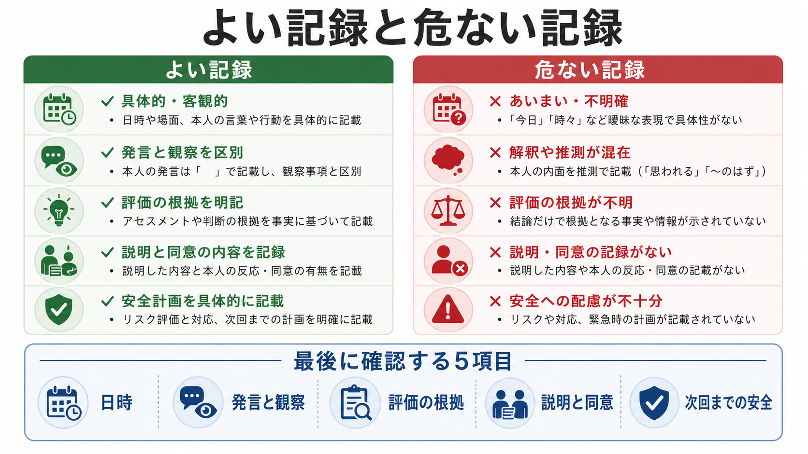

# 診療録は精神科でどう書くべきか

## 要点

- 診療録は「思ったことのメモ」ではなく、あとから第三者が診療過程を追える公的な医療記録である。
- 精神科では、本人の語り、観察された精神状態、臨床判断、リスク評価、説明と合意、次回までの計画を区別して書く。
- SOAP は、主観情報、客観情報、評価、計画を分けるための基本骨格として有用である[5]。
- 法的には、医師は診療したとき遅滞なく診療録を記載し、一定期間保存する義務を負う[1]。記載事項には診療年月日、病名・主要症状、処方・処置などが含まれる[2]。
- 電子カルテでは、読めること、改ざんされないこと、必要な期間保存されることを支える運用が重要である[3]。


## この記事で答える問い

この記事では、[[精神科面接とは何か]]で得られた情報を、どのように診療録へ変換するかを扱う。中心となる問いは次の4つである。

1. 主観情報と客観所見をどう分けるか。
2. 評価、診断仮説、リスク判断をどう根拠づけるか。
3. 説明、同意、共同意思決定をどう記録するか。
4. 法的・倫理的に危うい記載をどう避けるか。

## まず結論

精神科診療録は、**S: 本人や家族が述べたこと、O: 観察・検査・精神状態診察、A: それらに基づく評価、P: 説明・合意・治療計画・安全計画**に分けて書くと破綻しにくい。とくに重要なのは、発言、観察、推論、方針を混ぜないことである。

たとえば「被害的である」とだけ書くより、「本人は『隣人が監視している』と述べる。面接中は周囲を頻回に確認し、声量は小さい。幻聴は否定。現時点では被害関係念慮を疑うが、睡眠不足、物質使用、器質性要因を含めて評価を継続する」と書くほうが、臨床判断の根拠が残る。

## 背景

診療録には、臨床、チーム内連携、患者への説明、保険診療、法的検証、医療安全という複数の役割が重なっている。CMS の E/M 記録要件でも、診療理由、関連する病歴・診察所見、評価または診断、検査等を依頼する理由、ケア計画、診療日、記載者の識別などが、基本的な医療記録要素として整理されている[7]。

精神科では、記録の難しさがさらに増す。本人の主観的体験、面接者の観察、家族や支援者からの情報、リスク評価、文化的背景、同意能力、守秘義務が同じ面接内で交差するからである。したがって、[[守秘義務とは何か]]、[[インフォームドコンセントは精神科でどう行うのか]]、[[共同意思決定とは何か]]と接続しながら、診療録を「説明可能な臨床判断の履歴」として作る必要がある。

## 基本概念

### S: 主観情報

主観情報には、本人の訴え、本人が意味づけている困りごと、症状の経過、生活上の影響、治療への希望、不安、拒否感、家族や支援者からの情報を記録する。本人の発言は、重要なところだけ短く引用する。

よい記載は、「抑うつ的」と断定する前に、「本人は『朝が特につらく、仕事に行けない』と述べる」のように、本人の言葉と臨床用語を区別する。SOAP の S は患者や近接者から得た経験・見解・感情を置く欄であり、評価の文脈を与える[5]。

### O: 客観所見

客観所見には、面接中に観察された外観、行動、発話、気分・感情、思考過程、思考内容、知覚、認知、病識、判断、バイタル、検査、薬剤情報などを置く。精神科では、この部分の中心が精神状態診察である。

精神状態診察は、外観、行動、運動、発話、気分、感情、思考過程、思考内容、知覚、認知、病識、判断などを通じて、現在の精神機能を構造的に記述する方法である[6]。[[精神科初診で何を確認するべきか]]や[[精神科診断における除外診断とは何か]]の土台にもなる。

### A: 評価

評価では、S と O を統合し、診断仮説、鑑別、重症度、生活機能、リスク、治療反応を記録する。ここでは「何を根拠にそう判断したか」を省略しない。

「うつ病」だけでなく、「2か月以上の抑うつ気分、興味低下、不眠、食欲低下、職業機能低下があり、躁病エピソードは現時点で明らかでない。甲状腺機能、薬剤性、物質使用は未評価のため確認予定」のように、根拠と未確認事項を分ける。これは[[精神科診断は何のためにあるのか]]、[[鑑別診断とは何か]]、[[ケースフォーミュレーションとは何か]]に接続する。

### P: 計画

計画には、治療方針、処方、心理社会的支援、検査、紹介、家族連携、危機時対応、次回までの観察点、説明と同意を記録する。計画は「医師が決めたこと」だけではなく、本人と共有された次の一手である。

処方や検査だけでなく、「本人に選択肢、期待される効果、主な副作用、代替案、未治療時のリスクを説明し、本人は理解を示し同意した」など、説明と反応を残す。精神科では、同意能力が揺らぐ場面もあるため、[[意思決定能力とは何か]]や[[同意能力の評価はどのように行うのか]]との接続が重要である。

## 仕組み

精神科診療録の核心は、**観察から記録への変換**である。面接では情報が混ざって入ってくるが、記録では次の順に整理する。


1. **情報源を明示する**  
   本人、家族、紹介状、検査、過去カルテ、支援者のどこから来た情報かを書く。食い違いがある場合は、無理に一つへまとめず、「本人はAと述べるが、家族はBと述べる」と分ける。

2. **事実と推論を分ける**  
   「落ち着きなく室内を歩く」は観察であり、「焦燥が強い」は評価である。「虚言」など価値判断を含む語は避け、確認できた行動、発言、矛盾、背景を記録する。

3. **リスクを静的にラベル化しない**  
   [[自殺リスク評価では何を聞くべきか]]や[[他害リスク評価では何を見るべきか]]では、念慮、計画、手段、過去歴、保護因子、支援、酩酊、衝動性、最近の喪失などを文脈化する。NICE は自傷後の評価で、単純なリスク尺度や総合点だけで退院可否や支援水準を決めないことを推奨している[8]。記録でも「低リスク」とだけ書かず、根拠と安全計画を書く。

4. **計画を検証可能にする**  
   次回確認する症状、薬剤副作用、生活上の目標、危機時の連絡先、再診間隔を具体化する。本人が同意していない計画、理解が不十分な計画、実行手段がない計画は、そのまま安全な計画とはいえない。

## 図解



| 観点 | よい記録 | 危ない記録 |
|---|---|---|
| 発言 | 重要な発言を短く引用する | 面接者の解釈だけを書く |
| 観察 | 外観、発話、行動、感情などを具体化する | 「普通」「問題なし」で済ませる |
| 評価 | 根拠、鑑別、未確認事項を書く | 診断名だけを書く |
| リスク | 危険因子、保護因子、安全計画を書く | 「希死念慮なし」の一語だけで終える |
| 説明 | 説明内容、本人の反応、合意を残す | 処方や指示だけを書く |
| 法的配慮 | 日時、記載者、訂正履歴、保存性を意識する | 後日まとめ書きし、経過が追えない |

## 臨床・研究との接続

診療録は、個人診療のためだけでなく、チーム医療と医療安全の基盤でもある。たとえば、入院、救急、外来、訪問、心理士面接、家族面接がつながる場面では、記録が不明確だと、同じ質問の反復、薬剤変更理由の喪失、リスク評価の断絶が起こる。

研究や教育に用いる場合も、個人情報保護への配慮が必要である。個人情報保護委員会・厚生労働省の医療・介護分野ガイダンスは、診療録等の形態に整理されていない情報でも、医療・介護関係事業者が保有する医療・介護関係情報は個人情報に該当し得ると整理している[4]。症例検討や教育資料では、匿名化、利用目的、アクセス範囲、同意または倫理的手続きの確認が必要になる。

電子カルテでは、診療録の内容だけでなく、誰が、いつ、どのように記録・修正・閲覧したかを管理する仕組みが重要である。厚生労働省の医療情報システム安全管理ガイドラインは、医療情報を扱うシステムの安全管理を求め、電子保存に関して見読性・真正性・保存性という観点を重視している[3]。

## よくある誤解

### 「詳しく書けば書くほどよい」

過剰な貼り付けや定型文は、重要情報を埋もれさせる。SOAP ノートは情報を整理し、臨床推論と次の行動を見つけやすくするための構造であり、長文化そのものが目的ではない[5]。

### 「精神科では主観的なので客観所見は少ない」

精神科でも客観所見は多い。表情、姿勢、視線、発話量、発話速度、沈黙、まとまり、注意、見当識、面接への協力度などは観察可能である。問題は「客観所見がない」ことではなく、観察と言い換えを区別して記録できているかである。

### 「リスクは高・中・低で十分」

リスク分類だけでは、次の行動に結びつきにくい。自傷や自殺念慮を扱う場合は、危険因子、保護因子、本人の意図、手段へのアクセス、支援資源、危機時対応、再評価時期を記録する。単純な点数やラベルだけに依存しないことが重要である[8]。

### 「自分用メモと診療録は同じでよい」

診療録は、患者、他職種、監査、法的検証の対象になり得る。心理療法的な仮説、面接者の私的反応、第三者に関する詳細情報は、治療上必要か、一般診療録に残すべきか、最小限で足りるかを吟味する必要がある。

## 実践テンプレート

```text
S:
- 本人の主訴・困りごと:
- 経過:
- 本人の言葉:
- 家族・支援者情報:
- 本人の希望・懸念:

O:
- 外観・行動:
- 発話:
- 気分・感情:
- 思考過程・思考内容:
- 知覚:
- 認知・病識・判断:
- 身体所見・検査・薬剤:

A:
- 主要な評価:
- 鑑別・除外すべき病態:
- 自傷・他害・セルフネグレクト等のリスク:
- 生活機能・社会的文脈:
- 未確認事項:

P:
- 説明した内容:
- 本人の理解・同意・不同意:
- 治療・検査・紹介:
- 安全計画・危機時対応:
- 次回までの観察点:
- 再診・連絡計画:
```

## 関連ノート

- [[精神科面接とは何か]]
- [[精神科初診で何を確認するべきか]]
- [[現病歴はどのように構造化するべきか]]
- [[精神科診断は何のためにあるのか]]
- [[ケースフォーミュレーションとは何か]]
- [[自殺リスク評価では何を聞くべきか]]
- [[他害リスク評価では何を見るべきか]]
- [[インフォームドコンセントは精神科でどう行うのか]]
- [[守秘義務とは何か]]
- [[共同意思決定とは何か]]
- [[生物心理社会モデルとは何か]]

## MOC更新候補

- `content/00_MOC/` 配下の精神医学、臨床実践、面接・診断に関する MOC へ追加候補。
- 並列ジョブとの競合を避けるため、本記事では MOC 本体は更新していない。

## 理解チェック

1. 「本人は落ち込んでいるようだ」と「本人は『何をしても楽しくない』と述べる」は、SOAP のどこに入るか。
2. 「希死念慮なし」とだけ書く記録には、どのような不足があるか。
3. 診療録に心理療法中の詳細な私的内容を書く前に、何を検討すべきか。
4. 電子カルテで見読性・真正性・保存性が問題になるのはなぜか。

## 未解決問題

- 日本の精神科実務において、心理療法的な私的メモと一般診療録をどこまで分けるべきかは、施設方針、法令、開示対応、治療形態によって運用差がある。
- AI 音声入力や自動要約を診療録に使う場合、誤記、同意、監査証跡、個人情報保護、責任所在をどう扱うかは、今後さらに実務整理が必要である。
- リスク評価の記録は、防衛的な長文化と、臨床的に使える簡潔さのバランスをどう取るかが課題である。

## 参考文献

[1] e-Gov法令検索. 医師法. https://laws.e-gov.go.jp/law/323AC0000000201

[2] e-Gov法令検索. 医師法施行規則. https://laws.e-gov.go.jp/law/323M40000100047

[3] 厚生労働省. 医療情報システムの安全管理に関するガイドライン 第6.0版. 2023. https://www.mhlw.go.jp/stf/shingi/0000516275_00006.html

[4] 個人情報保護委員会・厚生労働省. 医療・介護関係事業者における個人情報の適切な取扱いのためのガイダンス. https://www.ppc.go.jp/personalinfo/legal/iryoukaigo_guidance/

[5] Podder V, Lew V, Ghassemzadeh S. SOAP Notes. StatPearls. 2023. https://www.ncbi.nlm.nih.gov/books/NBK482263/

[6] Voss RM, Das JM. Mental Status Examination. StatPearls. 2024. https://www.ncbi.nlm.nih.gov/sites/books/n/statpearls/article-24998/

[7] Centers for Medicare & Medicaid Services. Evaluation & Management Services. https://www.cms.gov/training-education/medicare-learning-networkr-mln/compliance/medicare-provider-compliance-tips/evaluation-management-services

[8] National Institute for Health and Care Excellence. Self-harm: assessment, management and preventing recurrence. NICE Guideline NG225. 2022. https://www.ncbi.nlm.nih.gov/books/NBK588208/
