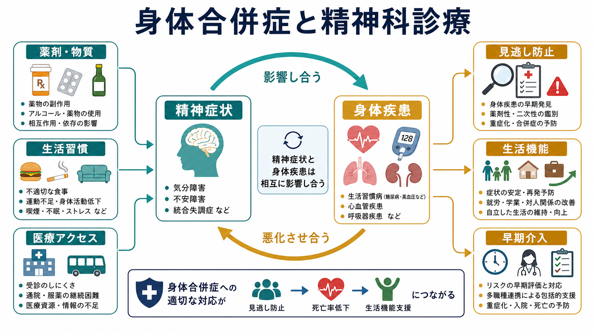
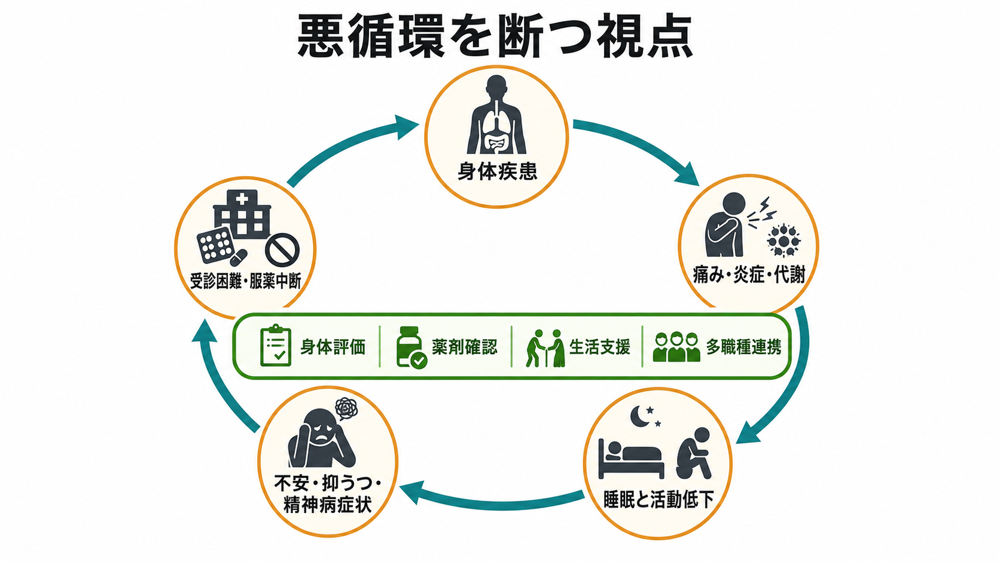
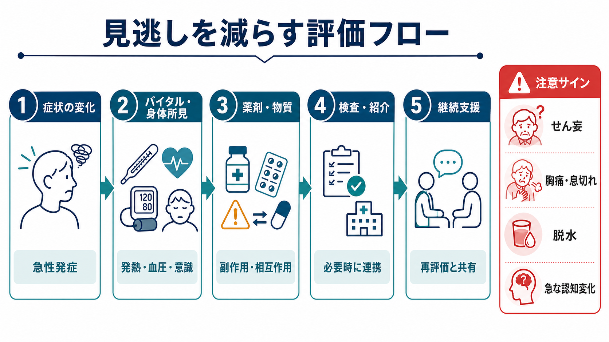

# 身体合併症は精神科診療でなぜ重要なのか

## 要点

- 身体合併症は、精神科診療の「周辺問題」ではない。精神症状の原因、増悪因子、治療反応、安全性、生活機能、死亡率に直接関わる。
- 重い精神疾患をもつ人では、心血管疾患、糖尿病、呼吸器疾患、感染症、物質使用、薬剤関連問題などが重なりやすく、平均寿命の短縮にも関わることが示されている[1][2]。
- 身体疾患が精神症状として見える場合がある。せん妄、内分泌・代謝異常、感染、低酸素、薬剤性症状、神経疾患などは、[[器質性精神障害を見逃さないためには何を見るべきか]]と同じく常に鑑別に入る[6]。
- 精神科診断がある人ほど、訴えが「精神症状の一部」と解釈され、身体疾患の評価が遅れることがある。これは診断オーバーシャドーイングとして整理される[5]。
- 身体評価は、個別診断や治療指示を機械的に決める作業ではなく、安全確認、鑑別診断、薬剤選択、生活支援、多職種連携の基盤である。

## この記事で答える問い

1. なぜ精神科診療で身体合併症を重視する必要があるのか。
2. 身体疾患はどのように精神症状を作り、精神症状はどのように身体疾患を悪化させるのか。
3. 見逃しを減らすために、面接・観察・検査・連携では何を考えるべきか。
4. 身体合併症を扱うとき、どのような誤解を避けるべきか。

## まず結論

身体合併症が重要なのは、精神症状と身体疾患が**別々の箱に入った問題ではなく、同じ人の中で相互に増幅しうる問題**だからである。たとえば、糖尿病や心血管疾患は気分、疲労、睡眠、認知機能に影響しうる。逆に、うつ病、統合失調症、双極性障害、不安症、依存症などは、活動量、食事、喫煙、飲酒、受診行動、服薬継続、社会的孤立を通じて身体疾患のリスクを高めうる[1][2]。

したがって、精神科診療で身体合併症を見ることは「精神科が内科の代わりをする」ことではない。重要なのは、精神症状だけを見て終わらず、[[精神科初診で何を確認するべきか]]、[[鑑別診断とは何か]]、[[精神科診断における除外診断とは何か]]の実践として、身体状態、薬剤、物質使用、生活機能、医療アクセスを同時に確認することである。

## 背景

精神疾患は、苦痛や機能障害だけでなく、身体健康の不利益とも結びつく。WHO の重症精神障害に関するガイドラインは、重症精神障害をもつ人では予防可能な身体疾患による早期死亡が大きな問題であり、平均寿命が 10-20 年短縮しうると整理している[1]。Lancet Psychiatry Commission も、身体疾患リスク、医療アクセスの不平等、生活習慣、薬剤、スティグマ、サービス分断が複合して、精神疾患をもつ人の身体健康格差を作ると論じている[2]。

この問題は重症精神障害だけに限られない。うつ病や不安症でも、睡眠、疼痛、消化器症状、心血管リスク、物質使用、慢性疾患管理の困難が重なりうる。精神科診療では、本人の語り、精神状態診察、身体疾患、薬剤、生活史、家族・社会環境を統合して理解する必要がある。これは[[生物心理社会モデルとは何か]]の実践的な使いどころである。

## 基本概念

### 身体合併症

身体合併症とは、精神疾患や精神症状と同時に存在する身体疾患、身体症状、身体機能の問題を指す。糖尿病、高血圧、脂質異常症、肥満、心血管疾患、呼吸器疾患、慢性疼痛、感染症、肝腎機能障害、妊娠・産褥関連問題、神経疾患、内分泌疾患などが含まれる。

ただし、ここでいう「合併」は単に病名が複数あるという意味ではない。精神症状の原因になっている身体疾患、精神症状によって管理が難しくなった身体疾患、精神科薬物療法の副作用として起きた身体問題、生活習慣や医療アクセスを介して悪化した身体問題を分けて考える必要がある。これは[[併存症とは何か]]の臨床的な応用である。

### 見逃しと診断オーバーシャドーイング

診断オーバーシャドーイングとは、精神疾患の診断やラベルがあるために、身体症状や新しい変化が精神症状として過剰に説明され、必要な評価が遅れる現象を指す。質的研究のシステマティックレビューでは、精神疾患をもつ人と医療者の双方の経験として、身体訴えが軽視される、説明が十分に聞かれない、専門領域間で責任が分断されるといった問題が整理されている[5]。

この見逃しは、本人の訴え方だけの問題ではない。スティグマ、時間不足、救急・身体科・精神科の分断、記録共有の不足、医療者の先入観、本人の受診困難、経済的障壁、認知機能や陰性症状による自己管理困難などが重なる。

### 精神症状を作る身体疾患

身体疾患は、意識、注意、気分、不安、知覚、思考、行動を変えることがある。典型例はせん妄であり、急性の注意・意識・認知の変化として現れ、感染、代謝異常、低酸素、薬剤、手術、脱水など複数因子で生じうる[6]。高齢者では、せん妄がうつ病、認知症、精神病症状と誤認されることもある。

精神科診療では、精神症状があることと、身体疾患がないことは同義ではない。発症が急性、日内変動が強い、意識や注意が変動する、発熱・低酸素・脱水・疼痛がある、神経学的徴候がある、薬剤変更後に始まった、これまでの経過と合わない場合には、身体疾患や薬剤性要因を優先して考える。

## 仕組み

身体合併症が精神科診療で重要になる仕組みは、少なくとも 5 つに分けられる。

### 1. 共通リスク因子

貧困、孤立、トラウマ、慢性ストレス、睡眠不足、物質使用、喫煙、運動不足、食環境、医療アクセスの不足は、精神症状と身体疾患の両方に関わる。精神疾患と身体疾患は、別々に発生した偶然の組み合わせではなく、共通の背景要因から同時に出やすくなる場合がある[2]。

### 2. 身体疾患から精神症状への影響

炎症、疼痛、内分泌・代謝異常、低酸素、貧血、感染、神経疾患、薬剤副作用は、疲労、焦燥、不眠、抑うつ、認知機能低下、幻覚、妄想、混乱として現れることがある。ここで精神症状だけを切り取ると、原因治療が遅れる。[[精神疾患とは何か]]を考える際にも、精神症状が身体と無関係な現象ではないことを押さえる必要がある。

### 3. 精神症状から身体疾患への影響

抑うつや陰性症状が強いと、受診、食事、運動、服薬、禁煙、睡眠、セルフケアが難しくなる。不安やパニックは身体感覚への過覚醒を高める一方で、受診回避を招くこともある。精神病症状や躁状態では、身体症状の評価、服薬管理、危険行動の抑制が難しくなる場合がある。

### 4. 薬剤・物質使用の影響

抗精神病薬、気分安定薬、抗うつ薬、抗不安薬、睡眠薬、抗コリン作用薬、ステロイド、ドパミン作動薬、市販薬、アルコール、カフェイン、ニコチン、違法薬物は、精神症状と身体状態の両方に影響しうる。重症精神障害の身体疾患管理では、糖尿病、心血管疾患、体重、喫煙、物質使用、感染症、薬物相互作用などを体系的に扱う必要がある[1][4]。

ここでは[[アドヒアランスとは何か]]や[[コンコーダンスとは何か]]の視点も重要である。副作用や身体不調を本人が訴えにくい状況では、服薬中断、過量服薬、自己調整が起こりやすくなる。薬剤の説明は「飲むべき」と指示するだけでなく、効果、副作用、身体リスク、本人の生活上の困りごとを一緒に整理する作業である。

### 5. 医療システムの分断

精神科、身体科、救急、地域支援、福祉、家族支援が分断されると、誰が身体評価を行い、誰が検査結果を追い、誰が服薬変更を共有するのかが曖昧になる。De Hert らは、重症精神疾患をもつ人の身体疾患について、患者側、医療者側、治療側、システム側の障壁が認識・管理の遅れに関わると整理している[3]。

## 図解

上の 1 枚目は、身体合併症を「精神症状」「身体疾患」「薬剤・物質」「生活習慣」「医療アクセス」の交差点として示している。ポイントは、身体合併症への対応が、見逃し防止だけでなく、死亡率低下、生活機能支援、早期介入につながることである。

2 枚目は、身体疾患と精神症状が悪循環を作る機序を示している。身体疾患が疼痛、炎症、代謝変化、睡眠障害を通じて精神症状を悪化させ、精神症状が受診困難や服薬中断を通じて身体疾患を悪化させる。この循環は、身体評価、薬剤確認、生活支援、多職種連携で断ち切ることができる。

3 枚目は、見逃しを減らす評価フローである。急性発症、バイタル異常、意識変容、薬剤変更、物質使用、検査や紹介の必要性、再評価の予定を確認する。特に「急な認知変化」「胸痛・息切れ」「脱水」「せん妄」は、精神科的説明だけで済ませない注意サインである。

## 臨床・研究との接続

### 初診・再診で何を見るか

身体合併症を見逃さないためには、初診だけでなく再診でも「変化」を見る。次の問いは、精神科面接の中で確認しやすい。

| 領域 | 確認すること | 見逃し防止につながる問い |
|---|---|---|
| 時間経過 | 急性発症、日内変動、急な悪化 | いつから、どの速さで変わったか |
| 意識・注意 | ぼんやり、見当識、注意の変動 | いつもと違う混乱や眠気はあるか |
| 身体症状 | 発熱、疼痛、息切れ、胸痛、脱水、転倒 | 身体のどこに変化があるか |
| 薬剤 | 新規薬、増減、中止、市販薬、相互作用 | 薬を変えてから始まっていないか |
| 物質使用 | アルコール、カフェイン、ニコチン、薬物 | 量、頻度、経路、離脱はどうか |
| 慢性疾患 | 糖尿病、心血管疾患、呼吸器疾患など | 治療中断や検査未受診はないか |
| 医療アクセス | 通院困難、費用、移動、支援者 | 受診や検査を妨げる要因は何か |

APA の成人精神科評価ガイドラインは、精神状態、既往歴、物質使用、身体健康、機能、文化的・社会的背景などを含む包括的評価を重視している[7]。精神科評価は、精神症状のリストを作るだけではなく、身体疾患や薬剤影響を含む臨床判断の土台を作る作業である。

### 抗精神病薬と身体モニタリング

抗精神病薬を使う場合、体重、血圧、血糖、脂質、心血管リスク、錐体外路症状、鎮静、便秘、性機能、月経、喫煙状況などを継続的に確認する必要がある。NICE の精神病・統合失調症ガイドラインは、併存する健康問題の確認、身体健康問題の予防・治療、継続的な身体健康チェックを推奨している[8]。

これは薬物療法を避けるという意味ではない。薬物療法が有益な場合は多いが、効果だけでなく身体リスクを見ながら、本人と相談し、必要に応じて身体科・薬剤師・看護師・地域支援者と連携する必要がある。

### 研究での意味

研究では、身体合併症を無視すると、精神疾患の原因、治療反応、予後、生活機能を誤って推定する可能性がある。たとえば、抑うつ症状の重症度が高い集団でも、疼痛、炎症、睡眠障害、糖尿病、薬剤副作用、社会的孤立の構成が異なれば、必要な介入は変わる。

したがって、研究では診断名だけでなく、身体疾患、薬剤、物質使用、生活習慣、医療アクセス、社会的決定要因を測定し、どの要因がどの経路で症状や機能に関わるのかを検討する必要がある。これは[[精神医学とは何か]]が扱う「人間を医学・心理・社会の交差点で見る」課題そのものである。

## よくある誤解

### 誤解1: 身体合併症は身体科に任せればよい

身体科との連携は不可欠である。しかし、精神科診療で身体合併症を見ないまま紹介だけにすると、精神症状、薬剤、生活機能、受診困難が身体疾患管理にどう影響しているかが抜け落ちる。精神科の役割は、身体疾患の専門治療を置き換えることではなく、精神症状と生活の文脈を踏まえて見逃しを減らし、連携を成立させることである。

### 誤解2: 検査が正常なら身体要因は否定できる

検査は重要だが、正常値だけで身体要因を完全に否定できるわけではない。発症様式、経過、バイタル、薬剤、神経学的所見、脱水、疼痛、睡眠、栄養、物質使用、生活機能を合わせて判断する必要がある。せん妄のように、複数の小さな要因が重なって起こる状態では、単一の検査異常だけで説明できないこともある[6]。

### 誤解3: 身体疾患を重視すると心理社会的理解が弱くなる

むしろ逆である。身体合併症を重視することは、心理社会的理解を身体から切り離さないという意味である。疼痛、糖尿病、睡眠障害、薬剤副作用、貧困、通院困難、孤立は、本人の気分、行動、対人関係、治療参加に影響する。[[共同意思決定とは何か]]の観点からも、身体状態と本人の価値観を一緒に扱う必要がある。

### 誤解4: 精神科診断がある人の身体訴えは「不安」や「身体化」と考えればよい

不安や身体症状症の評価が必要な場合はある。しかし、精神科診断がある人ほど身体疾患のリスクが低いわけではない。胸痛、息切れ、発熱、意識変容、神経症状、急な認知変化、脱水、転倒、薬剤変更後の症状は、精神科的説明の前に身体評価を要することがある。

## 関連ノート

既存ノート:

- [[精神医学とは何か]]
- [[精神疾患とは何か]]
- [[精神科初診で何を確認するべきか]]
- [[器質性精神障害を見逃さないためには何を見るべきか]]
- [[精神科診断における除外診断とは何か]]
- [[鑑別診断とは何か]]
- [[併存症とは何か]]
- [[生物心理社会モデルとは何か]]
- [[アドヒアランスとは何か]]
- [[コンコーダンスとは何か]]
- [[共同意思決定とは何か]]

今後の作成候補:

- 診断オーバーシャドーイングとは何か
- 精神科薬物療法で身体モニタリングはなぜ必要なのか
- せん妄と一次性精神疾患をどう見分けるか
- 精神疾患をもつ人の医療アクセス格差とは何か

MOC 更新候補:

- `content/00_MOC/MOC｜精神医学.md`
- `content/00_MOC/MOC｜臨床実践・治療.md`

並列ジョブとの衝突を避けるため、このタスクでは MOC 本体は更新しない。

## 理解チェック

1. 身体合併症が、精神症状の原因・増悪因子・治療安全性に関わる理由を 3 つ挙げられるか。
2. 診断オーバーシャドーイングとは何かを、精神科診療の例で説明できるか。
3. 急性の意識・注意の変化を見たとき、せん妄を疑う理由を説明できるか。
4. 抗精神病薬を使うとき、身体モニタリングが必要になる理由を説明できるか。
5. 身体合併症への対応を、本人との共同意思決定や多職種連携にどう接続できるか。

## 参考文献

[1] World Health Organization. (2018). *Management of physical health conditions in adults with severe mental disorders: WHO guidelines*. World Health Organization. https://www.who.int/publications/i/item/9789241550383

[2] Firth, J., Siddiqi, N., Koyanagi, A., Siskind, D., Rosenbaum, S., Galletly, C., et al. (2019). The Lancet Psychiatry Commission: a blueprint for protecting physical health in people with mental illness. *The Lancet Psychiatry, 6*(8), 675-712. https://doi.org/10.1016/S2215-0366(19)30132-4

[3] De Hert, M., Cohen, D., Bobes, J., Cetkovich-Bakmas, M., Leucht, S., Ndetei, D. M., et al. (2011). Physical illness in patients with severe mental disorders. II. Barriers to care, monitoring and treatment guidelines, plus recommendations at the system and individual level. *World Psychiatry, 10*(2), 138-151. https://doi.org/10.1002/j.2051-5545.2011.tb00036.x

[4] Gronholm, P. C., Chowdhary, N., Barbui, C., Das-Munshi, J., Kolappa, K., Thornicroft, G., et al. (2021). Prevention and management of physical health conditions in adults with severe mental disorders: WHO recommendations. *International Journal of Mental Health Systems, 15*, 22. https://doi.org/10.1186/s13033-021-00444-4

[5] Molloy, R., Brand, G., Munro, I., & Pope, N. (2023). Seeing the complete picture: A systematic review of mental health consumer and health professional experiences of diagnostic overshadowing. *Journal of Clinical Nursing, 32*(9-10), 1662-1673. https://doi.org/10.1111/jocn.16151

[6] Wilson, J. E., Mart, M. F., Cunningham, C., Shehabi, Y., Girard, T. D., MacLullich, A. M. J., et al. (2020). Delirium. *Nature Reviews Disease Primers, 6*, 90. https://doi.org/10.1038/s41572-020-00223-4

[7] American Psychiatric Association. (2016). *The American Psychiatric Association Practice Guidelines for the Psychiatric Evaluation of Adults* (3rd ed.). American Psychiatric Association. https://www.swmbh.org/wp-content/uploads/Psychiatric-Evaluation-APA-Clinical-Practice-Guideline.pdf

[8] National Institute for Health and Care Excellence. (2014). *Psychosis and schizophrenia in adults: prevention and management* (NICE Clinical Guideline CG178). https://www.nice.org.uk/guidance/cg178

## 未解決問題

- 精神疾患をもつ人の身体疾患モニタリングを、本人の負担を増やしすぎず、どの頻度・項目で標準化するのがよいか。
- 精神科、身体科、救急、地域支援の間で、検査結果・処方・リスク情報をどう共有すれば見逃しを減らせるか。
- 診断オーバーシャドーイングを減らす教育・チェックリスト・電子カルテ設計は、実際に予後を改善するか。
- 身体疾患管理の改善が、精神症状、生活機能、再入院、死亡率にどの程度影響するか。
