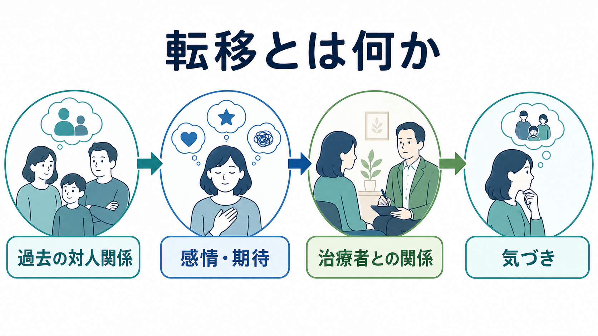
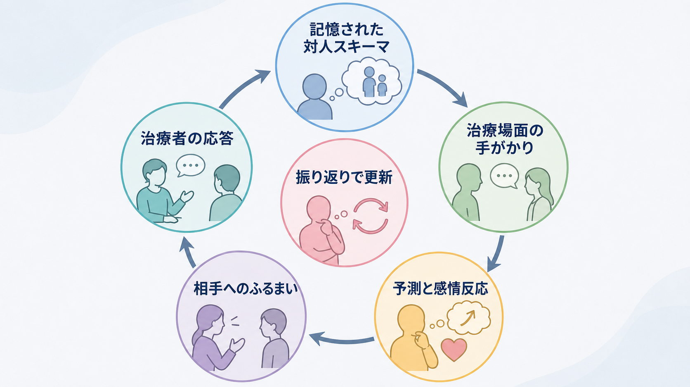
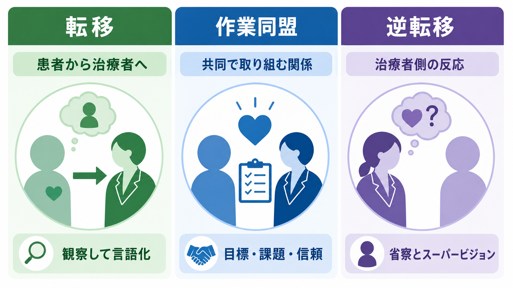

# 転移とは何か

## 要点

- 転移とは、患者が過去の重要な対人関係で身につけた感情、期待、恐れ、ふるまいのパターンを、治療者との現在の関係に向けて再現する現象である [1][2]。
- 転移は「患者が治療者を誤解している」という単純な意味ではない。現在の関係の中に、過去の関係モデルが入り込み、いま・ここで観察可能になることを指す。
- 転移を扱う目的は、患者を責めることではなく、反復される対人パターンを安全な枠組みの中で言語化し、理解し、必要に応じて変化の余地を作ることである [2][3]。
- 転移は力動的心理療法で中心概念として扱われるが、重要な他者の表象が新しい対人場面で活性化するという社会認知的現象としても研究されている [4][5]。
- 転移を扱うには、[[治療関係とは何か]]、[[精神科面接とは何か]]、[[共感的理解とは何か]]、[[生活歴はなぜ重要なのか]]への理解が土台になる。

## この記事で答える問い

1. 転移とは何か。
2. 転移はどのような仕組みで生じるのか。
3. 作業同盟、逆転移、単なる好意・不信とは何が違うのか。
4. 臨床や研究では、転移をどのように位置づけるべきか。

## まず結論

転移とは、患者が過去に重要だった人物との関係で形成した「相手はこう反応するはずだ」「自分はこう扱われるはずだ」「近づくと危ない／見捨てられる／支配されるかもしれない」といった予測や感情を、治療者との関係の中で再び経験することである。NLM の MeSH では、転移を、親やきょうだいなど早期の重要人物に結びついていた感情や態度が、心理療法家を含む他者へ無意識的に移される現象として定義している [1]。

ただし、転移は「過去の人物を治療者に重ねる」という一方向の比喩だけでは足りない。実際には、過去の関係で作られた感情、期待、自己像、相手像、身体感覚、回避、怒り、依存、試し行動などが、治療者との相互作用の中で形を取る。したがって転移は、記憶の内容というより、現在の関係で動いている対人パターンとして読む必要がある。

## 背景

転移は精神分析の歴史の中で発展した概念であり、当初は治療の妨げになるものとしても理解された。しかし現代の精神分析的・力動的心理療法では、転移はむしろ治療的変化の重要な素材として扱われる。StatPearls の概説でも、精神分析的技法には解釈、転移と逆転移の分析、技術的中立性が含まれ、転移は「過去の葛藤がセッション内のいま・ここで無意識的に反復されること」と説明されている [2]。

転移に注目する理由は、患者の対人困難が面接室の外だけで起きるとは限らないからである。たとえば「相手に迷惑をかけると見捨てられる」という予測を持つ人は、治療者にも本音を言えないかもしれない。「権威者は自分を支配する」という経験を持つ人は、治療者の質問を支配や批判として感じるかもしれない。このような反応は、患者の性格の欠点ではなく、過去の関係から学習された予測が現在の関係で働いている可能性として理解できる。

## 基本概念

### 転移

転移は、患者から治療者へ向かう感情や期待の再現である。そこには好意、理想化、依存、不信、怒り、羞恥、恐れ、見捨てられ不安、試し行動など、肯定的なものも否定的なものも含まれる。重要なのは、内容の善悪ではなく「その反応が、いまの治療者との関係だけで十分に説明できるか」「過去の重要な関係パターンと似ていないか」を検討する点にある。

Levy と Scala は、転移、転移解釈、転移焦点化心理療法を整理し、転移が精神力動的治療で中心的な技法的対象になることを論じている [3]。特に人格病理の治療では、患者が治療者をどのような相手として体験し、どのように反応するかが、自己像と他者像の統合に関わる重要な臨床情報になる。

### 作業同盟

作業同盟は、患者と治療者が治療目標、課題、信頼関係を共有しながら取り組む協働関係である。転移が「過去の関係パターンが現在の治療関係に入り込むこと」だとすれば、作業同盟は「現在の治療課題に共同で取り組む関係」である。両者は対立概念ではなく、同じ治療関係の異なる側面である。

作業同盟は心理療法のアウトカムと一貫して関連することが大規模メタ分析で示されている。Flückiger らは、成人心理療法の295研究、3万人超のデータを統合し、作業同盟と治療成績の間に安定した正の関連を報告している [6]。転移を扱うときも、作業同盟を壊してまで解釈を急ぐのではなく、同盟を保ちながら共同で検討することが重要である。

### 逆転移

逆転移は、治療者側に生じる感情、身体反応、思考、行動傾向である。現代的には、治療者の個人的反応だけでなく、患者との相互作用の中で引き出される反応も含めて考える。逆転移は、治療者が自分の反応を点検するための重要な手がかりになりうるが、未整理のまま行動化されると治療関係を損なう。

Hayes らのメタ分析では、逆転移反応は治療アウトカムと小さいが負の関連を持ち、逆転移をうまく管理できることは良いアウトカムと関連すると報告されている [8]。このため、転移を扱う臨床では、治療者自身の省察、記録、スーパービジョン、チーム内相談が重要になる。

## 仕組み

転移は、次のような循環として理解するとわかりやすい。

1. 過去の重要な対人関係で、自己像と他者像が形成される。
2. 治療場面の表情、沈黙、質問、時間制限、料金、権威性などが手がかりになる。
3. 「この人も自分を責めるはずだ」「近づくと支配される」「助けてもらえるはずだ」といった予測が活性化する。
4. 患者の感情、身体感覚、言葉、沈黙、遅刻、依存、怒り、理想化などとして現れる。
5. 治療者の応答によって、そのパターンが強まることも、言語化されて検討可能になることもある。
6. 共同で振り返ることで、患者は「いつもの関係パターン」を外から見やすくなる。

社会認知的研究も、この理解を支える。Andersen と Chen は、自己についての知識が重要な他者についての知識と結びつき、新しい対人場面で重要他者の表象が活性化すると、感情、期待、動機づけ、自己評価、行動パターンが変化すると論じた [4]。また Andersen と Berk は、転移が心理療法の中だけでなく日常的対人関係にも生じうる正常な社会情報処理過程であることを強調している [5]。

この視点に立つと、転移は特殊で病的な現象ではない。人は誰でも、過去に学んだ対人予測を使って現在の相手を理解する。臨床で問題になるのは、その予測が硬く、強く、現在の相手との違いを取り込めず、苦痛や関係破綻を繰り返す場合である。

## 図解

| 概念 | 主な方向 | 何を見るか | 臨床上の扱い |
|---|---|---|---|
| 転移 | 患者から治療者へ | 過去の対人パターンが現在の治療関係でどう再現されるか | 安全な枠内で観察し、言語化し、共同で検討する |
| 作業同盟 | 患者と治療者の共同作業 | 目標、課題、信頼が共有されているか | 治療を進める土台として維持・修復する |
| 逆転移 | 治療者側の反応 | 治療者に生じる感情・思考・行動傾向 | 省察、記録、相談、スーパービジョンで扱う |

## 臨床・研究との接続

転移を扱う臨床では、解釈のタイミングが重要である。患者が治療者に怒りや不信を向けたとき、すぐに「それは転移です」と説明しても、患者には批判や回避として伝わる可能性がある。まずは患者が何を感じ、どのような危険を予測し、治療者のどの言動が手がかりになったのかを丁寧に確認する必要がある。

治療関係に緊張や断裂が生じた場合、それを失敗として隠すのではなく、共同で修復することが治療過程の一部になる。Safran らは、治療同盟の断裂を、患者と治療者の協働関係に緊張や破綻が生じるエピソードとして整理し、その修復に関する経験的研究をレビューしている [7]。転移の扱いも、しばしばこの「同盟断裂と修復」の文脈で理解できる。

研究面では、転移は複数の水準で扱われる。精神分析的研究では、転移解釈や転移焦点化治療の技法とアウトカムが問われる [3]。社会認知研究では、重要他者表象が新しい相手により活性化される仕組みが問われる [4][5]。臨床実践では、患者の語り、面接内行動、治療者の反応、治療同盟の変化を統合して理解する。

医療・精神医学の文脈では、転移を個別診断や治療指示として断定してはならない。転移は、あくまで治療関係で観察される仮説であり、患者本人と共同で検討されるべきものである。特にトラウマ、発達歴、文化的背景、権力差、差別経験が関わる場合、治療者側の説明が患者の現実的な苦痛を過小評価しないよう注意が必要である。

## よくある誤解

### 転移は患者の「思い込み」なのか

違う。転移には、患者の過去の対人学習が現在の関係に影響するという側面があるが、治療者の実際の言動や治療構造も影響する。患者の反応をすべて「転移」と呼ぶと、治療者側の問題や環境要因を見落とす。

### 転移は力動的心理療法だけに関係するのか

狭義には力動的心理療法で中心的に扱われるが、広義にはどの治療関係にも起こりうる。認知行動療法、支持的精神療法、薬物療法面接でも、患者が治療者をどのように体験するかは、説明、同意、継続、治療選択に影響する。

### 転移を見つけたら解釈すればよいのか

解釈は常に有益とは限らない。患者の安全感、作業同盟、危機状況、認知的負荷、文化的背景、治療段階を見ながら、まずは体験を確認し、共同で言葉にすることが必要である。解釈が早すぎると、患者には「否定された」「責められた」「わかってもらえない」と感じられることがある。

### 肯定的な転移なら問題ないのか

肯定的な転移も臨床的意味を持つ。治療者を理想化しすぎる、治療者の承認を失うことを恐れて本音を言えない、治療者なしでは決められないと感じる場合、それも対人パターンとして検討する必要がある。

## 関連ノート

- [[治療関係とは何か]]
- [[精神科面接とは何か]]
- [[共感的理解とは何か]]
- [[生活歴はなぜ重要なのか]]
- [[病前性格とは何か]]
- [[生物心理社会モデルとは何か]]
- [[精神医学とは何か]]

### MOC更新候補

- `content/00_MOC/MOC｜精神医学.md`
- `content/00_MOC/MOC｜臨床実践・治療.md`
- `content/00_MOC/MOC｜認知科学・心理学.md`

### 今後の作成候補

- 逆転移とは何か
- 作業同盟とは何か
- 治療同盟の断裂と修復とは何か
- 防衛機制とは何か
- 力動的心理療法とは何か

## 理解チェック

1. 転移は、患者の過去のどのような経験が、治療者との現在の関係で再現される現象か。
2. 転移と作業同盟は、治療関係のどの側面をそれぞれ見ているか。
3. 患者の怒りや不信をすぐに「転移」と説明することには、どのような危険があるか。
4. 治療者の逆転移を臨床的に扱うためには、どのような省察や支援が必要か。

## 未解決問題

- 転移解釈がどの患者群、どの治療段階、どの治療者特性で最も有効かは、なお一枚岩ではない。
- 文化、ジェンダー、権力差、差別経験が転移と現実的対人反応をどう区別しにくくするかについては、より丁寧な臨床研究が必要である。
- オンライン診療やデジタル心理療法で、画面越しの相互作用が転移・逆転移・作業同盟にどう影響するかは、今後さらに検討が必要である。

## 参考文献

[1] National Library of Medicine. Transference, Psychology. *MeSH Browser*. https://www.ncbi.nlm.nih.gov/mesh/68014167

[2] Sharma, N. P., & Spiro, P. M. (2023). Psychoanalytic Therapy. *StatPearls*. NCBI Bookshelf. https://www.ncbi.nlm.nih.gov/books/NBK592398/

[3] Levy, K. N., & Scala, J. W. (2012). Transference, transference interpretations, and transference-focused psychotherapies. *Psychotherapy*, 49(3), 391-403. https://doi.org/10.1037/a0029371

[4] Andersen, S. M., & Chen, S. (2002). The relational self: An interpersonal social-cognitive theory. *Psychological Review*, 109(4), 619-645. https://doi.org/10.1037/0033-295X.109.4.619

[5] Andersen, S. M., & Berk, M. S. (1998). Transference in everyday experience: Implications of experimental research for relevant clinical phenomena. *Review of General Psychology*, 2(1), 81-120. https://doi.org/10.1037/1089-2680.2.1.81

[6] Flückiger, C., Del Re, A. C., Wampold, B. E., & Horvath, A. O. (2018). The alliance in adult psychotherapy: A meta-analytic synthesis. *Psychotherapy*, 55(4), 316-340. https://doi.org/10.1037/pst0000172

[7] Safran, J. D., Muran, J. C., & Eubanks-Carter, C. (2011). Repairing alliance ruptures. *Psychotherapy*, 48(1), 80-87. https://doi.org/10.1037/a0022140

[8] Hayes, J. A., Gelso, C. J., Goldberg, S., & Kivlighan, D. M. (2018). Countertransference management and effective psychotherapy: Meta-analytic findings. *Psychotherapy*, 55(4), 496-507. https://doi.org/10.1037/pst0000189
