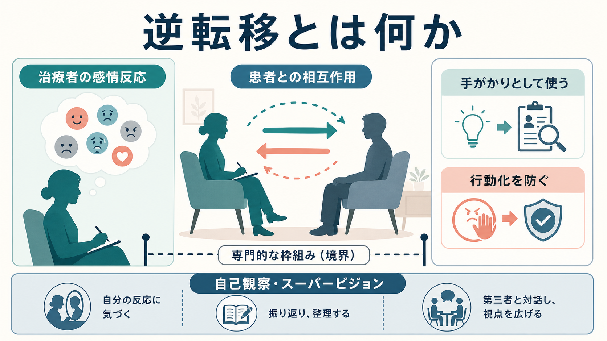
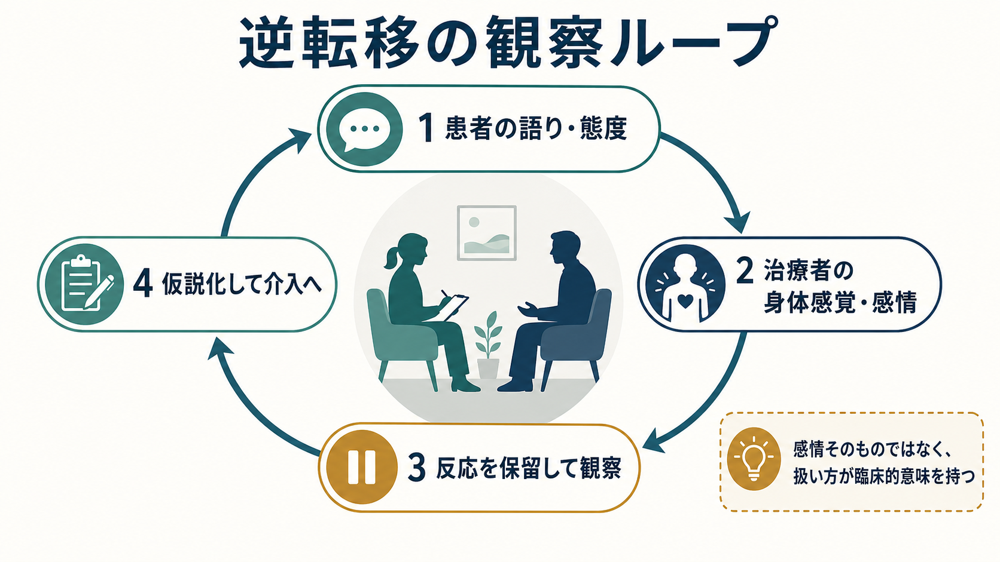
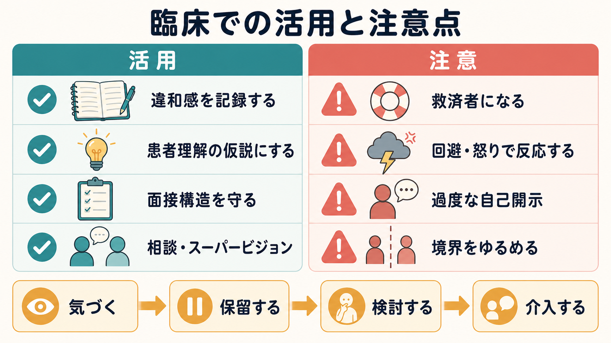

# 逆転移とは何か

## 要点

- 逆転移とは、患者との関係の中で治療者側に生じる感情反応、身体感覚、思考、衝動、行動傾向を指す。
- 古典的には治療者の「盲点」や未解決葛藤として警戒されたが、現代的には患者との相互作用を理解する臨床情報としても扱われる[1][2]。
- 逆転移は、患者理解、[[治療関係とは何か|治療関係]]、介入のタイミングを考える手がかりになる一方、未検討のまま行動化されると、回避、過保護、怒り、過度な自己開示、境界逸脱につながりうる[3][6]。
- 重要なのは「感情を持たないこと」ではなく、治療者が自分の反応に気づき、保留し、仮説化し、必要に応じて記録・相談・スーパービジョンにかけることである[4][7]。

## この記事で答える問い

1. 逆転移は、単なる治療者の好き嫌いや個人的感情と何が違うのか。
2. 逆転移は、臨床でどのように気づき、どう扱うと役に立つのか。
3. 逆転移が危険になるのはどのような場面か。
4. 精神科面接、心理療法、研究では、逆転移はどのように位置づけられるのか。

## まず結論

逆転移は、治療者の内側に生じる「患者への反応」だが、それは治療者個人だけの問題でも、患者だけの問題でもない。患者の語り、沈黙、依存、怒り、拒否、理想化、無力感などが、治療者の個人史・価値観・専門的役割・面接構造と出会うことで生じる関係性の現象である。

したがって、逆転移は二重の意味を持つ。第一に、未検討のまま治療者の行動に出ると、[[精神科面接とは何か|精神科面接]]や心理療法の安全性を損なうリスクになる。第二に、丁寧に観察されれば、患者が他者にどのような感情を喚起しやすいか、どのような関係パターンを反復しやすいかを考える手がかりになる[2][5]。

臨床的には、「この患者は問題だ」と即断する前に、「この人といると、私は何を感じ、何をしたくなっているのか」を観察する。そこで得た情報を、患者理解の仮説として扱い、面接構造、守秘、説明、リスク評価、スーパービジョンの中で検討する。

## 背景

逆転移という語は、精神分析の文脈で発展した。Freud は 1910 年の講演で、患者が分析家の無意識感情に及ぼす影響として逆転移を問題化し、分析家がそれを認識し克服する必要を述べた[1]。この初期理解では、逆転移は主に治療者の未分析の葛藤や技法上の妨げとして見られていた。

その後、逆転移の理解は広がった。現代の心理療法研究では、逆転移は特定学派だけの用語ではなく、治療者が患者に対して経験する感情・認知・身体感覚・行動傾向を含む汎理論的な概念として扱われることがある[7]。実証研究でも、逆転移反応は治療成績や治療同盟、患者の症状・診断・愛着様式と関連しうる知識源として検討されている[3]。

ただし、逆転移を「患者が治療者に与えた客観的影響」と単純化してはいけない。治療者の側にも、疲労、価値観、経験年数、訓練、文化的背景、権力性、個人的な弱点がある。逆転移は、患者からの情報であると同時に、治療者の反応性を映す鏡でもある。

## 基本概念

### 転移と逆転移

転移は、患者が過去の重要な他者との関係パターンを、治療者との関係に持ち込む現象として理解される。たとえば、治療者を批判的な親のように感じる、理想的な救済者として見る、見捨てる相手として恐れる、などである。

逆転移は、その関係の中で治療者側に生じる反応である。たとえば、救ってあげたい、距離を取りたい、腹立たしい、眠くなる、過剰に心配になる、説明しすぎる、早く終わらせたくなる、といった反応が含まれる。

ここで大切なのは、逆転移を「悪い感情」と決めつけないことである。温かさ、親しみ、保護したい気持ちも逆転移になりうるし、怒りや退屈も臨床情報になりうる。問題は、感情の種類ではなく、それに気づかないまま治療者が行動してしまうことである。

### 狭い定義と広い定義

狭い定義では、逆転移は治療者自身の未解決葛藤が患者との関係に持ち込まれることを指す。たとえば、治療者が自分の過去の家族関係に触れる患者に対して、過剰に防衛的になる場合である。

広い定義では、患者との関係で治療者に生じる反応全体を逆転移と呼ぶ。患者の語り方、沈黙、依存、攻撃性、無力感、理想化などに触れて生じる治療者の内的反応を、患者理解の一部として観察する[2][3]。

臨床では、この二つを対立させるよりも、「どの部分が治療者自身の課題で、どの部分が患者との相互作用を反映しているのか」と分けて考えるほうが役に立つ。

## 仕組み

逆転移は、次のような循環で生じやすい。

1. 患者が語り、沈黙し、訴え、怒り、依存し、回避する。
2. 治療者に感情、身体感覚、思考、衝動が生じる。
3. 治療者がその反応を自覚せずに行動化するか、いったん保留して観察する。
4. 保留された反応は、患者理解、面接方針、治療関係の調整に使われる。

たとえば、面接中に治療者が急に「この人を何とか助けなければ」と強く感じたとする。その反応は、患者の切迫した苦痛を正確に感じ取ったものかもしれない。一方で、治療者が救済者役割に入り込み、患者の主体性やリスク評価を見失っているサインかもしれない。

また、治療者が退屈や眠気を感じる場合、それを単に「自分の集中力不足」と処理するだけでは不十分である。患者が感情を切り離して話している、関係の中で距離を作っている、あるいは治療者側が不快なテーマを避けている可能性がある。もちろん、治療者自身の疲労や体調も検討する必要がある。

このように逆転移は、[[傾聴とは何か|傾聴]]や[[共感的理解とは何か|共感的理解]]の裏側で生じる、治療者の内的データである。ただし、それはそのまま真実ではない。仮説として扱い、患者の言葉、経過、面接場面、チームの観察、スーパービジョンで照合する必要がある。

## 図解

逆転移を臨床で扱うときの基本は、「活用」と「注意」を同時に見ることである。

活用の側面では、違和感を記録し、患者理解の仮説にし、面接構造を守り、必要に応じて相談する。注意の側面では、救済者になる、怒りや回避で反応する、過度な自己開示をする、境界をゆるめる、といった行動化を避ける。

逆転移を扱う最小単位は、「気づく、保留する、検討する、介入する」である。気づいた瞬間に患者へ直接伝える必要はない。まず治療者の中で一時停止し、その反応が何を示しているのかを考える。

## 臨床・研究との接続

### 精神科面接

精神科面接では、逆転移は特別な心理療法場面だけでなく、初診、救急、入院、外来、薬物療法、家族面接、チーム医療の中でも生じる。患者が診断や治療を拒むとき、頻回に連絡するとき、希死念慮を語るとき、怒りを向けるとき、治療者は何らかの感情反応を持つ。

ここで重要なのは、逆転移を理由に患者を評価しすぎないことである。「操作的」「依存的」「攻撃的」といったラベルは、治療者の反応を正当化するために使われる危険がある。まずは、何が起きたのか、どの言葉や場面で反応が強まったのか、患者の安全性と治療構造に何が必要かを整理する。

### 心理療法

心理療法では、逆転移は治療同盟や介入の質に関わる。2018 年のメタ分析では、逆転移反応は心理療法アウトカムと小さいながら負の関連を示し、逆転移管理はアウトカムの良さと関連していた[4]。これは「逆転移があると悪い」という意味ではない。逆転移を未検討のまま行動化することが問題であり、うまく管理されると臨床的に役立ちうるという意味である。

系統的レビューでも、成人心理療法における逆転移研究は多くないものの、逆転移は治療成績、愛着様式、治療同盟、患者症状や診断を理解する情報源になりうると整理されている[3]。

### パーソナリティ病理と対人関係

逆転移は、パーソナリティ病理や対人関係パターンの理解にも関係する。Betan らの研究では、臨床家の認知・感情・行動反応を測定する質問紙が用いられ、患者のパーソナリティ病理と治療者反応の関連が検討された[5]。境界性パーソナリティ障害の患者を担当する治療者を対象にした研究でも、逆転移反応は肯定的・保護的反応から無力感、圧倒感、距離化まで幅を持つものとして報告されている[7]。

これは、特定の診断を持つ患者が必ず特定の反応を引き起こすという意味ではない。むしろ、治療者が自分の反応を手がかりにしながら、患者の対人関係、愛着、見捨てられ不安、怒り、依存、恥、孤立を慎重に仮説化するということである。

### 境界と倫理

逆転移が最も危険になるのは、治療者が自分の反応を臨床判断として吟味せず、患者との境界を変えてしまうときである。過度な自己開示、個人的な連絡、特別扱い、贈与、性的関係、敵意に基づく拒絶、懲罰的態度などは、患者を傷つけるだけでなく、専門職としての倫理にも関わる[6][8]。

Gabbard は、性的非行を起こした治療者の心理療法において、救済者、権威的親、愛の対象、腐敗可能な対象などの転移・逆転移テーマを論じている[8]。この議論は特殊な事例に見えるが、一般臨床にも重要な示唆を持つ。境界逸脱は、突然起こるというより、未検討の感情反応、例外扱い、秘密化、相談不足が積み重なって起こりやすい。

## よくある誤解

### 誤解1: 逆転移は治療者が未熟な証拠である

逆転移が生じること自体は、治療者が未熟であることを意味しない。患者と関わる以上、感情反応は生じる。未熟さが問題になるのは、反応に気づかない、患者のせいにする、自分の行動を正当化する、相談しない、といった扱い方である。

### 誤解2: 逆転移は患者理解のためにそのまま使えばよい

逆転移は手がかりであって、証拠そのものではない。「私は怒りを感じた。だから患者は攻撃的だ」と結論してはいけない。治療者の怒りは、患者の怒りを反映しているかもしれないし、治療者自身の疲労、価値観、無力感、防衛を反映しているかもしれない。

### 誤解3: 逆転移を患者に話せば誠実である

自己開示が有用な場合はあるが、治療者の感情を患者に直接伝えることは常に治療的とは限らない。患者の利益、面接目的、治療関係、リスク、タイミングを検討する必要がある。多くの場合、まず記録、自己検討、スーパービジョンが先である。

### 誤解4: 薬物療法中心なら逆転移は関係ない

逆転移は心理療法だけでなく、薬物療法、説明、服薬中断、診断告知、入退院、家族対応、リスク評価にも関わる。たとえば、治療者が「この患者には強く言わないといけない」と感じるとき、その感覚が適切なリスク対応なのか、怒りや焦りの行動化なのかを検討する必要がある。

## 関連ノート

### 既存ノート

- [[治療関係とは何か]]
- [[精神科面接とは何か]]
- [[傾聴とは何か]]
- [[共感的理解とは何か]]
- [[沈黙は精神科面接でどう扱うべきか]]
- [[要約は面接でなぜ重要なのか]]

### 今後の作成候補

- 転移とは何か
- 治療同盟とは何か
- スーパービジョンとは何か
- 精神科面接における境界設定とは何か
- 治療者の自己開示はいつ有用か
- 行動化とは何か

### MOC 更新候補

- `content/00_MOC/` 配下の精神医学・精神科面接・心理療法関連 MOC に本記事へのリンクを追加する。
- 並列生成ジョブとの競合を避けるため、このタスクでは MOC 本体は更新しない。

## 理解チェック

1. 逆転移を「治療者の個人的感情」とだけ説明すると、何が抜け落ちるか。
2. 治療者が患者に対して強い保護欲を感じたとき、どのような臨床仮説とリスクを考えるべきか。
3. 逆転移を患者理解に使う前に、なぜ記録・保留・相談が必要なのか。
4. 境界逸脱を防ぐために、逆転移のどのようなサインに注意すべきか。
5. 薬物療法や通常外来でも逆転移が問題になる例を一つ挙げるとしたら何か。

## 参考文献

[1] Freud, S. (1910/1957). *The Future Prospects of Psycho-Analytic Therapy*. In *The Standard Edition of the Complete Psychological Works of Sigmund Freud*, Vol. 11, 139-151. https://www.freudedition.net/en/werke/future-prospects-psycho-analytic-therapy/druckschrift

[2] Hayes, J. A., Gelso, C. J., & Hummel, A. M. (2011). Managing countertransference. *Psychotherapy, 48*(1), 88-97. https://doi.org/10.1037/a0022182

[3] Machado, D. B., Coelho, F. M. C., Giacomelli, A. D., Donassolo, M. A. L., Abitante, M. S., Dall'Agnol, T., & Eizirik, C. L. (2014). Systematic review of studies about countertransference in adult psychotherapy. *Trends in Psychiatry and Psychotherapy, 36*(4), 173-185. https://doi.org/10.1590/2237-6089-2014-1004

[4] Hayes, J. A., Gelso, C. J., Goldberg, S., & Kivlighan, D. M. (2018). Countertransference management and effective psychotherapy: Meta-analytic findings. *Psychotherapy, 55*(4), 496-507. https://doi.org/10.1037/pst0000189

[5] Betan, E., Heim, A. K., Conklin, C. Z., & Westen, D. (2005). Countertransference phenomena and personality pathology in clinical practice: An empirical investigation. *American Journal of Psychiatry, 162*(5), 890-898. https://doi.org/10.1176/appi.ajp.162.5.890

[6] Adler, G. (1994). Transference and countertransference and abuse in psychotherapy. *Harvard Review of Psychiatry, 2*(3), 151-159. https://doi.org/10.3109/10673229409017131

[7] Bhola, P., & Mehrotra, K. (2021). Associations between countertransference reactions towards patients with borderline personality disorder and therapist experience levels and mentalization ability. *Trends in Psychiatry and Psychotherapy, 43*(2), 116-125. https://doi.org/10.47626/2237-6089-2020-0025

[8] Gabbard, G. O. (1995). Transference and countertransference in the psychotherapy of therapists charged with sexual misconduct. *Journal of Psychotherapy Practice and Research, 4*(1), 10-17. https://pmc.ncbi.nlm.nih.gov/articles/PMC3330384/
