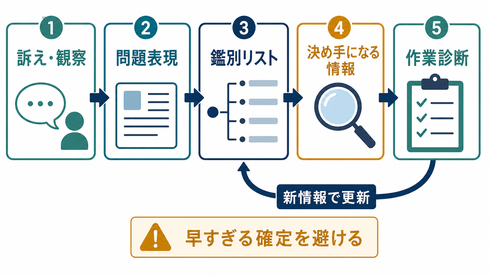
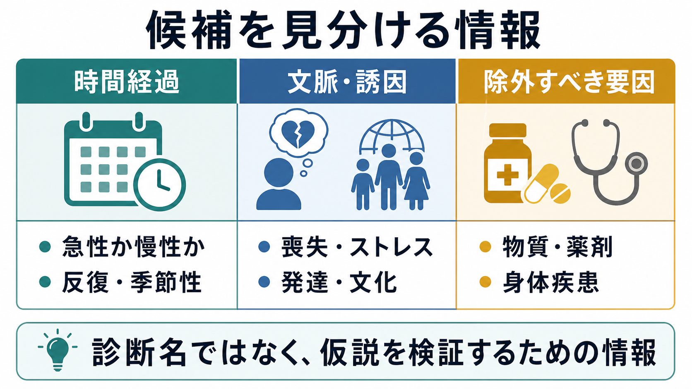

# 鑑別診断とは何か

## 要点

- 鑑別診断とは、ひとつの症状や訴えからすぐ診断名を決めるのではなく、似た症状を示す複数の候補を並べ、何が同じで何が違うかを調べる判断過程である。
- 精神医学では、抑うつ、不安、不眠、幻覚、興奮、集中困難などが複数の疾患、身体疾患、物質・薬剤、発達特性、ストレス反応で起こりうるため、鑑別診断が特に重要になる[1][2]。
- 鑑別診断は「正解を一発で当てる技術」ではなく、情報収集、仮説生成、反証、リスク評価、再評価を循環させる臨床推論である[3][4]。
- 早すぎる確定、確認バイアス、最初の印象への固定は診断エラーにつながりうるため、合理的な代替仮説を最後まで残しておく姿勢が重要である[5]。

## この記事で答える問い

- 鑑別診断とは何をすることなのか。
- 精神医学では、なぜ鑑別診断が難しく、重要なのか。
- 鑑別診断では、どのような情報を集め、どう比較するのか。
- 鑑別診断と、診断名の確定、治療方針、研究上の分類はどう違うのか。

## まず結論

鑑別診断とは、似た症状をもつ候補を比較しながら、「この人に起きている困りごとを説明するには、どの仮説がもっとも妥当か」「安全上、先に除外すべきものは何か」「次に何を聞き、何を観察し、どの検査や情報共有が必要か」を決める過程である。

たとえば「眠れない」という訴えは、うつ病、不安症、双極症の躁状態、PTSD、物質使用、薬剤、疼痛、睡眠時無呼吸、認知症、せん妄、生活リズムの乱れなどで起こりうる。したがって「不眠があるから不眠症」と決めるのではなく、発症時期、経過、気分、活動性、認知、身体状態、服薬、物質、生活背景、危険性を組み合わせて候補を絞る必要がある[1][2]。

このノートは教育・研究目的の整理であり、個別の診断や治療指示を行うものではない。実際の判断は、本人の状態、緊急性、身体評価、面接、標準化尺度、周囲からの情報、専門職間連携を含めた臨床評価に基づく。

## 背景

医学的診断は、患者の問題を説明し、その後の判断を方向づける中心的な作業である。米国 National Academies の報告書は、診断を「臨床推論と情報収集を通じて健康問題を明らかにする、複雑で協働的な活動」と位置づけ、診断エラーが医療安全上の重要課題であると整理している[3]。

精神医学では、血液検査や画像検査だけで多くの診断が確定するわけではない。本人の語り、観察される行動、経過、機能障害、文化的背景、発達歴、家族歴、身体疾患、物質・薬剤、リスク評価を統合する必要がある。これは[[精神疾患とは何か]]や[[正常と異常はどこで分けられるのか]]で扱う「症状と生活機能をどう読むか」という問題と直結する。

## 基本概念

### 鑑別リスト

鑑別リストとは、現時点の情報から考えるべき候補の一覧である。候補は「可能性が高い順」だけでなく、「見逃すと危険なもの」「治療が大きく変わるもの」「除外に追加情報が必要なもの」も含めて考える。精神症状の場合、一次性の精神疾患だけでなく、身体疾患、薬剤、アルコールやその他の物質、せん妄、神経疾患を候補に入れることがある[2]。

### 問題表現

問題表現とは、情報を診断しやすい形に圧縮した短いまとめである。たとえば「20代から反復する急性の気分高揚と睡眠欲求低下」なのか、「高齢初発で急性に変動する注意障害」なのかで、鑑別リストは大きく変わる。年齢、発症様式、時間経過、主症状、随伴症状、機能障害、危険性を含めるほど、候補を比較しやすくなる。

### 決め手になる情報

鑑別診断で重要なのは、情報量をただ増やすことではない。候補同士を分ける情報を集めることである。うつ状態を考える場合でも、過去の躁・軽躁、物質使用、甲状腺疾患、悲嘆や喪失、睡眠、希死念慮、心理社会的ストレス、既往治療への反応などは、候補と対応を大きく変える[2][6]。

## 仕組み

鑑別診断は、次のような循環として見るとわかりやすい。

1. 訴え、観察、周囲の情報から出発する。
2. 問題表現を作る。
3. 鑑別リストを作る。
4. 候補を分ける情報を集める。
5. 作業診断を置く。
6. 新しい情報、経過、治療反応、安全上の変化に応じて再評価する。

この過程は、医学生教育でいう illness script、つまり疾患ごとの典型的な発症背景、症状、経過、検査、介入の知識構造とも関係する。熟練した臨床家は、候補疾患の特徴をただ暗記しているのではなく、「この候補ならどの情報が出やすいか」「この情報があれば別候補が上がるか」を比較しながら判断する[7]。

ただし、直感的な候補生成は便利である一方、[[ヒューリスティックとは何か]]で扱うように、状況によってはバイアスにもなる。最初に思いついた診断へ固定される、都合のよい情報だけを集める、よく見る疾患を過大評価する、といった偏りは、合理的な代替候補を狭める[5]。

## 図解

図1は、鑑別診断を「訴え・観察」から「作業診断」へ向かう直線ではなく、新情報で戻る循環として示している。図2は、候補を見分けるための情報を、時間経過、文脈・誘因、除外すべき要因に分けている。図3は、精神症状で見落としを避けたい赤旗をまとめたものである。

| 観点 | 見ること | 例 |
|---|---|---|
| 時間経過 | 急性か慢性か、変動するか | せん妄は急性・変動性に注意する |
| 発症年齢 | 典型的な発症時期から外れていないか | 高齢初発の精神症状では身体・神経疾患も考える |
| 文脈 | 喪失、 trauma、対人関係、職場、文化 | 反応として理解できる部分と、臨床的支援が必要な部分を分ける |
| 物質・薬剤 | 使用、増減、中止、相互作用 | アルコール、刺激薬、ステロイド、睡眠薬など |
| 身体疾患 | 発熱、脱水、疼痛、内分泌、神経症状 | 甲状腺、感染、代謝異常、認知症、てんかんなど |
| リスク | 自傷他害、セルフネグレクト、急激な機能低下 | 診断名より先に安全確保が必要な場合がある |

## 臨床・研究との接続

臨床では、鑑別診断は治療方針を直接決める前の土台になる。APA の成人精神医学的評価ガイドラインでは、初期評価において症状、トラウマ歴、治療歴、物質使用、自殺リスク、身体健康、機能、生活の質などを体系的に評価することが推奨されている[2]。これは、診断の正確さだけでなく、安全性、治療選択、本人との共有意思決定にも関わる。

研究では、DSM-5-TR や ICD のような分類体系は共通言語として有用である一方、同じ診断名の中に異なる病態や経過が含まれることがある。したがって、診断カテゴリだけでなく、症状次元、機能、発達歴、神経認知、環境、[[生物心理社会モデルとは何か]]のような多層的理解を併用する必要がある。

## よくある誤解

### 誤解1: 鑑別診断は診断名の候補をたくさん暗記すること

候補を知ることは必要だが、それだけでは不十分である。鑑別診断の中心は、候補同士を分ける情報を集め、仮説を更新することである。

### 誤解2: 最初にもっとも可能性が高いものだけを考えればよい

頻度の高い疾患は重要だが、見逃すと危険な状態を先に確認する必要がある。急性の意識変容、神経症状、発熱、脱水、重い自殺リスク、新規薬剤、物質使用などは、診断名の確定より先に評価されることがある[2][5]。

### 誤解3: 精神症状なら身体疾患は関係ない

精神症状は、身体疾患、薬剤、物質、睡眠、疼痛、神経疾患と重なりうる。精神医学的評価では、身体健康や薬剤、物質使用を評価することが鑑別診断の一部である[2]。

### 誤解4: 鑑別診断は一度決めたら終わり

診断は経過の中で更新される。新しい症状、家族からの情報、検査結果、治療反応、生活環境の変化が出れば、鑑別リストに戻って見直す。これは曖昧さの表れではなく、臨床推論の基本である[3][4]。

## 関連ノート

- [[精神疾患とは何か]]
- [[正常と異常はどこで分けられるのか]]
- [[生物心理社会モデルとは何か]]
- [[素因ストレスモデルとは何か]]
- [[ストレス脆弱性モデルとは何か]]
- [[ヒューリスティックとは何か]]

MOC 更新候補: `content/00_MOC/MOC｜精神医学.md` の「総論・診断・面接」領域に追加。

今後の作成候補: 「精神医学的面接とは何か」「主訴と現病歴はどう聞くのか」「DSMとICDは何が違うのか」「せん妄と精神症状をどう見分けるのか」「物質誘発性精神症状とは何か」。

## 理解チェック

1. 鑑別診断が「候補をたくさん並べること」だけではない理由は何か。
2. 抑うつ気分を訴える人で、双極症、物質・薬剤、身体疾患を確認する必要があるのはなぜか。
3. 早すぎる確定や確認バイアスは、鑑別診断にどのような影響を与えるか。
4. 診断名より先に安全確認が必要になる場面には、どのようなものがあるか。

## 未解決問題

- 精神医学的診断で、カテゴリ診断、症状次元、機能評価、身体医学的評価をどの順序で統合するのがもっとも実用的か。
- 診断支援AIや意思決定支援ツールは、鑑別リストの拡張に役立つ一方、過信や責任の曖昧化をどう防ぐべきか。
- 文化的背景、発達段階、社会的困難を、過小診断にも過剰診断にもつなげず評価する方法をどう標準化できるか。

## 参考文献

[1] First, M. B. (2024). *DSM-5-TR Handbook of Differential Diagnosis*. American Psychiatric Association Publishing. https://search.worldcat.org/title/DSM-5-TR-handbook-of-differential-diagnosis/oclc/1391449655

[2] Silverman, J. J., Galanter, M., Jackson-Triche, M., Jacobs, D. G., Lomax, J. W., Riba, M. B., Tong, L. D., Watkins, K. E., Fochtmann, L. J., Rhoads, R. S., Yager, J., & American Psychiatric Association. (2015). The American Psychiatric Association Practice Guidelines for the Psychiatric Evaluation of Adults. *American Journal of Psychiatry, 172*(8), 798-802. https://doi.org/10.1176/appi.ajp.2015.1720501

[3] National Academies of Sciences, Engineering, and Medicine. (2015). *Improving Diagnosis in Health Care*. National Academies Press. https://doi.org/10.17226/21794

[4] National Academies of Sciences, Engineering, and Medicine. (2015). The diagnostic process. In *Improving Diagnosis in Health Care*. NCBI Bookshelf. https://www.ncbi.nlm.nih.gov/books/NBK338593/

[5] Croskerry, P. (2005). Diagnostic failure: A cognitive and affective approach. In K. Henriksen, J. B. Battles, E. S. Marks, & D. I. Lewin (Eds.), *Advances in Patient Safety: From Research to Implementation (Volume 2)*. Agency for Healthcare Research and Quality. https://www.ncbi.nlm.nih.gov/books/NBK20487/

[6] National Institute for Health and Care Excellence. (2023). Quality statement 1: Assessment. In *Depression in adults*. https://www.nice.org.uk/guidance/qs8/chapter/Quality-statement-1-Assessment

[7] Moghadami, M., Amini, M., Moghadami, M., Dalal, B., & Charlin, B. (2021). Teaching clinical reasoning to undergraduate medical students by illness script method: A randomized controlled trial. *BMC Medical Education, 21*, 87. https://doi.org/10.1186/s12909-021-02522-0
