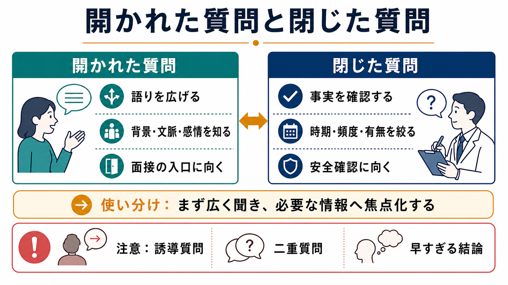
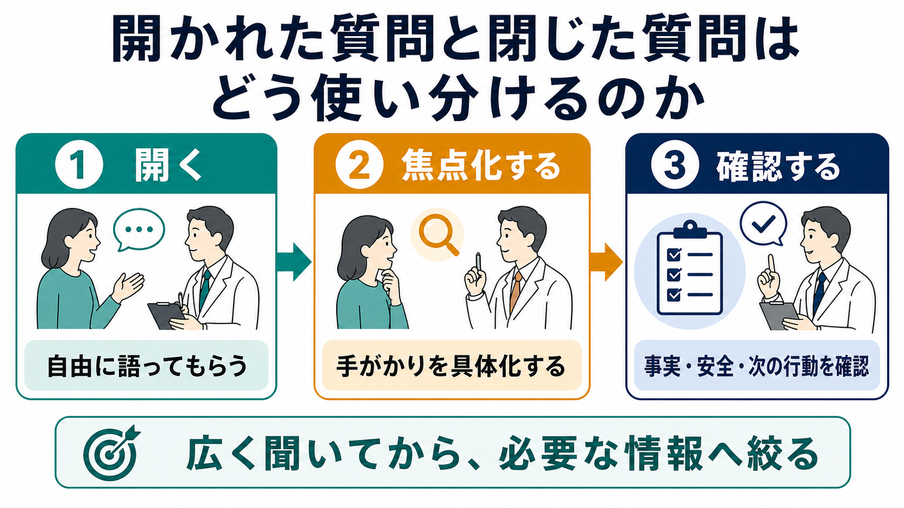

# 開かれた質問と閉じた質問はどう使い分けるのか

## 要点

- 開かれた質問は、患者自身の言葉で問題・背景・意味づけを語ってもらうための質問である。
- 閉じた質問は、時期、頻度、有無、重症度、安全性などを具体的に確認するための質問である。
- 実際の面接では、どちらか一方を選ぶのではなく、広く聞いてから焦点化し、最後に要約して確認する。
- 精神科面接では、関係づくりと情報収集を両立する必要があるため、早すぎる閉じた質問は語りを狭める一方、安全確認では直接的で具体的な質問が必要になる。

## この記事で答える問い

この記事では、[[精神科初診で何を確認するべきか]]や[[現病歴はどのように構造化するべきか]]を支える基本技能として、開かれた質問と閉じた質問をどの順番で、どの目的で使うかを整理する。医療・精神医学に関する記述は教育・研究目的の一般的説明であり、個別の診断や治療指示ではない。

## まず結論

面接の基本は「開かれた質問で入口を作り、患者の語りから手がかりを拾い、閉じた質問で必要情報を確認する」ことである。患者の訴えを十分に聞く前に症状リストを機械的に確認すると、患者の主要な関心や生活上の意味を取り逃がしやすい。一方で、診断、リスク評価、記録、研究尺度では、曖昧な語りだけでは足りず、閉じた質問で事実を確認する必要がある。

## 背景

医療面接の研究では、患者の「今日話したいこと」を十分に引き出す前に医師が焦点を絞ると、後半になって新しい関心事が出てきたり、重要な情報が取りこぼされたりすることが示されている。JAMAの研究では、医師が患者の関心を尋ねた面接でも、患者が最初の関心を言い終える前に方向づけられることが多く、方向づけられた後に元の関心が完了されることは少なかった[1]。近年の録音面接の二次分析でも、患者のアジェンダを明示的に引き出す面接は限られ、引き出した場合でも早い段階で中断されることが報告されている[2]。

ただし、「長く自由に話してもらうと面接が終わらない」という心配は、やや単純化されている。外来患者331例を対象にしたBMJの報告では、冒頭で患者が自然に話す時間は多くの場合短く、患者に話し切る余地を与えることは必ずしも大きな時間損失ではないことが示唆されている[3]。患者中心のコミュニケーション訓練は、少なくとも面接過程の改善には有効であるという系統的レビューもある[4]。

## 基本概念

### 開かれた質問

開かれた質問とは、「はい／いいえ」や単語だけで答えにくく、患者が自分の言葉で語れる質問である。たとえば「今日はどのようなことで相談に来ましたか」「そのつらさは、生活の中でどのように現れていますか」といった聞き方である。

開かれた質問の主な役割は、患者の語り、文脈、感情、価値観、困りごとの優先順位を知ることである。これは[[生物心理社会モデルとは何か]]に沿って、症状だけでなく生活、関係、文化、仕事、家族、本人の意味づけを理解する入口になる。

### 閉じた質問

閉じた質問とは、答えの範囲が比較的限定される質問である。たとえば「眠れない日は週に何日ありますか」「食欲は落ちていますか」「自分を傷つけたいと思ったことはありますか」といった聞き方である。

閉じた質問の主な役割は、臨床判断に必要な情報を正確に確認することである。[[操作的診断とは何か]]や[[精神科診断における除外診断とは何か]]では、症状の有無、期間、重症度、機能障害、物質使用、身体疾患、リスクなどを確認する必要があるため、閉じた質問は不可欠である。

| 質問形式 | 得意なこと | 苦手なこと | 例 |
|---|---|---|---|
| 開かれた質問 | 語り、背景、感情、文脈を引き出す | 情報が散らばることがある | 「そのことについて、もう少し教えてください」 |
| 閉じた質問 | 有無、頻度、時期、重症度を確認する | 早く使いすぎると語りを狭める | 「それは毎日ありますか」 |

## 仕組み

臨床面接では、開かれた質問と閉じた質問を「open-to-closed cone」のように使うと考えると分かりやすい。最初は広く、非指示的に聞き、患者の語りから重要そうな手がかりを拾う。次に、その手がかりについて時期、頻度、持続、誘因、生活への影響を具体化する。最後に、要約して患者に確認する。NCBI Bookshelf の医療面接章も、各探索を開かれた質問で始め、足りない部分をより具体的な質問で補う流れを勧めている[5]。

### 1. 最初は広く聞く

面接の入口では、患者が何を問題として持ち込んでいるのかを、できるだけ本人の言葉で聞く。たとえば「いちばん困っていることから教えてください」「ここに来るまでに、どのようなことがありましたか」と尋ねる。

ここで大切なのは、すぐに診断名や症状項目に翻訳しすぎないことである。「眠れない」という語りの背景には、不安、抑うつ、身体疾患、薬剤、生活リズム、家族関係、トラウマ、仕事上の負荷など、複数の可能性がある。早い段階で一つの仮説に固定すると、[[鑑別診断とは何か]]に必要な情報が抜けやすくなる。

### 2. 手がかりを拾って焦点化する

患者の語りの中で、症状、時間経過、生活機能、対人関係、危険性に関わる手がかりが出てきたら、少しずつ質問を焦点化する。たとえば「眠れない」という語りに対しては、「寝つくのが難しいのですか、途中で目が覚めるのですか」「それはいつ頃からですか」「仕事や家事にはどのくらい影響していますか」と確認する。

この段階では、開かれた質問と閉じた質問を混ぜる。閉じた質問だけで詰めると尋問的になりやすいが、開かれた質問だけでは診断や支援計画に必要な粒度まで情報がそろわない。

### 3. 安全確認では直接的に聞く

自傷他害、希死念慮、虐待、暴力、せん妄、物質使用、重い身体症状の可能性がある場合には、曖昧な遠回しの質問では不十分である。たとえば自殺リスク評価では、C-SSRSのように、自殺念慮、準備行動、試みの有無と時期を具体的に尋ねる構造化された質問が用いられる[6]。これは患者を誘導するためではなく、安全性を確認し、必要な支援につなげるためである。

ただし、安全確認でも、質問の前後に「この質問は安全を確認するために全員に尋ねています」「答えにくい範囲でかまいません」といった説明を添えると、患者は質問の意図を理解しやすい。

### 4. 要約して確認する

最後に、臨床家が理解した内容を短く要約し、患者に確認する。「ここまで伺うと、2か月前から眠れない日が増え、仕事の集中にも影響している。一方で、死にたい気持ちは今のところない、という理解で合っていますか」のように返す。

要約は単なる礼儀ではない。患者が訂正・追加できる機会を作り、面接者の理解のずれを減らす技法である。動機づけ面接でも、開かれた質問、是認、聞き返し、要約はOARSとして中心的なコミュニケーション技法に位置づけられる[7]。医療場面の動機づけ面接に関するメタ分析でも、動機づけ面接は多様な健康行動領域で一定の効果が検討されてきた[8]。

## 図解

この記事の図は、コード生成の図ではなく、画像生成によるラスター画像として `content/asset/generated_infographics/開かれた質問と閉じた質問はどう使い分けるのか/` に保存している。

| 図 | 役割 |
|---|---|
| 図1 | 開かれた質問と閉じた質問の比較 |
| 図2 | 広く聞いてから必要情報へ絞る流れ |

## 臨床・研究との接続

### 精神科初診

精神科初診では、患者が何に困っているのかを理解することと、診断・リスク・支援方針に必要な情報を集めることが同時に求められる。したがって、冒頭は開かれた質問で患者の語りを尊重し、その後で[[現病歴はどのように構造化するべきか]]に沿って、発症時期、経過、誘因、機能障害、既往、服薬、物質使用、家族歴、生活歴を確認する。

### 診断と鑑別

診断では、閉じた質問が重要になる。たとえば抑うつ気分の有無だけでなく、期間、興味・喜び、睡眠、食欲、精神運動、疲労感、罪責感、集中困難、自殺念慮、機能障害を確認する必要がある。一方で、診断項目だけに沿って聞くと、その症状が本人の生活で何を意味するのかを見失いやすい。[[精神疾患とは何か]]を理解するには、カテゴリ化と個別性の両方が必要である。

### 研究・尺度

研究や尺度では、比較可能性と再現性のために標準化された閉じた質問が使われることが多い。これは個別の語りを軽視するためではなく、同じ条件で測定するためである。一方、標準化された評価だけでは、患者が何を重要な問題として経験しているかは十分に見えないことがある。研究では、開かれた語りと閉じた測定を目的に応じて組み合わせる必要がある。

## よくある誤解

### 「開かれた質問のほうが常に良い」

開かれた質問は重要だが、常に最善ではない。危険性の確認、診断基準の確認、薬剤や物質使用の確認、身体疾患の除外では、具体的に聞かなければならない。曖昧な質問のままでは、安全確認が遅れることがある。

### 「閉じた質問は冷たい」

閉じた質問そのものが冷たいわけではない。問題は、患者の語りを聞く前に、面接者の都合だけで質問票のように進めることである。目的を説明し、要約や共感的応答を挟みながら使えば、閉じた質問は患者の困りごとを明確にする助けになる。

### 「質問技法だけでよい面接になる」

質問形式は重要だが、面接は質問だけで成り立つわけではない。沈黙、相づち、反映、要約、説明、共同意思決定、非言語的態度も同じくらい重要である。質問は、治療関係の中で使われて初めて意味を持つ。

## 関連ノート

- [[精神科初診で何を確認するべきか]]
- [[現病歴はどのように構造化するべきか]]
- [[生活歴はなぜ重要なのか]]
- [[生物心理社会モデルとは何か]]
- [[操作的診断とは何か]]
- [[鑑別診断とは何か]]
- [[精神科診断における除外診断とは何か]]

## MOC更新候補

- `content/00_MOC/` 配下の精神医学・臨床面接関連MOCに、本記事へのリンクを追加する候補。
- 並列ジョブとの競合を避けるため、本記事作成時点ではMOCファイルを更新しない。

## 理解チェック

1. 面接の冒頭で、閉じた質問だけを連続して使うと何が起こりやすいか。
2. 閉じた質問が特に必要になる臨床場面を3つ挙げられるか。
3. 「広く聞く、焦点化する、要約して確認する」という流れを、自分の面接例に当てはめて説明できるか。

## 未解決問題

- 精神科面接のどの時点で閉じた質問へ移るのが最適かは、患者の状態、緊急性、文化的背景、面接者の熟練度によって変わる。
- オンライン診療、短時間外来、救急、司法・産業領域では、開かれた質問と閉じた質問の最適な配分が異なる可能性がある。
- 生成AIやデジタル問診が普及する中で、標準化された質問と患者の自由記述をどう統合するかは今後の課題である。

## 参考文献

[1] Marvel MK, Epstein RM, Flowers K, Beckman HB. Soliciting the Patient's Agenda: Have We Improved? *JAMA*. 1999;281(3):283-287. https://doi.org/10.1001/jama.281.3.283

[2] Singh Ospina N, Phillips KA, Rodriguez-Gutierrez R, et al. Eliciting the Patient's Agenda: Secondary Analysis of Recorded Clinical Encounters. *Journal of General Internal Medicine*. 2019;34(1):36-40. https://doi.org/10.1007/s11606-018-4540-5

[3] Langewitz W, Denz M, Keller A, Kiss A, Ruttimann S, Wossmer B. Spontaneous talking time at start of consultation in outpatient clinic: cohort study. *BMJ*. 2002;325(7366):682-683. https://doi.org/10.1136/bmj.325.7366.682

[4] Dwamena F, Holmes-Rovner M, Gaulden CM, et al. Interventions for providers to promote a patient-centred approach in clinical consultations. *Cochrane Database of Systematic Reviews*. 2012;(12):CD003267. https://doi.org/10.1002/14651858.CD003267.pub2

[5] Lichstein PR. The Medical Interview. In: Walker HK, Hall WD, Hurst JW, editors. *Clinical Methods: The History, Physical, and Laboratory Examinations*. 3rd ed. Butterworths; 1990. NCBI Bookshelf. https://www.ncbi.nlm.nih.gov/books/NBK349/

[6] Columbia University Department of Psychiatry. Columbia-Suicide Severity Rating Scale (C-SSRS). https://www.columbiapsychiatry.org/research-labs/columbia-suicide-severity-rating-scale-c-ssrs

[7] International Consortium on Quality in Substance Use Disorders Treatment. Motivational Interviewing: Open Questions, Affirmation, Reflective Listening, and Summary Reflections (OARS). https://www.icquality.org/knowledge-share/resources/2019-10/motivational-interviewing-open-questions-affirmation-reflective

[8] Lundahl B, Moleni T, Burke BL, et al. Motivational interviewing in medical care settings: a systematic review and meta-analysis of randomized controlled trials. *Patient Education and Counseling*. 2013;93(2):157-168. https://doi.org/10.1016/j.pec.2013.07.012
