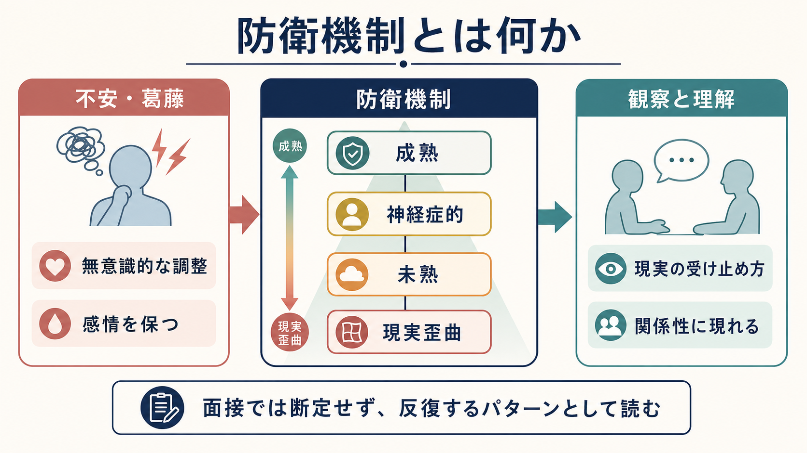
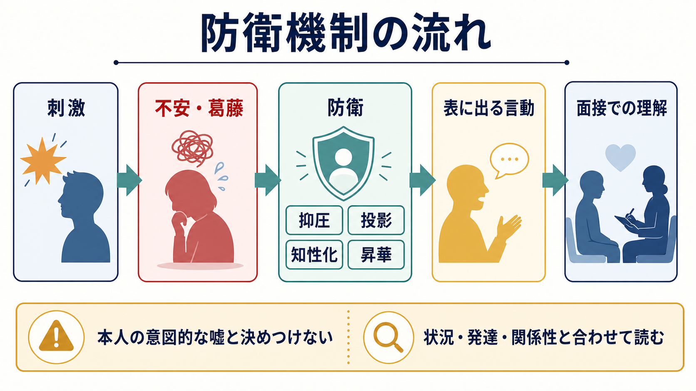
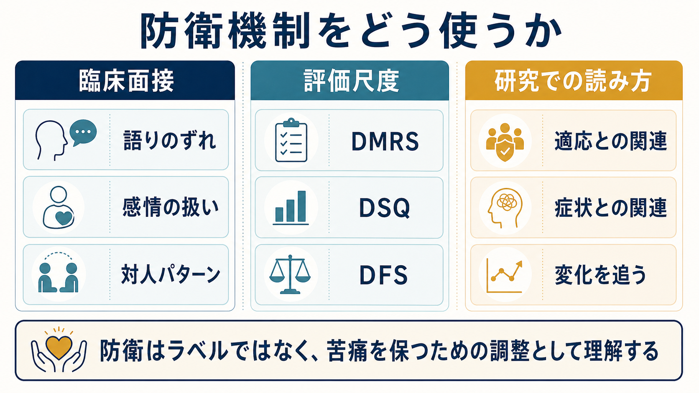

# 防衛機制とは何か

## 要点

- 防衛機制とは、不安、葛藤、恥、怒り、喪失感などがそのまま意識に上ると耐えにくいとき、心が自動的に負担を調整する心理的メカニズムである。
- 防衛は「悪い癖」や「嘘」と同義ではない。多くは無意識的に働き、本人を苦痛から守る一方で、現実理解や対人関係を狭めることがある[1][2]。
- 代表例には、抑圧、否認、投影、知性化、反動形成、置き換え、解離、行動化、昇華、ユーモア、予期、抑制などがある。
- 精神科面接では、防衛をその場で断定するより、語りのずれ、感情の扱い、反復する対人パターン、面接者への反応として慎重に読む。
- 防衛機制は教育・研究・臨床理解に役立つが、単独で診断名や治療方針を決める指標ではない。

## この記事で答える問い

1. 防衛機制は、不安や葛藤とどのように関係するのか。
2. 防衛機制は、精神科面接でどのように観察されるのか。
3. 成熟した防衛、神経症的防衛、未熟な防衛、現実歪曲的な防衛は何が違うのか。
4. 防衛機制を「本人の性格」や「嘘」と決めつけないために何に注意するべきか。

## まず結論

防衛機制とは、心が耐えがたい不安や葛藤を直接感じすぎないように、感情、記憶、意味づけ、対人行動を自動的に調整する働きである。古典的には精神分析の概念として発展したが、現在は精神力動的理解だけでなく、心理療法研究、人格機能、適応、面接評価の文脈でも扱われる[1][2]。

重要なのは、防衛を「病的か正常か」の二分法で見ないことである。防衛は誰にでもある。たとえば、怒りをすぐぶつけず仕事や創作に変える「昇華」、困難を予測して準備する「予期」、つらい感情を一時的に脇に置く「抑制」は、生活を支えることがある。一方で、現実を強く否認する、つらさを他者の悪意として投影する、感情を行動化するなどが強く反復すると、本人の苦痛、関係の破綻、治療関係の不安定さにつながりうる[3][7]。

したがって精神科面接では、防衛を「この人は投影している」とラベル化するより、「どの話題で不安が高まり、どのように感情が避けられ、どのような関係パターンが面接場面にも現れるか」を読む。これは[[精神科面接とは何か|精神科面接]]、[[治療関係とは何か|治療関係]]、[[支持的面接とは何か|支持的面接]]と深く関係する。

## 背景

防衛機制の考え方は、フロイト以降の精神分析・精神力動理論で発展した。もともとは、受け入れがたい欲動、記憶、感情、葛藤が意識化されることに伴う不安から自我を守る働きとして考えられた。その後、アンナ・フロイト、Vaillant、Perry、Cramer らの研究を通じて、臨床観察だけでなく、発達、人格、適応、心理療法過程との関係が検討されてきた[1][2][3][4]。

近年の研究では、防衛機制は単なる古典的概念ではなく、情動調整、自己理解、対人関係、心理療法での変化を記述するための有用な観点として扱われる。DMRSやDSQのような評価法は、防衛の種類や適応水準を研究上測定する試みであり、防衛の階層性や心理社会的機能との関連を調べるために使われてきた[4][5][7]。

ただし、防衛機制は客観検査のように一回の観察で確定できるものではない。語り、行動、感情の変化、面接者との相互作用、生活史、文化的背景を合わせて仮説として扱う必要がある。これは[[生物心理社会モデルとは何か|生物心理社会モデル]]の考え方と相性がよい。

## 基本概念

### 防衛は不安と葛藤を調整する

防衛機制の中心には、「感じるには強すぎるものを、何とか扱える形に変える」という働きがある。葛藤は、たとえば「怒りたいが見捨てられたくない」「助けてほしいが依存していると思われたくない」「失敗を認めたいが自己評価が崩れるのが怖い」のように、相反する欲求や価値がぶつかる場面で生じる。

この葛藤が強いと、不安、恥、怒り、罪悪感、空虚感、身体症状、沈黙、過剰な説明、相手への攻撃、面接の中断などとして現れることがある。防衛はその苦痛を軽くする一方で、本人が本来感じている感情や必要としている支援を見えにくくすることがある。

### 防衛は意図的な嘘とは違う

防衛を読むうえで最も重要な誤解は、「否認している」「投影している」と言えば、本人が意図的に事実を隠していることになる、という誤解である。防衛の多くは無意識的であり、本人にとってはその時点で最も耐えられる現実の受け止め方になっている[1][2]。

たとえば、重大な診断を聞いた直後に「たいしたことはない」と話す人がいたとしても、それは医学的説明を理解していないとは限らない。感情が一気に崩れないよう、否認や知性化が一時的に支えている可能性がある。面接では、ただ矛盾を指摘するより、[[共感的理解とは何か|共感的理解]]、[[反映とは何か|反映]]、[[要約は面接でなぜ重要なのか|要約]]を使いながら、本人が扱える速度で現実検討を支える。

## 仕組み

防衛機制は、刺激、情動反応、意味づけ、対人行動のあいだで働く。外的な出来事や内的な記憶が不安を高めると、心はその不安を下げる方向に働く。結果として、感情を意識から遠ざける、別の相手に向ける、理屈として処理する、行動として表す、より適応的な活動へ変換する、といった形が生じる。

### 代表的な防衛の例

| 防衛機制 | 簡単な説明 | 面接での見え方の例 |
|---|---|---|
| 抑圧 | 苦痛な記憶や感情が意識に上りにくくなる | 重要な出来事について「覚えていない」と語る |
| 否認 | 現実の一部を受け入れないことで苦痛を下げる | 深刻な問題を「全然平気」と話す |
| 投影 | 自分の感情や衝動を相手のものとして体験する | 自分の怒りを「相手が攻撃してくる」と感じる |
| 知性化 | 感情より理屈や説明に寄せて扱う | 苦しい話題で急に専門用語や分析が増える |
| 置き換え | 感情をより安全な対象に向ける | 本来の相手ではなく家族や支援者に怒りが向く |
| 反動形成 | 受け入れがたい感情と逆の態度を強める | 強い怒りの裏で過剰に丁寧に振る舞う |
| 行動化 | 感情を言葉にする代わりに行動で表す | 面接を急に中断する、衝動的な行為が増える |
| 昇華 | 衝動や苦痛を社会的に有用な活動へ変える | 怒りや喪失感を創作、仕事、支援活動へ向ける |

### 階層モデル

Vaillantらは、防衛を適応水準の階層として整理し、より成熟した防衛ほど長期的な適応や心理的健康と関連しやすいことを示した[3]。ただし、この階層は人を上下に評価するためのものではなく、ある状況でどの水準の調整がどれだけ反復しているかを理解するための道具である。

| 水準 | 例 | 臨床的な読み方 |
|---|---|---|
| 成熟した防衛 | 昇華、ユーモア、予期、抑制 | 現実を大きく歪めず、感情を扱える形に変える |
| 神経症的防衛 | 抑圧、知性化、反動形成、置き換え | 感情は避けられるが、現実検討は比較的保たれる |
| 未熟な防衛 | 投影、空想、行動化、受動攻撃 | 対人関係の摩擦や症状の維持に関わることがある |
| 現実歪曲的な防衛 | 重い否認、妄想的投影など | 現実検討の弱さ、危機、安全評価と合わせて慎重に読む |

## 図解

下の図は、防衛機制を臨床面接、評価尺度、研究の三つの文脈に分けて整理したものである。面接では「語りのずれ」「感情の扱い」「対人パターン」を見るが、それは一回の発言から決めるものではない。評価尺度ではDMRS、DSQ、DFSなどが使われるが、尺度結果も面接や生活文脈と合わせて解釈する必要がある[4][5][6][7]。

## 臨床・研究との接続

### 精神科面接での意味

精神科面接で防衛機制を考える意義は、患者の言葉を疑うためではなく、苦痛がどのように保たれているか、どの話題がどの程度脅威になっているか、どの支援なら受け取りやすいかを理解するためにある。たとえば、面接のたびに支援者への不信が強まり、質問を「責められている」と受け取る場合、投影や過去の関係体験が現在の面接場面に影響しているかもしれない。

このとき必要なのは、すぐに解釈を提示することではない。まず安全、生活上の困難、症状、本人の言葉、関係性を整理する。[[ラポールはどのように形成されるのか|ラポール]]や[[精神科面接で境界設定はなぜ必要なのか|境界設定]]は、防衛を崩すためではなく、防衛が強まらなくても話せる場を作るために重要である。

### 心理療法研究での意味

防衛機制は、心理療法過程の変化を追う研究にも使われている。長期力動的心理療法の研究では、防衛機制の適応水準の変化が、後の機能や症状の改善と関連する可能性が示された[8]。また、うつ病・不安症の心理療法研究でも、防衛機制の変化を治療過程の一部として検討する試みがある。

ただし、これは「成熟した防衛を教えればよい」という単純な話ではない。防衛はその人の発達史、トラウマ、愛着、文化、現在の生活状況、治療関係の安全性と結びついている。研究知見は、個別の面接で仮説を立てる材料にはなるが、個人の治療方針は、本人の状態と希望、リスク、支援資源を含めて検討する必要がある。

### 心理測定との接続

DSQのような自己記入式尺度は、防衛スタイルを大規模に調べるうえで便利である[5]。一方、DMRSのような面接・逐語録ベースの評価は、臨床的な文脈を細かく読むことに向いている[4][7]。どちらも長所と限界があるため、[[心理測定とは何か|心理測定]]、[[心理測定と臨床判断はどう組み合わせるべきか|心理測定と臨床判断]]の観点から、測定対象、信頼性、妥当性、利用場面を確認する必要がある。

## よくある誤解

### 誤解1: 防衛機制は悪いものだけである

防衛は苦痛を下げるための調整であり、それ自体が悪いわけではない。成熟した防衛は、現実を大きく歪めずに感情を扱う助けになる。問題になるのは、防衛が硬直し、本人の選択肢、現実検討、関係性、生活機能を狭めるときである。

### 誤解2: 防衛を見抜けば面接が進む

防衛を「見抜く」ことと、患者が話せるようになることは違う。早すぎる解釈は、恥や警戒を高め、防衛をさらに強めることがある。まずは、本人の言葉を尊重し、感情の強さを見積もり、必要な安全評価を行いながら、少しずつ言語化を支える。

### 誤解3: 防衛機制は診断名を決める道具である

防衛機制は人格機能、症状、治療関係を理解する補助線であり、単独で[[精神科診断は何のためにあるのか|診断]]を決めるものではない。ある防衛が見えることは、特定の疾患を意味しない。疾患、発達、文化、身体疾患、物質使用、急性ストレス、トラウマ、現在の環境を合わせて読む必要がある。

### 誤解4: 防衛は本人がわざとやっている

多くの防衛は自動的・無意識的に働く。本人を責める言葉として使うと、臨床的には有害になりうる。面接者は「なぜそう言うのか」より先に、「その言い方が何から本人を守っているのか」を考える方が有益である。

## 関連ノート

- [[精神科面接とは何か]]
- [[治療関係とは何か]]
- [[支持的面接とは何か]]
- [[共感的理解とは何か]]
- [[反映とは何か]]
- [[要約は面接でなぜ重要なのか]]
- [[ラポールはどのように形成されるのか]]
- [[精神科面接で境界設定はなぜ必要なのか]]
- [[生物心理社会モデルとは何か]]
- [[心理測定と臨床判断はどう組み合わせるべきか]]

## MOC更新候補

- `content/00_MOC/MOC｜精神医学.md`
- `content/00_MOC/MOC｜臨床実践・治療.md`
- `content/00_MOC/MOC｜認知科学・心理学.md`

## 理解チェック

1. 防衛機制と意図的な嘘は、どの点で違うか。
2. 否認、投影、知性化、昇華を、それぞれ精神科面接の場面でどのように観察できるか。
3. 成熟した防衛が「感情を消す」ことではなく「扱える形に変える」ことだと言える理由は何か。
4. 防衛機制を単独で診断名に結びつけることが危険な理由は何か。
5. 面接者が防衛を理解したとき、すぐに解釈を伝える前に確認すべきことは何か。

## 未解決問題

- 防衛機制を、情動調整、予測処理、認知制御、対人学習のモデルとどこまで統合できるか。
- 自己記入式尺度と面接評定は、防衛機制のどの側面をそれぞれ測っているのか。
- 文化差、発達段階、トラウマ歴は、防衛の表れ方と臨床的意味をどのように変えるのか。
- 心理療法で防衛の変化が起こるとき、それは症状改善の原因なのか、結果なのか、相互作用なのか。

## 参考文献

[1] Cramer, P. (2015). Understanding Defense Mechanisms. *Psychodynamic Psychiatry*, 43(4), 523-552. https://doi.org/10.1521/pdps.2015.43.4.523

[2] Cramer, P. (2015). Defense Mechanisms: 40 Years of Empirical Research. *Journal of Personality Assessment*, 97(2), 114-122. https://doi.org/10.1080/00223891.2014.947997

[3] Vaillant, G. E., Bond, M., & Vaillant, C. O. (1986). An Empirically Validated Hierarchy of Defense Mechanisms. *Archives of General Psychiatry*, 43(8), 786-794. https://doi.org/10.1001/archpsyc.1986.01800080072010

[4] Perry, J. C., & Cooper, S. H. (1989). An Empirical Study of Defense Mechanisms: I. Clinical Interview and Life Vignette Ratings. *Archives of General Psychiatry*, 46(5), 444-452. https://doi.org/10.1001/archpsyc.1989.01810050058010

[5] Andrews, G., Singh, M., & Bond, M. (1993). The Defense Style Questionnaire. *The Journal of Nervous and Mental Disease*, 181(4), 246-256. https://doi.org/10.1097/00005053-199304000-00006

[6] Perry, J. C., Hoglend, P., Shear, K., Vaillant, G. E., Horowitz, M., Kardos, M. E., Bille, H., & Kagan, D. (1998). Field trial of a diagnostic axis for defense mechanisms for DSM-IV. *Journal of Personality Disorders*, 12(1), 56-68. https://doi.org/10.1521/pedi.1998.12.1.56

[7] Di Giuseppe, M., & Perry, J. C. (2021). The Hierarchy of Defense Mechanisms: Assessing Defensive Functioning With the Defense Mechanisms Rating Scales Q-Sort. *Frontiers in Psychology*, 12, 718440. https://doi.org/10.3389/fpsyg.2021.718440

[8] Perry, J. C., & Bond, M. (2012). Change in Defense Mechanisms During Long-Term Dynamic Psychotherapy and Five-Year Outcome. *American Journal of Psychiatry*, 169(9), 916-925. https://doi.org/10.1176/appi.ajp.2012.11091403
