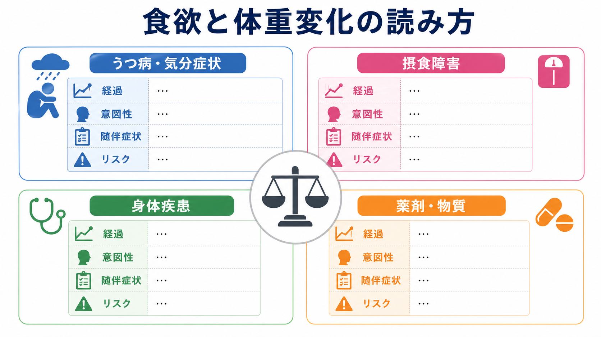
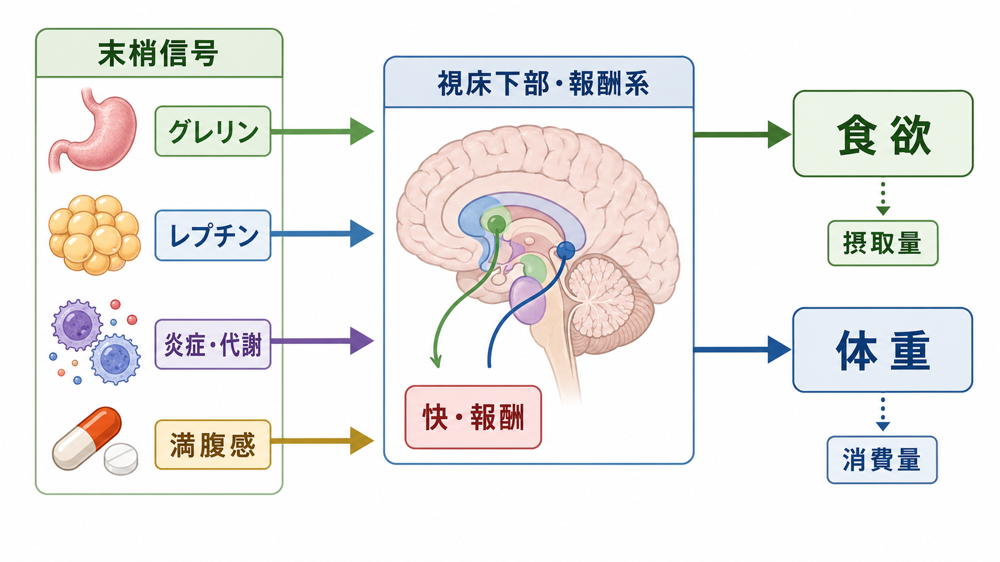
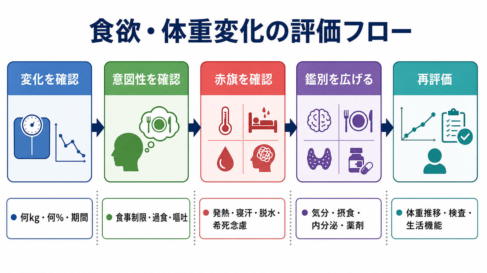

# 食欲と体重変化から何がわかるのか

## 要点

- 食欲と体重変化は、単独で診断を決める所見ではなく、[[鑑別診断とは何か|鑑別診断]]を広げ、時間経過と随伴症状を確認する入口である。
- うつ病では、食欲低下・体重減少だけでなく、食欲増加・体重増加も起こりうる。DSM-5の大うつ病エピソード基準では、1か月で5%を超える体重変化、または食欲の増減が症状項目に含まれる[1]。
- 摂食障害を疑うときは、BMIだけでなく、急速な体重減少、食事制限、過食、排出行動、体型・体重への過度なとらわれ、内分泌・消化器症状、低栄養の身体徴候を確認する[2]。
- 意図しない体重減少では、精神疾患だけでなく、がん、感染症、内分泌疾患、糖尿病、消化吸収障害、薬剤、物質使用、社会的孤立を含めて考える[3][4]。
- この記事は教育・研究目的の整理であり、個別の診断や治療指示ではない。実際の評価では、症状、身体所見、検査、服薬、生活背景、リスクを総合する。

## この記事で答える問い

- 食欲低下、過食、体重減少、体重増加から、どのような鑑別候補を考えるのか。
- うつ病、摂食障害、身体疾患、薬剤影響をどう見分け始めるのか。
- 体重変化を聞くとき、何kg、何%、どの期間、意図性、随伴症状をどう整理するのか。
- 赤旗として見逃したくない所見は何か。

## まず結論

食欲と体重変化は、「気分の問題か、身体の問題か」を二分するサインではない。むしろ、気分、報酬、内分泌、炎症、消化吸収、服薬、生活環境が同じ身体指標に合流するため、[[精神科診断における除外診断とは何か|除外診断]]と再評価が必要になる。

臨床的には、最初に「どの方向へ、どのくらい、どの期間で変化したか」を数量化する。次に、本人が意図して変えたのか、食べたいのに食べられないのか、食べているのに減るのか、食べる量が増えて増えるのかを分ける。最後に、抑うつ、不安、躁状態、摂食行動、身体症状、薬剤変更、物質使用、生活上の変化を同じ時系列に並べる。

## 背景

精神科面接では、食欲と体重は「抑うつ症状の有無」を確認する項目として聞かれやすい。実際、大うつ病エピソードの診断基準では、体重減少、体重増加、食欲低下、食欲増加が症状項目に含まれる[1]。しかし、同じ体重減少でも、うつ病、神経性やせ症、甲状腺機能亢進症、糖尿病、がん、感染症、薬剤副作用、アルコールやその他の物質使用、経済的困難、嚥下困難など、意味は大きく異なる[3][4]。

したがって、食欲と体重変化は、[[操作的診断とは何か|操作的診断]]のチェック項目であると同時に、[[精神科初診で何を確認するべきか|初診評価]]で見落としを減らすための横断的な手がかりでもある。

## 基本概念

### 食欲低下

食欲低下は、食べたい気持ちそのものが落ちる状態である。抑うつ、強い不安、悲嘆、疼痛、発熱、悪心、薬剤副作用、口腔・嚥下の問題、社会的孤立で起こりうる。食欲低下があるからといって、ただちにうつ病とは限らない。

面接では、「空腹感はあるか」「食べ物を見ても食べたいと思うか」「味やにおいは変わったか」「吐き気、腹痛、便通変化、嚥下困難はあるか」「誰かと食べる機会が減ったか」を分ける。

### 食欲増加と過食

食欲増加は、空腹感や食べたい欲求が増える状態である。過食は、短時間に大量に食べる、制御困難感を伴う、隠れて食べる、食後に強い罪悪感がある、といった行動パターンとして評価する。うつ病の非定型的特徴、双極症の一部、ストレス反応、睡眠不足、薬剤、過食症、むちゃ食い症などで問題になる。

重要なのは、「食欲がある」ことと「栄養状態がよい」ことを混同しないことである。過食と排出行動、糖尿病、甲状腺機能亢進症、吸収不良では、食べていても体重が減ることがある[3][5][6]。

### 体重減少

意図しない体重減少は、身体疾患と精神疾患の両方を考える所見である。Merck Manual Professionalは、体重減少の機序を「摂取・吸収より消費が多い状態」と整理し、食欲増加を伴うものとして甲状腺機能亢進症、糖尿病、吸収不良を、食欲低下を伴うものとして精神健康状態、がん、薬剤副作用、物質使用を挙げている[3]。

高齢者では、6-12か月で5%以上の意図しない体重減少が評価の契機になる。AAFPのレビューは、薬剤、ポリファーマシー、社会的要因、悪性腫瘍、非悪性消化器疾患、精神疾患を重視し、初期評価として病歴、身体診察、血液検査、尿検査、胸部画像、便潜血などを挙げている[4]。

### 体重増加

体重増加は、摂取量増加、活動量低下、睡眠・概日リズムの乱れ、薬剤、内分泌疾患、浮腫、妊娠、アルコール、生活環境の変化で起こりうる。精神科では、抗精神病薬、気分安定薬、抗うつ薬の一部が体重増加に関係するため、開始時期、増量時期、食欲変化、眠気、活動量、代謝検査を時系列で見る[7]。

## 仕組み

食欲と体重は、単純な意思の問題ではない。末梢からは、胃腸、脂肪組織、膵臓、免疫系、薬剤、炎症状態が信号を送る。脳側では、視床下部、脳幹、報酬系、前頭前野、内受容感覚ネットワークが、空腹感、満腹感、快・報酬、衝動制御、身体感覚の解釈を統合する。近年のレビューでも、弓状核を含む視床下部回路が、レプチン標的ニューロン、AgRP/POMC系、感覚入力、代謝状態に応じて摂食を調整することが整理されている[8]。

精神症状との接点は少なくとも3つある。第一に、抑うつや不安は、快・報酬、身体感覚、疲労、睡眠を通じて食行動を変える。第二に、摂食障害では、体型・体重への評価、制御感、報酬、内受容感覚、社会的文脈が食行動に影響する。第三に、身体疾患や薬剤は、代謝、炎症、消化器症状、眠気、活動量を変え、精神症状と似た訴えとして現れる。

## 評価の流れ

### 1. 変化を数量化する

最初に、体重の変化を「何kg」「何%」「どの期間」で確認する。本人の記憶だけでなく、健診記録、診療録、服のサイズ、家族からの情報が役に立つことがある[3][4]。体重計の条件、むくみ、脱水、便秘、月経周期、測定時間帯も誤差になる。

### 2. 意図性を確認する

意図した減量なのか、食事制限があるのか、食べたいのに食べられないのか、食べても体重が減るのかを分ける。意図した減量に見えても、体型・体重への過度なとらわれ、低体重なのに減量を続ける、食後の嘔吐や下剤使用がある場合は、摂食障害の評価が必要になる[2]。

### 3. 時間経過を作る

食欲、体重、気分、睡眠、活動量、月経、服薬、飲酒・物質使用、身体症状、生活イベントを同じ時系列に置く。たとえば、抗精神病薬やミルタザピン開始後に食欲増加と眠気が出て体重が増えた場合と、抑うつ悪化後に食べられず体重が減った場合では、意味が異なる[7]。

### 4. 赤旗を確認する

体重減少に発熱、寝汗、血痰、強い口渇・多尿、頻脈、振戦、腹痛、下血、嚥下困難、脱水、失神、電解質異常を疑う症状が伴う場合は、身体疾患の評価を急ぐ必要がある[3][4]。精神科的には、食事をほとんど取れない、急速な体重減少、排出行動、低栄養徴候、希死念慮、自傷、重い無気力、せん妄様の変動、判断力低下を確認する。

ここで重要なのは、赤旗を「診断名」ではなく「評価の優先順位」として扱うことである。[[自殺リスク評価では何を聞くべきか|自殺リスク評価]]や身体評価を、気分症状の聞き取りと並行して行う。

## 鑑別の見取り図

| パターン | まず考える候補 | 見分ける質問 |
|---|---|---|
| 食欲低下 + 体重減少 | うつ病、身体疾患、薬剤、がん、感染症、社会的孤立 | 気分、興味、睡眠、発熱、寝汗、疼痛、嚥下、便通、服薬変更 |
| 食欲増加 + 体重減少 | 甲状腺機能亢進症、糖尿病、吸収不良、過活動 | 暑がり、頻脈、振戦、多尿、口渇、下痢、食べている量 |
| 食欲増加 + 体重増加 | 非定型的抑うつ、薬剤、過食、睡眠不足、活動量低下 | 過食の制御困難、眠気、服薬時期、生活リズム、運動量 |
| 食欲低下 + 体重増加 | 活動量低下、浮腫、内分泌疾患、薬剤、飲酒 | むくみ、息切れ、寒がり、便秘、眠気、アルコール、身体活動 |
| 体重変動が大きい | 過食・排出行動、双極症、薬剤変更、生活リズム変動 | 嘔吐・下剤、躁/軽躁、睡眠欲求、服薬中断、ストレス |

## 臨床・研究との接続

### うつ病評価

うつ病評価では、食欲と体重を「症状項目」として確認するだけでなく、喜びの低下、疲労、睡眠、集中、罪責感、希死念慮、機能障害と合わせて読む[1]。食欲低下だけを取り出すと、身体疾患や薬剤を見落としやすい。一方、食欲増加や過眠があるからうつ病ではない、という判断も誤りである。

### 摂食障害評価

摂食障害では、体重の数字だけでは不十分である。NICEは、評価や紹介判断で、低すぎる/高すぎるBMI、急速な体重減少、制限的な食行動、家族が気づく食行動変化、食事場面からの社会的撤退、体重・体型への過度な関心、慢性疾患管理の困難、内分泌・消化器症状、低栄養の身体徴候を考慮するよう示している[2]。

### 身体疾患評価

甲状腺機能亢進症では、食欲が増えているのに体重が減ることがあり、頻脈、暑がり、振戦、発汗、下痢、睡眠困難、不安様症状を伴うことがある[5]。糖尿病、とくに1型糖尿病では、多尿、口渇、強い空腹、疲労、視力変化、説明しにくい体重減少が短期間で出ることがある[6]。これらは精神症状に似て見えるため、[[器質性精神障害を見逃さないためには何を見るべきか|器質性・身体疾患の確認]]が必要になる。

### 薬剤影響

薬剤影響は、本人の努力不足として扱ってはいけない。Endotextは、向精神薬の体重影響として、オランザピン、クロザピン、バルプロ酸、リチウム、一部の三環系抗うつ薬、ミルタザピンなどで体重増加が目立ちうる一方、ブプロピオン、トピラマート、ゾニサミドなどでは体重減少方向の影響がありうると整理している[7]。同じ薬剤でも、眠気、口渇、便秘、活動量低下、食欲増加、代謝変化がどう組み合わさるかで体重への影響は変わる。

## よくある誤解

### 誤解1: 食欲がないなら、うつ病である

食欲低下はうつ病でよく見られるが、発熱、がん、消化器疾患、薬剤、痛み、口腔問題、嚥下障害、孤立、経済的困難でも起こる。抑うつ気分があっても、身体疾患を同時に評価する。

### 誤解2: 体重が標準範囲なら摂食障害ではない

摂食障害の評価では、BMIだけでなく、急速な減少、食行動、排出行動、体型・体重へのとらわれ、身体徴候、生活機能を確認する[2]。標準体重域でも、過食・排出行動や強い制限が問題になることがある。

### 誤解3: 体重増加は本人の自己管理の問題である

体重増加には、薬剤、睡眠、活動量、代謝、食環境、ストレス、経済状況、身体疾患が関わる。特に向精神薬による体重増加は治療継続にも影響しうるため、責めるのではなく、時系列と生活機能を確認する[7]。

### 誤解4: 検査が正常なら原因は精神的である

初期検査が正常でも、経過観察や再評価が必要なことがある。AAFPのレビューは、初期評価で原因が明らかでない場合にも、3-6か月の観察やフォローアップが正当化される場合があると述べている[4]。精神的要因と身体的要因は併存しうる。

## 関連ノート

- [[鑑別診断とは何か]]
- [[精神科診断における除外診断とは何か]]
- [[操作的診断とは何か]]
- [[開かれた質問と閉じた質問はどう使い分けるのか]]
- [[精神科初診で何を確認するべきか]]
- [[自殺リスク評価では何を聞くべきか]]
- [[器質性精神障害を見逃さないためには何を見るべきか]]
- [[精神疾患とは何か]]
- [[正常と異常はどこで分けられるのか]]

### 関連ノート候補

- 摂食障害の初期評価
- 過食と排出行動をどう聞くか
- 薬剤性体重増加をどう評価するか
- 身体疾患による精神症状

### MOC更新候補

- `content/00_MOC/MOC｜精神医学.md`
- `content/00_MOC/MOC｜神経科学と精神疾患.md`

## 理解チェック

1. 食欲低下と体重減少があるとき、うつ病以外に少なくとも5つの鑑別候補を挙げられるか。
2. 「食べているのに体重が減る」場合、どの身体疾患や行動パターンを確認するか。
3. 摂食障害を疑うとき、BMI以外に何を聞く必要があるか。
4. 薬剤性の体重変化を評価するために、どの時系列情報が必要か。
5. 食欲・体重変化の赤旗を、身体的リスクと精神科的リスクに分けて説明できるか。

## 未解決問題

- 食欲と体重変化を、個人レベルでうつ病、摂食障害、身体疾患、薬剤影響に正確に分類する単一指標はない。
- 体重変化には、筋肉量、脂肪量、水分量、浮腫、月経周期、測定誤差が含まれるため、体重だけでは栄養状態や代謝状態を代表しない。
- 向精神薬の体重影響は平均値では整理できるが、個人差、併用薬、生活環境、疾患状態によって大きく変わる。
- 食欲の主観評価は、文化、体型規範、羞恥、家族関係、食事環境に影響される。

## 参考文献

[1] NICE. *Depression in adults: treatment and management. NICE guideline NG222*. 2022. https://www.nice.org.uk/guidance/ng222/chapter/Recommendations

[2] NICE. *Eating disorders: recognition and treatment. NICE guideline NG69*. 2017, updated 2020. https://www.nice.org.uk/guidance/ng69/chapter/recommendations

[3] Wasserman MR, Braunstein GD. *Involuntary Weight Loss*. Merck Manual Professional Edition. Reviewed/Revised Feb 2025, modified Jan 2026. https://www.merckmanuals.com/en-ca/professional/special-subjects/nonspecific-symptoms/involuntary-weight-loss

[4] Gaddey HL, Holder KK. Unintentional Weight Loss in Older Adults. *American Family Physician*. 2021;104(1):34-40. https://www.aafp.org/pubs/afp/issues/2021/0700/p34.html

[5] National Institute of Diabetes and Digestive and Kidney Diseases. *Hyperthyroidism (Overactive Thyroid)*. https://www.niddk.nih.gov/health-information/endocrine-diseases/hyperthyroidism

[6] National Institute of Diabetes and Digestive and Kidney Diseases. *Type 1 Diabetes*. https://www.niddk.nih.gov/health-information/diabetes/overview/what-is-diabetes/type-1-diabetes

[7] Verhaegen AA, Van Gaal LF. Drugs That Affect Body Weight, Body Fat Distribution, and Metabolism. In: Feingold KR, et al., editors. *Endotext*. Updated 2019 Feb 11. https://www.ncbi.nlm.nih.gov/books/NBK537590/

[8] Garcia-Caceres C. Advances in appetite regulation by the arcuate nucleus. *Nature Reviews Endocrinology*. 2025;21:71-72. https://doi.org/10.1038/s41574-024-01079-4
