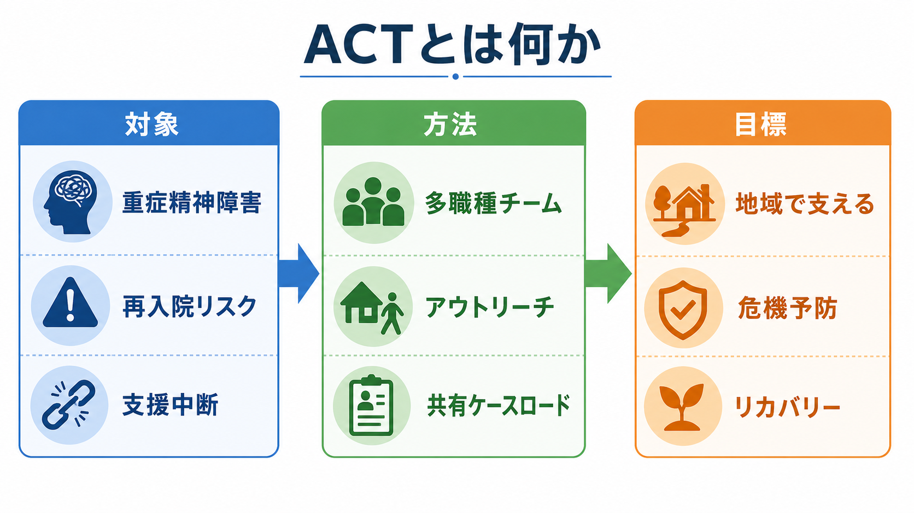
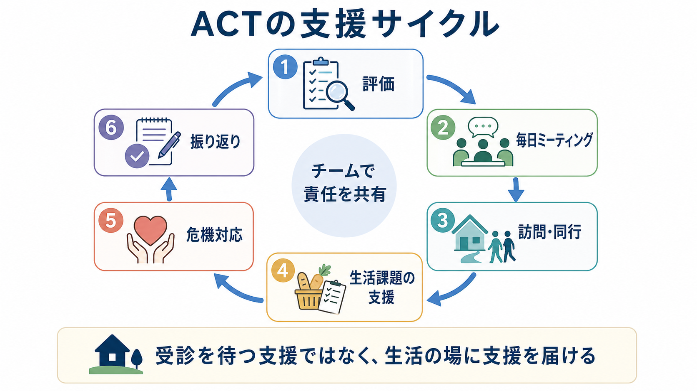
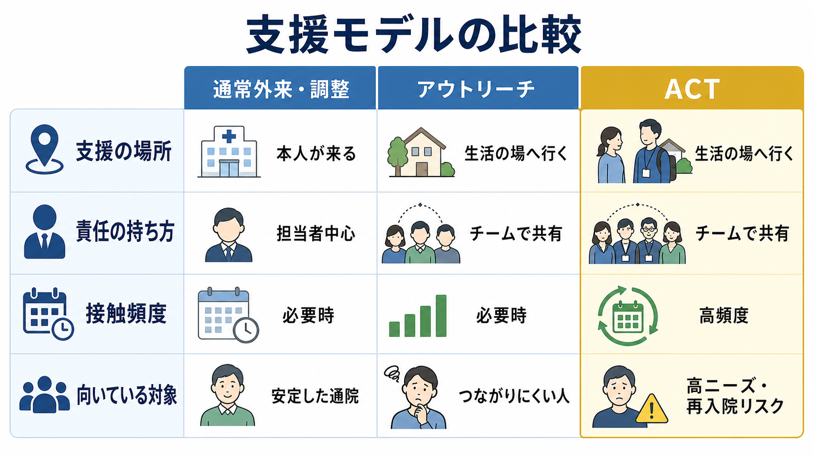

# ACTとは何か

## 要点

- ACT（Assertive Community Treatment）は、重症精神障害のある人が地域で暮らし続けるために、多職種チームが生活の場へ出向いて支援するモデルである[1][2]。
- 通常の[[ケースマネジメントとは何か]]よりも、チーム責任、低い利用者対スタッフ比、頻回の[[アウトリーチ支援とは何か]]、生活課題への直接支援が強い[3][4]。
- 効果は「ACT」という名称だけで決まらず、モデル忠実度、地域の入院依存度、対象者の高ニーズ性、住宅・福祉・就労資源の質に左右される[4][5]。
- 日本では ACT-J 研究が行われ、短期的には抑うつ症状や満足度、長期的には再入院回数の低下可能性が報告されているが、制度化・人員配置・24時間対応には課題が残る[6][7]。

## この記事で答える問い

1. ACTは、通常外来、訪問支援、ケースマネジメントと何が違うのか。
2. ACTチームは、どのような仕組みで再入院や支援中断を減らそうとするのか。
3. 研究エビデンスは何を支持し、どこに限界があるのか。
4. 日本の地域精神医療でACTを考えるとき、何に注意すべきか。

## まず結論

ACTは「よく訪問するサービス」ではなく、「チームが本人の生活全体への責任を共有し、診療・看護・福祉・リハビリ・就労支援を地域で統合する仕組み」である。対象は、[[統合失調症とは何か]]、[[双極性障害とは何か]]などの重い精神疾患を背景に、再入院、治療中断、住居不安定、孤立、服薬や身体健康の課題が重なりやすい人である[1][3]。

ACTの要点は、本人が相談室や外来に来られることを前提にしない点にある。チームは自宅、グループホーム、路上、行政機関、職場、病院など本人の生活が実際に展開している場所へ出向き、危機が深まる前から関わる[1][8]。ただし、これは本人の意思や権利を軽視して介入するという意味ではない。WHOの地域メンタルヘルス方針が強調するように、地域支援は本人中心、権利基盤、社会参加を支える形で設計される必要がある[8]。

## 背景

ACTは、長期入院中心の精神医療から地域生活支援へ移る過程で発展した。SteinとTestの古典的研究では、慢性的に重い精神障害のある人に対し、病院中心の短期入院と退院後ケアではなく、包括的で継続的な地域プログラムを提供すると、入院必要性が減り、地域生活の維持が改善した。一方で、プログラム終了後には効果が弱まったため、支援は一時的な退院支援ではなく継続的である必要が示された[2]。

この背景は、[[地域精神医療とは何か]]や[[精神科リハビリテーションとは何か]]の文脈と重なる。重症精神障害では、症状だけでなく、住まい、金銭管理、服薬、睡眠、家族関係、孤立、就労、身体合併症、制度利用が絡み合う。外来診察だけで全体を把握しようとすると、危機が顕在化してから入院で対応する構造になりやすい。ACTはこの循環を、地域での早期接触と継続支援によって変えようとする。

## 基本概念

### 対象

ACTの中心的な対象は、重症精神障害があり、一般的な外来・訪問・相談支援だけでは地域生活が不安定になりやすい人である。典型的には、頻回入院、長期入院歴、治療中断、救急利用、住居不安定、物質使用、家族負担、社会的孤立、服薬アドヒアランスの困難などが重なる[1][4]。

ここで重要なのは、診断名だけで対象を決めないことである。ACTは「統合失調症なら全員に必要」というモデルではない。むしろ、生活機能、サービスとのつながりにくさ、危機の反復、既存支援で支えきれない程度を見て、支援強度を判断する。

### チーム責任

ACTでは、個別担当者が一人で抱え込むのではなく、チーム全体が利用者を把握する。医師、看護師、精神保健福祉士、作業療法士、心理職、就労支援者、ピアスタッフなどが、日々のミーティングで状況を共有し、誰がいつ訪問するか、危機時にどう動くかを決める[1][5]。この点は[[多職種連携は地域精神医療でなぜ重要なのか]]と直結する。

### 生活の場への介入

ACTの支援対象は「症状」だけではない。薬を飲めない背景に金銭困難や生活リズムの崩れがあるなら、服薬指導だけでは足りない。家賃滞納が再入院リスクを高めているなら、住居支援や制度利用も臨床的支援になる。ACTでは、生活課題を治療の外側に置かず、再発予防とリカバリーの一部として扱う[3][4]。

## 仕組み

ACTチームは、次のような循環で動く。

1. 本人の症状、生活、危機サイン、希望、支援資源を評価する。
2. チームで情報を共有し、当日の訪問・同行・連絡・危機対応を決める。
3. 自宅や地域で本人に会い、服薬、食事、睡眠、金銭、家族、制度、就労などを具体的に支える。
4. 危機が起きたときは、入院か放置かの二択にせず、地域で可能な安全確保と支援増量を検討する。
5. 支援後に振り返り、次の計画へ反映する。

この仕組みを支えるのが「共有ケースロード」である。共有ケースロードとは、チーム全体が利用者を知っており、担当者不在でも支援が途切れにくい状態を指す。通常の個別担当制では、担当者の異動、休職、関係悪化で支援が弱くなることがある。ACTはその脆弱性をチーム構造で補う[1][5]。

もう一つの鍵はモデル忠実度である。TeagueらはDartmouth Assertive Community Treatment Scale（DACTS）を開発し、ACTらしい実践を測るために、多職種性、チームアプローチ、利用者対スタッフ比、地域での接触、サービス統合などを評価した[5]。ACTは名称ではなく、実装の質によって効果が変わる。

## 図解

ACTは、通常外来や一般的な調整型支援と連続しているが、支援強度と責任の持ち方が異なる。

| 観点 | 通常外来・調整 | アウトリーチ支援 | ACT |
|---|---|---|---|
| 主な入口 | 本人が受診・相談に来る | 支援者が生活の場に出向く | チームが継続的に生活の場へ出向く |
| 責任の持ち方 | 主治医・担当者中心 | 担当者や機関中心 | 多職種チームで共有 |
| 支援範囲 | 診療、相談、紹介が中心 | 生活場面への接触が加わる | 医療・福祉・生活・危機対応を統合 |
| 向いている対象 | 通院継続が比較的可能 | つながりにくい人 | 高ニーズで再入院・支援中断リスクが高い人 |

## 臨床・研究との接続

研究上、ACTに近い集中的ケースマネジメントは、標準的ケアと比べて入院を減らし、ケア継続を高める可能性が示されている。ただし、Cochraneレビューではエビデンスの質に幅があり、効果は過去の入院利用が多い集団や、ACTモデルへの忠実度が高いプログラムで大きくなりやすいと整理されている[4]。つまり、ACTはあらゆる地域・あらゆる対象に一律に上乗せすればよい介入ではない。

日本では、ItoらのACT-J RCTで、ACT群は入院日数の単純比較で減少を示し、抑うつ症状や利用者満足度でも肯定的な結果が報告されたが、共分散分析では入院日数の群間差は明確ではなかった[6]。さらに2025年の7年追跡研究では、再入院率や累積入院日数の差は統計的に有意ではなかった一方、再入院回数はACT群で少なく、効果が2年程度たってから現れる可能性が示された[7]。

臨床的には、ACTは[[精神科訪問看護とは何か]]、[[IPS援助付き雇用とは何か]]、[[ピアサポートとは何か]]、住宅支援、家族支援、身体健康支援と組み合わせて考える必要がある。チーム内にすべての機能を置くか、地域ネットワークとして外部資源と密に連携するかは制度や地域資源に左右されるが、本人の生活課題を分断しないことが中核である。

## よくある誤解

**誤解1：ACTは訪問看護を増やしたものにすぎない。**  
ACTは訪問を重視するが、訪問看護そのものではない。医療、福祉、リハビリ、就労、危機対応をチーム内で統合し、共有ケースロードで動く点が特徴である[1][3]。

**誤解2：ACTは入院を否定するモデルである。**  
ACTは必要な入院を否定しない。目標は、不必要な入院や退院後の支援中断を減らし、入院が必要な場合も地域生活へ戻る経路を切らさないことである。

**誤解3：Assertiveは強制的に関わるという意味である。**  
ACTのassertiveは、支援者が受け身にならず粘り強く関わるという意味に近い。本人の意思、同意、プライバシー、権利を軽視すると、ACTは支援ではなく管理になってしまう。[[意思決定支援とは何か]]や[[共同意思決定とは何か]]の視点が不可欠である[8]。

**誤解4：ACTはどの地域でも同じ効果を出す。**  
ACTの効果は、対象者選定、スタッフ配置、24時間対応、住宅資源、既存の地域ケア水準、フィデリティ評価に左右される[4][5]。入院利用がもともと少ない地域では、入院日数だけを主要評価にすると効果が見えにくい場合もある。

## 関連ノート

- [[地域精神医療とは何か]]
- [[アウトリーチ支援とは何か]]
- [[ケースマネジメントとは何か]]
- [[精神科リハビリテーションとは何か]]
- [[精神科訪問看護とは何か]]
- [[多職種連携は地域精神医療でなぜ重要なのか]]
- [[リカバリー志向支援とは何か]]
- [[意思決定支援とは何か]]
- [[IPS援助付き雇用とは何か]]
- [[ピアサポートとは何か]]

MOC更新候補：`content/00_MOC/MOC｜司法・制度・地域精神医療.md`、臨床実践・リハビリ・生活支援系のMOCが統合ジョブで整備される場合は本記事を追加する。

## 理解チェック

1. ACTが通常のケースマネジメントと異なる点を、「支援の場所」「責任の持ち方」「接触頻度」の3点から説明できるか。
2. ACTの共有ケースロードが、支援中断リスクをどう下げるか説明できるか。
3. ACTの効果が、対象者の高ニーズ性や地域の既存サービス水準に左右される理由を説明できるか。
4. ACTを本人中心・権利基盤で実践するために、どのような境界設定や同意確認が必要か考えられるか。

## 未解決問題

- 日本の診療報酬、障害福祉サービス、自治体支援、訪問看護、地域生活支援拠点の中で、ACTをどこに制度的に位置づけるのが持続可能か。
- 24時間対応や高頻度訪問を、スタッフの安全とバーンアウト予防を保ちながらどう設計するか。
- 入院日数だけでなく、本人の希望、孤立の低下、住居安定、就労・役割、家族負担、身体健康、権利擁護をどう評価指標に組み込むか。
- ACTの粘り強い関与と、本人の拒否・距離を置く権利をどう両立させるか。

## 参考文献

[1] Substance Abuse and Mental Health Services Administration. *Assertive Community Treatment (ACT) Evidence-Based Practices (EBP) KIT*. SAMHSA, 2008. https://library.samhsa.gov/product/Assertive-Community-Treatment-ACT-Evidence-Based-Practices-EBP-KIT/SMA08-4344

[2] Stein, L. I., & Test, M. A. (1980). Alternative to mental hospital treatment: I. Conceptual model, treatment program, and clinical evaluation. *Archives of General Psychiatry, 37*(4), 392-397. https://doi.org/10.1001/archpsyc.1980.01780170034003

[3] Bond, G. R., & Drake, R. E. (2015). The critical ingredients of assertive community treatment. *World Psychiatry, 14*(2), 240-242. https://doi.org/10.1002/wps.20234

[4] Dieterich, M., Irving, C. B., Bergman, H., Khokhar, M. A., Park, B., & Marshall, M. (2017). Intensive case management for severe mental illness. *Cochrane Database of Systematic Reviews, 2017*(1), CD007906. https://doi.org/10.1002/14651858.CD007906.pub3

[5] Teague, G. B., Bond, G. R., & Drake, R. E. (1998). Program fidelity in assertive community treatment: Development and use of a measure. *American Journal of Orthopsychiatry, 68*(2), 216-232. https://doi.org/10.1037/h0080331

[6] Ito, J., Oshima, I., Nishio, M., Sono, T., Suzuki, Y., Horiuchi, K., Niekawa, N., Ogawa, M., Setoya, Y., Hisanaga, F., Kouda, M., & Tsukada, K. (2011). The effect of Assertive Community Treatment in Japan. *Acta Psychiatrica Scandinavica, 123*(5), 398-401. https://doi.org/10.1111/j.1600-0447.2010.01636.x

[7] Satake, N., Yamaguchi, S., Sato, S., et al. (2025). Long-term outcomes of assertive community treatment in Japan: 7-year follow-up of a randomized controlled trial. *BMC Psychiatry, 25*, 870. https://doi.org/10.1186/s12888-025-07311-3

[8] World Health Organization. (2021). *Guidance on community mental health services: Promoting person-centred and rights-based approaches*. https://www.who.int/publications/i/item/9789240025707
