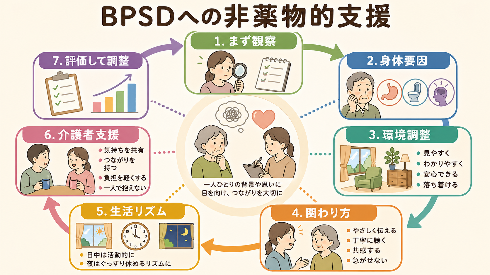
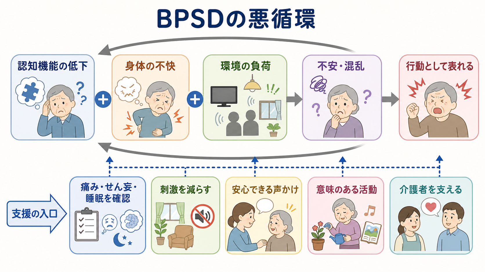
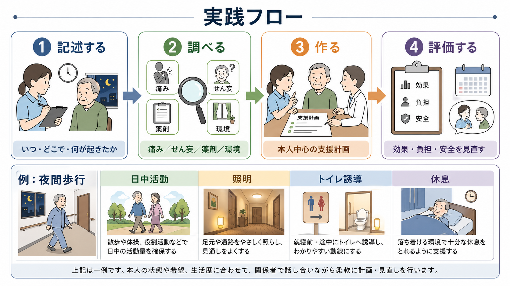

# BPSDへの非薬物的支援とは何か

## 要点

- [[BPSDとは何か|BPSD]]への非薬物的支援は、「薬を使わないで我慢する」ことではなく、本人の不快、環境負荷、関係性、生活リズム、介護者の負担を評価し、行動の背景に働きかける支援である。
- NICE は、認知症の苦痛に対応する前に、痛み、[[せん妄とは何か|せん妄]]、不適切なケア、環境要因などを構造的に評価し、初期対応および継続対応として心理社会的・環境的介入を提供することを推奨している[1]。
- DICE アプローチは、Describe、Investigate、Create、Evaluate、すなわち「記述する、調べる、支援計画を作る、評価する」という実践的な循環で BPSD を扱う枠組みである[2]。
- 支援の中心は、本人中心の関わり、環境調整、活動・休息・睡眠の調整、身体要因の確認、介護者支援である。薬物療法は、危険や強い苦痛がある場合に、利益と害を比較して限定的に検討される[1][6]。

## この記事で答える問い

1. BPSDへの非薬物的支援とは、具体的に何をすることか。
2. なぜ「行動を止める」より「背景を読む」ことが重要なのか。
3. 環境調整、関わり方、生活支援、介護者支援はどう組み合わせるのか。
4. 薬物療法との関係をどう考えるべきか。

## まず結論

BPSDへの非薬物的支援とは、認知症のある人の行動や感情を「困った症状」として切り取るのではなく、本人が言葉にしにくい苦痛、混乱、不安、退屈、痛み、疲労、生活上の失敗、環境の分かりにくさを読み取り、生活の条件を作り直す支援である。

たとえば、夜間に歩き回る人に対して、最初から「徘徊を止める」と考えると、制止、施錠、鎮静に発想が寄りやすい。しかし背景には、昼間の活動不足、睡眠覚醒リズムの乱れ、排尿、便秘、痛み、部屋の暗さ、場所の見当識低下、不安、過去の生活習慣が重なっているかもしれない。非薬物的支援は、これらを観察し、日中活動、照明、トイレ誘導、安心できる声かけ、休息の取り方を調整する。

したがって目標は、本人を「おとなしくさせる」ことではない。本人の苦痛を減らし、安全と尊厳を保ち、生活機能を支え、介護者が燃え尽きない形を作ることである。

## 背景

BPSD は、興奮、攻撃性、妄想、幻覚、不安、抑うつ、アパシー、睡眠障害、反復質問、歩き回りなど、認知症に伴う行動・心理症状を指す。[[高齢者のBPSDはどう理解するのか]]で扱うように、これは単に脳の変化だけで決まるのではなく、身体状態、環境、コミュニケーション、介護者の疲労、生活史との相互作用として現れる[2][3]。

非薬物的支援が重視される理由は二つある。第一に、BPSD の多くは、痛み、感染、便秘、脱水、睡眠不足、感覚障害、騒音、照明、分かりにくい手順など、修正できる条件と結びついている。第二に、抗精神病薬などの薬物療法には転倒、鎮静、錐体外路症状、脳血管イベント、死亡リスクなどの害があり、すべての BPSD に一律に使えるわけではない[1][6]。

このため、ガイドラインやレビューは、まず構造的評価と心理社会的・環境的介入を置き、薬物療法は危険や重度の苦痛がある場合に限定して慎重に扱う方向で一致している[1][2][6]。

## 基本概念

### 行動は「意味のない問題」ではない

BPSDを理解するうえで有用なのは、行動を「未充足ニーズの表現」として見る視点である。Need-driven dementia-compromised behavior model は、認知症に伴う行動を、背景因子と近接因子が重なったときに現れるニーズの表現として捉える[7]。ここでいうニーズには、痛みを避けたい、安心したい、場所を確認したい、役割を持ちたい、退屈を減らしたい、失敗を隠したい、といったものが含まれる。

この視点では、行動を止めることだけが目標にならない。本人にとって何が負荷になっているか、何が安心につながるかを探すことが支援の入口になる。

### 本人中心の支援

本人中心の支援とは、認知症の人を症状の集合としてではなく、生活史、好み、習慣、価値、残された能力を持つ人として理解することである。NICE も、本人の好み、日課、生活史を把握する構造化ツールの利用や、本人の好みに合わせた活動の提供を推奨している[1]。

実践では、次のような情報が重要になる。

| 観点 | 確認すること | 支援への使い方 |
|---|---|---|
| 生活史 | 仕事、家事、趣味、役割、信仰、家族関係 | 意味のある活動や声かけを選ぶ |
| 好み | 音楽、食べ物、入浴時間、人との距離 | 不快を減らし、安心の手がかりにする |
| 残存能力 | できる手順、得意な感覚、理解しやすい形式 | 失敗しにくい環境を作る |
| 苦手条件 | 騒音、急な接触、暗さ、待ち時間 | 刺激量や手順を調整する |

## 仕組み

BPSD は、脳の変化、身体の不快、環境の負荷、関係性の緊張が重なり、本人の不安や混乱が高まることで外に表れる。認知症では、記憶、注意、見当識、言語理解、実行機能が低下しやすい。そのため、周囲には小さな変化に見えても、本人にとっては予測できない出来事、危険、失敗として経験されることがある。

この悪循環を弱めるには、本人だけを変えようとしないことが重要である。支援者は、少なくとも次の五つを同時に見る。

1. 身体要因: 痛み、便秘、尿意、感染、脱水、睡眠、視力・聴力、薬剤、せん妄。
2. 環境要因: 騒音、照明、温度、動線、物の位置、待ち時間、見通しの悪さ。
3. 関わり方: 声の大きさ、説明の長さ、急がせ方、否定、身体接触、選択肢の出し方。
4. 生活リズム: 日中活動、昼寝、食事、入浴、排泄、夜間の安心、休息。
5. 介護者要因: 疲労、恐怖、孤立、情報不足、支援者間の不一致。

これは [[認知機能低下はどのように評価するのか]] や [[生活リズム支援とは何か]] と接続する。認知機能の評価は、点数をつけるためだけでなく、どの手がかりなら理解しやすいか、どの場面で失敗しやすいかを支援へ翻訳するために使う。

## 図解

図1は、BPSDへの非薬物的支援を、観察、身体要因、環境調整、関わり方、生活リズム、介護者支援、再評価の循環として示している。図2は、認知機能低下、身体の不快、環境負荷が不安や混乱を介して行動として表れる悪循環と、支援の入口を示している。

図3は、DICE に近い実践フローである。DICE は、BPSDを一度の助言で解決するのではなく、観察と仮説、介入、再評価を回すための枠組みである[2]。

| 段階 | 日本語での意味 | 具体例 |
|---|---|---|
| Describe | 何が起きたかを記述する | 「夜中に歩く」ではなく、時刻、場所、前後の出来事、危険度を書く |
| Investigate | 背景を調べる | 痛み、せん妄、睡眠、便秘、薬剤、照明、騒音、関わり方を確認する |
| Create | 支援計画を作る | 日中活動、声かけ、動線、トイレ誘導、休息、介護者支援を組み合わせる |
| Evaluate | 効果を見直す | 行動頻度だけでなく、本人の苦痛、安全、介護者負担を評価する |

## 臨床・研究との接続

### 環境調整

環境調整は、単に部屋をきれいにすることではない。本人が状況を理解しやすく、失敗しにくく、危険を避けやすいように、刺激量と手がかりを調整することである。たとえば、夜間の不安には、まぶしすぎない照明、トイレまでの見通し、時計や目印、足元の安全、夜間の声かけの統一が役立つことがある。

一方で、刺激を減らせばよいとは限らない。日中の活動や人との接点が少なすぎると、退屈、昼夜逆転、睡眠障害、夕方以降の不穏につながることがある。環境調整は「静かにする」だけでなく、本人に合う刺激と役割を整える作業である。

### 関わり方

関わり方では、正論で説得するより、安心を先に作ることが多い。もの盗られ妄想に対して「盗まれていない」と論破し続けると、不安や被害感が強まることがある。まず本人の困りごとを受け止め、物の定位置を作り、一緒に探す手順を整え、再発しにくい保管方法を検討する。

声かけは、短く、具体的で、急がせない形にする。選択肢は多すぎると負荷になるため、「今お茶にしますか、少し後にしますか」のように絞る。本人の面子を守ることも支援である。

### 生活支援

BPSDへの非薬物的支援は、[[認知リハビリテーションとは何か|認知リハビリテーション]]、[[作業療法は精神科で何をするのか|作業療法]]、[[訪問看護は精神科で何を支えるのか|訪問看護]]、[[ケースマネジメントとは何か|ケースマネジメント]] と重なる。診察室の助言だけでなく、家の動線、入浴、食事、服薬、排泄、外出、家族の休息、介護サービスの使い方まで含めて調整する必要がある。

AHRQ の系統的レビューは、非薬物的介入の研究が多様で、効果推定には限界があることを示しつつ、介入を本人向け、介護者向け、環境・スタッフ向けなどに分けて検討している[4]。このことは、「どの介入が万能か」ではなく、「どの背景要因に、どの支援を、どの場面で合わせるか」が重要であることを示している。

### 介護者支援

介護者支援は補助ではなく、中核である。BPSDは本人の苦痛であると同時に、介護者の睡眠不足、恐怖、孤立、罪悪感、身体的負担を強める。Gitlin らのレビューは、家族介護者への教育、問題解決訓練、個別化された支援が非薬物的対応の重要な要素であると整理している[3]。

介護者支援には、症状の説明、対応の優先順位づけ、レスパイト、複数支援者での役割分担、危険場面の計画、医療・介護サービスへの接続が含まれる。介護者が追い詰められると、本人への声かけが急になり、本人の不安が増え、BPSDがさらに強まる。したがって、介護者を支えることは本人を支えることでもある。

## よくある誤解

### 誤解1: 非薬物的支援は「薬を使わないこと」である

非薬物的支援は、何もしないことではない。観察、身体評価、環境調整、関わり方、活動設計、介護者支援を組み合わせる積極的な支援である。薬物療法を使う場合でも、心理社会的・環境的介入は継続する必要がある[1]。

### 誤解2: BPSDは本人の性格の問題である

性格や以前からの対人パターンが影響することはあるが、それだけで説明すると、痛み、せん妄、感覚障害、環境負荷、介護者の疲労を見落とす。BPSDを「困った人」としてではなく、「困っている状態」として読むことが支援の出発点になる。

### 誤解3: すべての人に同じ活動を入れればよい

活動は本人の好み、病期、体力、文化、生活史に合っていなければ負荷になる。NICE が推奨するのは、本人の好みに合ったウェルビーイング活動や、興味・喜び・関与を促す個別化された活動である[1]。

### 誤解4: 家族がうまく対応すれば解決する

家族や介護者の関わり方は重要だが、責任を個人に押しつけてはいけない。BPSD支援には、医療、介護、地域資源、制度、住環境、休息の確保が必要である。[[ケアマネジメントとケースマネジメントは何が違うのか]] と接続して、支援を個人技ではなくチームの設計として考える必要がある。

## 関連ノート

- [[BPSDとは何か]]
- [[高齢者のBPSDはどう理解するのか]]
- [[認知症とは何か]]
- [[せん妄とは何か]]
- [[認知機能低下はどのように評価するのか]]
- [[生活リズム支援とは何か]]
- [[認知リハビリテーションとは何か]]
- [[作業療法は精神科で何をするのか]]
- [[訪問看護は精神科で何を支えるのか]]
- [[ケースマネジメントとは何か]]

MOC更新候補: `content/00_MOC/` 配下の臨床実践、リハビリ・生活支援、認知症、老年精神医学関連 MOC に追加する。ただし、並列ジョブとの衝突を避けるため、本記事では MOC 本体を更新しない。

## 理解チェック

1. BPSDへの非薬物的支援が「行動を止める」だけでは不十分な理由を説明できるか。
2. 夜間歩行を見たとき、身体要因、環境要因、生活リズム、関わり方として何を確認するか。
3. DICE の4段階を日本語で説明できるか。
4. 介護者支援が本人支援の一部である理由を説明できるか。
5. 薬物療法を検討する前後でも、心理社会的・環境的介入を続ける理由を説明できるか。

## 未解決問題

- 在宅、施設、急性期病院で、非薬物的支援をどの程度標準化し、どの程度個別化するのがよいか。
- BPSDの改善を、行動頻度だけでなく、本人の苦痛、生活の意味、安全、介護者負担としてどう測定するか。
- デジタル記録やセンサーを使う場合、本人の尊厳とプライバシーをどう守るか。
- 日本の介護保険サービスの中で、家族介護者支援をどのように継続可能な形にするか。

## 参考文献

[1] National Institute for Health and Care Excellence. (2018). *Dementia: assessment, management and support for people living with dementia and their carers* (NICE guideline NG97). https://www.nice.org.uk/guidance/ng97/chapter/recommendations

[2] Kales, H. C., Gitlin, L. N., & Lyketsos, C. G. (2015). Assessment and management of behavioral and psychological symptoms of dementia. *BMJ, 350*, h369. https://doi.org/10.1136/bmj.h369

[3] Gitlin, L. N., Kales, H. C., & Lyketsos, C. G. (2012). Nonpharmacologic management of behavioral symptoms in dementia. *JAMA, 308*(19), 2020-2029. https://doi.org/10.1001/jama.2012.36918

[4] Brasure, M., Jutkowitz, E., Fuchs, E., et al. (2016). *Nonpharmacologic Interventions for Agitation and Aggression in Dementia*. Agency for Healthcare Research and Quality. https://www.ncbi.nlm.nih.gov/books/NBK356163/

[5] International Psychogeriatric Association. (2015). *IPA Complete Guides to Behavioral and Psychological Symptoms of Dementia (BPSD)*. https://www.ipa-online.org/publications/guides-to-bpsd

[6] Reus, V. I., Fochtmann, L. J., Eyler, A. E., et al. (2016). The American Psychiatric Association Practice Guideline on the Use of Antipsychotics to Treat Agitation or Psychosis in Patients With Dementia. *American Journal of Psychiatry, 173*(5), 543-546. https://doi.org/10.1176/appi.ajp.2015.173501

[7] Algase, D. L., Beck, C., Kolanowski, A., Whall, A., Berent, S., Richards, K., & Beattie, E. (1996). Need-driven dementia-compromised behavior: An alternative view of disruptive behavior. *American Journal of Alzheimer's Disease, 11*(6), 10-19. https://doi.org/10.1177/153331759601100603

[8] Scales, K., Zimmerman, S., & Miller, S. J. (2018). Evidence-Based Nonpharmacological Practices to Address Behavioral and Psychological Symptoms of Dementia. *The Gerontologist, 58*(suppl_1), S88-S102. https://doi.org/10.1093/geront/gnx167
