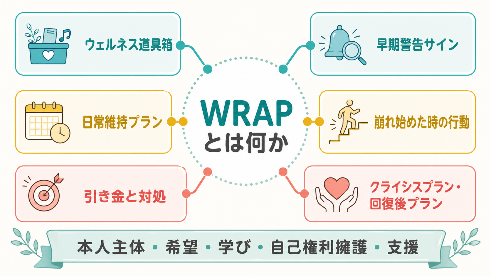
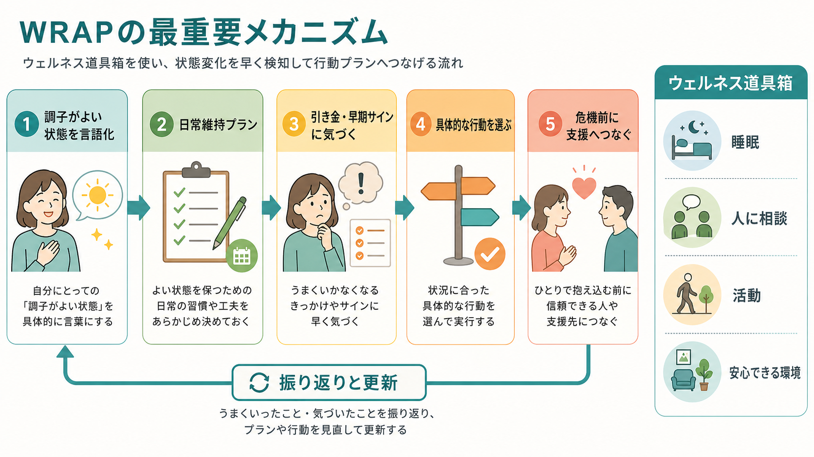
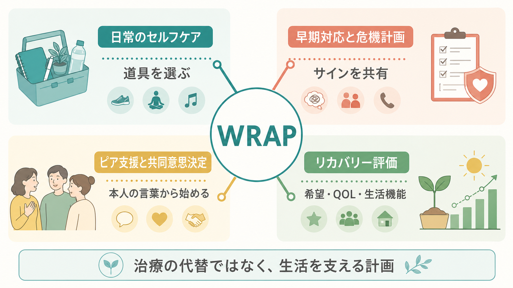

# WRAPとは何か

## 要点

- WRAP は Wellness Recovery Action Plan の略で、日本語では「元気回復行動プラン」と呼ばれることが多い。本人が、自分にとっての調子のよい状態、日常のセルフケア、調子を崩すきっかけ、早期サイン、危機時の支援、危機後の戻り方を整理する方法である[1]。
- 中核は、専門職が作る管理計画ではなく、本人が自分の言葉で作るリカバリー志向の行動計画である。希望、自己責任、学び、自己権利擁護、支援という回復概念が土台になる[1]。
- WRAP は治療の代替ではない。薬物療法、心理療法、福祉サービス、家族支援、ピアサポート、[[精神科リハビリテーションとは何か|精神科リハビリテーション]]を、本人の生活目標につなぐ補助線として使う。
- 研究では、WRAP は本人評価のリカバリー、希望、QOL、症状の一部に有益な可能性が示されている。ただし、効果の持続、文化差、実装の質、重症度ごとの適応は慎重に読む必要がある[2][3][4]。
- 危機対応を含むが、急性の自傷他害リスクや医学的緊急性がある場面で、本人だけに対応を任せる道具ではない。[[クライシスプランとは何か|クライシスプラン]]や地域支援と接続して、安全を優先する。

## この記事で答える問い

1. WRAP は何を整理する方法なのか。
2. 「ウェルネス道具箱」「日常維持プラン」「早期警告サイン」「クライシスプラン」はどうつながるのか。
3. WRAP はリカバリー志向支援、ピアサポート、臨床実践、研究評価とどのように接続するのか。
4. WRAP を使うときに避けるべき誤解は何か。

## まず結論

WRAP は、「調子が悪くなったらどうするか」だけを書く危機対応表ではない。むしろ、本人が日常の中で自分を保つ方法を見つけ、変化のサインに早く気づき、必要な支援へつながり、危機の後に生活へ戻る道筋をあらかじめ持っておくためのセルフマネジメントの枠組みである[1]。

重要なのは、計画の内容が本人の価値観と生活に根ざしていることである。たとえば「散歩する」「薬を飲む」「早く寝る」という行動も、本人にとって意味があり、実際に使える形で書かれていなければ、危機時には機能しにくい。WRAP は、支援者が「正しい生活」を指示するためではなく、本人が自分の経験知を整理し、必要なときに他者へ伝えやすくするための方法である。

## 背景

WRAP は、Mary Ellen Copeland と精神的困難の経験をもつ人々の実践から発展した、リカバリー教育とセルフマネジメントの方法である。公式説明では、WRAP は「自分で設計する予防とウェルネスのプロセス」であり、誰もが自分の生活を望む方向へ整えるために使えるものとして説明されている[1]。

この発想は、[[リカバリー志向支援とは何か|リカバリー志向支援]]と深く重なる。SAMHSA はリカバリーを、健康とウェルネスを改善し、自己決定的な生活を送り、潜在力に向かう変化の過程として整理している[5]。WHO も地域精神保健サービスについて、施設中心ではなく、本人中心・権利基盤・地域生活中心の支援へ転換する必要を強調している[6]。WRAP は、この理念を「毎日の行動」「早期対応」「危機時の希望」「支援者への伝え方」に落とし込む道具として理解できる。

## 基本概念

### ウェルネス道具箱

ウェルネス道具箱とは、自分が調子を保つため、または調子が落ちたときに持ち直すために使える行動・環境・人・考え方のリストである[1]。睡眠、食事、散歩、服薬、音楽、入浴、日記、信頼できる人への連絡、静かな場所に行く、予定を減らす、専門職へ相談する、といった内容が入りうる。

ここで大切なのは、一般論として健康によい行動を並べることではない。「自分にとって効いたこと」「試してみたいこと」「支援者に勧められて納得できること」を、本人が選び直せる形にしておくことである。これは[[心理教育とは何か|心理教育]]と似ているが、知識を伝えるだけでなく、生活上の実行可能性まで扱う点に特徴がある。

### WRAPの六つの部分

WRAP は通常、ウェルネス道具箱を土台に、六つの部分を組み立てる[1]。

| 部分 | 何を書くか | 役割 |
|---|---|---|
| 日常維持プラン | 調子がよい自分の状態、毎日必要なこと、時々役立つこと | よい状態を再現しやすくする |
| 引き金と対処 | 調子を崩しやすい外的出来事と、そのときの行動 | 反応を早く整える |
| 早期警告サイン | 内側で起きる微細な変化 | 悪化する前に動く |
| 崩れ始めた時の行動 | かなり悪くなったときの具体策 | 危機への進行を遅らせる |
| クライシスプラン | 自分で判断・行動しにくい時期に、誰に何をしてほしいか | 本人の希望を危機時にも残す |
| 回復後プラン | 危機の後に生活へ戻るための段階 | 無理な復帰や再燃を防ぐ |

この構成は、症状の重さを一方向に並べるだけではない。日常から危機後までを連続的に見て、どの段階でも「本人が使えるもの」「他者に頼むこと」「避けたいこと」を書いておく点が重要である。

## 仕組み

WRAP のメカニズムは、単純に「前向きに考える」ことではない。実践的には、次の循環として理解しやすい。

第一に、調子がよい状態を具体化する。本人が「自分はどういうときに落ち着いているか」「何があると生活が保たれるか」を言語化すると、支援の目標が症状名だけに回収されにくくなる。

第二に、日常の維持行動を先に決める。危機が起きてから考えるのではなく、睡眠、予定、服薬、食事、人との接点、安心できる場所などを、平時の生活に組み込む。

第三に、引き金と早期サインを区別する。引き金は外側の出来事であり、早期警告サインは内側の変化である。たとえば「職場で強い叱責を受ける」は引き金、「眠れない」「過敏になる」「連絡を返せなくなる」は早期サインである。この区別により、環境調整とセルフケアを分けて考えられる。

第四に、具体的行動へ落とし込む。「気をつける」ではなく、「予定を半分にする」「主治医に予約を早める」「家族には短いメッセージだけ送る」「夜にスマートフォンを別室へ置く」のように、行動単位にする。

第五に、危機時に他者が本人の希望を参照できるようにする。これは[[共同意思決定とは何か|共同意思決定]]の延長であり、危機時に本人の意思が見えにくくなるほど、平時に共有した希望が重要になる。

## 図解

WRAP を臨床・研究とつなげて見ると、日常のセルフケア、早期対応、ピア支援、リカバリー評価の四つが接点になる。

この図の要点は、WRAP を「症状を自力で抑える技法」と狭く見ないことである。本人が生活の中で使える道具を選び、サインを支援者と共有し、危機時にも希望を残し、成果を希望・QOL・生活機能として評価するところに、WRAP の臨床的意味がある。

## 臨床・研究との接続

### リカバリー志向支援との接続

WRAP は、[[精神科リハビリテーションとは何か|精神科リハビリテーション]]や地域生活支援において、本人の希望を具体的な行動へ変換する道具として使える。支援者は、本人のプランを「守らせる」のではなく、本人が試し、振り返り、更新できるように支える。これは[[生活技能訓練SSTとは何か|SST]]のような技能練習、[[訪問看護は精神科で何を支えるのか|精神科訪問看護]]、ケースマネジメント、ピアサポートと組み合わせやすい。

### クライシスプランとの接続

WRAP のクライシスプランは、危機時に「誰が」「何を」「どこまで」支援するか、本人が望む対応と望まない対応は何かを明確にする。これは[[クライシスプランとは何か|クライシスプラン]]、事前指示、リスク管理、家族・支援者との連絡ルートに接続する。ただし、急性の危険があるときは、本人の計画だけで完結させず、医療・救急・地域支援の安全確保を優先する。

### 研究エビデンス

Cook らの RCT では、重い精神疾患をもつ成人 519 人を対象に、ピア主導の 8 週間 WRAP と待機リストを比較した。WRAP 群では、精神症状の一部、希望、QOL の環境領域に改善が報告された[2]。別の RCT では、うつ、不安、本人評価のリカバリーへの影響が検討され、WRAP が自己管理介入として評価された[3]。

一方、2019 年の系統的レビューとメタ分析は、比較群をもつ量的研究 5 件を対象に、WRAP は本人評価のリカバリーには小さいが有意な効果を示す一方、臨床症状の低減については一貫した優位性が限定的で、効果の持続にも課題があると整理している[4]。したがって、WRAP の成果を症状尺度だけで評価すると狭すぎる。希望、自己効力感、生活の質、社会参加、支援へのアクセス、危機時の本人の意思の反映を含めて評価する必要がある。

## よくある誤解

### 「WRAPは治療を受けないための方法である」

WRAP は治療の拒否や代替を目的としない。むしろ、本人が治療、福祉、ピア支援、家族支援、セルフケアをどう使いたいかを整理する方法である。必要な医療を受けること、服薬について相談すること、入院や危機支援を選ぶことも、本人のプランに含まれうる。

### 「正しいWRAPを作れば再発しない」

WRAP は再発や危機を完全に防ぐ保証ではない。生活環境、身体疾患、トラウマ、経済的不安、対人関係、制度アクセスなどは本人の努力だけで変えられない。WRAP は、危機が起きたときにも戻れる足場を作り、早めに支援へつながるための道具である。

### 「本人主体とは、本人に責任を返すことである」

本人主体は、支援者が手を引くことではない。本人の選択を尊重しながら、選択肢、情報、環境調整、同行、ピアサポート、危機時の安全確保を用意することである。支援が薄いまま「自己管理してください」と言うことは、WRAP のリカバリー志向とは逆である。

### 「一度作れば完成である」

WRAP は生活とともに変わる。仕事、学校、家族関係、住まい、薬、身体状態、季節、支援者が変われば、有効な道具も変わる。定期的に見直し、うまくいかなかった部分を失敗としてではなく、更新材料として扱うことが大切である。

## 関連ノート

- [[リカバリー志向支援とは何か]]
- [[精神科リハビリテーションとは何か]]
- [[クライシスプランとは何か]]
- [[安全計画とは何か]]
- [[ケースフォーミュレーションとは何か]]
- [[生活技能訓練SSTとは何か]]
- [[訪問看護は精神科で何を支えるのか]]

MOC更新候補: [[MOC｜臨床実践・治療]]、[[MOC｜リハビリ・生活支援]]、[[MOC｜医療安全・危機対応]]。

## 理解チェック

1. WRAP のウェルネス道具箱には、どのような種類の行動や支援が入るか。
2. 「引き金」と「早期警告サイン」は何が違うか。
3. WRAP が治療の代替ではなく、治療や生活支援をつなぐ道具である理由を説明できるか。
4. WRAP の成果を症状尺度だけで測ると、何を見落とす可能性があるか。
5. 危機時に本人の希望を尊重しつつ、安全確保を優先するには、どのような共有が必要か。

## 参考文献

[1] Wellness Recovery Action Plan. WRAP Overview. https://www.wellnessrecoveryactionplan.com/wrap-overview/

[2] Cook, J. A., Copeland, M. E., Jonikas, J. A., Hamilton, M. M., Razzano, L. A., Grey, D. D., Floyd, C. B., Hudson, W. B., Macfarlane, R. T., Carter, T. M., & Boyd, S. (2012). Results of a randomized controlled trial of mental illness self-management using Wellness Recovery Action Planning. *Schizophrenia Bulletin*, 38(4), 881-891. https://doi.org/10.1093/schbul/sbr012

[3] O'Keeffe, D., Hickey, D., Lane, A., McCormack, M., Lawlor, E., Kinsella, A., O'Donoghue, O., & Clarke, M. (2016). Mental illness self-management: a randomised controlled trial of the Wellness Recovery Action Planning intervention for inpatients and outpatients with psychiatric illness. *Irish Journal of Psychological Medicine*, 33(2), 81-92. https://doi.org/10.1017/ipm.2015.18

[4] Canacott, L., Moghaddam, N., & Tickle, A. (2019). Is the Wellness Recovery Action Plan (WRAP) efficacious for improving personal and clinical recovery outcomes? A systematic review and meta-analysis. *Psychiatric Rehabilitation Journal*, 42(4), 372-381. https://doi.org/10.1037/prj0000368

[5] Substance Abuse and Mental Health Services Administration. SAMHSA's Working Definition of Recovery. 2012. https://library.samhsa.gov/product/samhsas-working-definition-recovery/pep12-recdef

[6] World Health Organization. (2021). *Guidance on community mental health services: Promoting person-centred and rights-based approaches*. https://www.who.int/publications/i/item/9789240025707

## 未解決問題

- WRAP の効果は、個人作成、グループ実施、ピア主導、専門職併用でどのように変わるのか。
- 日本の医療・福祉制度、家族同居、就労支援、障害福祉サービスの文脈で、どの実装方法が本人主体を保ちやすいのか。
- 効果測定では、症状、QOL、希望、自己権利擁護、危機時の本人意思の反映、支援者との共有度をどう組み合わせるべきか。
