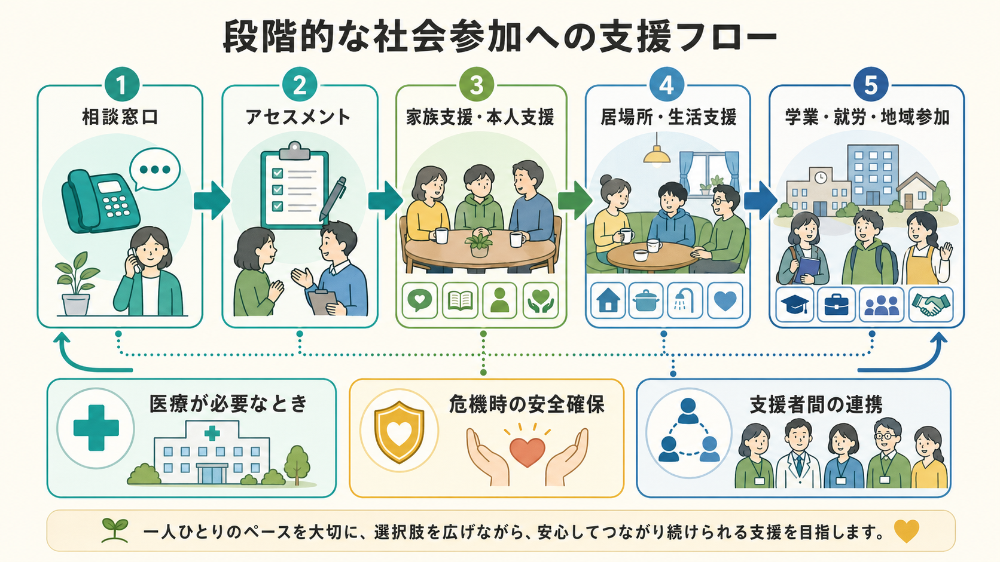

# ひきこもり支援とは何か

## 要点

- ひきこもり支援は、本人を外へ出す技術ではなく、本人の安全、尊厳、生活機能、家族の負担、地域資源とのつながりを同時に扱う支援である[1][2]。
- ひきこもり状態は、外出頻度の低さだけでなく、孤立、苦痛、生活機能の低下、家族関係、経済・教育・就労の困難を含む多次元の状態として理解する必要がある[3][4]。
- 初期支援では、本人が直接相談に来ないことも多いため、家族相談、危機時の安全確認、プライバシーに配慮した情報共有、支援者間連携が重要になる[1][2][5]。
- 社会参加は「就労」だけではない。本人にとって安全な居場所、生活リズム、医療・福祉・教育・就労支援、当事者会・家族会などを段階的に組み合わせる[1][2]。
- 強制的な連れ出し、高額契約、不透明な民間支援、本人の同意を軽視した介入は、支援ではなく二次被害になりうる[6]。

## この記事で答える問い

1. ひきこもり支援は、相談、家族支援、医療、福祉、就労支援と何が違うのか。
2. なぜ本人への直接介入だけでなく、家族支援や地域連携が重要なのか。
3. 「段階的な社会参加」とは、実践上どのような順序で考えればよいのか。
4. よくある誤解や危険な介入をどう避けるべきか。

## まず結論

ひきこもり支援とは、本人を急いで学校・職場・社会へ戻すことではなく、孤立が長期化しても安全と尊厳が損なわれないようにしながら、本人と家族が相談できる接点を保ち、生活上の選択肢を少しずつ広げる支援である。

厚生労働省は、ひきこもり状態にある本人や家族が身近なところで相談し、必要な支援を受けられる環境づくりとして、市区町村の相談窓口、居場所づくり、関係者ネットワーク、当事者会・家族会などを進めている[1]。ひきこもり地域支援センターも、本人だけでなく家族からの相談を受け、福祉、行政、医療、就労、居場所づくりなどの関係機関と連携する窓口として位置づけられる[2]。

臨床的には、ひきこもり状態を単一の診断名として扱うより、[[精神疾患と孤立はどう関係するのか|孤立]]、不安、抑うつ、発達特性、トラウマ、家族関係、経済的困難、学校・職場での失敗体験、スティグマを含む多要因の状態として見るほうが実践的である[4][7]。そのため、支援は[[ケースマネジメントとは何か|ケースマネジメント]]、[[家族支援とは何か|家族支援]]、[[精神科リハビリテーションとは何か|精神科リハビリテーション]]、[[リカバリー志向支援とは何か|リカバリー志向支援]]と重なり合う。

## 背景

ひきこもりは、しばしば若者の問題として語られるが、現在は中高年を含む広い年齢層の課題である。令和4年度の内閣府調査では、広義のひきこもり状態は15-39歳で2.05%、40-64歳で2.02%とされ、厚生労働省も15-64歳ではおよそ50人に1人が該当すると紹介している[1][3]。これは、ひきこもりを「一部の特殊な家庭の問題」と見る理解では不十分であることを示している。

研究上も、ひきこもりは日本固有の現象にとどまらず、国際的に報告される社会的ひきこもり・長期的社会的孤立の問題として扱われるようになっている[4][7]。Katoらは、ひきこもりを、少なくとも6か月以上の著しい家庭内での社会的孤立、機能障害または苦痛を伴う状態として整理し、精神疾患、社会不安、抑うつ、現代社会の就労・教育環境、家族関係、文化的文脈を含む多次元的評価を提案している[4]。

ただし、ひきこもり状態にある人を一括りにすることは危険である。本人が外出しない背景には、精神疾患、身体疾患、発達特性、いじめ、不登校、失職、介護、家庭内葛藤、経済問題、社会的スティグマなどがありうる。したがって支援は「原因を一つに決める」よりも、本人の現在の安全、生活、苦痛、希望、関係性を丁寧に評価するところから始まる。

## 基本概念

### 本人中心と安全確認

本人中心とは、本人の希望をそのまま無条件に実行するという意味ではない。自傷他害、虐待、深刻なセルフネグレクト、身体疾患、栄養不良、希死念慮、家庭内暴力、経済的搾取などのリスクを確認しながら、本人が理解できる形で選択肢を提示し、合意可能な範囲から支援を始めることである[1][5]。この点は[[共同意思決定とは何か|共同意思決定]]や[[精神科で生活機能をどう評価するか|生活機能評価]]と近い。

### 家族支援

本人が相談窓口につながっていない段階では、家族が最初の相談者になることが多い。家族支援は、家族に本人を説得させるための訓練ではない。家族が孤立し、疲弊し、焦りや罪悪感を抱えたままになると、本人との関係も緊張しやすい。家族が状況を整理し、危機時の相談先を知り、本人への声かけや距離の取り方を見直せること自体が支援になる[2][8]。

家族向け介入については、ひきこもり本人が直接支援に出てこない場合に家族介入が重要になりうることが指摘され、短期家族プログラムの予備的RCTも報告されている[4][8]。ただし、効果研究はまだ発展途上であり、特定の技法だけを万能視しないほうがよい。

### 段階的な社会参加

社会参加は、就労や通学だけではない。本人にとっては、家族以外の誰かに短く返信する、相談員とオンラインで話す、近所に出る、当事者会を見学する、居場所に短時間滞在する、生活リズムを少し整えることも、社会参加の一部である。

この段階性を見ないまま「早く働く」「学校へ戻る」と迫ると、本人には失敗の再体験として受け取られ、回避と孤立が強まることがある。支援者は、[[生活リズム支援とは何か|生活リズム支援]]、[[デイケアとは何か|デイケア]]、[[就労支援とは何か|就労支援]]、[[精神科訪問看護とは何か|精神科訪問看護]]などを、本人のペースとリスクに合わせて組み合わせる。

## 仕組み

ひきこもり支援の中心メカニズムは、「安心して相談できる関係をつくり、本人と家族の脅威反応を下げ、小さな選択肢を増やすこと」である。これは単なる心理的励ましではない。相談先、危機時対応、医療評価、経済支援、居場所、家族の休息、就労・学業の再接続を整えることで、本人が次の一歩を選べる条件をつくる。

実践上は、次の順序で考えると整理しやすい。

| 段階 | 支援者が見ること | 具体例 |
|---|---|---|
| 1. 接点づくり | 誰が、どの窓口と、どの頻度でつながれるか | 家族相談、本人のメール相談、電話、訪問の可否 |
| 2. 安全確認 | 生命・身体・権利・生活維持のリスク | 希死念慮、暴力、虐待、栄養、医療中断、借金 |
| 3. アセスメント | 孤立の背景と維持要因 | 不安、抑うつ、発達特性、不登校、失職、家族葛藤 |
| 4. 家族支援 | 家族の疲弊、関わり方、相談先 | 家族会、心理教育、危機時連絡先、休息 |
| 5. 本人支援 | 本人が受け入れやすい支援 | オンライン相談、居場所、医療、生活支援 |
| 6. 社会参加 | 本人にとって意味のある参加 | 当事者会、学業、就労準備、ボランティア、趣味活動 |
| 7. 見直し | 支援が負担や強制になっていないか | 頻度調整、目標変更、担当者間共有 |

ひきこもり地域支援センターは、この流れのすべてを単独で担う場所というより、相談支援と地域連携のハブである。厚生労働省のポータルでは、センターが専門職を中心に相談支援を行い、福祉・行政、医療、就労、居場所づくりなどの関係先と連携すると説明されている[2]。

## 図解

この記事の2枚の図は、次のように読む。

1枚目は、相談窓口からアセスメント、家族支援・本人支援、居場所・生活支援、学業・就労・地域参加へ進む流れを示している。重要なのは、この矢印が一方向の「卒業ルート」ではないことである。状態が悪化したときには医療や危機時対応へ戻り、支援者間の連携を再調整する。

2枚目は、焦りや強制が回避と孤立を強める一方で、安心、尊重、相談しやすさが次の一歩を生みやすくすることを示している。ここでいう安心は、何もしないことではない。安全確認と選択肢の提示を続けながら、本人が耐えられる負荷に調整することである。

## 臨床・研究との接続

臨床では、ひきこもり支援を「精神科治療の前段階」とだけ見ると見落としが生じる。精神疾患が明らかな場合には医療評価や治療が必要だが、医療だけで住まい、収入、家族関係、社会参加、学業・就労の課題が解決するわけではない。WHOの地域精神保健ガイダンスも、本人中心・権利ベースの地域サービス、住まい、教育、雇用などの社会的決定要因への連携を重視している[5]。

研究面では、ひきこもりの定義、重症度、文化差、併存疾患、家族機能、介入効果の測定が課題である。LiとWongの系統的レビューは、社会的ひきこもりに関する定義や介入研究が多様で、エビデンスに基づく実践はまだ乏しいと整理している[7]。したがって、支援現場では、単一のプログラムを標準解とみなすより、本人の状態、家族状況、地域資源、支援の負担を継続的に評価する必要がある。

評価指標としては、外出回数や就労の有無だけでなく、本人の苦痛、睡眠、食事、対人接触、相談可能性、家族負担、危機時対応、生活満足度、権利侵害の有無を見る。これは[[5Pモデルとは何か|5Pモデル]]や[[ケースフォーミュレーションとは何か|ケースフォーミュレーション]]にも接続できる。

## よくある誤解

### 誤解1: ひきこもり支援のゴールは就労である

就労は重要な選択肢だが、唯一のゴールではない。本人の安全、生活の安定、対人関係、学び直し、役割、居場所、家族関係の回復も支援目標になる。就労を目標にする場合も、[[IPS援助付き雇用とは何か|援助付き雇用]]や就労準備のように、本人の希望と支援環境を合わせて考える。

### 誤解2: 家族が厳しくすれば本人は動く

一時的に行動が変わることはあっても、強い圧力や羞恥を使う介入は、信頼関係を壊し、相談しにくさを強めることがある。家族に必要なのは、本人を追い詰める役割ではなく、支援者とつながり、危機時の対応を知り、家庭内の緊張を下げるための支えである。

### 誤解3: 本人が来ないなら支援できない

本人が直接相談しなくても、家族相談、支援者間連携、危機時対応、生活困窮や医療の相談、家族会への接続など、できる支援はある[2][8]。ただし、本人の個人情報を無断で共有したり、本人の同意を無視して介入したりしてよいという意味ではない。

### 誤解4: 強制的に連れ出す民間支援も選択肢である

強制的な利用、暴力、不透明な高額契約、専門職の不在などは重大なリスクである。厚生労働省も、ひきこもり支援を掲げる民間事業をめぐる消費者トラブルへの注意喚起を行い、公的相談窓口への相談を案内している[6]。支援は、本人の安全と権利を守るものでなければならない。

## 関連ノート

- [[家族支援とは何か]]
- [[家族心理教育とは何か]]
- [[ケースマネジメントとは何か]]
- [[リカバリー志向支援とは何か]]
- [[精神科リハビリテーションとは何か]]
- [[生活リズム支援とは何か]]
- [[就労支援とは何か]]
- [[デイケアとは何か]]
- [[精神科訪問看護とは何か]]
- [[精神疾患と孤立はどう関係するのか]]
- [[不登校は精神医学的にどう理解するのか]]
- [[共同意思決定とは何か]]
- [[精神科におけるスティグマをどう扱うか]]

## 関連ノート候補

- アウトリーチ支援とは何か
- ひきこもり地域支援センターとは何か
- 居場所支援とは何か
- 家族会とは何か
- 社会的孤立への地域支援とは何か

## MOC更新候補

- `content/00_MOC/MOC｜リハビリ・生活支援.md`
- `content/00_MOC/MOC｜司法・制度・地域精神医療.md`

並列ジョブとの競合を避けるため、このタスクでは MOC 本体は更新していない。

## 理解チェック

1. ひきこもり支援を「本人を外に出すこと」と定義すると、どのような見落としが起こるか。
2. 本人が相談に来ていない段階で、家族支援として何ができるか。
3. 段階的な社会参加を考えるとき、就労や通学以外にどのような目標を置けるか。
4. 強制的な連れ出しや高額な民間支援が問題になりうる理由は何か。

## 参考文献

[1] 厚生労働省. (2025). *ひきこもり支援ハンドブック～寄り添うための羅針盤～*. https://www.mhlw.go.jp/content/12200000/001605332.pdf

[2] 厚生労働省. *全国の相談窓口はこちら｜ひきこもりVOICE STATION*. https://hikikomori-voice-station.mhlw.go.jp/support/

[3] こども家庭庁. (2023). *こども・若者の意識と生活に関する調査（令和4年度）*. https://www.cfa.go.jp/resources/research/chilren-attitudes

[4] Kato, T. A., Kanba, S., & Teo, A. R. (2019). Hikikomori: Multidimensional understanding, assessment, and future international perspectives. *Psychiatry and Clinical Neurosciences*, 73(8), 427-440. https://doi.org/10.1111/pcn.12895

[5] World Health Organization. (2021). *Guidance on community mental health services: Promoting person-centred and rights-based approaches*. https://www.who.int/publications/i/item/9789240025707

[6] 厚生労働省. (2018). *ひきこもり支援を目的として掲げる民間事業の利用をめぐる消費者トラブルに御注意ください*. https://www.mhlw.go.jp/kinkyu/180305.html

[7] Li, T. M. H., & Wong, P. W. C. (2015). Youth social withdrawal behavior (hikikomori): A systematic review of qualitative and quantitative studies. *Australian & New Zealand Journal of Psychiatry*, 49(7), 595-609. https://doi.org/10.1177/0004867415581179

[8] Kubo, H., Urata, H., Sakai, M., Nonaka, S., Kishimoto, J., Saito, K., Tateno, M., Kobara, K., Fujisawa, D., Hashimoto, N., Suzuki, Y., Honda, Y., Nakao, T., Otsuka, K., Kanba, S., Kuroki, T., & Kato, T. A. (2023). 3-day intervention program for family members of hikikomori sufferers: A pilot randomized controlled trial. *Frontiers in Psychiatry*, 13, 1029653. https://doi.org/10.3389/fpsyt.2022.1029653

## 未解決問題

- ひきこもり支援の効果を、外出・就労だけでなく、本人の苦痛、家族負担、生活機能、権利保障、相談可能性としてどう測定するか。
- オンライン相談、訪問支援、居場所、家族会をどの順序・頻度で組み合わせると、本人の負担を増やさずにつながりを保てるか。
- 発達特性、精神疾患、身体疾患、介護、貧困、家庭内暴力が重なるケースで、支援者間の責任分担をどう設計するか。
- 強制的・商業的支援による二次被害を防ぐため、地域でどのような相談導線と権利擁護の仕組みが必要か。
