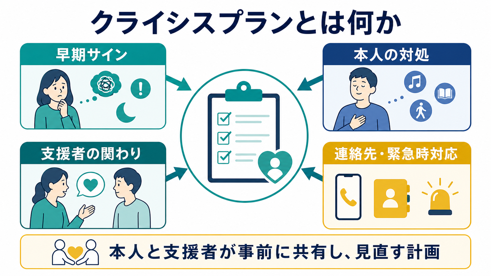
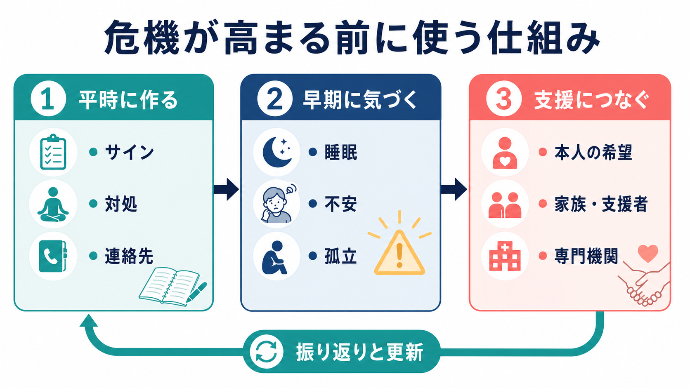
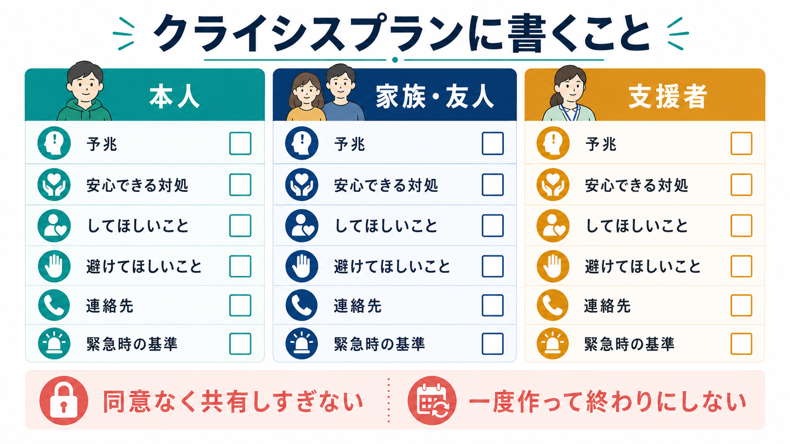

# クライシスプランとは何か

## 要点

- クライシスプランは、調子が崩れ始めたときのサイン、本人が使える対処、支援者にしてほしいこと、避けてほしいこと、連絡先、緊急時の選択肢を、平時に本人と支援者で整理した計画である。
- 目的は「危機を完全に消す」ことではなく、危機が深まる前に気づき、本人の希望と安全確保を両立しながら支援につなぐことである。
- NICE は、危機リスクのある人に対して、本人とケアコーディネーターが危機計画を作成し、ケア計画に組み込み、実際に尊重・実施することを推奨している[1]。
- 研究では、共同危機計画や事前指示は強制入院を減らす可能性が示されている一方、実装の仕方によって効果は大きく変わる[2][3][4]。
- 自殺危機に特化した安全計画は、警告サイン、対処、連絡先、専門機関、手段安全化を優先順位づける短時間介入として研究されており、クライシスプランと重なるが同一ではない[6]。

## この記事で答える問い

1. クライシスプランとは何を計画するものか。
2. どのような項目を入れると、危機時に使いやすくなるのか。
3. 共同意思決定、多職種連携、リカバリー志向支援とどうつながるのか。
4. エビデンスと限界はどこにあるのか。
5. 形式だけの計画にしないために、何に注意すべきか。

## まず結論

クライシスプランとは、本人が比較的落ち着いている時期に、本人・家族・支援者・専門職が「危機が高まる前に何を見るか」「何を試すか」「誰に、どの順番で連絡するか」「どの対応は助けになり、どの対応は負担になるか」を言葉にした共有計画である。危機時の判断をすべて自動化するものではないが、混乱した場面で本人の希望、過去に役立った対処、支援者の役割を参照できるようにする。

NICE の成人精神保健サービス利用者経験ガイドラインは、危機計画に、危機の早期警告サインと対処、入院予防のために利用できる支援、入院が必要な場合の希望、入院中の実務的ニーズ、事前意思表示、家族・ケアラーの関与、24時間アクセス、連絡先を含めることを勧めている[1]。この発想は、[[共同意思決定とは何か]]、[[意思決定支援とは何か]]、[[精神科で多職種連携はなぜ重要なのか]]と強く結びつく。

## 背景

精神科領域の危機は、突然「何もないところから」起きることもあるが、多くの場合は前ぶれを伴う。睡眠の乱れ、食事量の変化、服薬中断、孤立、被害的な解釈、焦燥、物質使用、家族との衝突、職場や学校での負荷、身体不調などが重なり、支援につながる前に状態が悪化することがある。

従来の危機対応は、危機が起きた後の評価、救急受診、入院、行動制限に集中しやすかった。しかし、危機が起きる前に本人の好み、苦手な対応、連絡先、支援資源を共有しておけば、危機が小さい段階で調整できる余地が増える。これは[[リカバリー志向支援とは何か]]や[[訪問看護は精神科で何を支えるのか]]で扱う、本人の生活の場に近い支援と相性がよい。

英国で発展した Joint Crisis Plan は、本人、ケアコーディネーター、精神科医、プロジェクトワーカーが共同で作る危機時の希望表明であり、連絡先、病状や治療、再発指標、危機時のケア希望を含む形式として研究された[2]。一方で、後続の大規模試験では主要アウトカムの強制治療を有意に減らせず、治療関係の改善など一部の結果に留まった[3]。したがって、クライシスプランは「紙を作れば効く介入」ではなく、本人の言葉を反映し、支援者が実際に参照し、危機後に見直す実装プロセスとして理解する必要がある。

## 基本概念

### 何を計画するのか

クライシスプランに入る項目は、一般に次のように整理できる。

| 項目 | 書く内容 | 使い方 |
|---|---|---|
| 早期サイン | 睡眠、食事、会話量、外出、焦燥、孤立、希死念慮、物質使用などの変化 | 本人と支援者が「いつもと違う」を早く共有する |
| 本人の対処 | 休む、刺激を減らす、散歩、音楽、安心できる人に連絡、受診予約など | 危機の初期に本人が試せる選択肢を増やす |
| 支援者の関わり | 声かけの仕方、同席、家族連絡、訪問、受診調整、生活支援 | 支援者側の対応を具体化する |
| 避けたい対応 | 強い説得、叱責、急な大人数の介入、本人抜きの決定など | 危機を悪化させやすい対応を減らす |
| 連絡先 | 家族、友人、訪問看護、主治医、相談窓口、救急、行政窓口 | 迷ったときに連絡順を参照する |
| 緊急時の条件 | どの状態なら救急受診、入院相談、緊急通報を検討するか | 支援者の判断と本人の希望を接続する |
| 見直し | 使えた点、使えなかった点、更新日 | 計画を固定せず、経験から改善する |

重要なのは、一般論ではなく本人固有の情報にすることである。Farrelly らは、重い精神疾患のある人の通常の危機計画を調べ、ベースラインで個別化されていた計画は 15% に留まったと報告した[8]。この結果は、クライシスプランが制度上存在していても、「本人のサイン」「本人に効く対応」「本人が避けたい対応」が書かれていなければ、実際には使いにくいことを示している。

### 危機計画、事前指示、安全計画

クライシスプランは、いくつかの近接概念と重なる。

| 概念 | 主な焦点 | クライシスプランとの関係 |
|---|---|---|
| クライシスプラン | 危機時のサイン、対処、連絡先、支援方法 | 幅広い精神保健・生活支援の共有計画 |
| 共同危機計画 | 本人と支援チームが共同で作る危機時の希望表明 | クライシスプランの代表的な研究モデル |
| 精神科事前指示 | 判断能力が低下した場合の治療・ケア希望を事前に示す文書 | 法制度や権利擁護と接続しやすい |
| 安全計画 | 自殺危機における警告サイン、対処、支援、専門機関、手段安全化 | 自殺危機に特化した短時間介入として位置づく |
| 再発予防計画 | 再発の前ぶれ、維持因子、予防行動、治療継続 | クライシスプランより長期の予防に焦点を置くことが多い |

自殺リスクが関わる場合は、[[自殺リスク評価では何を聞くべきか]]や[[精神科救急では何を優先するべきか]]と切り離せない。Stanley らの Safety Planning Intervention with follow-up は、救急部門で自殺関連の懸念をもつ人に対し、警告サイン、内的対処、社会的接触、支援者、専門機関、致死的手段へのアクセスを減らす相談を含む安全計画と電話フォローを行う介入である[6]。これはクライシスプランの一部として学べるが、自殺危機では緊急性と安全確保がより前面に出る。

## 仕組み

クライシスプランの中心は、危機を「出来事」ではなく「経過」として扱うことにある。平時に作り、早期サインを見つけ、本人が試せる対処を使い、必要に応じて支援者や専門機関につなぎ、危機後に見直す。この循環により、危機対応は単発の救急対応ではなく、生活支援と治療計画の一部になる。

### 1. 平時に作る

危機の最中は、本人も支援者も判断の余裕を失いやすい。そのため、落ち着いている時期に作ることが重要である。本人にとって役立つ支援は、専門職が外から推測するだけではわからない。過去に「助かった声かけ」「かえって苦しかった対応」「連絡してよい相手」「知られたくない範囲」を確認する必要がある。

この作業は[[共同意思決定とは何か]]に近い。専門職はリスク、選択肢、制度、緊急時の限界を説明し、本人は価値観、希望、経験知を提供する。支援者は、実行可能な範囲と役割を明確にする。本人の希望を聞くだけでも、専門職が一方的に計画を作るだけでも不十分である。

### 2. 早期サインを共有する

早期サインは、症状名よりも観察可能な形で書くと使いやすい。「不安が高まる」だけでなく、「夜 3 時以降まで眠れない日が 3 日続く」「家族からの電話に出なくなる」「食事が 1 日 1 回になる」「SNS の投稿が急に増える」のように、本人と支援者が同じものを見られる表現にする。

ただし、サインの共有は監視ではない。本人の生活を過剰に管理すると、信頼関係を損ねる。何を共有するか、誰が見るか、どの段階で連絡するかを本人と合意しておくことが重要である。ここでは[[精神科診療における保護因子とは何か]]で扱う保護因子や支援資源も同時に整理できる。

### 3. 支援につなぐ

危機が高まったときの支援は、段階的に考えると実行しやすい。まず本人が一人で使える対処、次に安心できる人や場所、次に支援者や専門機関、最後に救急や入院の検討である。Stanley らの安全計画介入でも、本人だけでできる対処から社会的接触、専門機関、環境安全化へと優先順位づける構造が示されている[6]。

精神科の危機対応では、地域ベースの危機介入が入院を減らし、本人や家族の満足度を高める可能性がある一方、研究数や方法上の限界もある[7]。したがって、クライシスプランは地域支援、訪問看護、外来、家族支援、行政、救急医療の接続点として設計する必要がある。これは[[多職種連携は地域精神医療でなぜ重要なのか]]、[[ケア会議とは何か]]、[[家族への説明で何に注意するべきか]]とつながる。

### 4. 振り返って更新する

クライシスプランは、一度作って終わりではない。危機後には、本人の体験を中心に、何が助けになったか、何が負担だったか、どの連絡先が機能したか、支援者の役割分担に無理がなかったかを振り返る。更新日が古い計画、担当者が変わっても見直されない計画、本人が内容を知らない計画は、危機時に機能しにくい。

## 図解

クライシスプランは、次のような循環として理解できる。

1. 平時に本人の経験と希望を聞く。
2. 早期サイン、対処、支援者の役割、連絡先を具体化する。
3. 本人・家族・支援者・専門職で共有する。
4. 危機の初期に参照して使う。
5. 危機後に振り返り、更新する。

## 臨床・研究との接続

### 強制入院を減らす可能性

Henderson らの単盲検 RCT では、精神病性疾患または双極性障害があり過去 2 年以内に入院経験のある 160 名を対象に共同危機計画を検討し、強制入院・強制治療の使用を減らす可能性を示した[2]。精神科事前指示や危機計画を含む advance statements のメタ分析でも、強制入院リスクの低下が報告されている[4]。

一方で、CRIMSON 試験では 569 名を対象に共同危機計画を通常治療と比較したが、主要アウトカムである強制治療に有意差はなかった[3]。この不一致は、クライシスプランの効果が、計画そのものだけでなく、作成過程、本人の参加、臨床チームの納得、実際に参照される仕組みに依存することを示している。

### 治療関係と権利擁護

クライシスプランは、リスク管理だけの道具ではない。本人が「どのように扱われたいか」「何を避けたいか」「誰に関わってほしいか」を事前に表明することで、危機時にも本人の価値観を参照しやすくなる。Cochrane レビューは、重い精神疾患に対する事前指示について、データは少なく決定的ではないが、より集中的な共同危機計画は有望であると整理している[5]。

ただし、本人の希望が常にそのまま実行できるわけではない。差し迫った自傷他害リスク、重い身体合併症、判断能力の低下、法制度上の要件がある場合、専門職には安全確保の責任がある。重要なのは、本人の希望と安全上の判断がずれたときに、何を尊重でき、何は難しく、なぜそう判断したのかを記録し、後で説明できる形にすることである。

### 生活支援との接続

危機時に問題になるのは、症状だけではない。家賃、食事、子どもやペットの世話、職場連絡、学校、服薬、身体疾患、交通手段、スマートフォンの充電、保険証や診察券、信頼できる同伴者など、生活の細部が危機対応を左右する。NICE が危機計画に、入院時の実務的ニーズや家族・ケアラーの関与を含めるよう勧めるのはこのためである[1]。

したがって、クライシスプランは医療機関だけで完結しない。[[地域定着支援とは何か]]、[[ケースマネジメントとは何か]]、[[ACTとは何か]]のような地域支援と結びつくと、危機対応は「受診するかどうか」だけでなく、「生活をどこでどう支えるか」という計画になる。

## よくある誤解

### 誤解1: クライシスプランはリスク管理表である

リスク管理は重要だが、クライシスプランは危険項目を列挙する表ではない。本人のサイン、強み、対処、希望、支援者の関わり方を含めて、危機の前後を支える計画である。リスクだけを書くと、本人にとっては「管理される文書」になり、支援者にとっても参照しにくい。

### 誤解2: 本人の希望を書けば十分である

希望を書くことは出発点だが、実行可能性を確認しなければ危機時に使えない。「母に連絡する」と書くなら、本人の同意、母の同意、連絡方法、時間帯、母ができることとできないことを確認する必要がある。支援者の負担や限界も計画に含める。

### 誤解3: 危機が高い人ほど詳細な計画が自動的に作られる

実際にはそうとは限らない。Farrelly らの研究では、通常の危機計画の個別化は低く、危機歴や自傷他害リスクと個別化の関連も明確ではなかった[8]。危機が高い人に形式的なテンプレートだけを渡しても、使える計画にはなりにくい。

### 誤解4: クライシスプランがあれば入院は不要になる

クライシスプランは入院を減らす可能性があるが、入院が必要な場面を否定するものではない。むしろ、どの条件なら地域で支え、どの条件なら救急受診や入院を検討するかを事前に話し合うことで、入院を「失敗」ではなく安全と回復のための選択肢として位置づけられる。

### 誤解5: 作成したら本人が持っていればよい

本人だけが持っていても、危機時に開けない、説明できない、支援者が存在を知らないということが起きる。共有範囲を本人と合意したうえで、外来、訪問看護、家族、相談支援、救急対応に関わる人が、必要な範囲で参照できるようにしておく。

## 関連ノート

- [[共同意思決定とは何か]]
- [[意思決定支援とは何か]]
- [[精神科で多職種連携はなぜ重要なのか]]
- [[多職種連携は地域精神医療でなぜ重要なのか]]
- [[ケア会議とは何か]]
- [[訪問看護は精神科で何を支えるのか]]
- [[リカバリー志向支援とは何か]]
- [[安全計画とは何か]]
- [[退院時の安全計画とは何か]]
- [[精神科救急では何を優先するべきか]]
- [[自殺リスク評価では何を聞くべきか]]
- [[再発予防計画とは何か]]
- [[家族への説明で何に注意するべきか]]
- [[地域定着支援とは何か]]
- [[ケースマネジメントとは何か]]
- [[ACTとは何か]]

## MOC更新候補

- [[MOC｜リハビリ・生活支援]] と [[MOC｜医療安全・危機対応]] から参照する。

## 理解チェック

1. クライシスプランに「本人が避けたい対応」を書くことは、なぜ危機対応の質に関係するのか。
2. 早期サインを「不安が強い」ではなく観察可能な形で書く利点は何か。
3. クライシスプランと自殺危機に対する安全計画は、どこが重なり、どこが異なるか。
4. 共同危機計画の研究結果が一貫しないことから、実装上どのような注意点が導けるか。
5. 本人の希望と安全確保がずれる場面で、支援者は何を記録し、何を説明する必要があるか。

## 未解決問題

- どのような作成過程、ファシリテーター、共有方法が、最も実際の危機対応で参照されやすいのか。
- 自殺危機、精神病性危機、依存症、発達特性、認知症、家族葛藤など、異なる危機の型に応じて、どこまで計画を変えるべきか。
- 電子カルテ、本人のスマートフォン、紙のカード、地域支援機関の記録を、本人の同意とプライバシーを守りながらどう接続するか。
- 強制治療を減らす効果だけでなく、本人の安心感、治療関係、家族負担、生活の継続性をどのように評価するか。

## 参考文献

[1] National Collaborating Centre for Mental Health. (2011). *Service User Experience in Adult Mental Health: Improving the Experience of Care for People Using Adult NHS Mental Health Services*. NICE Clinical Guideline 136. https://www.ncbi.nlm.nih.gov/books/NBK327291/

[2] Henderson, C., Flood, C., Leese, M., Thornicroft, G., Sutherby, K., & Szmukler, G. (2004). Effect of joint crisis plans on use of compulsory treatment in psychiatry: Single blind randomised controlled trial. *BMJ, 329*, 136. https://doi.org/10.1136/bmj.38155.585046.63

[3] Thornicroft, G., Farrelly, S., Szmukler, G., Birchwood, M., Waheed, W., Flach, C., et al. (2013). Clinical outcomes of Joint Crisis Plans to reduce compulsory treatment for people with psychosis: A randomised controlled trial. *The Lancet, 381*(9878), 1634-1641. https://doi.org/10.1016/S0140-6736(13)60105-1

[4] de Jong, M. H., Kamperman, A. M., Oorschot, M., Priebe, S., Bramer, W., van de Sande, R., et al. (2016). Interventions to Reduce Compulsory Psychiatric Admissions: A Systematic Review and Meta-analysis. *JAMA Psychiatry, 73*(7), 657-664. https://doi.org/10.1001/jamapsychiatry.2016.0501

[5] Campbell, L. A., & Kisely, S. R. (2009). Advance treatment directives for people with severe mental illness. *Cochrane Database of Systematic Reviews*, CD005963. https://doi.org/10.1002/14651858.CD005963.pub2

[6] Stanley, B., Brown, G. K., Brenner, L. A., Galfalvy, H. C., Currier, G. W., Knox, K. L., et al. (2018). Comparison of the Safety Planning Intervention With Follow-up vs Usual Care of Suicidal Patients Treated in the Emergency Department. *JAMA Psychiatry, 75*(9), 894-900. https://doi.org/10.1001/jamapsychiatry.2018.1776

[7] Murphy, S. M., Irving, C. B., Adams, C. E., & Waqar, M. (2015). Crisis intervention for people with severe mental illnesses. *Cochrane Database of Systematic Reviews*, CD001087. https://doi.org/10.1002/14651858.CD001087.pub5

[8] Farrelly, S., Szmukler, G., Henderson, C., Birchwood, M., Marshall, M., Waheed, W., Finnecy, C., & Thornicroft, G. (2014). Individualisation in crisis planning for people with psychotic disorders. *Epidemiology and Psychiatric Sciences, 23*(4), 353-359. https://doi.org/10.1017/S2045796013000401
