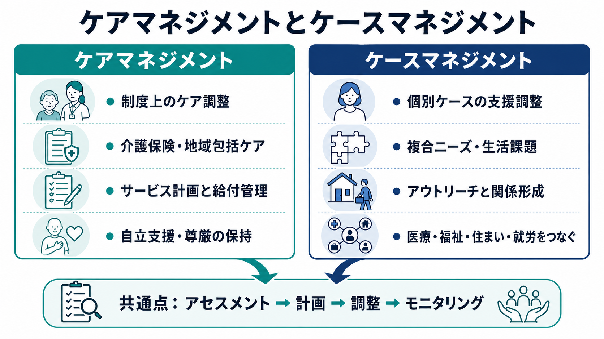
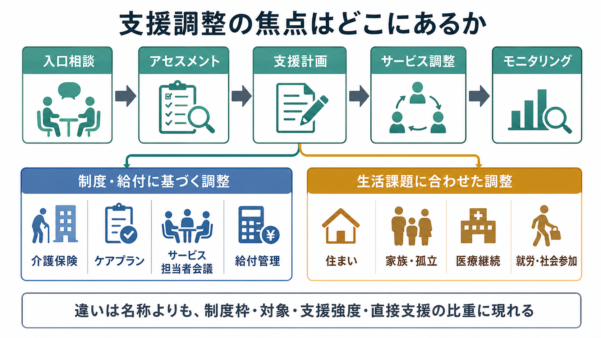

# ケアマネジメントとケースマネジメントは何が違うのか

## 要点

- **ケアマネジメント**は、日本の介護保険制度では、心身の状態や生活環境に応じてケアプランを作成し、サービス事業者や関係機関を連絡・調整する仕組みとして制度化されている[1]。
- **ケースマネジメント**は、より広く、生活上の複合ニーズをもつ個人について、アセスメント、計画、サービス接続、モニタリング、アドボカシーを行う支援過程を指す[4][5]。
- 両者は「アセスメント、計画、調整、モニタリング」を共有するが、違いは、名称そのものよりも、**制度枠、対象、支援強度、直接支援の比重、権利擁護の強さ**に現れる。
- 精神保健領域では、ケースマネジメント、とくに intensive case management や ACT に近いモデルが、入院日数の短縮や支援継続に一定の効果を示すが、効果は対象者の重症度や地域サービスの文脈に左右される[7][8]。

## この記事で答える問い

「ケアマネジメント」と「ケースマネジメント」は、どちらも支援を調整する言葉である。そのため現場では同じ意味で使われることもある。しかし、介護保険の文脈でケアマネジャーが行うケアマネジメントと、精神保健・社会福祉・医療連携で語られるケースマネジメントを完全に同一視すると、制度上の役割と臨床的な支援機能が混ざってしまう。

この記事では、両者を「どちらが正しい言葉か」ではなく、**何を調整しているのか**、**どの制度に支えられているのか**、**どの程度まで本人の生活に入り込むのか**という観点から整理する。

## まず結論

狭い意味では、ケアマネジメントは、介護保険制度のもとで、要介護・要支援者の生活課題を把握し、ケアプランを作成し、介護サービスの利用を調整する制度的な仕組みである。厚生労働省系の介護サービス情報では、居宅介護支援は、利用者が可能な限り自宅で自立した日常生活を送れるよう、ケアマネジャーがケアプランを作り、事業者や関係機関と連絡・調整するものとして説明されている[1]。

一方、ケースマネジメントは、介護保険に限られない。精神障害、依存症、 homelessness、児童・家族支援、司法、就労、慢性疾患、退院支援など、複数の制度や生活領域をまたぐ困難に対して、個別ケースを中心に支援を組み立てる実践概念である。NASW は、ケースマネジメントを、異なる社会サービス・医療機関・スタッフのサービスを計画し、探索し、権利擁護し、モニターする過程として位置づけている[4]。

したがって、実務上の整理は次のようになる。

| 観点 | ケアマネジメント | ケースマネジメント |
|---|---|---|
| 主な焦点 | 制度上のケア・サービス調整 | 個別ケースの生活支援調整 |
| 典型領域 | 介護保険、地域包括ケア、居宅介護支援 | 精神保健、社会福祉、医療連携、生活困窮、退院・地域移行 |
| 中核活動 | アセスメント、ケアプラン、サービス担当者会議、給付管理、モニタリング | アセスメント、関係形成、支援計画、資源調整、アウトリーチ、アドボカシー |
| 支援強度 | 制度基準と担当件数の枠内で調整される | 対象者のリスクや複合ニーズに応じて強弱が大きい |
| 直接支援 | 調整・計画機能が中心 | 調整に加え、同行、危機対応、生活支援、権利擁護を含むことがある |

## 背景

高齢化、慢性疾患、精神障害の地域生活支援、家族形態の変化により、単一の治療や単一のサービスだけでは生活を支えにくい場面が増えている。WHO の integrated people-centred care の枠組みも、疾患や施設を中心に設計された医療から、本人とコミュニティの包括的ニーズを中心にしたサービス編成への転換を強調している[3]。

この方向性は、[[精神科リハビリテーションとは何か]]とも接続する。精神科リハビリテーションでは、症状の軽減だけでなく、住まい、日中活動、対人関係、服薬継続、社会参加を含む生活機能が問題になる。たとえば[[薬物療法のアドヒアランスをどう支えるか]]を考える場合も、本人の理解や副作用対策だけでなく、通院手段、家族関係、経済状況、孤立、支援者との関係が影響する。

このような複合性に対して、ケアマネジメントとケースマネジメントは、どちらも「ばらばらな支援を、本人の生活に沿ってつなぐ」ための技法である。ただし、制度上の位置づけが違うため、実践上の責任範囲も異なる。

## 基本概念

### ケアマネジメント

日本の介護保険制度では、ケアマネジメントは制度的にかなり明確である。居宅介護支援では、ケアマネジャーが利用者宅を訪問して心身の状況や生活環境を把握し、課題を分析し、本人・家族・サービス提供事業者と話し合い、ケアプランを作成し、サービス利用につなげる[1]。厚生労働省のケアプラン点検資料でも、ケアマネジメントは「尊厳の保持」と「自立支援」に資するものかを検証する対象として扱われている[2]。

つまりケアマネジメントは、単なるサービス手配ではない。本人の生活課題を読み取り、サービスを組み合わせ、必要な会議と連絡調整を行い、実施後にモニタリングして見直す循環過程である。とはいえ、介護保険の文脈では、ケアプラン、サービス担当者会議、給付管理、制度上の利用限度やサービス種別といった枠組みが大きな意味をもつ。

### ケースマネジメント

ケースマネジメントは、制度名というより実践モデルに近い。社会福祉の標準では、ケースマネジャーが、本人のために複数機関のサービスを計画し、探し、調整し、モニターし、必要に応じて権利擁護を行う過程とされる[4]。医療・保健領域でも、ケースマネジメントは、本人や家族が複雑なサービス体系を移動できるよう支援し、医療・心理社会的目標を最適化する計画を作る過程として説明される[5]。

重要なのは、ケースマネジメントには多様なモデルがあることだ。文献レビューでは、ケース発見、関係形成、アセスメント、計画、ナビゲーション、サービス提供、調整、モニタリング、評価、教育、アドボカシー、支持的カウンセリング、退院・移行支援、地域資源開発など、多くの構成要素が整理されている[6]。そのため、同じ「ケースマネジメント」でも、窓口で資源につなぐ程度のモデルから、少人数担当でアウトリーチや危機対応まで行うモデルまで幅がある。

## 仕組み

両者の共通の流れは、次の循環で理解できる。

1. 入口相談・ケース発見
2. アセスメント
3. 目標設定と支援計画
4. サービス・資源の調整
5. 実施状況のモニタリング
6. 再アセスメントと計画修正

ただし、どこに重心を置くかが異なる。

ケアマネジメントでは、制度上利用できる介護サービスを、本人の状態像と生活目標に合わせて組み合わせることが中心になる。要介護度、支給限度額、サービス種別、事業所との契約、給付管理などが、支援の現実的な条件になる。

ケースマネジメントでは、制度上のサービスだけでなく、本人の生活を阻害している要因を横断的に扱う。住まいが不安定である、家族関係が支援の妨げになっている、通院が途切れやすい、金銭管理に困難がある、孤立している、就労や社会参加の足場がない、といった問題では、医療・福祉・住宅・就労・司法・地域資源をまたいだ調整が必要になる。

## 図解

図解としては、次のように読むとわかりやすい。

| 図解の読み方 | 意味 |
|---|---|
| 左側のケアマネジメント | 介護保険・地域包括ケアの枠内で、ケアプランとサービス調整を行う |
| 右側のケースマネジメント | 個別ケースの複合ニーズに応じて、生活領域を横断して支援を組み立てる |
| 下段の共通プロセス | どちらもアセスメント、計画、調整、モニタリングを循環させる |
| 分岐点 | 制度枠・対象者・支援強度・直接支援の比重が違いを作る |

## 臨床・研究との接続

精神保健領域では、ケースマネジメントは地域生活支援の研究対象として検討されてきた。Mueser らのレビューでは、重い精神疾患をもつ人に対する地域ケアモデルの研究が整理され、ACT や intensive case management は、特にサービス利用が多い人で入院期間の短縮や住居安定に関連することが示された[8]。

Cochrane レビューでも、intensive case management は標準的ケアと比べて入院を減らし、支援から脱落しにくくする可能性があるとされた。ただし、エビデンスの質は非常に低いものから中等度までで、地域の制度や既存サービスの違いが大きく、すべての対象者に一律に有効と断定できるわけではない[7]。

ここから臨床的に言えるのは、ケースマネジメントは「名前をつければ効く介入」ではないということだ。重要なのは、担当件数、アウトリーチ、危機対応、チーム構造、関係形成、モデル忠実度、地域資源の厚みである。[[精神科薬物療法とは何か]]や[[身体活動処方とは何か]]のような個別介入も、生活の中で継続されなければ効果が出にくい。ケースマネジメントは、それらの介入を生活の時間軸に接続するための基盤になりうる。

## よくある誤解

### 誤解1: ケアマネジメントは介護保険だけの事務作業である

介護保険上のケアマネジメントには、給付管理や制度書類が含まれる。しかし本来は、尊厳の保持、自立支援、生活課題の把握、サービス調整、モニタリングを含む対人援助である[2]。事務作業だけに縮小すると、本人の生活目標やストレングスを見落としやすい。

### 誤解2: ケースマネジメントは何でも屋である

ケースマネジメントは、本人の生活課題に幅広く関わるが、無限定にすべてを引き受ける役割ではない。むしろ、誰が何を担うのかを明確にし、支援の重複・抜け・断絶を減らすための実践である[4][6]。

### 誤解3: ケアマネジメントとケースマネジメントは完全に別物である

両者はかなり重なる。どちらも、本人のニーズを評価し、計画を立て、資源を調整し、経過を確認する。ただし、ケアマネジメントは制度内のケア調整として語られることが多く、ケースマネジメントは複数制度をまたぐ個別支援過程として語られることが多い。

### 誤解4: 支援調整は専門職間の会議だけで完結する

会議は重要だが、本人の生活は会議室の外で続く。ケースマネジメントでは、本人との関係形成、生活場面での観察、同行、危機時の調整、社会資源へのアクセス支援が重要になる場合がある[5][6]。

## 関連ノート

既存ノートとしては、次の内容と接続しやすい。

- [[精神科リハビリテーションとは何か]]
- [[薬物療法のアドヒアランスをどう支えるか]]
- [[精神科薬物療法とは何か]]
- [[身体活動処方とは何か]]
- [[認知症治療薬とは何か]]

今後の作成候補としては、次のノートがあると理解が深まる。

- 地域包括ケアシステムとは何か
- サービス担当者会議とは何か
- ACTとは何か
- 退院支援と地域移行支援は何が違うのか
- ソーシャルワークにおけるアドボカシーとは何か

MOC 更新候補: `content/00_MOC/` 配下の臨床実践・生活支援系 MOC。並列ジョブとの衝突を避けるため、本記事では MOC 本体は更新しない。

## 理解チェック

1. ケアマネジメントとケースマネジメントの共通プロセスを、4つ以上挙げられるか。
2. 介護保険のケアマネジメントで、ケアプランと給付管理が重要になる理由を説明できるか。
3. 精神保健のケースマネジメントで、アウトリーチや少人数担当が重要になる場面を説明できるか。
4. 「支援調整」は会議だけでは不十分なことがある、という理由を生活課題の例で説明できるか。

## 参考文献

[1] 厚生労働省 介護サービス情報公表システム. 「どんなサービスがあるの？ - 居宅介護支援」. https://www.kaigokensaku.mhlw.go.jp/publish/group1.html

[2] 厚生労働省. 「ケアプラン点検について」. https://www.mhlw.go.jp/stf/seisakunitsuite/bunya/hukushi_kaigo/kaigo_koureisha/hoken/jissi_00005.html

[3] World Health Organization. Integrated people-centred care. https://www.who.int/health-topics/integrated-people-centered-care

[4] National Association of Social Workers. NASW Standards for Social Work Case Management. 2013. https://www.socialworkers.org/Practice/NASW-Practice-Standards-Guidelines/NASW-Standards-for-Social-Work-Case-Management

[5] Giardino AP, De Jesus O. Case Management. StatPearls. Updated 2023. https://www.ncbi.nlm.nih.gov/books/NBK562214/

[6] Lukersmith S, Millington M, Salvador-Carulla L. What Is Case Management? A Scoping and Mapping Review. *International Journal of Integrated Care*. 2016;16(4):2. https://doi.org/10.5334/ijic.2477

[7] Dieterich M, Irving CB, Bergman H, Khokhar MA, Park B, Marshall M. Intensive case management for severe mental illness. *Cochrane Database of Systematic Reviews*. 2017;1:CD007906. https://doi.org/10.1002/14651858.CD007906.pub3

[8] Mueser KT, Bond GR, Drake RE, Resnick SG. Models of community care for severe mental illness: a review of research on case management. *Schizophrenia Bulletin*. 1998;24(1):37-74. https://doi.org/10.1093/oxfordjournals.schbul.a033314

## 未解決問題

- 日本の介護保険上のケアマネジメントと、精神保健福祉領域のケースマネジメントを、同一地域でどのように役割分担するのがよいか。
- ケアマネジメントの質を、書類の整合性ではなく本人の生活機能・選好・参加の観点からどう評価するか。
- ケースマネジメントの効果を、入院日数だけでなく、孤立、住居安定、意思決定参加、生活満足、支援関係の継続でどう測定するか。
