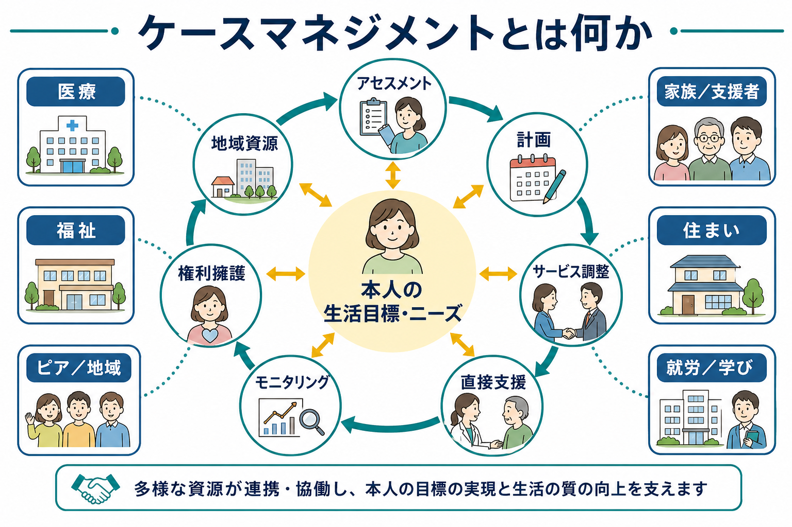
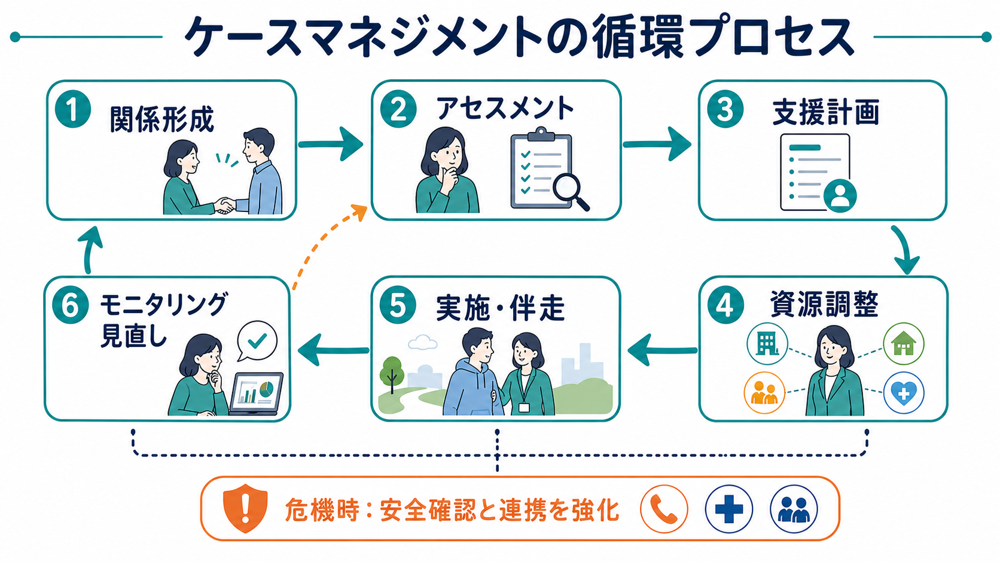
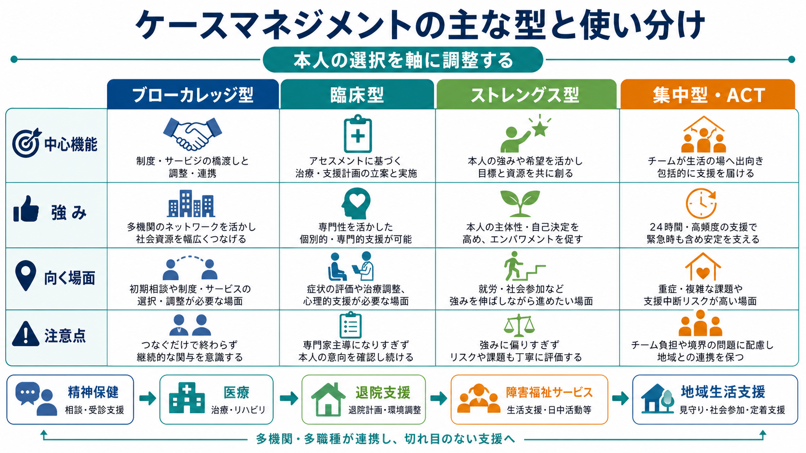

# ケースマネジメントとは何か

## 要点

- ケースマネジメントは、本人の生活上のニーズと、医療・福祉・住まい・就労・教育・家族支援・地域資源を結び直す支援方法である。
- 中核は「アセスメント、計画、サービス調整、実施、モニタリング、見直し」の循環であり、単なる紹介や事務手続きではない[1][2]。
- 精神保健領域では、症状だけでなく、住まい、服薬継続、孤立、経済、家族負担、危機時対応、社会参加を同時に扱うために重要になる[3][4]。
- 日本では、障害福祉の相談支援や「精神障害にも対応した地域包括ケアシステム」と接続して理解すると実務に落とし込みやすい[5][6]。
- 教育・研究目的の整理であり、個別の診断、治療指示、制度利用の可否判断を代替するものではない。

## この記事で答える問い

1. ケースマネジメントは、通常の相談、紹介、治療計画と何が違うのか。
2. アセスメントからモニタリングまで、どのような流れで進むのか。
3. 医療・福祉・地域生活支援では、どのような場面で役に立つのか。
4. どのような誤解や限界に注意すべきか。

## まず結論

ケースマネジメントとは、「本人が望む生活を、複数の支援や制度のあいだで途切れさせないための調整技法」である。国立精神・神経医療研究センターの解説では、ケアマネジメントはケースマネジメントと同義に扱われ、利用者のニーズをアセスメントし、必要なサービスを提供または調整し、利用者とサービスをモニタリングしながら地域生活を促す支援技法と説明されている[1]。

重要なのは、ケースマネジメントが「支援者の都合でサービスを割り振る作業」ではない点である。本人の目標、強み、困りごと、リスク、生活環境をもとに、誰が、何を、いつ、どの情報に基づいて行うかを明確にする。これは[[精神科リハビリテーションとは何か]]、[[地域連携は精神科診療で何を意味するのか]]、[[クライシスプランとは何か]]と深くつながる。

## 背景

慢性疾患、精神疾患、障害、認知症、依存症、生活困窮、住まいの不安定さ、家族負担などが重なると、単一の専門職や単一の制度だけでは支援が届きにくい。医療機関では症状や薬物療法が扱われ、福祉制度では生活支援やサービス調整が扱われ、地域では住まい、就労、教育、ピアサポート、家族支援が問題になる。本人から見ると、それらは別々の窓口ではなく「自分の生活が続くかどうか」という一つの問題である。

ケースマネジメントは、この分断を小さくするために発展してきた。SAMHSA の TIP では、ケースマネジメントを、健康、物質使用、精神保健、社会サービスを調整し、本人の具体的ニーズと目標に合うサービスへつなぐアプローチとして整理している[3]。CMSA も、アセスメント、計画、調整、評価、アドボカシーを含む協働的プロセスとして定義している[2]。

精神保健では、脱施設化と地域生活支援の文脈が大きい。WHO は、精神保健サービスを施設中心から、本人中心・権利基盤・地域生活に近い支援へ転換することを重視している[4]。日本でも、厚生労働省は、精神障害の有無や程度にかかわらず、医療、障害福祉・介護、住まい、社会参加、地域の助け合い、教育が包括的に確保される地域包括ケアを掲げている[5]。

## 基本概念

### 本人中心

ケースマネジメントの中心は「支援者が何を提供できるか」ではなく、「本人がどのような生活を望み、何に困っているか」である。ここでいう本人中心は、本人の希望をそのまま無条件に実行することではない。安全、法的要件、家族や地域の負担、支援資源の限界も含めて、本人と一緒に現実的な選択肢を組み立てることである。

この点は[[自己決定理論とは何か]]や[[インフォームドコンセントは精神科でどう行うのか]]とも接続する。本人の同意や選択を尊重するためには、情報を渡すだけでは足りない。選択肢を理解できる形にし、制度利用の障壁を減らし、必要に応じて権利擁護を行う必要がある。

### ニーズと強みの両方を見る

アセスメントでは、症状、障害、生活困難、リスクだけでなく、本人の強み、希望、過去にうまくいった対処、支えている人間関係、地域資源も見る。弱点だけを集めると、支援計画は管理的になりやすい。強みだけを見ると、リスクや制度上の制約を見落としやすい。

実務では、[[5Pモデルとは何か]]のようなケースフォーミュレーションを使うと、問題を「本人の欠点」ではなく、素因、誘因、維持因子、保護因子、現在の主訴として整理しやすい。

### アドボカシー

ケースマネジメントには、サービスを紹介するだけでなく、本人が必要な支援へアクセスできるようにする権利擁護の側面がある[2][3]。たとえば、制度の説明が難しい、予約が取れない、書類が複雑、過去の支援経験から不信感が強い、スティグマにより相談を避けている、といった障壁を下げる。

ただし、アドボカシーは「本人の代わりにすべてを決める」ことではない。本人の意思、支援目的、共有してよい情報の範囲を確認しながら行う。ここでは[[守秘義務とは何か]]や[[スティグマとは何か]]の理解が重要になる。

## 仕組み

ケースマネジメントは、直線的な手順というより循環するプロセスである。最初の計画が正解とは限らない。本人の状態、生活環境、家族状況、支援資源、制度条件は変化するため、モニタリングと見直しが不可欠になる[1][3]。

### 1. 関係形成

支援は、本人が「この人に話してもよい」と思える関係から始まる。特に精神保健や生活困窮の場面では、過去の強制的経験、不信感、恥、疲弊、孤立が相談を妨げる。初回から情報を網羅しようとするより、本人が困っている順番、話せる範囲、連絡しやすい方法を確認する。

### 2. アセスメント

アセスメントでは、症状や診断名だけでなく、生活全体を確認する。住まい、収入、食事、睡眠、服薬、通院、家族、孤立、学校・職場、移動、制度利用、危機時の連絡先、本人の価値観を分けて見る。ここで重要なのは、情報を集めること自体ではなく、支援計画に使える形に整理することである。

### 3. 支援計画

支援計画では、目標を具体化する。「安定した生活」では広すぎるため、「退院後2週間以内に訪問看護と相談支援の初回面談を行う」「次回受診までに薬の受け取り方法を確認する」「家族には危機時連絡先だけ共有する」など、行動単位に落とす。

このとき、本人の目標と支援者側のリスク認識がずれることがある。たとえば本人は就労を望み、支援者は再入院予防を優先したいかもしれない。その場合、どちらかを消すのではなく、就労準備、睡眠、通院、危機時対応を一つの計画内で組み合わせる。

### 4. 資源調整

資源調整では、医療、障害福祉、介護、住まい、就労、教育、家族支援、ピアサポート、地域活動をつなぐ。日本の障害福祉では、計画相談支援や障害者相談支援事業が、サービス等利用計画、モニタリング、情報提供、福祉サービス利用支援、権利擁護、社会資源の活用支援を担う[6]。

資源調整で起こりやすい失敗は、「紹介したので終わり」である。本人が実際にアクセスできたか、利用が本人の目標に合っているか、支援機関間で責任の空白が起きていないかを確認する必要がある。

### 5. 実施と伴走

ケースマネジメントは、調整だけでなく、必要に応じて直接支援も含む。精神保健領域のインテンシブ・ケースマネジメントや ACT では、少人数のケースロード、多職種チーム、アウトリーチ、危機時対応、生活の場での支援が重視される[7][8]。

ただし、すべての人に高密度支援が必要なわけではない。支援量は、リスク、支援中断の可能性、本人の希望、既存資源、家族や地域の負担に応じて調整する。

### 6. モニタリングと見直し

モニタリングでは、サービス利用の有無だけでなく、本人の生活が実際にどう変わったかを見る。入院日数、通院継続、住まいの安定、孤立、本人の満足度、家族負担、就労・学業、危機時対応、生活の質などが指標になりうる。

計画がうまくいかない場合は、本人の「やる気不足」と決めつけない。支援の強度、時間帯、場所、情報共有、制度条件、対人関係、症状、認知機能、スティグマ、経済的障壁を見直す。

## 図解

ケースマネジメントには複数の型がある。実務では、ひとつの型を純粋に使うより、本人の状況に応じて組み合わせることが多い。

| 型 | 中心機能 | 向く場面 | 注意点 |
|---|---|---|---|
| ブローカレッジ型 | 制度・サービスへの橋渡し | 初期相談、情報提供、比較的ニーズが限定的な場面 | つないだ後の継続確認が不足しやすい |
| 臨床型 | アセスメントと支援計画、一定の直接支援 | 症状評価や心理社会的支援が必要な場面 | 専門職主導になりすぎない |
| ストレングス型 | 本人の強み、希望、地域資源を活かす | 社会参加、就労、回復志向の支援 | リスクや生活上の制約も丁寧に見る |
| 集中型・ACT | 多職種チーム、高頻度支援、アウトリーチ | 重い精神疾患、入退院反復、支援中断リスクが高い場面 | チーム負担、境界、地域資源との連携を設計する |

## 臨床・研究との接続

### 精神保健と地域生活

重い精神疾患をもつ人では、症状、服薬、副作用、住まい、孤立、金銭、家族関係、就労、危機時対応が絡み合う。インテンシブ・ケースマネジメントに関する Cochrane レビューでは、標準ケアと比べて、サービスへの定着、社会機能、就労、住まい、入院期間などに一定の利益が示された一方、エビデンスの質や国・制度差には限界があるとされている[7]。

日本の ACT 研究でも、入院日数、抑うつ症状、満足度などに肯定的な所見が報告されているが、研究規模や制度環境を踏まえて読む必要がある[8]。したがって、「ACT が万能」というより、支援中断リスクが高く、複数の生活課題が重なる人に対して、アウトリーチと多職種チームをどう制度内で実装するかが問題になる。

### 退院支援

退院支援では、退院日を決めることより、退院後に誰が何を支えるかが重要である。住まい、通院、薬、訪問看護、相談支援、日中活動、家族負担、危機時連絡先が曖昧だと、退院後の生活は不安定になりやすい。ケースマネジメントは、病棟内の治療計画を地域の生活計画へ翻訳する働きをもつ。

### 身体疾患・依存症・高齢者支援

ケースマネジメントは精神保健だけの概念ではない。物質使用障害では、治療継続、住まい、就労、家族、HIV などの身体疾患、司法・福祉との接続が問題になるため、複数サービスをまたぐ支援が重要になる[3]。高齢者支援や慢性疾患管理でも、医療、介護、家族、生活環境の調整が必要になる。

### 研究で見るアウトカム

研究では、入院日数、再入院、救急利用、治療継続、症状、社会機能、住まい、就労、生活の質、本人満足度、家族負担、費用などがアウトカムになる。ただし、ケースマネジメントは制度や地域資源に強く依存するため、ある国や地域で有効だったモデルをそのまま別の地域へ移植できるとは限らない。

## よくある誤解

### 誤解1: ケースマネジメントは紹介先を探すだけである

紹介は一部にすぎない。本人のニーズを評価し、計画を作り、利用状況を確認し、合わなければ見直すところまで含めてケースマネジメントである。

### 誤解2: 支援者がすべて管理することである

管理ではなく調整である。本人の選択、同意、強み、生活目標を軸にする。支援者が善意で先回りしすぎると、本人の自己決定や回復感を損なうことがある。

### 誤解3: 医療が終わってから福祉が始まる

医療と福祉は時系列で分けるものではない。症状が強い時期にも生活支援は必要であり、生活が安定すると治療継続もしやすくなる。医療と福祉は同時に調整されることが多い。

### 誤解4: 会議を開けば連携できている

会議の有無より、役割、期限、連絡方法、共有する情報、次回評価日が明確かどうかが重要である。会議が多くても、本人の生活が変わらなければ調整としては不十分である。

## 関連ノート

- [[精神科リハビリテーションとは何か]]
- [[地域連携は精神科診療で何を意味するのか]]
- [[クライシスプランとは何か]]
- [[5Pモデルとは何か]]
- [[インフォームドコンセントは精神科でどう行うのか]]
- [[守秘義務とは何か]]
- [[社会的支援は健康にどう影響するのか]]
- [[スティグマとは何か]]

## 関連ノート候補

- 退院支援とは何か
- ACTとは何か
- 障害福祉サービスと相談支援
- 地域移行支援とは何か
- 地域定着支援とは何か
- ケア会議とは何か

## MOC更新候補

- `content/00_MOC/MOC｜臨床実践・治療.md`
- `content/00_MOC/MOC｜司法・制度・地域精神医療.md`

並列ジョブとの競合を避けるため、本タスクでは MOC 本体は更新しない。

## 理解チェック

1. ケースマネジメントを「紹介」ではなく「循環プロセス」として説明すると、どの要素が含まれるか。
2. 本人中心の支援と、リスク管理や安全確保はどのように両立できるか。
3. ブローカレッジ型、臨床型、ストレングス型、集中型・ACT は、どのような場面で使い分けられるか。
4. 支援がうまく進まないとき、本人の動機づけ以外に何を見直すべきか。

## 参考文献

[1] 国立精神・神経医療研究センター 精神保健研究所 地域精神保健・法制度研究部. ケアマネジメント（Care Management）. https://www.ncnp.go.jp/nimh/chiiki/about/care-management.html

[2] Case Management Society of America. What is a Case Manager? https://cmsa.org/who-we-are/what-is-a-case-manager/

[3] Center for Substance Abuse Treatment. (2000). *Comprehensive Case Management for Substance Abuse Treatment*. Treatment Improvement Protocol (TIP) Series, No. 27. SAMHSA. https://www.ncbi.nlm.nih.gov/books/NBK571722/

[4] World Health Organization. (2021). *Guidance on community mental health services: promoting person-centred and rights-based approaches*. https://www.who.int/publications/i/item/9789240025707

[5] 厚生労働省. 精神障害にも対応した地域包括ケアシステムの構築について. https://www.mhlw.go.jp/stf/seisakunitsuite/bunya/chiikihoukatsu.html

[6] 厚生労働省. 障害のある人に対する相談支援について. https://www.mhlw.go.jp/stf/seisakunitsuite/bunya/hukushi_kaigo/shougaishahukushi/service/soudan_shien.html

[7] Dieterich, M., Irving, C. B., Park, B., & Marshall, M. (2017). Intensive case management for severe mental illness. *Cochrane Database of Systematic Reviews*, CD007906. https://doi.org/10.1002/14651858.CD007906.pub3

[8] Ito, J., Oshima, I., Nishio, M., Sono, T., Suzuki, Y., Horiuchi, K., Niekawa, N., Ogawa, M., Setoya, Y., Hisanaga, F., Kouda, M., & Tsukada, K. (2011). The effect of Assertive Community Treatment in Japan. *Acta Psychiatrica Scandinavica*, 123(5), 398-401. https://doi.org/10.1111/j.1600-0447.2010.01636.x
