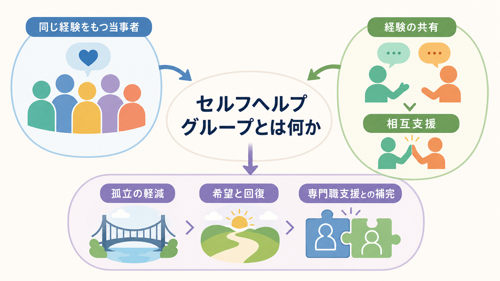
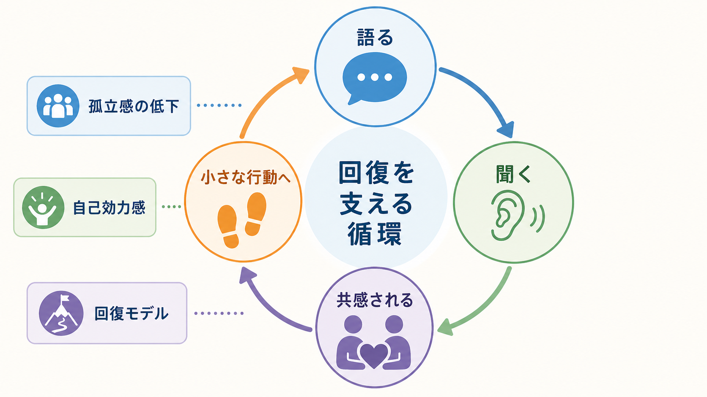
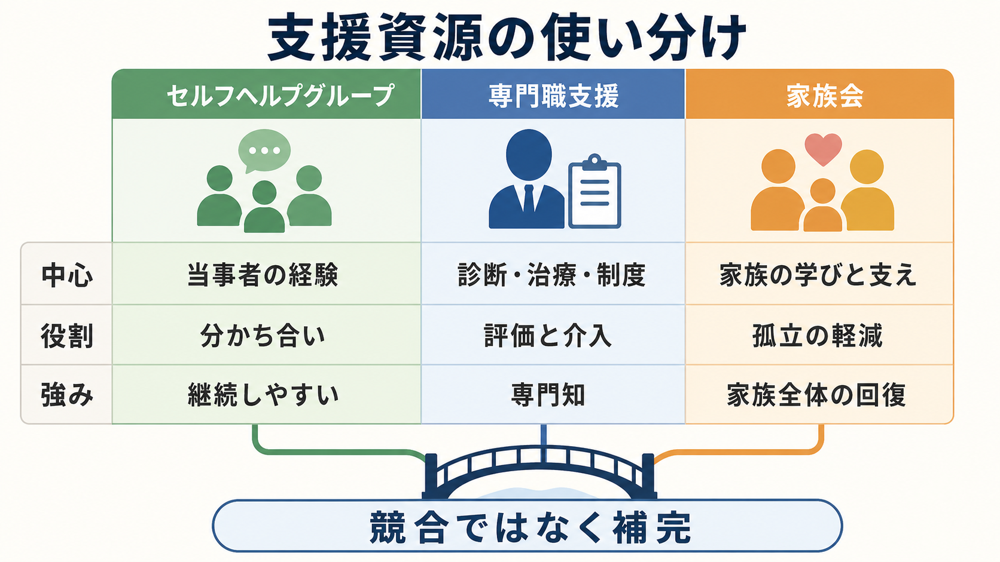

# セルフヘルプグループとは何か

## 要点

- セルフヘルプグループとは、似た病気・障害・生活上の困難・喪失体験などをもつ本人や家族が、経験を分かち合いながら互いに支え合う場である[1]。
- 依存症領域では「同じ問題を抱えた人と自発的に、当事者の意思でつながる集団」と説明され、体験を共有し、悩みを直視しながら回復を目指す資源として位置づけられる[2]。
- 中核は「専門家が正解を教えること」ではなく、同じ経験をもつ人の語り、聞くこと、共感、希望のモデル、孤立の軽減である[3][4]。
- 研究上の効果は対象や形式によりばらつくが、精神健康領域では限定的ながら有望なエビデンスがあり、依存症、とくに AA と 12 ステップ促進では比較的強い研究蓄積がある[5][8]。
- 医療・福祉・心理支援と競合するものではない。むしろ[[リカバリー志向支援とは何か]]、[[精神科リハビリテーションとは何か]]、[[ケースマネジメントとは何か]]と組み合わせることで、日常生活の中で回復を続ける足場になりやすい。

## この記事で答える問い

1. セルフヘルプグループと、専門職が行う治療・相談・グループ療法は何が違うのか。
2. 当事者同士で語り合うことは、なぜ孤立や回復に関わるのか。
3. 臨床家や支援者は、セルフヘルプグループをどのように理解し、紹介すればよいのか。
4. どのような限界や注意点があるのか。

## まず結論

セルフヘルプグループは、「同じような経験をもつ人が集まり、経験・感情・工夫・希望を分かち合うことで、互いの回復を支える場」である。治療プログラムそのものではなく、診断や治療方針を決める場でもない。しかし、病気や困難を抱えた人が「自分だけではない」と感じ、自分の言葉で経験を整理し、少し先を歩く人の姿から現実的な希望を得る場として重要である[1][3]。

臨床的には、セルフヘルプグループを「治療の代替」と考えるより、「専門職支援では届きにくい生活時間を支える相互援助」と考える方が実態に近い。とくに依存症、慢性疾患、精神障害、喪失、家族支援では、医療機関の外で継続的につながれること自体が大きな意味をもつ[2][4]。

## 背景

精神保健医療では、症状を軽くすることだけでなく、本人が地域で生活し、役割をもち、つながりを回復することが重視されるようになっている。WHO の地域精神保健サービスの技術パッケージも、ピアサポートを、希望、経験の共有、エンパワメント、人権尊重と結びつくサービスとして位置づけている[3]。

一方で、病気や依存、喪失、家族問題は、しばしば「話しにくさ」を伴う。周囲に相談しても、励ましが空回りしたり、正論が本人を追い詰めたりすることがある。セルフヘルプグループは、同じ問題を経験した人が語る場であるため、説明しなくても伝わる部分がある。この「説明し尽くさなくても分かってもらえる感覚」が、孤立を弱める入口になる。

## 基本概念

### 当事者性

セルフヘルプグループの基盤は、参加者が何らかの共通経験をもつことである。共通経験は、アルコール依存、薬物依存、ギャンブル問題、うつ病、双極症、統合失調症、発達障害、がん、難病、喪失、家族のケアなど多様である。本人のグループだけでなく、家族会や遺族会のように、周囲の人が共通経験をもつ場も含まれる[1][2]。

### 相互援助

支援は一方向ではない。ある日は話を聞いてもらう人が、別の日には他の人の話を聞く側に回る。自分の経験が誰かの助けになると感じることは、無力感を弱め、自己効力感や参加感を支える。質的研究でも、セルフヘルプ・相互援助グループは、情緒的・実践的支援の交換、知識や自信の獲得、参加機会を通じてメンタルウェルビーイングに寄与しうると報告されている[6]。

### 匿名性と安全

多くのグループでは、匿名性、守秘、批判しないこと、助言を押しつけないことが重視される。これは単なるマナーではなく、恥や恐れを抱えた人が話し始めるための条件である。ただし、実際の運営ルールは団体によって異なるため、参加前に会の目的、対象、進行方法、守秘の扱いを確認する必要がある。

## 仕組み

セルフヘルプグループの作用は、単一の技法ではなく、複数の小さな変化の積み重ねとして理解できる。

1つ目は、孤立の軽減である。困難を「自分だけの失敗」と感じている人にとって、似た経験をもつ人に出会うことは、恥や自己責任感を緩める契機になる[1][6]。

2つ目は、経験の言語化である。人に話すためには、自分の出来事、感情、再発しやすい場面、支えになった行動を整理する必要がある。この言語化は、自分の問題を外から見直す助けになる。

3つ目は、希望のモデルである。少し先を歩く人の語りは、「完全に治った成功例」というより、「困難を抱えながらも暮らし続ける具体例」として働く。ピアサポートの研究では、共有された理解、尊重、相互のエンパワメントが、回復過程への関与を支えると説明されている[4][7]。

4つ目は、継続の支えである。医療機関の診察や相談は時間が限られるが、グループは生活の中に繰り返し現れる。定期的なミーティング、連絡、役割、仲間の存在は、回復行動を続ける環境要因になる。

## 図解

セルフヘルプグループは、専門職支援や家族会と置き換え関係にあるわけではない。本人の経験、専門職の評価と介入、家族の学びと支えは、それぞれ異なる強みをもつ。

| 支援資源 | 中心 | 強み | 注意点 |
|---|---|---|---|
| セルフヘルプグループ | 当事者の経験 | 分かち合い、継続、孤立の軽減 | 医療的評価や危機対応を代替しない |
| 専門職支援 | 評価、治療、制度利用 | 診断、治療、リスク評価、資源調整 | 生活時間全体を支えるには限界がある |
| 家族会 | 家族の経験 | 家族の孤立軽減、学び、対応の見直し | 本人の場と家族の場は目的を分けることがある |

## 臨床・研究との接続

臨床家がセルフヘルプグループを紹介するときは、「行けばよくなる」と単純化しない方がよい。グループの雰囲気、対象、宗教性や思想性、オンライン・対面の形式、守秘、費用、危機時の対応は団体によって違う。本人の希望や抵抗感を確認し、複数の選択肢を提示し、合わなかった場合に戻って相談できる余地を残すことが重要である。

研究面では、精神健康問題に対する相互援助グループの効果研究は、対象や研究デザインの違いが大きく、結論はまだ慎重に読む必要がある。Pistrang らのレビューは、慢性精神疾患、抑うつ・不安、死別などで限定的ながら有望な結果を示しつつ、高品質な研究の不足を指摘している[5]。

依存症領域では、AA と 12 ステップ促進に関する研究蓄積が比較的厚い。2020年の Cochrane レビューは、臨床的に提供されるマニュアル化された 12 ステップ促進が AA 参加を高め、他の能動的治療と比べて長期の断酒率を高めうると報告した[8]。ただし、これは AA/12ステップに関する知見であり、すべてのセルフヘルプグループにそのまま一般化できるわけではない。

日本の支援現場では、依存症相談拠点、保健所、精神保健福祉センター、医療機関、回復支援施設、家族会などとの連携が現実的な入口になる。厚生労働省も、依存症からの回復では専門機関への相談に加えて、自助グループやリハビリ施設の利用を選択肢として示している[2]。

## よくある誤解

### 誤解1: セルフヘルプグループは専門治療の代わりである

代わりではない。自助グループは経験の共有と相互支援に強みがあるが、診断、薬物療法、危機介入、リスク評価、制度調整は専門職支援の役割である。症状悪化、自傷他害リスク、離脱症状、虐待、重大な生活危機がある場合は、専門機関につなぐ必要がある。

### 誤解2: 参加すれば誰にでも合う

合う人もいれば、合わない人もいる。語り合いが負担になる時期、グループの文化が合わない場合、他者の話に強く影響される場合もある。重要なのは、本人が選べること、試して合わなければ別の資源を探せること、支援者が参加を強制しないことである。

### 誤解3: 当事者同士なら必ず安全である

共通経験は大きな力になるが、それだけで安全が保証されるわけではない。守秘の扱い、ハラスメント防止、勧誘や金銭トラブルの防止、危機時の連絡先、運営責任の明確さが必要である。安心して話せる場は、自然に生まれるだけでなく、ルールと文化によって維持される。

### 誤解4: 専門職は関わらない方がよい

専門職が会を支配するとセルフヘルプの意味が弱まるが、情報提供、会場確保、初回参加への橋渡し、リスク時の相談先の明確化など、補助的な関わりは有用である。専門職は、主役を当事者に置きつつ、必要なときにアクセスできる後方支援として関わるのが望ましい。

## 関連ノート

- [[リカバリー志向支援とは何か]]
- [[精神科リハビリテーションとは何か]]
- [[ケースマネジメントとは何か]]
- [[訪問看護は精神科で何を支えるのか]]
- [[デイケアとは何か]]
- [[地域移行支援とは何か]]
- [[地域定着支援とは何か]]
- [[ACTとは何か]]

## 関連ノート候補

- ピアサポートとは何か
- 依存症の回復支援とは何か
- 家族会とは何か
- 12ステップ・プログラムとは何か
- 当事者研究とは何か

## MOC更新候補

- `content/00_MOC/` 配下の臨床実践、精神科リハビリテーション、地域生活支援、依存症支援に関する MOC があれば、本記事へのリンク追加候補にする。
- 並列ジョブとの競合を避けるため、本タスクでは MOC ファイルを直接更新しない。

## 理解チェック

1. セルフヘルプグループと専門職によるグループ療法の違いを、主役・目的・責任の観点から説明できるか。
2. 「同じ経験をもつ人の語り」が孤立感や希望に影響する理由を説明できるか。
3. 支援者が自助グループを紹介するとき、本人に確認すべき点を3つ挙げられるか。
4. 自助グループだけでは対応しにくい状況を説明できるか。

## 未解決問題

- どのような人に、どの形式のセルフヘルプグループが合いやすいのかを予測する研究はまだ十分ではない。
- オンライン・ハイブリッド型グループの利点とリスク、守秘、参加継続への影響は、今後さらに検討が必要である。
- 当事者主体性を保ちながら、専門職・自治体・医療機関がどの程度支援するのがよいかは、地域資源によって異なる。

## 参考文献

[1] 厚生労働省「こころの耳」. 自助グループ：用語解説. https://kokoro.mhlw.go.jp/glossaries/word-1575/

[2] 厚生労働省. 依存症対策. https://www.mhlw.go.jp/stf/seisakunitsuite/bunya/0000070789.html

[3] World Health Organization. (2021). *Peer support mental health services: Promoting person-centred and rights-based approaches*. https://www.who.int/publications/i/item/9789240025783

[4] Substance Abuse and Mental Health Services Administration. Peer Support Workers for Those in Recovery. https://www.samhsa.gov/technical-assistance/brss-tacs/peer-support-workers

[5] Pistrang, N., Barker, C., & Humphreys, K. (2008). Mutual help groups for mental health problems: A review of effectiveness studies. *American Journal of Community Psychology, 42*(1-2), 110-121. https://doi.org/10.1007/s10464-008-9181-0

[6] Seebohm, P., Chaudhary, S., Boyce, M., Elkan, R., Avis, M., & Munn-Giddings, C. (2013). The contribution of self-help/mutual aid groups to mental well-being. *Health & Social Care in the Community, 21*(4), 391-401. https://doi.org/10.1111/hsc.12021

[7] Davidson, L., Bellamy, C., Guy, K., & Miller, R. (2012). Peer support among persons with severe mental illnesses: A review of evidence and experience. *World Psychiatry, 11*(2), 123-128. https://doi.org/10.1016/j.wpsyc.2012.05.009

[8] Kelly, J. F., Humphreys, K., & Ferri, M. (2020). Alcoholics Anonymous and other 12-step programs for alcohol use disorder. *Cochrane Database of Systematic Reviews*, 2020(3), CD012880. https://doi.org/10.1002/14651858.CD012880.pub2
