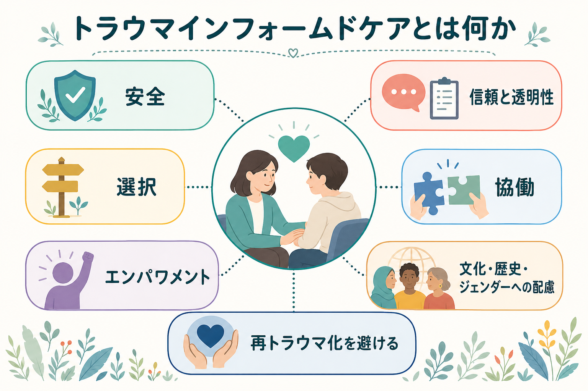
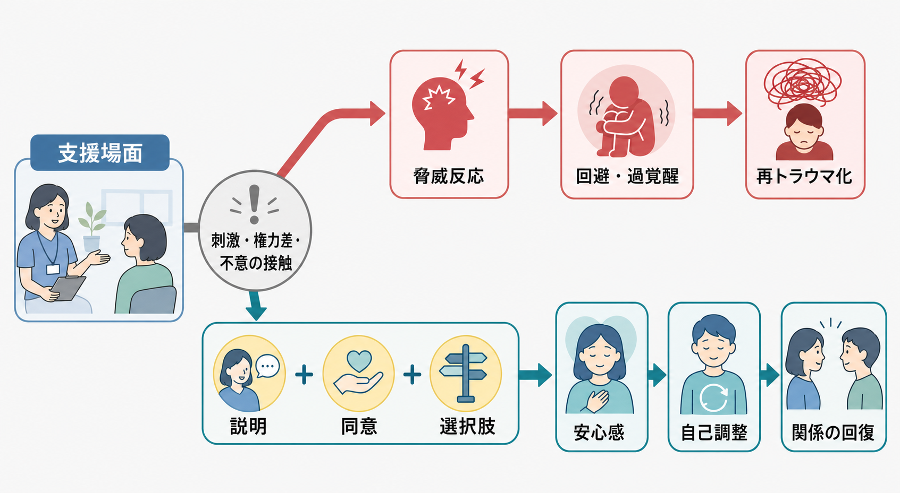

# トラウマインフォームドケアとは何か

## 要点

- トラウマインフォームドケアは、相手に「何が悪いのか」と問う前に、「何が起きたのか」「今の場面は安全か」「本人が選べる余地はあるか」と考える支援の枠組みである[1]。
- SAMHSA は、トラウマインフォームドな実践を、トラウマの影響を理解し、兆候を認識し、方針・手続き・実践へ応答し、再トラウマ化を避ける「4つのR」として整理している[1]。
- 中核原則は、安全、信頼と透明性、ピアサポート、協働、エンパワメントと選択、文化・歴史・ジェンダーへの配慮である[1][3]。
- これは特定の心理療法ではなく、面接、病棟、学校、福祉、司法、訪問支援、就労支援などの場を設計する考え方である。[[トラウマ焦点化認知行動療法とは何か]]や[[EMDRとは何か]]のような治療法とは区別して考える。
- 効果研究は増えているが、AHRQ の系統的レビューでは、定義・構成要素・アウトカムがばらつき、患者・利用者アウトカムに関する確実な結論はまだ限定的とされる[4]。

## この記事で答える問い

1. トラウマインフォームドケアは、支援場面で何を変える考え方なのか。
2. なぜ「安全」「選択」「協働」が再トラウマ化の予防に関わるのか。
3. 臨床・福祉・生活支援でどのように使い、どこに限界があるのか。

## まず結論

トラウマインフォームドケアとは、支援者が「本人の問題行動を正す」ことだけに集中するのではなく、過去または現在のトラウマ体験が、警戒、回避、怒り、解離、過覚醒、信頼困難、身体症状、受診中断として現れうることを前提に、支援環境を安全で選択可能なものへ調整する実践である[1][2]。

重要なのは、トラウマの詳細を聞き出すことではない。むしろ、同意なしに詳細を尋ねること、急な接触、強制的な手続き、説明不足、支援者側だけで決める計画が、本人にとって「また支配される」「逃げられない」という経験として作用しうる点に注意する。トラウマインフォームドケアは、支援者の善意を、本人が安全に受け取れる形へ翻訳する作業である。

## 背景

トラウマは、災害、暴力、虐待、ネグレクト、性被害、事故、喪失、差別、拘束、医療処置、家庭内の慢性的な不安定さなど、単回または反復的な出来事として生じうる。ACE研究は、小児期の逆境体験が成人期の身体疾患、精神健康、物質使用、リスク行動と累積的に関連することを示し、支援現場がトラウマの影響を無視できないことを明らかにした[7]。

ただし、トラウマインフォームドケアは「誰もがトラウマを持っている」と決めつける態度ではない。本人が語っていない経験を推測してラベル化するのではなく、誰にとっても安全・説明可能・選択可能な支援設計を行う。これは[[PTSDとは何か]]の診断や治療だけでなく、慢性的な不安、解離、依存、対人不信、受診中断、支援拒否、怒りの表出、沈黙などを扱う幅広い現場で意味を持つ[2]。

## 基本概念

### 4つのR

SAMHSA の枠組みでは、トラウマインフォームドな組織・サービスは次の4点を満たす[1]。

| 観点 | 支援場面での意味 |
|---|---|
| Realize | トラウマが健康、行動、関係、支援利用に広く影響しうると理解する |
| Recognize | 過覚醒、回避、解離、怒り、沈黙、不信、身体反応などのサインを認識する |
| Respond | 方針、手続き、環境、面接、記録、紹介、危機対応へ反映する |
| Resist re-traumatization | 強制、羞恥化、説明不足、権力差の濫用、過度な詳細聴取を避ける |

### 6つの原則

トラウマインフォームドケアの原則は、個人の態度だけでなく、組織設計にも関わる[1][3]。

| 原則 | 具体例 |
|---|---|
| 安全 | 身体的安全だけでなく、心理的安全、プライバシー、予測可能性を確保する |
| 信頼と透明性 | 目的、選択肢、記録、守秘の限界、次の手順を明示する |
| ピアサポート | 同じ経験を持つ人の知識や相互支援を尊重する |
| 協働 | 支援者が一方的に決めず、本人・家族・地域資源と共同で進める |
| エンパワメントと選択 | 本人の強み、権利、選べる余地、拒否できる余地を支える |
| 文化・歴史・ジェンダーへの配慮 | 差別、植民地主義、貧困、ジェンダー暴力などの文脈を無視しない |

この原則は、[[リカバリー志向支援とは何か]]、[[ピアサポートとは何か]]、[[ケースマネジメントとは何か]]とも強く接続する。いずれも「支援者が正解を与える」のではなく、本人の生活世界、権利、選択、関係性の回復を中心に置く。

## 仕組み

支援場面では、本人が危険を意識していなくても、声の調子、急な質問、ドアの位置、身体接触、待たされること、選択肢のなさ、過去を細かく聞かれることが、脅威反応を呼び起こす場合がある。これは意志の弱さではなく、過去の危険に適応してきた神経・身体・対人システムが、現在の場面を危険として処理している状態と理解できる[2]。

トラウマインフォームドな対応は、この反応を「問題行動」として押さえ込む前に、刺激を減らし、予告し、説明し、同意を取り、選択肢を示す。これにより、本人は「いま何が起きているか」「自分に拒否や調整の余地があるか」を把握しやすくなる。安全感が高まると、自己調整、対話、記憶の整理、支援関係の形成が起こりやすくなる。

実践では、次のような小さな変更が大きな意味を持つ。

- 面接前に「今日は何を確認するか」「答えたくない質問は飛ばせる」と伝える。
- 診察、処置、訪問、面談の前に、目的、時間、同席者、記録の扱いを説明する。
- 「なぜできないのか」ではなく、「何が難しくしているのか」「何なら試せるか」と尋ねる。
- 本人の沈黙、怒り、キャンセルを、単なる非協力ではなく、負荷や安全感のサインとして検討する。
- 危機対応でも、可能な範囲で選択肢、事前説明、振り返りを残す。

## 図解

| 場面 | 通常起こりやすい対応 | トラウマインフォームドな問い |
|---|---|---|
| 予約に来ない | 意欲が低い、治療抵抗とみなす | 来ることを難しくしている刺激、費用、移動、恥、恐怖は何か |
| 怒りが強い | ルール違反として注意する | 何が脅威として感じられたか。安全に距離を取る方法はあるか |
| 詳細を語らない | 病識がない、隠しているとみなす | いま話す準備があるか。話さずに支援計画を立てる方法はあるか |
| 支援を拒む | 非協力とみなす | 選択肢、説明、同意、関係性、過去の支援被害を確認する |
| 危機がある | すべて支援者が決める | 安全確保を優先しつつ、本人が選べる最小単位を残す |

## 臨床・研究との接続

トラウマインフォームドケアは、[[心理教育とは何か]]、[[動機づけ面接とは何か]]、[[訪問看護は精神科で何を支えるのか]]、[[精神科リハビリテーションとは何か]]の基盤として使える。たとえば訪問支援では、家に入る前に同意を確認する、座る場所を本人に選んでもらう、訪問時間を予告する、次回の連絡方法を一緒に決める、といった小さな手続きが安全感に関わる。

一方で、トラウマインフォームドケアは、単独で PTSD を治療する技法ではない。PTSD症状が主問題で、本人が希望し、適応がある場合には、[[トラウマ焦点化認知行動療法とは何か]]、[[EMDRとは何か]]など、エビデンスのあるトラウマ焦点化治療を検討する。トラウマインフォームドケアは、それらの治療を安全に導入するための土台でもある。

研究面では、実装の重要性と限界を分けて読む必要がある。2024年のレビュー・オブ・レビューは、TIC実装が患者・組織アウトカムへ影響するメカニズムを、リーダーシップ、研修、環境調整、評価、部門間連携などの複数領域で整理した[5]。一方、AHRQ の2025年系統的レビューは、比較研究が少なく、介入内容やアウトカムが多様で、効果の確実性はまだ限定的と評価している[4]。つまり、TIC は倫理的・実践的に重要な枠組みだが、「何を実装すれば、どのアウトカムが、どの程度改善するか」は今後の研究課題である。

実装研究では、促進要因としてリーダーシップ、職員研修、当事者参加、方針変更、柔軟な手続き、部門間連携が挙げられる。阻害要因としては、時間・人員・資金不足、スタッフの二次的トラウマ、概念の曖昧さ、評価指標の不足、組織文化の抵抗が報告されている[6]。

## よくある誤解

### 誤解1: トラウマを詳しく聞くことがトラウマインフォームドである

違う。本人が望まない詳細聴取は再トラウマ化につながる場合がある。必要なのは、詳細な出来事の把握よりも、安全、同意、選択、今の困りごと、支援上の配慮を確認することである[2]。

### 誤解2: 本人の希望をすべて受け入れることである

違う。トラウマインフォームドケアは境界や安全計画を弱めるものではない。危機対応、虐待通告、自傷他害リスク、医療上の緊急性がある場合には必要な対応を行う。ただし、その場合でも説明、尊重、最小限の強制、事後の振り返りを重視する。

### 誤解3: 優しい言葉づかいだけの問題である

違う。言葉づかいは重要だが、組織の予約制度、待合室、身体拘束の方針、苦情申立て、記録の透明性、スタッフ研修、当事者参画まで含めて変える必要がある[3][5]。

### 誤解4: エビデンスが限定的なら使う意味がない

違う。現時点で研究上の不確実性はあるが、再トラウマ化を避ける、安全と権利を守る、本人中心に支援するという原則は、臨床倫理や人権に深く関わる。WHO の人中心・権利基盤型サービスの方向性とも整合する[8]。ただし、効果を主張しすぎず、実装内容とアウトカムを評価し続けることが必要である。

## 関連ノート

- [[PTSDとは何か]]
- [[トラウマ焦点化認知行動療法とは何か]]
- [[EMDRとは何か]]
- [[心理教育とは何か]]
- [[動機づけ面接とは何か]]
- [[リカバリー志向支援とは何か]]
- [[ピアサポートとは何か]]
- [[ケースマネジメントとは何か]]
- [[訪問看護は精神科で何を支えるのか]]
- [[精神科リハビリテーションとは何か]]

## MOC更新候補

- `content/00_MOC/` 配下の臨床実践、精神医学、地域精神医療、リハビリ・生活支援に関する MOC へ、バッチ統合時に本記事を追加する。
- 並列ジョブとの競合を避けるため、本作業では MOC ファイルは更新していない。

## 理解チェック

1. 「何が悪いのか」ではなく「何が起きたのか」と問うことで、支援者の見立てはどう変わるか。
2. 安全、選択、協働は、なぜ再トラウマ化の予防に関係するか。
3. トラウマインフォームドケアと、PTSDへのトラウマ焦点化治療はどう違うか。
4. 自分の現場で、説明不足、選択肢の少なさ、強制感が生じやすい手続きはどこにあるか。

## 未解決問題

- TIC の構成要素が研究ごとに異なるため、どの要素がどのアウトカムに効くのかは十分に分離されていない[4]。
- 研修直後の知識・態度変化だけでなく、本人の安全感、受診継続、生活機能、権利保護、スタッフの燃え尽きまで含めた長期評価が必要である[5][6]。
- 文化、ジェンダー、貧困、障害、制度的差別をどう実装指標に組み込むかは、今後の重要課題である[1][8]。

## 参考文献

[1] Substance Abuse and Mental Health Services Administration. (2014). *SAMHSA's Concept of Trauma and Guidance for a Trauma-Informed Approach*. https://library.samhsa.gov/product/samhsas-concept-trauma-and-guidance-trauma-informed-approach/sma14-4884

[2] Center for Substance Abuse Treatment. (2014). *Trauma-Informed Care in Behavioral Health Services*. Treatment Improvement Protocol (TIP) Series, No. 57. Substance Abuse and Mental Health Services Administration. https://www.ncbi.nlm.nih.gov/books/NBK207201/

[3] Substance Abuse and Mental Health Services Administration. (2023). *Practical Guide for Implementing a Trauma-Informed Approach*. https://library.samhsa.gov/product/practical-guide-implementing-trauma-informed-approach/pep23-06-05-005

[4] Nguyen-Feng, V. N., Ramirez, M., Behrens, K. L., Usset, T., Claussen, A. M., Parikh, R. R., Lee, E. K., Mendenhall, T. J., Wilt, T. J., & Butler, M. (2025). *Trauma Informed Care: A Systematic Review*. Agency for Healthcare Research and Quality. https://www.ncbi.nlm.nih.gov/books/NBK614496/

[5] Goldstein, E., Chokshi, B., Melendez-Torres, G. J., Rios, A., Jelley, M., & Lewis-O'Connor, A. (2024). Effectiveness of trauma-informed care implementation in health care settings: Systematic review of reviews and realist synthesis. *The Permanente Journal, 28*(1), 135-150. https://doi.org/10.7812/TPP/23.127

[6] Huo, Y., Couzner, L., Windsor, T., Laver, K., Dissanayaka, N. N., & Cations, M. (2023). Barriers and enablers for the implementation of trauma-informed care in healthcare settings: A systematic review. *Implementation Science Communications, 4*, 49. https://doi.org/10.1186/s43058-023-00428-0

[7] Felitti, V. J., Anda, R. F., Nordenberg, D., Williamson, D. F., Spitz, A. M., Edwards, V., Koss, M. P., & Marks, J. S. (1998). Relationship of childhood abuse and household dysfunction to many of the leading causes of death in adults: The Adverse Childhood Experiences Study. *American Journal of Preventive Medicine, 14*(4), 245-258. https://doi.org/10.1016/S0749-3797(98)00017-8

[8] World Health Organization. (2021). *Guidance on community mental health services: Promoting person-centred and rights-based approaches*. https://www.who.int/publications/i/item/9789240025707
