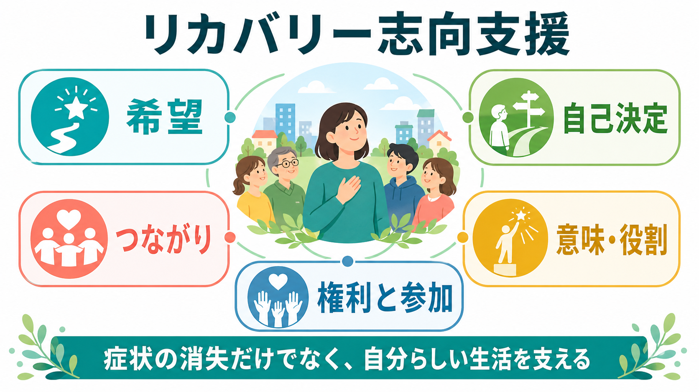
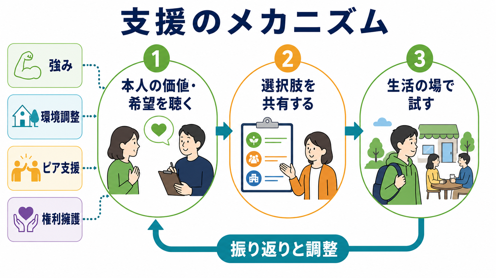
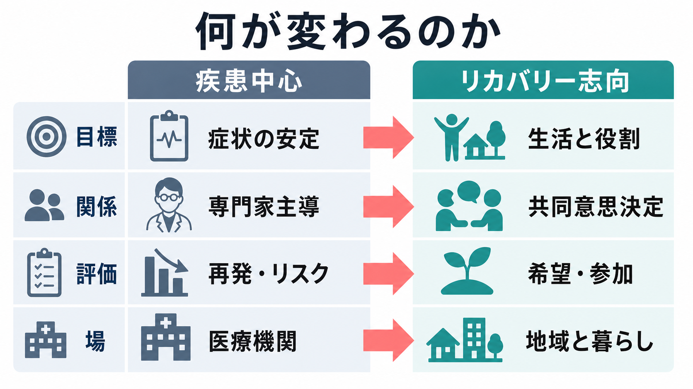

# リカバリー志向支援とは何か

## 要点

- リカバリー志向支援は、病気や障害が「完全になくなる」ことだけを目標にせず、本人が希望・価値・役割・つながりを持って暮らせることを支える考え方である。
- 古典的な定義では、リカバリーは「病気による制限があっても、満足でき、希望があり、貢献できる生活を送るために、態度・価値・感情・目標・技能・役割を変えていく個人的過程」と説明される[1]。
- 支援者の役割は、本人の代わりに人生を決めることではなく、情報、選択肢、環境調整、権利擁護、ピアや地域資源との接続を通じて、本人の選択可能性を広げることである[2][6]。
- 医療や症状管理を否定する考え方ではない。むしろ[[向精神薬の基本分類とは何か|薬物療法]]、心理社会的支援、住まい、就労、家族・地域支援を、本人の生活目標に結び直す枠組みである。
- 臨床現場では、[[心理療法における治療同盟とは何か|治療同盟]]、共同意思決定、[[心理教育とは何か|心理教育]]、[[動機づけ面接とは何か|動機づけ面接]]、[[IPS援助付き雇用とは何か|IPS援助付き雇用]]、ピアサポートなどと相性がよい。

## この記事で答える問い

1. リカバリー志向支援は、単なる「回復」や「治癒」と何が違うのか。
2. 希望・自己決定・役割回復を重視する支援は、実際には何をすることなのか。
3. 医療安全、症状管理、再発予防とリカバリー志向はどのように両立するのか。
4. 臨床・研究でどのように評価し、どのような限界に注意すべきか。

## まず結論

リカバリー志向支援とは、「症状を減らす支援」から「本人が望む生活を取り戻し、つくり直す支援」へ重心を広げる実践である。ここでいうリカバリーは、医学的な寛解や機能回復だけではなく、本人が自分の人生の主体である感覚、他者とのつながり、意味ある役割、将来への希望を回復していく過程を指す[1][3]。

したがって、支援の焦点は「何ができないか」だけではなく、「何を大切にしているか」「どのような暮らしを望むか」「どの環境なら力を発揮しやすいか」に置かれる。診断名、症状、リスク評価は重要な情報だが、それだけで支援計画を決めることはしない。本人の価値と選択を中心に、医療・福祉・住まい・就労・学習・家族・地域の資源を組み合わせる[5][6]。

## 背景

精神保健医療では長く、症状の安定、再発予防、入院回避、服薬継続が支援の中心に置かれてきた。これらは今でも重要だが、それだけでは本人の人生の質を十分に説明できない。症状が残っていても、仕事、学び、家族関係、友人関係、地域参加、趣味、信仰、社会的役割を通じて、本人が意味ある生活を送ることはありうる。逆に、症状が軽くなっても、孤立、貧困、スティグマ、権利侵害、役割喪失が続けば、生活上の回復は進みにくい。

このギャップに対して、当事者運動、地域精神保健、心理社会的リハビリテーション、ピアサポートの蓄積から発展したのがリカバリー志向である。SAMHSA はリカバリーを、健康とウェルネスを改善し、自己決定した生活を送り、潜在能力を最大限発揮しようとする変化の過程として整理し、健康、住まい、目的、コミュニティという4次元を示している[2]。

日本の政策文脈でも、「精神障害の有無や程度にかかわらず、誰もが地域の一員として安心して自分らしい暮らしをする」ことを目指す地域包括ケアの方向性が示されている[6]。これは、リカバリー志向支援を医療機関内の態度だけでなく、地域生活、住まい、社会参加、就労、教育、家族支援、権利擁護まで広げて考える必要があることを意味する。

## 基本概念

### 臨床的リカバリーとパーソナル・リカバリー

臨床的リカバリーは、症状の改善、再発の減少、機能評価の改善など、専門職が観察・測定しやすい変化を指す。一方、パーソナル・リカバリーは、本人にとって意味ある生活を取り戻す主観的・社会的な過程である。両者は対立しないが、同じものではない[3][7]。

たとえば、抑うつ症状が軽減することは重要である。しかし、本人が「もう失敗できない」と考えて外出や就労を避け続けるなら、生活上の回復は限定的になる。逆に、症状が完全には消えていなくても、本人が対処法を持ち、周囲に相談でき、週数時間の活動や役割を持てるなら、リカバリーは進んでいると考えられる。

### CHIME フレームワーク

パーソナル・リカバリー研究でよく使われる整理に CHIME がある。Leamy らの系統レビューは、リカバリー過程を、Connectedness（つながり）、Hope（希望）、Identity（アイデンティティ）、Meaning（意味）、Empowerment（エンパワメント）としてまとめた[3]。

| 要素 | 支援上の問い | 実践例 |
|---|---|---|
| つながり | 孤立を減らし、安心できる関係を増やせているか | ピアサポート、家族支援、地域活動 |
| 希望 | 将来に小さな可能性を見出せているか | 成功体験の確認、ロールモデルとの接点 |
| アイデンティティ | 診断名だけで自分を定義していないか | 強み、価値、過去の役割の再発見 |
| 意味 | 本人にとって意味ある活動があるか | 学び、仕事、ケア役割、創作、信仰 |
| エンパワメント | 選択し、交渉し、助けを求める力が育っているか | 共同意思決定、権利擁護、危機計画 |

### 支援者の位置づけ

リカバリー志向の支援者は、「正しい生活」を教える人ではなく、本人の価値に沿って選択肢を広げる協働者である。専門職の知識は重要だが、本人の経験知、家族や仲間の知識、地域資源も同じ支援計画の中で扱う。これは[[支持的精神療法とは何か|支持的精神療法]]や[[家族療法とは何か|家族療法]]で重視される関係性とも接続する。

## 仕組み

リカバリー志向支援の最小単位は、「本人の価値を聴く」「選択肢を共有する」「生活の場で試す」「振り返って調整する」という循環である。この循環が、症状管理を生活目標に結び直す。

1つ目は、本人の価値・希望を聴くことである。ここでは「困っている症状は何か」だけでなく、「何を取り戻したいか」「どの関係を大切にしたいか」「どの程度のリスクなら引き受けたいか」を扱う。支援者が急いで説得すると、本人の希望は表面化しにくい。

2つ目は、選択肢を共有することである。薬物療法、心理療法、訪問支援、就労支援、福祉制度、ピアサポート、危機時の連絡先などを、利点・負担・不確実性とともに提示する。これは「専門職が決める」でも「本人に丸投げする」でもなく、情報の非対称性を減らす作業である。

3つ目は、生活の場で試すことである。リカバリーは面接室の中だけでは進まない。住まい、職場、学校、家族関係、地域活動の中で、小さな実験を行う。たとえば「週1回、短時間の活動に参加する」「職場復帰の前に見学する」「不調時の連絡手順をカード化する」といった具体化が必要になる。

4つ目は、振り返りと調整である。うまくいかなかった場合も「失敗」と決めつけず、環境、支援量、タイミング、本人の負担、周囲の理解を見直す。[[多剤併用をどう減らすか|多剤併用の見直し]]のような医療判断も、単に薬剤数を減らす話ではなく、眠気、活動性、本人の目標、再発リスクを一緒に検討する必要がある。

## 図解

リカバリー志向支援では、評価軸そのものが変わる。従来型の疾患中心支援が不要になるのではなく、疾患中心の評価を、生活・役割・参加の評価へ接続することが重要である。

| 観点 | 疾患中心に偏った支援 | リカバリー志向支援 |
|---|---|---|
| 目標 | 症状安定、再発予防、服薬継続 | 本人が望む生活、役割、参加、希望 |
| 関係 | 専門家が評価し、本人が従う | 本人と支援者が共同で計画する |
| リスク | 回避を最優先しやすい | 安全を確保しつつ、意味ある挑戦を調整する |
| 成果 | 症状尺度、入院日数、受診継続 | 主観的回復、生活満足、社会参加、権利保障 |
| 場 | 医療機関中心 | 地域、住まい、職場、学校、家庭を含む |

## 臨床・研究との接続

### 面接技法との接続

リカバリー志向支援は、特定の単一技法ではない。むしろ複数の実践を束ねる上位原理である。[[動機づけ面接とは何か|動機づけ面接]]は、本人のアンビバレンスを扱い、価値に沿った変化を支える。[[心理教育とは何か|心理教育]]は、症状や治療の知識を「従わせるための説明」ではなく、本人が選択するための情報共有として行う。[[IPS援助付き雇用とは何か|IPS援助付き雇用]]は、就労を症状安定後の報酬ではなく、回復過程を支える現実の役割として扱う。

### サービス設計との接続

WHO は、精神保健サービスを人権に基づき、本人中心で、地域に根ざしたものへ転換する必要性を示している[5]。この観点では、リカバリー志向支援は個々の面接態度だけでは不十分である。強制や隔離に過度に依存しない危機支援、地域アウトリーチ、ピアサポート、住まい支援、包括的なサービスネットワークが必要になる[5]。

Le Boutillier らは、国際的なリカバリー志向実践ガイダンスを分析し、実践の柱として、回復を促す関係、組織的コミットメント、市民権、個別化された支援、社会的包摂などを整理している[4]。つまり、個人面接で「希望を持ちましょう」と言うだけではなく、組織の評価指標、人材育成、権利擁護、当事者参加を含めて変える必要がある。

### 研究評価との接続

研究では、リカバリーを「症状尺度の改善」と同一視しないことが重要である。近年のレビューは、CHIME が広く参照されている一方で、文化、トラウマ、スティグマ、サービスによる有害経験、薬物療法の負担、選択とリスクの扱いを組み込む必要があると指摘している[7]。病院ベースのサービスでもリカバリー志向実践は実装可能だが、生物医学モデルの強さ、スタッフの態度、当事者参加の不足が障壁になりやすい[8]。

## よくある誤解

### 誤解1: 「症状を見なくてよい」という意味である

違う。症状、不眠、希死念慮、幻覚妄想、不安、依存、認知機能、身体疾患、服薬副作用は重要な評価対象である。ただし、それらを本人の生活目標から切り離して扱わない。安全確保と生活の希望を同時に考える。

### 誤解2: 「本人の希望なら何でも肯定する」という意味である

違う。リカバリー志向は、本人の選択を尊重するが、支援者がリスクや代替案を黙って見過ごすことではない。本人の法的能力、権利、情報アクセスを尊重しながら、危機時の安全計画、周囲との調整、段階的な挑戦を一緒に設計する[5]。

### 誤解3: 「専門職の知識を弱める」という意味である

違う。むしろ専門職には、疾患、治療、制度、地域資源、リスク評価、権利擁護を本人に使える形で翻訳する力が求められる。専門知を本人の人生の上に置くのではなく、本人の人生を支える道具として使う。

### 誤解4: 「明るい言葉で励ませばよい」という意味である

違う。希望はスローガンではなく、選択肢、関係、役割、住まい、収入、安心できる環境によって現実味を持つ。孤立や貧困が放置されたまま「希望を持とう」と言うだけでは、かえって本人を責める支援になりうる。

## 関連ノート

- [[心理療法における治療同盟とは何か]]
- [[心理教育とは何か]]
- [[動機づけ面接とは何か]]
- [[支持的精神療法とは何か]]
- [[家族療法とは何か]]
- [[IPS援助付き雇用とは何か]]
- [[向精神薬の基本分類とは何か]]
- [[多剤併用をどう減らすか]]

## MOC更新候補

- `content/00_MOC/` 配下の臨床実践、精神保健、リハビリテーション、地域生活支援に関する MOC があれば追加候補。
- 並列ジョブとの競合を避けるため、本記事作成時点では MOC ファイルは更新していない。

## 理解チェック

1. リカバリー志向支援が、症状の消失だけを目標にしない理由を説明できるか。
2. CHIME の5要素を、臨床面接や支援計画の問いに変換できるか。
3. 「本人の希望を尊重すること」と「安全配慮・リスク評価」を両立させる具体策を挙げられるか。
4. 自分の現場で、疾患中心の評価に偏りやすい場面を1つ挙げ、生活・役割・参加の評価を追加できるか。

## 未解決問題

- リカバリーの評価尺度は、文化、年齢、トラウマ経験、社会的排除の文脈を十分に反映できているとは限らない。
- 組織が入院日数、再発率、リスク回避だけを成果指標にすると、リカバリー志向は理念に留まりやすい。
- 強制入院、隔離・身体拘束、家族負担、住まい不足、貧困、スティグマといった構造的課題を、個人の「希望」の問題に矮小化しない設計が必要である。

## 参考文献

[1] Anthony, W. A. (1993). Recovery from mental illness: The guiding vision of the mental health service system in the 1990s. *Psychosocial Rehabilitation Journal, 16*(4), 11-23. https://doi.org/10.1037/h0095655

[2] Substance Abuse and Mental Health Services Administration. (2012). *SAMHSA's Working Definition of Recovery*. https://library.samhsa.gov/product/samhsas-working-definition-recovery/pep12-recdef

[3] Leamy, M., Bird, V., Le Boutillier, C., Williams, J., & Slade, M. (2011). Conceptual framework for personal recovery in mental health: Systematic review and narrative synthesis. *The British Journal of Psychiatry, 199*(6), 445-452. https://doi.org/10.1192/bjp.bp.110.083733

[4] Le Boutillier, C., Leamy, M., Bird, V. J., Davidson, L., Williams, J., & Slade, M. (2011). What does recovery mean in practice? A qualitative analysis of international recovery-oriented practice guidance. *Psychiatric Services, 62*(12), 1470-1476. https://doi.org/10.1176/appi.ps.001312011

[5] World Health Organization. (2021). *Guidance on community mental health services: Promoting person-centred and rights-based approaches*. https://www.who.int/publications/i/item/9789240025707

[6] 厚生労働省. (2021). 「精神障害にも対応した地域包括ケアシステムの構築に係る検討会」報告書. https://www.mhlw.go.jp/stf/shingi2/0000152029_00003.html

[7] van Weeghel, J., van Zelst, C., Boertien, D., & Hasson-Ohayon, I. (2019). Conceptualizations, assessments, and implications of personal recovery in mental illness: A scoping review of systematic reviews and meta-analyses. *Psychiatric Rehabilitation Journal, 42*(2), 169-181. https://doi.org/10.1037/prj0000356

[8] Lorien, L., Blunden, S., & Madsen, W. (2020). Implementation of recovery-oriented practice in hospital-based mental health services: A systematic review. *International Journal of Mental Health Nursing, 29*(6), 1035-1048. https://doi.org/10.1111/inm.12794
