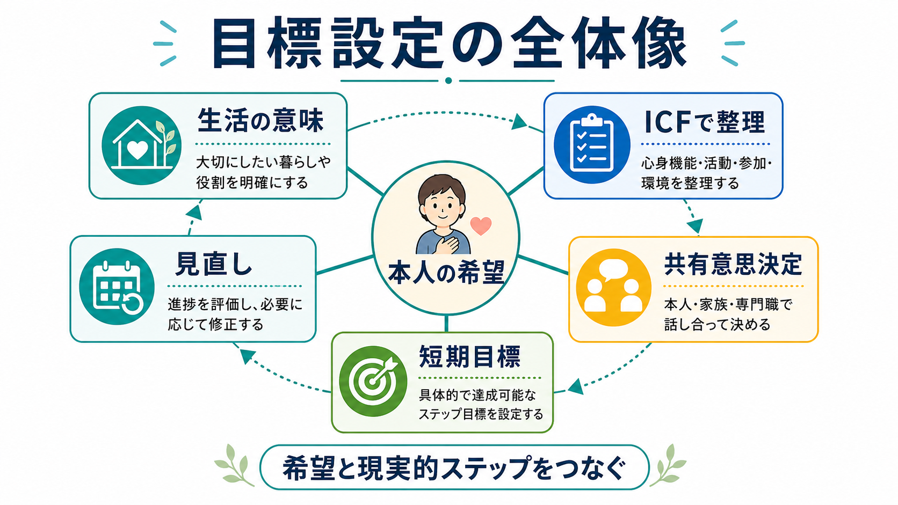
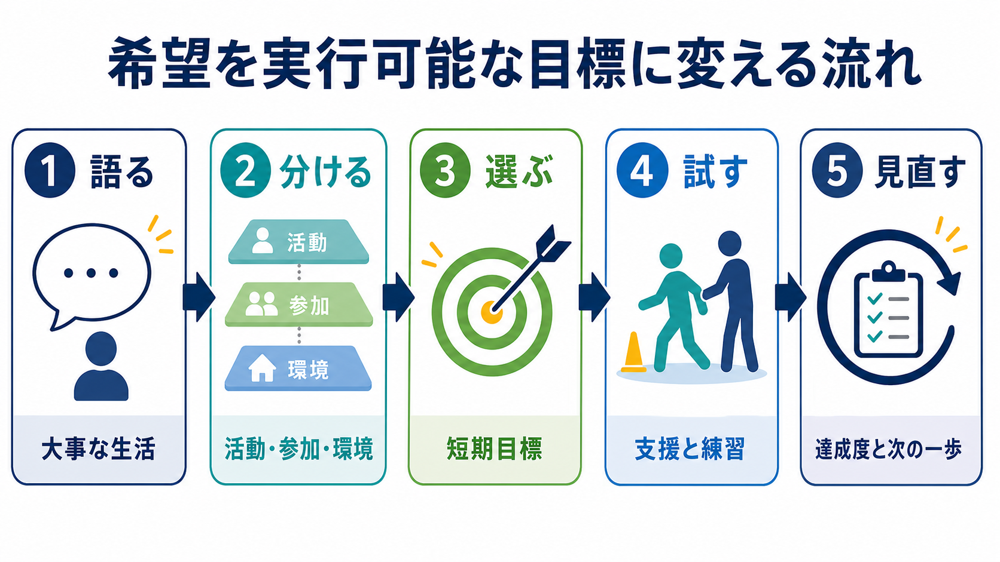

# リハビリテーションにおける目標設定とは何か

## 要点

- リハビリテーションの目標設定は、「専門職が望ましい到達点を決める作業」ではなく、本人が大事にしている生活と、現在の心身機能・活動・参加・環境条件をすり合わせる共同作業である。
- よい目標は、本人にとって意味があり、チームで共有でき、短期的に試せ、達成度を見直せる。SMART 目標や Goal Attainment Scaling は、そのための道具として使える[4]。
- ICF は、症状や機能低下だけでなく、活動、参加、環境因子を整理する枠組みとして有用である[2]。
- 研究上は、構造化された目標設定が心理社会的アウトカムや自己効力感を改善する可能性はあるが、エビデンスの確実性は高くない。したがって、目標設定を「効く技法」として過大評価せず、支援関係と実行可能な計画の質を高める手続きとして扱う必要がある[1]。
- 本人中心の目標設定を妨げる要因は、本人の理解不足だけではない。専門職側の信念、時間不足、組織ルーチン、チーム文化も大きい[7]。

## この記事で答える問い

1. リハビリテーションにおける「目標」とは何を指すのか。
2. 本人の希望を、どのように現実的な短期目標へ翻訳するのか。
3. SMART 目標、ICF、共有意思決定、GAS はどのようにつながるのか。
4. 臨床で起こりやすい誤解や失敗は何か。

## まず結論

リハビリテーションにおける目標設定とは、本人が「何を取り戻したいか」「何を続けたいか」「どのように暮らしたいか」を出発点にし、それを評価可能で実行可能な支援計画へ落とし込むプロセスである。たとえば「元の生活に戻りたい」という希望は、そのままでは支援計画としては広すぎる。そこで、本人にとっての「元の生活」が、家事、通学、就労、外出、趣味、家族内役割、セルフケアのどれに関係するのかを一緒に分ける。

そのうえで、「2週間以内に、疲労を確認しながら、支援者同伴で近所のスーパーまで往復する」「1か月以内に、作業手順表を使って週2回の調理を試す」のように、行動、支援量、達成条件、時期を具体化する。SMART 目標はこの具体化を助けるが、本人の意味を削って数値だけにするための道具ではない[4]。

関連する実践として、[[精神科リハビリテーションとは何か]]、[[作業療法は精神科で何をするのか]]、[[認知リハビリテーションとは何か]]、[[生活技能訓練SSTとは何か]]、[[ケースマネジメントとは何か]]、[[リカバリー志向支援とは何か]]がある。これらはいずれも、症状や機能だけでなく、本人が参加したい生活場面をどう支えるかという問いに接続している。

## 背景

リハビリテーションでは、専門職が観察しやすい変化と、本人が意味づける変化がずれることがある。歩行距離が延びても、本人が行きたい場所に行けなければ生活上の達成感は小さい。認知機能検査の成績が改善しても、金銭管理や服薬、就労場面で使える形にならなければ、本人の困りごとは残る。

このずれを小さくするために、目標設定は単なる事務的な計画書作成ではなく、評価、合意形成、介入、振り返りを結ぶ中核手続きとして扱われてきた。Cochrane レビューは、後天的障害をもつ成人のリハビリテーションにおける目標設定を検討し、構造化された目標設定が心理社会的アウトカムに有利に働く可能性を示しつつも、研究の質や異質性のため確実性は低いと結論づけている[1]。つまり、目標設定は「やれば必ず改善する技法」ではなく、本人中心の支援を実装するための臨床的な足場である。

## 基本概念

### 目標は「希望」と「測れる行動」の間に置く

本人の希望は、しばしば大きく、曖昧で、感情を含む。「仕事に戻りたい」「迷惑をかけたくない」「普通に暮らしたい」「もう失敗したくない」という言葉は、支援計画としては曖昧でも、本人にとっては重要な方向性を含んでいる。

一方で、支援チームには、何を、いつ、どの条件で、どの程度できれば進展とみなすのかを共有する必要がある。Bovend'Eerdt らは、リハビリテーション目標を具体化する際に、対象活動、必要な支援、量的な達成条件、期間を組み合わせる方法を示している[4]。この考え方を使うと、希望を次のように翻訳できる。

| 本人の言葉 | 支援計画にするための問い | 短期目標の例 |
|---|---|---|
| 「一人で外に出たい」 | どこへ、何分、誰の支援で、どのリスク確認をして行くか | 2週間以内に、支援者同伴で自宅からコンビニまで往復し、疲労と不安を記録する |
| 「家族に頼りきりになりたくない」 | どの家事や手続きなら本人が担えるか | 1か月以内に、チェックリストを使って週2回の洗濯を行う |
| 「仕事に戻りたい」 | いきなり復職か、生活リズム、通勤練習、作業耐久性から始めるか | 3週間、平日午前に起床し、30分の作業課題を週3回実施する |

### ICF は目標の抜けを減らす

ICF は、健康と障害を、心身機能・身体構造、活動、参加、環境因子、個人因子の相互作用として捉える枠組みである。WHO は ICF を、個人と集団の健康・障害を記述し測定する国際的な標準として位置づけている[2]。目標設定に使うと、次のような偏りを避けやすい。

- 心身機能だけを見る偏り: 筋力、注意、記憶、不安だけでなく、実際の活動と参加を見る。
- 活動だけを見る偏り: できる動作だけでなく、本人が参加したい役割や場面を見る。
- 本人だけを見る偏り: 住環境、家族、学校、職場、制度、支援者の配置を見る。

たとえば「調理を再開する」という目標では、手指の操作、注意の持続、買い物、火の管理、家族との役割分担、台所環境、疲労の回復時間が絡む。ICF は、この複雑さを「本人の努力不足」に還元しないための地図になる。

### 共有意思決定は、選択肢を一緒に扱う方法である

目標設定は、専門職が本人の希望を聞いてから専門的に決める作業ではない。本人、家族、専門職が、選択肢、利益、不利益、リスク、優先順位を一緒に扱う必要がある。高齢者医療の文脈でも、目標設定は共有意思決定を促す戦略として論じられている[8]。

臨床では、専門職の「安全」と本人の「やってみたい」が衝突することがある。このとき目標設定は、どちらかを黙らせる手続きではなく、「どの条件なら試せるか」「失敗したとき何を見直すか」「誰がどのリスクを見守るか」を具体化する場になる。

## 仕組み

### 1. 語る: 大事な生活を聞く

最初に聞くべきなのは、「何ができないか」だけではない。「何を大事にしていたか」「何ができると自分らしいか」「何を避けたいか」「誰との関係を保ちたいか」を聞く。これは[[動機づけ面接とは何か]]や[[リカバリー志向支援とは何か]]とも相性がよい。本人が明確に語れない場合は、過去の生活、家族の観察、写真、日課、役割、困りごとの場面から手がかりを集める。

### 2. 分ける: 活動・参加・環境に整理する

次に、希望を ICF 的に分ける。症状や機能の問題、活動の問題、参加の問題、環境の問題を区別する。たとえば「外出が怖い」は、不安症状、歩行耐久性、道順の記憶、人混み、交通費、家族の心配、過去の失敗体験が重なっているかもしれない。

### 3. 選ぶ: 短期目標にする

短期目標は、本人が意味を感じ、かつ次の数日から数週間で試せる単位にする。Scobbie らの理論的枠組みでは、目標交渉、目標同定、計画、評価とフィードバックが主要要素として整理され、自己効力感と行動計画の達成が重要な変化機序として仮定されている[5]。

### 4. 試す: 支援と練習を配置する

目標は紙に書いただけでは機能しない。練習機会、支援者、環境調整、記録方法、失敗時の安全策を配置する。[[作業療法は精神科で何をするのか]]、[[生活技能訓練SSTとは何か]]、[[就労支援とは何か]]、[[訪問看護は精神科で何を支えるのか]]のような支援は、目標を生活場面で試すための具体的な足場になる。

### 5. 見直す: 達成度と次の一歩を確認する

目標は固定された約束ではなく、学習の仮説である。できた場合は、何が効いたのかを言語化する。できなかった場合は、本人の意欲不足と決めつけず、目標が大きすぎたのか、支援量が足りなかったのか、環境が合わなかったのか、リスク評価が不十分だったのかを見直す。GAS は、本人ごとの目標達成を段階的に評価する方法として使われてきた[6]。

## 図解

上の2枚の図は、目標設定を「本人の希望を中心に据え、ICF、共有意思決定、短期目標、見直しを循環させるプロセス」として整理している。大事なのは、目標を一度で正解にすることではない。本人の生活場面で試し、結果を見て、支援計画を更新することである。

## 臨床・研究との接続

本人中心の目標設定は、理念としては広く受け入れられている。しかし、実装は難しい。脳卒中リハビリテーションを対象にした系統的レビューでは、患者中心の目標設定は十分に採用されておらず、患者と専門職の認識のずれ、倫理的葛藤、実践上の障壁が報告されている[3]。また、2022年のスコーピングレビューは、障壁を本人、提供者、組織の水準に分け、専門職の信念、スキル不足、臨床ルーチンへの統合不足、時間制約、本人の準備不足を主要な課題として整理している[7]。

精神科・地域生活支援では、この問題はさらに見えにくくなることがある。症状が軽くなっても、孤立、生活リズム、金銭管理、住居、就労、家族関係、スティグマが残れば生活の回復は進まない。したがって、[[精神科リハビリテーションとは何か]]や[[ケースマネジメントとは何か]]では、目標設定を個人内の能力改善だけでなく、環境調整と資源接続の計画として扱う必要がある。

研究上の注意点として、目標設定そのものの効果を測ることは簡単ではない。目標設定は、面接、評価、チーム連携、介入、自己管理、フィードバックと分離しにくい複合的手続きである。したがって、アウトカム研究では、何を「目標設定介入」と呼ぶのか、どの程度本人が参加したのか、目標が治療チームで実際に使われたのかを明確にする必要がある。

## よくある誤解

### 誤解1: 目標は専門職が現実的に決めるもの

現実性は重要だが、専門職だけで決めると、本人にとって意味の薄い目標になりやすい。本人の希望を聞いたうえで、リスク、時間、支援量、代替案を一緒に扱うほうがよい。

### 誤解2: 本人の希望はそのまま目標にすべき

希望は出発点であって、短期目標そのものではない。「復職したい」という希望は大事だが、睡眠、通勤、作業耐久性、対人負荷、職場調整、再発サインの確認などに分ける必要がある。

### 誤解3: SMART にすれば本人中心になる

SMART は具体化の道具であり、本人中心性を保証しない。本人にとって意味のない目標を、具体的で測定可能に書いても、本人中心の目標にはならない。

### 誤解4: 達成できなかった目標は失敗である

未達成は、支援計画を修正する情報である。目標が大きすぎた、支援量が少なかった、環境が合わなかった、体調変動が大きかった、本人の優先順位が変わったなど、複数の解釈がありうる。

### 誤解5: 目標設定は書類作成である

書類は共有のために必要だが、目標設定の本体は、本人との対話、チーム内の合意、生活場面での試行、振り返りである。書類だけ整っていても、支援者が日々の関わりで使わなければ機能しない。

## 関連ノート

- [[精神科リハビリテーションとは何か]]
- [[作業療法は精神科で何をするのか]]
- [[認知リハビリテーションとは何か]]
- [[生活技能訓練SSTとは何か]]
- [[ケースマネジメントとは何か]]
- [[リカバリー志向支援とは何か]]
- [[就労支援とは何か]]
- [[訪問看護は精神科で何を支えるのか]]
- [[動機づけ面接とは何か]]

MOC 更新候補: `content/00_MOC/MOC｜リハビリ・生活支援.md`。並列編集の衝突を避けるため、このジョブでは MOC 本体は更新しない。

## 理解チェック

1. 「本人の希望」と「短期目標」はどう違うか。
2. ICF を使うと、目標設定のどのような偏りを減らせるか。
3. SMART 目標が本人中心性を保証しないのはなぜか。
4. 目標が達成できなかったとき、本人の意欲不足以外にどのような見直し仮説が立てられるか。
5. あなたが支援者なら、「仕事に戻りたい」という希望を、最初の2週間の目標にどう翻訳するか。

## 未解決問題

- どの疾患、年齢、生活場面で、どの形式の目標設定が最も有効かは十分に確定していない。
- 目標設定の効果を、面接の質、チーム連携、介入内容、環境調整から分離して測定することは難しい。
- 本人の意思決定能力、家族の希望、安全上のリスク、制度上の制約が衝突する場面で、どのように合意形成するかは個別性が高い。
- 文化的背景や社会経済的条件が、本人中心の目標設定にどう影響するかは、さらに検討が必要である。

## 参考文献

[1] Levack, W. M. M., Weatherall, M., Hay-Smith, E. J. C., Dean, S. G., McPherson, K., & Siegert, R. J. (2015). Goal setting and strategies to enhance goal pursuit for adults with acquired disability participating in rehabilitation. *Cochrane Database of Systematic Reviews*, 2015(7), CD009727. https://doi.org/10.1002/14651858.CD009727.pub2

[2] World Health Organization. International Classification of Functioning, Disability and Health (ICF). https://www.who.int/standards/classifications/international-classification-of-functioning-disability-and-health

[3] Rosewilliam, S., Roskell, C. A., & Pandyan, A. D. (2011). A systematic review and synthesis of the quantitative and qualitative evidence behind patient-centred goal setting in stroke rehabilitation. *Clinical Rehabilitation*, 25(6), 501-514. https://doi.org/10.1177/0269215510394467

[4] Bovend'Eerdt, T. J. H., Botell, R. E., & Wade, D. T. (2009). Writing SMART rehabilitation goals and achieving goal attainment scaling: A practical guide. *Clinical Rehabilitation*, 23(4), 352-361. https://doi.org/10.1177/0269215508101741

[5] Scobbie, L., Dixon, D., & Wyke, S. (2011). Goal setting and action planning in the rehabilitation setting: Development of a theoretically informed practice framework. *Clinical Rehabilitation*, 25(5), 468-482. https://doi.org/10.1177/0269215510389198

[6] Kiresuk, T. J., & Sherman, R. E. (1968). Goal attainment scaling: A general method for evaluating comprehensive community mental health programs. *Community Mental Health Journal*, 4, 443-453. https://doi.org/10.1007/BF01530764

[7] Crawford, L., Maxwell, J., Colquhoun, H., Kingsnorth, S., Fehlings, D., Zarshenas, S., McFarland, S., & Fayed, N. (2022). Facilitators and barriers to patient-centred goal-setting in rehabilitation: A scoping review. *Clinical Rehabilitation*, 36(12), 1694-1704. https://doi.org/10.1177/02692155221121006

[8] Schulman-Green, D. J., Naik, A. D., Bradley, E. H., McCorkle, R., & Bogardus, S. T. (2006). Goal setting as a shared decision making strategy among clinicians and their older patients. *Patient Education and Counseling*, 63(1-2), 145-151. https://doi.org/10.1016/j.pec.2005.09.010
