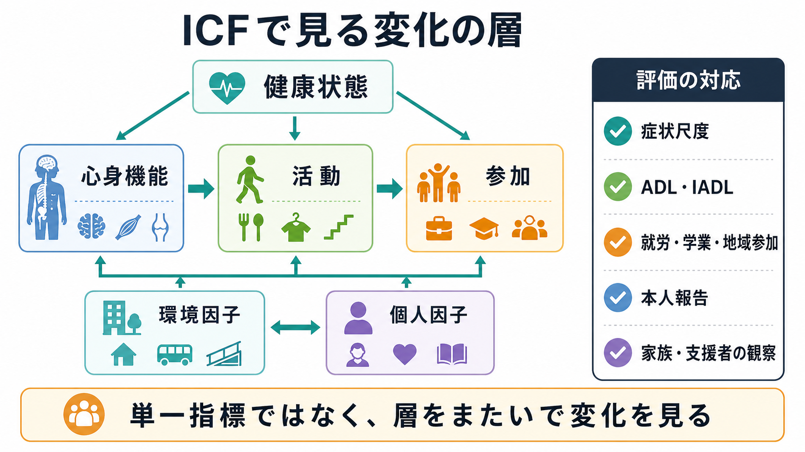
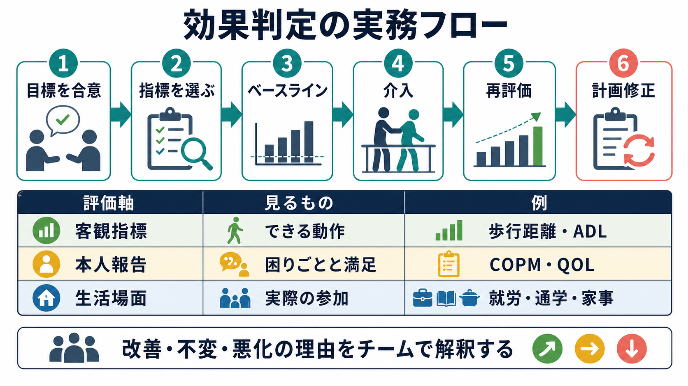

# リハビリテーションの効果判定はどう行うか

## 要点

- リハビリテーションの効果は、症状や検査値だけでなく、本人が日常生活で何をできるようになったか、どの役割や活動に参加できるようになったか、本人がその変化をどう評価しているかで判定する。
- WHO はリハビリテーションを、健康状態をもつ人と環境との相互作用の中で、生活機能を最適化し障害を減らす介入群として定義している[1]。したがって、効果判定も「身体機能が改善したか」だけでは足りない。
- ICF は、心身機能・身体構造、活動、参加、環境因子を同じ枠組みで扱うため、効果判定の地図として使いやすい[2]。
- 実務では、本人と目標を合意し、ベースラインを取り、介入後に同じ条件で再評価し、変化量・臨床的意味・本人にとっての価値を合わせて解釈する。
- 満足度や生活の意味を測るには、COPM や Goal Attainment Scaling のような個別化された評価も有用である。ただし、標準化尺度と個別目標評価は役割が違うため、置き換えではなく組み合わせて使う。

## この記事で答える問い

1. リハビリテーションの「効果」とは何を指すのか。
2. 症状、機能、活動、参加、満足度をどのように分けて評価するのか。
3. 臨床現場では、どの順番で効果判定を進めればよいのか。
4. よく使われる評価尺度や本人報告尺度を、どのように選べばよいのか。
5. 「よくなっていない」と見えるときに、どこを見直すべきか。

## まず結論

リハビリテーションの効果判定は、「症状が軽くなったか」ではなく、「その人の生活が、本人にとって意味のある方向へ動いたか」を評価する作業である。痛み、筋力、認知機能、気分、不安、睡眠などの症状・機能は重要だが、それらは生活上の行為や社会参加に変換されて初めて本人の暮らしに届く。

たとえば、歩行速度が上がっても、買い物に行けないままであれば効果は限定的である。逆に、症状のスコアが大きく変わらなくても、通院、家事、就労準備、家族内の役割、趣味、地域活動が再開できていれば、リハビリテーションとしては重要な成果が生じている可能性がある。WHO の定義でも、リハビリテーションは日常活動の自立と、教育・仕事・余暇・家庭内役割などへの参加を支えるものとして説明されている[1]。

したがって効果判定は、次の五つを重ねて見る。

| 評価の層 | 代表的な問い | 例 |
|---|---|---|
| 症状・障害 | 苦痛や障害は軽くなったか | 疼痛、不安、疲労、幻聴、筋緊張 |
| 心身機能 | 能力の土台は変わったか | 筋力、バランス、記憶、注意、遂行機能 |
| 活動 | 日常行為ができるようになったか | ADL、IADL、通院、服薬管理、家事 |
| 参加 | 役割や社会生活に戻れたか | 就労、通学、家族役割、地域活動、趣味 |
| 本人評価 | 本人は意味ある変化と感じるか | 満足度、QOL、目標達成感、自己効力感 |

## 背景

リハビリテーションでは、同じ介入でも「何を成果とみなすか」によって評価が変わる。急性期では合併症予防や早期離床が中心になることがある。回復期では ADL の改善や退院後生活への移行が重視される。地域生活では、再発予防、生活リズム、就労・通学、家族関係、孤立の軽減などが重要になる。精神科・認知症・慢性疾患・神経疾患では、症状の完全消失よりも、本人が望む生活を維持することが主要な目標になる場合も多い。

この複雑さのため、単一の総合点だけで効果を判断すると、重要な変化を見落としやすい。Wade は、リハビリテーション研究では複数のアウトカムが関連し、治療以外の要因も成果に影響し、一般的尺度が個々の患者やチームの関心を十分に反映しないことを指摘している[7]。臨床でも同じである。効果判定は「尺度を一つ選ぶ作業」ではなく、「何が変わると本人の生活がよくなるのか」を明確にし、その変化を複数の窓から確認する作業である。

## 基本概念

### 生活機能

生活機能とは、心身の状態、日常の活動、社会的な役割、環境との相互作用を含む広い概念である。ICF は、障害を個人の内部だけに置かず、健康状態、活動、参加、環境因子の相互作用として捉える[2]。この枠組みを使うと、同じ「歩けない」でも、筋力低下が主因なのか、疼痛なのか、認知機能なのか、住環境なのか、交通手段なのか、周囲の支援不足なのかを分けて考えられる。

### 活動と参加

活動は、本人が課題や行為を実行することを指す。食事、更衣、移動、服薬、家事、金銭管理、対人コミュニケーションなどが含まれる。参加は、生活場面や社会的役割への関与である。家族の一員として役割をもつ、学校に戻る、仕事を続ける、地域活動に参加する、友人関係を保つ、といった変化である。

この二つは近いが、効果判定では区別した方がよい。訓練室で動作ができることと、実際の生活で役割を再開できることは同じではない。股関節・膝関節置換術後の患者報告アウトカムを ICF に対応づけたレビューでも、既存尺度は活動・参加の一部を扱う一方で、地域生活、人間関係、環境因子を十分に捉えにくいことが示されている[8]。

### 本人報告アウトカム

本人報告アウトカムは、痛み、疲労、生活上の困難、満足度、QOL などを、本人の視点から測るものである。PROM を選ぶときは、内容妥当性、信頼性、反応性、解釈可能性、実施負担を確認する必要がある。COSMIN は、PROM の測定特性を系統的に評価し、臨床・研究で適切な尺度を選ぶための方法論を提示している[4]。

### 個別目標評価

標準化尺度は比較しやすいが、本人固有の目標を捉えきれないことがある。そこで COPM や Goal Attainment Scaling のような個別化評価が役に立つ。COPM は、セルフケア、生産的活動、余暇について、本人が重要と感じる作業遂行と満足度を評価する個別化されたクライアント中心の尺度である[5]。Goal Attainment Scaling は、事前に合意した個別目標について、達成水準を段階化して測る方法で、医療・リハビリテーション研究でも用いられている[6]。

## 仕組み

### 1. 目標を生活場面で定義する

最初に行うのは、介入内容を決めることではなく、どの生活変化を目指すのかを明確にすることである。「歩行を改善する」よりも、「近所のスーパーまで一人で行き、必要な買い物をして帰る」の方が評価しやすい。「認知機能を高める」よりも、「週3回、服薬と予定を自分で確認できる」の方が生活上の意味が明確である。

目標は、本人、家族、支援者、医療者の間で合意する。本人の希望だけでなく、安全性、支援資源、環境条件、病状の変動、リスクも一緒に扱う。精神科リハビリテーションや地域生活支援では、本人の希望を尊重しながら、再発リスクや生活破綻リスクを同時に見積もる必要がある。

### 2. 評価指標を層ごとに選ぶ

次に、目標に対応する指標を選ぶ。指標は多ければよいわけではない。症状、機能、活動、参加、本人評価のうち、今回の目標に本当に関係するものを選ぶ。

| 目的 | 指標の例 | 注意点 |
|---|---|---|
| 症状の変化を見る | 疼痛尺度、抑うつ・不安尺度、疲労尺度 | 症状改善だけで生活改善とみなさない |
| 機能の土台を見る | 筋力、可動域、歩行速度、注意・記憶検査 | 訓練場面と生活場面の差を見る |
| 活動を測る | ADL、IADL、WHODAS 2.0 | 実際にどこで困るかを併記する |
| 参加を測る | 就労・通学状況、地域活動、家族内役割 | 量だけでなく意味や継続性を見る |
| 本人の価値を測る | COPM、QOL、満足度、GAS | 目標設定の質が結果を左右する |

WHODAS 2.0 は、ICF に基づき健康と障害を横断的に測る WHO の汎用尺度であり、介入前後の差を評価できるように設計されている[3]。疾患横断的に生活機能を見る必要があるときに候補になる。

### 3. ベースラインを具体的に記録する

効果判定では、介入前の状態を曖昧にしない。点数だけでなく、「いつ、どこで、誰と、どの条件で、どのくらいできたか」を記録する。たとえば「外出困難」ではなく、「平日午前、家族同伴なら徒歩5分のコンビニまで行けるが、一人では不安が強く外出できない」と書く。これにより、介入後に何が変わったかを判定しやすくなる。

### 4. 同じ条件で再評価する

再評価は、同じ尺度、同じ条件、近い時間帯、同じ観察単位で行う。評価条件が変わると、改善なのか環境差なのかが分からなくなる。特に疲労、疼痛、精神症状、認知機能、薬剤影響、睡眠、家族支援は日内・週内変動が大きいため、測定条件を残すことが重要である。

### 5. 変化の意味を解釈する

点数が変わったから効果がある、変わらないから効果がない、とは言えない。解釈では少なくとも次を確認する。

- 測定誤差を超える変化か。
- 本人にとって意味のある変化か。
- 生活場面で再現できる変化か。
- 家族や支援者の負担はどう変わったか。
- 環境調整や支援量の変化によって達成されたのか。
- 変化が短期的か、継続可能か。

臨床的に重要な変化は、統計的有意差や尺度点数だけでは決まらない。本人が「買い物に行けた」「朝の支度が少し楽になった」「仕事に戻る見通しが持てた」と感じる変化は、数値以上に重要な場合がある。一方で、本人の満足度だけに依存すると安全性や長期予後を見落とすことがあるため、チームで総合判断する。

## 図解

上の 3 枚の図は、次のように読む。

1. 1枚目は、効果判定の全体像である。症状、活動、参加、目標達成、満足度、環境を分けて見ながら、最終的には「本人にとって意味のある変化」に戻す。
2. 2枚目は、ICF による層の整理である。心身機能が変わっても活動に届かないことがあり、活動ができても参加に届かないことがある。環境因子と個人因子は、すべての層に影響する。
3. 3枚目は、実務フローである。目標合意、指標選択、ベースライン、介入、再評価、計画修正を循環させる。リハビリテーションでは、評価は終了時の採点ではなく、介入を調整するための情報収集である。

## 臨床・研究との接続

### 臨床での使い分け

臨床では、標準化尺度、観察、本人報告、家族・支援者からの情報を組み合わせる。標準化尺度は経時変化とチーム共有に強い。観察は生活場面の具体性に強い。本人報告は、外から見えにくい苦痛、満足度、意味、疲労を捉える。家族や支援者の情報は、本人が気づきにくい生活変化や支援負担を補う。

たとえば [[精神科リハビリテーションとは何か]] では、症状管理だけでなく生活機能と社会参加が中心になる。[[作業療法は精神科で何をするのか]] では、作業や活動を通じて生活リズム、自己効力感、役割を再構築する。[[認知リハビリテーションとは何か]] や [[認知矯正療法とは何か]] では、認知検査の改善だけでなく、服薬管理、予定管理、就労・学業、対人場面への転移を確認する必要がある。

### 研究での使い分け

研究では、介入効果を比較するために、事前に主要アウトカムを決める必要がある。ここで大切なのは、介入の理論とアウトカムの層を対応させることである。筋力訓練なら身体機能だけでなく活動への転移を測る。就労支援なら症状尺度だけでなく就労開始、就労継続、職場適応、本人の満足度を測る。家族支援なら本人の症状だけでなく、家族負担、コミュニケーション、危機対応、サービス利用も候補になる。

PROM を使う研究では、尺度が本当に対象集団と目的に合っているかを確認する。COSMIN は、PROM の内容妥当性、信頼性、測定誤差、構成概念妥当性、反応性などを評価する枠組みを提供している[4]。リハビリテーション研究では、尺度の便利さだけで選ぶと、活動・参加・環境の重要な領域を取り逃がすことがある[8]。

## よくある誤解

### 誤解1: 症状が改善しなければリハビリは失敗である

症状が変わらなくても、生活の工夫、環境調整、支援者との連携、代償手段の獲得によって生活機能が改善することがある。慢性疾患や精神障害では、症状の完全消失よりも、症状と付き合いながら役割や参加を保つことが現実的な目標になる場合がある。

### 誤解2: ADL が上がれば参加も改善する

ADL は重要だが、参加はそれだけでは決まらない。交通手段、住環境、制度、職場や学校の理解、家族関係、スティグマ、本人の自信が影響する。ADL が改善しても孤立が続くことはあり、逆に ADL に制限が残っても支援と環境調整により参加が広がることもある。

### 誤解3: 本人の満足度は主観的なので評価にならない

本人の満足度は主観的だが、リハビリテーションの目的が本人の生活に関わる以上、重要なアウトカムである。問題は、満足度を単独で使うことではなく、症状・活動・参加・安全性・支援負担と切り離して扱うことである。COPM のように、本人が重要とする作業の遂行度と満足度を経時的に見る方法は、標準化尺度を補完する[5]。

### 誤解4: 目標達成できなければ介入は無効である

目標未達は、介入が無効だったことを意味するとは限らない。目標が大きすぎた、評価期間が短すぎた、環境因子が変わった、支援量が足りなかった、本人の優先順位が変わった、病状が変動した、という可能性がある。効果判定の価値は、成功・失敗のラベルを貼ることではなく、次の計画修正に使える情報を得ることである。

## 関連ノート

- [[精神科リハビリテーションとは何か]]
- [[作業療法は精神科で何をするのか]]
- [[認知リハビリテーションとは何か]]
- [[認知矯正療法とは何か]]
- [[就労支援とは何か]]
- [[IPS援助付き雇用とは何か]]
- [[リカバリー志向支援とは何か]]
- [[生活リズム支援とは何か]]
- [[訪問看護は精神科で何を支えるのか]]
- [[家族支援とは何か]]

MOC 更新候補: [[MOC｜リハビリ・生活支援]], [[MOC｜臨床実践・治療]]

## 理解チェック

1. リハビリテーションの効果判定で、症状尺度だけでは不十分な理由を説明できるか。
2. ICF の「心身機能」「活動」「参加」「環境因子」を、自分の臨床例に当てはめて区別できるか。
3. 標準化尺度と個別目標評価の長所と限界を説明できるか。
4. 本人の満足度が改善したが ADL は変わらない場合、どのような解釈がありうるか。
5. 目標未達だったとき、介入内容、目標設定、環境、測定条件のどこを見直すか。

## 参考文献

[1] World Health Organization. (2024). *Rehabilitation*. https://www.who.int/news-room/fact-sheets/detail/rehabilitation

[2] World Health Organization. *International Classification of Functioning, Disability and Health (ICF)*. https://www.who.int/standards/classifications/international-classification-of-functioning-disability-and-health

[3] Üstün, T. B., Kostanjsek, N., Chatterji, S., Rehm, J., & World Health Organization. (2010). *Measuring health and disability: Manual for WHO Disability Assessment Schedule (WHODAS 2.0)*. World Health Organization. https://www.who.int/publications/i/item/measuring-health-and-disability-manual-for-who-disability-assessment-schedule-%28-whodas-2.0%29/

[4] Prinsen, C. A. C., Mokkink, L. B., Bouter, L. M., Alonso, J., Patrick, D. L., de Vet, H. C. W., & Terwee, C. B. (2018). COSMIN guideline for systematic reviews of patient-reported outcome measures. *Quality of Life Research, 27*, 1147-1157. https://doi.org/10.1007/s11136-018-1798-3

[5] Canadian Occupational Performance Measure. *The COPM*. https://www.thecopm.ca/

[6] Logan, B., Jegatheesan, D., Viecelli, A., Pascoe, E., & Hubbard, R. (2022). Goal attainment scaling as an outcome measure for randomised controlled trials: A scoping review. *BMJ Open, 12*(7), e063061. https://doi.org/10.1136/bmjopen-2022-063061

[7] Wade, D. T. (2003). Outcome measures for clinical rehabilitation trials: Impairment, function, quality of life, or value? *American Journal of Physical Medicine & Rehabilitation, 82*(10 Suppl), S26-S31. https://doi.org/10.1097/01.PHM.0000086996.89383.A1

[8] Alviar, M. J., Olver, J., Brand, C., Hale, T., & Khan, F. (2011). Do patient-reported outcome measures used in assessing outcomes in rehabilitation after hip and knee arthroplasty capture issues relevant to patients? Results of a systematic review and ICF linking process. *Journal of Rehabilitation Medicine, 43*(5), 374-381. https://doi.org/10.2340/16501977-0801

## 未解決問題

- 活動・参加・満足度を同時に捉える評価セットを、疾患横断的にどこまで標準化できるか。
- 本人にとって意味のある変化と、医療制度上の成果指標をどのように接続するか。
- 家族・支援者の負担軽減を、本人中心性を損なわずに効果判定へ組み込む方法。
- 地域生活の変化を、短い外来時間や訪問場面でどの程度妥当に評価できるか。
