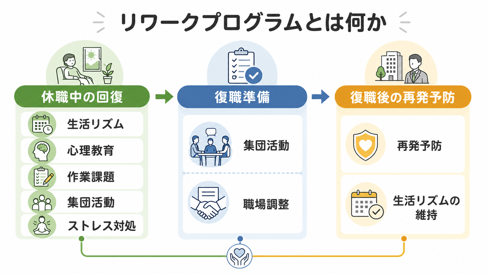
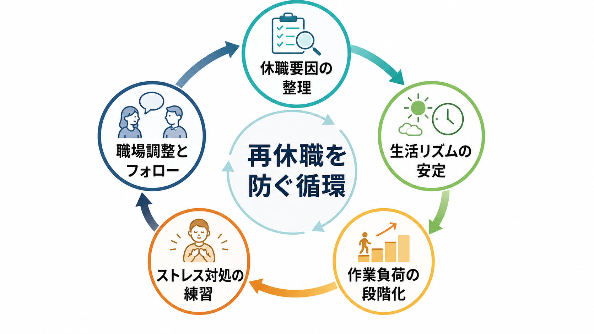
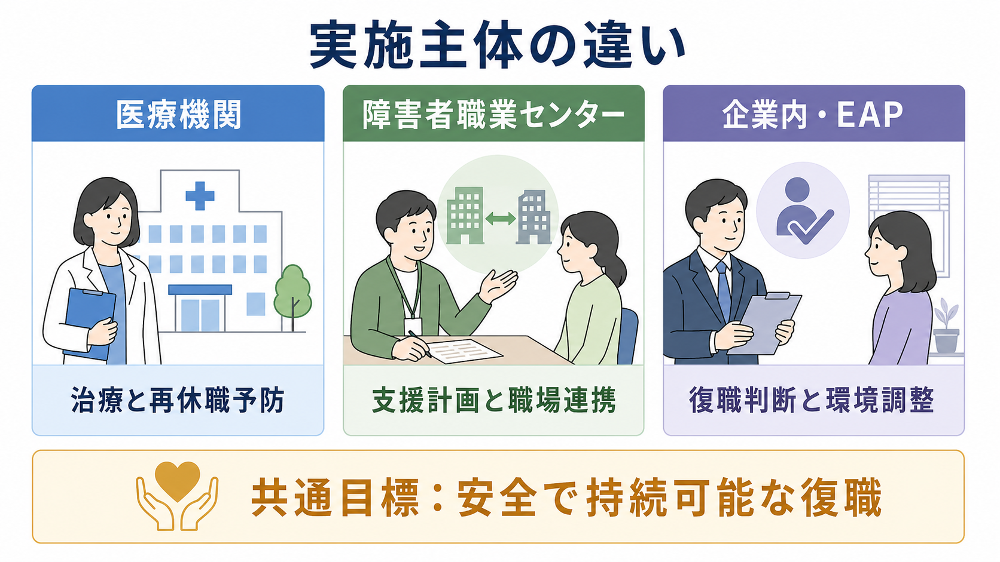

# リワークプログラムとは何か

## 要点

- リワークプログラムは、メンタルヘルス不調などで休職した人が、復職前に生活リズム、作業耐性、対人場面、自己理解、再発予防を段階的に整える支援である。
- 目的は「早く戻すこと」ではなく、本人が安全に働き続けられる条件を見つけ、再休職を減らすことである。日本の医療機関型リワーク研究でも、中心目標は再休職予防として説明されている[5]。
- 内容は、心理教育、作業課題、集団活動、認知行動療法的な振り返り、ストレス対処、生活記録、復職後フォローなどを組み合わせる。
- 復職可否の最終判断は、リワーク施設だけで完結しない。主治医、産業医等、職場、人事労務、本人の情報共有と、職場側の就業上の配慮が必要になる[1]。
- 研究上は有望な知見がある一方、対象者、実施主体、職場文化、休職制度が異なるため、「どのリワークでも同じ効果がある」とは言えない[4][5]。

## この記事で答える問い

1. リワークプログラムは、通常の外来治療や単なる休養と何が違うのか。
2. 休職者は、リワークで何を練習し、何を確認するのか。
3. 医療機関、地域障害者職業センター、企業内支援では、役割がどう違うのか。
4. リワークは再休職予防にどの程度役立つと考えられているのか。
5. 本人・支援者・職場が誤解しやすい点は何か。

## まず結論

リワークプログラムとは、休職者を「症状が軽くなったから職場へ戻す」ための通過儀礼ではない。休職に至った要因を整理し、生活リズムと作業耐性を回復し、対人ストレスや業務負荷への対処を練習し、職場側の調整と復職後フォローにつなげる、復職準備と再発予防のための心理社会的プログラムである。

したがって、リワークは[[精神科リハビリテーションとは何か|精神科リハビリテーション]]、[[心理教育とは何か|心理教育]]、[[認知行動療法CBTとは何か|認知行動療法]]、職場メンタルヘルス、産業保健の交差点にある。本人の治療だけでなく、職場復帰支援プラン、就業上の配慮、復職後の観察、再休職時の早期対応まで含めて考える必要がある[1][2][3]。

## 背景

メンタルヘルス不調による休職では、症状の軽快と職場復帰の準備は同じではない。抑うつ気分や不安が軽くなっても、朝に起きて通勤する、一定時間集中する、複数人で作業する、上司へ相談する、締切や評価にさらされる、といった職場特有の負荷に耐えられるかは別問題である。

厚生労働省の職場復帰支援の手引きは、休業開始から復職後フォローアップまでを段階的に整理し、職場復帰支援プログラムと個別の職場復帰支援プランを準備することを重視している[1]。この考え方では、復職は「主治医の診断書が出た時点」ではなく、本人の回復、職場の受け入れ、就業上の配慮、復職後の支援を合わせて判断するプロセスである。

WHO も職場メンタルヘルスの指針で、メンタルヘルス不調をもつ人が働き続け、復帰し、参加できるようにする支援として、合理的配慮、復職プログラム、援助付き雇用を位置づけている[2]。ここで重要なのは、復職支援が個人の努力だけでなく、職場環境と臨床ケアを組み合わせる介入だという点である。

## 基本概念

### リワーク

リワークは、return to work を日本語化した実践用語であり、特に日本では精神科医療機関のデイケア、地域障害者職業センター、企業内プログラムなどで使われる。医療機関型のリワークでは、主に気分障害などで休職した労働者を対象に、通常治療に加えて、集団プログラム、作業課題、心理教育、認知行動療法的介入、面接、生活記録などを組み合わせることが多い[5][7]。

ただし、リワークは単一の標準治療名ではない。施設ごとに期間、頻度、スタッフ構成、対象疾患、職場連携の範囲が異なる。医療機関型リワーク、障害者職業センターの職業リハビリテーション、企業内の復職支援は、重なりながらも役割が異なる。

### 復職準備

復職準備は、症状の軽快だけでなく、働くための条件を点検する作業である。たとえば、睡眠覚醒リズム、日中活動量、集中持続、疲労からの回復、服薬や通院の継続、ストレスサインへの気づき、相談行動、対人場面の負荷、通勤の見通しを確認する。

ここで大切なのは、「本人がどこまで努力できるか」だけを問わないことである。職場の業務量、裁量、上司との関係、残業、評価制度、ハラスメント、配置、通勤、休憩の取りやすさも再休職リスクに関わる。NICE の職場メンタルウェルビーイング指針も、個人支援だけでなく、職場文化、業務量、役割の自律性、管理職支援、外部支援の活用を重視している[3]。

### 再発予防

リワークでいう再発予防は、「もう不調にならない」と約束することではない。早期サインを見つけ、負荷を下げ、相談し、受診や休養につなげる手順を事前に作ることである。[[再発予防計画とは何か|再発予防計画]]として考えると、本人のセルフモニタリング、職場での相談先、主治医・産業医等への連絡基準、業務調整の候補を具体化しやすい。

## 仕組み

### 1. 休職要因を整理する

最初に行うのは、「なぜ休職したのか」を単純な原因探しにしないことである。うつ病、不安症、双極性障害、発達特性、身体疾患、睡眠障害、家庭負担、職場の過重労働、対人葛藤、仕事内容の不一致、相談できない文化などが重なり合う。リワークでは、本人の症状経過と職場状況を分けて整理し、変えられる要因と変えにくい要因を見立てる。

### 2. 生活リズムを安定させる

復職前には、起床時刻、食事、活動量、通勤相当の外出、昼間の眠気、疲労回復を確認する。これは「規則正しくすれば治る」という意味ではない。職場復帰に必要な基礎負荷を、いきなり本番の職場で試すのではなく、支援環境で段階的に観察するためである。

### 3. 作業負荷を段階化する

多くのリワークでは、読書、要約、PC作業、事務課題、発表、共同作業、模擬業務などを用いる。目的は作業能力のテストだけではなく、疲労、集中低下、完璧主義、先延ばし、焦り、他者評価への敏感さなど、再休職につながりやすいパターンを本人が把握することである[7]。

### 4. 心理教育と対処スキルを学ぶ

心理教育では、疾患理解、睡眠、服薬、再発サイン、ストレス反応、認知と行動の関係を扱う。認知行動療法的な介入では、自動思考、行動活性化、問題解決、アサーション、再発予防シートなどを使うことがある。Soeda は、リワークを、休養と薬物療法に続いて、休職理由の振り返りとストレス対処スキルの改善を助ける日本型の復職支援として説明している[7]。

### 5. 集団場面で試す

リワークの特徴の一つは、集団場面である。職場でのストレスは、作業そのものだけでなく、報告、相談、雑談、役割分担、評価、比較、断ること、助けを求めることに生じる。集団プログラムは、こうした対人・協働の負荷を安全に観察し、練習する場になる。

### 6. 職場調整につなげる

復職準備が進むと、勤務時間、業務量、残業制限、出張、夜勤、配置、上司との面談頻度、在宅勤務、休憩、通院時間の確保などを検討する。合理的配慮や段階的復職は、本人を特別扱いするためではなく、再休職を防ぎながら職務遂行を安定させるための条件調整である[2][8]。

### 7. 復職後にフォローする

復職日はゴールではなく、再評価の開始点である。復職直後は、疲労が遅れて出る、期待に応えようとして過負荷になる、休職前の働き方へ戻る、相談を控える、症状の再燃を隠す、といったリスクがある。復職後フォローでは、勤務状況、睡眠、疲労、症状、対人関係、残業、セルフケア、主治医・産業医等との連携を継続的に確認する[1]。

## 図解

| 視点 | リワークで見ること | 実践上の意味 |
|---|---|---|
| 生活リズム | 起床、通所、活動量、睡眠、疲労回復 | 復職前に日中活動の土台を確認する |
| 作業耐性 | 集中、処理速度、休憩、ミス後の立て直し | 職場負荷をいきなり本番で試さない |
| 自己理解 | 休職要因、早期サイン、認知・行動パターン | 再発予防計画に変換する |
| 対人場面 | 相談、断る、協働、報告、評価への反応 | 職場で孤立しないための行動を練習する |
| 職場調整 | 業務量、勤務時間、配置、上司面談、通院 | 本人の努力と環境調整を両方扱う |
| フォロー | 復職後の疲労、残業、症状再燃、欠勤 | 復職後に支援を切らない |

## 臨床・研究との接続

復職支援研究では、症状尺度だけでなく、病気休業日数、復職までの期間、就労継続、再休職、生活の質、本人の満足度をアウトカムにする必要がある。Cochrane レビューは、うつ病の労働者を対象にした臨床介入と職場指向介入を検討し、仕事に向けた介入と臨床ケアの組み合わせが病気休業を減らす可能性を示しているが、介入内容や研究の異質性にも注意が必要である[4]。

日本の医療機関型リワークに関する多施設後ろ向きコホート研究では、気分障害で休職し復職した労働者を対象に、通常治療のみと通常治療にリワークを加えた群を比較し、リワーク参加群で就労継続が良好だったことが報告された[5]。ただし、観察研究であり、職場環境や選択バイアスを完全には統制できない。したがって、効果を読むときは「リワークという名前だから有効」ではなく、どの要素が、どの対象者に、どの職場条件で役立ったのかを分けて考える必要がある。

企業内の復職支援プログラムに関する日本の研究では、生活記録、6か月程度の段階的計画、産業医面談、復職調整会議を組み込んだ新しいプログラムにより、1年以内の再発なし就業継続率が改善したと報告されている[6]。この知見は、医療機関のリワークだけでなく、企業側の制度設計と産業保健スタッフの継続的関与が重要であることを示している。

## よくある誤解

### 「リワークに通えば復職できる」

リワーク参加は復職の十分条件ではない。復職には、主治医の医学的評価、本人の準備性、職場の受け入れ可能性、産業医等の評価、就業上の配慮、復職後フォローが必要である。リワークはその判断材料と準備を増やす場であって、復職許可証ではない。

### 「症状が残っているなら復職してはいけない」

症状が完全にゼロでなければ働けない、という考えも単純化である。重要なのは、症状があっても安全に働ける条件があるか、悪化時の早期対応があるか、通院や休養を維持できるかである。一方で、希死念慮、著しい不眠、躁状態、精神病症状、重い物質使用、強い職場ハラスメントなどがある場合は、復職準備より安全確保と治療調整が優先される。

### 「本人の考え方を変えれば再休職は防げる」

本人の認知や対処スキルは重要だが、それだけでは不十分である。業務量、裁量、上司の対応、評価制度、長時間労働、配置、ハラスメント、通勤などの環境要因を扱わなければ、本人の努力に問題を押し戻してしまう。WHO や NICE の指針も、個人介入だけでなく職場環境と組織的支援を重視している[2][3]。

### 「リワークはうつ病だけのもの」

日本のリワーク研究では気分障害、とくにうつ病や双極性障害を対象にしたものが多い[5]。しかし実践上は、不安症、適応反応、発達特性、身体疾患との併存、燃え尽き、職場要因なども関わる。対象を広げる場合は、疾患名よりも、生活機能、作業耐性、対人負荷、職場調整ニーズを丁寧に見る必要がある。

### 「職場には診断名を詳しく伝えるべき」

職場に必要なのは、通常、詳細な診断名や心理的背景ではなく、就業上の制限、配慮事項、勤務時間、業務負荷、再発時の連絡基準である。情報共有は本人の同意、最小限性、目的の明確化を前提にする。医療情報を広く共有しすぎると、本人のプライバシーと職場での安全感を損なう。

## 関連ノート

- [[精神科における休職復職支援とは何か]]
- [[精神科リハビリテーションとは何か]]
- [[心理教育とは何か]]
- [[認知行動療法CBTとは何か]]
- [[うつ病とは何か]]
- [[再発予防計画とは何か]]
- [[IPS援助付き雇用とは何か]]

### MOC更新候補

- `content/00_MOC/` 配下の臨床実践・治療、地域精神医療、就労支援、精神科リハビリテーション関連 MOC に追加候補。
- 並列生成ジョブとの競合を避けるため、本記事では MOC 本体は更新しない。

### 今後の作成候補

- 医療機関型リワークとは何か
- 職場復帰支援プランとは何か
- 復職判定における産業医の役割とは何か
- メンタルヘルス不調後の段階的復職とは何か
- 休職中の生活リズム評価とは何か

## 理解チェック

1. リワークプログラムが、単なる休養や通常外来と異なる点は何か。
2. 復職準備で「症状の軽快」以外に確認すべき項目を3つ挙げられるか。
3. 再休職予防において、本人のセルフモニタリングと職場調整の両方が必要な理由は何か。
4. 医療機関型リワーク、地域障害者職業センター、企業内支援では、主な役割がどう違うか。
5. 職場へ共有する情報を最小限にすべき理由は何か。

## 未解決問題

- 日本のリワーク研究は増えているが、対象疾患、休職歴、職種、企業規模、職場文化、雇用制度の違いを踏まえた比較可能な研究はまだ十分ではない。
- どの構成要素、たとえば集団CBT、作業課題、生活記録、職場連携、復職後フォローが、どの対象者に最も効くのかはさらに検証が必要である。
- テレワーク、ハイブリッド勤務、裁量労働、非正規雇用、フリーランスに対するリワークモデルは、従来の出社前提のプログラムだけでは整理しきれない。
- 個人情報保護、合理的配慮、復職判定、職場の安全配慮義務を、本人の自律性を損なわずにどう接続するかは実務上の重要課題である。

## 参考文献

[1] 厚生労働省. *心の健康問題により休業した労働者の職場復帰支援の手引き*. https://www.mhlw.go.jp/stf/seisakunitsuite/bunya/0000055195_00005.html

[2] World Health Organization. (2022). *Guidelines on mental health at work*. https://www.who.int/publications/i/item/9789240053052

[3] National Institute for Health and Care Excellence. (2022). *Mental wellbeing at work: NICE guideline NG212*. https://www.nice.org.uk/guidance/ng212

[4] Nieuwenhuijsen, K., Verbeek, J. H., Neumeyer-Gromen, A., Verhoeven, A. C., Bültmann, U., & Faber, B. (2020). Interventions to improve return to work in depressed people. *Cochrane Database of Systematic Reviews*, 2020(10), CD006237. https://doi.org/10.1002/14651858.CD006237.pub4

[5] Ohki, Y., Igarashi, Y., & Yamauchi, K. (2021). Re-work Program in Japan: Overview and Outcome of the Program. *Frontiers in Psychiatry, 11*, 616223. https://doi.org/10.3389/fpsyt.2020.616223

[6] Namba, K. (2012). A Return-to-work Program with a Relapse-free Job Retention Rate of 91.6% for Workers with Mental Illness. *Sangyo Eiseigaku Zasshi, 54*(6), 276-285. https://doi.org/10.1539/sangyoeisei.E12001

[7] Soeda, S. (2016). Re-work: A new Japanese support system for reinstatement. *Psychology, Health & Medicine, 21*(6), 750-754. https://doi.org/10.1080/13548506.2015.1120326

[8] 厚生労働省. *雇用の分野における障害者への差別禁止・合理的配慮の提供義務*. https://www.mhlw.go.jp/stf/seisakunitsuite/bunya/koyou_roudou/koyou/shougaishakoyou/shougaisha_h25/index.html
