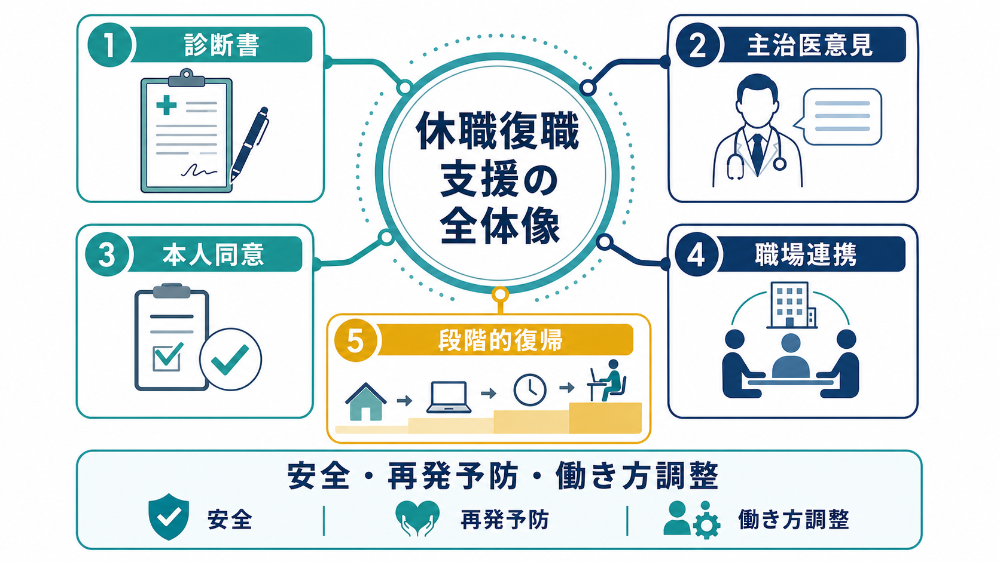
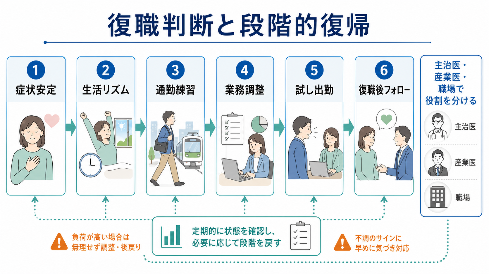
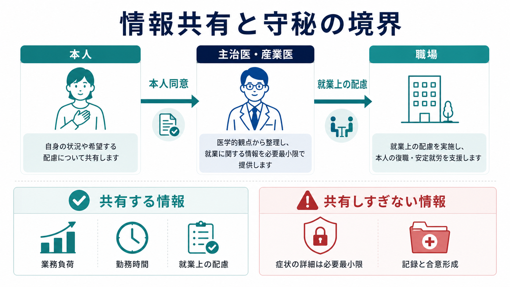

# 休職復職支援はどう進めるか

## 要点

- 休職復職支援は「休ませる・戻す」の二択ではなく、療養、職場情報、本人同意、就業上の配慮、復職後フォローをつなぐプロセスである。
- 診断書は入口だが、復職可否は診断名だけで決めない。症状安定、生活リズム、通勤耐性、業務遂行能力、再発時のサイン、職場側の調整可能性を総合して判断する。
- 主治医意見は医学的回復を示し、産業医・産業保健スタッフは職場の要求水準との適合を評価し、事業者が最終的な就業判断を行う。
- 職場に共有する情報は、本人同意を前提に、勤務時間、業務負荷、配慮事項、フォロー頻度など就業上必要な範囲に絞る。
- 段階的復帰は「甘やかし」ではなく、再発リスクを観察しながら職務要求を戻すためのリスク管理である。

## この記事で答える問い

- 休職開始から復職後フォローまで、何をどの順番で確認するのか。
- 診断書、主治医意見、産業医意見、職場判断はどう役割分担するのか。
- 本人同意と守秘を守りながら、職場とどの情報を共有するのか。
- 段階的復帰、試し出勤、業務調整はどのように設計するのか。

## まず結論

休職復職支援は、厚生労働省の手引きが示すように、1）病気休業開始と休業中のケア、2）主治医による職場復帰可能性の判断、3）職場復帰可否の判断と復職支援プラン作成、4）最終的な職場復帰決定、5）復職後フォローアップ、という段階で進めるのが基本である[1]。この流れは、精神疾患だけでなく、治療と就業の両立支援で使われる「勤務情報の提供」「主治医意見の取得」「両立支援プラン／職場復帰支援プラン」の考え方とも接続している[2]。

ポイントは、主治医の「復職可能」という診断書をそのまま職場復帰の最終決定にしないことである。主治医は日常生活上の回復を中心に判断することが多く、職場で要求される注意持続、対人負荷、納期、残業、責任範囲まで十分に把握しているとは限らない。したがって、本人同意のもとで職場情報を主治医へ渡し、主治医意見を産業医・産業保健スタッフが職務要求と照合し、事業者が就業上の措置を決める構造にする[1][3]。

## 背景

メンタルヘルス不調による休職は、本人にとっては症状、生活リズム、収入、職場との関係が同時に揺らぐ出来事であり、職場にとっては安全配慮、業務配分、同僚負担、再発予防を同時に考える課題である。厚生労働省の職場復帰支援手引きは、休業から復職までの流れを事前に明確化し、職場復帰支援プログラムと個別の職場復帰支援プランを整備する必要を強調している[1]。

復職支援が難しくなる典型例は、医学モデルだけで進める場合である。症状が軽くなったことは重要だが、仕事には時間拘束、通勤、同時処理、対人調整、評価、期限、予測不能なトラブルが含まれる。逆に、職場都合だけで「戻れるか」を決めると、本人の治療状況や再発サインを見落としやすい。休職復職支援は、[[精神科リハビリテーションとは何か]]、[[作業療法は精神科で何をするのか]]、[[ケースマネジメントとは何か]]と同じく、症状だけでなく生活機能と環境調整を扱う実践である。

国際的にも、長期病休からの復職支援では、早期の接点維持、職場調整、復職計画、再休業予防、管理職を含む職場文化の整備が推奨されている[4]。復職介入研究では、効果量は大きくないものの、仕事に焦点を当てた介入、心理教育、行動活性化、職場との調整、復職コーディネーションが復職アウトカムを改善しうることが示されている[5][6][7]。

## 基本概念

### 診断書

診断書は、休職開始や復職申し出の公式な入口になる。休職開始時には、傷病名、療養を要する期間、就労困難の理由が書かれることが多い。復職時には「復職可能」「軽減勤務が望ましい」などの意見が記載される。

ただし、診断書は最小限の医療文書であり、職場の業務内容に即した評価表ではない。復職判断に必要なのは、診断名そのものよりも、睡眠覚醒リズム、疲労回復、注意集中、対人負荷への耐性、服薬や通院の継続可能性、再発サイン、勤務時間や業務量に関する配慮である[1]。

### 主治医意見

主治医意見は、病状、治療状況、就業上の留意点を医学的観点から整理する情報である。厚労省の両立支援資料では、勤務情報を主治医に提供する様式、治療状況や就業継続可否について主治医意見を求める様式、職場復帰可否について主治医意見を求める様式が用意されている[2]。

主治医に有用な情報は、抽象的な「忙しい職場です」ではなく、所定労働時間、通勤時間、残業見込み、夜勤の有無、対人対応、責任範囲、納期、危険作業、在宅勤務可否などである。主治医はその情報を踏まえて、医学的に避けた方がよい負荷、段階的に戻せる負荷、通院や服薬との両立条件を記載しやすくなる[3]。

### 産業医・産業保健スタッフ

産業医・産業保健スタッフは、医療情報と職場情報を翻訳する役割を担う。主治医は治療の専門家であり、上司は業務の専門家であるが、両者の言葉はそのまま噛み合うとは限らない。産業医は、主治医意見と職務要求を照合し、就業上の配慮、勤務制限、復職後フォロー、情報共有範囲について助言する[1]。

### 職場復帰支援プラン

職場復帰支援プランは、復帰日、勤務時間、業務内容、業務量、残業・出張・夜勤の扱い、上司との面談頻度、産業保健面談、配慮を見直す時期、再発サインが出たときの対応を明文化する文書である。プランは固定された約束ではなく、復職後の状態と職場適応を見ながら見直す作業仮説である[1][2]。

## 仕組み

### 1. 休職開始時に「復職までの道筋」を説明する

休職開始時には、診断書を受け取るだけで終わらせない。本人には、休職期間、傷病手当金などの制度、職場との連絡窓口、診断書更新のタイミング、復職申し出時に必要な書類、復職判断の流れを説明する[1]。ここで曖昧さを残すと、本人は「会社から見放されたのではないか」「いつ連絡すべきかわからない」と感じやすく、職場側も連絡過多または放置に振れやすい。

連絡頻度は、療養を妨げない範囲で定める。内容は、業務指示ではなく、事務手続き、体調確認、復職支援手順の共有を中心にする。本人の治療内容を上司が詳しく聞き取る必要はない。

### 2. 復職申し出の前に、生活機能を確認する

復職の前提は「症状がゼロになったこと」ではなく、「仕事に必要な生活機能が安定してきたこと」である。最低限、起床時刻、睡眠、食事、日中活動、外出、通勤練習、半日から一日程度の活動耐性を確認する。特にうつ病、不安症、双極症、適応反応、発達特性を背景にした不調では、症状自己評価と実際の負荷耐性がずれることがある。

この段階では、[[訪問看護は精神科で何を支えるのか]]、[[生活技能訓練SSTとは何か]]、[[認知リハビリテーションとは何か]]のような生活支援・認知機能支援の視点が役立つ。復職支援は職場だけの支援ではなく、生活リズム、セルフモニタリング、相談行動、対人スキルの支援でもある。

### 3. 主治医意見を「職務情報」とセットで得る

主治医に復職意見を求めるときは、本人同意のもとで勤務情報を提供する。厚労省の様式例が想定するように、職場から主治医へ勤務情報を伝え、主治医から職場へ就業上の意見を返してもらう構造を作ると、診断名中心ではなく機能中心のやりとりになりやすい[2][3]。

主治医に確認したい項目は、次のようなものになる。

| 項目 | 確認すること |
|---|---|
| 勤務時間 | フルタイム可能か、短時間勤務から開始すべきか |
| 業務負荷 | 対人対応、納期、判断責任、マルチタスクの制限が必要か |
| 勤務形態 | 在宅勤務、時差出勤、夜勤・出張・残業の可否 |
| 通院・治療 | 通院頻度、服薬の影響、治療継続上の配慮 |
| 再発サイン | 睡眠悪化、欠勤増加、焦燥、涙もろさ、過集中など |
| 見直し時期 | 2週間後、1か月後、3か月後などの再評価時点 |

### 4. 職場復帰可否は、本人・主治医・産業保健・職場で分担して判断する

復職可否の判断では、本人の復職意思、主治医意見、産業医等の評価、職場環境、業務遂行能力、職場側の支援準備を総合する[1]。ここで大切なのは、誰か一人に判断を押しつけないことである。

- 本人は、希望、体調、困りごと、同意範囲を伝える。
- 主治医は、医学的安定性と就業上の留意点を示す。
- 産業医・産業保健スタッフは、医学情報と職務要求の適合を評価する。
- 上司・人事は、業務調整、勤務制度、配置、同僚負担を検討する。
- 事業者は、安全配慮と職場運営を踏まえて最終的な就業判断を行う。

この分担を明確にすると、「主治医が復職可と言ったから即復職」「上司が不安だから復職不可」のような単純化を避けやすい。

### 5. 段階的復帰は、負荷を小さく始めて観察する

段階的復帰では、勤務時間、業務量、責任範囲、対人負荷、残業、出張、夜勤を一度に戻さない。たとえば、短時間勤務、定型業務、残業禁止、窓口対応なし、週1回の上司面談、2週ごとの産業保健面談から始め、状態を見ながら段階的に広げる。

試し出勤やリハビリ出勤を行う場合は、制度上の位置づけ、賃金・労災・通勤災害、業務命令性、評価対象にするかどうかを事前に整理する。制度が曖昧なまま実施すると、本人にも職場にも不信感が残る。

### 6. 復職後フォローで「戻した後」を支える

復職日はゴールではなく、再適応の開始点である。厚労省手引きは、復職後に疾患の再燃・再発、新しい問題、勤務状況、業務遂行能力、支援プラン実施状況、治療状況を確認し、必要に応じてプランを見直すことを求めている[1]。

フォロー面談では、本人の主観だけでなく、勤怠、遅刻、疲労、ミス、対人摩擦、残業、睡眠悪化などの客観情報も見る。ただし監視にならないよう、あらかじめ「何を見るか」「誰が見るか」「いつ見直すか」を合意しておく。

## 図解

### 情報共有の原則

メンタルヘルスに関する健康情報は機微性が高く、本人同意と必要最小限の共有が原則である[1]。職場に必要なのは、詳細な生育歴、心理療法の内容、家族関係、診断名の細部ではなく、就業上の配慮に関係する機能情報である。

| 共有しやすい情報 | 共有を慎重にする情報 |
|---|---|
| 勤務時間の制限 | 詳細な症状エピソード |
| 残業・夜勤・出張の可否 | 治療で話している個人的内容 |
| 通院配慮 | 家族関係や生活歴 |
| 業務量・対人負荷の調整 | 診断名の不要な拡散 |
| 再発サインと相談手順 | 本人が同意していない医療情報 |

上司に伝える文言は、「うつ病なので配慮してください」よりも、「当面1か月は残業なし、納期が短い新規案件は避け、週1回10分の業務確認を行う」の方が実務に落ちやすい。

## 臨床・研究との接続

復職支援は、臨床治療、[[リカバリー志向支援とは何か]]、職業リハビリテーション、産業保健、労務管理が交差する領域である。心理療法や薬物療法で症状が改善しても、職場での再適応には、自己効力感、職場との信頼、作業負荷の調整、管理職の理解が関わる。

復職介入のメタ分析では、精神疾患を含む病休者への復職支援介入は、通常ケアと比べて復職アウトカムに小さいが有意な改善を示すことが報告されている[5]。心理社会的復職介入のレビューでは、効果的な介入に共通する要素として、復職焦点、心理教育、行動活性化、個別化された支援、職場との接続が挙げられている[6]。復職コーディネーターのレビューも、本人、医療、職場、保険・制度の間をつなぐ調整役の重要性を示している[7]。

一方で、復職支援研究は国の制度差、保険制度、雇用慣行、診断構成の違いに影響されやすい。したがって、日本の実務では、厚労省手引き、両立支援指針、就業規則、産業保健体制、本人同意のルールに沿って、研究知見を慎重に翻訳する必要がある[1][2][4]。

## よくある誤解

### 誤解1: 主治医が復職可と書けば、職場は必ず戻さなければならない

主治医意見は重要だが、最終的な就業判断そのものではない。事業者は安全配慮と職場運営を踏まえて判断し、産業医等は主治医意見と職務要求を照合する。主治医には職場情報を提供し、就業上の配慮を具体化してもらう必要がある[1][3]。

### 誤解2: 診断名を詳しく共有した方が支援しやすい

支援に必要なのは診断名の詳細ではなく、職務上の制限と配慮である。本人同意のない医療情報共有は避け、必要最小限の機能情報に絞る[1]。

### 誤解3: 段階的復帰は本人を甘やかす

段階的復帰は、負荷を観察しながら安全に戻すためのリスク管理である。特にメンタルヘルス不調では、復職直後に「遅れを取り戻そう」と過活動になり、その後に疲弊することがある。段階設定は再発予防のための構造化である。

### 誤解4: 復職日は支援の終点である

復職後こそ、勤怠、疲労、業務負荷、対人負荷、治療継続を確認する必要がある。支援プランは実施して終わりではなく、観察して更新する。

## 関連ノート

- [[精神科リハビリテーションとは何か]]
- [[作業療法は精神科で何をするのか]]
- [[ケースマネジメントとは何か]]
- [[ケアマネジメントとケースマネジメントは何が違うのか]]
- [[訪問看護は精神科で何を支えるのか]]
- [[リカバリー志向支援とは何か]]

## MOC更新候補

- `content/00_MOC/MOC｜臨床実践・治療.md`
- `content/00_MOC/MOC｜リハビリ・生活支援.md`

並列生成ジョブとの衝突を避けるため、本記事作成時点では MOC ファイル本体は更新していない。

## 理解チェック

1. 主治医の「復職可能」診断書だけでは不十分になりうる理由は何か。
2. 職場に共有すべき情報と、共有しすぎない方がよい情報をそれぞれ3つ挙げる。
3. 段階的復帰で最初に制限・調整しやすい負荷は何か。
4. 復職後フォローで確認すべき再発サインには何があるか。
5. 本人、主治医、産業医、上司、人事の役割分担を一文で説明する。

## 参考文献

[1] 厚生労働省・独立行政法人労働者健康安全機構. *心の健康問題により休業した労働者の職場復帰支援の手引き*. https://www.mhlw.go.jp/content/000561013.pdf

[2] 厚生労働省. *治療と仕事の両立について：治療と就業の両立支援指針・様式例*. https://www.mhlw.go.jp/stf/seisakunitsuite/bunya/0000115267.html

[3] 厚生労働省. *治療と仕事の両立支援 メンタルヘルス不調者の主治医向け支援マニュアル*. https://www.mhlw.go.jp/stf/seisakunitsuite/bunya/0000115267.html

[4] National Institute for Health and Care Excellence. *Workplace health: long-term sickness absence and capability to work. NICE guideline NG146*. 2019. https://www.nice.org.uk/guidance/NG146

[5] Mikkelsen MB, Rosholm M. Systematic review and meta-analysis of interventions aimed at enhancing return to work for sick-listed workers with common mental disorders, stress-related disorders, somatoform disorders and personality disorders. *Occupational and Environmental Medicine*. 2018;75(9):675-686. https://doi.org/10.1136/oemed-2018-105073

[6] Venning A, Oswald TK, Stevenson J, Tepper N, Azadi L, Lawn S, Redpath P. Determining what constitutes an effective psychosocial return to work intervention: a systematic review and narrative synthesis. *BMC Public Health*. 2021;21:2164. https://doi.org/10.1186/s12889-021-11898-z

[7] Dol M, Varatharajan S, Neiterman E, McDonald E, Malachowski C, Dali N, Giau E, MacEachen E. Systematic review of the impact on return to work of return-to-work coordinators. *Journal of Occupational Rehabilitation*. 2021;31(4):675-698. https://doi.org/10.1007/s10926-021-09975-6

[8] Finnes A, Enebrink P, Ghaderi A, Dahl J, Nager A, Öst LG. Psychological treatments for return to work in individuals on sickness absence due to common mental disorders or musculoskeletal disorders: a systematic review and meta-analysis of randomized-controlled trials. *International Archives of Occupational and Environmental Health*. 2019;92(3):273-293. https://doi.org/10.1007/s00420-018-1380-x

## 未解決問題

- 日本の企業規模別に、産業医・産業保健スタッフが十分に関与できない場合の代替モデルをどう設計するか。
- 試し出勤やリハビリ出勤の制度設計を、労務・安全・治療継続の観点からどう標準化するか。
- 神経発達症特性、双極症、トラウマ関連症状など、再発パターンが異なるケースで段階的復帰をどう個別化するか。
- 復職後の成功を、単なる出勤継続ではなく、健康、職務遂行、本人の意味ある働き方としてどう評価するか。
