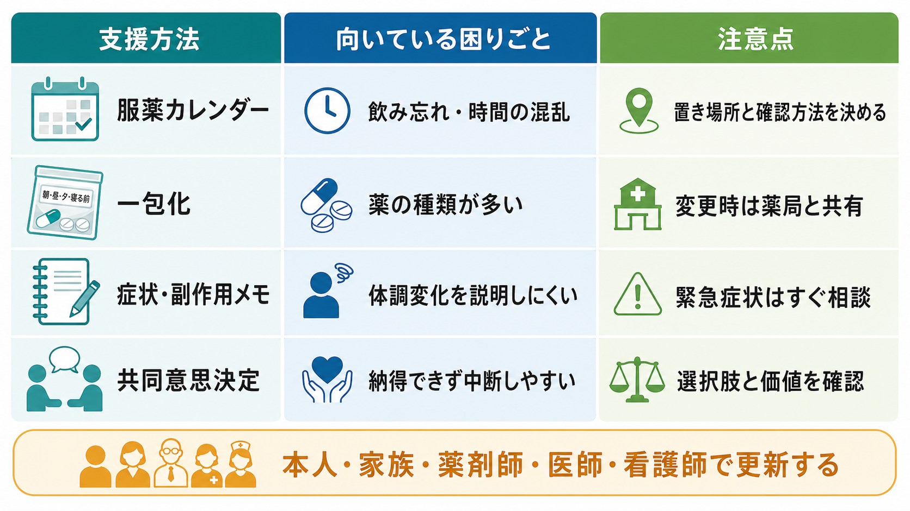

# 住居支援とは何か

## 要点

- 住居支援とは、単に部屋を紹介することではなく、住まいの確保、契約・入居、生活の維持、危機時の再調整をつなぐ支援である。
- 安定した住まいは、健康、安心、プライバシー、社会参加の土台であり、不安定な住まいは医療・福祉・就労支援の効果を弱めやすい [1]。
- 日本では、住宅セーフティネット制度、居住支援法人、居住支援協議会、生活困窮者自立支援制度、障害福祉の地域移行支援・地域定着支援などが接点になる [2][3][4][5]。
- 精神保健・ホームレス支援の研究では、まず住まいを確保し、本人の選択を尊重しながら支援を組み合わせる Housing First や Permanent Supportive Housing が、住宅安定性を高める可能性を示している [6][7][8]。

## この記事で答える問い

1. 住居支援は、住宅紹介や家賃補助と何が違うのか。
2. 住まいの安定は、なぜ地域生活やリカバリーに関係するのか。
3. 臨床・福祉・地域支援の現場では、どのような支援要素を組み合わせるのか。

## まず結論

住居支援は、「住む場所」を支援するだけでなく、「住み続けられる条件」を整える実践である。対象は、ホームレス状態の人だけではない。精神科病院から退院する人、家族関係や経済状況が不安定な人、障害や高齢により賃貸契約や近隣関係に困難を抱える人、家賃滞納や退去リスクを抱える人も含まれる。

重要なのは、住居を治療・訓練の報酬にしないことである。住まいが安定してはじめて、服薬、通院、家計管理、就労、家族関係の調整、地域参加といった支援が現実的になる。これは[[リカバリー志向支援とは何か]]や[[ケースマネジメントとは何か]]と強く接続する。

## 背景

住まいは、健康の社会的決定要因の一つである。WHO は、健康的な住まいを、身体的・精神的・社会的ウェルビーイングを支える場として位置づけ、過密、寒暑、事故リスク、機能障害のある人にとってのアクセシビリティなどを健康課題として扱っている [1]。つまり住居支援は、福祉の周辺的サービスではなく、健康支援そのものの一部である。

日本の制度上は、住宅確保要配慮者への民間賃貸住宅の供給促進、居住支援法人、居住支援協議会などが住宅政策側の入口になる。国土交通省は、居住支援法人を、低額所得者、高齢者、障害者、子育て世帯などの住宅確保要配慮者に対し、住宅情報の提供・相談、見守りなどの生活支援、家賃債務保証等を行う法人として説明している [2][3]。

一方、福祉・臨床側では、生活困窮者自立支援制度における住居確保給付金や一時的な居住支援、障害福祉サービスにおける[[地域移行支援とは何か]]・[[地域定着支援とは何か]]が関係する [4][5]。精神科リハビリテーションの文脈では、退院支援、訪問支援、危機介入、服薬・金銭・近隣関係の支援が住居支援と重なる。

## 基本概念

### 住まいの確保

住まいの確保は、物件探しだけではない。家賃上限、保証人、緊急連絡先、初期費用、生活保護や住居確保給付金の利用可能性、障害や高齢に伴う配慮、ペットや家族構成、通院先との距離、地域資源へのアクセスを一緒に検討する。

この段階では、不動産事業者、自治体、居住支援法人、相談支援専門員、医療機関、家族・支援者の間で情報をつなぐ必要がある。ただし、本人の同意なしに病歴や生活歴を過剰共有してはならない。支援のための情報共有と、プライバシー・権利擁護のバランスが中心課題になる。

### 入居支援

入居支援は、内見、申込、契約、保証、ライフライン開通、家具・家電、転居手続き、住所変更、近隣への説明、服薬・通院の継続などを含む。とくに精神科病院や施設からの移行では、退院日と入居可能日、福祉サービス開始日、訪問支援の初回訪問がずれると、生活が不安定になりやすい。

### 居住継続支援

住居支援の中心は、入居後である。家賃滞納、孤立、近隣トラブル、症状悪化、飲酒・薬物使用、ゴミ出し、騒音、火の管理、郵便物の未開封などは、退去リスクの早期サインになりうる。[[訪問看護は精神科で何を支えるのか]]、相談支援、家計改善支援、ピアサポート、地域包括支援センター、生活保護ケースワーカーなどが、本人の同意と支援計画に沿って関わる。

## 仕組み

住まいが安定すると、支援の効果が出やすくなる。理由は少なくとも四つある。

第一に、安心できる居場所があると、睡眠、食事、服薬、衛生、予定管理が整いやすい。第二に、住所があることで、郵便、行政手続き、医療予約、福祉サービス、就労支援につながりやすい。第三に、支援者が訪問できる場所ができ、危機の早期発見が可能になる。第四に、本人が「支援される対象」ではなく「自分の暮らしを選ぶ主体」として意思決定しやすくなる。

Housing First の研究は、この考え方を裏づける代表的な領域である。Housing First は、断酒・治療参加・症状安定を住宅提供の前提条件にせず、まず恒久的な住まいを提供し、本人の選択と支援関係を基盤に、ACT や intensive case management などを組み合わせる。ランダム化比較試験のメタ分析では、健康アウトカムの効果推定には不確実性が残る一方、住宅安定性への効果は比較的一貫している [7]。また、精神疾患をもつホームレス成人を対象にしたカナダの試験では、Housing First と intensive case management の組み合わせが、通常支援より住宅安定性を改善した [8]。

## 図解

住居支援は、次のような循環で考えると理解しやすい。

| 局面 | 主な支援 | 失敗しやすい点 | 見るべきサイン |
|---|---|---|---|
| 相談 | 困りごと、収入、健康、家族関係、退去リスクの把握 | 「物件がない」だけに問題を縮小する | 家賃滞納、泊まり歩き、退院先未定 |
| アセスメント | 住まいの条件、支援量、制度利用、リスクの整理 | 本人の希望より支援者都合が先行する | 希望条件の変化、同意範囲の不明確さ |
| 住宅探索 | 物件、保証、初期費用、地域資源の調整 | 不動産・福祉・医療が分断する | 申込不成立、保証人問題 |
| 入居調整 | 契約、ライフライン、家具、住所変更、初回訪問 | 入居日に支援が途切れる | 手続き未完了、通院中断 |
| 入居後支援 | 見守り、家計、近隣関係、健康、危機対応 | 入居後に支援が薄くなる | 郵便物放置、騒音、孤立、滞納 |

## 臨床・研究との接続

精神科臨床では、住居支援は[[精神科リハビリテーションとは何か]]の中核にある。退院可能性を「症状が完全に落ち着いたか」だけで判断すると、地域生活に必要な環境調整が後回しになる。むしろ、住まい、訪問支援、日中活動、緊急連絡、金銭管理、服薬支援、近隣関係の調整を同時に設計するほうが、退院後の生活を具体化しやすい。

研究的には、住居支援のアウトカムを「入居できたか」だけで評価すると不十分である。少なくとも、住宅安定性、退去・再ホームレス化、入院・救急利用、生活の質、孤立、本人の選択感、地域参加、費用、支援者・大家・近隣との関係を分けて見る必要がある。SAMHSA の Permanent Supportive Housing toolkit も、重い精神疾患をもつ人の地域生活を支える実践として、住宅と支援サービスを統合する視点を強調している [6]。

ただし、Housing First や Permanent Supportive Housing の知見をそのまま日本の全制度に移植できるわけではない。住宅市場、保証慣行、生活保護・障害福祉・医療制度、家族依存の度合い、自治体差が異なるためである。したがって、原理としては「住まいを先に安定させる」「本人の選択を尊重する」「入居後支援を継続する」を採用しつつ、地域の制度設計に合わせて実装する必要がある。

## よくある誤解

### 誤解1: 住居支援は不動産紹介である

不動産紹介は一部にすぎない。住居支援は、契約、保証、費用、生活スキル、近隣関係、健康、危機対応を含む継続的支援である。

### 誤解2: 症状や生活が安定してから住まいを探すべきである

重い危機がある場合の安全確保は必要だが、住まいがない状態で生活を安定させることには限界がある。Housing First の考え方は、住まいを支援の前提条件ではなく、支援を成立させる基盤として扱う [7][8]。

### 誤解3: 入居できれば支援は終わる

入居後こそ支援の焦点である。退去リスクは、孤立、家賃滞納、近隣トラブル、症状悪化、支援関係の途切れとして表面化する。住まいを維持する支援は、[[地域定着支援とは何か]]や[[ケアマネジメントとケースマネジメントは何が違うのか]]と重なる。

### 誤解4: 大家や不動産事業者の不安は偏見として退ければよい

偏見や差別は是正されるべきだが、家賃滞納、緊急時連絡、残置物、近隣トラブルなどへの不安には、制度的・実務的な対応が必要である。居住支援法人や居住支援協議会は、入居希望者と賃貸人の双方を支える接点になりうる [2][3]。

## 関連ノート

- [[地域移行支援とは何か]]
- [[地域定着支援とは何か]]
- [[ケースマネジメントとは何か]]
- [[ケアマネジメントとケースマネジメントは何が違うのか]]
- [[リカバリー志向支援とは何か]]
- [[精神科リハビリテーションとは何か]]
- [[訪問看護は精神科で何を支えるのか]]

## 理解チェック

1. 住居支援が「物件紹介」だけでは不十分な理由を、入居前・入居時・入居後に分けて説明できるか。
2. 住まいの安定が、医療・福祉・就労支援の効果を高める仕組みを説明できるか。
3. Housing First の考え方を、日本の地域移行支援や生活困窮者支援に接続するときの注意点を挙げられるか。
4. 入居後の退去リスクを早期に見つけるサインを三つ挙げられるか。

## 関連ノート候補

- 今後の作成候補: 「住宅セーフティネット制度とは何か」
- 今後の作成候補: 「Housing Firstとは何か」
- 今後の作成候補: 「居住支援法人とは何か」
- 今後の作成候補: 「住居確保給付金とは何か」

## MOC更新候補

- `content/00_MOC/` 配下の臨床実践・地域支援系 MOC に、本記事へのリンクを追加する候補。
- 並列作業との衝突を避けるため、このジョブでは MOC 本体は更新しない。

## 未解決問題

- 日本の居住支援で、住宅安定性、再入院、生活の質、孤立、本人の選択感を同時に測定した研究はまだ限られる。
- 居住支援法人、障害福祉、生活困窮者支援、医療機関、不動産事業者の役割分担は地域差が大きい。
- 入居者の権利擁護と、賃貸人・近隣住民の不安への対応をどう両立するかは、実践上の継続課題である。

## 参考文献

[1] World Health Organization. (2018). *WHO Housing and health guidelines*. https://www.who.int/publications/i/item/9789241550376

[2] 国土交通省. 住宅セーフティネット制度. https://www.mlit.go.jp/jutakukentiku/house/jutakukentiku_house_tk3_000055.html

[3] 国土交通省. 住宅確保要配慮者居住支援法人について. https://www.mlit.go.jp/jutakukentiku/house/jutakukentiku_house_fr7_000026.html

[4] 厚生労働省. 生活困窮者自立支援制度. https://www.mhlw.go.jp/stf/seisakunitsuite/bunya/0000059425.html

[5] 厚生労働省. 障害のある人に対する相談支援について. https://www.mhlw.go.jp/stf/seisakunitsuite/bunya/hukushi_kaigo/shougaishahukushi/service/soudan_shien.html

[6] Substance Abuse and Mental Health Services Administration. (2010). *Permanent Supportive Housing Evidence-Based Practices KIT*. https://library.samhsa.gov/product/permanent-supportive-housing-evidence-based-practices-ebp-kit/sma10-4509

[7] Baxter, A. J., Tweed, E. J., Katikireddi, S. V., & Thomson, H. (2019). Effects of Housing First approaches on health and well-being of adults who are homeless or at risk of homelessness: systematic review and meta-analysis of randomised controlled trials. *Journal of Epidemiology and Community Health, 73*(5), 379-387. https://doi.org/10.1136/jech-2018-210981

[8] Stergiopoulos, V., Gozdzik, A., Misir, V., Skosireva, A., Connelly, J., Sarang, A., Whisler, A., Hwang, S. W., O'Campo, P., & McKenzie, K. (2015). Effectiveness of Housing First with Intensive Case Management in an ethnically diverse sample of homeless adults with mental illness: a randomized controlled trial. *PLOS ONE, 10*(7), e0130281. https://doi.org/10.1371/journal.pone.0130281
