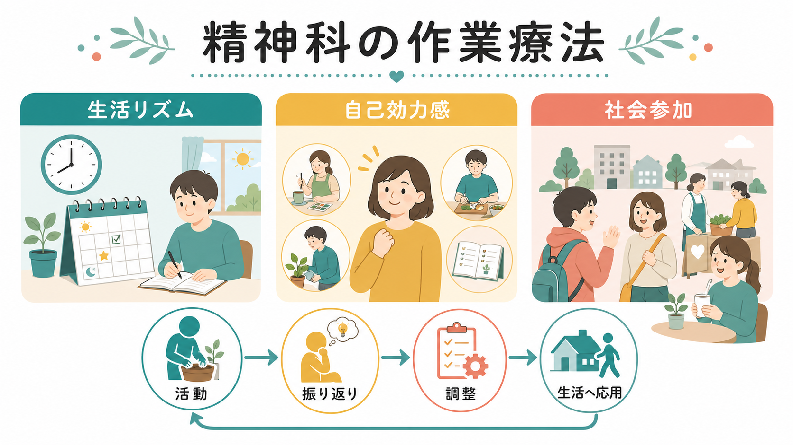
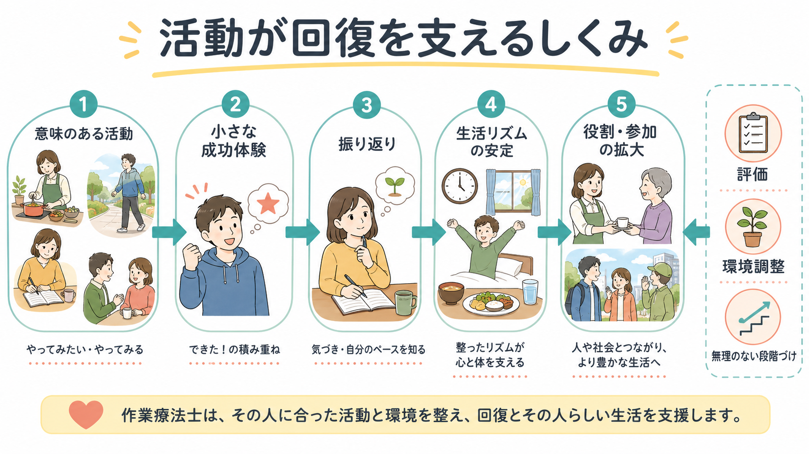

# 作業療法は精神科で何をするのか

## 要点

- 精神科の作業療法は、手芸や工作を「させる」ことではなく、本人にとって意味のある活動を使って、日常生活、対人関係、役割、社会参加を回復・維持・再構成する支援である[1]。
- 作業療法でいう「作業」は、食事、家事、休養、趣味、学業、仕事、対人交流など、本人に目的や価値をもつ生活行為を含む[1]。
- 精神科では、症状そのものだけでなく、睡眠・食事・外出のリズム、活動量、自己効力感、対人負荷、地域参加、就労・復学準備を扱う。
- NICE の複雑な精神病性障害リハビリテーション指針でも、作業療法士を含む多職種チーム、日常生活技能、意味のある作業、地域活動、教育・仕事への参加が重視されている[2]。
- エビデンスは一枚岩ではない。重症精神疾患の作業遂行・参加に対する作業療法領域の介入では、心理教育、作業・認知ベース介入、技能ベース介入に一定の根拠がある一方、個別プログラムごとの効果は検証途上である[5][6]。

## この記事で答える問い

1. 精神科の作業療法は、何を目標にする支援なのか。
2. 「活動」が、なぜ生活リズム・自己効力感・社会参加と関係するのか。
3. 診察、薬物療法、心理療法、デイケア、就労支援とは何が違うのか。
4. 臨床や研究で、作業療法の効果をどのように見ればよいのか。

## まず結論

精神科の作業療法は、治療と生活の間にある実践である。診察室では語れるが生活では続かないこと、薬で症状が軽くなっても戻りにくい日課、対人関係、役割、外出、仕事や学業の準備を、実際の活動を通じて扱う。

重要なのは、活動そのものが目的にも手段にもなる点である。調理、散歩、創作、園芸、運動、買い物練習、ミーティング、SST、生活技能練習、作業課題、就労準備などは、単なる時間つぶしではない。本人が「できた」「少し工夫すれば続けられる」「人と関われた」と経験し、それを振り返り、次の生活場面へ移すための素材になる。

## 背景

精神疾患では、幻覚、妄想、抑うつ、不安、躁状態、認知機能低下、意欲低下、睡眠障害などが、日常生活の構造を崩すことがある。たとえば、朝起きられない、食事が不規則になる、外出が怖くなる、人と話す機会が減る、家事が止まる、就労や復学の見通しが立たない、といった困難である。

このとき、症状評価や薬物療法は重要だが、それだけで生活が自動的に戻るとは限らない。[[精神科リハビリテーションとは何か]]で扱うように、回復には生活機能、社会参加、住まい、役割、本人の希望を含めた支援が必要になる。作業療法はその中で、活動と環境を使って生活を立て直す専門性を担う。

WHO の地域精神保健サービスの方向性も、施設中心ではなく、本人中心・権利基盤・地域生活に根ざした支援を重視している[3]。この考え方から見ると、作業療法は「病院内のプログラム」だけではなく、本人が地域で生活するための足場を作る支援である。

## 基本概念

### 作業

作業療法でいう作業は、仕事だけを意味しない。日本作業療法士協会は、作業を「対象となる人々にとって目的や価値を持つ生活行為」と説明している[1]。日常生活活動、家事、仕事、趣味、遊び、対人交流、休養などが含まれる。

したがって、精神科作業療法では「何をするか」よりも、「その活動が本人の生活で何を支えているか」が重要になる。同じ調理でも、退院後の自炊練習、集中力の確認、他者と協力する練習、食生活の立て直し、達成感の回復など、意味は人によって異なる。

### 生活リズム

生活リズムは、睡眠、起床、食事、服薬、外出、活動、休養が一日の中でどのように配置されるかである。[[精神疾患と生活リズム障害はどう関係するのか]]と接続すると、リズムの乱れは症状の結果でもあり、再発や機能低下を強める要因にもなりうる。

作業療法では、決まった時間に来る、活動前に準備する、活動後に疲労を確認する、翌日の予定を立てる、といった反復が生活のアンカーになる。これは「頑張らせる」ことではなく、本人に合う負荷と休息の配分を見つける作業である。

### 自己効力感

自己効力感は、「自分はこの状況で必要な行動をとれる」という見込みである。Bandura は、自己効力感が行動選択、努力、持続、困難への対処に影響することを示した[7]。精神科では、失敗経験、症状、スティグマ、長期入院、孤立によって、この見込みが低下しやすい。

作業療法は、抽象的な励ましではなく、小さな成功体験を設計する。たとえば「10分だけ参加する」「材料を一つ選ぶ」「スタッフと一緒に買い物へ行く」「疲労を記録して翌週の予定を調整する」といった段階づけにより、[[自己効力感とは何か]]でいう行為への見通しを回復させる。

### 社会参加

社会参加は、単に外へ出ることではない。人と会う、家庭内の役割をもつ、地域の活動に関わる、学ぶ、働く、趣味を続ける、支援を求めるなど、本人が意味を感じる場に関与することである。NICE は、複雑な精神病性障害のリハビリで、地域活動、余暇、教育、仕事への参加を、個別化・柔軟性・強み・所属感と結びつけて推奨している[2]。

## 仕組み

作業療法の仕組みは、次の循環として理解しやすい。

1. 評価する  
   症状、認知機能、身体状態、睡眠、活動量、対人負荷、生活歴、本人の希望、家族・地域資源を確認する。[[精神科で生活機能をどう評価するか]]のように、症状尺度だけでなく活動と参加を見る。

2. 意味のある活動を選ぶ  
   支援者が一方的に「よい活動」を決めるのではなく、本人がやりたいこと、やる必要があること、周囲から期待されていることを整理する[1]。

3. 負荷を段階づける  
   時間、人数、音、移動距離、手順の複雑さ、責任の大きさを調整する。調子が悪い時期には参加量を下げ、安定してきたら役割や場を広げる。

4. 実際に活動する  
   院内、デイケア、地域、住まい、職場準備の場で、料理、創作、運動、会話、生活技能、買い物、公共交通、就労準備などを試す。

5. 振り返る  
   何ができたか、何が疲れたか、症状がどう変わったか、どの支援があれば続けられるかを確認する。成功だけでなく、中断や失敗も計画を調整する材料になる。

6. 生活へ応用する  
   活動内でできたことを、家庭、地域、学校、職場、支援制度へ広げる。必要に応じて[[精神科におけるチーム医療とは何か|チーム医療]]、家族支援、訪問支援、就労支援と接続する。

この循環は、[[精神疾患とリカバリー志向支援はどう関係するのか]]でいう「本人にとって意味のある生活」に近い。作業療法は、病気が完全に消えてから始めるものではなく、症状が残る時期にも、生活を少しずつ組み直すために使われる。

## 図解

| 支援対象 | 作業療法で扱う問い | 活動の例 | 見るべき変化 |
|---|---|---|---|
| 生活リズム | 一日のどこに活動と休息を置くと安定するか | 通所、散歩、食事準備、週間予定 | 起床、睡眠、外出、疲労、継続性 |
| 自己効力感 | どの段階なら「できる」と感じられるか | 短時間参加、簡単な役割、振り返り | 達成感、再挑戦、援助要請、自己評価 |
| 対人関係 | どの距離感・人数・場面なら関われるか | 共同作業、SST、ミーティング | 会話、断り方、相談、孤立の軽減 |
| 社会参加 | どの活動が本人の役割や希望につながるか | 地域活動、復学準備、就労準備 | 所属感、役割、外出先、参加頻度 |
| 環境調整 | 本人だけでなく場をどう変えるか | 手順表、休憩、音刺激調整、同伴 | 中断の減少、負荷調整、再現性 |

## 臨床・研究との接続

### 精神科デイケアとの関係

[[デイケアとは何か]]は、生活リズム、対人関係、就労・復学準備を支える通所型リハビリテーションである。作業療法士は、デイケアの中でプログラム設計、個別評価、活動の段階づけ、振り返り、生活場面への橋渡しを担うことがある。ただし、デイケア全体が作業療法と同義ではない。医師、看護師、心理職、精神保健福祉士、ピアスタッフなどの役割と組み合わさって機能する。

### 就労支援との関係

作業療法は、就職先を直接紹介する制度ではない。しかし、就労前の生活リズム、体力、対人負荷、集中、作業耐久性、相談の仕方、失敗時の調整を扱うため、[[IPS援助付き雇用とは何か]]のような就労支援と接続しやすい。NICE も、本人が一般就労を希望する場合には IPS 型の援助付き雇用を検討するよう述べている[2]。

### 心理教育・認知機能支援との関係

重症精神疾患の作業遂行・参加に対する系統的レビューでは、心理教育、作業・認知ベース介入、技能ベース介入に一定の根拠が示されている[5]。これは、[[心理教育とは何か]]のような知識提供だけでなく、知識を日常生活で使う練習が必要であることを示す。

統合失調症の認知機能を対象にした作業療法介入のレビューでも、構造化された意味のある作業、認知的介入、機能技能訓練、自己管理プログラムなどが検討されている[8]。ただし、研究規模、対象、介入内容、アウトカムは多様であり、「作業療法なら何でも効く」と読むべきではない。

### 研究上の注意

意味のある活動への参加を促す MA&R 介入の多施設 RCT では、標準ケアに対する優越性は示されなかったが、実施可能性や受け入れやすさは示唆された[6]。この結果は、活動参加を支援する発想が重要でないという意味ではない。むしろ、精神科作業療法の研究では、活動の意味、地域への転移、介入忠実度、COVID-19 のような環境制約、対照群の標準ケアの質を丁寧に見る必要がある。

## よくある誤解

### 誤解1: 作業療法は手芸や工作の時間である

手芸や工作が使われることはあるが、それは作業療法の一部でしかない。作業療法の中心は、本人にとって意味のある生活行為を通じて、健康、生活機能、参加を支えることである[1]。

### 誤解2: 楽しい活動をすれば自然に回復する

楽しい活動は大切だが、負荷が高すぎれば疲労や中断につながる。逆に簡単すぎれば、生活への応用が起こりにくい。作業療法では、症状、体力、認知機能、対人負荷、本人の希望を見ながら段階づける。

### 誤解3: 作業療法は薬物療法や心理療法の代わりである

代替ではなく補完である。薬物療法が症状や再発リスクに関わり、心理療法が理解や対処を支える一方、作業療法はそれらを生活行動へ移す場を作る。安全確保や急性期治療が優先される時期には、活動量を抑える判断も必要である。

### 誤解4: 参加できないのは本人の意欲が低いからである

参加困難は、抑うつ、不安、幻聴、認知機能低下、薬の副作用、身体疾患、経済的負担、交通手段、家族関係、過去の失敗経験などから生じる。作業療法は、本人を責めるのではなく、何が障壁で、どこを変えれば参加しやすくなるかを具体化する。

## 関連ノート

- [[精神科リハビリテーションとは何か]]
- [[デイケアとは何か]]
- [[精神科におけるチーム医療とは何か]]
- [[精神科で生活機能をどう評価するか]]
- [[精神疾患と生活リズム障害はどう関係するのか]]
- [[自己効力感とは何か]]
- [[精神疾患とリカバリー志向支援はどう関係するのか]]
- [[心理教育とは何か]]
- [[IPS援助付き雇用とは何か]]
- [[意思決定支援とは何か]]
- [[地域移行支援とは何か]]
- [[地域定着支援とは何か]]

MOC更新候補: [[MOC｜臨床実践・治療]]、[[MOC｜精神医学]]、リハビリ・生活支援系の索引。並列ジョブとの競合を避けるため、本記事では MOC 本体は更新していない。

## 理解チェック

1. 精神科作業療法でいう「作業」は、仕事だけでなく何を含むか。
2. 生活リズム、自己効力感、社会参加を、活動を通じて支援するとはどういうことか。
3. デイケア、就労支援、心理教育と作業療法はどのように重なり、どこが異なるか。
4. 作業療法の効果を、症状尺度だけで評価すると何を見落としやすいか。

## 未解決問題

- 精神科作業療法のどの要素が、どの診断群・病期・生活課題に最も有効かは、さらに細かい検証が必要である。
- 活動参加、自己効力感、生活リズム、社会参加を、日常生活に近い形でどう測定するかは研究上の課題である。
- 院内プログラムで得た変化を、家庭、地域、学校、職場へ移すための支援設計には、地域資源との連携が欠かせない。

## 参考文献

[1] 日本作業療法士協会. 日本作業療法士協会 作業療法の定義. https://www.jaot.or.jp/about/definition/

[2] National Institute for Health and Care Excellence. (2020). *Rehabilitation for adults with complex psychosis* (NICE guideline NG181). https://www.nice.org.uk/guidance/ng181

[3] World Health Organization. (2021). *Guidance on community mental health services: Promoting person-centred and rights-based approaches*. https://www.who.int/publications/i/item/9789240025707

[4] World Health Organization. International Classification of Functioning, Disability and Health (ICF). https://www.who.int/standards/classifications/international-classification-of-functioning-disability-and-health

[5] D'Amico, M. L., Jaffe, L. E., & Gardner, J. A. (2018). Evidence for interventions to improve and maintain occupational performance and participation for people with serious mental illness: A systematic review. *American Journal of Occupational Therapy*, 72(5), 7205190020p1-7205190020p11. https://doi.org/10.5014/ajot.2018.033332

[6] Bjørkedal, S. T. B., Bejerholm, U., Hjorthøj, C., Møller, T., & Eplov, L. F. (2023). Meaningful Activities and Recovery (MA&R): A co-led peer occupational therapy intervention for people with psychiatric disabilities. Results from a randomized controlled trial. *BMC Psychiatry*, 23, 406. https://doi.org/10.1186/s12888-023-04875-w

[7] Bandura, A. (1977). Self-efficacy: Toward a unifying theory of behavioral change. *Psychological Review*, 84(2), 191-215. https://doi.org/10.1037/0033-295X.84.2.191

[8] Stratou, E., Gerosideris, N., Daskalou, S. D., & Katsouri, I. G. (2025). Enhancing cognitive functioning in schizophrenia through occupational therapy interventions: A systematic review. *OTJR: Occupation, Participation and Health*. https://doi.org/10.1177/15394492251353567
