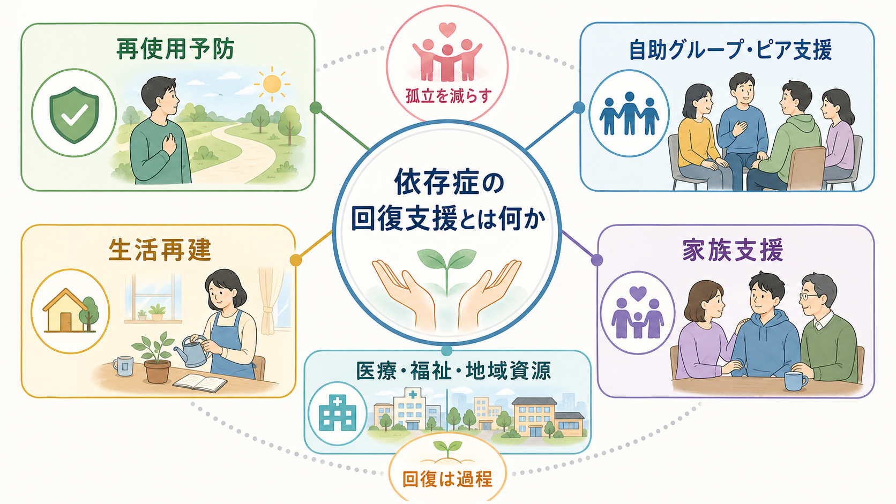
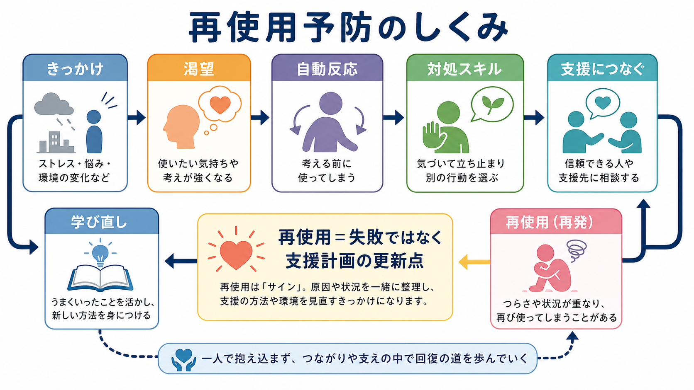
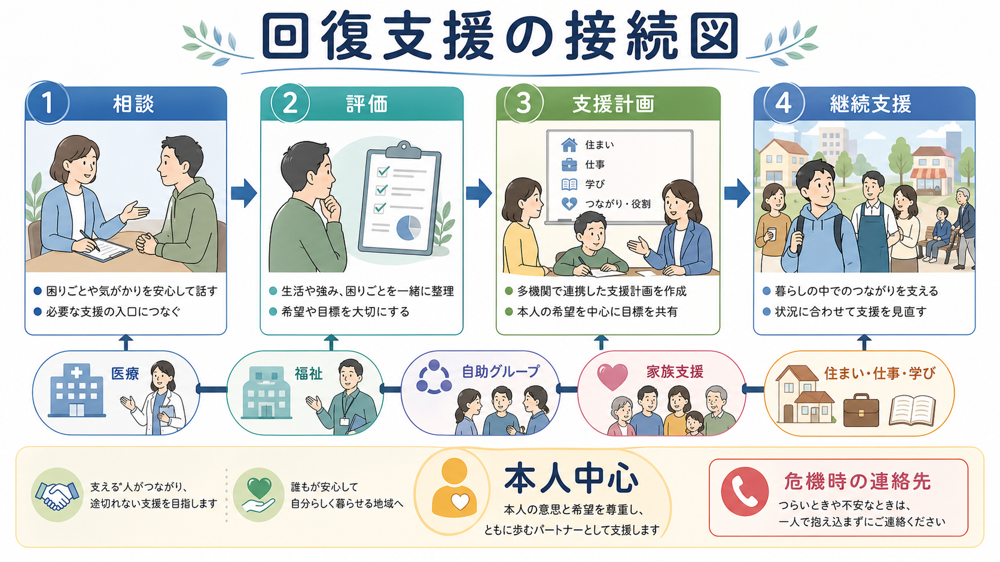

# 依存症の回復支援とは何か

## 要点

- 依存症の回復支援は、「使わないように説得する」だけではなく、健康、住まい、役割、つながり、危機時対応を本人中心に組み直す長期的な支援である[1][2]。
- 再使用は、支援の失敗や本人の弱さとだけ見るより、きっかけ、渇望、生活ストレス、治療アクセス、支援計画の不足を見直すサインとして扱う方が実践的である[3][4]。
- 自助グループやピア支援は、医療の代替ではなく、孤立を減らし、経験を言語化し、回復行動を日常に埋め込む補完的な資源である[5][6]。
- 家族支援では、本人を責めるための情報共有ではなく、家族自身の負担、メンタルヘルス、安全、境界線、相談先を扱う[4][7]。
- 医療・福祉・地域資源は、断酒・断薬だけでなく、住まい、仕事、学び、金銭、身体健康、併存症、スティグマへの対応を含めて連携する必要がある[2][3]。

## この記事で答える問い

1. 依存症の「回復支援」は、治療や断酒・断薬と何が違うのか。
2. 再使用予防、自助グループ、生活再建、家族支援は、どのように組み合わさるのか。
3. 支援者は、本人の自己決定と安全確保をどう両立させるのか。
4. 臨床・研究では、回復支援をどのようなアウトカムとして捉えればよいのか。

## まず結論

依存症の回復支援とは、[[物質使用障害とは何か|物質使用障害]]や行動嗜癖によって崩れた生活の選択肢を、本人・家族・支援者・地域資源が共同で回復していく支援である。中心にあるのは「物質や行動をやめるかどうか」だけではない。渇望が起きる場面を理解し、再使用時の対応を決め、孤立を減らし、住まい・仕事・学び・家族関係を立て直し、本人が自分の目標に近づける環境を作ることである。

SAMHSA は回復を、健康とウェルネスを改善し、自己決定的な生活を送り、可能性を目指す変化の過程として定義している[1]。この定義は、回復を「症状が消えた状態」ではなく、生活の方向づけと支援関係の再構築として見る点で重要である。WHO/UNODC の国際標準も、依存症治療を単発の解毒や急性期対応に縮めず、倫理的でエビデンスに基づく継続的ケア、心理社会的支援、社会復帰を含む体系として位置づける[2]。

## 背景

依存症は、報酬、習慣、ストレス、自己制御、社会環境が絡む慢性的な問題として理解される。関連する神経・学習機構は [[依存症は報酬学習の病態としてどう理解できるのか]] や [[依存症における渇望とは何か]] と接続できる。ただし、神経機構を理解しても、本人が明日どこで眠り、誰に相談し、何を食べ、どの仕事や学校に戻るのかは自動的には決まらない。

NIDA は、依存症治療は慢性疾患の管理に似ており、再使用は治療失敗を意味するのではなく、治療を再開・修正・変更する必要を示すサインになりうると説明している[3]。この考え方は、回復支援を「一度きりの成功」ではなく、支援計画の更新過程として設計する根拠になる。

日本の制度的文脈では、保健所、精神保健福祉センター、依存症相談拠点、医療機関、自助グループ、回復支援施設、家族会などが入口になる。厚生労働省は、本人や家族が一人で抱え込まず、相談機関や自助グループ・回復支援施設につながることを依存症からの回復に向けた重要な一歩として示している[7]。

## 基本概念

### 再使用予防

再使用予防は、単に「二度と使わない」と誓うことではない。きっかけ、渇望、自動反応、回避、孤立、睡眠不足、金銭トラブル、対人葛藤などを、本人が扱える大きさへ分解する作業である。[[再発予防計画とは何か|再発予防計画]]では、早期サイン、対処行動、相談先、危機時の連絡手順を具体化する。

Hendershot らの再発予防レビューは、再発予防モデルが、ハイリスク状況、対処スキル、認知的要因、生活習慣、マインドフルネスなどを含む認知行動的枠組みとして発展してきたことを整理している[8]。依存症支援では、渇望を「意志の弱さ」と見るのではなく、学習された手がかり反応として扱い、対応可能な行動へ翻訳することが要点になる。

### 自助グループ・ピア支援

自助グループは、同じ問題をもつ人が経験を分かち合い、孤立を減らし、回復のモデルを見つける場である。NICE は薬物使用の心理社会的介入において、本人へ自助グループの情報を提供し、本人が希望する場合は初回参加を支援することを推奨している[4]。この点は [[セルフヘルプグループとは何か]] や [[ピアサポートとは何か]] と直接つながる。

アルコール使用障害に関する Cochrane レビューでは、マニュアル化された AA/12ステップ促進介入が断酒を増やす点で既存治療より有効であるという質の高いエビデンスが示され、医療費削減の可能性も報告されている[5]。ただし、すべての人に同じグループが合うわけではない。支援者は参加を強制せず、本人の文化、価値観、安全、匿名性、過去の経験を確認する必要がある。

### 生活再建

生活再建とは、住まい、食事、睡眠、仕事、学業、金銭管理、余暇、身体健康、対人関係を、回復を支える形へ組み直すことである。SAMHSA の回復モデルでは、回復の主要次元として health, home, purpose, community が示される[6]。これは、[[リカバリー志向支援とは何か]] や [[精神科リハビリテーションとは何か]] の考え方と重なる。

依存症の支援で生活再建が重要なのは、使用や再使用が「気分」だけでなく、生活リズムの崩れ、孤立、暇な時間、住居不安、借金、失職、家族葛藤、痛み、不眠、併存するうつや不安と結びつきやすいからである。[[生活リズム支援とは何か]]、[[ケースマネジメントとは何か]]、[[就労支援とは何か]]、[[住居支援とは何か]] は、再使用予防の周辺支援ではなく、中心的な支援になりうる。

### 家族支援

家族支援は、家族を「監視役」にすることではない。NICE は、家族や介護者に対して、本人の薬物使用が家族に与える影響を確認し、家族自身の心理社会的・精神健康上のニーズを評価し、情報提供、支援グループ、必要に応じた家族面接を検討することを推奨している[4]。家族支援は [[家族心理教育とは何か]] と接続できるが、依存症では本人の同意、秘密保持、安全、暴力や虐待、金銭問題、子どもの保護を丁寧に分ける必要がある。

厚生労働省も、家族や周囲の人が正しい知識を持ち、本人を早めに治療や支援につなげること、家族会や家族の自助グループが家族同士の支え合いの場になることを示している[7]。家族は支援資源であると同時に、支援を必要とする当事者でもある。

## 仕組み

回復支援は、次の循環として理解しやすい。

| 段階 | 支援の焦点 | 具体例 |
|---|---|---|
| 相談 | 孤立を下げ、入口を作る | 保健所、精神保健福祉センター、依存症相談拠点、医療機関、自助グループ |
| 評価 | 使用だけでなく生活全体を見る | 物質・行動、身体、精神症状、住まい、家族、仕事、リスク |
| 支援計画 | 本人の目標と安全を両立する | 再使用予防、受診、薬物療法、心理社会的支援、危機時連絡 |
| 継続支援 | 回復行動を日常に埋め込む | 自助グループ、ピア支援、訪問支援、就労・住居・金銭支援 |
| 見直し | 再使用や危機を計画更新に使う | きっかけ分析、支援強度の調整、家族・地域資源の再接続 |

重要なのは、本人を「管理対象」にしないことである。[[動機づけ面接とは何か|動機づけ面接]]の視点では、変化への動機は固定した性格ではなく、関係性や選択肢の提示によって変動する。NIDA も、動機づけを高める介入や行動療法を、治療参加と再使用予防を支える要素として整理している[3]。

## 図解

図1は、依存症の回復支援を、再使用予防、自助グループ・ピア支援、生活再建、家族支援、医療・福祉・地域資源の関係として整理している。中心にあるのは「本人の目標」であり、どの支援も本人の生活を支配するためではなく、選択肢を増やすために使う。

図2は、再使用予防を「きっかけから渇望、自動反応、対処スキル、支援につなぐ、学び直し」への流れとして示している。再使用が起きた場合も、道徳的失敗として終わらせず、支援計画を更新する材料にする。

図3は、相談、評価、支援計画、継続支援を、医療、福祉、自助グループ、家族支援、住まい・仕事・学びへ接続する図である。実践では、この接続が切れたところで孤立、治療中断、再使用リスクが高まりやすい。

## 臨床・研究との接続

臨床では、回復支援のアウトカムを「使用量」だけにしないことが重要である。断酒・断薬、使用頻度、過量摂取、感染症リスク、救急受診、再入院、犯罪・事故だけでなく、住居の安定、就労・就学、家族負担、社会参加、QOL、本人の希望、治療継続、スティグマの軽減を合わせて見る必要がある[2][3]。

NIDA は、薬物療法、行動療法、カウンセリング、併存する医学的・精神的・社会的問題への対応を組み合わせ、本人全体のニーズに合わせることを治療原則としている[3]。NICE も、本人へ選択肢を説明し、家族関与は本人の秘密保持を尊重しながら検討し、サービス間移行で接触が切れないよう明確な計画を作ることを推奨している[4]。

研究では、再使用予防プログラム、12ステップ促進、自助グループ参加、動機づけ面接、家族支援、ケースマネジメント、住居・就労支援を、単独効果だけでなく組み合わせとして評価する必要がある。とくに日本では、医療機関、行政相談、回復支援施設、自助グループ、家族会が地域ごとに異なるため、アクセス可能性と継続性を含めた実装研究が重要になる。

## よくある誤解

### 誤解1: 再使用したら回復は失敗である

再使用は重大なリスクであり、過量摂取や事故の危険もある。しかし、それだけで本人や支援を全否定すると、相談しにくさと孤立が強まる。再使用は、きっかけ、支援強度、薬物療法、生活環境、危機時対応を見直すサインとして扱う[3]。

### 誤解2: 自助グループに行けば専門支援はいらない

自助グループは有用な資源になりうるが、医療評価、薬物療法、離脱管理、併存症治療、安全確保、福祉制度利用を代替するものではない。むしろ、専門支援と自助グループの接続を本人の希望に合わせて設計することが望ましい[4][5]。

### 誤解3: 家族が強く管理すれば回復する

家族の関与は重要だが、監視、叱責、秘密の暴露、金銭管理の一方的支配は関係を悪化させることがある。家族支援では、本人の同意と安全、家族自身の負担、境界線、危機時の相談先を分けて考える[4][7]。

### 誤解4: 回復支援は断酒・断薬後に始めればよい

回復支援は、相談の最初から始まる。住まい、食事、睡眠、身体健康、孤立、家族葛藤が未整理のままでは、治療継続も難しくなる。解毒や急性期対応は入口であり、その後の生活支援と接続して初めて回復の土台になる[2][3]。

## 関連ノート

- [[物質使用障害とは何か]]
- [[依存症は報酬学習の病態としてどう理解できるのか]]
- [[依存症における渇望とは何か]]
- [[再発予防計画とは何か]]
- [[セルフヘルプグループとは何か]]
- [[ピアサポートとは何か]]
- [[リカバリー志向支援とは何か]]
- [[家族心理教育とは何か]]
- [[ケースマネジメントとは何か]]
- [[動機づけ面接とは何か]]

## 関連ノート候補

- 依存症の家族支援とは何か
- ハームリダクションとは何か
- 12ステップ促進とは何か
- CRAFTとは何か
- 依存症回復支援施設とは何か
- 薬物依存症のSMARPPとは何か

## MOC更新候補

- `content/00_MOC/` 配下の臨床実践・治療、精神医学、疾患・症候群、地域精神医療、依存症関連 MOC へ追加候補。
- 並列ジョブとの競合を避けるため、本タスクでは MOC ファイルを直接更新しない。

## 理解チェック

1. 依存症の回復支援を、断酒・断薬だけで定義すると何を見落とすか。
2. 再使用を「支援計画の更新点」として扱うと、本人・家族・支援者の行動はどう変わるか。
3. 自助グループと専門治療は、どの点で役割が異なるか。
4. 家族支援で、本人の秘密保持と家族の安全をどう両立できるか。
5. 回復支援の成果を研究で測るなら、使用量以外にどのアウトカムを含めるべきか。

## 未解決問題

- どの人に、どの時期に、どの種類の自助グループやピア支援が合いやすいのかを予測する研究はまだ十分ではない。
- 再使用予防、薬物療法、家族支援、住居・就労支援を、地域資源の乏しい環境でどう統合するかは実装上の課題である。
- 日本の依存症支援では、医療、行政、自助グループ、回復支援施設、家族会をまたぐ継続的アウトカム評価がさらに必要である。

## 参考文献

[1] Substance Abuse and Mental Health Services Administration. *Recovery and Recovery Support*. Last updated 2025-11-26. https://www.samhsa.gov/recovery

[2] World Health Organization & United Nations Office on Drugs and Crime. (2020). *International Standards for the Treatment of Drug Use Disorders: Revised edition incorporating results of field-testing*. https://www.who.int/publications/i/item/international-standards-for-the-treatment-of-drug-use-disorders

[3] National Institute on Drug Abuse. *Treatment and Recovery*. https://nida.nih.gov/publications/drugs-brains-behavior-science-addiction/treatment-recovery

[4] National Institute for Health and Care Excellence. (2007). *Drug misuse in over 16s: psychosocial interventions* (CG51), recommendations. https://www.nice.org.uk/guidance/cg51/chapter/1-guidance

[5] Kelly, J. F., Humphreys, K., & Ferri, M. (2020). Alcoholics Anonymous and other 12-step programs for alcohol use disorder. *Cochrane Database of Systematic Reviews*, 2020(3), CD012880. https://doi.org/10.1002/14651858.CD012880.pub2

[6] Substance Abuse and Mental Health Services Administration. *Office of Recovery*. Last updated 2025-07-22. https://www.samhsa.gov/about/offices-centers/or

[7] 厚生労働省. 依存症対策. https://www.mhlw.go.jp/stf/seisakunitsuite/bunya/0000070789.html

[8] Hendershot, C. S., Witkiewitz, K., George, W. H., & Marlatt, G. A. (2011). Relapse prevention for addictive behaviors. *Substance Abuse Treatment, Prevention, and Policy*, 6, 17. https://doi.org/10.1186/1747-597X-6-17
