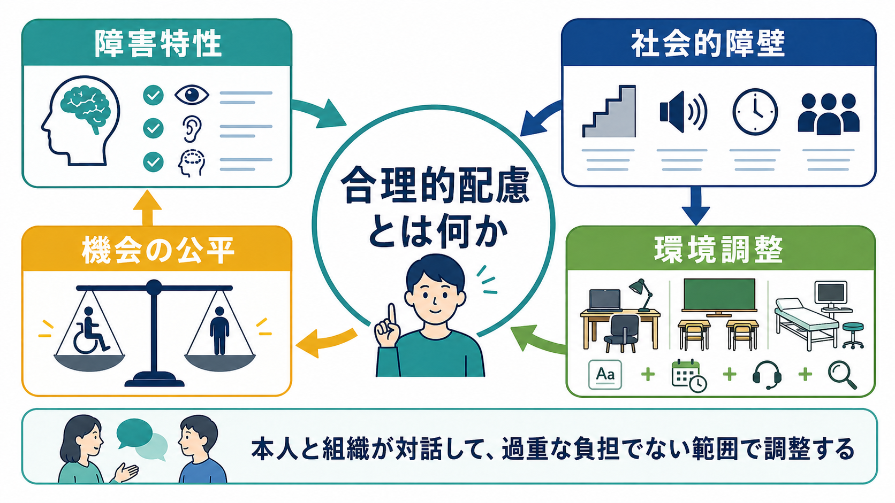
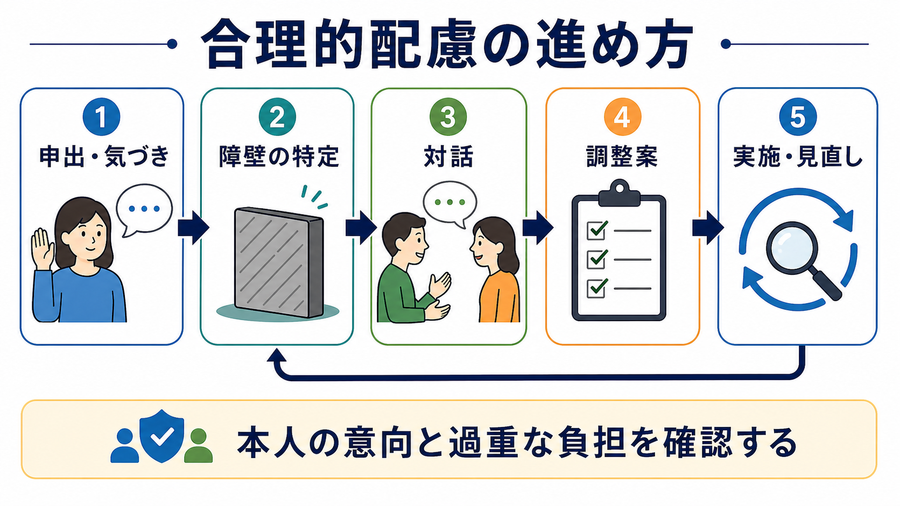
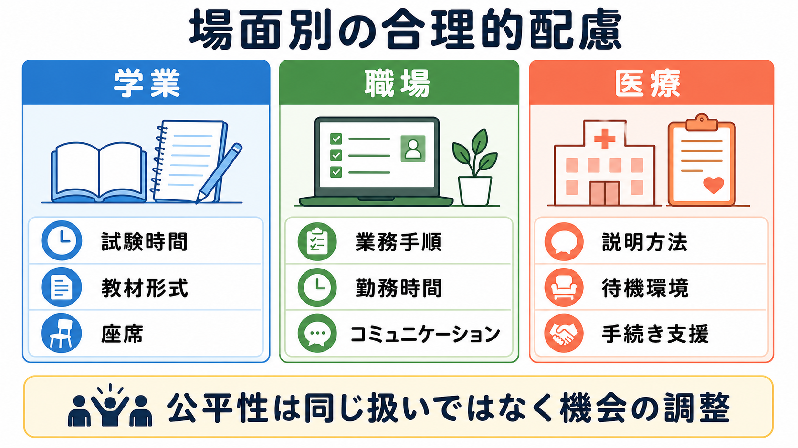

# 合理的配慮とは何か

## 要点

- 合理的配慮とは、障害のある人が他者と同じように学ぶ、働く、医療を受ける、社会参加するために、個別の場面で必要かつ適切な変更・調整を行う考え方である[1]。
- 日本では、障害者差別解消法により行政機関等だけでなく事業者にも合理的配慮の提供が義務化されている。事業者義務化は2024年4月1日に施行された[2]。
- 配慮は「特別扱い」ではなく、社会的障壁によって失われている機会へのアクセスを調整する実践である[1][3]。
- 実務では、本人の意向、障壁の内容、目的の本質、代替案、過重な負担の有無を、建設的対話で確認する[3]。
- 学業、職場、医療では制度の根拠や責任主体が異なるが、共通する中心は「本人を変える」のではなく「環境・情報・手続き・方法を調整する」ことである[4][5][6]。

## この記事で答える問い

1. 合理的配慮は何を意味し、何を意味しないのか。
2. 配慮を決めるとき、どのような手順で話し合うのか。
3. 学業・職場・医療の場面では、どのような違いがあるのか。
4. 精神医療、発達障害支援、リハビリテーションの実践とどう接続するのか。

## まず結論

合理的配慮は、障害名にひもづいた固定メニューではない。ある人の障害特性と、学校・職場・医療機関などの環境やルールがぶつかることで、参加の障壁が生じる。その障壁を、本人と組織が対話しながら、過重な負担でない範囲で調整するのが合理的配慮である[1][3]。

したがって、合理的配慮の問いは「この人には何をしてあげるべきか」ではなく、「この場面で何が障壁になっており、目的の本質を変えずに、どの方法なら参加の機会を回復できるか」である。これは[[精神科リハビリテーションとは何か]]、[[学業支援は精神医療でどう行うか]]、[[就労支援とは何か]]と重なる実践課題である。

## 背景

障害者権利条約は、合理的配慮を「特定の場合に必要とされる、均衡を失した又は過度の負担を課さない、必要かつ適当な変更及び調整」と位置づけている[1]。この定義は、障害を個人内の欠損だけでなく、環境との相互作用で生じる制約として捉える考え方と整合する。WHOのICFも、心身機能、活動、参加、環境因子、個人因子の相互作用として障害を整理している[7]。

日本の障害者差別解消法は、障害を理由とする不当な差別的取扱いを禁止し、社会的障壁の除去に必要な合理的配慮の提供を求める。2024年4月1日からは、民間事業者にも合理的配慮の提供が法的義務となった[2]。医療機関、学校、企業、福祉サービス、店舗、公共交通など、日常的な場面で実装が求められる概念になっている。

## 基本概念

### 社会的障壁

社会的障壁とは、障害のある人の活動や参加を制限する、社会の側にある事物、制度、慣行、観念などを指す[2][3]。たとえば、音声だけの説明、複雑な申請手続き、静かな待機場所の不足、暗黙の職場ルール、時間厳守だけを前提にした試験運用などが障壁になりうる。

ここで重要なのは、障壁は本人の特性だけから決まらないという点である。同じADHD特性でも、短時間で頻繁な切り替えが必要な職場では困難が強く出る一方、視覚的な手順書やタスク管理が整った環境では力を発揮しやすい。これは[[ADHDとは何か]]や[[認知リハビリテーションとは何か]]の視点とも接続する。

### 合理性

合理性とは、配慮を求める人の希望を無条件に採用することではない。目的の本質を保てるか、代替案があるか、組織側に過重な負担が生じないか、他者の安全や権利を不当に損なわないかを含めて判断する[3]。

たとえば、試験で「評価対象が知識理解」であれば、時間延長や別室受験は合理的配慮になりうる。一方で、実技資格の安全確認そのものを免除することは、評価の本質を変える可能性がある。合理的配慮は、基準をなくすことではなく、基準にアクセスする経路を調整することである。

### 建設的対話

建設的対話とは、本人と提供側が、障壁、必要な調整、実施可能性、代替案をすり合わせるプロセスである[3]。本人の申し出が出発点になることが多いが、本人が言語化できない場合、支援者や家族、医療者、学校・職場の担当者が、本人の意思を尊重しながら補助することもある。

ただし、医療者が「この配慮を必ず実施すべき」と命令する立場に立つわけではない。診断書や意見書は、機能上の困難、必要な調整、リスク、見直し時期を説明する資料であり、最終的な実施方法は本人と場の責任主体が対話で決める。

## 仕組み

合理的配慮は、次のような循環として捉えると実践しやすい。

1. 申出・気づき  
本人、家族、支援者、教職員、上司、医療スタッフなどが、参加上の困難に気づく。

2. 障壁の特定  
困っている原因を「本人の努力不足」と決めつけず、環境、情報、時間、感覚刺激、対人ルール、手続き、評価方法に分けて見る。

3. 対話  
本人の意向、避けたいこと、試せそうな方法、守るべき安全や公平性を確認する。

4. 調整案  
複数案を出し、目的の本質、過重な負担、プライバシー、他者への影響を検討する。

5. 実施・見直し  
一度決めた配慮を固定せず、効果、負担、副作用、環境変化に応じて更新する。

この循環は[[ケースマネジメントとは何か]]や[[ケアマネジメントとケースマネジメントは何が違うのか]]に近い。個別支援では、単発の「許可」よりも、継続的な調整と記録が重要になる。

## 図解

学業、職場、医療では、配慮の根拠となる制度や担当者は異なる。しかし、時間、情報、環境、方法を調整するという骨格は共通している。

| 場面 | 典型的な障壁 | 配慮の例 | 注意点 |
|---|---|---|---|
| 学業 | 試験時間、教材形式、板書、感覚刺激、出席要件 | 試験時間延長、別室受験、資料の電子化、座席調整、課題提出方法の調整 | 評価基準の本質を変えない形で、学修機会へのアクセスを調整する[4] |
| 職場 | 業務手順、勤務時間、コミュニケーション、通院、疲労、感覚過敏 | 業務の見える化、休憩調整、時差出勤、静かな作業場所、指示方法の統一 | 職務遂行上の本質的機能と安全配慮を確認する[5] |
| 医療 | 説明の理解、待機環境、手続き、感覚刺激、意思表示、付き添い | やさしい説明、筆談、予約時間調整、静かな待機場所、付き添い支援 | 診療の安全、同意、プライバシー、緊急性とのバランスを見る[6] |

## 臨床・研究との接続

精神医療では、合理的配慮は治療そのものではないが、治療と生活をつなぐ重要な環境調整である。うつ病、双極症、統合失調症、発達障害、不安症、身体疾患を併存する人では、症状の軽減だけでなく、学ぶ、働く、通院する、家族と暮らす、地域で役割を持つための条件づくりが必要になる。

ICFの枠組みでは、合理的配慮は環境因子を変えることで活動と参加を支える介入として理解できる[7]。そのため、症状尺度だけでなく、出席、就労継続、通院継続、生活リズム、対人関係、本人の自己効力感などを合わせて見る必要がある。

職場研究では、障害者雇用や職場参加を妨げる要因として、雇用主側の懸念、職務設計、開示への不安、同僚理解、支援資源の不足などが指摘されている[8]。合理的配慮を個人の申出だけに任せると、申し出る力が弱い人ほど取り残される。組織側の標準的な相談窓口、記録、見直し、管理職教育が実装上の鍵になる。

臨床実践では、[[リカバリー志向支援とは何か]]、[[作業療法は精神科で何をするのか]]、[[リワークプログラムとは何か]]、[[訪問看護は精神科で何を支えるのか]]と接続して考えるとよい。合理的配慮は「治すまで待つ」発想ではなく、「困難が残っていても参加できる条件を整える」発想である。

## よくある誤解

### 誤解1: 診断名があれば配慮内容は自動的に決まる

診断名は配慮検討の入口にはなるが、配慮内容を自動決定しない。同じ診断でも、困難が出る場面、本人の希望、環境、業務や授業の本質は異なる。必要なのは診断名の提示だけでなく、機能上の困難と調整案の具体化である[3]。

### 誤解2: 合理的配慮は甘やかしである

合理的配慮は、成果基準を下げることではない。本人が能力を発揮するために、障壁となっている方法や環境を調整することである[1][3]。たとえば、情報を口頭だけで伝える慣行を、書面やチェックリストに変えることは、本人だけでなく組織全体のミス予防にもつながる。

### 誤解3: 申し出られた配慮はすべて実施しなければならない

合理的配慮には、過重な負担でない範囲という条件がある[1][3]。ただし、最初の希望が難しい場合でも、そこで打ち切るのではなく、目的を確認して代替案を検討することが求められる。

### 誤解4: 医療者が配慮を決定する

医療者は、症状や機能上の困難、リスク、必要な環境調整を説明できる。しかし、学校や職場での具体的な実施は、その場の制度、資源、安全配慮、本人の同意に基づく対話で決まる。医療者の役割は、本人の生活参加を支える翻訳者・協働者に近い。

## 関連ノート

- [[学業支援は精神医療でどう行うか]]
- [[就労支援とは何か]]
- [[精神科リハビリテーションとは何か]]
- [[リカバリー志向支援とは何か]]
- [[ケースマネジメントとは何か]]
- [[ケアマネジメントとケースマネジメントは何が違うのか]]
- [[作業療法は精神科で何をするのか]]
- [[リワークプログラムとは何か]]
- [[訪問看護は精神科で何を支えるのか]]
- [[認知リハビリテーションとは何か]]

### MOC更新候補

- `content/00_MOC/` 配下の臨床実践、リハビリ・生活支援、教育支援、就労支援、障害支援に関するMOCへ追加候補。
- 並列記事生成との衝突を避けるため、この作業ではMOCファイル本体は更新しない。

## 理解チェック

1. 合理的配慮が「同じ扱い」ではなく「機会へのアクセス調整」である理由を説明できるか。
2. ある配慮案が難しいとき、拒否で終わらせず代替案を探すために確認すべき項目を挙げられるか。
3. 学業、職場、医療で共通する調整対象を、時間・情報・環境・方法の観点から整理できるか。
4. 医療者が診断書や意見書を書くとき、診断名以外に何を具体化すべきか説明できるか。

## 未解決問題

- 合理的配慮の効果を、成績、就労継続、症状、生活の質、本人の納得感のどの指標で評価するのが妥当か。
- 本人が配慮を申し出にくい場合、組織がどこまで能動的に気づき、声をかけるべきか。
- 小規模事業者や地域医療機関で、過重な負担と代替案をどう透明に判断するか。
- 診断名を過度に開示せず、必要な機能情報だけで配慮を設計する実務をどう標準化するか。

## 参考文献

[1] United Nations. (2006). *Convention on the Rights of Persons with Disabilities*, Article 2. https://www.ohchr.org/en/instruments-mechanisms/instruments/convention-rights-persons-disabilities

[2] 内閣府. (2024). 障害を理由とする差別の解消の推進：合理的配慮の提供等事例集・リーフレット等. https://www8.cao.go.jp/shougai/suishin/sabekai.html

[3] 内閣府. (2023). 障害を理由とする差別の解消の推進に関する基本方針. https://www8.cao.go.jp/shougai/suishin/sabekai/kihonhoushin/r05/pdf/honbun.pdf

[4] 文部科学省. (2017). 障害のある学生の修学支援に関する検討会報告（第二次まとめ）. https://www.mext.go.jp/b_menu/shingi/chousa/koutou/074/gaiyou/1384405.htm

[5] 厚生労働省. (2015/2026参照). 雇用の分野における障害者への差別禁止・合理的配慮. https://www.mhlw.go.jp/stf/seisakunitsuite/bunya/koyou_roudou/koyou/shougaishakoyou/shougaisha_h25/index.html

[6] 厚生労働省. (2024). 障害者差別解消法医療関係事業者向けガイドラインの改正について. https://www.mhlw.go.jp/stf/newpage_39383.html

[7] World Health Organization. (2001). *International Classification of Functioning, Disability and Health (ICF).* https://www.who.int/standards/classifications/international-classification-of-functioning-disability-and-health

[8] Bonaccio, S., Connelly, C. E., Gellatly, I. R., Jetha, A., & Martin Ginis, K. A. (2020). The participation of people with disabilities in the workplace across the employment cycle: Employer concerns and research evidence. *Journal of Business and Psychology, 35*, 135-158. https://doi.org/10.1007/s10869-018-9602-5
