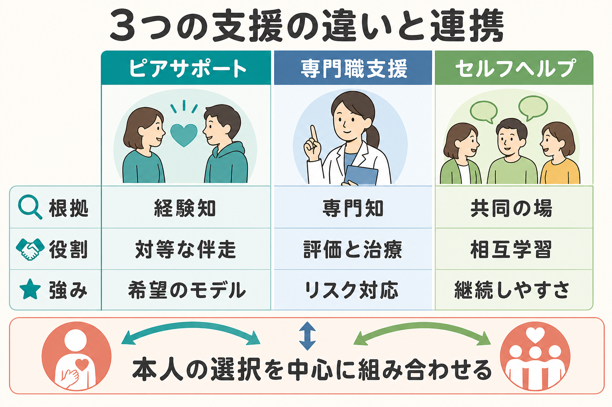
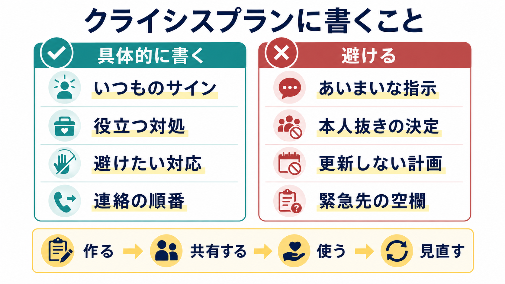

# 学業支援は精神医療でどう行うか

## 要点

- 学業支援は「登校させる技術」ではなく、子ども・若者が学ぶ権利、健康、発達、社会的自立を同時に守るための生活支援である。
- 精神医療の役割は、診断書を書くことだけではない。症状、発達特性、睡眠、家庭状況、いじめ、学習のつまずき、学校環境を機能面から評価し、学校・家庭・福祉と共有できる支援仮説に翻訳することである。
- 合理的配慮は特別扱いではなく、障害や症状と環境の相互作用で生じる障壁を、過度な負担のない範囲で調整する考え方である[1]。
- 不登校支援では、登校日数だけを目標にせず、本人の主体性、休養の意味、学習機会、将来の社会的自立を一緒に扱う[2]。

## この記事で答える問い

1. 精神医療は学校生活のどこを評価すればよいか。
2. 合理的配慮を、臨床情報からどのように提案するか。
3. 不登校や登校しぶりに対して、医療は何をして、何を学校に委ねるべきか。
4. [[ADHDとは何か]]、[[自閉スペクトラム症とは何か]]、[[限局性学習症とは何か]]などの発達特性を、学業支援にどう接続するか。

## まず結論

学業支援は、診断名から配慮メニューを自動的に決めるのではなく、「どの場面で、どの要求が、どの症状・特性・環境とぶつかり、どんな失敗循環が起きているか」を分解するところから始める。たとえば同じ欠席でも、不安による回避、睡眠相の後退、感覚過敏、いじめ、学習の遅れ、家庭内葛藤、抑うつ、注意制御の困難では、支援の焦点が異なる。

医療者は、治療と教育を混同しない。医療は診断、併存症評価、リスク評価、薬物療法・心理療法・睡眠支援、本人と家族の意思決定支援を担う。一方で、座席、課題量、試験方法、出席扱い、別室利用、ICT、教育支援センター、フリースクール等の具体的運用は、学校・教育委員会・家庭との協働で決める[2][3]。

## 背景

学校は、子ども・若者にとって学習の場であるだけでなく、生活リズム、友人関係、評価、所属感、将来の選択肢が集まる環境である。そのため精神症状は学校生活に強く表れ、逆に学校環境の負荷も症状を増悪させうる。[[ストレス脆弱性モデルとは何か]]の観点では、本人の脆弱性だけでなく、要求水準、予測可能性、支援資源、対人安全性を同時に見る必要がある。

文部科学省は、不登校支援について「学校に登校する」という結果のみを目標にしないこと、本人が進路を主体的に捉え社会的に自立すること、要因の把握と関係機関の情報共有、教育支援センター・不登校特例校・ICT・フリースクール等の多様な教育機会を示している[2]。精神医療での学業支援も、この考え方と整合する必要がある。

## 基本概念

### 学業支援

ここでいう学業支援は、成績向上だけを意味しない。学校に関わる困難を、健康、学習、対人関係、生活リズム、進路、家族負担の観点から扱う支援である。外来で「学校に行けていますか」と聞くだけでは不十分で、次のように具体化する。

| 評価領域 | 聞くこと | 支援の例 |
|---|---|---|
| 出席 | 遅刻、早退、保健室、別室、オンライン、完全欠席 | 段階的登校、別室利用、出席扱いの相談 |
| 学習 | 読む、書く、計算、提出、試験、板書 | 課題分割、ICT、試験時間、評価方法の調整 |
| 注意・実行機能 | 忘れ物、開始困難、切替困難、計画困難 | チェックリスト、座席、短い指示、提出導線 |
| 感覚・対人 | 音、光、匂い、集団、休み時間、給食 | 休憩場所、イヤーマフ、予告、避難先 |
| 情緒 | 不安、抑うつ、過覚醒、身体症状 | 心理教育、CBT、睡眠支援、危機対応 |

### 合理的配慮

合理的配慮は、障害のある子どもが他の子どもと平等に教育を受ける権利を行使するため、学校の設置者や学校が必要かつ適当な変更・調整を行うことであり、均衡を失した又は過度の負担を課さないものと整理されている[1]。精神医療では、診断名だけでなく「社会的障壁」を言語化することが重要である。

たとえば、[[ADHDとは何か]]がある生徒に「集中できないので配慮してください」とだけ書くよりも、「45分授業の後半で注意の持続が落ち、板書と聴覚指示の同時処理で課題の取りこぼしが増える。前方座席、短い書面指示、提出物の分割、授業後の確認が有用」と書く方が学校で使いやすい。

### 不登校・登校しぶり

不登校や学校拒否は単一の診断ではない。近年のレビューでは、学校拒否行動は不安、抑うつ、身体症状、神経発達症、いじめ、自己概念の低下、家族要因など多様な臨床像と結びつくと整理されている[4]。そのため、支援は「原因探しで一つに決める」よりも、維持要因を複数に分けて、変えられるところから手をつける。

## 仕組み

### 1. 学校場面を機能評価する

医療面接では、症状名より先に学校場面の要求を分解する。

- 朝: 起床、腹痛、頭痛、吐き気、登校前のパニック、家族との衝突
- 授業: 聴覚指示、板書、読む量、書く量、発表、グループ活動
- 休み時間: 雑音、孤立、からかい、予測不能な接触
- 評価: テスト時間、提出期限、内申、欠席扱い、進級・卒業
- 帰宅後: 疲労、宿題、睡眠、ゲーム・スマホ、家庭内葛藤

この評価は[[ケースフォーミュレーションとは何か]]に近い。診断、症状、環境、強み、維持要因をまとめ、「本人の努力不足」でも「学校だけの問題」でもない形に変換する。

### 2. 治療目標と教育目標を分ける

治療目標は、不安、抑うつ、睡眠、衝動性、強迫、トラウマ反応、身体症状などの軽減である。教育目標は、学習機会、所属、進路、評価、卒業、社会参加である。両者は関連するが同一ではない。

たとえば[[うつ病とは何か]]が背景にある場合、短期的には休養と安全確保が優先される。しかし回復期には、完全復調を待って一気に復帰するより、短時間・低負荷・予測可能な参加から始める方が現実的なことがある。学校拒否への心理社会的介入レビューでも、行動的・認知行動的方略は出席や症状の改善に有望であり、本人だけでなく保護者・教師への関与が重要とされる[5]。

### 3. 配慮は「低要求」ではなく「適切な要求」にする

合理的配慮は、要求をすべて下げることではない。本人の機能に合わない障壁を調整し、学習へのアクセスを回復することである。

| 困難 | 避けたい対応 | 支援として考える対応 |
|---|---|---|
| 注意が続かない | 叱責、長時間の一斉指示 | 指示の短文化、視覚化、課題分割 |
| 不安が強い | いきなり通常登校 | 見通し提示、別室、段階的参加 |
| 感覚過敏 | 我慢の訓練だけにする | 環境調整、休憩場所、刺激量の調整 |
| 学習障害 | 努力不足とみなす | 読み書き支援、ICT、評価方法の調整 |
| 睡眠相の後退 | 怠けと決めつける | 睡眠評価、朝の負荷調整、段階的生活再建 |

### 4. 発達特性を支援設計に変換する

[[自閉スペクトラム症とは何か]]では、予測不能性、感覚刺激、曖昧な対人ルール、予定変更が負荷になりやすい。NICE は、自閉スペクトラム症の子ども・若者への支援で、教育・医療・福祉を含む多職種連携、感覚過敏を含む環境調整、学校変更などの移行期への支援を重視している[6]。

[[ADHDとは何か]]では、注意、衝動性、実行機能、時間管理、忘れ物、提出物が問題になりやすい。AAP の ADHD 診療ガイドラインは、薬物療法だけでなく、行動的な学校介入、家族と学校を含む支援、個別化された教育的支援を治療計画の必要部分として位置づけている[7]。CDC も、ADHD の学校支援として、試験時間、課題調整、肯定的フィードバック、技術利用、休憩、刺激を減らす環境調整、整理支援などを例示している[8]。

[[限局性学習症とは何か]]では、知的能力全体ではなく、読み、書字、算数など特定の学習経路に障壁がある。精神医療は教育評価を代替しないが、二次的な不安、抑うつ、自己評価低下、登校困難を評価し、学校での専門的評価につなぐ役割を持つ。

## 図解

## 臨床・研究との接続

### 外来で使う最小セット

学業支援の初回評価では、少なくとも次を確認する。

1. 欠席・遅刻・早退・保健室利用・別室利用の実態
2. 本人が「何がつらい」と説明しているか
3. 保護者と学校で見えている困難の違い
4. いじめ、虐待、自傷、自殺念慮、摂食、物質使用などのリスク
5. 睡眠、身体症状、薬剤副作用、発達歴
6. 読み書き計算、注意、感覚、対人、集団活動の具体的障壁
7. 学校側の既存支援、担任・養護教諭・スクールカウンセラー・スクールソーシャルワーカーとの接点

リスクが高い場合は、学業支援より安全確保を優先する。[[自殺リスク評価では何を聞くべきか]]、[[虐待リスクを精神科でどう評価するか]]、[[いじめは精神健康にどう影響するのか]]と接続して考える。

### 診断書・意見書を書くとき

診断書や意見書は、学校に命令する文書ではなく、支援判断に使える医療情報を提供する文書である。書くなら、次の構造が使いやすい。

- 現在の診断または臨床的評価
- 学校生活で生じている機能上の困難
- 症状悪化を避けるために必要な配慮
- 本人の希望と同意の範囲
- 見直し時期
- 医療機関が担う治療・フォロー

「登校不可」「通常登校可」と二分するより、「午前のみ」「週2回から」「別室で課題」「オンライン併用」「試験は別室・延長」「体育や発表は段階的」など、試行可能な選択肢に落とす方が支援につながりやすい。

### 連携会議での立ち位置

学業支援は[[ケースマネジメントとは何か]]、[[ケア会議とは何か]]、[[訪問看護は精神科で何を支えるのか]]とも重なる。医療者は、学校を批判する代理人にも、学校側の説得役にもなりすぎない。本人の健康と発達を中心に、情報共有の範囲、守秘、本人の同意、保護者の負担、学校の実行可能性を調整する。

### 研究上の注意

学校拒否行動への介入研究は、対象、定義、アウトカムが不均一である。出席率は重要だが、それだけでは健康、学習、自己効力感、家族負担、進路、社会参加を十分に表せない。臨床では、出席、症状、生活リズム、本人の納得、学習到達、家族負担を複数アウトカムとして追う方がよい。

## よくある誤解

### 誤解1: 診断があれば自動的に配慮が決まる

診断は支援の入口になるが、配慮は機能評価で決める。同じ ADHD でも、座席調整が効く子、課題分割が効く子、薬物療法の調整が中心の子、睡眠支援が先の子がいる。

### 誤解2: 不登校支援は登校刺激を強めることだ

登校を目標にする場合でも、本人にとって学校が安全で予測可能な環境になることが前提である。文科省通知は、登校という結果のみを目標にせず、社会的自立、多様な教育機会、本人の希望を尊重した支援を示している[2]。

### 誤解3: 配慮は甘やかしである

合理的配慮は、学習の本質を免除することではなく、学習へアクセスするための障壁を調整することである[1]。眼鏡が視力の弱さを補うように、指示の視覚化、別室、ICT、試験時間延長は、評価したい能力と無関係な障壁を減らす場合がある。

### 誤解4: 医療が学校の対応を決められる

医療は学校運営を決定できない。できるのは、症状と機能障害、リスク、治療計画、推奨される環境調整を説明し、本人・保護者・学校が合意形成しやすい材料を出すことである。

## 関連ノート

- [[ADHDとは何か]]
- [[自閉スペクトラム症とは何か]]
- [[限局性学習症とは何か]]
- [[ひきこもりとは何か]]
- [[精神科リハビリテーションとは何か]]
- [[ケースマネジメントとは何か]]
- [[ケア会議とは何か]]
- [[訪問看護は精神科で何を支えるのか]]
- [[いじめは精神健康にどう影響するのか]]
- [[青年期のひきこもりはどう理解するのか]]

## MOC更新候補

- `content/00_MOC/` 配下の臨床実践、児童青年精神医学、発達障害、生活支援系 MOC に追加候補。
- 並列実行時の競合を避けるため、本記事では MOC 本体は更新していない。

## 理解チェック

1. 「診断名」ではなく「学校生活の機能障害」として書くと、配慮提案はどう変わるか。
2. 不登校支援で、登校日数以外に追跡すべきアウトカムは何か。
3. ADHD、ASD、限局性学習症で、同じ「宿題が出せない」という訴えの背景はどう異なりうるか。
4. 医療者が学校へ伝えてよい情報と、本人の同意が必要な情報をどう分けるか。

## 未解決問題

- 日本の学校制度の中で、医療意見書がどの程度配慮実装に影響するかについては、地域差・学校差が大きい。
- 不登校支援では、出席率、心理症状、学習到達、本人の生活満足、家族負担を統合した評価指標が十分に標準化されていない。
- 発達特性への配慮と、進学・卒業・資格取得の評価公平性をどう両立するかは、個別事例ごとの合意形成が必要である。

## 参考文献

[1] 文部科学省. 3．障害のある子どもが十分に教育を受けられるための合理的配慮及びその基礎となる環境整備. https://www.mext.go.jp/b_menu/shingi/chukyo/chukyo3/siryo/attach/1325887.htm

[2] 文部科学省. 「不登校児童生徒への支援の在り方について（通知）」令和元年10月25日. https://www.mext.go.jp/a_menu/shotou/seitoshidou/1422155.htm

[3] 文部科学省. 4.障害に配慮した教育: 障害のある子供の教育支援の手引. https://www.mext.go.jp/a_menu/shotou/tokubetu/mext_00800.html

[4] Conti, F., et al. (2024). School refusal behavior in children and adolescents: a five-year narrative review of clinical significance and psychopathological profiles. *Italian Journal of Pediatrics*, 50, 61. https://pmc.ncbi.nlm.nih.gov/articles/PMC11141005/

[5] Maynard, B. R., et al. (2010). Psychosocial interventions for school refusal behavior in children and adolescents. *Research on Social Work Practice*, 20(2), 177-190. https://pmc.ncbi.nlm.nih.gov/articles/PMC2747113/

[6] National Institute for Health and Care Excellence. (2013, updated 2021). *Autism spectrum disorder in under 19s: support and management* (NICE guideline CG170). https://www.nice.org.uk/guidance/cg170/chapter/recommendations

[7] Wolraich, M. L., et al. (2019). Clinical practice guideline for the diagnosis, evaluation, and treatment of attention-deficit/hyperactivity disorder in children and adolescents. *Pediatrics*, 144(4), e20192528. https://doi.org/10.1542/peds.2019-2528

[8] Centers for Disease Control and Prevention. (2024). ADHD in the classroom: Helping children succeed in school. https://www.cdc.gov/adhd/treatment/classroom.html
