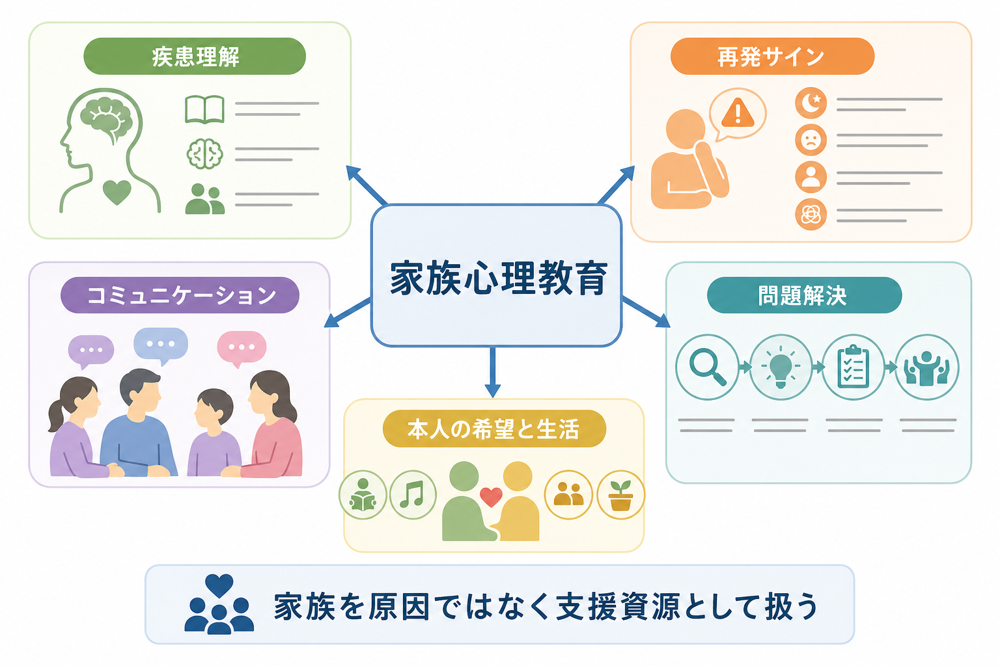
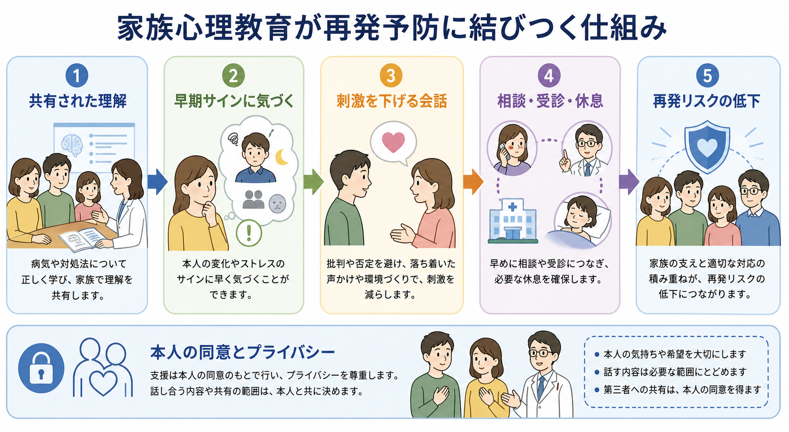
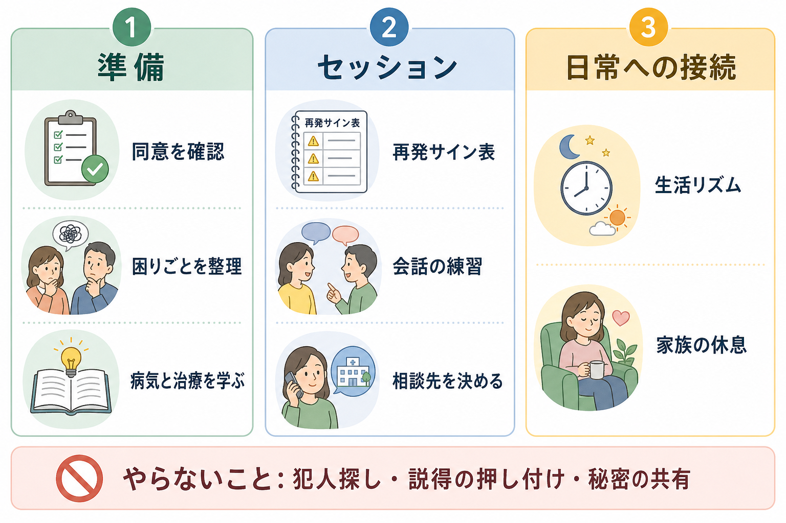

# 家族心理教育とは何か

## 要点

- 家族心理教育は、本人と家族・近しい支援者が、疾患理解、治療、再発サイン、日常の対応、コミュニケーション、問題解決を一緒に学ぶ構造化された心理社会的介入である[1][2]。
- 統合失調症や精神病性障害では、家族介入が再発や入院を減らす可能性が示されており、NICE は精神病・統合失調症のある人と同居または密接に関わる家族に家族介入を提供することを推奨している[1][3]。
- 目的は「家族に病気の責任を負わせること」ではない。本人の同意とプライバシーを前提に、家族を支援資源として位置づけ、家族自身の負担も減らすことが重要である[2][4]。
- 家族心理教育は、[[心理教育とは何か|心理教育]]、[[生活技能訓練SSTとは何か|SST]]、[[薬物療法のアドヒアランスをどう支えるか|服薬支援]]、[[リカバリー志向支援とは何か|リカバリー志向支援]]と組み合わせて考えると理解しやすい。

## この記事で答える問い

1. 家族心理教育は、通常の家族への説明と何が違うのか。
2. 疾患理解、再発サイン、コミュニケーション改善は、なぜ再発予防や生活支援につながるのか。
3. 家族を治療に含めるとき、同意、プライバシー、家族負担をどう扱うべきか。
4. 臨床実践では、どのような限界や誤解に注意する必要があるのか。

## まず結論

家族心理教育とは、精神疾患をめぐる情報を家族に一方的に教える場ではなく、本人・家族・支援者が共通の理解と言葉を持つための介入である。扱う内容は、診断名の説明だけではない。症状の波、治療の意味、薬の役割と副作用、睡眠やストレス、再発の早期サイン、危機時の連絡先、声かけの工夫、家族自身の休息まで含まれる[1][2]。

特に[[統合失調症とは何か|統合失調症]]や精神病性障害では、家族と密接に暮らす人が多く、日常の小さな変化は診察室より家庭で先に見えることがある。家族が「何が起きているのか」「どのサインで相談するのか」「どの関わりが本人の負担を下げるのか」を共有していれば、早期相談、服薬・生活リズムの支援、刺激の少ない対応につながりやすい[3][5]。

ただし、家族心理教育は万能薬ではない。家族関係が安全でない場合、本人が家族の関与を望まない場合、家庭内暴力や強い支配関係がある場合には、家族を巻き込むこと自体が害になりうる。したがって、本人の同意、情報共有の範囲、家族の支援可能性を確認しながら、[[共同意思決定とは何か|共同意思決定]]の一部として導入する必要がある[1][6]。

## 背景

精神科治療は、薬物療法や個人面接だけで完結しない。症状が軽くなっても、睡眠、生活リズム、対人関係、家族内の緊張、服薬継続、再発への不安、家族の疲弊が残ることがある。[[精神科リハビリテーションとは何か|精神科リハビリテーション]]では、本人の生活機能と社会参加を支えるために、医療、福祉、家族、地域資源を組み合わせる。

家族は、本人にとって最も近い支援者であることが多い。一方で、家族は専門職ではなく、長期の不安、罪悪感、睡眠不足、経済的負担、将来不安を抱えやすい。WHO は、精神病を含む精神疾患のケアで、本人と家族・介護者への心理教育、地域でのリハビリテーション、ストレス低減、社会的支援の強化を重要な要素として位置づけている[2]。

家族介入研究でよく扱われる概念に「感情表出 expressed emotion」がある。これは家族の批判、敵意、過度な巻き込まれなどを含む家族内の相互作用パターンを指す。高い感情表出がある家庭では再発が多いことが示され、家族介入はこうした相互作用を責めるのではなく、情報、支援、問題解決、コミュニケーション練習によって家庭内ストレスを下げることを目指してきた[3][7]。

## 基本概念

### 何を共有するのか

家族心理教育で共有する内容は、次のように整理できる。

| 領域 | 具体例 | 目的 |
|---|---|---|
| 疾患理解 | 症状、経過、治療、回復可能性、誤解の修正 | 不安とスティグマを下げる |
| 再発サイン | 睡眠変化、孤立、焦燥、疑い深さ、服薬中断、生活リズムの崩れ | 早期相談につなげる |
| コミュニケーション | 批判を減らす、短く具体的に伝える、選択肢を出す、休む | 家庭内の刺激を下げる |
| 問題解決 | 困りごとの分解、選択肢、試行、振り返り | 「根性論」ではなく手順で扱う |
| 家族支援 | 家族の休息、相談先、負担の見える化 | 家族を支える対象として扱う |

この表の中心にあるのは「本人を管理する」ことではない。本人が何を望み、どの情報共有を許可し、どの支援なら受け入れやすいかを確認することである。家族が知っておくべき情報と、本人の私的な情報は同じではない。

### 形式

NICE は、精神病・統合失調症の家族介入について、可能なら本人を含め、3か月から1年の期間で、少なくとも10回の計画されたセッションを行い、単一家族または複数家族グループの希望を考慮し、支持的・教育的・治療的機能と、交渉された問題解決または危機管理を含めるものとしている[1]。

実際の形式は、外来、デイケア、訪問看護、地域支援、入院中の家族面接などで異なる。短い情報提供だけで終わる場合もあれば、数か月かけて家族の困りごとを扱う場合もある。重要なのは、パンフレットを渡すことではなく、本人と家族の日常場面に戻せる形で理解と対応を練習することである。

## 仕組み

家族心理教育の主要な作用機序は、単一の心理メカニズムではなく、複数の経路の組み合わせとして考えるとよい。

1つ目は、予測可能性の増加である。病気や治療の見通しがわからないと、本人も家族も小さな変化を過剰に恐れたり、逆に危険サインを見逃したりしやすい。再発サイン表や危機時の連絡先を作ることで、「何が起きたら、誰に、どの順番で相談するか」が明確になる[2]。

2つ目は、家庭内ストレスの低減である。精神病症状や気分症状があるとき、批判、詰問、長時間の説得、感情的な対立は本人の負荷を上げやすい。家族心理教育では、短く具体的な声かけ、休息を促す言い方、選択肢の提示、問題解決の手順を扱う。これは家族に「黙って我慢する」ことを求めるのではなく、効果の薄い衝突を減らすための技術である[3][7]。

3つ目は、治療継続の支援である。Cochrane レビューでは、統合失調症に対する家族介入は再発や入院を減らし、服薬アドヒアランスにも良い影響を持つ可能性が示された。ただし、研究の方法論的限界があるため、効果量を過大に一般化しない注意も必要である[3]。近年のネットワークメタ分析でも、複数の家族介入モデルが再発予防に有効で、家族心理教育単独も有用な選択肢になりうると報告されている[5]。

4つ目は、家族自身の負担軽減である。WHO の2023年更新では、精神病または双極性障害のある人のケアラーに対して、問題解決や認知行動的要素を含む心理教育、セルフヘルプ、相互支援グループなどの心理社会的介入を考慮することが示されている[4]。家族が休めなければ、支援は長続きしない。

## 図解

家族心理教育を実践の流れで見ると、次のようになる。最初に本人の同意と情報共有の範囲を確認し、本人・家族が実際に困っていることを整理する。次に、病気と治療、再発サイン、会話の練習、相談先を扱う。最後に、生活リズム、家族の休息、支援機関との連携へ接続する。

実践上は、次のようなミニツールが使いやすい。

| ツール | 書くこと | 注意点 |
|---|---|---|
| 再発サイン表 | 早期サイン、危険サイン、普段の状態 | 家族だけで決めず本人とすり合わせる |
| 相談ルート表 | 主治医、訪問看護、相談支援、夜間休日の窓口 | 緊急時と通常相談を分ける |
| 声かけリスト | 本人が助かる言い方、つらい言い方 | 「正しい言葉」より本人に合う言葉を探す |
| 家族休息計画 | 休む時間、相談相手、代替支援 | 家族を治療装置として消耗させない |

## 臨床・研究との接続

NICE は、精神病・統合失調症のある人と同居または密接に関わる家族に、家族介入を提供することを推奨している[1]。APA の統合失調症診療ガイドラインも、継続的に家族と接触がある人には家族介入を提案し、心理教育や他の心理社会的介入を個人中心の治療計画の中で位置づけている[6]。

一方で、研究結果の読み方には注意がいる。家族介入の効果は、対象疾患、介入期間、セッション数、家族関係、地域サービス、薬物療法の継続、文化的背景によって変わる。短い家族介入だけを取り出した Cochrane レビューでは、利用可能な研究が少なく、入院や再発への効果は不確実とされた[8]。したがって、家族心理教育は「数回説明すれば再発が防げる技法」ではなく、継続的支援の一部として考える必要がある。

日本の統合失調症薬物治療ガイドライン関連資料でも、統合失調症治療は薬物療法だけでなく、心理社会的治療と組み合わせて行うことが前提であると説明されている[7]。この点で、家族心理教育は薬物療法の代替ではなく、[[精神科薬物療法とは何か|薬物療法]]、生活支援、地域連携を本人の生活に接続する橋渡しとして位置づけられる。

## よくある誤解

### 誤解1: 家族心理教育は、家族に原因を説明する場である

違う。家族心理教育は、家族を原因として責める介入ではない。むしろ、家族が不確実性と負担を抱えたまま孤立しないよう、共通理解、相談先、コミュニケーション、休息を支える介入である[2][4]。

### 誤解2: 本人抜きで家族だけに情報共有すればよい

慎重であるべきである。家族が支援に関わる場合でも、本人の同意とプライバシーは中心に置く。本人を含めることが実際的に可能なら含め、共有する情報の範囲を明確にする[1]。本人が家族参加を望まない場合には、本人の安全と権利を尊重しつつ、家族には一般的な疾患理解や相談先の情報を提供するなど、線引きが必要になる。

### 誤解3: 家族が頑張れば再発は防げる

これも危険である。再発は、病態、ストレス、睡眠、薬物療法、身体疾患、物質使用、孤立、社会環境などの複数要因で起こる。家族心理教育は再発リスクを下げる可能性があるが、再発を完全に防ぐ保証ではない[3][5]。再発が起きたときに家族を責めるのではなく、早期対応と支援計画の見直しにつなげる。

### 誤解4: 家族心理教育は統合失調症だけのもの

研究とガイドラインでは統合失調症・精神病性障害が中心だが、心理教育、再発サイン、家族との情報共有、危機時の相談計画という考え方は、双極性障害、うつ病、摂食障害、認知症、依存症などにも応用される。ただし、疾患ごとに根拠の強さ、扱う内容、リスク管理は異なる。

## 関連ノート

- [[心理教育とは何か]]
- [[統合失調症とは何か]]
- [[精神科リハビリテーションとは何か]]
- [[生活技能訓練SSTとは何か]]
- [[薬物療法のアドヒアランスをどう支えるか]]
- [[訪問看護は精神科で何を支えるのか]]
- [[リカバリー志向支援とは何か]]
- [[共同意思決定とは何か]]
- [[ケースマネジメントとは何か]]
- [[ACTとは何か]]

MOC更新候補: `content/00_MOC/` 配下の臨床実践、精神科リハビリテーション、心理社会的介入に関するMOCへ追加する。

## 理解チェック

1. 家族心理教育が「家族への説明」だけでなく、問題解決やコミュニケーション練習を含む理由は何か。
2. 本人の同意とプライバシーを確認しないまま家族支援を進めると、どのような害が起こりうるか。
3. 再発サイン表を作るとき、本人・家族・支援者で確認しておくべき項目は何か。
4. 家族心理教育を薬物療法や地域支援の代替として扱うと、どのような誤解が生じるか。

## 参考文献

[1] National Institute for Health and Care Excellence. (2014, updated 2014). *Psychosis and schizophrenia in adults: prevention and management* (NICE guideline CG178), recommendations on family intervention. https://www.nice.org.uk/guidance/cg178/chapter/rec

[2] World Health Organization. (2023). *Psychoeducation, family interventions and cognitive-behavioural therapy: evidence-based recommendations for psychosis and bipolar disorders*. https://www.who.int/teams/mental-health-and-substance-use/treatment-care/mental-health-gap-action-programme/evidence-centre/psychosis-and-bipolar-disorders/psychoeducation-family-interventions-and-cognitive-behavioural-therapy

[3] Pharoah, F., Mari, J. J., Rathbone, J., & Wong, W. (2010). Family intervention for schizophrenia. *Cochrane Database of Systematic Reviews*, CD000088. https://doi.org/10.1002/14651858.CD000088.pub3

[4] World Health Organization. (2023). *Psychosocial interventions for carers of persons with psychosis or bipolar disorder*. https://www.who.int/teams/mental-health-and-substance-use/treatment-care/mental-health-gap-action-programme/evidence-centre/psychosis-and-bipolar-disorders/psychosocial-interventions-for-carers-of-persons-with-psychosis-or-bipolar-disorder

[5] Rodolico, A., Bighelli, I., Avanzato, C., et al. (2022). Family interventions for relapse prevention in schizophrenia: a systematic review and network meta-analysis. *The Lancet Psychiatry*, 9(3), 211-221. https://doi.org/10.1016/S2215-0366(21)00437-5

[6] American Psychiatric Association. (2020). *The American Psychiatric Association Practice Guideline for the Treatment of Patients With Schizophrenia*. https://www.psychiatry.org/File%20Library/Psychiatrists/Practice/Clinical%20Practice%20Guidelines/schizophrenia.pdf

[7] 日本神経精神薬理学会・日本臨床精神神経薬理学会. (2022, updated 2025). *統合失調症薬物治療ガイドライン2022* 関連公開情報. https://www.jsnp-org.jp/csrinfo/03_2.html

[8] Cochrane. (2014). *Brief family intervention for schizophrenia*. https://www.cochrane.org/CD009802/SCHIZ_brief-family-intervention-for-schizophrenia

## 未解決問題

- 家族心理教育の最小有効セッション数は、疾患、家族構成、地域資源によってどの程度変わるのか。
- オンライン家族心理教育は、対面実施と比べて、再発予防、家族負担、参加継続率にどのような違いを持つのか。
- 家族関係に葛藤やトラウマがある場合、家族介入と本人の安全確保をどのように両立するのか。
- 日本の地域精神医療で、家族心理教育を外来、訪問看護、相談支援、デイケアにどう分担して実装するのがよいか。
