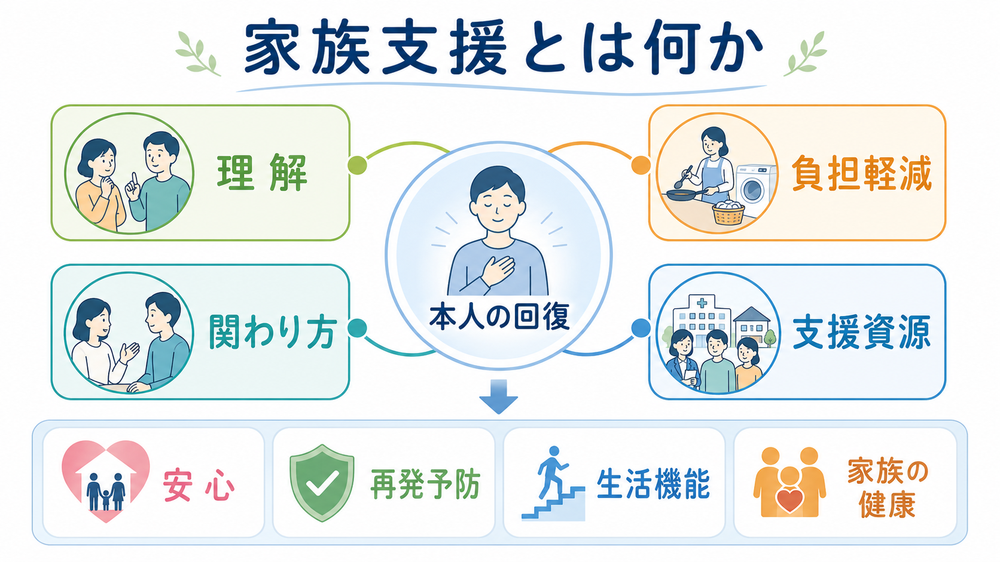
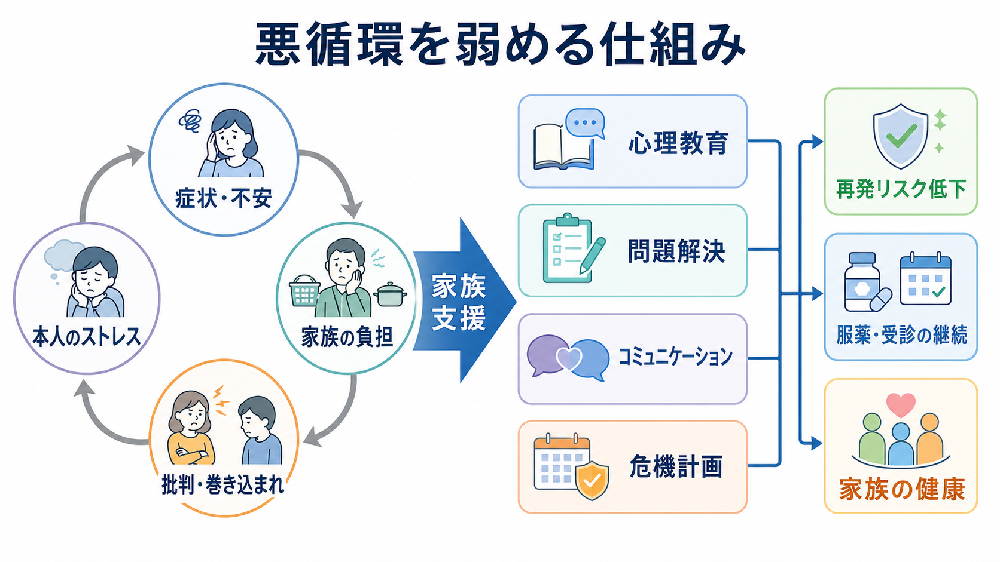
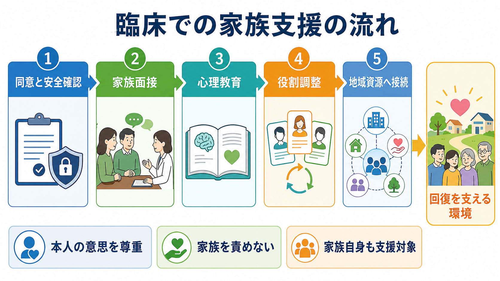

# 家族支援とは何か

## 要点

- 家族支援とは、家族を「治療者の代わり」にすることではなく、本人・家族・専門職・地域資源が、病気理解、役割、負担、危機対応、生活環境を調整する実践である。
- 統合失調症や精神病圏では、家族介入は家族と本人が密接に関わる場合に推奨され、心理教育、問題解決、危機管理、支持的関わりを含む[1]。
- WHO mhGAP でも、精神病の維持期には家族介入・家族心理教育・心理教育・CBT などの心理社会的介入を提供することが推奨され、介護者自身への心理社会的支援も位置づけられている[2][3]。
- 研究上は、家族介入が統合失調症の再発や入院を減らす可能性が示されているが、研究の質や実装条件には限界がある[4]。
- 家族支援で重要なのは、家族を責めることではない。高い批判・敵意・過度な巻き込まれとして測定される感情表出は再発と関連するが、それは家族の悪意ではなく、負担、不安、情報不足、支援不足の反応として理解する必要がある[5]。

## この記事で答える問い

1. 家族支援は、[[家族療法とは何か|家族療法]]や[[心理教育とは何か|心理教育]]と何が重なり、何が違うのか。
2. 家族の負担、本人の症状、再発、生活機能はどのように循環するのか。
3. 臨床では、家族をどのように支え、どこまで関わってもらうのがよいのか。
4. 家族支援を行うとき、本人の同意、プライバシー、家族自身の健康をどう扱うべきか。

## まず結論

家族支援とは、本人の回復を家族に背負わせる方法ではない。むしろ、家族だけが支え込まざるをえない状態を減らし、本人の意思、家族の限界、専門職の役割、地域資源を見える形にしていく支援である。

精神疾患では、症状の波、受診や服薬の継続、睡眠や生活リズム、対人関係、経済問題、危機対応が家庭生活に入り込みやすい。家族は最も近い支援者になりうる一方で、最も負担を受けやすい人でもある。したがって家族支援は、本人の症状を「家族の対応で治す」ためではなく、本人と家族の双方が消耗しにくい環境をつくるために行う。

## 背景

精神科臨床では、家族が多くの役割を担う。受診同行、服薬管理、金銭管理、生活リズムの調整、危機時の連絡、本人の変化への気づき、制度利用の手続きなどである。これらは治療継続を助ける一方で、家族の睡眠、仕事、感情、身体健康、社会生活を削ることがある。精神疾患をもつ人の介護者負担に関するメタ分析では、精神疾患をもつ人の介護者に一定の負担が広くみられ、特に精神病症状をもつケースや入院環境で高くなりやすいことが報告されている[8]。

この背景を理解せずに「家族がもっと支えるべき」と考えると、家族支援は逆効果になる。家族の役割を増やすだけでは、本人の自律性が下がり、家族の疲弊が増え、家庭内の緊張が高まることがある。家族支援の出発点は、家族が何をしているか、何に困っているか、どの範囲なら関われるかを評価することである。これは[[精神疾患と家族負担はどう関係するのか]]や[[家族面接では何を評価するべきか]]と深く関わる。

## 基本概念

### 家族支援

家族支援は、家族に情報、相談機会、感情的支え、問題解決の道具、危機時の手順、制度・地域資源への接続を提供する実践である。対象は「本人を支える家族」だけでなく、「支援を必要としている家族自身」でもある。

NICE は、精神病または統合失調症の人と同居している、または密接に接触している家族に家族介入を提供することを推奨している。家族介入は、本人が実際的に参加できる場合は本人も含み、3か月から1年、少なくとも10回の計画的セッションを行い、単一家族か複数家族グループかの希望、主介護者と本人の関係、支持的・教育的・治療的機能、問題解決や危機管理を含むと整理されている[1]。

### 家族療法との違い

[[家族療法とは何か]]は、家族システム、相互作用、境界、役割、コミュニケーションを治療の焦点にする心理療法である。家族支援はそれより広い。家族療法的な視点を含むことはあるが、必ずしも心理療法の枠内だけで行われるわけではない。診察、訪問看護、デイケア、ケースマネジメント、家族会、福祉制度、地域相談の中でも家族支援は行われる。

### 心理教育との違い

[[心理教育とは何か]]は、病気、症状、治療、再発予防、対処法を、本人や家族が生活の中で使える知識として共有する実践である。家族支援では心理教育が中核になることが多いが、それだけでは不十分である。家族が本当に必要としているのは、知識に加えて、相談先、休息、危機時の連絡経路、役割調整、本人との距離の取り方、経済・福祉資源への接続である[3][6]。

### 感情表出

感情表出とは、家族の批判、敵意、過度な情緒的巻き込まれを測定する研究概念である。高い感情表出は、統合失調症を中心に再発と関連することがメタ分析で示されてきた[5]。ただし、この概念を「家族が悪いから再発する」と使ってはならない。臨床的には、家族の批判や巻き込まれを、情報不足、睡眠不足、孤立、恐怖、過去の危機体験、制度的支援不足のサインとして読む方が安全である。

## 仕組み

家族支援の仕組みは、悪循環を弱めることとして理解しやすい。

症状や不安が強くなると、本人は生活リズムを崩し、受診や服薬を中断し、人との接触を避けることがある。家族は心配して確認や説得を増やす。本人はそれを監視や批判として受け取り、ストレスが増える。家族はさらに不安になり、疲弊し、強い言葉や過干渉が増える。この循環が続くと、本人のストレスと家族の負担が同時に高まりやすい。

家族支援は、この循環のどこか一箇所だけを直すのではなく、複数の接点で小さく介入する。

1. 病気と症状に名前をつけ、不確実性を減らす。
2. 早期サインと危機時対応を、本人と家族の双方にわかる形にする。
3. 批判や説得の代わりに、短く具体的な伝え方を練習する。
4. 家族の役割を減らし、専門職、福祉、地域資源へ分担する。
5. 家族自身の休息、相談、支援を正当なニーズとして扱う。

統合失調症に対する家族介入の Cochrane レビューでは、家族介入が再発、入院、服薬アドヒアランスに有利に働く可能性が報告されている[4]。ただし、介入の内容、セッション数、対象家族、比較条件、研究の質にはばらつきがある。そのため「家族介入なら何でも効く」と読むのではなく、心理教育、問題解決、コミュニケーション、危機管理が、一定の構造をもって提供されたときに意味をもつと考えるのがよい。

## 図解

家族支援は、単一の技法ではなく、臨床プロセスである。特に重要なのは、本人の同意と安全確認から始めること、家族面接で困りごとと役割を評価すること、心理教育を個別化すること、家族の役割を増やすだけで終わらせず地域資源につなぐことである。

実践上は、次のように整理できる。

| 段階 | 目的 | 具体例 |
|---|---|---|
| 同意と安全確認 | 本人の意思、情報共有範囲、危機リスクを確認する | 誰に何を共有してよいかを確認する |
| 家族面接 | 家族の負担、理解、関わり方、支援資源を把握する | 睡眠、仕事、経済、孤立、緊急時の困りごとを聴く |
| 心理教育 | 症状と治療を生活に翻訳する | 早期サイン、服薬、睡眠、ストレス、再発予防を整理する |
| 問題解決 | 家庭内で繰り返す困りごとを小さく扱う | 「夜中の確認」「受診をめぐる衝突」などを一つずつ検討する |
| 役割調整 | 家族だけに負担が集中しないようにする | [[ケースマネジメントとは何か|ケースマネジメント]]、[[訪問看護は精神科で何を支えるのか|訪問看護]]、福祉制度へつなぐ |
| 振り返り | 支援が本人と家族を助けているか確認する | 本人の安心、家族の睡眠、危機対応のしやすさを見直す |

## 臨床・研究との接続

### 統合失調症・精神病圏

統合失調症や精神病圏では、家族介入の研究蓄積が最も厚い。NICE は、本人と同居または密接に接触している家族に家族介入を提供することを推奨し、急性期でも後の時期でも開始できるとしている[1]。WHO も、精神病の維持期に家族介入、家族心理教育、心理教育、CBT などの心理社会的介入を提供することを推奨している[2]。

この領域では、再発予防だけを成果にしないことが重要である。家族支援は、再発リスクの低下、受診継続、服薬継続に加えて、本人の生活機能、家族の負担、家庭内の安全、家族の健康、サービス利用のしやすさを同時に見る必要がある。

### 双極性障害

双極性障害では、気分エピソード、睡眠リズム、服薬継続、ストレス、家族内の反応が再発予防に関わる。家族焦点化療法や家族心理教育は、薬物療法に加える心理社会的介入として研究されてきた。Miklowitz らの研究では、家族焦点化心理教育と薬物療法を組み合わせることが、維持期の気分安定に役立つ可能性が検討された[7]。WHO も、双極性障害の寛解期に、薬物療法の補助として心理教育や家族心理教育などを考慮するとしている[2]。

### 地域生活支援

家族支援は、外来診療だけでは完結しない。[[精神科リハビリテーションとは何か|精神科リハビリテーション]]、[[リカバリー志向支援とは何か|リカバリー志向支援]]、[[生活技能訓練SSTとは何か|SST]]、[[訪問看護は精神科で何を支えるのか|訪問看護]]、[[地域移行支援とは何か|地域移行支援]]、[[地域定着支援とは何か|地域定着支援]]、[[家族会とは何か|家族会]]と接続して初めて、家族だけに負担が集中しにくくなる。

### 家族自身への支援

WHO は、精神病または双極性障害をもつ人の介護者に対して、問題解決や認知行動的アプローチを含む心理教育、自助、相互支援グループなどの心理社会的介入を考慮することを推奨している[3]。これは重要である。家族は「本人の治療を助ける資源」である以前に、疲労し、不安になり、支援を必要とする当事者でもある。

## よくある誤解

### 誤解1: 家族支援は家族にもっと頑張ってもらうこと

違う。家族支援の第一目的は、家族だけが頑張らざるをえない構造を減らすことである。家族ができることを増やす場合でも、同時に専門職、制度、地域資源へ負担を分散する必要がある。

### 誤解2: 家族の関わり方が悪いから本人が悪化する

違う。家族の批判や過干渉は、負担、不安、孤立、支援不足の結果として起こりうる。感情表出の研究は、家族を責める道具ではなく、家庭内のストレスを下げる支援を設計するための手がかりである[5]。

### 誤解3: 本人が拒否していても家族にはすべて説明してよい

違う。家族支援では、本人の同意、プライバシー、安全、判断能力、緊急性を慎重に扱う。本人が同意しない場合でも、家族自身の困りごとを聴く、一般的な情報を提供する、危機時の相談先を伝えることはできる場合がある。個別情報の共有とは分けて考える。

### 誤解4: 心理教育資料を渡せば家族支援になる

違う。資料は入口にすぎない。家族が使える形にするには、その家族の生活、文化、関係性、役割、疲労、経済状況、危機経験に合わせて、説明、練習、問題解決、振り返りを行う必要がある[6]。

### 誤解5: 家族が関われば関わるほどよい

違う。過度な関与は、本人の自律性を下げ、家族の燃え尽きを招くことがある。支援では、本人が自分でできること、家族が担うこと、専門職や制度が担うことを分ける。

## 関連ノート

- [[家族療法とは何か]]
- [[心理教育とは何か]]
- [[精神疾患と家族負担はどう関係するのか]]
- [[家族面接では何を評価するべきか]]
- [[家族への説明で何に注意するべきか]]
- [[家族会とは何か]]
- [[リカバリー志向支援とは何か]]
- [[精神科リハビリテーションとは何か]]
- [[ケースマネジメントとは何か]]
- [[訪問看護は精神科で何を支えるのか]]
- [[地域移行支援とは何か]]
- [[地域定着支援とは何か]]
- [[生活技能訓練SSTとは何か]]

## MOC更新候補

- `content/00_MOC/MOC｜リハビリ・生活支援.md`
- `content/00_MOC/MOC｜臨床実践・治療.md`
- 並列ジョブとの競合を避けるため、本記事作成時点では MOC ファイルを更新しない。

## 理解チェック

1. 家族支援が「家族に治療を肩代わりさせること」ではない理由を説明できるか。
2. 家族支援に、心理教育だけでなく問題解決、コミュニケーション、危機計画、家族自身の支援が必要な理由を説明できるか。
3. 感情表出を、家族を責める概念ではなく支援設計の手がかりとして説明できるか。
4. 本人の同意とプライバシーを守りながら、家族自身の相談ニーズに応じる方法を挙げられるか。

## 未解決問題

- どの家族介入成分が、どの疾患、どの治療段階、どの家族構成で最も効果に寄与するのかは、なお検討が必要である。
- 再発率や入院率だけでなく、本人の主観的リカバリー、家族の健康、孤立、経済負担、サービス利用のしやすさを含む評価が必要である。
- 同居家族、別居家族、パートナー、きょうだい、親、子ども、支援拒否があるケースなど、立場ごとの支援設計はさらに精緻化される必要がある。
- 文化差、制度差、スティグマ、強制入院経験、虐待・DV リスクがある場合の家族支援は、一般的な心理教育モデルだけでは不十分である。

## 参考文献

[1] National Institute for Health and Care Excellence. (2014). *Psychosis and schizophrenia in adults: prevention and management* (CG178); Quality statement 3: Family intervention. https://www.nice.org.uk/guidance/cg178/chapter/rec ; https://www.nice.org.uk/guidance/qs80/chapter/Quality-statement-3-Family-intervention

[2] World Health Organization. (2023 updated). *Psychoeducation, family interventions and cognitive-behavioural therapy*. mhGAP Evidence Centre. https://www.who.int/teams/mental-health-and-substance-use/treatment-care/mental-health-gap-action-programme/evidence-centre/psychosis-and-bipolar-disorders/psychoeducation-family-interventions-and-cognitive-behavioural-therapy

[3] World Health Organization. (2023 new). *Psychosocial interventions for carers of persons with psychosis or bipolar disorder*. mhGAP Evidence Centre. https://www.who.int/teams/mental-health-and-substance-use/treatment-care/mental-health-gap-action-programme/evidence-centre/psychosis-and-bipolar-disorders/psychosocial-interventions-for-carers-of-persons-with-psychosis-or-bipolar-disorder

[4] Pharoah, F., Mari, J. J., Rathbone, J., & Wong, W. (2010). Family intervention for schizophrenia. *Cochrane Database of Systematic Reviews*, 2010(12), CD000088. https://doi.org/10.1002/14651858.CD000088.pub3

[5] Butzlaff, R. L., & Hooley, J. M. (1998). Expressed emotion and psychiatric relapse: A meta-analysis. *Archives of General Psychiatry, 55*(6), 547-552. https://doi.org/10.1001/archpsyc.55.6.547

[6] Lucksted, A., McFarlane, W., Downing, D., & Dixon, L. (2012). Recent developments in family psychoeducation as an evidence-based practice. *Journal of Marital and Family Therapy, 38*(1), 101-121. https://doi.org/10.1111/j.1752-0606.2011.00256.x

[7] Miklowitz, D. J., George, E. L., Richards, J. A., Simoneau, T. L., & Suddath, R. L. (2003). A randomized study of family-focused psychoeducation and pharmacotherapy in the outpatient management of bipolar disorder. *Archives of General Psychiatry, 60*(9), 904-912. https://doi.org/10.1001/archpsyc.60.9.904

[8] Abdul Rahman, A., Mohamad Shariff, N., Abdullah, N., et al. (2022). Caregiver burden among caregivers of patients with mental illness: A systematic review and meta-analysis. *Healthcare, 10*(12), 2423. https://doi.org/10.3390/healthcare10122423
