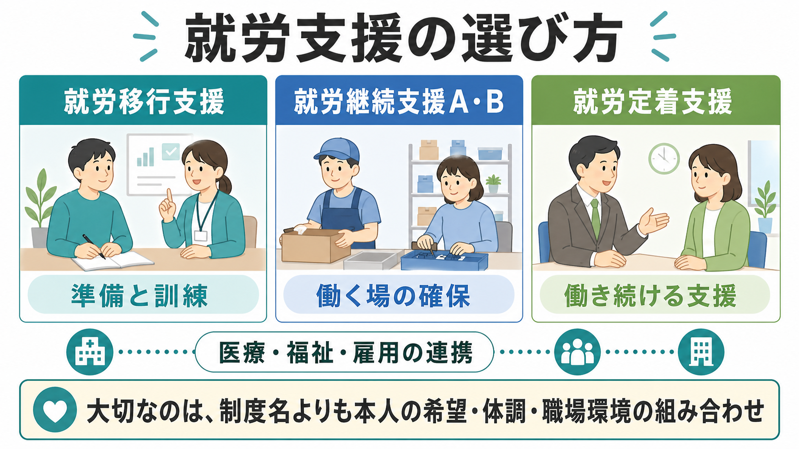
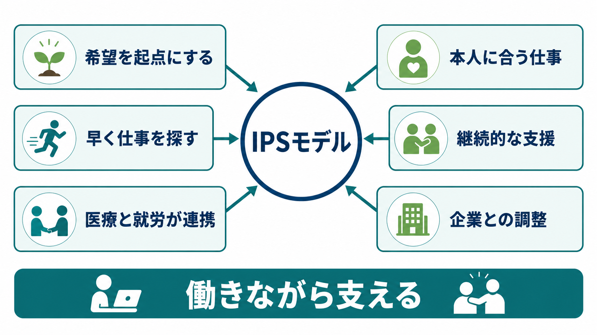
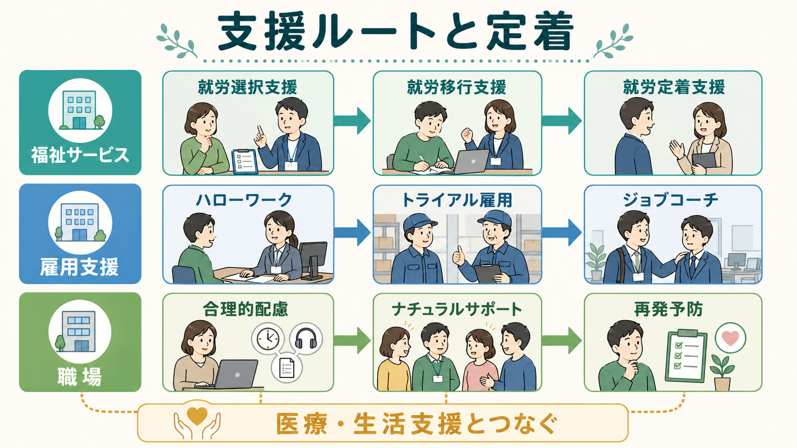

# 就労支援とは何か

## 要点

- 就労支援は、精神疾患や心理社会的困難をもつ人が「仕事に就く」「職場に適応する」「働き続ける」ことを、本人の希望・健康状態・生活条件・職場環境に合わせて支える実践である。
- 日本の障害福祉サービスでは、就労選択支援、就労移行支援、就労継続支援A型・B型、就労定着支援が就労系サービスとして整理されている[1]。
- 精神疾患領域では、就労支援は単なる職業紹介ではない。症状、認知機能、生活リズム、服薬、通勤、対人関係、職場の合理的配慮、スティグマ、再発予防を同時に扱う。
- IPS（Individual Placement and Support）に代表される援助付き雇用は、長い準備訓練よりも、本人の希望に沿って早期に実際の競争的雇用へつなぎ、就労と治療・生活支援を同時に進める点に特徴がある[4][5]。
- 研究上、IPSは通常支援や従来型職業リハビリテーションよりも競争的雇用への到達を高めやすい一方、生活の質や精神症状など非職業アウトカムは効果が一貫しないため、就労だけを回復の唯一指標にしないことが重要である[5][6]。

## この記事で答える問い

1. 就労支援は、職業紹介や訓練と何が違うのか。
2. 精神疾患をもつ人の就労支援では、どのような困難を同時に見る必要があるのか。
3. 日本の制度と、IPSなどのエビデンスに基づく支援はどう接続できるのか。
4. 支援者が「働かせる」支援に傾かないために、何を確認すべきか。

## まず結論

就労支援とは、本人が望む働き方を、健康・生活・職場・制度の条件とすり合わせながら実現し、必要に応じて働き続ける過程まで伴走する支援である。精神疾患のある人にとって仕事は、収入だけでなく、役割、社会参加、生活リズム、自己効力感、リカバリーに関わる。一方で、仕事は疲労、対人ストレス、睡眠の乱れ、症状再燃、自己否定感を強める場にもなりうる。したがって就労支援は、「就職できたか」だけでなく、「本人にとって意味があるか」「健康を損なわず続けられるか」「困ったときに調整できるか」を見る必要がある。

この意味で、就労支援は[[精神科リハビリテーションとは何か|精神科リハビリテーション]]、[[リカバリー志向支援とは何か|リカバリー志向支援]]、[[ケースマネジメントとは何か|ケースマネジメント]]と重なる。職場に入る前の訓練だけでなく、実際の職場で生じる困りごとを、本人、支援者、医療者、雇用側が共有し、必要に応じて仕事量、勤務時間、業務手順、休憩、相談経路を調整することが中核になる。

## 背景

精神疾患のある人では、症状が安定しても就労上の困難が残ることがある。たとえば、朝の起床、通勤、注意の持続、複数作業、対人緊張、疲労の見積もり、職場での報告・相談、ストレス時の早期サインへの対応が課題になる。これらは本人の「意欲不足」だけでは説明できない。症状、認知機能、薬の副作用、睡眠、生活環境、貧困、孤立、スティグマ、職場側の理解不足が絡み合う。

日本では、障害者総合支援法の就労系障害福祉サービスとして、就労選択支援、就労移行支援、就労継続支援A型、就労継続支援B型、就労定着支援が整理されている[1]。就労選択支援は、本人が就労先や働き方を選びやすくするために、就労アセスメントを活用する新しい制度として位置づけられている[3]。加えて、ハローワーク、地域障害者職業センター、障害者就業・生活支援センター、ジョブコーチ支援、精神・発達障害者雇用サポーターなど、雇用施策側の支援も存在する[2]。実践では、福祉サービスと雇用施策を分けて考えるより、本人がどの段階で何に困っているかに応じて組み合わせる発想が必要になる。

## 基本概念

### 就労支援

就労支援は、仕事を探す前、仕事に就く時、働き始めた後、働き方を見直す時に続く支援である。支援対象は「就職活動」だけではない。職業的アセスメント、履歴書や面接、職場見学、実習、勤務条件の調整、体調管理、職場内コミュニケーション、退職や休職後の再設計も含む。

精神疾患領域では、支援者が仕事だけを見ると失敗しやすい。勤務時間を増やすと睡眠が崩れる、対人負荷が症状を悪化させる、服薬時間と勤務時間が合わない、収入増加が給付や生活設計に影響する、職場での開示・非開示に迷う、といった問題が起こるからである。

### 競争的雇用と保護的な働く場

競争的雇用とは、一般の労働市場で、通常の賃金や雇用条件のもとで働くことを指す。IPSでは、本人が希望する競争的雇用への早期接続が重視される[4][5]。一方で、就労継続支援A型・B型のように、一般企業での雇用が難しい場合に、働く機会や生産活動の場を提供する制度もある[1]。

どちらが「上」かではない。重要なのは、本人の希望、体調、生活条件、収入、支援量、職場環境に合っているかである。競争的雇用が合う人もいれば、短時間から段階的に働く場が合う人もいる。制度名を本人の価値に結びつけないことが大切である。

### 職場適応と定着

就職はゴールではなく、職場適応の始まりである。就労定着支援は、就労移行支援などを利用して一般企業に新たに雇用された障害者に対し、就労に伴って生じる日常生活・社会生活上の問題への相談、助言、調整を行うサービスとして位置づけられている[1]。

精神疾患のある人では、定着支援の焦点は、勤務成績だけではない。疲労の蓄積、睡眠、服薬、早期サイン、職場での孤立、上司への相談、業務量、通勤負荷、家庭内役割、金銭管理を含めて見る必要がある。

## 仕組み

就労支援は、線形の手順ではなく、本人の希望と現実の職場経験を往復しながら調整する循環である。

1. 本人の希望を確認する。
2. 健康状態、生活リズム、認知機能、対人関係、通勤、制度利用、収入への影響を評価する。
3. 働き方の選択肢を整理する。
4. 求職活動、職場見学、実習、面接、職場調整を行う。
5. 働き始めた後に、体調、業務、対人関係、生活への影響を確認する。
6. 必要に応じて、勤務時間、業務手順、休憩、相談経路、通院との両立を見直す。

### IPS型支援の特徴

IPSは、重い精神疾患をもつ人への援助付き雇用モデルとして発展した。SAMHSAのIPSツールキットでは、精神疾患のある人が意味のある競争的雇用を見つけ、維持するためのエビデンスに基づく支援として説明されている[4]。典型的には、本人の希望に基づく職探し、迅速な求職活動、精神保健サービスとの統合、個別化された職場開拓、給付に関する相談、期限を切らない継続支援が重視される[4][7]。

従来型の「十分に訓練してから働く」発想では、準備期間が長くなり、実際の職場経験が先送りされることがある。IPSは、実際の職場に早く接続し、そこで生じる課題を支援対象にする。これは「準備しなくてよい」という意味ではない。準備と実践を分けすぎず、働きながら必要な支援を入れるという考え方である。

### 職場調整

職場調整では、本人の症状名を職場に説明することが目的ではない。業務遂行に必要な条件を具体化することが目的である。たとえば、勤務開始時間、休憩の取り方、指示の出し方、作業手順の見える化、相談担当者、急な不調時の連絡方法、在宅勤務や短時間勤務の可否を検討する。

開示・非開示は慎重に扱う。障害名や診断名を伝えるかどうかは、本人の選択、必要な配慮、職場文化、リスク、制度利用に関わる。支援者が一方的に開示を勧めるのではなく、何を伝えると何が得られ、何がリスクになるかを一緒に整理する。

## 図解

日本の制度や支援資源は多い。選択肢が多いことは利点だが、本人から見ると、どこに相談すればよいか分かりにくいこともある。以下の図は、制度名を目的別に整理するための見取り図である。

| 支援の場面 | 主な支援 | 見るべき問い |
|---|---|---|
| 働き方を選ぶ | 就労選択支援、職業的アセスメント、相談支援 | 本人は何を望み、何が不安か |
| 準備する | 就労移行支援、職業訓練、SST、認知リハビリテーション | 仕事に必要な技能と生活条件は何か |
| 働く場を確保する | 就労継続支援A型・B型、企業実習、職場開拓 | 今の体調と支援量に合う働き方は何か |
| 一般就労に入る | ハローワーク、障害者職業センター、ジョブコーチ、IPS | 本人の希望に沿った職場へどう接続するか |
| 働き続ける | 就労定着支援、障害者就業・生活支援センター、医療・福祉連携 | 不調や職場課題を早く調整できるか |

## 臨床・研究との接続

臨床では、就労支援は治療計画の一部として扱う必要がある。たとえば、うつ病で休職した人では、復職のタイミング、再発サイン、睡眠、業務量、職場との連絡、産業保健との連携を見ながら進める。統合失調症や双極性障害では、症状の再燃、認知機能、対人ストレス、服薬継続、支援者との連絡経路が重要になる。発達特性がある人では、曖昧な指示、感覚過敏、マルチタスク、対人文脈の読み取り、職場文化とのミスマッチが課題になることがある。

エビデンス面では、援助付き雇用、特にIPSは、重い精神疾患をもつ成人の競争的雇用アウトカムを改善しやすい。Cochraneレビューは、IPSを含む援助付き雇用が従来型職業リハビリテーションや通常支援よりも競争的雇用への到達を高めることを示している[5]。FrederickとVanderWeeleのメタ分析でも、IPSは通常支援より競争的雇用、雇用期間、収入などの職業アウトカムで優れる一方、生活の質、全般機能、精神健康などの非職業アウトカムでは推定値に不確実性が残る[6]。ノルウェーの多施設ランダム化比較試験でも、IPS群は通常支援群より12か月・18か月時点の競争的雇用割合が高かった[8]。

この知見は、就労支援を過大評価しないためにも重要である。仕事は回復を支えることがあるが、仕事そのものが治療の代替ではない。本人が働くことを望まない時期、休むことが必要な時期、働き方を下げることが回復に資する時期もある。就労支援は、本人を労働市場へ押し出す技法ではなく、本人の生活全体の中で仕事の位置を調整する支援である。

## よくある誤解

### 誤解1: 就労支援は求人を紹介することである

求人紹介は一部にすぎない。精神疾患のある人の就労支援では、職探しの前後に、体調、生活リズム、通院、服薬、家族、収入、職場調整、再発予防を扱う。職場に入った後の定着支援まで含めて考える必要がある。

### 誤解2: まず完全に安定してから働くべきである

急性期の安全確保や治療が優先される場面はある。しかし、症状が完全に消えるまで社会参加を延期すると、孤立、自己効力感の低下、生活リズムの悪化が続くこともある。IPSの考え方では、本人が希望する場合、治療や生活支援と並行して実際の仕事に接続し、必要な調整を入れる[4][5]。

### 誤解3: 就職できれば支援は終わる

就職直後こそ支援が必要になりやすい。初期の疲労、職場での期待値、業務理解、対人関係、通院との両立、給付や収入の変化が重なるからである。就労定着支援やジョブコーチ支援は、この時期の課題に対応するために重要である[1][2]。

### 誤解4: 働くことは常にリカバリーである

働くことは、本人にとって意味のある役割や社会参加になりうる。一方で、過重労働、ハラスメント、配慮の欠如、体調悪化を伴うなら、回復を妨げる。[[リカバリー志向支援とは何か|リカバリー志向支援]]では、就労の有無だけでなく、本人の希望、つながり、意味、自己決定を確認する。

## 関連ノート

- [[精神科リハビリテーションとは何か]]
- [[リカバリー志向支援とは何か]]
- [[ケースマネジメントとは何か]]
- [[ケアマネジメントとケースマネジメントは何が違うのか]]
- [[IPS援助付き雇用とは何か]]
- [[生活技能訓練SSTとは何か]]
- [[認知リハビリテーションとは何か]]
- [[認知矯正療法とは何か]]
- [[訪問看護は精神科で何を支えるのか]]

## 理解チェック

1. 就労支援が「職業紹介」だけではない理由を、精神疾患のある人の生活条件を含めて説明できるか。
2. 就労移行支援、就労継続支援A型・B型、就労定着支援の違いを、本人の支援ニーズから説明できるか。
3. IPSが「準備してから働く」発想とどこで異なるかを説明できるか。
4. 就職後の定着支援で、勤務成績以外に確認すべき項目を挙げられるか。
5. 就労をリカバリーの唯一指標にしてはいけない理由を説明できるか。

## 未解決問題

- 日本の制度環境で、IPSの原則を就労移行支援、医療機関、障害者就業・生活支援センター、ハローワークがどのように分担すればよいか。
- 職場での開示・非開示、合理的配慮、プライバシー保護を、本人の安全と自己決定を損なわずに扱う方法。
- 就労アウトカムだけでなく、生活の質、自己効力感、身体健康、再発予防、社会的つながりを含めた評価指標。
- 重い精神疾患、発達特性、依存症、身体疾患、貧困、家族介護などが重なる場合の就労支援の優先順位づけ。

## MOC更新候補

- `content/00_MOC/` 配下の臨床実践、精神科リハビリテーション、地域精神医療、障害福祉・制度関連の MOC に追加候補。
- 並列ジョブとの競合を避けるため、本記事作成時点では MOC ファイルは更新しない。

## 参考文献

[1] 厚生労働省. (2026). 障害者の就労支援対策の状況. https://www.mhlw.go.jp/stf/newpage_40524.html

[2] 厚生労働省. (2026). 発達障害者の就労支援. https://www.mhlw.go.jp/stf/seisakunitsuite/bunya/koyou_roudou/koyou/shougaishakoyou/06d.html

[3] 厚生労働省. (2026). 就労選択支援について. https://www.mhlw.go.jp/stf/newpage_56733.html

[4] Substance Abuse and Mental Health Services Administration. (2025). *Individual Placement and Support (IPS): A Supported Employment Model*. https://library.samhsa.gov/product/individual-placement-and-support-ips-supported-employment-model/pep25-01-002

[5] Kinoshita, Y., Furukawa, T. A., Kinoshita, K., Honyashiki, M., Omori, I. M., Marshall, M., Bond, G. R., Huxley, P., Amano, N., & Kingdon, D. (2013). Supported employment for adults with severe mental illness. *Cochrane Database of Systematic Reviews*, CD008297. https://doi.org/10.1002/14651858.CD008297.pub2

[6] Frederick, D. E., & VanderWeele, T. J. (2019). Supported employment: Meta-analysis and review of randomized controlled trials of individual placement and support. *PLOS ONE, 14*(2), e0212208. https://doi.org/10.1371/journal.pone.0212208

[7] Bond, G. R., Drake, R. E., & Becker, D. R. (2012). Generalizability of the Individual Placement and Support (IPS) model of supported employment outside the US. *World Psychiatry, 11*(1), 32-39. https://doi.org/10.1016/j.wpsyc.2012.01.005

[8] Reme, S. E., Monstad, K., Fyhn, T., Sveinsdottir, V., Løvvik, C., Lie, S. A., & Øverland, S. (2019). A randomized controlled multicenter trial of individual placement and support for patients with moderate-to-severe mental illness. *Scandinavian Journal of Work, Environment & Health, 45*(1), 33-41. https://doi.org/10.5271/sjweh.3753
