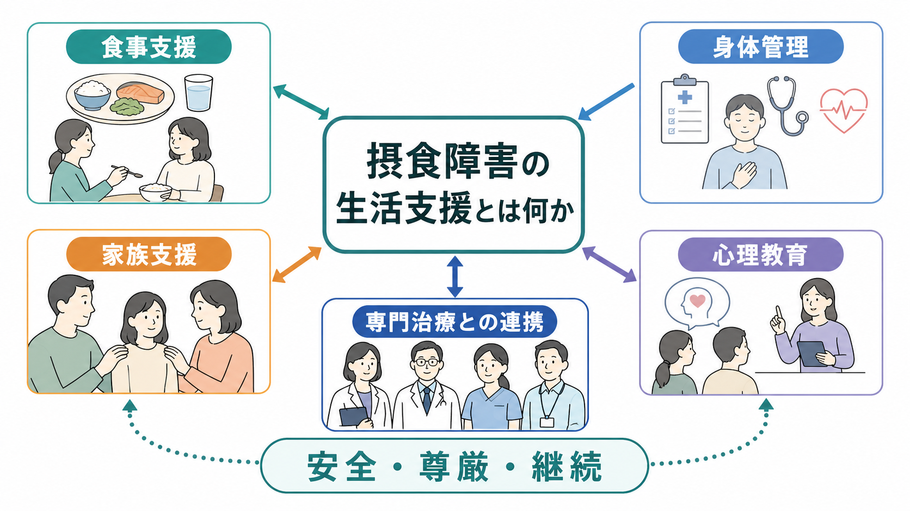
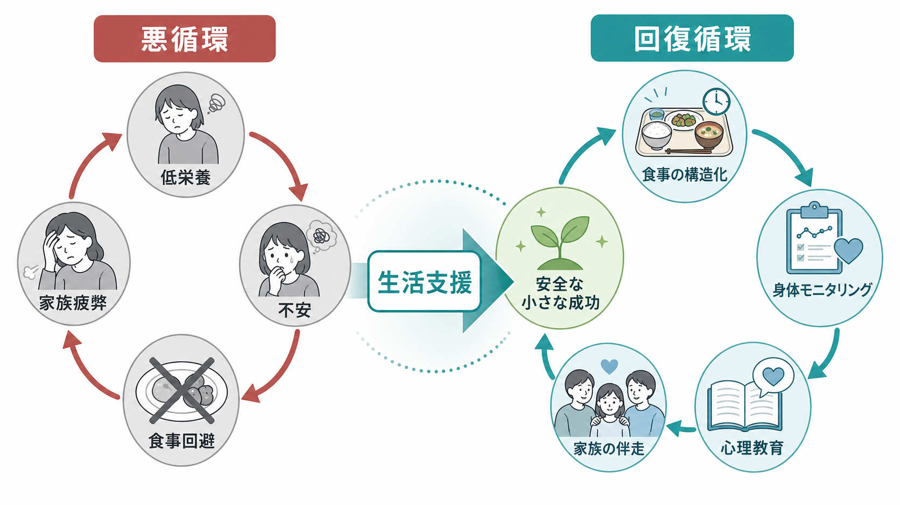
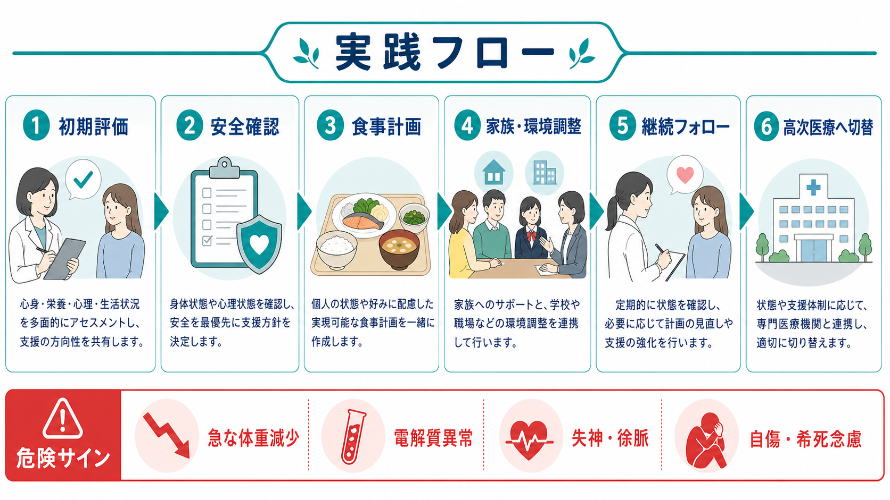

# 摂食障害の生活支援とは何か

## 要点

- 摂食障害の生活支援は、本人を「食べさせる」「体重を管理する」ことではなく、食事、身体安全、家族・学校・職場、心理教育、専門治療をつなぎ、日常生活の中で回復条件を整える支援である。
- 低栄養、過食・嘔吐、過活動、電解質異常、自傷・希死念慮は生命リスクと結びつくため、生活支援は常に[[身体健康管理支援とは何か|身体健康管理支援]]と専門医療への切替基準を含む[1][2]。
- 家族は原因として責められる存在ではなく、本人の苦痛を理解し、食事・受診・休息・環境調整を支える資源である。家族自身の疲弊を支える[[家族支援とは何か|家族支援]]と[[家族心理教育とは何か|家族心理教育]]も必要になる[1][3]。
- 心理教育は「正しい知識を教える」だけではなく、低栄養が認知・感情・こだわりに与える影響、回復過程で起きる不安、再燃サイン、相談先を本人と周囲が共有する作業である[1][4]。

## この記事で答える問い

1. 摂食障害の生活支援は、心理療法や栄養指導と何が違うのか。
2. 食事支援、身体管理、家族支援、心理教育はどのように組み合わせるのか。
3. 家庭、学校、職場、地域支援者は何を支え、どこから専門治療へつなぐべきか。
4. 支援者が避けるべき誤解や過干渉は何か。

## まず結論

摂食障害の生活支援とは、摂食障害を本人の意思の弱さや家族の問題に還元せず、食行動と身体リスクを日常生活の中で安全に扱えるようにする多職種支援である。中心になるのは、食事を生活の構造として再建すること、低栄養や排出行動に伴う身体リスクを見逃さないこと、家族や身近な人が責めずに伴走できること、本人が病気と回復の見通しを理解できることである[1][2][3]。

ただし、生活支援は単独で完結しない。神経性やせ症、神経性過食症、過食性障害、回避・制限性食物摂取症などでは、医学的評価、心理療法、栄養療法、必要に応じた入院・デイケア・集中的外来が組み合わされる。生活支援はその間をつなぐ実装であり、[[ケースマネジメントとは何か|ケースマネジメント]]や[[訪問看護は精神科で何を支えるのか|訪問看護]]、学校・職場調整と接続して初めて機能する。

## 背景

摂食障害は、食事や体重だけの問題ではない。身体健康、認知、感情調整、対人関係、学業・就労、家族関係に広く影響する精神疾患であり、重症例では生命に関わる[2][5]。NICE は、摂食障害の評価と治療において、家庭、教育、仕事、社会環境の影響を評価し、情緒面、教育・就労、社会的ニーズを治療全体で扱うことを推奨している[1]。

日本では、摂食障害全国支援センターと摂食障害情報ポータルサイトが、本人・家族・専門職向けに相談窓口、家族向け情報、心理療法、診療連携情報を提供している[3]。これは、摂食障害支援が診察室だけで閉じず、地域の相談支援、家族会、学校・職場、身体科と精神科の連携を必要とすることを示している。

## 基本概念

### 食事支援

食事支援は、説得や監視ではなく、食べる場面を予測可能にし、本人が一人で抱え込まない形に整える支援である。具体的には、食事時間を大きく崩さない、食事記録を責める道具にしない、急な制限・過食・嘔吐・下剤使用があれば医療者に共有する、家庭内で食事をめぐる衝突を減らす、といった工夫が含まれる[1][3]。

低体重や急な体重減少がある場合、食事支援は医学的安全管理と切り離せない。再栄養症候群、電解質異常、徐脈、低血圧、失神などのリスクがあるため、支援者が独自に食事量を増減させるのではなく、医師・管理栄養士・心理職と方針を合わせる必要がある[2][6]。

### 身体管理

身体管理は、体重だけを見ることではない。体重変化、食事摂取、嘔吐・下剤・利尿薬・過活動、月経、めまい、失神、脈拍、血圧、体温、電解質、心電図、睡眠、疲労、自傷・希死念慮を含めて安全を確認する[2][6]。生活支援者は診断や治療指示を行わないが、危険サインに気づき、受診・救急・高次医療につなぐ役割を持つ。

この点で、摂食障害の生活支援は[[生活リズム支援とは何か|生活リズム支援]]や[[精神科リハビリテーションとは何か|精神科リハビリテーション]]と重なる。ただし、摂食障害では「活動できている」「学校や仕事に行けている」ことが安全を意味しない。本人が一見元気に見えても、低栄養や代償行動によって身体リスクが高い場合がある[6]。

### 家族支援

家族支援の基本は、本人を問い詰めたり責めたりせず、行動の背景にある不安や苦痛を聞き、心配していることと支えたい意図を伝えることである[3]。家族が無理に食べさせようとする、食事や体重を常時監視する、本人の努力を体重だけで評価する、といった関わりは衝突を強めやすい。

一方で、家族が何もしないことがよいわけでもない。特に若年者の神経性やせ症では、家族が一時的に食事回復を支える役割を担い、本人の発達段階に応じて徐々に自律性を戻していく家族療法が推奨される[1][7]。大切なのは、家族を原因として責めるのではなく、回復を支えるチームの一員として位置づけることである。

### 心理教育

心理教育では、摂食障害の症状、低栄養の影響、回復過程、再燃サイン、支援の使い方を共有する。本人にとっては、食事や体重をめぐる恐怖が「わがまま」ではなく症状として理解されることが重要である。家族にとっては、過剰な責任感や罪悪感を下げ、どの行動を支え、どこから医療者に相談するかを整理する助けになる[1][3]。

## 仕組み

摂食障害の生活支援は、悪循環を小さな回復循環に置き換える作業として理解できる。

悪循環では、低栄養や過食・嘔吐が不安、こだわり、疲労、対人緊張を強める。本人は食事を避ける、運動や排出行動で不安を下げようとする、周囲は心配して監視や説得を強める。結果として、食事場面がさらに危険で緊張したものになり、本人も家族も疲弊する。

回復循環では、食事時間、休息、身体確認、相談先、家族の声かけを小さく構造化する。食事が完全に楽になることを待つのではなく、「安全に一回を終える」「相談できた」「過活動を少し減らせた」「家族が責めずに対応できた」という小さな成功を積み上げる。CBT-E などの認知行動療法でも、食行動、体型・体重への過大評価、感情調整、対人要因を扱いながら、日常場面での記録、実験、再発予防を重視する[8]。

## 図解

生活支援の実践は、次のような流れで整理できる。

| 段階 | 支援の焦点 | 具体例 |
|---|---|---|
| 初期評価 | 生活と身体リスクを同時に見る | 食事、体重変化、過活動、嘔吐・下剤、睡眠、学校・仕事、家族負担を確認する |
| 安全確認 | 高次医療へつなぐ基準を共有する | 失神、徐脈、電解質異常、急な体重減少、自傷・希死念慮、急な食水分拒否を見逃さない |
| 食事計画 | 食事を交渉の場から生活構造へ移す | 時間、場所、同席者、食後の過ごし方、記録の扱いを医療者と合わせる |
| 家族・環境調整 | 支援者の役割を分ける | 家族、学校、職場、主治医、心理職、栄養士、相談支援者の連絡線を作る |
| 継続フォロー | うまくいかない場面を責めずに修正する | 再燃サイン、受診間隔、家族の休息、本人の自律性を見直す |
| 切替 | 外来支援の限界を明確にする | 外来で安全が保てない場合、救急、入院、デイケア、集中的外来へ切り替える |

## 臨床・研究との接続

若年者の神経性やせ症では、家族を回復資源として位置づける家族療法が主要な選択肢であり、NICE は家族が本人の食事管理を一時的に支えること、栄養と低栄養の影響について心理教育を行うこと、最終的には本人の発達に応じた自律性を戻すことを推奨している[1]。Cochrane レビューでも、家族療法は通常治療と比べて寛解に有利な可能性が示されたが、エビデンスの質や研究間の差には注意が必要である[7]。

成人や過食・排出行動が中心のケースでは、CBT-E を含む認知行動療法が重要な選択肢になる。CBT-E は、食事制限、過食、排出行動、体型・体重への過大評価、気分・対人要因を横断的に扱う治療であり、日常生活での自己モニタリングや行動実験と相性がよい[8]。生活支援は、心理療法で扱う課題を家庭・学校・職場で実行可能な形に落とし込む役割を持つ。

医学的には、外来で支援できる範囲と入院・救急が必要な範囲を分けることが重要である。MEED は、摂食障害患者が一見元気に見えたり血液検査が正常に見えたりしても高リスクでありうること、栄養状態、摂食行動、身体診察、血液検査、心電図、自傷・希死念慮を含む評価が必要であることを強調している[6]。生活支援者はこの判断を単独で担わず、危険サインを共有する仕組みを持つ。

## よくある誤解

### 誤解1: 食べれば治る

食事回復は重要だが、摂食障害は食事量だけで説明できない。低栄養による認知・感情の変化、体型・体重への過大評価、対人不安、家族関係、トラウマ、併存症、学校・職場環境が絡む。したがって「食べなさい」だけではなく、食べることが怖くなる仕組みを理解し、安全に練習できる環境を作る必要がある。

### 誤解2: 家族が原因である

家族関係が症状の経過に影響することはあるが、家族を原因として断定することは支援にならない。日本の摂食障害情報ポータルサイトも、家族が原因だという明確な証拠はなく、今後どう支えるかが重要だと説明している[3]。家族を責めるのではなく、家族が疲弊しすぎない支援計画を作る。

### 誤解3: 本人が嫌がるなら何もしない方がよい

本人の同意と尊厳は重要である。一方で、摂食障害では病気の自覚が乏しいことや、低栄養によって判断が難しくなることがある。重い身体リスクや自傷・希死念慮がある場合は、本人が受診を嫌がっても医療につなぐ必要がある[3][6]。これは罰ではなく、安全を守るための切替である。

### 誤解4: 体重が正常なら問題は軽い

摂食障害のリスクは体重だけでは判断できない。急な体重減少、嘔吐、下剤・利尿薬、過活動、電解質異常、失神、心電図異常、糖尿病などの身体疾患との組み合わせ、自傷・希死念慮は、体重が極端に低くなくても重いリスクになりうる[2][6]。

## 関連ノート

- [[身体健康管理支援とは何か]]
- [[家族支援とは何か]]
- [[家族心理教育とは何か]]
- [[生活リズム支援とは何か]]
- [[訪問看護は精神科で何を支えるのか]]
- [[ケースマネジメントとは何か]]
- [[精神科リハビリテーションとは何か]]

MOC 更新候補: `content/00_MOC/` 配下の臨床実践、精神科リハビリテーション、家族支援、摂食障害関連の MOC に追加候補。

今後の作成候補: 「摂食障害とは何か」「神経性やせ症とは何か」「神経性過食症とは何か」「CBT-Eとは何か」「摂食障害の家族療法とは何か」「摂食障害と身体リスク評価」。

## 理解チェック

1. 摂食障害の生活支援を、単なる食事指導や体重管理と区別するときの要点は何か。
2. 家族が支援に入るとき、避けるべき関わりと担える役割は何か。
3. 外来・地域の生活支援から、救急・入院・高次医療へ切り替える危険サインには何があるか。
4. 心理教育が本人だけでなく家族や学校・職場にも必要になる理由は何か。

## 参考文献

[1] National Institute for Health and Care Excellence. (2017, updated 2020). *Eating disorders: recognition and treatment* (NICE guideline NG69). https://www.nice.org.uk/guidance/ng69/chapter/recommendations

[2] Klein, D. A., Sylvester, J. E., & Schvey, N. A. (2021). Eating disorders in primary care: Diagnosis and management. *American Family Physician, 103*(1), 22-32. https://www.aafp.org/pubs/afp/issues/2021/0101/p22.html

[3] 摂食障害全国支援センター. 摂食障害情報ポータルサイト（一般の方）「ご家族の方へ」「よくある相談」. https://edcenter.ncnp.go.jp/edportal_general/around/around_family.html

[4] Treasure, J., Duarte, T. A., & Schmidt, U. (2020). Eating disorders. *The Lancet, 395*(10227), 899-911. https://doi.org/10.1016/S0140-6736(20)30059-3

[5] Society for Adolescent Health and Medicine. (2015). Position paper: Medical management of restrictive eating disorders in adolescents and young adults. *Journal of Adolescent Health, 56*(1), 121-125. https://doi.org/10.1016/j.jadohealth.2014.10.259

[6] Royal College of Psychiatrists. (2022). *Medical emergencies in eating disorders: Guidance on recognition and management* (CR233). https://www.rcpsych.ac.uk/improving-care/campaigning-for-better-mental-health-policy/college-reports/2022-college-reports/cr233

[7] Fisher, C. A., Skocic, S., Rutherford, K. A., & Hetrick, S. E. (2019). Family therapy approaches for anorexia nervosa. *Cochrane Database of Systematic Reviews*, CD004780. https://www.cochrane.org/CD004780/DEPRESSN_family-therapy-those-diagnosed-anorexia-nervosa

[8] Atwood, M. E., & Friedman, A. (2020). A systematic review of enhanced cognitive behavioral therapy (CBT-E) for eating disorders. *International Journal of Eating Disorders, 53*(3), 311-330. https://doi.org/10.1002/eat.23206

## 未解決問題

- 日本の地域支援体制で、摂食障害専門医療、身体科、学校、職場、家族会、相談支援をどのように標準化して連携させるか。
- 低体重ではない摂食障害、男性、性的マイノリティ、高齢者、発達特性をもつ人への生活支援をどう個別化するか。
- 体重・食事記録などのモニタリングを、監視や羞恥ではなく本人の安全と自己理解につなげる方法をどう設計するか。
