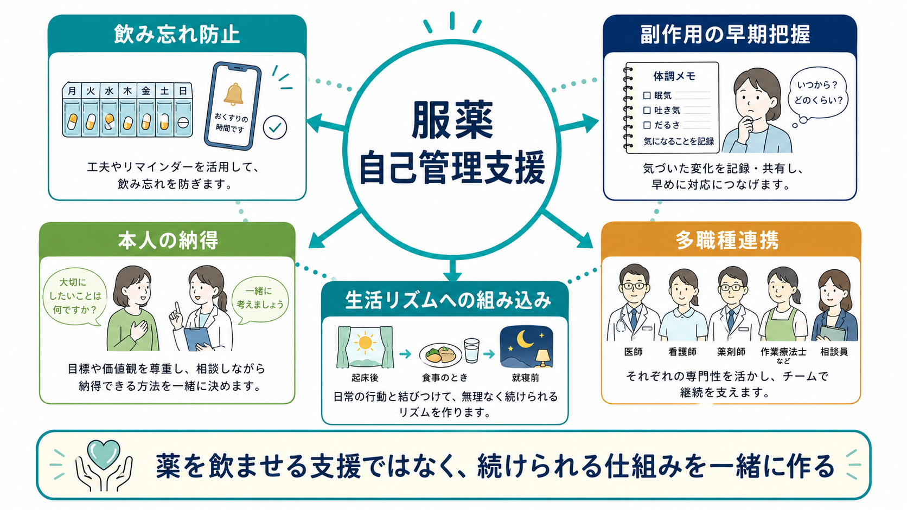
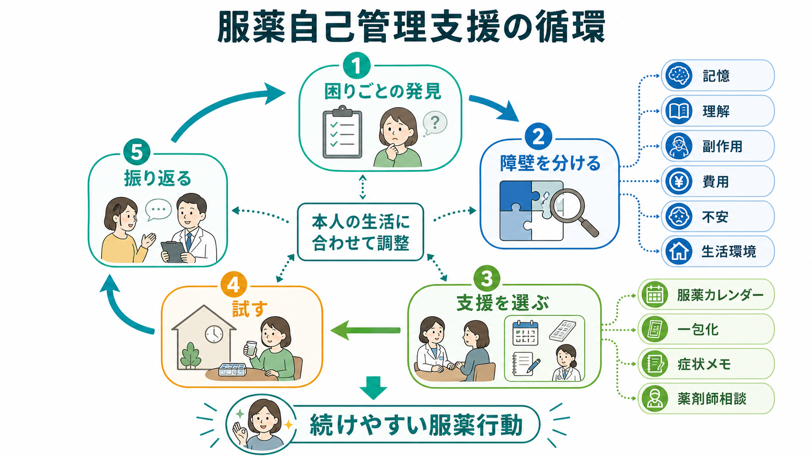

# 服薬自己管理支援とは何か

## 要点

- 服薬自己管理支援は、本人に薬を「飲ませる」支援ではなく、本人が薬の意味・負担・副作用・生活上の障壁を理解し、続けられる形へ調整する支援である。
- 飲み忘れは、意志の弱さだけでは説明できない。記憶、認知機能、生活リズム、薬の複雑さ、副作用、費用、家族関係、治療への納得感が重なる[1][2]。
- 有効な支援は単一のリマインダーだけでなく、説明、共同意思決定、服薬カレンダー、一包化、薬剤師相談、副作用メモ、訪問支援を組み合わせて作る[2][3][4]。
- 副作用把握は、服薬中断を防ぐためだけでなく、本人が安心して治療を続けるための安全文化である[2][7]。
- 精神科・高齢者・多疾患併存では、服薬支援を[[精神科薬物療法とは何か]]、[[高齢者の薬物療法では何に注意するか]]、[[訪問看護は精神科で何を支えるのか]]と接続して考える必要がある。

## この記事で答える問い

1. 服薬自己管理支援は、単なる服薬確認や服薬指導と何が違うのか。
2. 飲み忘れ、防げない中断、副作用の言い出しにくさは、どのような仕組みで起きるのか。
3. 本人の納得を損なわずに、具体的な服薬行動を支えるには何をするのか。
4. 臨床・研究では、どのようなアウトカムを見ればよいのか。

## まず結論

服薬自己管理支援とは、薬を生活の中で扱える形にするための協働的な支援である。支援者の役割は「飲めているか」を監視することではなく、本人が何に困っているかを一緒に見つけ、薬の必要性と不安を話し合い、飲み方・保管・記録・相談先を具体化し、うまくいかなければ調整することである。

WHO は、長期治療のアドヒアランスを、患者要因だけでなく、医療システム、疾患、治療内容、社会経済的条件が関わる多次元の問題として整理している[1]。NICE も、薬の処方や見直しでは、本人の信念、懸念、希望、薬を使う現実的な困難を非判断的に尋ねることを推奨している[2]。したがって、服薬自己管理支援は「患者教育」だけで完結しない。生活支援、薬局、訪問看護、家族支援、共同意思決定を含む小さなシステムづくりである。

## 背景

薬物療法は、処方された時点ではまだ治療になっていない。薬が本人の生活の中で理解され、使われ、観察され、必要に応じて相談されて初めて、治療計画として機能する。長期疾患では、推奨通りに薬が使われないことは珍しくなく、健康アウトカムや医療費にも影響する[1][2]。

ただし、この問題を「本人が言うことを聞かない」と捉えると支援は失敗しやすい。飲み忘れには、朝食を食べない、夜勤がある、認知機能が落ちている、薬が多すぎる、外出先に持っていけない、眠気や体重増加がつらい、薬を飲むこと自体が病気の烙印のように感じられる、家族に知られたくない、といった具体的な事情がある。

精神科では、[[薬物療法のアドヒアランスをどう支えるか]]で扱うように、症状、病識、スティグマ、副作用、物質使用、家族関係、治療同盟が絡みやすい。高齢者では、ポリファーマシー、視力低下、手指の巧緻性、嚥下、認知機能、複数医療機関の処方が問題になる。どちらの場合も、服薬自己管理支援は「薬の説明」ではなく、生活機能の支援として位置づく。

## 基本概念

### アドヒアランス、コンコーダンス、自己管理

アドヒアランスは、本人の服薬行動が医療者と合意した推奨にどの程度一致するかを指す概念である[2]。この定義では、単に命令に従うことではなく、合意が前提になる。コンコーダンスはさらに、本人と医療者が薬の意味、利益、不利益、価値観をすり合わせる関係性を強調する。

自己管理は、本人がすべてを一人で背負うことではない。薬の名前を暗記することでも、支援なしで完璧に飲むことでもない。自己管理とは、本人が「何のために飲むのか」「どの変化に注意するのか」「困ったとき誰に相談するのか」を、自分の生活の中で使える形にすることである。

### 意図的中断と非意図的中断

飲めない理由は、大きく2つに分けられる。非意図的中断は、忘れる、手順が複雑、薬が切れる、受診に行けない、文字が読みにくい、管理が難しいといった実行上の困難である。意図的中断は、副作用がつらい、必要性に納得できない、依存が怖い、人格が変わる気がする、周囲に知られたくない、といった判断や感情が関わる。

この区別は責めるためではなく、支援を合わせるために使う。非意図的中断には、環境調整、リマインダー、服薬カレンダー、一包化、処方日数の調整が役立ちやすい。意図的中断には、副作用評価、リスク・ベネフィットの共有、選択肢の比較、[[心理教育とは何か|心理教育]]、共同意思決定が必要になる[2][8]。

## 仕組み

服薬自己管理支援の中心は、次の循環である。

1. 困りごとの発見: 飲めているかだけでなく、飲めない日、飲みたくない日、飲んだ後の体調変化を尋ねる。
2. 障壁を分ける: 記憶、理解、副作用、費用、生活環境、不安、対人関係に分けて見る。
3. 支援を選ぶ: 服薬カレンダー、一包化、リマインダー、薬剤師相談、症状メモ、家族・訪問看護の関与を組み合わせる。
4. 試す: 本人の生活リズムに合わせて、まず小さく実行する。
5. 振り返る: うまくいった点と負担を見直し、次の処方・支援計画へ戻す。

### 飲み忘れ防止

飲み忘れ対策では、本人の一日の流れに薬を結びつける。起床、歯磨き、朝食、就寝前、訪問看護、デイケア通所など、すでにある行動を手がかりにする。スマートフォン通知、服薬カレンダー、ピルケース、見える場所への保管、一包化は有用だが、本人が実際に使えることが前提である[4]。

重要なのは、支援具を増やす前に、薬の回数や時間が本当にその人の生活に合っているかを見直すことである。複雑な処方、複数医療機関からの重複処方、飲みにくい剤形、食事との関係が混乱を生む場合、[[薬物相互作用とは何か]]や処方全体の見直しが必要になる[5][6]。

### 副作用把握

副作用把握は、「副作用が出たらやめる」ためではなく、本人が早く相談できるようにするための準備である。NICE は、薬について本人の懸念や経験を尋ね、薬を使う利益とリスクを話し合うことを重視している[2]。PMDA も、患者向け医薬品ガイドや重篤副作用疾患別対応マニュアルを通じて、患者が副作用の初期症状を理解し相談につなげるための情報を提供している[7]。

実践では、すべての副作用を一度に説明しすぎるより、次のように階層化すると使いやすい。

| 観点 | 例 | 支援の焦点 |
|---|---|---|
| よくあるが軽いもの | 眠気、口渇、便秘、軽い胃部不快感 | 生活上の対処と相談目安を共有する |
| 生活に影響しやすいもの | 体重増加、性機能障害、日中の鎮静、アカシジア | 中断前に相談できる言葉を作る |
| まれだが重要なもの | 強いアレルギー症状、セロトニン症候群、悪性症候群、重い出血など | 緊急相談・受診の目安を明確にする |
| 長期モニタリングが必要なもの | 代謝副作用、腎機能、肝機能、血球、甲状腺機能など | 検査予定と意味を共有する |

精神科薬物療法では、眠気、体重増加、錐体外路症状、アカシジア、性機能障害、離脱・中止症状などが、服薬継続と生活の質に直結する。本人が「薬が合わない」と言ったとき、支援者は説得より先に、どの症状がいつから、どの程度、生活の何を妨げているかを確認する。

### 本人の納得

本人の納得は、説明の量だけでは生まれない。本人が「この薬で何を守りたいのか」「何が心配なのか」「何なら試せるのか」を言葉にできることが重要である。NICE の共同意思決定ガイドラインは、治療やケアの選択を本人と専門職が一緒に行い、エビデンスだけでなく本人の価値観、希望、生活状況を扱うことを重視している[8]。

服薬支援で使いやすい問いは、次のようなものである。

- 「薬を飲んでいて、助かっていることと困っていることを分けると何がありますか」
- 「飲み忘れと、あえて飲まなかった日は分けると、どちらが多いですか」
- 「この副作用だけは避けたい、というものはありますか」
- 「薬を続けるうえで、時間、費用、家族、仕事、学校のどれが一番負担ですか」
- 「薬を減らしたい、やめたいと思うとしたら、どんな理由が大きいですか」

## 図解

服薬自己管理支援は、支援方法を一律に当てはめるのではなく、困りごとに合わせて選ぶ。

| 支援方法 | 向いている困りごと | 注意点 |
|---|---|---|
| 服薬カレンダー・ピルケース | 飲み忘れ、曜日や時間の混乱 | 置き場所、確認方法、補充する人を決める |
| 一包化 | 薬の種類が多い、錠剤の管理が難しい | 処方変更時に薬局と情報共有する |
| リマインダー | スマートフォンを日常的に使う | 通知疲れ、プライバシー、夜勤などを確認する |
| 症状・副作用メモ | 体調変化を診察で説明しにくい | 緊急症状は記録より相談を優先する |
| 薬剤師相談・ブラウンバッグレビュー | 複数医療機関、残薬、重複、相互作用が疑われる | すべての薬、サプリ、市販薬を持参する |
| 訪問看護・家族支援 | 生活リズム、認知機能、孤立、再発サインが関わる | 本人の同意とプライバシーを前提にする |

## 臨床・研究との接続

臨床では、服薬自己管理支援を「服薬率を上げる介入」とだけ見ないほうがよい。Cochrane レビューでは、アドヒアランス改善介入の効果は一貫して大きいわけではなく、慢性疾患では複合的で継続的な支援が必要になりやすいことが示されている[3]。つまり、支援具を渡すだけ、説明を一回行うだけでは不十分になりやすい。

評価指標は複数に分ける。

| 評価領域 | 具体例 |
|---|---|
| 行動 | 服薬日数、飲み忘れ回数、残薬、受診継続 |
| 安全 | 副作用の早期相談、相互作用の把握、重複処方の減少 |
| 理解 | 薬の目的、相談すべき症状、飲み忘れ時の対応の理解 |
| 納得 | 薬への懸念、必要性の認識、選択肢の理解 |
| 生活 | 睡眠、活動、仕事・学業、家族関係、外出、生活の質 |
| 支援体制 | 薬局、主治医、訪問看護、家族、相談支援との情報共有 |

医療安全の文脈では、薬剤照合も重要である。AHRQ の MATCH toolkit は、医療機関間や退院時の薬剤情報の不一致を減らすため、薬剤照合を標準化することを重視している[5]。日本の「患者のための薬局ビジョン」も、薬局が服薬情報を一元的・継続的に把握し、薬学的管理・指導を行う方向性を示している[6]。服薬自己管理支援は、本人の努力だけでなく、情報が切れない仕組みによって支えられる。

## よくある誤解

### 誤解1: 飲めないのは本人の意志が弱いからである

飲み忘れや中断は、記憶、処方の複雑さ、副作用、費用、治療への不信、生活環境などが関わる。意志だけに帰属すると、実行可能な支援を見落とす[1][2]。

### 誤解2: 副作用を説明すると、怖がって飲まなくなる

副作用を話さないほうが安全というわけではない。説明が脅しのようになると不安は増えるが、起こりやすい症状、早めに相談すべき症状、緊急対応が必要な症状を分けて共有すると、本人は異変を相談しやすくなる[2][7]。

### 誤解3: リマインダーを入れれば解決する

リマインダーは、忘れやすさが主な障壁なら役立つ。しかし、眠気がつらい、薬に納得していない、薬が多すぎる、薬局に行けない、家族に知られたくない場合には、通知だけでは解決しない。

### 誤解4: 自己管理とは、支援を減らすことである

自己管理は孤立した自立ではない。本人が自分で扱える範囲を広げるために、薬剤師、医師、看護師、家族、相談支援が必要なところで関わる。これは[[リカバリー志向支援とは何か]]とも重なる。

## 関連ノート

- [[薬物療法のアドヒアランスをどう支えるか]]
- [[精神科薬物療法とは何か]]
- [[薬物相互作用とは何か]]
- [[高齢者の薬物療法では何に注意するか]]
- [[心理教育とは何か]]
- [[訪問看護は精神科で何を支えるのか]]
- [[リカバリー志向支援とは何か]]

## MOC更新候補

- `content/00_MOC/` 配下の臨床実践・薬物療法・生活支援系 MOC に追加候補。
- 並列作業との衝突を避けるため、本ジョブでは MOC 本体は更新しない。

## 理解チェック

1. 服薬自己管理支援が「服薬確認」だけでは不十分な理由を説明できるか。
2. 意図的中断と非意図的中断を分けると、支援方法はどう変わるか。
3. 副作用説明を、本人を怖がらせる説明ではなく相談しやすくする説明にするには何を分ければよいか。
4. 服薬カレンダー、一包化、薬剤師相談、訪問看護は、それぞれどの困りごとに向いているか。
5. 服薬自己管理支援を研究評価するとき、服薬率以外にどのアウトカムを見るべきか。

## 未解決問題

- デジタルリマインダーや服薬アプリは、どの患者群・疾患・支援体制で長期的に効果を持つのか。
- 服薬率を高める支援と、本人の価値観・副作用負担・減薬希望を尊重する支援を、どの指標で同時に評価するのか。
- 精神科訪問看護、薬局、主治医、家族が関わる場合、どの情報を誰がどこまで共有するのが安全で権利尊重的か。

## 参考文献

[1] World Health Organization. (2003). *Adherence to long-term therapies: Evidence for action*. https://iris.who.int/handle/10665/42682

[2] National Institute for Health and Care Excellence. (2009). *Medicines adherence: Involving patients in decisions about prescribed medicines and supporting adherence (CG76)*. https://www.nice.org.uk/guidance/cg76

[3] Nieuwlaat, R., Wilczynski, N., Navarro, T., et al. (2014). Interventions for enhancing medication adherence. *Cochrane Database of Systematic Reviews*, CD000011. https://doi.org/10.1002/14651858.CD000011.pub4

[4] Agency for Healthcare Research and Quality. (2024). *Health Literacy Universal Precautions Toolkit, 3rd Edition: Tool 16, Help Patients Remember How and When to Take Their Medicine*. https://www.ahrq.gov/health-literacy/improve/precautions/tool16.html

[5] Agency for Healthcare Research and Quality. (2012). *Medications at Transitions and Clinical Handoffs (MATCH) Toolkit for Medication Reconciliation*. https://www.ahrq.gov/patient-safety/settings/hospital/match/index.html

[6] 厚生労働省. (2015). 『患者のための薬局ビジョン』. https://www.mhlw.go.jp/file/04-Houdouhappyou-11121000-Iyakushokuhinkyoku-Soumuka/vision_1.pdf

[7] 医薬品医療機器総合機構（PMDA）. 『患者向医薬品ガイド』および『重篤副作用疾患別対応マニュアル（患者・一般の方向け）』. https://www.pmda.go.jp/safety/info-services/drugs/items-information/guide-for-patients/0001.html ; https://www.pmda.go.jp/safety/info-services/drugs/adr-info/manuals-for-public/0001.html

[8] National Institute for Health and Care Excellence. (2021). *Shared decision making (NG197)*. https://www.nice.org.uk/guidance/ng197
