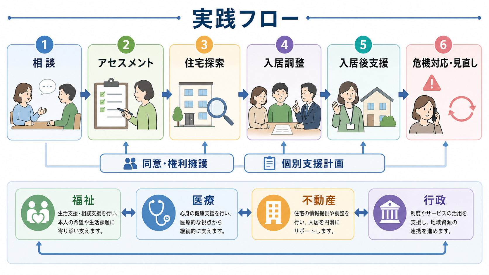

# 生活リズム支援とは何か

## 要点

- 生活リズム支援は、睡眠、起床、食事、活動、服薬、通所・通勤、人との予定を「毎日まったく同じ」にする技法ではなく、本人が続けられる範囲で時刻と順序の見通しを作る支援である。
- 気分障害、とくに[[双極性障害とは何か]]では、睡眠覚醒や社会的リズムの乱れが気分エピソードの誘因になりうるという社会的 zeitgeber 理論と、対人関係・社会リズム療法 IPSRT の知見が背景にある [1], [2], [3]。
- 支援の中心は「早寝早起きを命じること」ではなく、本人の価値、症状、体力、仕事・学業・家庭役割に合わせて、小さく測定できるリズムを作り、変化を早く見つけることである。
- 医療・福祉の現場では、[[精神科リハビリテーションとは何か]]、[[訪問看護は精神科で何を支えるのか]]、[[デイケアとは何か]]、[[ケースマネジメントとは何か]]、[[作業療法は精神科で何をするのか]]と接続して使われる。

## この記事で答える問い

- 生活リズム支援は何を整える支援なのか。
- 睡眠、食事、活動、社会的リズムは、なぜ気分や再発予防と関係するのか。
- 現場では、どのように評価し、目標を立て、記録し、調整するのか。
- 生活リズム支援について、どのような誤解を避けるべきか。

## まず結論

生活リズム支援とは、本人の暮らしのなかで、睡眠・起床、食事、活動、休息、人との接触、通院・服薬、仕事や学校などの「時刻手がかり」を整え、気分や体調の波を見えやすくする支援である。目的は、規則正しい生活そのものを道徳的に良いものとして押しつけることではなく、[[精神疾患と生活リズム障害はどう関係するのか]]を踏まえて、再発リスクを下げ、生活機能を回復し、本人が望む役割を続けやすくすることである。

この考え方の理論的背景には、社会的 zeitgeber 理論がある。zeitgeber とは、光、食事、仕事、人との約束など、体内時計を同調させる外的手がかりを指す。Ehlers らは、生活上の出来事が社会的リズムを乱し、それが生物学的リズムの不安定化を介して気分エピソードを誘発しうるという仮説を提案した [1]。その後のレビューも、社会的リズムの乱れと気分障害の関係を支持しつつ、証拠の強さや因果方向には限界があると整理している [2]。

臨床的には、IPSRT がこの考え方を体系化した代表例である。IPSRT は、対人関係上のストレス、服薬アドヒアランス、睡眠・食事・活動などの日課を扱い、双極症の気分安定と再発予防を狙う心理社会的介入として開発された [3], [4]。ただし、生活リズム支援は IPSRT そのものに限られない。訪問看護、デイケア、作業療法、ケースマネジメント、家族支援、就労支援などでも、同じ発想を日常的な支援計画に落とし込める。

## 背景

精神科臨床で「生活リズムが乱れている」と言うと、しばしば睡眠だけが注目される。しかし実際には、睡眠は単独で乱れるというより、日中活動、食事時刻、対人接触、服薬、外出、画面使用、仕事や学校の予定、家族内役割と絡み合っている。[[睡眠覚醒障害群とは何か]]や[[概日リズム睡眠覚醒障害とは何か]]を理解するうえでも、この全体像が重要になる。

双極症では、睡眠不足や日課の乱れが躁・軽躁・抑うつの早期サインや誘因になることがある。NICE の双極症ガイドラインは、長期管理において、再発の早期警告サイン、誘因、セルフマネジメント、心理社会的介入、再発管理計画を本人と話し合うことを推奨している [6]。CANMAT/ISBD ガイドラインも、双極症の維持期には薬物療法を基盤としつつ、心理教育、CBT、家族焦点化療法、IPSRT などの心理社会的介入を補助的に位置づけている [5]。

また、睡眠そのものについても「時間数」だけではなく「規則性」が健康指標として注目されている。大規模コホート研究では、睡眠覚醒時刻の規則性が死亡リスクと関連し、睡眠時間とは別の重要な指標になりうることが示されている [7]。生活リズム支援は、この「十分な睡眠」と「毎日の時刻の安定」を分けて評価する。

## 基本概念

### 生活リズム

生活リズムとは、1日のなかで繰り返される行動、身体状態、社会的予定のまとまりである。代表的には、起床、光を浴びる時刻、朝食、服薬、通勤・通学・通所、家事、運動、休息、夕食、入浴、就床、人との連絡などが含まれる。

支援上は、すべてを一度に整えようとしない。まず、本人の症状変動に最も関係しやすい「アンカー」を探す。たとえば、起床時刻、最初の食事、外に出る時刻、服薬時刻、人と話す予定、就床前の画面使用などである。

### 社会的リズム

社会的リズムとは、他者や社会制度との関係によって作られる時間構造である。授業、勤務、デイケア、訪問看護、家族との食事、友人との約束、地域活動、通院予約などは、体内時計だけでなく、自己効力感や役割感にも影響する。

IPSRT では、睡眠・起床、食事、活動、人との接触などを記録し、変動しやすいリズムを特定する [3], [4]。ここで重要なのは、「人に会えばよい」という単純な助言ではなく、本人にとって安定化に役立つ接触と、負荷が高すぎる接触を区別することである。これは[[社会的支援は健康にどう影響するのか]]ともつながる。

### 再発予防

生活リズム支援は、再発予防を「症状が悪化してから対応すること」ではなく、「悪化の前に変化を検出し、支援量を調整すること」として捉える。起床が遅れる、眠らなくても活動できる感じがする、食事が抜ける、予定を詰め込みすぎる、人との連絡が急に増える・減る、服薬や通院が崩れるといった変化は、早期サインの一部になりうる。

ただし、生活リズムの乱れは原因にも結果にもなりうる。したがって、「リズムが乱れたから再発した」と単純化せず、症状、ストレス、身体疾患、薬物・アルコール、勤務形態、家庭状況、経済的制約などを含めて評価する。

## 仕組み

生活リズム支援の中心メカニズムは、外的手がかりを安定させることで、概日リズム、睡眠覚醒、活動量、気分の変化を見えやすくすることである。

1. 光、食事、人との予定、仕事や通所などが、社会的時刻手がかりになる。
2. 手がかりが極端に揺れにくくなると、起床、食事、活動、休息の予測可能性が上がる。
3. 睡眠覚醒と日中活動が安定すると、気分・注意・意欲・身体疲労の変化を記録しやすくなる。
4. 記録から、本人固有の早期サインを見つけやすくなる。
5. 早期サインに合わせて、活動量、休息、通院、服薬相談、家族・支援者との連絡を調整できる。

この仕組みは、双極症だけでなく、うつ病、統合失調症、発達特性をもつ人の生活支援、慢性身体疾患を伴う精神科ケアにも応用できる。ただし、疾患ごとのエビデンスの厚みは異なる。双極症では IPSRT や心理教育の研究が比較的多い一方、他の領域では、生活リズム支援単独の効果を切り出す研究は限られる。

## 図解

実践では、次のような小さな循環として扱うと使いやすい。

| 段階 | 支援者が見ること | 本人と決めること |
|---|---|---|
| 観察 | 起床、就床、食事、活動、人との接触、服薬、気分の変化 | 何を記録すると負担が少ないか |
| 小さな目標 | 一番崩れやすいアンカー | 起床時刻を30分以内にする、朝食だけ固定するなど |
| 記録 | 生活と気分の同時変化 | 紙、スマホ、カレンダー、訪問時の聞き取り |
| 振り返り | うまくいった条件と崩れた条件 | 本人のせいにせず、環境と支援量を調整する |
| 再発予防 | 早期サイン、連絡先、受診目安 | どの変化で誰に相談するか |

## 臨床・研究との接続

### 双極症と IPSRT

IPSRT は、双極症をもつ人の再発予防と気分安定を目的に、対人関係のストレスと社会的リズムの安定化を同時に扱う。Frank らの2年追跡研究では、急性期に IPSRT を受けた群で、維持期の気分エピソード再発までの期間が延びることが報告された [4]。また、IPSRT の解説論文は、双極症では服薬不遵守、ストレスフルなライフイベント、社会的リズムの乱れが再発と関係しやすい問題領域であり、安定した日課が寛解維持に関係すると説明している [3]。

CANMAT/ISBD 2018 は、IPSRT を維持期・双極抑うつ期の補助的心理社会的介入として位置づける一方、証拠量には限界があり、心理教育などと組み合わせて個別のニーズに応じて選ぶべきだと整理している [5]。したがって、生活リズム支援を語るときは、「IPSRT は万能である」ではなく、「社会的リズムを扱う代表的な構造化介入であり、一般支援にも応用できる発想を含む」と理解するのが適切である。

### 睡眠支援との違い

[[睡眠衛生指導とは何か]]は、睡眠環境、カフェイン、寝床での行動、就床前の刺激などを扱う。生活リズム支援はそれを含むが、より広い。日中活動が少なすぎる、昼寝が長い、夜間に家事をまとめて行う、孤立して予定がない、逆に予定を詰め込みすぎる、といった生活全体の時間構造を扱う。

睡眠支援では、睡眠時間、睡眠の質、起床時刻の安定、日中活動、休息の取り方を分けて扱う。精神科支援では、単に「十分に寝ましょう」と言っても、抑うつ、不安、躁状態、疼痛、夜勤、育児、経済的問題によって実行できないことが多いからである。

### 活動支援との接続

身体活動は、心身の健康に関わる重要な生活要素である。WHO の身体活動・座位行動ガイドラインは、成人に対して週150〜300分の中強度有酸素活動または同等量の活動を推奨し、少しの活動でも何もしないより有益であると整理している [8]。生活リズム支援では、運動を「根性で増やす課題」ではなく、睡眠、食事、気分、疲労、社会参加と連動する活動リズムとして扱う。

たとえば、抑うつが強い時期には、外出や運動を増やしすぎるより、起床後にカーテンを開ける、短時間だけ外気に触れる、昼食前に5分歩くといった小さな行動から始める。軽躁傾向がある場合は、むしろ活動量を増やすことより、休息を予定に入れる、夜の予定を減らす、刺激の強い活動を遅い時間に入れないことが重要になる。

### 地域生活支援との接続

生活リズム支援は、診察室だけでは完結しにくい。生活の場で観察し、調整し、続ける支援が必要である。[[訪問看護は精神科で何を支えるのか]]では、睡眠、服薬、食事、清潔、家事、金銭管理、孤立、家族関係などを継続的に見られる。[[デイケアとは何か]]や[[作業療法は精神科で何をするのか]]は、日中の居場所、活動量、対人接触、役割経験を作る場になる。[[ケースマネジメントとは何か]]は、医療、福祉、就労、家族、住まいをつなぎ、リズムを崩す環境要因に介入する。

## よくある誤解

### 誤解1：早起きさせればよい

早起きは役立つことがあるが、睡眠時間を削ってまで早起きさせると逆効果になりうる。とくに双極症では睡眠不足が気分高揚や焦燥を悪化させることがある。まずは総睡眠時間、起床時刻、就床時刻、昼寝、日中活動、症状の関係を見て、無理のない幅で整える。

### 誤解2：本人の意志が弱いから乱れる

生活リズムは意志だけで決まらない。抑うつ、幻聴、不安、疼痛、薬の副作用、夜勤、家族介護、貧困、住環境、孤立、スマートフォン利用、地域資源の少なさなどが関わる。支援では、本人を責めるより、リズムを崩している条件を具体的に分解する。

### 誤解3：毎日同じ時刻でなければ意味がない

現実の生活では、休日、通院、仕事、育児、体調不良で時刻は揺れる。重要なのは完全な固定ではなく、本人にとって崩れやすいアンカーを把握し、許容範囲を決め、崩れたときの戻し方を用意することである。

### 誤解4：生活リズム支援だけで再発を防げる

生活リズム支援は重要だが、薬物療法、心理療法、家族支援、危機対応、身体疾患管理、社会資源調整の代替ではない。NICE も CANMAT/ISBD も、双極症の長期管理では薬物療法と心理社会的介入を組み合わせ、早期サインと再発管理計画を扱うことを重視している [5], [6]。

## 関連ノート

- [[精神疾患と生活リズム障害はどう関係するのか]]
- [[概日リズムの乱れは精神疾患にどう関わるのか]]
- [[概日リズム睡眠覚醒障害とは何か]]
- [[睡眠衛生指導とは何か]]
- [[睡眠覚醒リズム療法とは何か]]
- [[双極性障害とは何か]]
- [[双極I型障害とは何か]]
- [[双極II型障害とは何か]]
- [[うつ病とは何か]]
- [[ライフスパンで見る再発予防とは何か]]
- [[精神科リハビリテーションとは何か]]
- [[訪問看護は精神科で何を支えるのか]]
- [[デイケアとは何か]]
- [[ケースマネジメントとは何か]]
- [[作業療法は精神科で何をするのか]]
- [[生活技能訓練SSTとは何か]]
- [[リカバリー志向支援とは何か]]
- [[社会的支援は健康にどう影響するのか]]

## MOC更新候補

- `content/00_MOC/` 配下の臨床実践・治療、精神科リハビリテーション、睡眠・概日リズム、双極症、再発予防に関する MOC があれば、本記事へのリンクを追加候補にする。
- 並列編集を避けるため、このジョブでは MOC 本体は更新しない。

## 理解チェック

1. 生活リズム支援で扱う「リズム」は、睡眠以外に何を含むか。
2. 社会的 zeitgeber 理論では、生活上の出来事と気分エピソードはどのようにつながると考えられているか。
3. 双極症の生活リズム支援で、睡眠不足や予定の詰め込みに注意が必要なのはなぜか。
4. 「早起きさせること」と「生活リズム支援」は何が違うか。
5. 訪問看護、デイケア、作業療法、ケースマネジメントは、それぞれ生活リズム支援のどの部分を支えうるか。

## 未解決問題

- 生活リズム支援のどの要素が、どの疾患・年齢層・生活環境で最も効果を持つのかは、まだ十分に切り分けられていない。
- 睡眠規則性、食事時刻、活動量、社会的接触を、臨床で負担少なく測定する方法には改善の余地がある。
- 夜勤、育児、介護、貧困、住居不安定など、規則的な生活を取りにくい条件をもつ人に、どのような現実的支援が有効かをさらに検討する必要がある。

## 参考文献

[1] Ehlers, C. L., Frank, E., & Kupfer, D. J. (1988). Social zeitgebers and biological rhythms: A unified approach to understanding the etiology of depression. *Archives of General Psychiatry, 45*(10), 948-952. https://doi.org/10.1001/archpsyc.1988.01800340076012

[2] Grandin, L. D., Alloy, L. B., & Abramson, L. Y. (2006). The social zeitgeber theory, circadian rhythms, and mood disorders: Review and evaluation. *Clinical Psychology Review, 26*(6), 679-694. https://doi.org/10.1016/j.cpr.2006.07.001

[3] Frank, E., Swartz, H. A., & Boland, E. (2007). Interpersonal and social rhythm therapy: An intervention addressing rhythm dysregulation in bipolar disorder. *Dialogues in Clinical Neuroscience, 9*(3), 325-332. https://pmc.ncbi.nlm.nih.gov/articles/PMC3202498/

[4] Frank, E., Kupfer, D. J., Thase, M. E., et al. (2005). Two-year outcomes for interpersonal and social rhythm therapy in individuals with bipolar I disorder. *Archives of General Psychiatry, 62*(9), 996-1004. https://doi.org/10.1001/archpsyc.62.9.996

[5] Yatham, L. N., Kennedy, S. H., Parikh, S. V., et al. (2018). Canadian Network for Mood and Anxiety Treatments (CANMAT) and International Society for Bipolar Disorders (ISBD) 2018 guidelines for the management of patients with bipolar disorder. *Bipolar Disorders, 20*(2), 97-170. https://doi.org/10.1111/bdi.12609

[6] National Institute for Health and Care Excellence. (2025). *Bipolar disorder: assessment and management* (NICE Clinical Guideline CG185, updated 2 September 2025). https://www.nice.org.uk/guidance/cg185

[7] Windred, D. P., Burns, A. C., Lane, J. M., et al. (2024). Sleep regularity is a stronger predictor of mortality risk than sleep duration: A prospective cohort study. *Sleep, 47*(1), zsad253. https://doi.org/10.1093/sleep/zsad253

[8] World Health Organization. (2020). *WHO guidelines on physical activity and sedentary behaviour*. https://iris.who.int/handle/10665/336656
