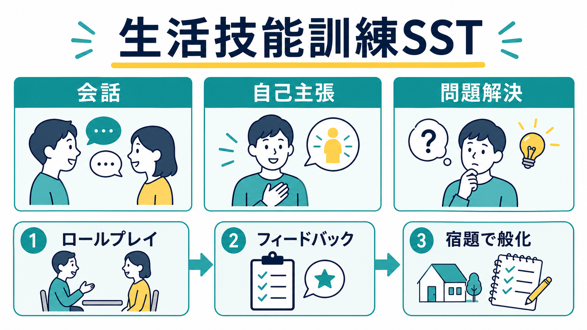
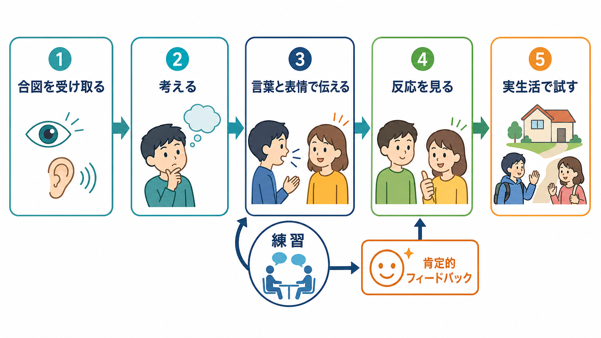
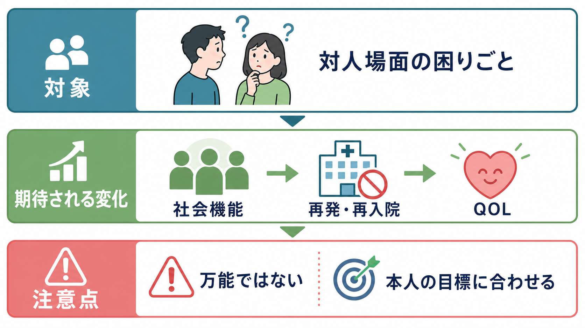

# 生活技能訓練SSTとは何か

## 要点

- 生活技能訓練SSTは、会話、頼み方、断り方、感情の伝え方、問題解決などを、具体的な対人場面で練習する心理社会的リハビリテーションである[1][2]。
- 中核は「説明を聞く」ことではなく、場面を選び、手本を見る、ロールプレイする、肯定的フィードバックを受ける、宿題で実生活に持ち出す、という反復練習にある[3][4]。
- 統合失調症を中心に研究され、社会的スキル、社会機能、陰性症状、再発などへの効果が検討されてきた。ただし、効果の大きさや確実性はアウトカムと比較条件によって異なる[5][6]。
- SSTは「性格を変える訓練」ではない。本人が望む生活場面で使える選択肢を増やし、[[社会的認知とは何か]]や[[認知的柔軟性とは何か]]と接続する実践的な学習支援として理解するとよい。

## この記事で答える問い

1. SSTは何を訓練する支援なのか。
2. 会話・自己主張・問題解決は、どのような手順で練習されるのか。
3. SSTは統合失調症などの精神科リハビリテーションで、どの程度の根拠をもつのか。
4. SSTを使うときに、どのような誤解や限界に注意すべきか。

## まず結論

SSTは、対人場面を「気合い」や「自然な慣れ」だけに任せず、観察可能な行動に分けて練習する方法である。たとえば「相手に頼む」が難しい場合、目標は「もっと社交的になる」ではなく、「相手を見る」「短く用件を言う」「理由を一言添える」「相手の返答を聞く」「断られたときの次の案を出す」といった実行可能な単位に分けられる。

そのためSSTは、個人の内面を評価する場ではなく、本人が困っている場面を安全な練習場に持ち込み、うまくいった点を確認しながら少しずつ試行錯誤する場である[1][3]。薬物療法や心理教育、家族支援、就労支援、地域生活支援と競合するものではなく、[[抗精神病薬とは何か]]などによる症状安定化の上に、生活の具体的な行動レパートリーを増やす支援として位置づけられる。

## 背景

精神疾患、とくに統合失調症では、幻覚や妄想だけでなく、対人場面の読み取り、会話の開始・維持、相手への依頼、拒否、葛藤場面での調整、社会的役割の維持が難しくなることがある。これは本人の努力不足というより、症状、認知機能、[[社会的認知とは何か]]、不安、過去の失敗経験、環境側の理解不足が重なって生じる。

SSTは、こうした困難を「社会生活の中で使う技能」として扱う。日本では「社会的スキル訓練」「ソーシャルスキル・トレーニング」「社会生活技能訓練」「生活技能訓練」などの呼び名があり、精神科領域だけでなく、教育、就労支援、司法・矯正、産業メンタルヘルスなどにも広がっている[1]。国立精神・神経医療研究センターの解説でも、SSTは人との接し方や気持ちの伝え方を習得する訓練として紹介され、少人数グループで日常場面を想定して練習する方法とされている[2]。

## 基本概念

SSTでいう「スキル」は、単なる礼儀作法ではない。相手の表情や声の調子を受け取り、場面の意味を考え、自分の希望や感情を言葉・表情・姿勢で伝え、相手の反応に応じて次の行動を選ぶ一連の行動である[4][7]。

典型的な練習対象には、次のようなものがある。

| 領域 | 例 | ねらい |
|---|---|---|
| 会話 | あいさつ、質問、話題の切り替え、会話の終え方 | 孤立を減らし、関係を始める入口を作る |
| 自己主張 | 頼む、断る、意見を言う、困りごとを伝える | 受け身か攻撃的かの二択ではなく、落ち着いて希望を伝える |
| 問題解決 | 困った場面を整理し、複数案を出し、結果を振り返る | 一つの失敗で諦めず、次の選択肢を増やす |
| 疾病・生活管理 | 服薬相談、症状サインへの対処、支援者への連絡 | 再発予防と地域生活の安定を支える |

重要なのは、SSTが本人の「できない点」を探すだけの評価ではないことである。むしろ、すでにできている行動を見つけ、肯定的フィードバックで強化し、次に試す小さな変更点を一つに絞る。これは、失敗経験の多い人にとって、練習への参加可能性を保つためにも重要である。

## 仕組み

SSTの学習過程は、行動療法と認知行動療法に近い。行動は、説明、モデリング、ロールプレイ、フィードバック、反復、宿題によって形作られる[1][3]。同時に、対人場面の受け取り方や考え方も扱うため、認知的な要素も含む。

基本的な流れは次のように整理できる。

1. 場面を選ぶ  
   本人が実際に困っている場面を選ぶ。例は「主治医に副作用を相談する」「職場で休みを依頼する」「家族に一人の時間がほしいと伝える」などである。

2. 目標を小さくする  
   「うまく話す」ではなく、「最初に用件を一文で言う」「相手の返答を最後まで聞く」など、観察できる行動に分ける。

3. 手本を見る  
   支援者やメンバーが、良い例を短く示す。手本は完璧な演技ではなく、本人が真似できる範囲で示す。

4. ロールプレイする  
   本人が相手役に向かって練習する。表情、声量、距離、言葉の選び方、間の取り方などを実際に試す。

5. フィードバックする  
   まず良かった点を具体的に返す。次に、改善点を一つ程度に絞って再試行する。

6. 宿題で般化する  
   練習室でできた行動を、家庭、病棟、デイケア、職場、地域生活の中で試す。次回は結果を振り返り、うまくいった条件とうまくいかなかった条件を整理する[4][6]。

この流れは、[[手続き記憶とは何か]]にも近い。知識として「断り方を知っている」だけでは、緊張する場面で使えるとは限らない。繰り返し練習し、身体化された選択肢に近づけることで、実際の場面で取り出しやすくなる。

## 図解

上の図1は、SSTが会話・自己主張・問題解決を扱い、ロールプレイ、フィードバック、宿題で実生活に般化させる全体像を示している。図2は、社会的合図を受け取り、考え、言葉と表情で伝え、反応を見て、実生活で試すという処理の流れを示している。

図3は、SSTの臨床応用をまとめたものである。SSTは社会機能やQOLの改善を目指すが、単独で症状、再発、生活問題をすべて解決するものではない。本人の目標、症状の状態、認知機能、環境調整、支援資源と組み合わせて考える必要がある。

## 臨床・研究との接続

SSTの研究は、統合失調症を中心に発展してきた。KurtzとMueserのメタ分析では、SSTは教材理解や技能の実演に近いアウトカムで大きめの効果、社会・生活技能や地域機能、陰性症状で中等度の効果、全般症状や再発では小さめの効果が報告された[5]。この結果は、SSTがまず「練習した技能」に効きやすく、遠いアウトカムほど他の要因の影響を受けやすいことを示している。

一方、Cochraneレビューでは、標準治療と比べると社会的スキルや再発率などに有利な可能性が示されたが、エビデンスの質は非常に低いと評価され、討論グループとの比較では明確な差が出にくいとされた[6]。したがって、SSTを「根拠がない」と切り捨てるのも、「万能の再発予防法」と見なすのも適切ではない。現時点では、社会的スキルを直接練習する支援として有用性が期待されるが、実施の質、対象者、比較条件、追跡期間によって効果が変わる、と読むのが妥当である。

NICEの統合失調症ガイドラインでは、心理社会的介入の一つとしてSSTが検討されているが、推奨の中心はCBT、家族介入、芸術療法などであり、SSTは文脈依存の介入として扱われる[8]。つまり、SSTは単独パッケージとして一律に処方するより、本人の生活目標、社会機能、支援環境に合わせて組み込む臨床判断が必要になる。

## よくある誤解

### 誤解1: SSTは雑談をうまくする練習である

雑談も対象になりうるが、SSTの範囲はもっと広い。服薬相談、症状悪化時の連絡、断り方、頼み方、葛藤の扱い、就労場面の報告・相談、家族との境界設定など、生活の安全性と自律性に関わる場面も扱う。

### 誤解2: SSTは「正しい話し方」を教え込む

SSTは、支援者が一方的に正解を押しつける方法ではない。本人の目標に照らして、どの言い方なら実行しやすく、相手にも伝わりやすく、本人の価値観に合うかを一緒に検討する。文化、年齢、ジェンダー、職場や家庭の文脈によって、適切な伝え方は変わる[3]。

### 誤解3: SSTだけで社会機能は十分改善する

社会機能は、症状、認知機能、体力、睡眠、薬の副作用、経済状況、住まい、家族関係、職場環境、支援制度に強く左右される。SSTは行動レパートリーを増やす強力な道具になりうるが、必要に応じて[[認知機能検査は何を測っているのか]]、薬物療法、ケースマネジメント、就労支援、家族支援と組み合わせる。

### 誤解4: 練習がうまくできない人には向いていない

むしろ、練習が難しいときこそ、場面設定が大きすぎる、目標が抽象的すぎる、不安が高すぎる、認知負荷が大きすぎる、環境側の要求が強すぎる可能性を考える。SSTでは、練習の単位を小さくし、相手役を調整し、視覚的手がかりや台本を使い、成功しやすい課題から始めることができる。

## 関連ノート

- [[社会的認知とは何か]]
- [[認知的柔軟性とは何か]]
- [[認知機能検査は何を測っているのか]]
- [[手続き記憶とは何か]]
- [[抗精神病薬とは何か]]

今後の作成候補:

- 認知行動療法とは何か
- 心理教育とは何か
- 精神科デイケアとは何か
- リカバリー志向支援とは何か
- 統合失調症の社会機能とは何か

MOC更新候補:

- `content/00_MOC/MOC｜臨床実践・治療.md`
- `content/00_MOC/MOC｜精神医学.md`
- `content/00_MOC/MOC｜発達・愛着・社会心理.md`

## 理解チェック

1. SSTで「スキル」を観察可能な行動に分けるのはなぜか。
2. ロールプレイ後のフィードバックで、改善点より先に良かった点を返す理由は何か。
3. SSTの効果が「練習した技能」に近いアウトカムほど出やすいのはなぜか。
4. SSTを薬物療法、家族支援、就労支援、ケースマネジメントと組み合わせる必要がある場面を一つ挙げよ。

## 参考文献

[1] 一般社団法人SST普及協会. 「SSTとは？」 Japanese Association of Social Skills Training. https://www.jasst.net/

[2] 国立精神・神経医療研究センター 精神保健研究所 地域精神保健・法制度研究部. 「社会生活技能訓練（SST）」こころとくらし. https://cocokura.ncnp.go.jp/recurrence/technique-sst/

[3] Mueser, K. T., Bellack, A. S., Gingerich, S., Agresta, J., & Fulford, D. (2024). *Social Skills Training for Schizophrenia: A Step-by-Step Guide* (3rd ed.). Guilford Press. https://www.guilford.com/books/Social-Skills-Training-for-Schizophrenia/Mueser-Bellack-Gingerich-Agresta/9781462555031

[4] Bellack, A. S., Mueser, K. T., Gingerich, S., & Agresta, J. (2004). *Social Skills Training for Schizophrenia: A Step-by-Step Guide* (2nd ed.). Guilford Press. https://case.edu/socialwork/centerforebp/resources/social-skills-training-schizophrenia-step-step-guide-2nd-edition

[5] Kurtz, M. M., & Mueser, K. T. (2008). A meta-analysis of controlled research on social skills training for schizophrenia. *Journal of Consulting and Clinical Psychology, 76*(3), 491-504. https://doi.org/10.1037/0022-006X.76.3.491

[6] Almerie, M. Q., Okba Al Marhi, M., Jawoosh, M., Alsabbagh, M., Matar, H. E., Maayan, N., & Bergman, H. (2015). Social skills programmes for schizophrenia. *Cochrane Database of Systematic Reviews*, 2015(6), CD009006. https://doi.org/10.1002/14651858.CD009006.pub2

[7] Galderisi, S., et al. (2013). Current approaches to treatments for schizophrenia spectrum disorders, part II: psychosocial interventions and patient-focused perspectives in psychiatric care. *Neuropsychiatric Disease and Treatment, 9*, 1461-1481. https://pmc.ncbi.nlm.nih.gov/articles/PMC3792827/

[8] National Collaborating Centre for Mental Health. (2014). *Psychosis and Schizophrenia in Adults: Treatment and Management* (NICE Clinical Guideline 178). National Institute for Health and Care Excellence. https://www.ncbi.nlm.nih.gov/books/NBK248060/

## 未解決問題

- 日本の地域精神医療、デイケア、就労支援、訪問支援で、どの実施形式がもっとも般化を促すのか。
- SST単独ではなく、認知機能リハビリテーション、家族心理教育、IPS型就労支援、デジタル支援と組み合わせた場合、どの順序と強度がよいのか。
- 統合失調症以外の発達障害、気分障害、不安症、司法・矯正領域、産業領域で、どこまで同じ原理を適用できるのか。
