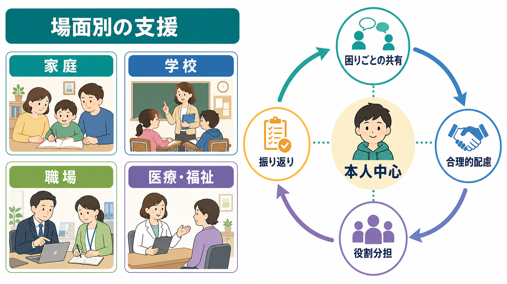
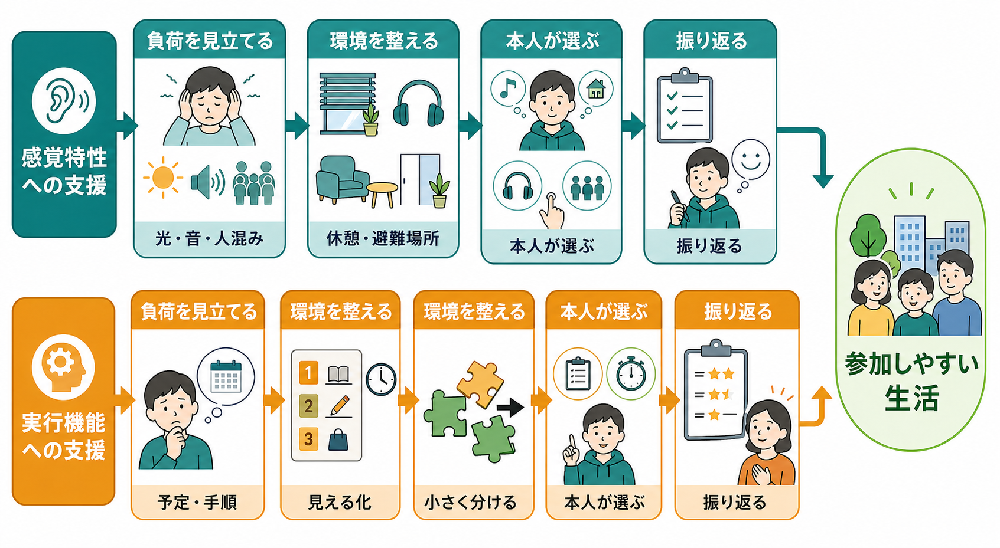

# 発達障害の生活支援とは何か

## 要点

- 発達障害の生活支援は、本人の特性を「治す」ことではなく、生活場面で生じる負荷を見立て、環境調整とスキル支援を組み合わせて参加しやすさを高める実践である[1][2]。
- 支援の中心は、感覚特性、実行機能、対人・コミュニケーションの困難を、家庭・学校・職場・地域の具体的な場面に翻訳することである[2][3]。
- 有効な支援は、本人の希望、予測可能性、選択肢、休憩、視覚的手がかり、課題の分解、合理的配慮、支援者間の役割分担を含む[3][4]。
- 医療者や支援者は、個別診断や治療指示としてではなく、教育・研究・支援計画の観点から、本人中心に調整を設計する必要がある。

## この記事で答える問い

1. 発達障害の生活支援は、治療や訓練と何が違うのか。
2. 感覚過敏・鈍麻、実行機能の困難、対人困難にどう対応するのか。
3. 学校・職場・家庭・福祉サービスでは、どのように合理的配慮とスキル支援を組み合わせるのか。
4. 支援が「本人を変える圧力」にならないために、何を確認すべきか。

## まず結論

発達障害の生活支援とは、診断名から支援を一律に決めることではなく、「この人が、この場面で、何に困っているのか」を本人と一緒に具体化する作業である。たとえば、教室で席を立つ行動は、注意不足だけでなく、音・光・人混みの負荷、予定変更への不安、休憩を申し出る手段の不足、教師とのやりとりの難しさから生じることがある。

したがって支援は、第一に環境側を整える。予定を見える化する、音や光を調整する、休憩場所を作る、課題を小さく分ける、連絡方法を明確にする。第二に、本人が使える選択肢を増やす。助けを求める、予定を確認する、断る、休む、優先順位をつける、振り返る。第三に、家庭・学校・職場・医療福祉が同じ理解で役割分担する[1][4]。

## 背景

発達障害、または神経発達症には、自閉スペクトラム症、ADHD、限局性学習症などが含まれる。これらは生活全体に影響しうるが、困難の現れ方は年齢、知的発達、併存症、家庭環境、学校・職場の要求、社会的理解によって大きく変わる[1][2]。

NICEの自閉スペクトラム症ガイドラインは、支援において本人の強み、ニーズ、生活環境、家族や支援者の役割を評価し、構造化された心理社会的支援や環境調整を検討することを重視している[1][2]。ADHDガイドラインでも、薬物療法だけでなく、環境調整、情報提供、学校や職場での支援、組織化スキルへの介入が重要な位置を占める[3]。

日本では、発達障害者支援法と発達障害者支援センターが、地域における相談、情報提供、関係機関との連携を担う枠組みを作っている[4]。また障害者差別解消法では、行政機関等に加えて事業者にも合理的配慮の提供が義務づけられており、生活支援は法制度上の配慮とも接続する[5]。

## 基本概念

### 環境調整

環境調整とは、本人の努力だけに頼らず、生活場面の要求・刺激・手順・人間関係を調整することである。典型例は、視覚的スケジュール、静かな席、イヤーマフ、照明調整、休憩カード、指示の一文書化、締切の分割、オンライン連絡、曖昧な暗黙ルールの明文化である。

環境調整は「甘やかし」ではない。過剰な感覚負荷や曖昧な要求を減らすことで、本人が本来持つ能力を使いやすくする支援である[2][3]。

### スキル支援

スキル支援とは、本人が生活の中で使える手段を増やすことである。たとえば、助けを求める、予定を確認する、優先順位をつける、感覚負荷が高い場所を避ける、休憩を依頼する、断る、対人場面を振り返る、次回の手順を決めるなどである。

重要なのは、スキルを「できないことの矯正」として扱わないことである。本人が必要性を理解し、自分の言葉で選べる形にするほど、支援は生活に定着しやすい。

### 合理的配慮

合理的配慮は、障害のある人から社会的障壁の除去を必要としている意思表明があった場合に、過重な負担でない範囲で必要かつ合理的な変更や調整を行う考え方である[5]。発達障害の文脈では、試験時間、座席、作業手順、連絡方法、面接形式、休憩、感覚刺激、評価基準の明確化などが論点になりやすい。

合理的配慮は、本人の本質的な目標を下げることではない。障壁を減らし、同じ学習・仕事・生活参加の機会にアクセスしやすくするための調整である。

## 仕組み

### 感覚特性への支援

自閉スペクトラム症では、音、光、匂い、触覚、味、身体感覚などへの過敏・鈍麻が生活上の大きな負荷になることがある[1][2]。支援では、まず「どの刺激が、どの強さ・時間・組み合わせでつらくなるのか」を本人と確認する。次に、刺激そのものを減らす、休憩や避難場所を用意する、予告を増やす、本人が使える対処手段を選ぶ。

感覚支援で避けたいのは、本人のつらさを「慣れればよい」と一律に扱うことである。曝露や練習が役立つ場合もあるが、強すぎる負荷は疲労、不安、パニック、回避を強めうる。生活支援では、本人の同意と安全を前提に、小さく試して振り返る。

### 実行機能への支援

ADHDや自閉スペクトラム症では、開始、切り替え、計画、時間管理、ワーキングメモリ、優先順位づけ、忘れ物、片づけの困難が生活問題として現れやすい[3][6]。ここでは、本人の意志の弱さとして扱うのではなく、課題要求を外部化する。

具体的には、手順をチェックリストにする、タイマーを使う、持ち物の定位置を作る、作業を5分単位に分ける、締切を中間締切に分割する、リマインダーを1つの場所に集約する、支援者と週1回だけ予定を見直す。組織化スキル訓練や行動的介入は、こうした外部化と練習を組み合わせる支援として研究されている[6]。

### 対人・コミュニケーションへの支援

対人困難には、表情や文脈の読み取り、雑談、依頼、断り方、集団での暗黙ルール、誤解された後の修復、相手との距離感などが含まれる。自閉スペクトラム症に対する社会的コミュニケーション支援や社会的スキルグループは一定の有用性が示されているが、効果の大きさや一般化には限界もあり、場面に合わせた支援が必要である[7]。

生活支援では、ロールプレイや[[生活技能訓練SSTとは何か]]のような練習だけで完結させない。本人が実際に困る場面を選び、言い方の選択肢を作り、練習し、実生活で試し、結果を振り返る。対人スキルは「普通にふるまう」ためではなく、本人が安全に希望を伝え、関係を選び、必要な支援につながるために扱う。

### 支援計画の基本フロー

支援計画は、次の流れで作ると実装しやすい。

| 手順 | 見ること | 具体例 |
|---|---|---|
| 1. 困りごとの共有 | 本人が何を変えたいか | 朝の支度、授業中の疲労、会議後の消耗 |
| 2. 障壁の特定 | 感覚、手順、対人、制度、評価 | 音、曖昧な指示、急な予定変更 |
| 3. 環境調整 | 負荷を下げる | 静かな席、視覚予定、休憩、締切分割 |
| 4. スキル支援 | 選択肢を増やす | 依頼文、チェックリスト、振り返り |
| 5. 連携 | 誰が何をするか | 家族、担任、上司、相談支援、医療 |
| 6. 見直し | 合ったか、負担が増えたか | 2週間後に本人と再評価 |

## 図解

図1は、生活支援が家庭・学校・職場・医療福祉をまたいで設計されることを示す。図2は、感覚特性と実行機能の困難を、負荷評価、環境調整、本人の選択、振り返りへつなぐ流れを示す。図3は、合理的配慮を本人の申し出、障壁の特定、対話、調整案、実施・見直しとして扱うことを示す。

## 臨床・研究との接続

臨床では、生活支援は[[作業療法は精神科で何をするのか]]、[[認知リハビリテーションとは何か]]、[[学業支援は精神医療でどう行うか]]、[[就労支援とは何か]]、[[訪問看護は精神科で何を支えるのか]]、[[ケースマネジメントとは何か]]と接続する。本人の生活課題が複数領域にまたがるほど、単一の支援技法よりも、支援者間の共有と役割分担が重要になる。

研究上は、診断カテゴリーだけでなく、感覚処理、実行機能、適応行動、家族負担、学校・職場環境、QOLをアウトカムとして見る必要がある。とくに社会的スキル支援や組織化スキル支援は、介入室内での改善が実生活に一般化するか、本人にとって望ましい参加につながるかを評価しなければならない[6][7]。

薬物療法が必要な場合でも、生活支援は代替物ではなく土台である。たとえばADHDでは、[[ADHD治療薬とは何か]]によって不注意や衝動性が軽減しても、予定管理、環境調整、周囲の理解、失敗後の回復手順は別に設計する必要がある[3]。

## よくある誤解

### 「配慮すると本人が弱くなる」

配慮は本人の機会を減らすものではなく、障壁を減らして力を使いやすくするものである。眼鏡が視力を補うように、視覚予定、静かな席、手順表、休憩は生活参加への足場になる。

### 「スキル訓練をすれば環境調整はいらない」

スキル支援だけでは、強すぎる感覚刺激や曖昧な制度的要求を解決できない。環境調整とスキル支援は対立しない。負荷を下げたうえで、本人が使える選択肢を増やす。

### 「診断名が同じなら支援も同じ」

同じ診断名でも、困りごとの組み合わせは異なる。音がつらい人、予定変更がつらい人、対人疲労が中心の人、朝の開始が難しい人では、支援の優先順位が変わる。

### 「家族や支援者が決めたほうが早い」

短期的には早く見えても、本人の同意と選択がない支援は定着しにくい。本人の言葉、選べる選択肢、試行後の振り返りを入れることが、支援の実効性を高める。

## 関連ノート

- [[生活技能訓練SSTとは何か]]
- [[作業療法は精神科で何をするのか]]
- [[認知リハビリテーションとは何か]]
- [[学業支援は精神医療でどう行うか]]
- [[就労支援とは何か]]
- [[ケースマネジメントとは何か]]
- [[訪問看護は精神科で何を支えるのか]]
- [[ADHD治療薬とは何か]]

### MOC更新候補

- [[MOC｜リハビリ・生活支援]]
- [[MOC｜発達・ライフスパン]]
- [[MOC｜疾患・症候群]]

## 理解チェック

1. 発達障害の生活支援が、本人の性格を変える介入ではない理由を説明できるか。
2. 感覚特性への支援で、環境調整と本人の選択をどう組み合わせるか。
3. 実行機能の困難を、意志の弱さではなく課題要求の外部化として扱う例を3つ挙げられるか。
4. 合理的配慮を進めるとき、本人の意向、過重な負担、見直しをどう確認するか。

## 未解決問題

- 発達障害の生活支援では、介入室内のスキル獲得よりも、家庭・学校・職場での一般化をどう測定するかが課題である。
- 合理的配慮の効果を、本人のQOL、疲労、参加、周囲の負担、制度的実装のバランスで評価する指標はまだ十分に標準化されていない。
- 成人期、高齢期、知的障害や精神疾患を併存するケースでは、支援モデルをどう個別化するかについてさらなる研究が必要である。

## 参考文献

[1] National Institute for Health and Care Excellence. (2012, updated). *Autism spectrum disorder in adults: diagnosis and management (CG142).* https://www.nice.org.uk/guidance/cg142

[2] National Institute for Health and Care Excellence. (2013, updated). *Autism spectrum disorder in under 19s: support and management (CG170).* https://www.nice.org.uk/guidance/cg170

[3] National Institute for Health and Care Excellence. (2018, updated). *Attention deficit hyperactivity disorder: diagnosis and management (NG87).* https://www.nice.org.uk/guidance/ng87

[4] 国立障害者リハビリテーションセンター 発達障害情報・支援センター. 発達障害に関する情報・支援情報. https://www.rehab.go.jp/ddis/

[5] 内閣府. 障害者差別解消法・合理的配慮の提供. https://www8.cao.go.jp/shougai/suishin/sabekai.html

[6] Evans, S. W., Owens, J. S., Wymbs, B. T., & Ray, A. R. (2018). Evidence-based psychosocial treatments for children and adolescents with attention deficit/hyperactivity disorder. *Journal of Clinical Child & Adolescent Psychology, 47*(2), 157-198. https://doi.org/10.1080/15374416.2017.1390757

[7] Gates, J. A., Kang, E., & Lerner, M. D. (2017). Efficacy of group social skills interventions for youth with autism spectrum disorder: A systematic review and meta-analysis. *Clinical Psychology Review, 52*, 164-181. https://doi.org/10.1016/j.cpr.2017.01.006

[8] Centers for Disease Control and Prevention. Treatment and intervention services for autism spectrum disorder. https://www.cdc.gov/autism/treatment/
