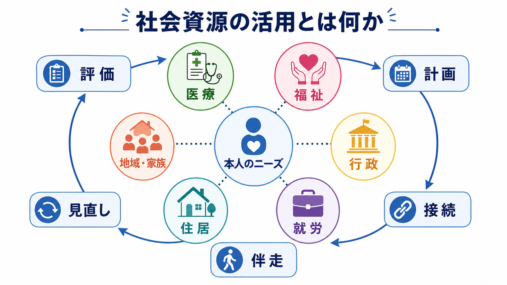
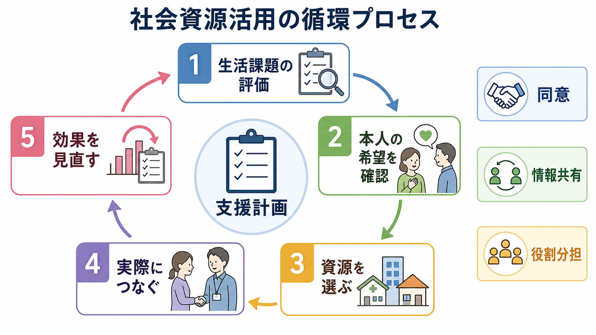
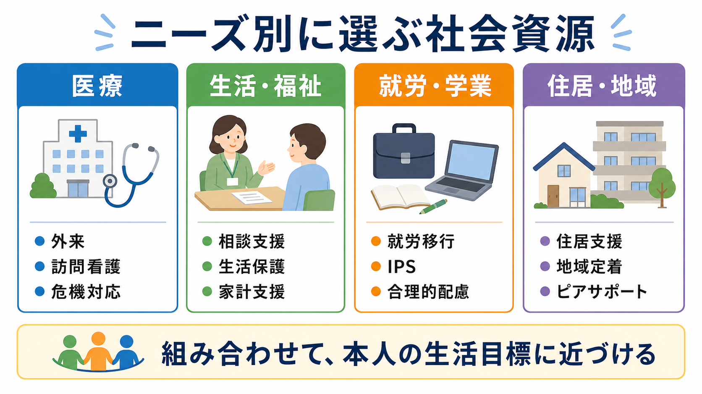

# 社会資源の活用とは何か

## 要点

- 社会資源の活用とは、本人の困りごとを「医療だけ」「福祉だけ」に分けず、医療、障害福祉、行政、就労、住居、地域の支えを生活目標に合わせて組み合わせる実践である。
- 中心はサービス名を知ることではなく、本人の希望、リスク、強み、制度条件、地域差を評価し、同意にもとづいて支援を接続し、利用後に見直す循環である[1][2][4]。
- 精神保健では、地域で自分らしく暮らすために、医療、障害福祉・介護、住まい、社会参加、就労、地域の助け合い、教育を包括的に確保する視点が重視されている[1][5]。
- エビデンス上も、集中的ケースマネジメントや援助付き雇用は、対象や地域条件に左右されるものの、入院、支援継続、就労などのアウトカムに一定の効果を示している[7][8]。
- この記事は教育・研究目的の整理であり、個別の診断、治療指示、制度利用可否の判断を代替するものではない。

## この記事で答える問い

1. 社会資源の活用は、単なる制度紹介と何が違うのか。
2. 医療・福祉・行政・就労・住居支援を、どの順序で考えるとよいのか。
3. 臨床現場や研究では、社会資源活用をどのようなアウトカムと結びつけて評価できるのか。
4. 「つなげばよい」「本人が望めばすぐ使える」といった誤解を避けるには何を見るべきか。

## まず結論

社会資源の活用とは、「利用できる制度を列挙すること」ではなく、本人の生活課題を、実際に使える支援の組み合わせへ翻訳することである。たとえば、うつ病で休職中の人に対して、外来治療だけを調整しても、収入、職場復帰、家族負担、睡眠、家賃、孤立が未整理なら生活は安定しにくい。逆に、福祉サービスを紹介しても、本人が何を望み、どの情報共有に同意し、どの支援から始めると負担が少ないのかを確認しなければ、支援は使われない。

したがって実践の核は、[[ケースマネジメントとは何か|ケースマネジメント]]や[[ケアマネジメントとケースマネジメントは何が違うのか|ケアマネジメント]]に近い。本人中心の評価、支援計画、資源への接続、役割分担、モニタリング、再評価を繰り返す。制度名に詳しいことは重要だが、それだけでは十分ではない。本人の生活目標に沿って、医療、福祉、行政、職場、住まい、家族、地域活動を「使える形」に整えることが社会資源活用である[2][4]。

## 背景

精神疾患や慢性疾患、発達特性、認知機能障害、依存症、貧困、住居不安定、家族負担が重なると、困りごとは単一の専門職や単一制度では解けない。薬物療法や心理療法が必要な人でも、通院交通費がない、家賃滞納で退去リスクがある、職場で合理的配慮を頼めない、家族が疲弊している、といった条件があると治療継続そのものが難しくなる。

日本の精神保健政策でも、「入院医療中心から地域生活中心」への転換のなかで、精神障害の有無や程度にかかわらず地域の一員として安心して暮らせるよう、医療、障害福祉・介護、住まい、社会参加、就労、地域の助け合い、教育を包括的に確保する方針が示されている[1]。これは、社会資源活用を医療の外側の付属物ではなく、回復と生活継続の条件として扱うという意味をもつ。

WHO も、地域精神保健サービスの整備では、本人中心、権利基盤、地域生活、社会的包摂を重視し、医療・社会ケアシステムの中に地域サービスを統合する必要を強調している[5]。ここでいう社会資源は、制度サービスだけでなく、地域活動、ピアサポート、家族・友人、居場所、教育・就労機会、住宅、経済的支援を含む広い概念である。

## 基本概念

### 社会資源

社会資源とは、本人の生活、健康、権利、参加を支えるために利用できる制度、サービス、人、場所、情報、関係性の総称である。精神科・福祉領域では、外来、入院、訪問看護、デイケア、相談支援、障害福祉サービス、生活保護、生活困窮者自立支援、就労移行支援、就労継続支援、地域移行支援、地域定着支援、住居支援、ピアサポート、家族支援などが典型例になる[2][3]。

ただし、資源は「存在する」だけでは資源にならない。本人がアクセスできる距離にあるか、費用負担が現実的か、申請条件を満たすか、待機期間が長すぎないか、本人の価値観や文化に合うか、支援者が継続的に伴走できるかによって、実際に使えるかどうかは変わる。

### 本人中心

本人中心とは、本人の希望を無条件にそのまま実行することではない。安全、法的条件、家族や地域の負担、支援資源の限界を共有したうえで、本人が何を大切にし、何からなら始められるのかを一緒に決める姿勢である。NASW のケースマネジメント標準でも、アセスメント、計画、実施、モニタリング、アドボカシー、組織間連携が、本人の目標と強みに沿って行われることが重視されている[4]。

### つなぐことと使えること

紹介状を書く、窓口を案内する、電話番号を渡すことは、社会資源活用の一部にすぎない。実際には、予約を取れるか、書類を書けるか、初回面談に行けるか、そこで本人が必要なことを話せるか、利用後に生活が変わったかを確認する必要がある。支援の失敗は、本人の意欲不足ではなく、手続きの難しさ、情報の不足、スティグマ、過去の支援経験、制度の分断、支援者間の役割不明確さから起こることが多い。

## 仕組み

社会資源活用は、次の循環で考えると整理しやすい。

### 1. 生活課題を評価する

最初に見るのは診断名だけではない。住まい、収入、食事、睡眠、通院、服薬、移動、家族関係、孤立、学校・職場、認知機能、身体疾患、物質使用、暴力・虐待リスク、緊急時の連絡先を確認する。障害福祉の相談支援でも、サービス等利用計画の作成、見直し、地域移行、地域定着、一般相談などを通じて、日常生活・社会生活を支えることが位置づけられている[2]。

### 2. 本人の希望と優先順位を確認する

支援者から見る緊急課題と、本人が今いちばん困っていることは一致しないことがある。支援者は再入院リスクを心配していても、本人は「家賃」「親との関係」「職場に何と伝えるか」を最優先に感じているかもしれない。ここをずらしたまま制度を紹介すると、支援は押しつけになりやすい。

### 3. 資源を選び、組み合わせる

資源選択では、制度名よりも機能を見る。たとえば、住居が不安定なら[[住居支援とは何か|住居支援]]、家計が破綻しそうなら生活困窮者自立支援や生活保護、就労を目指すなら[[就労支援とは何か|就労支援]]や IPS、孤立が強いなら[[ピアサポートとは何か|ピアサポート]]や地域活動、服薬・生活リズムが崩れやすいなら[[訪問看護は精神科で何を支えるのか|訪問看護]]や[[デイケアとは何か|デイケア]]が候補になる。

生活困窮者自立支援制度では、生活全般の相談、自立相談支援、住居確保給付金、就労準備支援、家計改善支援などが用意され、仕事、家賃、住まい、家計、社会参加の困難に対応する枠組みが示されている[3]。精神保健だけでなく、生活困窮、住宅、就労、教育、司法、家族支援を横断して考えることが必要である。

### 4. 実際につなぐ

つなぐ段階では、本人の同意、情報共有の範囲、紹介先の役割、初回連絡の方法、同行の要否、緊急時対応を確認する。NHS England の social prescribing では、リンクワーカーが本人に時間をかけ、「自分にとって何が大切か」に焦点を当て、地域の活動・サービスにつなぐモデルが説明されている[6]。これは日本の制度と同一ではないが、医療外の資源を本人中心に接続する発想を理解するうえで参考になる。

### 5. 効果を見直す

利用開始後は、資源につながったかだけでなく、生活がどう変わったかを見る。通院が続いたか、睡眠が安定したか、家賃滞納が止まったか、孤立が減ったか、家族負担が軽くなったか、本人が自分の選択感を持てているかを確認する。うまくいかない場合は、本人のせいにせず、支援量、時間帯、場所、情報共有、制度条件、対人関係、症状、認知機能、経済的障壁を見直す。

## 図解

社会資源は、支援者側の制度分類ではなく、本人のニーズから選ぶと実践に落とし込みやすい。

| ニーズ | 主な社会資源 | 確認すること |
|---|---|---|
| 医療を継続したい | 外来、訪問看護、薬局、デイケア、危機対応 | 通院手段、費用、予約、服薬管理、緊急時連絡 |
| 生活を安定させたい | 相談支援、生活保護、生活困窮者自立支援、家計改善支援 | 収入、家賃、食事、書類、支払い、滞納 |
| 住まいを保ちたい | 住居支援、地域移行支援、地域定着支援、居住サポート | 契約、保証人、退去リスク、孤立、近隣関係 |
| 働く・学ぶ準備をしたい | 就労移行支援、IPS、リワーク、学業支援、合理的配慮 | 希望、体調、勤務時間、開示、配慮、収入変化 |
| 孤立を減らしたい | ピアサポート、セルフヘルプグループ、地域活動、家族支援 | 安心できる場、頻度、交通、対人負荷、文化的適合 |

## 臨床・研究との接続

臨床では、社会資源活用は[[精神科リハビリテーションとは何か|精神科リハビリテーション]]、[[リカバリー志向支援とは何か|リカバリー志向支援]]、[[地域定着支援とは何か|地域定着支援]]と深く関係する。症状を軽くするだけでなく、本人が望む生活、役割、関係、場所に戻るためには、治療と生活支援を同じ支援計画の中で扱う必要がある。

研究上は、社会資源活用の効果を単一アウトカムだけで評価しにくい。入院日数、再入院、救急利用、治療継続、住居安定、就労、社会機能、QOL、孤立、本人満足、家族負担、費用、権利擁護などを組み合わせる必要がある。集中的ケースマネジメントの Cochrane レビューでは、標準ケアと比べて入院の減少、ケア継続、社会機能、就労、ホームレス状態の回避などに利益が示される一方、対象者の重症度、地域の入院利用水準、ACT モデルへの忠実度によって効果が変わることも示されている[7]。

就労領域では、援助付き雇用、とくに IPS に近いモデルが、重い精神疾患をもつ成人の競争的雇用への到達や就労期間を改善する可能性がある。ただし、生活の質、精神症状、費用など非職業アウトカムの証拠は限定的であり、就労だけを回復の唯一の指標にしないことが重要である[8]。[[IPS援助付き雇用とは何か|IPS]]は、治療、生活支援、本人の希望、職場調整を同時に扱う社会資源活用の一例として理解できる。

## よくある誤解

### 誤解1: 社会資源活用は制度をたくさん知っていればできる

制度知識は必要だが、十分ではない。本人の目標、同意、支援への抵抗感、過去の失敗経験、認知機能、手続き能力、地域の実際の空き状況を見ないと、制度は生活に届かない。

### 誤解2: 医療が終わってから福祉につなぐ

医療と福祉は直列ではない。急性期でも、退院後の住まい、訪問支援、家族の休息、経済支援、通院手段を早期に調整する必要がある。地域生活が不安定なままでは、治療継続も難しくなる。

### 誤解3: 本人が希望しないなら支援は不要である

本人の自己決定は尊重されるべきだが、希望しない理由を確認する必要がある。過去に傷ついた経験、制度への不信、説明不足、費用不安、スティグマ、家族への遠慮が背景にあることもある。支援者は押しつけではなく、選択肢を理解できる形にし、いつでも再相談できる入口を残す。

### 誤解4: つないだら支援者の役割は終わる

むしろ接続後が重要である。初回面談に行けたか、支援者と合ったか、本人が不利益を感じていないか、支援が生活目標に近づいているかを見直す必要がある。支援の断絶を減らすことが、社会資源活用の中心的な仕事である。

## 関連ノート

- [[ケースマネジメントとは何か]]
- [[ケアマネジメントとケースマネジメントは何が違うのか]]
- [[精神科リハビリテーションとは何か]]
- [[リカバリー志向支援とは何か]]
- [[訪問看護は精神科で何を支えるのか]]
- [[デイケアとは何か]]
- [[就労支援とは何か]]
- [[IPS援助付き雇用とは何か]]
- [[住居支援とは何か]]
- [[地域移行支援とは何か]]
- [[地域定着支援とは何か]]
- [[ピアサポートとは何か]]
- [[金銭管理支援とは何か]]

## 関連ノート候補

- 退院支援とは何か
- 生活保護と精神科医療はどう関係するのか
- 生活困窮者自立支援制度とは何か
- 社会的処方とは何か
- ケア会議とは何か

## 理解チェック

1. 社会資源の活用を「制度紹介」だけで説明すると、何が抜け落ちるか。
2. 本人の希望と支援者のリスク評価がずれたとき、どのように支援計画へ反映できるか。
3. 医療、福祉、就労、住居支援を同時に扱う必要がある事例を一つ想定し、優先順位を説明できるか。
4. 社会資源活用の効果を、入院日数以外の指標で三つ挙げられるか。

## 未解決問題

- 地域差の大きい社会資源を、どのように公平に把握し、支援計画へ反映するか。
- 本人の自己決定、家族負担、リスク管理、制度条件が衝突したときの意思決定支援をどう標準化するか。
- 社会資源活用の研究で、住居安定、就労、孤立、QOL、権利擁護をどのように統合評価するか。
- デジタル相談、オンライン支援、地域資源データベースを、個人情報保護と実効性を両立しながらどう使うか。

## 参考文献

[1] 厚生労働省. 精神障害にも対応した地域包括ケアシステムの構築について. https://www.mhlw.go.jp/stf/seisakunitsuite/bunya/chiikihoukatsu.html

[2] 厚生労働省. 障害のある人に対する相談支援について. https://www.mhlw.go.jp/stf/seisakunitsuite/bunya/hukushi_kaigo/shougaishahukushi/service/soudan_shien.html

[3] 厚生労働省. 生活困窮者自立支援制度. https://www.mhlw.go.jp/stf/seisakunitsuite/bunya/0000059425.html

[4] National Association of Social Workers. (2013). *NASW Standards for Social Work Case Management*. https://www.socialworkers.org/Practice/NASW-Practice-Standards-Guidelines/NASW-Standards-for-Social-Work-Case-Management

[5] World Health Organization. (2021). *Guidance on community mental health services: Promoting person-centred and rights-based approaches*. https://www.who.int/publications/i/item/9789240025707

[6] NHS England. Social prescribing. https://www.england.nhs.uk/personalisedcare/social-prescribing/

[7] Dieterich, M., Irving, C. B., Bergman, H., Khokhar, M. A., Park, B., & Marshall, M. (2017). Intensive case management for severe mental illness. *Cochrane Database of Systematic Reviews*, CD007906. https://doi.org/10.1002/14651858.CD007906.pub3

[8] Kinoshita, Y., Furukawa, T. A., Kinoshita, K., Honyashiki, M., Omori, I. M., Marshall, M., Bond, G. R., Huxley, P., Amano, N., & Kingdon, D. (2013). Supported employment for adults with severe mental illness. *Cochrane Database of Systematic Reviews*, CD008297. https://doi.org/10.1002/14651858.CD008297.pub2
