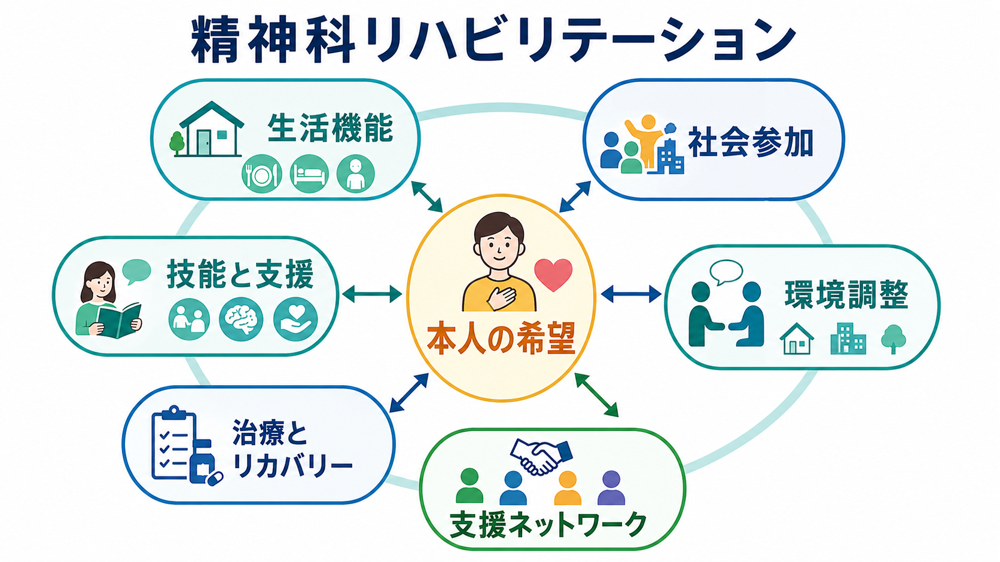
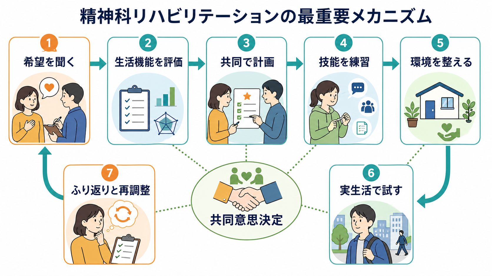
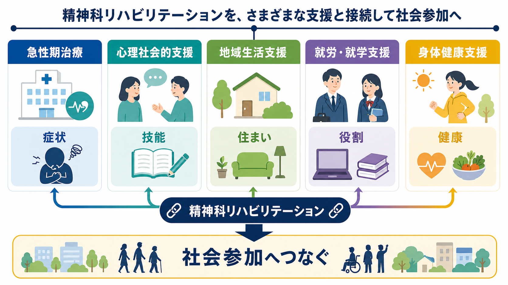

# 精神科リハビリテーションとは何か

## 要点

- 精神科リハビリテーションは、症状をなくすことだけを目的にする支援ではなく、本人が望む暮らし・学び・働き方・人とのつながりを回復または再構成する支援である。
- 中心に置くのは「診断名」ではなく、本人の希望、生活機能、社会参加、環境、支援ネットワークである。
- 有効な支援は、技能訓練だけでも、環境調整だけでも、薬物療法だけでもない。共同意思決定のもとで、医療・福祉・家族・地域・就労就学支援を組み合わせる。
- 個別支援としては、心理教育、生活技能訓練、認知矯正、援助付き雇用、住まいの支援、アウトリーチ、身体健康支援などが含まれる。
- 医療者が「よい生活」を決めるのではなく、本人の価値とリスクを一緒に扱いながら、現実の生活場面で試し、修正していく。

## この記事で答える問い

- 精神科リハビリテーションは、通常の精神科治療と何が違うのか。
- 「生活機能」「社会参加」「リカバリー」はどのように関係するのか。
- どのような支援要素を組み合わせると、本人の暮らしに届く支援になるのか。
- よくある誤解や限界は何か。

## まず結論

精神科リハビリテーションとは、精神疾患や心理社会的困難によって制限された生活機能と社会参加を、本人の希望に沿って支える治療的・福祉的・地域的支援の総称である。WHO はリハビリテーションを、健康状態と環境との相互作用のなかで機能を最適化し障害を減らす介入群として定義し、教育・就労・家庭内役割など意味ある生活役割への参加を重視している [1]。精神科領域ではこの考え方が、症状管理、自己管理、対人関係、住まい、仕事・学業、身体健康、地域生活の支援へ広がる。

したがって、精神科リハビリテーションは「退院前の訓練」や「慢性期だけの活動」ではない。急性期治療で症状を安定させること、再発予防を支えること、本人の希望を聞くこと、環境を整えること、社会の側の障壁を下げることが連続している。NICE の複雑な精神病に対するリハビリテーション指針も、長期的回復を前向きに支え、評価、ケア計画、リハビリテーションプログラム、身体健康を含むサービス組織化を扱っている [3]。

## 背景

精神科医療は、長く「症状を診断し、治療し、再発を防ぐ」ことを中心に発展してきた。しかし、本人の困難は症状だけでは説明できない。幻聴や抑うつが軽くなっても、対人関係への不安、生活リズムの崩れ、金銭管理、孤立、就労や就学の中断、身体疾患、スティグマが残れば、生活は回復しにくい。

リハビリテーションの視点は、ここで「症状」と「生活」を切り離さない。WHO の地域精神保健ガイダンスは、施設中心ではなく、人権、本人中心性、地域での包摂、住まい・教育・雇用など他領域との連携を重視する方向を示している [2]。これは [[地域精神医療とは何か]] や [[多職種連携は地域精神医療でなぜ重要なのか]] と強く接続する。

また、リカバリー概念は「臨床的に症状が消えること」だけではない。Anthony は、重い精神疾患があっても、希望があり、満足でき、貢献できる生活を送る過程としてリカバリーを位置づけた [4]。Leamy らの系統的レビューは、個人的リカバリーの中核過程として、つながり、希望、アイデンティティ、意味、エンパワメントからなる CHIME 枠組みを整理している [5]。

## 基本概念

### 生活機能

生活機能とは、食事、睡眠、身だしなみ、家事、移動、対人関係、金銭管理、服薬管理、学業・就労、余暇、身体健康管理など、生活を構成する働きである。精神症状が軽い人でも生活機能が大きく損なわれることがあり、逆に症状が残っていても環境と支援が合えば社会参加を続けられることがある。

このため、精神科リハビリテーションでは、診断名だけで支援を決めない。本人がどの場面で困っているのか、どの場面なら力を発揮できるのか、支援が必要なのは技能か、環境か、制度か、関係性かを具体的に評価する。

### 本人の希望

本人の希望は、単なる「希望聴取」ではない。希望は支援目標を決める羅針盤であり、同時にリスクを扱う入口でもある。たとえば「働きたい」という希望がある場合、支援者は「まだ早い」と止めるだけではなく、どの職種、どの時間数、どの配慮、どの通院継続、どの再発サイン確認があれば試せるかを一緒に考える。

SAMHSA はリカバリーを、健康とウェルネスを改善し、自分で方向づけた生活を送り、潜在力に向かう変化の過程として説明している [6]。精神科リハビリテーションでは、この「本人が方向づける」という点が重要になる。

### 支援と技能の両輪

精神科リハビリテーションは、本人に技能を身につけてもらうだけでは不十分である。対人技能、セルフケア、認知的方略、ストレス対処を支援する一方で、住まい、職場、学校、家族、制度、支援者側の環境も調整する。本人の努力だけに問題を戻さないことが、リハビリテーションを治療的支援にする。

### 社会参加

社会参加は、就労だけを意味しない。家族内の役割、地域活動、学び、趣味、ピア活動、通所、ボランティア、ケアを受ける側から支える側へ移る経験なども含まれる。本人にとって意味ある役割を取り戻すことが、症状評価だけでは見えない回復を支える。

## 仕組み

精神科リハビリテーションの実践は、直線的な手順というより循環的なプロセスである。

1. 本人の希望を聞く。
2. 生活機能と環境を評価する。
3. 本人・家族・支援者で計画を立てる。
4. 必要な技能を練習する。
5. 住まい、職場、学校、地域資源を調整する。
6. 実生活の場で試す。
7. 結果をふり返り、支援量や目標を再調整する。

この循環では、評価は一度きりではない。症状、認知機能、対人関係、身体健康、生活リズム、支援者との関係、制度利用、本人の価値観は変化する。したがって、支援計画も固定ではなく、本人の生活場面で得られた情報をもとに更新される。

### 主な支援要素

| 支援要素 | ねらい | 関連する既存ノート |
|---|---|---|
| 心理教育 | 疾患理解、再発サイン、セルフマネジメントを支える | [[心理教育とは何か]] |
| 生活技能訓練 | 対人関係、日課、金銭管理、服薬、家事などを練習する | [[アドヒアランスとは何か]] |
| 認知矯正 | 注意、記憶、実行機能、社会認知などを機能的目標へつなげる | [[認知機能障害は統合失調症でなぜ重要なのか]] |
| 援助付き雇用 | 早期に実際の職場へ接続し、継続支援を行う | [[IPS援助付き雇用とは何か]] |
| 地域生活支援 | 住まい、制度、家族、地域資源をつなぐ | [[地域移行支援とは何か]]、[[地域定着支援とは何か]] |
| アウトリーチ | 来所しにくい人の生活場面へ支援を届ける | [[アウトリーチ支援とは何か]] |
| 身体健康支援 | 生活習慣病、運動、睡眠、薬物副作用、受診支援を扱う | [[身体合併症は精神科診療でなぜ重要なのか]] |

IPS に代表される援助付き雇用は、重い精神疾患をもつ人の就労支援で、従来型の長い準備訓練よりも競争的雇用への到達を高めることが複数のレビューで示されている [7]。また、認知矯正は統合失調症の認知機能と機能アウトカムに小から中等度の改善をもたらし、日常生活への橋渡しを含むプログラムで効果が大きくなりやすい [8]。ただし、どちらも単独で生活全体を解決する方法ではなく、本人の目標と環境調整に接続して初めてリハビリテーションとして機能する。

## 図解

精神科リハビリテーションは、急性期治療、心理社会的支援、地域生活支援、就労・就学支援、身体健康支援を横断する。支援の焦点は「どのサービスを使うか」だけではなく、「本人がどの役割へ参加したいのか」である。

## 臨床・研究との接続

臨床では、精神科リハビリテーションは退院支援、外来継続支援、デイケア、訪問看護、就労支援、地域移行、家族支援、身体健康管理の共通言語になる。たとえば [[重症精神障害とは何か]] の人を支援する場合、陽性症状や気分症状の治療だけでなく、住まい、孤立、金銭管理、認知機能、服薬継続、家族負担、身体疾患を同時に見る必要がある。

研究では、アウトカムを症状尺度だけにしないことが重要である。再入院率、就労日数、住居安定、生活の質、社会機能、本人評価のリカバリー、希望、自己効力感、身体健康、支援満足度などが候補になる。NICE 指針が身体健康も含む包括的なリハビリテーションを扱うように [3]、精神科リハビリテーション研究では、多面的アウトカムと長期フォローが求められる。

同時に、文化差と制度差にも注意が必要である。家族同居が多い地域、就労制度が異なる地域、障害福祉サービスへのアクセスが異なる地域では、同じ介入名でも実際の意味が変わる。日本で考える場合は、[[障害者総合支援法とは何か]]、精神科訪問看護、地域活動支援センター、就労移行支援、就労継続支援、ピアサポートなどとの接続を具体化する必要がある。

## よくある誤解

### 「症状がよくなってからリハビリを始める」

症状が強い時期には安全確保や急性期治療が優先される。しかし、生活リズム、本人の希望、家族との連絡、退院後の住まい、身体健康、支援者との関係づくりは早期から始まる。リハビリテーションは治療の後に来る付録ではなく、治療と並行する生活支援である。

### 「本人の努力不足を訓練で直す」

生活上の困難は、本人の技能不足だけでなく、症状、認知機能、薬物副作用、貧困、孤立、住環境、制度の複雑さ、スティグマから生じる。支援者が「訓練すればできる」と単純化すると、本人に失敗経験だけを積ませる危険がある。

### 「就労できればリカバリーである」

就労は重要な社会参加の一つだが、リカバリーの全体ではない。本人にとって意味ある役割は、学び、家庭内役割、地域活動、ピア活動、創作、休息を含む。就労を急ぎすぎると、本人の希望ではなく支援者や制度の評価指標が優先されることがある。

### 「リハビリは慢性期だけのもの」

早期精神病、気分障害、不安症、発達特性、認知症、依存症、ひきこもり支援などでも、生活機能と社会参加の視点は有用である。対象は「慢性期」ではなく、生活上の制限と支援ニーズをもつ人である。

## 関連ノート

- [[地域精神医療とは何か]]
- [[多職種連携は地域精神医療でなぜ重要なのか]]
- [[地域移行支援とは何か]]
- [[地域定着支援とは何か]]
- [[アウトリーチ支援とは何か]]
- [[IPS援助付き雇用とは何か]]
- [[就労支援とは何か]]
- [[精神疾患とリカバリー志向支援はどう関係するのか]]
- [[精神医学における回復とは何か]]
- [[心理教育とは何か]]
- [[認知機能障害は統合失調症でなぜ重要なのか]]
- [[障害者総合支援法とは何か]]

## 理解チェック

1. 精神科リハビリテーションが「症状軽減」だけでは説明できない理由を、生活機能と社会参加の語を使って説明できるか。
2. 本人の希望を支援計画に入れることは、なぜ単なる希望聴取ではなく共同意思決定なのか。
3. 技能訓練と環境調整のどちらか一方だけでは不十分な理由を、具体例で説明できるか。
4. IPS や認知矯正のエビデンスを、リハビリテーション全体のなかでどのように位置づけるか。
5. 支援者が「よい生活」を決めてしまうことには、どのような倫理的リスクがあるか。

## 未解決問題

- 個人的リカバリー、社会参加、症状、再入院、身体健康をどう統合的に評価するか。
- 日本の制度環境で、医療、障害福祉、雇用、教育、住宅支援をどのように連続させるか。
- 重い症状や認知機能障害がある人の意思決定支援を、保護と自律の二分法にせず実装する方法。
- ピアサポート、デジタル支援、地域資源を、医療モデルに回収しすぎず安全に活用する方法。

## MOC更新候補

- `content/00_MOC/MOC｜司法・制度・地域精神医療.md`
- `content/00_MOC/` 配下に臨床実践・治療またはリハビリ・生活支援の MOC がある場合、本記事へのリンク追加候補。

## 参考文献

[1] World Health Organization. (2024). *Rehabilitation*. https://www.who.int/news-room/fact-sheets/detail/rehabilitation

[2] World Health Organization. (2021). *Guidance on community mental health services: promoting person-centred and rights-based approaches*. https://iris.who.int/handle/10665/341648

[3] National Institute for Health and Care Excellence. (2020). *Rehabilitation for adults with complex psychosis: NICE guideline NG181*. https://www.nice.org.uk/guidance/ng181

[4] Anthony, W. A. (1993). Recovery from mental illness: The guiding vision of the mental health service system in the 1990s. *Psychosocial Rehabilitation Journal, 16*(4), 11-23. https://doi.org/10.1037/h0095655

[5] Leamy, M., Bird, V., Le Boutillier, C., Williams, J., & Slade, M. (2011). Conceptual framework for personal recovery in mental health: Systematic review and narrative synthesis. *The British Journal of Psychiatry, 199*(6), 445-452. https://doi.org/10.1192/bjp.bp.110.083733

[6] Substance Abuse and Mental Health Services Administration. (2025). *Recovery and Recovery Support*. https://www.samhsa.gov/recovery

[7] Kinoshita, Y., Furukawa, T. A., Kinoshita, K., Honyashiki, M., Omori, I. M., Marshall, M., Bond, G. R., Huxley, P., Amano, N., & Kingdon, D. (2013). Supported employment for adults with severe mental illness. *Cochrane Database of Systematic Reviews*, CD008297. https://doi.org/10.1002/14651858.CD008297.pub2

[8] Lejeune, J. A., Northrop, A., & Kurtz, M. M. (2021). A meta-analysis of cognitive remediation for schizophrenia: Efficacy and the role of participant and treatment factors. *Schizophrenia Bulletin, 47*(4), 997-1006. https://doi.org/10.1093/schbul/sbab022
