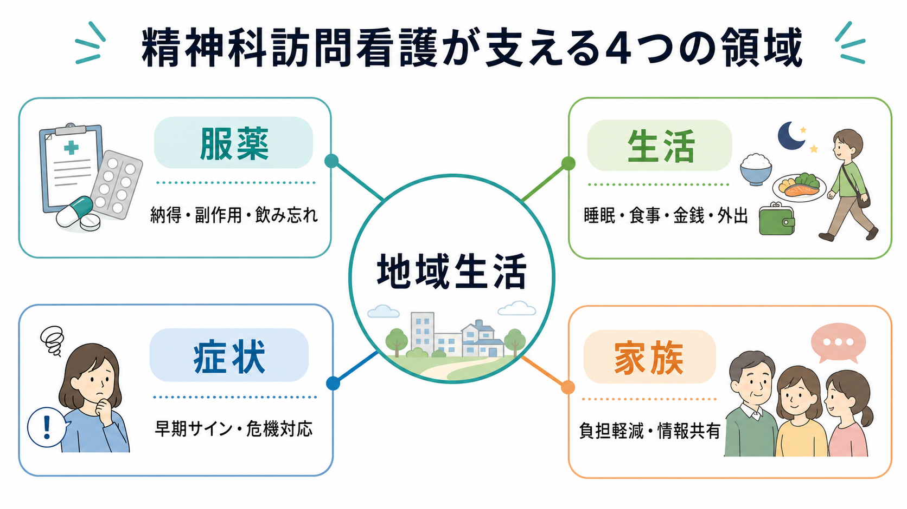
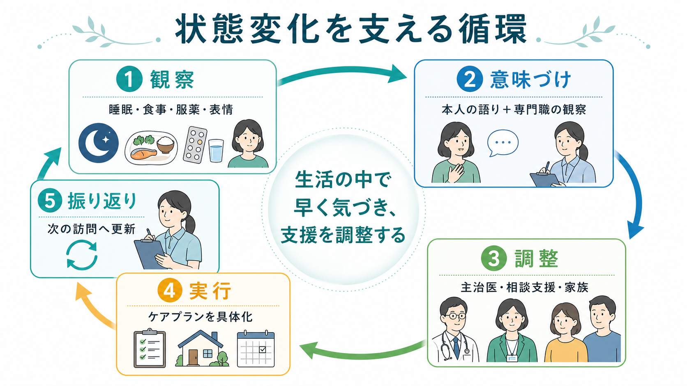
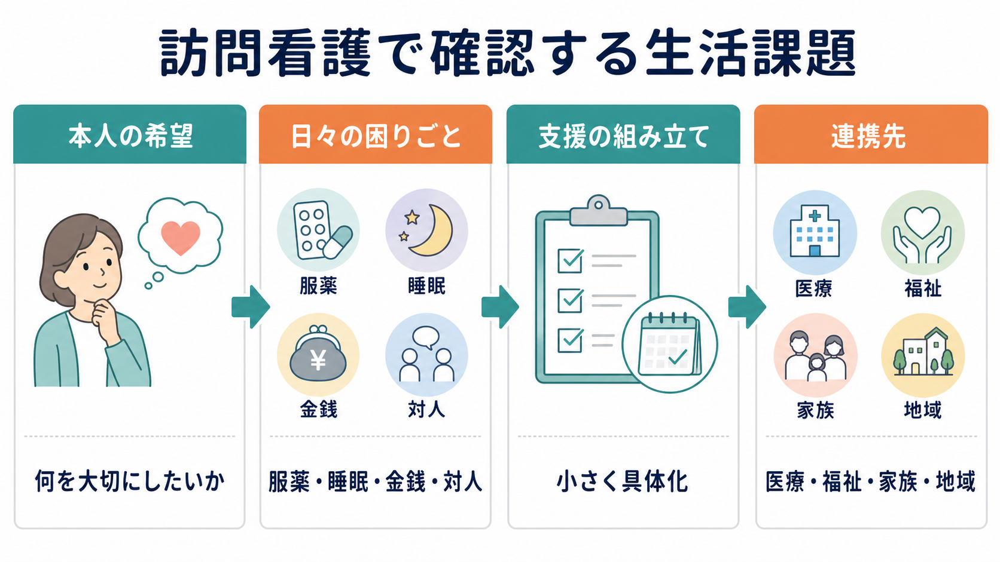

# 訪問看護は精神科で何を支えるのか

## 要点

- 精神科訪問看護は、通院と服薬を「守らせる」サービスではなく、本人が地域で暮らし続けるために、服薬、生活、症状、家族関係、社会資源とのつながりを一緒に整える支援である。
- 支援の中心は、診断名そのものよりも、睡眠、食事、金銭、外出、対人関係、服薬、危機サインなど、生活の中で観察できる変化である。
- 精神科訪問看護の強みは、外来診察室では見えにくい「暮らしの文脈」を見て、本人の語り、家族の困りごと、主治医や福祉サービスの情報をつなぎ直す点にある。
- 服薬支援は、飲んだかどうかの確認だけでなく、薬への納得、副作用、飲み忘れの起こり方、生活リズム、再発予防の理解を扱う。
- 家族支援は、家族を監視者にすることではなく、負担、混乱、批判や過干渉の悪循環を減らし、本人と家族が安全に距離を取り直す支援である。

## この記事で答える問い

- 精神科訪問看護は、精神科外来や福祉サービスと何が違うのか。
- 服薬、生活、症状、家族関係をどのように支えるのか。
- 訪問看護師は、家庭や地域で何を観察し、誰と連携するのか。
- 「見守り」「服薬確認」「家族対応」といった言葉の裏に、どのような臨床的意味があるのか。

## まず結論

精神科訪問看護が支えるのは、病名ではなく「病気や困難を抱えながらも、地域で生活を続けるための条件」である。厚生労働省が示す「精神障害にも対応した地域包括ケアシステム」では、精神障害の有無や程度にかかわらず、誰もが地域の一員として安心して自分らしく暮らせるよう、医療、障害福祉・介護、住まい、社会参加、地域の助け合い、教育を包括的に確保することが目標とされている [1]。精神科訪問看護は、この考え方を生活の現場で実装する支援の一つである。

訪問看護師は、薬を飲めているかだけを見るのではない。睡眠が崩れていないか、食事や金銭管理が回っているか、幻聴や抑うつが強まる前のサインは何か、家族との会話が緊張を高めていないか、福祉サービスや主治医と情報がつながっているかを確認する。日本の精神科訪問看護研究でも、ケアの焦点は「日常生活の維持／生活技能の獲得・拡大」「対人関係」「家族関係の調整」「精神症状の悪化予防」「身体症状」「連携」「社会資源」「エンパワメント」に広がると整理されている [4]。

したがって、精神科訪問看護は、[[精神科訪問看護とは何か]]、[[アウトリーチ支援とは何か]]、[[精神科リハビリテーションとは何か]]、[[アドヒアランスとは何か]] を生活場面で結びつける実践である。本人の自宅に入るからこそ、支援は強力にも侵襲的にもなりうる。重要なのは、本人の尊厳、選択、同意、生活のリズムを尊重しながら、危機を早く見つけ、支援を過不足なく調整することである。

## 背景

精神科医療では、入院中心から地域生活中心への移行が進められてきた。外来、デイケア、相談支援、就労支援、住まいの支援、家族支援、ピアサポートなどが組み合わさることで、入院を減らすだけでなく、本人が望む生活を地域で維持することが目標になる。WHO の地域精神保健サービスに関するガイダンスも、施設中心のケアから、本人中心で権利に基づく地域サービスへの転換を重視している [2]。

しかし、地域生活は「退院できたら終わり」ではない。退院後や外来通院中には、睡眠の乱れ、孤立、服薬中断、副作用、金銭トラブル、家族との衝突、身体疾患、飲酒や薬物使用、就労や学業の負荷などが重なりうる。これらは診察室では短時間で把握しにくく、本人も「困っている」と言語化できないことがある。

精神科訪問看護は、この空白を埋める。訪問看護師は、本人の居室、冷蔵庫、服薬カレンダー、郵便物、表情、会話の速度、生活音、家族の疲労、近隣との関係などから、生活が回っているかを具体的に見る。これは監視ではなく、本人が自分で暮らす力を保つための共同観察である。訪問のたびに小さな変化を拾い、必要なら主治医、相談支援専門員、保健師、家族、ヘルパー、就労支援者とつなぐ。

## 基本概念

### 訪問看護は「医療」と「生活」の間に立つ

精神科訪問看護は、看護職による医療的な観察と、生活支援としての伴走を併せ持つ。血圧や身体症状を見るだけではなく、精神症状、服薬、副作用、睡眠、食事、活動量、対人関係、住環境、制度利用を一体として見る。NICE の複雑な精神病に対するリハビリテーション指針も、症状だけでなく、社会的・日常的機能、身体健康、ケア計画、地域での支援経路を含めて扱う必要を示している [7]。

ここで重要なのは、訪問看護師がすべてを抱え込むわけではないという点である。訪問看護は、本人の生活の中で生じた情報を、必要な支援につなぐ中継点でもある。医師には薬や病状の変化を、福祉職には生活課題を、家族には関わり方の工夫を、本人には選択肢と見通しを返す。

### 支援は「本人の希望」から始まる

本人が何を大切にしたいかを聞かずに支援を組み立てると、訪問看護は容易に管理的になる。たとえば「薬を飲ませる」「部屋を片づけさせる」「外出させる」という目標だけでは、本人の生活の意味が抜け落ちる。

本人の希望は、壮大な夢でなくてよい。「夜に少し眠りたい」「親とけんかしたくない」「コンビニに行きたい」「仕事のことを考えたい」「薬で太るのがつらい」といった語りが、支援の入口になる。訪問看護では、それを小さな行動に分け、何が妨げになっているかを一緒に見つける。

### アセスメントは家の中の具体物から始まる

精神科訪問看護のアセスメントは、抽象的な「安定している／不安定である」だけでは不十分である。服薬袋が開いていない、冷蔵庫に食べ物がない、郵便物が山積みになっている、昼夜逆転している、家族が過度に疲れている、本人の語りが急に被害的になっている、といった具体的な手がかりを組み合わせる。

日本の調査研究では、統合失調症をもつ訪問看護利用者へのケア提供パターンとして、独居者への援助、重症者への家族援助、他の援助がある人へのモニタリング、重症者への本人援助などの類型が示されている [5]。つまり、訪問看護の内容は一律ではなく、同居者の有無、社会機能、他の支援者の有無、症状の重さによって変わる。

## 仕組み

### 1. 服薬を支える

精神科訪問看護の服薬支援は、服薬確認だけではない。薬への理解、必要性への納得、副作用への困りごと、飲み忘れが起こる時間帯、生活リズム、薬の保管、受診継続、薬をやめたくなる理由を扱う。

NICE の服薬アドヒアランス指針は、薬を使うかどうかの判断を本人の情報に基づく選択として支え、意思決定に本人を関与させることを重視している [3]。精神科ではとくに、病識、薬への不信、副作用、スティグマ、認知機能、家族の意見、経済的負担が服薬に影響する。したがって、訪問看護師は「飲めていませんね」と責めるのではなく、「どのタイミングで難しくなるのか」「副作用として何がつらいのか」「薬を飲むことにどんな意味づけがあるのか」を聞く。

服薬支援では、次のような調整が行われる。

| 見ること | 支援の例 |
|---|---|
| 飲み忘れの時間帯 | 服薬カレンダー、アラーム、生活動作との結びつけ |
| 副作用の困りごと | 主治医への情報共有、眠気・体重増加・錐体外路症状の観察 |
| 薬への不安 | 薬の目的と選択肢を本人の言葉で確認 |
| 処方の複雑さ | 一包化、服薬回数の相談、薬局との連携 |
| 中断のサイン | 残薬、受診キャンセル、睡眠や活動量の変化 |

服薬支援は、[[薬物療法のアドヒアランスをどう支えるか]] や [[精神科薬物療法とは何か]] と接続する。ただし、訪問看護師が勝手に薬を変更するわけではない。観察した変化を主治医や薬剤師に伝え、本人が相談できる形にすることが役割である。

### 2. 生活を支える

生活支援では、睡眠、食事、清潔、家事、金銭、買い物、外出、通院、役所手続き、余暇、身体健康を扱う。ここでの目的は「理想的な生活」を押しつけることではない。本人が暮らしを維持できる最低限の足場を一緒に作ることである。

たとえば、昼夜逆転がある人に「早く寝ましょう」と言うだけでは変わりにくい。訪問看護では、何時に眠くなるのか、日中に光を浴びているか、カフェインや飲酒があるか、服薬時間が合っているか、夜に不安が強まるのかを一緒に見る。食事が取れない場合も、調理技能、買い物、金銭、意欲、妄想的な不安、身体疾患、摂食の問題を分けて考える。

生活支援は、本人の自立を奪う支援にならないよう注意が必要である。支援者が片づける、支援者が決める、支援者が家族の代わりになるだけでは、本人の選択と練習の機会が失われる。小さく具体化し、できる部分を残し、必要な部分だけを補うことが重要である。

### 3. 症状の変化を支える

精神症状の支援では、症状をゼロにすることだけが目標ではない。重要なのは、悪化の早期サインを本人と一緒に見つけ、危機になる前に支援を調整することである。

たとえば、再発や増悪の前には、睡眠時間の減少、食欲低下、外出減少、電話やSNSの増加、疑い深さ、焦燥、独語、服薬中断、家族への怒り、身だしなみの変化などが出ることがある。訪問看護師は、これらを本人の生活史に照らして「その人にとってのサイン」として整理する。

症状観察は、本人を評価対象として固定する作業ではない。本人が「自分の変化に気づく力」を取り戻す支援でもある。訪問時には、困りごとの言語化、対処法の確認、受診を早める判断、緊急時の連絡先、入院を避けるための短期的調整を一緒に考える。WHO の地域アウトリーチサービスの技術資料も、自宅や地域で支援を届けるサービスが、本人中心で権利に基づく形で危機や生活課題に対応することを重視している [2]。

### 4. 家族関係を支える

精神科訪問看護では、家族支援が大きな役割を持つ。家族は、本人の最も近い支援者である一方、最も疲弊しやすい人でもある。本人の症状が強いとき、家族は「何を言えばよいのか」「どこまで見守るのか」「いつ受診させるのか」「本人の要求に応じるべきか」で迷う。

家族支援の目的は、家族に本人を管理させることではない。家族の負担を下げ、本人と家族の距離を調整し、悪循環を減らすことである。家族心理教育や家族介入の研究では、統合失調症に対する家族介入が再発や入院を減らし、服薬継続を支える可能性が示されているが、研究の方法論的限界にも注意が必要である [6]。

訪問看護師は、家族の語りを聞き、本人の前では言いにくい疲労や不安を受け止める。同時に、家族が本人を批判し続ける、過度に先回りする、支援者への連絡を本人に無断で進める、といった関わりが本人の緊張を高めていないかも見る。必要に応じて、[[家族会とは何か]]、相談支援、保健所、市町村、地域活動支援センターなどにつなぐ。

### 5. 連携を支える

訪問看護は、本人、家族、主治医、薬局、相談支援、福祉サービス、行政、就労支援、住まいの支援をつなぐ。連携の目的は、情報を集めること自体ではなく、本人の生活に矛盾した支援が入らないようにすることである。

たとえば、主治医は服薬継続を重視しているが、本人は副作用でつらい。家族は就労を急いでいるが、本人は外出だけで疲れる。ヘルパーは家事援助をしているが、服薬中断には気づいていない。このようなズレを放置すると、支援が本人の生活を助けるどころか混乱を増やす。訪問看護は、生活場面で得た情報を具体的に伝え、支援目標をそろえる役割を持つ。

## 図解

この記事の3枚の図は、それぞれ次の視点を表している。

| 図 | 何を示すか | 読み方 |
|---|---|---|
| 図1 | 精神科訪問看護が支える4領域 | 服薬、生活、症状、家族を別々ではなく地域生活の一部として見る |
| 図2 | 状態変化を支える循環 | 観察、意味づけ、調整、実行、振り返りを訪問ごとに回す |
| 図3 | 生活課題の確認 | 本人の希望から始め、困りごとを小さく具体化し、連携先へつなぐ |

## 臨床・研究との接続

精神科訪問看護は、[[ACTとは何か]] と重なる部分があるが、同じものではない。ACT は多職種チームが包括的に地域支援を提供するモデルであり、訪問看護はその一部として組み込まれる場合もあれば、外来医療や福祉サービスと連携する単独の支援として提供される場合もある。いずれの場合も、地域で暮らす本人に支援を届けるという点で、アウトリーチの考え方と接続する。

研究上は、訪問看護の効果を単純に測ることが難しい。対象者の診断、重症度、家族状況、住まい、他サービスの有無、訪問頻度、支援内容が大きく異なるからである。日本の研究でも、提供されるケア内容をリスト化した研究 [4] や、利用者特性とケア提供パターンを分類した研究 [5] があり、単に「訪問看護あり／なし」で効果を見るだけでは不十分であることが示唆される。

臨床では、訪問看護の成果を「入院しなかったか」だけで評価しない方がよい。もちろん再入院予防は重要だが、本人が相談できるようになった、薬の相談が早くなった、家族の衝突が減った、食事や睡眠が少し安定した、危機時の連絡先が明確になった、福祉サービスを使えるようになった、といった小さな変化も重要なアウトカムである。

## よくある誤解

### 誤解1: 訪問看護は服薬確認だけである

服薬確認は重要だが、それだけではない。服薬が続かない背景には、副作用、不安、生活リズム、病識、認知機能、経済的負担、家族関係、医療者への不信がある。訪問看護は、服薬行動を生活全体の中で理解する。

### 誤解2: 家に来る支援は本人を監視するものだ

訪問看護は、本人の同意と契約に基づく支援である。安全確認や症状観察は行うが、目的は生活を管理することではなく、本人が暮らし続けるための選択肢と早期対応を増やすことである。

### 誤解3: 家族がいれば訪問看護は不要である

家族がいるほど、家族支援が必要になることがある。家族は専門職ではなく、疲労や不安を抱えながら本人と暮らしている。訪問看護は、家族を支援者として使うのではなく、家族自身も支える。

### 誤解4: 症状が安定したら訪問看護は意味がない

症状が安定している時期こそ、再発サイン、服薬の納得、生活リズム、社会参加、家族との距離を整えやすい。危機対応だけでなく、安定を維持する支援も訪問看護の重要な役割である。

## 関連ノート

- [[精神科訪問看護とは何か]]
- [[アウトリーチ支援とは何か]]
- [[ACTとは何か]]
- [[精神科リハビリテーションとは何か]]
- [[アドヒアランスとは何か]]
- [[薬物療法のアドヒアランスをどう支えるか]]
- [[家族会とは何か]]
- [[生物心理社会モデルとは何か]]

## MOC更新候補

- `content/00_MOC/MOC｜臨床実践・治療.md`
- `content/00_MOC/MOC｜司法・制度・地域精神医療.md`

並列ジョブとの競合を避けるため、この作業ではMOC本体は更新していない。

## 理解チェック

1. 精神科訪問看護が、外来診察だけでは見えにくい情報を拾えるのはなぜか。
2. 服薬支援を「飲んだかどうかの確認」だけにすると、どのような背景要因を見落とすか。
3. 家族支援は、本人の管理を家族に任せることとどう違うか。
4. 訪問看護の成果を、再入院の有無だけで評価すると何が抜け落ちるか。

## 未解決問題

- 日本の精神科訪問看護で、どの支援要素がどの利用者群に最も効果的かを分けて検証する研究はまだ限られている。
- 訪問看護、相談支援、ACT、デイケア、就労支援、家族支援の役割分担を、地域ごとにどう最適化するかは今後の課題である。
- 本人の権利と安全確保を両立しながら、危機時にどこまで情報共有するかについては、同意、守秘、家族支援の観点から丁寧な検討が必要である。
- 訪問頻度や支援期間を、症状の重さだけでなく、孤立、住まい、身体疾患、家族負担、本人の希望に応じてどう調整するかは実践上の課題である。

## 参考文献

[1] 厚生労働省. 精神障害にも対応した地域包括ケアシステムの構築について. https://www.mhlw.go.jp/stf/seisakunitsuite/bunya/chiikihoukatsu.html

[2] World Health Organization. (2021). *Community outreach mental health services: Promoting person-centred and rights-based approaches*. https://www.who.int/publications/i/item/9789240025806

[3] National Institute for Health and Care Excellence. (2009). *Medicines adherence: involving patients in decisions about prescribed medicines and supporting adherence* (CG76). https://www.nice.org.uk/guidance/cg76

[4] 瀬戸屋希, 萱間真美, 宮本有紀, ほか. (2008). 精神科訪問看護で提供されるケア内容: 精神科訪問看護師へのインタビュー調査から. *日本看護科学会誌*, 28(1), 1_41-1_51. https://doi.org/10.5630/jans.28.1_41

[5] Tsunoda, A., Yanai, H., Ueno, K., Kimata, M., Seo, T., Funakoshi, A., & Kayama, M. (2012). Classification of outreach services by home-visiting nurses in Japan for people with schizophrenia. *Journal of Japan Academy of Nursing Science*, 32(2), 2_3-12. https://doi.org/10.5630/jans.32.2_3

[6] Pharoah, F., Mari, J. J., Rathbone, J., & Wong, W. (2010). Family intervention for schizophrenia. *Cochrane Database of Systematic Reviews*, Issue 12, CD000088. https://doi.org/10.1002/14651858.CD000088.pub3

[7] National Institute for Health and Care Excellence. (2020). *Rehabilitation for adults with complex psychosis* (NG181). https://www.nice.org.uk/guidance/ng181

[8] World Health Organization. (2021). *Guidance on community mental health services: Promoting person-centred and rights-based approaches*. https://www.who.int/publications/i/item/9789240025707
