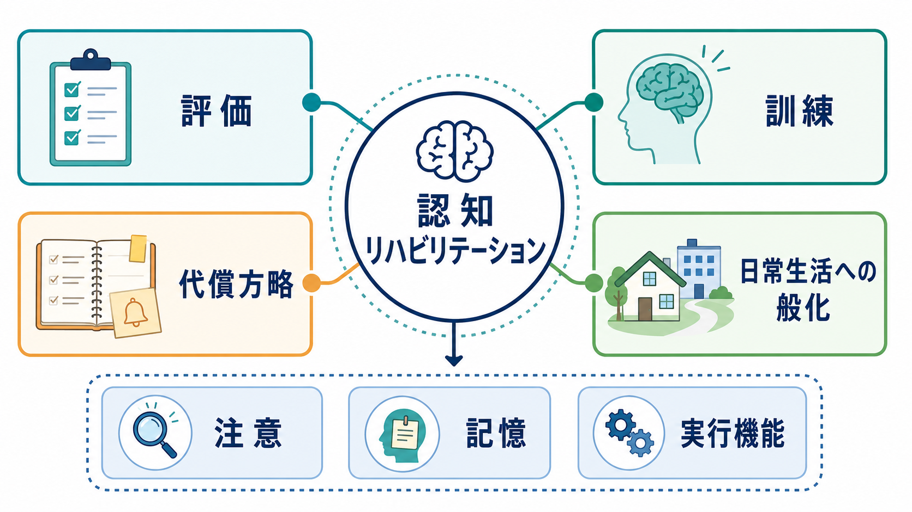
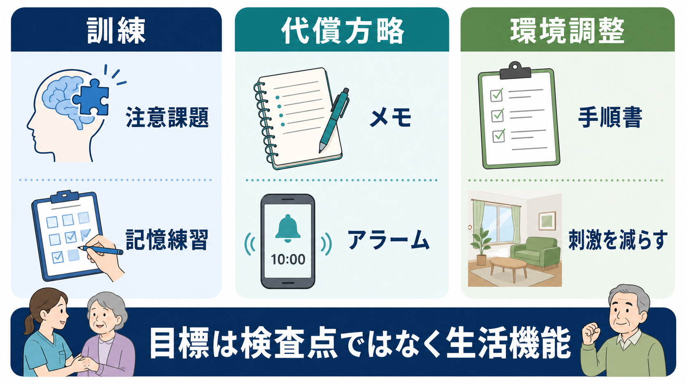
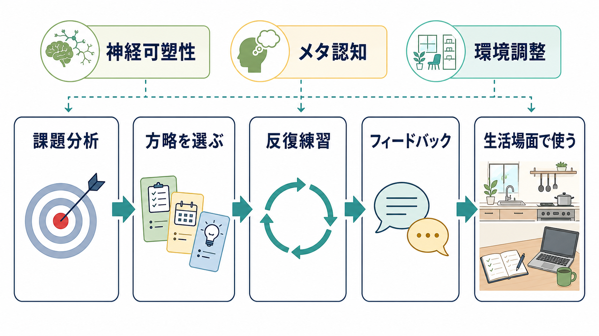

# 認知リハビリテーションとは何か

## 要点

- 認知リハビリテーションは、[[注意とは何か|注意]]、[[長期記憶とは何か|記憶]]、[[実行機能とは何か|実行機能]]、認知コミュニケーションなどの低下に対して、機能訓練、代償方略、環境調整、家族・支援者教育を組み合わせる支援である。
- 目標は「検査点を上げること」だけではなく、服薬、予定管理、家事、復職、学業、対人場面などの生活機能を改善することである[1][7]。
- 根拠は外傷性脳損傷と脳卒中で比較的多く、注意訓練、軽度記憶障害への代償方略、実行機能障害へのメタ認知方略訓練、包括的な神経心理学的リハビリテーションなどに実践推奨がある[1][2][4]。
- 一方で、効果の大きさ、長期持続、日常生活への般化は領域や対象によって異なる。特に脳卒中後の注意・記憶リハビリでは、短期的な主観的改善は示されても、機能・生活の長期改善は一貫しない[5][6]。
- 医療・福祉現場では、神経心理検査だけでなく、行動観察、本人の目標、家族・職場・学校の文脈を合わせて支援を設計する必要がある[7]。

## この記事で答える問い

1. 認知リハビリテーションは、単なる脳トレや検査練習と何が違うのか。
2. 注意、記憶、実行機能の低下に対して、どのような支援を組み合わせるのか。
3. 研究上どこまで確からしく、臨床ではどこに注意すべきか。

## まず結論

認知リハビリテーションは、損なわれた認知機能を「直接鍛える」だけの介入ではない。むしろ、本人が現実の生活で困っている課題を分析し、残存機能を使いやすくし、外的補助具や環境調整を導入し、うまくいった方法を反復して生活場面へ般化させる支援である[1][7]。

たとえば予定を忘れる人に対して、記憶課題だけを反復するのではなく、スマートフォンのアラーム、紙の手帳、家族との確認手順、エラーを減らす学習方法、疲労時に予定を詰めすぎない環境設計を組み合わせる。ここでは[[ワーキングメモリとは何か|ワーキングメモリ]]や記憶の機能そのものだけでなく、「自分の弱点に気づき、道具を使い、状況を調整する」メタ認知と生活設計が中心になる。

## 背景

脳卒中、外傷性脳損傷、脳炎、低酸素脳症、脳腫瘍、神経変性疾患、精神疾患、発達特性などでは、注意を保てない、予定を忘れる、段取りが立てられない、複数作業で混乱する、疲労で認知機能が落ちるといった問題が生じる。こうした問題は、移動や身辺動作が回復しても、復職、家事、服薬管理、金銭管理、対人関係を難しくする。

認知リハビリテーションの研究は、外傷性脳損傷と脳卒中を中心に発展してきた。Ciceroneらの系統的レビューは、2009年から2014年までの文献を追加評価し、注意、半側空間無視、言語・コミュニケーション、記憶、実行機能、包括的リハビリテーションについて推奨を整理している[1]。またINCOG 2.0は、成人の中等度から重度の外傷性脳損傷に対する認知リハビリテーション指針を、注意、実行機能、認知コミュニケーションなどの領域別に更新している[2][3][4][8]。

## 基本概念

### 訓練、代償、環境調整

認知リハビリテーションでは、次の3つを分けて考えると理解しやすい。

| 観点 | 何を狙うか | 例 | 注意点 |
|---|---|---|---|
| 訓練 | 特定の認知処理を反復し、課題遂行を改善する | 注意課題、処理速度課題、記憶方略の練習 | 課題成績の改善が生活へ般化するかを確認する |
| 代償方略 | 低下した機能を道具や手順で補う | メモ、カレンダー、アラーム、チェックリスト | 本人が実際に使える手順まで落とし込む |
| 環境調整 | 失敗しにくい状況を作る | 刺激を減らす、物の置き場所を固定する、手順書を置く | 本人だけでなく家族・職場・学校との調整が必要 |

この3つは対立するものではない。実際には、訓練で課題への気づきを高め、代償方略で生活上の失敗を減らし、環境調整で成功しやすい場面を作る。NICEの脳卒中リハビリテーション指針も、認知障害の評価後に、記憶障害への気づき、エラーレス学習、外的補助具、日課や環境手がかりなどを機能課題に即して使うことを示している[7]。

### 対象となる認知領域

代表的な対象は、注意、記憶、実行機能である。

注意の低下では、集中が続かない、気が散りやすい、複数刺激を同時に扱えない、処理速度が落ちるといった問題が生じる。INCOG 2.0の注意・情報処理速度ガイドラインは、外傷性脳損傷後の注意障害に対して、評価、介入選択、実践監査のための推奨を更新しているが、非薬物的注意介入のエビデンスはなお発展途上で、より質の高い試験が必要とされる[3]。

記憶の低下では、覚え込む、保持する、思い出す、予定を管理する、道具を使うといった複数の段階を分けて考える。軽度の記憶障害では、内的記憶方略よりも外的補助具や環境手がかりのほうが生活に直結しやすいことがある[1][7]。

実行機能の低下では、目標設定、計画、切り替え、抑制、自己監視、問題解決が難しくなる。ここでは、課題を小さく分ける、行動前に計画を言語化する、実行後に自己評価する、失敗のパターンに気づくといったメタ認知方略訓練が重要になる[1][4]。

## 仕組み

認知リハビリテーションの仕組みは、単一の「脳機能回復メカニズム」では説明できない。臨床的には、少なくとも次の層が重なっている。

1. 神経可塑性: 反復練習、課題の難易度調整、フィードバックによって、残存ネットワークの利用効率や課題遂行の安定性を高める。
2. 方略学習: メモ、声出し確認、チェックリスト、分割実行など、認知負荷を下げる手順を身につける。
3. メタ認知: 自分がどの場面で失敗しやすいかを知り、作業前・作業中・作業後に自己監視する。
4. 環境設計: 注意を奪う刺激を減らし、道具の場所や手順を固定し、支援者が同じ方法で促せるようにする。
5. 般化: 訓練室でできたことを、家庭、病棟、職場、学校、地域生活で使えるようにする。

## 図解

認知リハビリテーションは、次の流れで設計すると実装しやすい。

| 段階 | 臨床で見ること | 具体例 |
|---|---|---|
| 評価 | どの認知領域が、どの生活課題に影響しているか | [[認知機能検査は何を測っているのか|認知機能検査]]、行動観察、家族聴取 |
| 目標設定 | 本人にとって意味のある生活目標か | 服薬を忘れない、調理を安全に行う、復職準備をする |
| 介入選択 | 訓練・代償・環境調整のどれを主に使うか | 注意訓練、手帳、アラーム、刺激を減らす |
| 練習 | 失敗を減らしながら反復できるか | エラーレス学習、段階づけ、フィードバック |
| 般化 | 実生活で使えるか | 家庭訪問、職場調整、支援者への共有 |
| 再評価 | 検査点だけでなく生活機能が変わったか | ADL/IADL、本人の困りごと、支援負担 |

## 臨床・研究との接続

### エビデンスの強い部分

Ciceroneらのレビューでは、TBIまたは脳卒中後の注意障害、軽度記憶障害に対する代償方略、実行機能障害へのメタ認知方略訓練、TBIまたは脳卒中後の包括的・全人的な神経心理学的リハビリテーションなどが、実践標準または実践指針として整理されている[1]。これは「認知課題を反復すればよい」という意味ではなく、障害特性、機能目標、生活文脈に合わせて介入を組み合わせる必要があるという実践的な根拠である。

INCOG 2.0は、中等度から重度の外傷性脳損傷に対し、注意、実行機能、認知コミュニケーションなどの領域別に推奨を更新している[2][3][4][8]。特に実行機能では、日常の目標設定、自己監視、問題解決を促すメタ認知的アプローチが重要になる[4]。

### エビデンスの限界

脳卒中後の注意障害に対するCochraneレビューでは、注意リハビリの効果は一部の注意成績に短期的効果を示す可能性がある一方、機能、気分、生活の質への明確な長期効果は確認されていない[5]。記憶障害に対するCochraneレビューでも、主観的記憶の短期改善は示されるが、客観的記憶検査、気分、機能、生活の質への効果は限定的である[6]。

この限界は、認知リハビリテーションが無効だという意味ではない。むしろ、対象者、病因、時期、介入強度、アウトカム、般化支援がばらつきやすいことを示している。研究では検査点を測りやすいが、臨床では「家で薬を飲める」「職場で休憩を入れられる」「予定を家族と共有できる」といった生活上の成功を測る必要がある。

### 医療安全上の注意

認知リハビリテーションは教育・研究・臨床実践の枠組みで理解されるべきであり、個別の診断や治療指示を置き換えるものではない。急な意識障害、急性の神経症状、せん妄、重い抑うつや自殺リスク、薬剤性の認知低下、睡眠障害、疼痛、疲労、感覚障害がある場合は、認知訓練だけで説明せず、医学的評価と多職種連携が必要である。

## よくある誤解

### 誤解1: 認知リハビリは脳トレである

脳トレ型の課題は一部の訓練として使われることがあるが、認知リハビリテーション全体ではない。重要なのは、課題成績が改善したかだけでなく、その改善が実生活の目標に結びつくかである。

### 誤解2: 記憶障害には記憶練習だけを行えばよい

記憶練習だけでは、予定管理や服薬管理の失敗が減らないことがある。外的補助具、環境手がかり、日課の固定、支援者の促しを組み合わせるほうが生活に直結する場合が多い[6][7]。

### 誤解3: 代償方略は「回復をあきらめる」ことである

代償方略は回復の放棄ではない。失敗を減らし、活動量を保ち、本人が成功経験を積むための手段である。道具を使うことで生活が安定すれば、訓練や社会参加に使える認知的余力も増える。

### 誤解4: 検査点がよければ生活上の問題はない

検査場面は静かで構造化されている。実生活では、疲労、時間制限、対人刺激、騒音、複数課題、感情的負荷が加わる。したがって、[[認知機能低下はどのように評価するのか|認知機能低下の評価]]では、検査と行動観察を組み合わせる必要がある。

## 関連ノート

- [[注意とは何か]]
- [[ワーキングメモリとは何か]]
- [[長期記憶とは何か]]
- [[実行機能とは何か]]
- [[認知負荷とは何か]]
- [[メタ認知とは何か]]
- [[認知機能検査は何を測っているのか]]
- [[認知機能低下はどのように評価するのか]]
- [[MoCAとは何か]]
- [[GAFやWHODASは何を評価するのか]]

## MOC更新候補

- [[MOC｜臨床実践・治療]]
- [[MOC｜認知機能]]
- [[MOC｜認知科学・心理学]]

## 理解チェック

1. 認知リハビリテーションで「訓練」と「代償方略」と「環境調整」はどう違うか。
2. 記憶障害への支援で、外的補助具や環境手がかりが重要になるのはなぜか。
3. 実行機能障害に対して、メタ認知方略訓練が役立つ場面はどのような場面か。
4. 検査点の改善と生活機能の改善がずれる理由は何か。
5. 認知リハビリテーションの効果を評価するとき、どのアウトカムを組み合わせるべきか。

## 未解決問題

- どの対象者に、どの時期から、どの強度で介入すると生活機能への般化が最も起こりやすいのか。
- コンピュータ課題や遠隔リハビリテーションは、対面支援や環境調整とどう組み合わせると有効か。
- 認知機能検査、本人報告、家族報告、ADL/IADL、就労・学業アウトカムをどう統合して評価するか。
- 神経変性疾患や精神疾患における認知リハビリテーションを、脳卒中・外傷性脳損傷の知見からどこまで一般化できるか。

## 参考文献

[1] Cicerone, K. D., Goldin, Y., Ganci, K., Rosenbaum, A., Wethe, J. V., Langenbahn, D. M., et al. (2019). Evidence-Based Cognitive Rehabilitation: Systematic Review of the Literature From 2009 Through 2014. *Archives of Physical Medicine and Rehabilitation, 100*(8), 1515-1533. https://doi.org/10.1016/j.apmr.2019.02.011

[2] Bayley, M. T., Janzen, S., Harnett, A., Bragge, P., Togher, L., Kua, A., et al. (2023). INCOG 2.0 Guidelines for Cognitive Rehabilitation Following Traumatic Brain Injury: What's Changed From 2014 to Now? *Journal of Head Trauma Rehabilitation, 38*(1), 1-6. https://doi.org/10.1097/HTR.0000000000000826

[3] Ponsford, J., Velikonja, D., Janzen, S., Harnett, A., McIntyre, A., Wiseman-Hakes, C., et al. (2023). INCOG 2.0 Guidelines for Cognitive Rehabilitation Following Traumatic Brain Injury, Part II: Attention and Information Processing Speed. *Journal of Head Trauma Rehabilitation, 38*(1), 38-51. https://doi.org/10.1097/HTR.0000000000000839

[4] Jeffay, E., Ponsford, J., Harnett, A., Janzen, S., Patsakos, E., Douglas, J., et al. (2023). INCOG 2.0 Guidelines for Cognitive Rehabilitation Following Traumatic Brain Injury, Part III: Executive Functions. *Journal of Head Trauma Rehabilitation, 38*(1), 52-64. https://doi.org/10.1097/HTR.0000000000000834

[5] Loetscher, T., Potter, K. J., Wong, D., & das Nair, R. (2019). Cognitive rehabilitation for attention deficits following stroke. *Cochrane Database of Systematic Reviews*, 2019(11), CD002842. https://doi.org/10.1002/14651858.CD002842.pub3

[6] das Nair, R., Cogger, H., Worthington, E., & Lincoln, N. B. (2016). Cognitive rehabilitation for memory deficits after stroke. *Cochrane Database of Systematic Reviews*, 2016(9), CD002293. https://doi.org/10.1002/14651858.CD002293.pub3

[7] National Institute for Health and Care Excellence. (2023). *Stroke rehabilitation in adults* (NICE guideline NG236). https://www.nice.org.uk/guidance/ng236

[8] Togher, L., Douglas, J., Turkstra, L. S., Welch-West, P., Janzen, S., Harnett, A., et al. (2023). INCOG 2.0 Guidelines for Cognitive Rehabilitation Following Traumatic Brain Injury, Part IV: Cognitive-Communication and Social Cognition Disorders. *Journal of Head Trauma Rehabilitation, 38*(1), 65-82. https://doi.org/10.1097/HTR.0000000000000835
