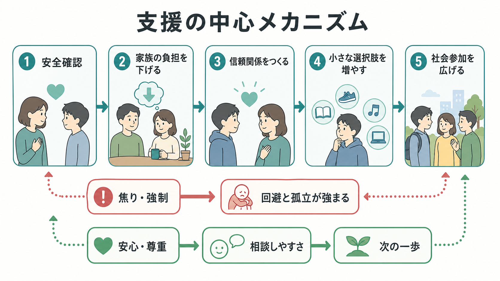
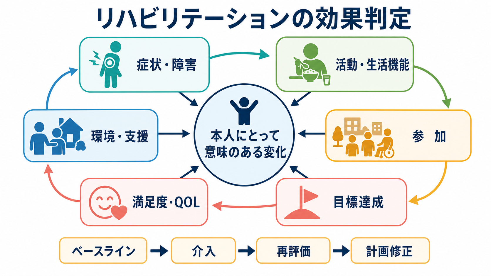
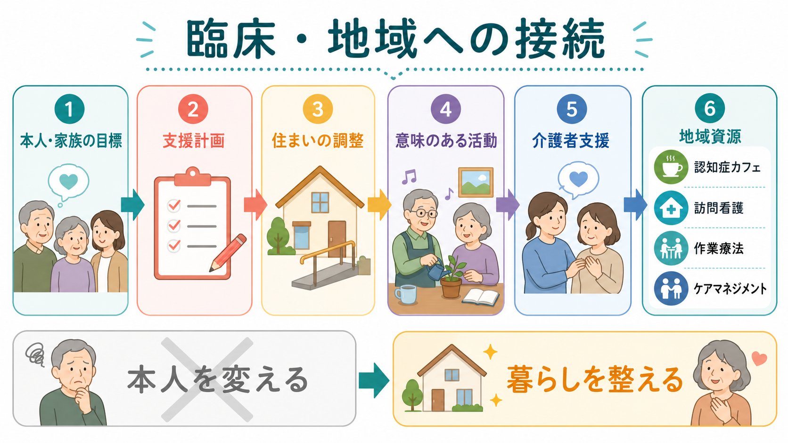

# 認知症の生活支援とは何か

## 要点

- 認知症の生活支援は、「認知機能を元に戻す」ことではなく、本人が残している力、住まい・道具・手順の調整、介護者への支援を組み合わせて、日常生活を続けやすくする実践である。
- 支援の出発点は、診断名ではなく「何に困っているか」「何を続けたいか」「どの場面で失敗が起きるか」である。
- 有効な支援は、本人の能力評価だけでなく、環境、活動、関係性、介護者負担を同時に見る。
- 本人の意思決定を支えることは生活支援の中心であり、本人抜きに「安全」だけを最大化すると、尊厳・参加・意欲を損ないやすい。
- 家族介護者への心理教育、技能訓練、相談先の確保は、本人の生活を支えるための間接支援でもある。

## この記事で答える問い

この記事では、[[認知症とは何か]]や[[BPSDとは何か]]で扱う症状理解を前提に、生活場面で何を支えるのかを整理する。中心になる問いは、次の三つである。

1. 認知症の生活支援は、単なる見守りや介助と何が違うのか。
2. 残存能力、環境調整、介護者支援をどう組み合わせるのか。
3. 臨床・地域支援では、どのように評価し、実行し、見直すのか。

## まず結論

認知症の生活支援とは、本人が「できない人」になる前に、生活行為を細かく観察し、失敗が起きる条件を変え、本人が使える手がかりと介護者の支え方を調整することである。NICE は、認知症の人に対して、本人の好みや状態に合わせた活動、認知リハビリテーション、作業療法、介護者への心理教育・技能訓練を推奨している[1]。つまり生活支援は、薬物療法の補助ではなく、独立した臨床実践の柱である。

## 背景

認知症では、記憶、見当識、遂行機能、言語、注意、社会的認知などの低下が、食事、服薬、入浴、金銭管理、外出、対人関係に影響する。ここで重要なのは、同じ認知機能低下でも、生活上の困難は環境によって大きく変わることである。例えば、台所の物品配置が固定され、手順が見える化され、家族の声かけが短く一貫していれば、同じ人でも調理や片づけを続けられる場合がある。

WHO の認知症行動計画は、認知症の人と介護者が尊厳、意味、自律をもって暮らせるよう、医療・介護・地域資源を整えることを公衆衛生上の目標に置いている[2]。日本でも、厚生労働省の意思決定支援ガイドラインは、認知症の人が自らの意思に基づいて日常生活・社会生活を送れるように支える姿勢を示している[3]。

したがって生活支援は、「認知症だから代わりに決める」実践ではない。本人の理解・表現・選択を支える条件を整え、難しい部分だけを補い、本人が参加できる範囲を広げる実践である。これは[[意思決定支援とは何か]]や[[共同意思決定とは何か]]とも接続する。

## 基本概念

### 残存能力

残存能力とは、失われていない能力を美化する言葉ではない。生活行為を成立させるために、まだ使える認知・身体・感情・社会的資源を具体的に見る視点である。例えば、短期記憶は弱くても、長年の手続き記憶、馴染みの場所での身体感覚、音楽や祈りの習慣、特定の人との信頼関係は残っていることがある。

支援者は「できる／できない」を一括で判定するのではなく、行為を分解して見る。服薬なら、薬を見つける、日付を確認する、水を用意する、飲む、飲んだことを記録する、という複数の小課題から成る。どこで詰まるかが分かれば、介助量を増やす前に、ピルケース、カレンダー、音声リマインダー、家族の確認タイミングなどを調整できる。

### 環境調整

環境調整とは、本人を環境に合わせるのではなく、環境を本人の認知特性に合わせることである。物の定位置化、視覚的手がかり、照明、騒音の低減、段差・転倒リスクの修正、予定表、トイレや寝室の分かりやすい表示などが含まれる。Alzheimer's Association の実践推奨でも、本人中心のケア、ADL 支援、支持的・治療的環境、サービス移行の調整が重要領域として整理されている[4]。

環境調整は、単に事故を防ぐためだけではない。余分な探索、迷い、叱責、失敗体験を減らし、本人が「自分でできた」と感じる余地を作る。これは[[認知リハビリテーションとは何か]]や[[作業療法は精神科で何をするのか]]で扱う、機能と活動を結び直す考え方に近い。

### 介護者支援

介護者支援は、家族を「頑張らせる」ことではない。認知症の進行、行動の意味、声かけ、環境調整、休息、相談先、緊急時対応を共有し、介護者が孤立しないようにすることである。NICE は、介護者に対して、認知症の教育、個別化された対応戦略、介護技能、行動変化への理解、コミュニケーション調整を含む心理教育・技能訓練を提供するよう推奨している[1]。

介護者の不安、抑うつ、疲弊が高まると、本人への声かけは急ぎ、訂正、命令になりやすい。これは本人の混乱や抵抗を強め、さらに介護者負担を増やす。[[介護者負担は精神健康にどう影響するのか]]で扱うように、介護者支援は本人支援の周辺事項ではなく、生活支援の中核である。

## 仕組み

生活支援の仕組みは、「人・課題・環境」のミスマッチを小さくすることとして理解できる。

### 1. 生活課題を観察する

まず、本人や家族が困っている場面を一つ選ぶ。食事、服薬、入浴、排泄、外出、電話対応、金銭管理など、焦点を絞るほど支援は具体化しやすい。観察では、症状名ではなく、時間帯、場所、人、物、声かけ、疲労、痛み、睡眠、空腹、騒音などを記録する。

### 2. 行為を分解する

次に、生活行為を小さな手順に分ける。本人がどの手順を自力ででき、どこで止まり、どの手がかりが有効かを見る。認知リハビリテーションは、本人にとって意味のある機能目標を設定し、強みを使いながら日常生活上の障害を補う実践として説明される[1]。

### 3. 環境と手がかりを変える

支援者は、本人の努力を増やす前に、失敗しやすい条件を変える。選択肢を減らす、道具を見える場所に置く、色やラベルで区別する、手順を一枚紙にする、予定を同じ場所に掲示する、声かけを短く肯定形にする、疲れやすい時間を避ける、といった調整である。

### 4. 介護者の関わり方を整える

介護者には、本人の失敗をすぐ訂正するのではなく、待つ、選択肢を二つにする、言葉より実物を示す、否定より代替案を出す、といった関わり方を練習してもらう。コミュニケーション訓練のレビューでは、介護者の知識やコミュニケーション技能の改善が示されており、技能練習を含む能動的な介入が重要とされる[5]。

### 5. 成功体験と再評価を循環させる

一度うまくいった方法も、認知症の進行、身体疾患、薬剤、住環境、家族状況によって合わなくなる。生活支援は、評価、実行、見直しの循環である。Tailored Activity Program などの個別化活動プログラムは、本人の能力、興味、過去の役割に合わせて活動を設計し、家族に活動の使い方を訓練する介入として研究されてきた[6]。2021 年の RCT でも、意味ある活動の不足が症状や QOL に影響するという問題設定のもと、本人と介護者の二者関係を対象にした介入が検討されている[7]。

## 図解

生活支援は、臨床面接だけで完結しない。本人・家族の目標を起点に、支援計画、住まいの調整、意味のある活動、介護者支援、地域資源をつなぐ必要がある。

## 臨床・研究との接続

### 認知症診療との接続

生活支援は、診断後の「生活説明」ではなく、診断と並行して始まる。[[アルツハイマー型認知症とは何か]]、[[レビー小体型認知症とは何か]]、[[前頭側頭型認知症とは何か]]、[[血管性認知症とは何か]]では、症状の出方が異なる。幻視やパーキンソニズムが目立つ場合、脱抑制や常同行動が目立つ場合、脳血管障害後の遂行機能障害が目立つ場合では、環境調整と介護者教育の焦点も変わる。

### BPSD との接続

[[BPSDとは何か]]は、本人の性格だけでなく、身体不調、環境、関係性、課題要求との相互作用で理解する必要がある。生活支援では、行動を「問題」として抑える前に、過剰な刺激、痛み、便秘、睡眠不足、予定変更、説明不足、失敗体験がないかを見る。非薬物的支援は万能ではないが、BPSD の背景を変えられる場合には、本人の苦痛と介護者負担の双方を下げる可能性がある。

### 地域支援との接続

生活支援は、家庭内の工夫だけでは限界がある。ケアマネジメント、訪問看護、作業療法、通所サービス、認知症カフェ、家族会、成年後見や意思決定支援の相談などを組み合わせる。特に独居、老老介護、虐待リスク、金銭管理困難、服薬事故、徘徊・行方不明リスクがある場合は、早期に多職種で役割分担する。[[ケアマネジメントとケースマネジメントは何が違うのか]]、[[訪問看護は精神科で何を支えるのか]]、[[金銭管理支援とは何か]]とも接続する領域である。

## よくある誤解

### 誤解1：本人に何度も説明すればできるようになる

説明は必要だが、記憶や遂行機能の障害がある場合、説明量を増やすほど混乱が増えることがある。生活支援では、言葉で説得するより、環境、手順、道具、タイミングを変える。

### 誤解2：安全を優先するなら活動を減らすべきである

危険な活動をそのまま続ける必要はない。しかし活動を一律に止めると、廃用、孤立、抑うつ、BPSD の悪化につながることがある。重要なのは、本人の意味ある活動を、危険の少ない形に作り替えることである。

### 誤解3：介護者支援は家族向けサービスであって本人支援ではない

介護者が認知症を理解し、休息を取り、相談できる状態は、本人の生活の安定に直結する。介護者支援は、本人の尊厳を守るための環境調整でもある。

### 誤解4：生活支援は専門性が低い

生活支援には、認知機能、身体機能、環境、家族力動、制度、リスク管理を統合する専門性が必要である。単純な親切ではなく、評価と仮説検証を伴う臨床技術である。

## 関連ノート

- [[認知症とは何か]]
- [[BPSDとは何か]]
- [[認知リハビリテーションとは何か]]
- [[作業療法は精神科で何をするのか]]
- [[意思決定支援とは何か]]
- [[介護者負担は精神健康にどう影響するのか]]
- [[ケアマネジメントとケースマネジメントは何が違うのか]]
- [[訪問看護は精神科で何を支えるのか]]
- [[金銭管理支援とは何か]]

## MOC更新候補

- `content/00_MOC/MOC｜リハビリ・生活支援.md` に本記事へのリンクを追加する候補。
- 認知症関連 MOC または高齢者臨床 MOC が統合ジョブで作成・更新される場合、[[認知症とは何か]]、[[BPSDとは何か]]、本記事を近接配置する候補。

## 理解チェック

1. 認知症の生活支援が「本人を変える」より先に「課題と環境を変える」理由は何か。
2. 服薬、入浴、外出のうち一つを選び、生活行為を五つの手順に分解するとどうなるか。
3. 介護者支援が本人支援でもある理由を、BPSD の悪循環と結びつけて説明できるか。
4. 安全確保と本人の意思尊重が衝突しそうな場面で、どのように代替案を探すか。

## 未解決問題

- 日本の在宅・地域ケアで、どの生活支援プログラムが費用対効果に優れるかは、制度・地域資源・家族構成によって異なる。
- 認知症の進行に応じて、本人の意思決定支援をどのタイミングでどのように更新するかは、実践上の難題である。
- 介護者支援は有効性が示される一方で、介護者に追加負担をかけない提供方法、遠隔支援、地域格差への対応が課題である[8]。

## 参考文献

[1] National Institute for Health and Care Excellence. (2018). *Dementia: assessment, management and support for people living with dementia and their carers (NG97).* https://www.nice.org.uk/guidance/ng97/chapter/Recommendations

[2] World Health Organization. (2017). *Global action plan on the public health response to dementia 2017-2025.* https://www.who.int/publications/i/item/9789241513487

[3] 厚生労働省. (2025). *認知症の人の日常生活・社会生活における意思決定支援ガイドライン（第2版）.* https://www.mhlw.go.jp/stf/seisakunitsuite/bunya/0000212395.html

[4] Fazio, S., Pace, D., Maslow, K., Zimmerman, S., & Kallmyer, B. (2018). Alzheimer's Association Dementia Care Practice Recommendations. *The Gerontologist, 58*(suppl_1), S1-S9. https://doi.org/10.1093/geront/gnx182

[5] Morris, L., Horne, M., McEvoy, P., & Williamson, T. (2018). Communication training interventions for family and professional carers of people living with dementia: A systematic review. *Aging & Mental Health, 22*(7), 863-880. https://doi.org/10.1080/13607863.2017.1399343

[6] Gitlin, L. N., Winter, L., Vause Earland, T., Herge, E. A., Chernett, N. L., Piersol, C. V., & Burke, J. P. (2009). The Tailored Activity Program to reduce behavioral symptoms in individuals with dementia: Feasibility, acceptability, and replication potential. *The Gerontologist, 49*(3), 428-439. https://doi.org/10.1093/geront/gnp087

[7] Gitlin, L. N., Marx, K., Piersol, C. V., Hodgson, N. A., Huang, J., Roth, D. L., & Lyketsos, C. G. (2021). Effects of the Tailored Activity Program (TAP) on dementia-related symptoms, health events and caregiver wellbeing: A randomized controlled trial. *BMC Geriatrics, 21*, 581. https://doi.org/10.1186/s12877-021-02511-4

[8] Vernooij-Dassen, M., Draskovic, I., McCleery, J., & Downs, M. (2022). Cognitive reframing for carers of people with dementia. *Cochrane Database of Systematic Reviews*, CD005318. https://doi.org/10.1002/14651858.CD005318.pub2
