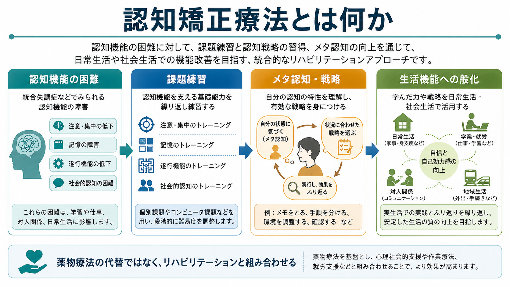
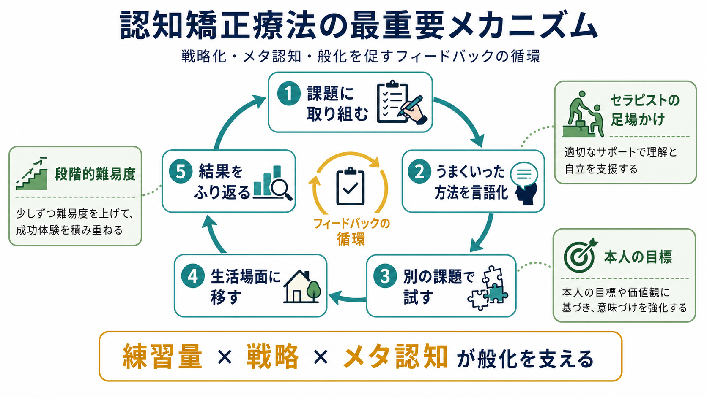
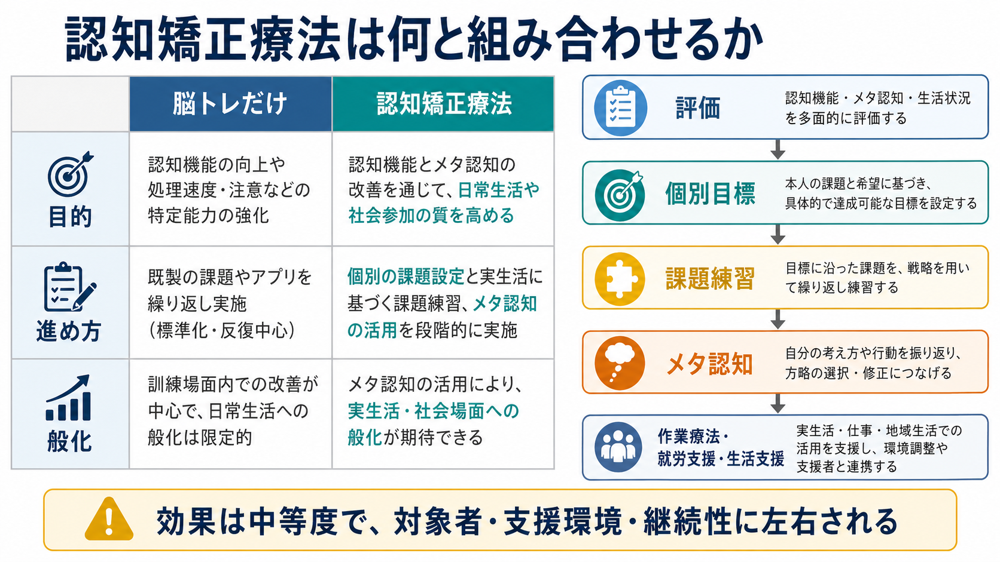

# 認知矯正療法とは何か

## 要点

- 認知矯正療法は、[[統合失調症の認知機能障害とは何か|統合失調症の認知機能障害]]などに対して、注意、記憶、処理速度、遂行機能、社会認知を直接または間接に鍛える心理社会的リハビリテーションである。
- 単なる「脳トレ」ではなく、課題練習、認知戦略、メタ認知、フィードバック、現実生活への般化を組み合わせる点が中核である[1][2]。
- メタ分析では、認知機能には小から中等度の改善が示され、機能的アウトカムへの効果は、[[精神科リハビリテーションとは何か|精神科リハビリテーション]]、作業療法、就労支援、生活支援と組み合わせたときに強まりやすい[1][3]。
- 効果は万能ではなく、対象者の状態、動機づけ、介入量、支援者の関わり、日常場面への橋渡しに左右される[2][4]。
- 医療・福祉・教育目的の支援であり、個別の診断や治療指示ではない。実施は本人の希望、症状の安定、疲労、生活課題、支援環境を踏まえて調整する。

## この記事で答える問い

1. 認知矯正療法は、認知機能障害に対して何を変えようとするのか。
2. 課題練習とメタ認知は、どのように組み合わされるのか。
3. なぜ生活機能や社会参加への般化が重要なのか。
4. 研究上、どこまで効果が示され、どこに限界があるのか。
5. 臨床でよくある誤解は何か。

## まず結論

認知矯正療法は、「認知課題をたくさん解かせる訓練」ではなく、「認知のつまずきを本人が理解し、使える戦略を増やし、生活の場で使える形に移す支援」である。統合失調症では、幻覚や妄想が目立たない時期にも、注意、記憶、処理速度、問題解決、社会認知の困難が残り、仕事、学業、家事、対人関係、自立生活に影響しうる[6]。そのため、認知機能を測定して終わるのではなく、[[認知機能検査は何を測っているのか|認知機能検査]]で見えた困難を、本人の生活目標に接続する必要がある。

メタ分析では、認知矯正療法は認知機能、症状、心理社会的機能に一定の改善をもたらすが、機能的アウトカムへの効果は、認知矯正療法単独よりも、精神科リハビリテーションと組み合わせた研究で大きくなりやすい[3]。これは、課題画面の中で得た改善を、服薬管理、通所、家事、対人関係、就労、学業へ移す工程が必要だということを意味する。

## 背景

統合失調症の認知機能障害は、陽性症状や陰性症状とは別に、機能的アウトカムを左右する重要な要因として研究されてきた[6]。たとえば、会話を追い続ける、予定を覚える、複数の手順を並べる、予期しない変更に対応する、相手の意図を推測する、といった日常行動には、複数の認知機能が関わる。これらが弱いと、本人の意欲だけでは説明できない失敗や疲労が増えやすい。

薬物療法は精神病症状の軽減に重要だが、認知機能障害や社会機能のすべてを十分に改善するわけではない。そこで、認知機能を直接の介入対象としつつ、心理社会的リハビリテーションへ接続する方法として認知矯正療法が発展した[3][7]。日本でもNEARなどの導入研究が行われ、コンピュータ課題とグループミーティングを組み合わせ、動機づけや日常生活への般化を促す実践が報告されている[8]。

## 基本概念

### 課題練習

課題練習は、注意、記憶、処理速度、遂行機能、社会認知などに関わる課題を、段階的な難易度で反復する部分である。コンピュータ課題、紙筆課題、グループ課題などが使われる。重要なのは、単に正答数を増やすことではなく、「どの条件でうまくいき、どこでつまずくか」を本人と支援者が観察することである。

### 認知戦略

認知戦略とは、困難を補うための具体的な方法である。たとえば、メモを取る、手順を分ける、声に出して確認する、視覚的な手がかりを使う、休憩を挟む、環境刺激を減らす、といった方法が含まれる。ドリルだけでなく戦略コーチングを含む介入は、機能的アウトカムへの効果が強まりやすいと報告されている[1][3]。

### メタ認知

ここでいうメタ認知は、自分の認知の癖、得意不得意、疲労しやすい条件、役に立つ方略をふり返り、次の行動に活かす力である。メタ認知を重視するCIRCuiTSなどのプログラムでは、課題を解くこと自体よりも、「どの戦略を選び、なぜそれが有効だったか」を言語化する工程が重視される[4][5]。

### 般化

般化とは、訓練場面で学んだ戦略を、実生活や社会生活に移すことである。認知矯正療法の最終的な目標は、テスト成績を上げることだけではない。買い物、通院、服薬、家事、会話、作業、就労、学業、地域生活で使える形に変換することが重要である。

## 仕組み

認知矯正療法の仕組みは、次の循環として理解できる。

1. 認知課題や生活場面で、本人がつまずきやすい条件を把握する。
2. 課題練習を通じて、注意、記憶、処理速度、問題解決などを反復する。
3. うまくいった方法、失敗した条件、疲労や焦りの影響を言語化する。
4. 別の課題や日常場面で同じ戦略を試す。
5. 結果をふり返り、本人に合う方法へ調整する。

この循環では、[[自己効力感は学習にどう影響するのか|自己効力感]]と[[内発的動機づけとは何か|内発的動機づけ]]が重要になる。失敗を「能力がない証拠」として扱うのではなく、「条件を変えればやり方を調整できる」という経験に変える必要がある。本人の目標に結びつかない課題は、継続しにくく、生活への般化も弱くなりやすい。

## 図解

認知矯正療法は、評価、個別目標、課題練習、メタ認知、生活支援を直線的に並べるだけではなく、何度も往復しながら調整する支援である。評価は入口であり、診断名や点数だけで支援内容を決めるものではない。

| 観点 | 脳トレだけ | 認知矯正療法 |
|---|---|---|
| 目的 | 課題成績や処理速度の向上が中心 | 認知機能、メタ認知、生活機能、社会参加をつなぐ |
| 進め方 | 標準化された課題の反復が中心 | 個別目標に沿って課題、戦略、ふり返りを組み合わせる |
| 支援者の役割 | 課題を提示し、成績を確認する | 方略選択、意味づけ、般化、環境調整を支える |
| 成果の見方 | 課題得点の変化 | 課題得点に加え、生活行動、参加、自己効力感を見る |

## 臨床・研究との接続

臨床では、認知矯正療法は[[心理教育とは何か|心理教育]]、作業療法、[[生活技能訓練SSTとは何か|生活技能訓練SST]]、[[就労支援とは何か|就労支援]]、家族支援、地域生活支援と組み合わせて考える。たとえば、処理速度が遅く疲れやすい人に対しては、単に速く反応する課題を増やすだけでは不十分である。予定を詰め込みすぎない、手順を見える化する、作業時間を区切る、支援者と確認する、といった環境調整も必要になる。

研究では、2007年のメタ分析で、認知機能への中等度、心理社会的機能への小から中等度、症状への小さな効果が報告され、機能的アウトカムは精神科リハビリテーション併用時に強まりやすいことが示された[3]。2011年のメタ分析でも、認知および機能への効果が支持され、戦略的アプローチや補助的リハビリテーションの重要性が示唆された[1]。2021年の大規模メタ分析では、介入の有効性とともに、訓練されたセラピスト、構造化された認知訓練、認知戦略の開発、リハビリテーションとの統合などが中核要素として整理された[2]。

一方で、研究間の異質性は大きい。対象者の年齢、病期、症状、薬物療法、介入時間、グループか個別か、コンピュータ課題か紙筆課題か、アウトカム指標、フォローアップ期間が異なる。したがって、「認知矯正療法は効くか」と一括して問うよりも、「誰に、どの時期に、どの支援と組み合わせ、何をアウトカムにするか」を問う必要がある。

## よくある誤解

### 誤解1: 認知矯正療法は脳トレである

課題練習は重要だが、それだけでは認知矯正療法の一部にすぎない。中核は、本人が使える戦略を増やし、生活の場へ移すことにある。画面上の成績が上がっても、通院、家事、会話、就労で使えなければ臨床的意味は限定される。

### 誤解2: 認知機能が低い人には難しすぎる

認知機能に困難があるからこそ、課題の難易度、手がかり、休憩、環境、フィードバックを調整する。重要なのは、本人を失敗させ続けることではなく、成功体験と方略使用を積み上げることである。

### 誤解3: 薬物療法の代わりになる

認知矯正療法は薬物療法の代替ではない。精神病症状の安定、睡眠、身体状態、薬物の副作用、生活リズムを見ながら、心理社会的支援として組み合わせる。症状が強い時期には、安全確保や急性期治療が優先されることがある。

### 誤解4: 認知課題の点数が上がれば生活も自動的に改善する

生活への般化には、支援者とのふり返り、現実場面での練習、環境調整、家族や職場・学校との連携が必要である。機能的アウトカムへの効果がリハビリテーション併用で強まりやすいという知見は、この点と整合する[1][3]。

## 関連ノート

- [[統合失調症とは何か]]
- [[統合失調症の認知機能障害とは何か]]
- [[認知機能障害とは何か]]
- [[認知機能検査は何を測っているのか]]
- [[精神疾患と認知機能障害はどう関係するのか]]
- [[精神科リハビリテーションとは何か]]
- [[心理教育とは何か]]
- [[生活技能訓練SSTとは何か]]
- [[就労支援とは何か]]
- [[自己効力感は学習にどう影響するのか]]

## MOC更新候補

- `content/00_MOC/MOC｜臨床実践・治療.md`
- `content/00_MOC/MOC｜認知機能.md`
- `content/00_MOC/MOC｜精神医学.md`

今回は並列ジョブとの競合を避けるため、MOC本体は更新せず、候補提示に留める。

## 理解チェック

1. 認知矯正療法が「脳トレだけ」と異なる点を、課題練習、戦略、メタ認知、般化の語を使って説明できるか。
2. 機能的アウトカムへの効果が、精神科リハビリテーション併用時に強まりやすい理由を説明できるか。
3. 認知機能検査の結果を、本人の生活目標に接続するときに確認すべきことは何か。
4. 認知矯正療法を行う際、本人の動機づけや自己効力感を損なわない工夫には何があるか。
5. 研究知見を臨床に移すとき、対象者、支援環境、アウトカムの違いをなぜ考慮する必要があるか。

## 参考文献

[1] Wykes, T., Huddy, V., Cellard, C., McGurk, S. R., & Czobor, P. (2011). A meta-analysis of cognitive remediation for schizophrenia: Methodology and effect sizes. *American Journal of Psychiatry, 168*(5), 472-485. https://doi.org/10.1176/appi.ajp.2010.10060855

[2] Vita, A., Barlati, S., Ceraso, A., Nibbio, G., Ariu, C., Deste, G., & Wykes, T. (2021). Effectiveness, core elements, and moderators of response of cognitive remediation for schizophrenia: A systematic review and meta-analysis of randomized clinical trials. *JAMA Psychiatry, 78*(8), 848-858. https://doi.org/10.1001/jamapsychiatry.2021.0620

[3] McGurk, S. R., Twamley, E. W., Sitzer, D. I., McHugo, G. J., & Mueser, K. T. (2007). A meta-analysis of cognitive remediation in schizophrenia. *American Journal of Psychiatry, 164*(12), 1791-1802. https://doi.org/10.1176/appi.ajp.2007.07060906

[4] Reeder, C., Huddy, V., Cella, M., Taylor, R., Greenwood, K., Landau, S., & Wykes, T. (2017). A new generation computerised metacognitive cognitive remediation programme for schizophrenia (CIRCuiTS): A randomised controlled trial. *Psychological Medicine, 47*(15), 2720-2730. https://doi.org/10.1017/S0033291717001234

[5] Cella, M., Edwards, C., Swan, S., Elliot, K., Reeder, C., & Wykes, T. (2019). Exploring the effects of cognitive remediation on metacognition in people with schizophrenia. *Journal of Experimental Psychopathology, 10*(2). https://doi.org/10.1177/2043808719826846

[6] Green, M. F., & Harvey, P. D. (2014). Cognition in schizophrenia: Past, present, and future. *Schizophrenia Research: Cognition, 1*(1), e1-e9. https://doi.org/10.1016/j.scog.2014.02.001

[7] Medalia, A., & Choi, J. (2009). Cognitive remediation in schizophrenia. *Neuropsychology Review, 19*(3), 353-364. https://doi.org/10.1007/s11065-009-9097-y

[8] 池澤聰, 朴盛弘, 三木志保, 加藤正人, 玉城国哉, 岩崎彰, 佐藤いづみ, 片山征爾, ほか. (2009). 統合失調症の認知機能障害に対する認知矯正療法の効果に関する予備的検討. *精神医学, 51*(10), 999-1008. https://webview.isho.jp/journal/detail/abs/10.11477/mf.1405101509

## 未解決問題

- どの認知領域の改善が、どの生活機能に最も強く転移するのかは、まだ十分に一貫していない。
- メタ認知、動機づけ、自己効力感が、認知矯正療法の効果をどの程度媒介するかは、測定法を含めて検討が必要である。
- 日本の地域精神医療、就労支援、作業療法、訪問支援の文脈で、どの実装形式が継続しやすいかはさらに整理が必要である。
- デジタル課題や遠隔支援を用いる場合、アクセス格差、疲労、個人情報、支援者の関与をどう設計するかが課題である。
