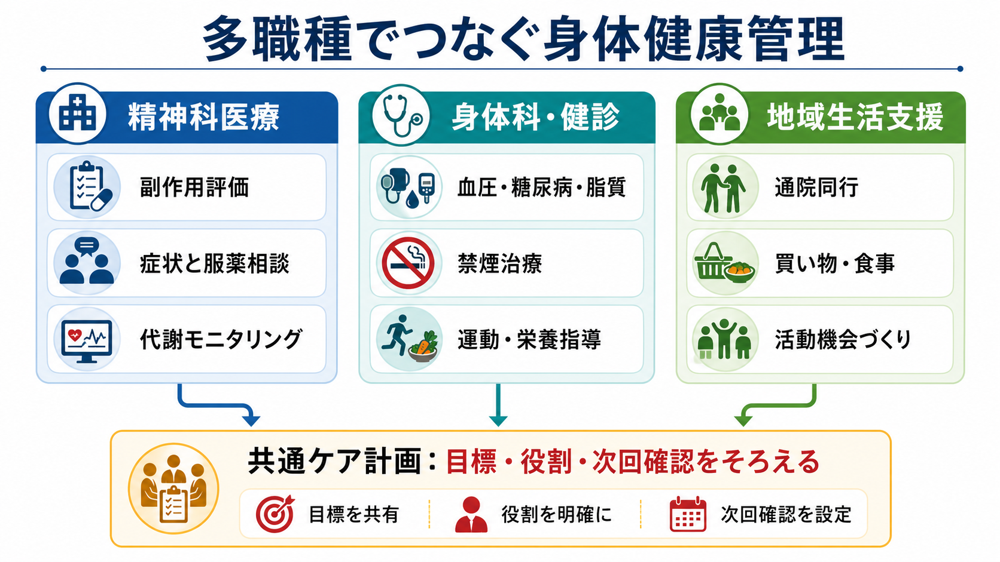
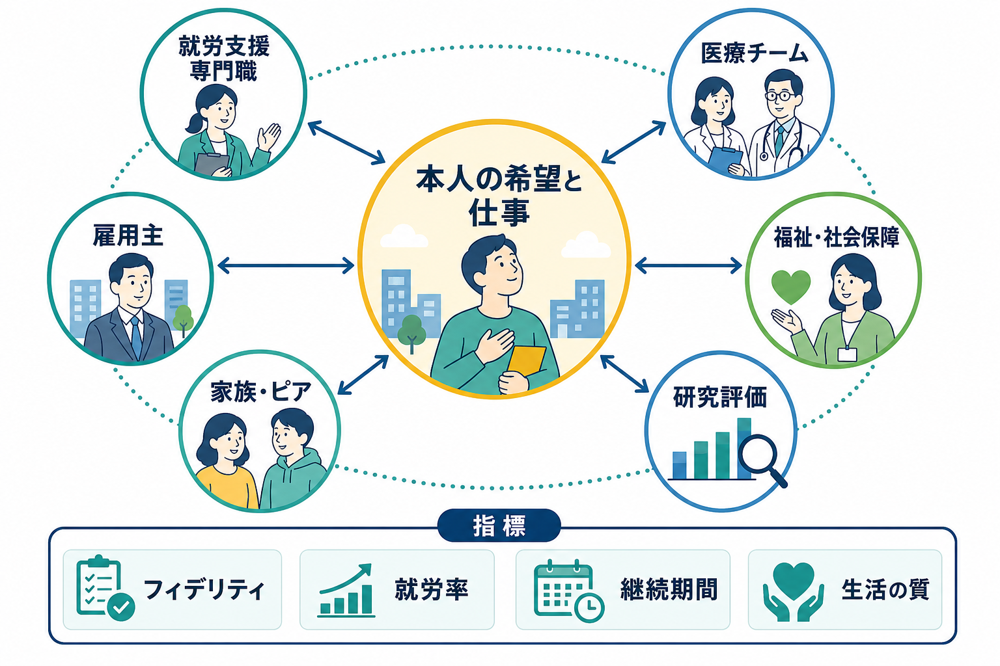

# 身体健康管理支援とは何か

## 要点

- 身体健康管理支援とは、生活習慣病、喫煙、運動不足、睡眠、栄養、薬剤副作用、受診中断を別々の問題として扱わず、本人の生活の中で継続的に見つけ、共有し、調整する支援である。
- 重い精神疾患をもつ人では、予防可能な身体疾患が早期死亡の大きな要因になり、身体健康が本人・周囲・医療システムから見落とされやすいことが指摘されている [1]。
- 支援の中心は「よい生活」を説教することではなく、本人の価値、症状、薬剤、経済状況、住まい、地域資源をふまえた小さな行動計画を作り、続けられる条件を整えることである。
- 抗精神病薬などの副作用は、体重増加、糖脂質代謝、眠気、錐体外路症状、性機能、心血管リスクなどを通じて生活に影響するため、薬物療法の評価と生活支援を切り離さない。
- 実践では、精神科医療、プライマリケア、身体科、薬局、訪問看護、デイケア、作業療法、ケースマネジメントが同じ目標を共有することが重要になる。

## この記事で答える問い

- 身体健康管理支援は、単なる健康指導や健診勧奨と何が違うのか。
- 生活習慣病、喫煙、運動不足、薬剤副作用をどう一つの支援計画にまとめるのか。
- 精神科リハビリテーション、訪問看護、作業療法、デイケア、ケースマネジメントとはどう接続するのか。
- 臨床・研究では、どのようなアウトカムを見ればよいのか。

## まず結論

身体健康管理支援とは、身体疾患のリスクを「本人の自己責任」や「精神科の範囲外」として分離せず、精神症状、薬剤、生活環境、社会的支援、医療アクセスを含めて扱う包括的な支援である。とくに精神科臨床では、身体健康の問題が受診困難、陰性症状、認知機能低下、貧困、孤立、喫煙、抗精神病薬の代謝副作用と絡みやすい。したがって、支援は血圧や体重を測るだけでは終わらない。

実践の単位は、次の循環で考えるとわかりやすい。まず、体重、腹囲、血圧、血糖、脂質、喫煙、活動量、睡眠、食事、服薬、副作用、受診状況を評価する。次に、本人が理解できる言葉でリスクと選択肢を共有する。そのうえで、禁煙治療、運動、栄養、薬剤調整、身体科受診、通院同行、買い物支援、日課づくりなどを組み合わせる。最後に、次回確認日と役割分担を決め、結果を見ながら調整する。

この意味で、身体健康管理支援は [[精神科リハビリテーションとは何か]] や [[リカバリー志向支援とは何か]] の一部であり、[[訪問看護は精神科で何を支えるのか]]、[[作業療法は精神科で何をするのか]]、[[デイケアとは何か]]、[[ケースマネジメントとは何か]] と重なる実践である。

## 背景

精神疾患をもつ人の身体健康は、長く「付随的な問題」として扱われてきた。しかし、WHOは重度精神疾患をもつ成人では予防可能な身体疾患が早期死亡に大きく関わり、寿命が10-20年短くなることがあると整理している [1]。身体健康は本人や周囲だけでなく、医療システムからも見落とされやすい。これは、精神症状そのものだけでなく、身体科へのアクセス、医療者間の分断、スティグマ、経済的困難、薬剤副作用、生活環境の制約が重なるためである。

精神科医療の側でも、身体健康への関心は薬剤副作用のモニタリングに偏りがちである。もちろん、抗精神病薬の体重増加、糖代謝異常、脂質異常、心血管リスクは重要であり、BAPのガイドラインも精神病・抗精神病薬治療に伴う体重増加、代謝異常、心血管リスクの管理を体系化している [3]。一方、重度精神疾患における身体疾患の過剰リスクには、生活習慣、薬物療法、医療アクセス格差が複合的に関わることもレビューで整理されている [7]。したがって、体重や血糖の数値だけを追っても、食事を買う余裕がない、日中の活動場所がない、眠気で朝に起きられない、喫煙が唯一の休息になっている、通院に付き添いが必要である、といった生活上の制約は見えにくい。

このため、身体健康管理支援は「健康になりましょう」という一般論ではなく、生活の条件を整える臨床実践として位置づける必要がある。NICEの精神病・統合失調症ガイドラインは、抗精神病薬を使う人を含め、体重増加、糖尿病、身体健康問題を予防するために健康的な食事、身体活動、禁煙支援を提供することを推奨している [2]。これは、身体健康支援が精神科治療の外側ではなく、治療計画の中に含まれることを示している。

## 基本概念

### 身体健康管理支援は「管理」ではなく共同調整である

「管理」という語は、支援者が本人を監視する印象を与えやすい。しかし、ここでいう管理は、本人の生活を外から統制することではない。むしろ、本人が自分の身体変化に気づき、医療者に相談し、選択肢を理解し、生活の中で続けられる形に調整する共同作業である。

たとえば、体重増加がある人に「食べすぎないでください」と伝えるだけでは支援になりにくい。眠気が強く、日中活動が少なく、夕方に空腹が強まり、安価な高カロリー食品に頼り、体重増加がさらに自己効力感を下げていることがある。この場合の支援は、薬剤の副作用評価、食事の入手方法、活動機会、睡眠リズム、本人の希望、通院可能性を同時に扱う必要がある。

### 身体リスクは「数値」と「生活」の両方で見る

身体健康管理支援では、血圧、HbA1c、脂質、体重、腹囲、喫煙本数、活動量といった測定可能な指標が重要である。一方で、数値だけでは支援の入口を見失う。本人にとって意味のある目標は、「階段で息切れしにくくなる」「薬の眠気を相談できる」「健診結果を一緒に読める」「コンビニで選ぶものを一つ変える」「通院前日に準備する」など、生活上の具体的な変化として現れる。

WHOの身体活動ガイドラインは、身体活動が心血管疾患、2型糖尿病、がんなどの予防・管理だけでなく、抑うつ・不安症状や認知、ウェルビーイングにも関わることを示し、「少しでも動くことは何もしないよりよい」という公衆衛生上のメッセージを強調している [4]。精神科リハビリテーションでは、この考え方がとくに重要である。完璧な運動プログラムよりも、本人ができる最小単位の活動を見つけることが継続性を高める。

### 薬剤副作用は生活支援のテーマである

薬剤副作用は、医師だけが診察室で扱う問題ではない。眠気、体重増加、口渇、便秘、アカシジア、振戦、性機能の問題、月経異常、転倒リスクなどは、本人の食事、外出、仕事、対人関係、服薬継続に直接影響する。[[抗精神病薬の代謝副作用とは何か]] や [[精神疾患と服薬アドヒアランス不良はどう関係するのか]] と接続して理解する必要がある。

重要なのは、支援者が薬剤を勝手に変更することではなく、副作用らしい変化を本人の言葉で拾い、主治医や薬剤師に伝わる形に整理することである。「最近太った」だけでなく、いつから、何kg、食欲や眠気はどうか、薬の変更時期と重なるか、血糖や脂質の確認はいつか、本人は何を困っているかを共有できると、薬剤調整や身体科連携につながりやすくなる。

## 仕組み

### 1. 評価する

評価では、身体指標と生活情報を同時に見る。身体指標には、体重、腹囲、血圧、脈拍、血糖またはHbA1c、脂質、肝腎機能、喫煙、飲酒、睡眠、身体活動、便通、疼痛、歯科・口腔状態などが含まれる。精神科領域では、抗精神病薬や気分安定薬などの副作用、薬剤相互作用、服薬継続、過鎮静、錐体外路症状、アカシジアも確認する。

生活情報には、食事の調達、調理能力、金銭管理、住環境、通院手段、支援者の有無、日中活動、孤立、仕事や学校、本人の価値観が含まれる。ここで [[社会的支援は健康にどう影響するのか]] という視点が役立つ。健康行動は個人の意志だけで決まらず、社会的つながり、支援者、制度利用、地域資源に強く左右される。身体疾患の認識・治療を妨げる障壁も、本人要因、医療者要因、治療要因、制度要因にまたがるため、支援は多層的に設計する必要がある [8]。

### 2. リスクを共有する

評価結果は、本人が使える情報に変換する必要がある。たとえば「脂質異常症です」と伝えるだけでなく、「血管に負担がかかりやすい状態なので、薬の相談、食事、歩く機会、健診の再確認を一緒に見たい」と説明する。重い精神症状や認知機能の困難がある場合は、数値を並べるよりも、色分け、短いメモ、次にする一つの行動に落とすほうが実用的である。

リスク共有は、恐怖で動かすことではない。過度に脅すと、受診回避や自己否定を強めることがある。本人が「できそう」と思える単位に分け、支援者が伴走することが重要である。

### 3. 介入を選ぶ

介入は一つではない。禁煙では、WHOが短時間助言、より集中的な行動支援、電話・デジタル支援、ニコチン代替療法、バレニクリン、ブプロピオン、シチシンなどの薬物療法を推奨している [5]。精神科では、喫煙が薬物代謝、入院環境、対人交流、ストレス対処と関係するため、単に「やめるべき」と伝えるだけでは不十分である。禁煙の希望、喫煙の機能、離脱症状、薬剤相互作用、再喫煙時の支援を含めて計画する。

運動不足に対しては、WHOの身体活動ガイドラインが成人に週150-300分の中等度有酸素活動、または相当する強度の活動を推奨している [4]。ただし、精神科リハビリテーションでは、最初からこの目標を求めるより、散歩、通所、買い物、家事、ストレッチ、階段、作業活動など、生活に埋め込まれた活動から始めることが多い。[[運動療法は精神症状にどう効くのか]] と接続すると、身体活動が身体疾患リスクだけでなく、気分、睡眠、認知、社会参加にも関わることが見えやすい。

生活習慣病リスクに対しては、USPSTFが心血管疾患リスクをもつ成人に、健康的な食事と身体活動を促す行動カウンセリングを提供または紹介することを推奨している [6]。このような介入は、単発の助言よりも、複数回の接触、目標設定、問題解決、自己モニタリングを含む場合に実践しやすい。精神科臨床では、デイケア、作業療法、訪問看護、ケースマネジメントがこの複数回接触の基盤になる。

### 4. 継続フォローする

身体健康管理支援は、一度の説明では完結しない。体重、血糖、脂質、喫煙、活動量、眠気、食欲、受診状況は変動する。薬剤変更、入退院、失業、家族関係、引っ越し、季節、経済状況によっても変わる。したがって、次回いつ、誰が、何を確認するかを明確にする。

たとえば、主治医は代謝指標と薬剤調整を確認し、薬剤師は服薬と副作用を確認し、訪問看護は生活リズムと受診継続を確認し、作業療法士は活動量と日中活動を調整し、ケースマネジャーは制度・通院・経済資源をつなぐ。役割が曖昧なままだと、身体健康の問題は「誰かが見ているはず」の空白に落ちやすい。

## 図解

| 図 | 何を示すか | 読み方 |
|---|---|---|
| 図1 | 身体健康管理支援の全体像 | 生活習慣病、喫煙、運動不足、薬剤副作用を別々にせず、本人の生活と医療をつなぐ支援として見る。 |
| 図2 | 支援の循環 | 評価、リスク共有、介入選択、継続フォローを反復し、数値と生活の両方を調整する。 |
| 図3 | 多職種連携 | 精神科医療、身体科・健診、地域生活支援が同じケア計画を共有する。 |

## 臨床・研究との接続

### 精神科リハビリテーションとの接続

身体健康管理支援は、[[精神科リハビリテーションとは何か]] の中心テーマである。リハビリテーションは症状軽減だけでなく、本人が望む生活機能、社会参加、役割、ウェルビーイングを支える。身体健康が崩れると、外出、就労、家事、対人関係、服薬継続、睡眠、自己効力感が影響を受ける。逆に、生活機能が整うと、身体健康の改善にもつながりやすい。

[[デイケアとは何か]] では、食事、運動、睡眠、対人交流、服薬相談、健康教育をプログラムとして扱いやすい。[[作業療法は精神科で何をするのか]] では、運動を「運動だけ」としてではなく、買い物、料理、掃除、趣味、仕事、移動といった作業活動に埋め込める。[[訪問看護は精神科で何を支えるのか]] では、診察室では見えない冷蔵庫、薬袋、寝具、灰皿、階段、近所の店、家族関係を手がかりにできる。

### 薬物療法との接続

抗精神病薬治療では、症状改善と副作用のバランスを継続的に評価する。BAPガイドラインは、精神病と抗精神病薬治療に伴う体重増加、代謝異常、心血管リスクの管理を扱い、モニタリングと介入の必要性を示している [3]。身体健康管理支援は、薬を減らす・変えることだけを目的にしない。本人が何に困っているか、症状再燃リスクはどうか、代替薬や用量調整の余地はあるか、生活支援で補える部分はあるかを、主治医と共有する。

### 身体科・予防医療との接続

身体健康管理支援は、精神科だけで完結しない。高血圧、糖尿病、脂質異常症、肥満、慢性疼痛、呼吸器疾患、歯科疾患などは、プライマリケアや専門診療との連携が必要になる。[[糖尿病とうつ病はどう関係するのか]] が示すように、身体疾患と精神症状は双方向に影響しうる。精神症状があるから身体科受診を後回しにするのではなく、受診の障壁を下げる調整が必要である。

研究では、血糖、脂質、血圧、体重、喫煙率、身体活動量だけでなく、受診継続、生活の質、本人の目標達成感、支援満足度、入院日数、救急受診、社会参加もアウトカムになりうる。身体健康管理支援の効果は、単一の数値ではなく、生活と医療の接続が改善したかで評価する必要がある。

## よくある誤解

### 誤解1: 身体健康は身体科が見るので、精神科支援では扱わなくてよい

身体科の診療は不可欠である。しかし、身体科につながる前の受診困難、健診結果の理解、服薬中断、生活リズム、喫煙、食事、運動、薬剤副作用は、精神科支援の現場で見えやすい。精神科支援が身体科を代替するのではなく、身体科につながる条件を整える。

### 誤解2: 本人の意欲が低いから生活習慣が変わらない

生活習慣の変化は、意欲だけで説明できない。陰性症状、抑うつ、認知機能低下、薬剤の眠気、貧困、孤立、買い物環境、家族関係、支援者の不足が行動を制限する。支援では、意欲を問い詰めるより、行動を妨げる条件を具体的に見つける。

### 誤解3: 禁煙や運動は症状が安定してからでよい

急性期に無理な行動変容を求める必要はないが、身体健康の視点を後回しにしすぎると、体重増加、喫煙固定化、活動低下、受診中断が進むことがある。短い助言、情報提供、測定、希望の確認、環境調整は早期から始められる。

### 誤解4: 健康指導は標準メニューを渡せばよい

標準メニューは参考になるが、そのままでは続かないことが多い。本人の生活費、調理環境、症状、薬剤、文化、嗜好、通所先、家族関係に合わせて、実行可能な最小単位にする必要がある。

## 関連ノート

- [[精神科リハビリテーションとは何か]]
- [[訪問看護は精神科で何を支えるのか]]
- [[作業療法は精神科で何をするのか]]
- [[デイケアとは何か]]
- [[ケースマネジメントとは何か]]
- [[リカバリー志向支援とは何か]]
- [[運動療法は精神症状にどう効くのか]]
- [[抗精神病薬の代謝副作用とは何か]]
- [[精神疾患と服薬アドヒアランス不良はどう関係するのか]]
- [[糖尿病とうつ病はどう関係するのか]]
- [[睡眠衛生指導とは何か]]
- [[社会的支援は健康にどう影響するのか]]

## 理解チェック

1. 身体健康管理支援が「本人への健康指導」だけでは不十分なのはなぜか。
2. 抗精神病薬の代謝副作用を、生活支援のテーマとして扱うと何が見えやすくなるか。
3. 喫煙支援で、短時間助言、行動支援、薬物療法、環境調整を分けて考える利点は何か。
4. 身体活動を増やす支援で、週150分という目標をいきなり求めるより、小さな生活活動から始める意味は何か。
5. 多職種連携で「誰が次に何を確認するか」を決めないと、どのような空白が生じるか。

## 関連ノート候補

- 身体疾患と精神疾患の併存を扱う総論ノート
- 精神科における禁煙支援の具体的方法
- 精神科における健診・代謝モニタリング
- 精神科薬物療法と身体科連携
- 生活習慣病への行動活性化・動機づけ面接

## MOC更新候補

- `content/00_MOC/` 配下に臨床実践・治療、精神科リハビリテーション、地域生活支援、薬物療法副作用、身体健康支援に関するMOCがある場合、本記事へのリンク追加候補とする。
- 並列ジョブとの競合を避けるため、この作業ではMOC本体は更新しない。

## 未解決問題

- 精神科臨床で、代謝指標、喫煙、身体活動、本人の生活目標をどの程度まで一つのアウトカムセットとして扱えるか。
- 訪問看護、デイケア、作業療法、ケースマネジメントのどの組み合わせが、どの利用者層に最も有効か。
- 身体健康支援が本人の自律を損なわず、スティグマや自己責任化を強めないための実装方法は何か。
- デジタル機器やウェアラブルを、監視ではなく本人の自己理解と相談に役立つ形で使う条件は何か。

## 参考文献

[1] World Health Organization. (2018). *Management of physical health conditions in adults with severe mental disorders: WHO guidelines*. https://www.who.int/publications/i/item/978-92-4-155038-3

[2] National Institute for Health and Care Excellence. (2014). *Psychosis and schizophrenia in adults: prevention and management* (CG178). https://www.nice.org.uk/guidance/cg178

[3] Cooper, S. J., Reynolds, G. P., Barnes, T., England, E., Haddad, P. M., Heald, A., Holt, R. I. G., Lingford-Hughes, A., Osborn, D., McGowan, O., Patel, M. X., Paton, C., Reid, P., Shiers, D., & Smith, J. (2016). BAP guidelines on the management of weight gain, metabolic disturbances and cardiovascular risk associated with psychosis and antipsychotic drug treatment. *Journal of Psychopharmacology, 30*(8), 717-748. https://doi.org/10.1177/0269881116645254

[4] World Health Organization. (2020). *WHO guidelines on physical activity and sedentary behaviour*. https://www.who.int/publications/i/item/9789240015128

[5] World Health Organization. (2024). *WHO clinical treatment guideline for tobacco cessation in adults*. https://www.who.int/publications/i/item/9789240096431

[6] U.S. Preventive Services Task Force. (2020). Healthy diet and physical activity for cardiovascular disease prevention in adults with cardiovascular risk factors: Behavioral counseling interventions. https://www.uspreventiveservicestaskforce.org/uspstf/recommendation/healthy-diet-and-physical-activity-counseling-adults-with-high-risk-of-cvd

[7] De Hert, M., Correll, C. U., Bobes, J., Cetkovich-Bakmas, M., Cohen, D., Asai, I., Detraux, J., Gautam, S., Möller, H. J., Ndetei, D. M., Newcomer, J. W., Uwakwe, R., & Leucht, S. (2011). Physical illness in patients with severe mental disorders. I. Prevalence, impact of medications and disparities in health care. *World Psychiatry, 10*(1), 52-77. https://doi.org/10.1002/j.2051-5545.2011.tb00014.x

[8] De Hert, M., Cohen, D., Bobes, J., Cetkovich-Bakmas, M., Leucht, S., Ndetei, D. M., Newcomer, J. W., Uwakwe, R., Asai, I., Möller, H. J., Gautam, S., Detraux, J., & Correll, C. U. (2011). Physical illness in patients with severe mental disorders. II. Barriers to care, monitoring and treatment guidelines, plus recommendations at the system and individual level. *World Psychiatry, 10*(2), 138-151. https://doi.org/10.1002/j.2051-5545.2011.tb00036.x
