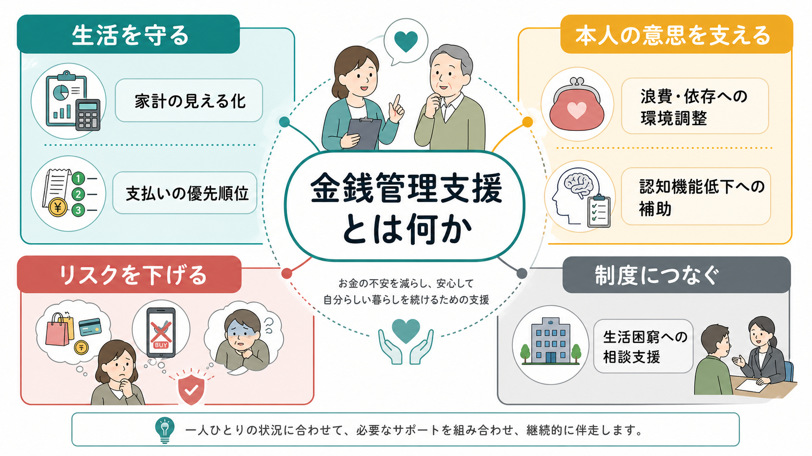
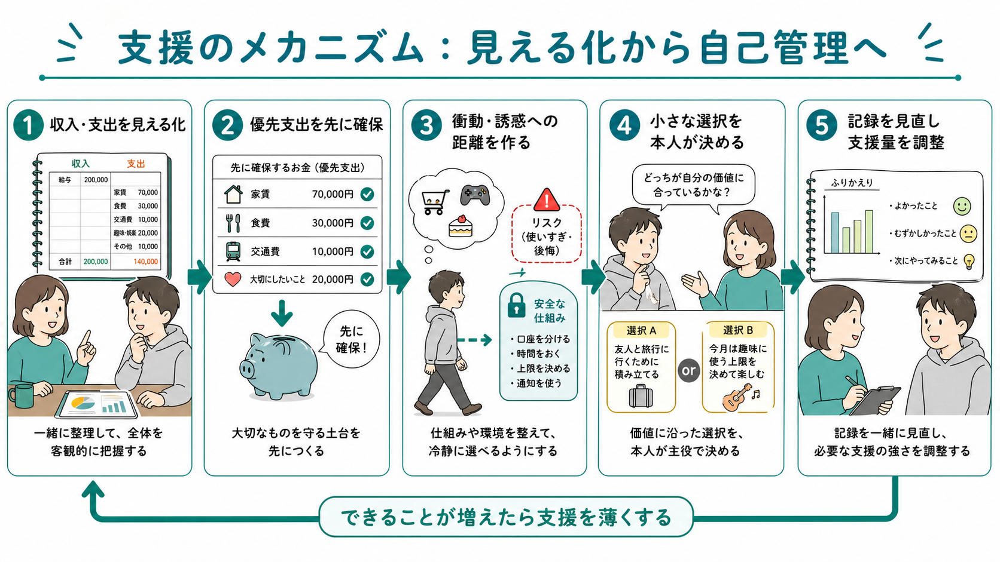
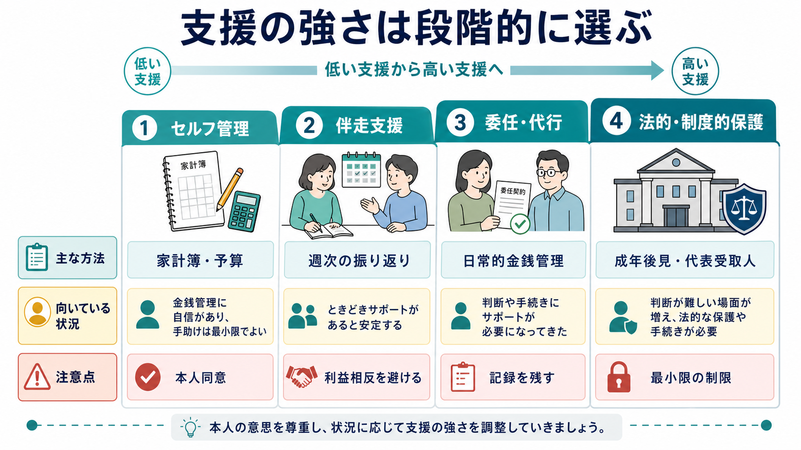

# 金銭管理支援とは何か

## 要点

- 金銭管理支援とは、本人の収入・支出・債務・支払い行動を「見える化」し、生活に必要な支出を守りながら、本人が自分の価値に沿ってお金を使えるようにする支援である。
- 支援の対象は、単なる浪費だけではない。[[認知リハビリテーションとは何か|認知機能低下]]、依存症、ギャンブル関連害、精神疾患、生活困窮、家族内の経済的搾取、制度利用の困難が重なった場面で必要になる。
- 支援の原則は、「本人から取り上げる」ではなく、「本人が扱える形に分ける」「誘惑や混乱との距離を作る」「記録を残す」「支援量を定期的に見直す」である。
- 日本では、生活困窮者自立支援制度の家計改善支援事業、日常生活自立支援事業、成年後見制度、障害福祉・介護・訪問支援、医療・司法・債務相談が接点になる。
- 医療・福祉の支援者は、金銭管理を道徳化せず、生活機能、意思決定能力、リスク、本人の希望、支援関係の権力差を同時に見る必要がある。

## この記事で答える問い

1. 金銭管理支援は、家計簿指導や節約指導と何が違うのか。
2. 浪費、依存、認知機能低下、生活困窮では、支援の焦点はどう変わるのか。
3. 本人の自由を守りながら、生活破綻や搾取を防ぐには何を確認すればよいのか。
4. 医療・福祉・制度支援は、どの段階で接続するのか。

## まず結論

金銭管理支援は、「お金の使い方を正す支援」ではなく、「生活を続けるための意思決定環境を整える支援」である。本人が収入、固定費、変動費、借入、支払い期限、依存行動への支出を把握できないとき、あるいは把握していても衝動、認知機能低下、孤立、貧困、搾取によって実行できないとき、金銭管理は本人の努力だけでは解けない問題になる。

そのため支援は、家計簿をつけさせることから始まるとは限らない。まず必要なのは、食費、住居費、光熱費、通信、医療、服薬、移動、借金返済、子どもや家族への支出などを並べ、何を守らないと生活が崩れるかを本人と一緒に決めることである。生活困窮者自立支援制度の家計改善支援事業も、家計状況の見える化、支援計画、関係機関へのつなぎ、貸付のあっせんなどを通じて、相談者が自ら家計を管理できるようにする支援として位置づけられている[1]。

同時に、本人の同意と権利擁護が中心に置かれなければならない。判断能力が不十分な人に対する日常生活自立支援事業では、契約に基づく福祉サービス利用援助に加え、日常生活費の管理、預金手続き、定期的訪問による生活変化の把握が含まれる[2]。これは「本人の代わりに全部決める」制度ではなく、本人が地域で自立した生活を送れるように、必要な部分だけを支える仕組みである。

## 背景

お金の問題は、表面上は「支払いが滞った」「使いすぎた」「借金が増えた」という出来事として現れる。しかし臨床・福祉の現場では、その背後に複数の層がある。

第一に、認知機能の層がある。請求書を読む、期限を覚える、残高を予測する、優先順位をつける、詐欺を見抜く、将来の支出を想像する、といった行為には、記憶、注意、実行機能、数的理解、社会的判断が関わる。認知症における financial capacity のレビューでは、金銭管理能力は財産や収入を扱う認知的能力の集合として捉えられ、評価方法や支援方法の整備が重要な課題とされている[5]。

第二に、依存と衝動性の層がある。ギャンブル、物質使用、買い物、ゲーム課金などでは、支出は単なる好みではなく、渇望、報酬予測、ストレス対処、社会的孤立と結びつく。NICEのギャンブル関連害ガイドラインは、本人にギャンブルの金銭的影響、借入、即時的な食料・住居・債務のニーズを確認し、必要に応じて支払いブロック、金銭アクセス制限、債務支援への接続を検討することを推奨している[6]。

第三に、貧困と制度アクセスの層がある。収入が少なすぎる場合、家計簿を改善しても生活は安定しない。住居、就労、医療、福祉、債務整理、給付、貸付、家族支援を組み合わせる必要がある。ここでは[[ケースマネジメントとは何か|ケースマネジメント]]や[[訪問看護は精神科で何を支えるのか|訪問支援]]が重要になる。

第四に、権利擁護の層がある。本人が金銭を扱えないと判断される場面では、支援者・家族・制度が本人の生活を守る一方で、本人の選択を過剰に制限する危険もある。CFPBは、他者の金銭を管理する fiduciary の責任として、本人の最善の利益、慎重な管理、本人資産と支援者資産の分離、記録保持を挙げている[3]。米国の代表受取人制度でも、受給者の利益のために給付を管理し、現在の生活ニーズに使い、記録と報告を行う責務が強調されている[4]。

## 基本概念

### 金銭管理支援は「節約指導」ではない

節約指導は、支出を減らす助言に寄りやすい。しかし金銭管理支援では、まず「何を守る必要があるか」を決める。家賃、食費、光熱費、医療費、通信費、交通費、子どもの費用、返済、本人にとって意味のある小遣いは、同じ「支出」でも生活機能への影響が違う。

支援者が最初から「無駄遣いをやめましょう」と言うと、本人は責められたと感じ、相談が途切れやすい。むしろ、「今月、何が払えないと一番困るか」「支払いの順番をどうするか」「本人が自由に使える枠をどう残すか」を一緒に決める方が、生活再建につながりやすい。

### 支援の単位は「お金」ではなく「行動」

金銭管理支援で扱うのは、金額そのものだけではない。支援の単位は、次のような行動である。

| 行動 | 支援の例 |
|---|---|
| 収入を把握する | 給与、年金、手当、生活保護、臨時収入を一覧にする |
| 支払いを守る | 家賃、光熱費、医療費、通信費を先取りする |
| 使える枠を決める | 1週間単位の生活費、趣味費、小遣いを分ける |
| 衝動との距離を作る | ギャンブル決済のブロック、カード保管、買い物導線の変更 |
| 認知負荷を下げる | 自動引落、通知、封筒分け、カレンダー、同行支援 |
| 搾取を防ぐ | 通帳・カードの所在確認、支援者の利益相反確認、記録 |

### 自立とは「全部ひとりでやること」ではない

金銭管理における自立は、すべての手続きを本人だけで完結することではない。本人が理解できる範囲で選択し、必要な支援を使い、生活上の重大な破綻を避けられることが中心である。これは[[リカバリー志向支援とは何か|リカバリー志向支援]]や[[精神科リハビリテーションとは何か|精神科リハビリテーション]]の考え方とも接続する。

## 仕組み

金銭管理支援は、次の5つの仕組みで動く。

### 1. 見える化

最初の作業は、本人を問い詰めることではなく、情報を扱いやすい形にすることである。収入、固定費、変動費、借入、滞納、口座、カード、サブスクリプション、家族への送金、依存行動への支出を、責めずに並べる。

見える化では、正確性よりも使える形が大切である。領収書がすべてなくても、銀行アプリが見られなくても、本人の記憶、請求書、督促状、支援者の観察から仮の表を作る。そこから「今週必要な支払い」「今月必ず守る支払い」「後で相談する支払い」に分ける。

### 2. 先取り

生活を守る支出は、衝動や混乱が起きる前に確保する。家賃、食費、光熱費、医療費、通信費、通院交通費などを先に分け、残った範囲で自由支出を決める。本人の自由に使えるお金をゼロにすると、支援は罰のように体験され、隠れた支出や関係断絶が起きやすい。

### 3. 距離を作る

浪費や依存が強い場合、意思の力だけで支出を止める支援は弱い。ギャンブルサイトのブロック、銀行のギャンブル決済ブロック、カードの保管、買い物アプリの削除、給料日の同行、少額分割での生活費渡しなど、衝動が起きてから支出に至るまでの距離を作る。NICEは、ギャンブル関連害への初期支援として、オンラインギャンブルを防ぐツール、マーケティング遮断、自己排除、銀行口座を通じたギャンブル支払いブロック、家族が財務を管理する合意などを検討対象に含めている[6]。

### 4. 共同意思決定

支援者がすべて決めると、短期的には支払いが安定しても、本人の学習機会や主体性が失われる。支援計画では、「本人が決める部分」「一緒に決める部分」「一時的に委任する部分」を分ける。たとえば、家賃と光熱費は支援者と確認し、食費の週予算は本人が選び、借金整理は専門相談につなぐ、という分担が考えられる。

### 5. 支援量の調整

支援は固定しない。できることが増えれば薄くし、再発・悪化・認知機能低下・住居喪失リスクが高まれば厚くする。日常生活自立支援事業でも、支援計画は本人の必要な援助内容や判断能力の変化を踏まえて定期的に見直される[2]。支援を薄くすることは放置ではなく、本人が扱える範囲を広げるリハビリテーションである。

## 図解

金銭管理支援は、支援の強さを段階的に選ぶと理解しやすい。

| 段階 | 主な方法 | 向いている状況 | 注意点 |
|---|---|---|---|
| セルフ管理 | 家計簿、予算、通知、自動引落 | 本人が概ね理解し、実行の補助があれば足りる | 失敗を本人の怠慢と決めつけない |
| 伴走支援 | 週次面談、支払い確認、買い物・銀行同行 | 実行機能低下、依存衝動、生活困窮がある | 支援者の価値観を押しつけない |
| 委任・代行 | 日常的金銭管理、カード保管、支払い代行 | 滞納、搾取、依存行動、認知機能低下で生活が崩れる | 本人同意、記録、範囲の明確化が必要 |
| 法的・制度的保護 | 成年後見、保佐、補助、代表受取人に相当する制度 | 重大な判断能力低下や財産被害のリスクが高い | 最小限の制限、利益相反回避、定期見直しが必要 |

## 臨床・研究との接続

### 認知機能低下

認知症や軽度認知障害では、金銭管理の失敗が早期に現れることがある。請求書を放置する、同じものを何度も買う、暗証番号を忘れる、詐欺的勧誘を断れない、投資や契約のリスクを評価できない、といった形である。ここでは[[認知矯正療法とは何か|認知機能への訓練]]だけでなく、環境調整、自動化、家族・支援者との役割分担、権利擁護が必要になる。

支援では、本人の能力を「ある・ない」で二分しない。少額の買い物は可能だが口座管理は難しい、日常支出はできるが複雑な契約は難しい、通常時はできるが疲労時に崩れる、というように領域別に見る。

### 依存症・ギャンブル関連害

物質使用やギャンブルでは、お金はトリガーにも保護因子にもなる。給料日、年金支給日、臨時収入、ストレス後の夜間、孤立した時間帯は、支出リスクが高まる。金銭管理支援は、依存症治療の代替ではないが、治療に参加し続けるための土台になる。

Advisor-Teller Money Manager therapy の臨床試験では、精神疾患と物質使用のある人に対して、第三者口座への預け入れ、週単位の支出計画、月予算の交渉などを含む金銭管理ベースの介入が行われ、コカイン使用に関する一部の指標で改善が示された[7]。ただし、研究者自身も、患者の自律性とスタッフ安全への配慮が必要だと述べている[7]。つまり、金銭管理は有効になりうるが、強制や懲罰として使うと支援関係を壊す。

### 精神疾患と地域生活

統合失調症、双極症、うつ病、発達特性、知的障害、依存症が重なると、金銭管理は単独の生活技能ではなく、住居、服薬、通院、就労、家族関係、孤立、危機対応と結びつく。行動保健領域の金融介入に関する系統的レビューでは、代表受取人制度などの金銭管理支援が、物質使用の低減や金銭管理の改善に関する比較的強いエビデンスを持つ介入として整理されている[8]。

この領域では、[[生活技能訓練SSTとは何か|生活技能訓練SST]]、[[ACTとは何か|ACT]]、[[訪問看護は精神科で何を支えるのか|精神科訪問看護]]、ケースマネジメントと連動しやすい。たとえば、支払い確認をSSTの練習課題にし、給料日前後の訪問を増やし、再発サインと支出変化を同時に見る、という使い方がある。

### 生活困窮

生活困窮では、本人の支出行動だけを変えても問題は解決しない。収入不足、家賃負担、失業、疾病、債務、養育費、教育費、孤立、制度利用の難しさが重なるからである。家計改善支援事業は、家計の見える化と支援計画に加えて、関係機関へのつなぎや貸付のあっせんを含む[1]。したがって、医療者ができることは「節約してください」と言うことではなく、相談窓口、社会福祉協議会、自治体、法律相談、債務整理、住居支援につなぐことである。

## よくある誤解

### 誤解1：本人に任せるか、全部取り上げるかの二択である

実際には、支援は段階的である。本人が扱える金額、場面、時間帯を見極め、必要なところだけ補助する。財布を持つ、カードを持つ、暗証番号を知る、口座を管理する、契約を結ぶ、借入する、資産運用する、という行為は同じ「金銭管理」でも難易度が違う。

### 誤解2：浪費は意志の弱さである

浪費には、躁状態、うつ状態の買い物、ADHD特性、認知機能低下、依存症、孤独、トラウマ、貧困による短期志向、経済的搾取が関わることがある。道徳化すると、本人は支援から遠ざかる。必要なのは、責めることではなく、支出が起こる条件を具体的に見ることである。

### 誤解3：家族に任せれば安全である

家族は重要な支援資源だが、常に安全とは限らない。家族自身の負担、怒り、経済的困窮、利益相反、過干渉、経済的虐待のリスクがある。家族に支援を頼む場合も、本人同意、役割、記録、相談先、緊急時対応を明確にする。

### 誤解4：制度につなげれば終わりである

制度利用は入口であり、生活が安定したかどうかは別問題である。支援後も、滞納が減ったか、食事や通院が守られているか、本人の満足度が下がっていないか、支援者への依存や支配が強まっていないかを確認する。

## 関連ノート

- [[ケースマネジメントとは何か]]
- [[訪問看護は精神科で何を支えるのか]]
- [[精神科リハビリテーションとは何か]]
- [[生活技能訓練SSTとは何か]]
- [[認知リハビリテーションとは何か]]
- [[認知矯正療法とは何か]]
- [[ACTとは何か]]
- [[リカバリー志向支援とは何か]]

### MOC更新候補

- `content/00_MOC/MOC｜リハビリ・生活支援.md`
- `content/00_MOC/MOC｜臨床実践・治療.md`
- `content/00_MOC/MOC｜司法・制度・地域精神医療.md`
- `content/00_MOC/MOC｜疾患・症候群.md`

### 今後の作成候補

- 「家計改善支援事業とは何か」
- 「日常生活自立支援事業とは何か」
- 「成年後見制度と精神科臨床」
- 「ギャンブル関連害と金銭アクセス制限」
- 「認知症における financial capacity」

## 理解チェック

1. 金銭管理支援が「節約指導」だけでは不十分なのはなぜか。
2. 本人が自由に使えるお金をゼロにすると、どのようなリスクがあるか。
3. 認知機能低下がある人の金銭管理では、どの行為を領域別に評価すべきか。
4. 依存症やギャンブル関連害では、なぜ「お金への距離」を作る支援が必要になるのか。
5. 家族に金銭管理を頼む場合、利益相反や記録について何を確認すべきか。

## 参考文献

[1] 厚生労働省. 生活困窮者自立支援制度. https://www.mhlw.go.jp/stf/seisakunitsuite/bunya/0000059425.html

[2] 厚生労働省. 日常生活自立支援事業. https://www.mhlw.go.jp/stf/seisakunitsuite/bunya/hukushi_kaigo/seikatsuhogo/chiiki-fukusi-yougo/index.html

[3] Consumer Financial Protection Bureau. Managing someone else's money. https://www.consumerfinance.gov/consumer-tools/managing-someone-elses-money/

[4] Social Security Administration. Representative Payee Program: When People Need Help Managing Their Money. https://www.ssa.gov/payee/

[5] Sudo, F. K., & Laks, J. (2017). Financial capacity in dementia: a systematic review. *Aging & Mental Health*, 21(7), 677-683. https://doi.org/10.1080/13607863.2016.1226761

[6] National Institute for Health and Care Excellence. (2025). *Gambling-related harms: identification, assessment and management* (NG248). https://www.nice.org.uk/guidance/ng248

[7] Rosen, M. I., Rounsaville, B. J., Ablondi, K., Black, A. C., & Rosenheck, R. A. (2010). Advisor-Teller Money Manager (ATM) therapy for substance use disorders. *Psychiatric Services*, 61(7), 707-713. https://doi.org/10.1176/ps.2010.61.7.707

[8] Elbogen, E. B., et al. (2024). Systematic Review of Financial Interventions for Adults Experiencing Behavioral Health Conditions. *Psychiatric Services*. https://pubmed.ncbi.nlm.nih.gov/38321921/

## 未解決問題

- 日本の精神科地域支援で、金銭管理支援の効果をどの指標で測るべきかは十分に標準化されていない。
- 依存症への金銭アクセス制限は、本人の同意、自律性、家族負担、スタッフ安全をどう両立するかが課題である。
- 認知機能低下に対する financial capacity 評価を、日常診療・訪問支援・福祉制度の中でどのように簡便に運用するかは今後の検討が必要である。
