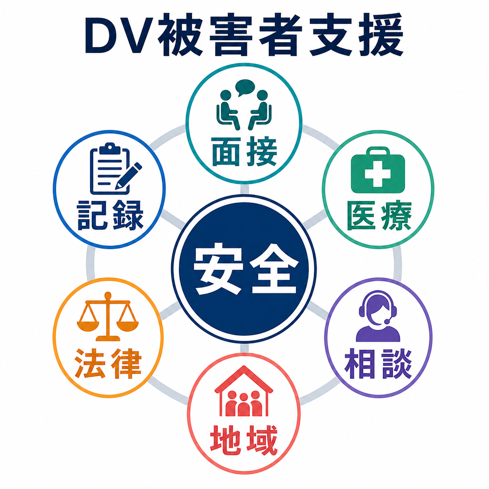
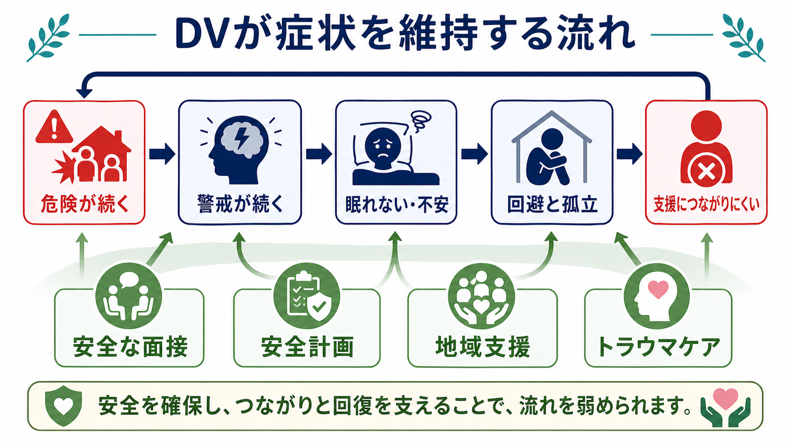
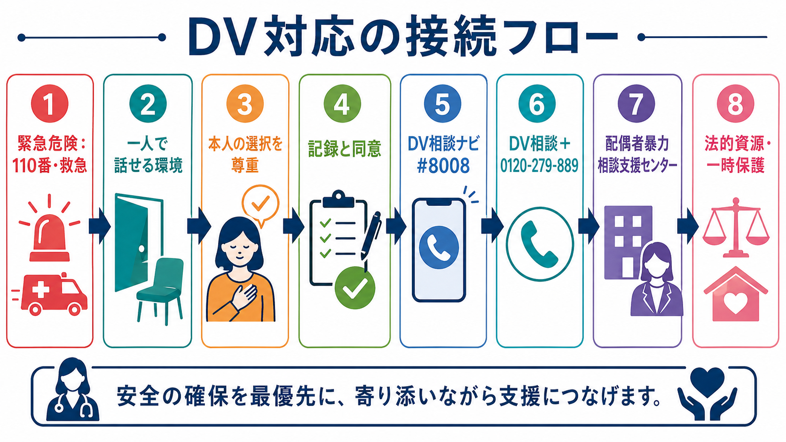

# DV被害への精神科対応とは何か

## 要点

- DV、または親密なパートナーからの暴力 IPV は、身体的暴力だけでなく、心理的暴力、性的暴力、経済的支配、監視、孤立化、脅迫を含む。精神科では「症状」だけでなく、現在も危険が続いているかを見る必要がある。
- 初期対応の中心は、被害を証明させることではなく、安全な面接、傾聴、本人の選択の尊重、リスク評価、記録、専門支援への接続である。WHO は一次対応として LIVES、すなわち Listen, Inquire about needs and concerns, Validate, Enhance safety, Support を推奨している [1][2]。
- DV被害は、PTSD、複雑性PTSD、うつ、不安、睡眠障害、物質使用、自傷・自殺リスクと結びつきうる。精神症状の治療は必要だが、危険が続く環境では安全確保と地域支援なしに治療だけを進めても不十分になりやすい [5][6]。
- 法的資源や地域支援につなぐときは、本人の同意、秘匿性、スマートフォンや通知履歴の安全、加害者に情報が伝わるリスクを確認する。日本では DV相談ナビ `#8008`、DV相談＋ `0120-279-889`、配偶者暴力相談支援センターなどが入口になる [8]。
- この記事は教育・研究目的の整理であり、個別の診断、法的判断、避難指示の代替ではない。差し迫った危険がある場合は、救急、警察、地域の緊急支援につなぐ。

## この記事で答える問い

1. DV被害を受けている人に精神科は何を最初に確認するのか。
2. トラウマケア、薬物療法、心理療法は安全確保とどう接続するのか。
3. 診療記録、守秘義務、情報共有はどのように扱うべきか。
4. 法的資源や地域支援へつなぐとき、どのような順序が安全なのか。

## まず結論

精神科対応の第一目標は「本人を説得して別れさせること」でも「加害者を裁くこと」でもない。安全に話せる場を作り、本人の言葉を信じて受け止め、今夜から数日以内の危険を見積もり、必要な支援へつなぐことである。DV被害者は、恐怖、恥、経済的制約、子どもの安全、在留資格、障害、家族や職場との関係、加害者の監視によって、すぐに離れる選択を取れないことがある。そのため、臨床家が「なぜ逃げないのか」と考えるほど、支援は危険になる。

WHO の臨床ハンドブックは、暴力を受けた人のニーズを、心理的・身体的な即時ニーズ、継続する安全ニーズ、継続的支援とメンタルヘルスのニーズに分けている [2]。精神科ではこれを、[[危機介入とは何か|危機介入]]、[[安全計画とは何か|安全計画]]、[[自殺リスクへの危機対応とは何か|自殺リスク対応]]、トラウマ治療、地域連携の組み合わせとして実装する。

## 背景

DV は公衆衛生、人権、司法、福祉、精神医療が交差する問題である。WHO のガイドラインは、医療者が被害者にとって最初に信頼して話せる専門職になることがあると位置づけ、医療機関での初期対応を重視している [1]。NICE も、メンタルヘルス、物質使用、妊娠・産後、救急、性暴力支援、子ども支援などの経路を統合し、本人と加害者を分けて支援する仕組みを求めている [3]。

精神科にDVが現れる形は一様ではない。希死念慮、不眠、パニック、身体化、過量服薬、アルコール使用、摂食の乱れ、子どもの問題、夫婦関係の相談、診断書希望、休職相談として来ることがある。すでに [[DVと精神科医療はどう関係するのか]] で扱うように、精神科医療は症状評価と同時に「現在の危険」「支援へのアクセス」「情報漏洩リスク」を見る必要がある。

## 基本概念

### DV / IPV

DV は家庭内暴力と訳されることが多いが、臨床・公衆衛生では親密なパートナー間暴力 IPV として、現在または過去の配偶者、交際相手、同居相手などによる暴力・支配を含めて扱う。身体的暴力がなくても、脅迫、監視、連絡先の制限、金銭管理、性的強制、子どもやペットを使った脅しは安全と精神健康に大きく影響する。

### トラウマインフォームドな対応

トラウマインフォームドな対応とは、被害体験を詳しく語らせる技法ではない。SAMHSA は、トラウマの影響を理解し、徴候を認識し、組織の実践へ統合し、再トラウマ化を避けるアプローチとして整理している [4]。DV対応では、面接の席順、同席者、通訳者、電話通知、紙資料の持ち帰り、診療明細、予約連絡の方法まで安全性に関わる。

### LIVES

LIVES は、医療者が専門的なDV支援機関でなくても行える一次対応の枠組みである [1][2]。

| 要素 | 精神科での言い換え | 実践例 |
|---|---|---|
| Listen | 判断せずに聴く | 「話してくれてありがとうございます。あなたのせいではありません」 |
| Inquire | ニーズを尋ねる | 「今いちばん心配なことは何ですか」 |
| Validate | 妥当化する | 「怖く感じるのは自然な反応です」 |
| Enhance safety | 安全を高める | 今夜の帰宅先、連絡手段、緊急時の逃げ先を確認する |
| Support | 支援につなぐ | DV相談、配偶者暴力相談支援センター、福祉、法律相談へ橋渡しする |

## 仕組み

DVが精神症状を悪化させる仕組みは、「暴力を受けたから症状が出る」という単線ではない。危険が続くと、身体は警戒を下げにくくなる。眠れない、不安が強い、相手の機嫌を読み続ける、外部に相談しない、受診内容を隠す、といった行動は、危険な環境では適応的な防衛として働くことがある。しかし、この防衛が長期化すると、うつ、PTSD症状、孤立、治療中断、自殺リスクが強まりうる。

縦断研究のシステマティックレビューでは、IPV経験はその後の抑うつ症状と関連し、逆に抑うつ症状をもつ人がその後IPVを経験するリスクも高まる双方向性が示されている [6]。Lancet Psychiatry Commission は、IPVとメンタルヘルスの関係が二次精神医療で十分扱われてこなかったことを指摘し、精神医療サービス、研究、政策を横断した対応強化を提案している [5]。

臨床上の要点は、精神症状を「本人の内側だけの問題」に閉じないことである。薬物療法や心理療法は重要だが、監視、脅迫、住居不安、経済的支配、子どもの安全、法的手続きが未整理のままでは、症状改善の前提が崩れやすい。

## 図解

DV対応では、精神科だけで完結しない接続フローを最初から想定する。差し迫った危険があれば、本人の意思確認と安全配慮を行いながら、警察、救急、地域の緊急支援へつなぐ。緊急性が低く見えても、加害者の監視、別離時の危険、武器へのアクセス、子どもや高齢者の安全、過量服薬や希死念慮を確認する。

日本では、相談先がわからないときの入口として DV相談ナビ `#8008` があり、近くの配偶者暴力相談支援センターにつながる。DV相談＋は `0120-279-889` で24時間電話相談を受け、チャット等も提供している [8]。ただし、相談窓口の情報を紙で渡す、スマートフォンに登録する、検索履歴を残すこと自体が危険になる場合がある。情報提供は「本人が安全に保持できる形」を一緒に決める。

## 臨床・研究との接続

### 面接環境

DVが疑われる場合、同席者がいる場で詳しく尋ねない。加害者が家族、通訳者、支援者を装って同席することもある。NICE は、DVの確認は安全な環境で一対一に、親切で感受性のある方法で行うことを求めている [3]。オンライン診療では、画面外に誰がいるか、イヤホンを使えるか、急に話題を変える合図を決められるかを確認する。

### リスク評価

確認するのは、暴力の有無だけではない。近い時期のエスカレーション、首絞め、武器、殺害・自殺の脅し、ストーキング、別離や離婚の動き、妊娠・産後、子どもや高齢者・障害者の安全、物質使用、加害者の治療歴、本人の希死念慮や自傷、帰宅後の安全を尋ねる。自殺リスクがある場合は [[自殺リスクへの危機対応とは何か]] と [[安全計画とは何か]] の枠組みを併用する。

### 記録

診療記録は支援にも危険にもなりうる。日時、本人の発言、観察所見、身体所見、同席者、説明した選択肢、本人の同意、紹介先、緊急対応の判断を、価値判断を避けて記録する。加害者がカルテ開示や診療明細を通じて情報に触れる可能性がある場合、施設の手続き、守秘義務、情報共有範囲を事前に確認する。

### 治療

うつ、不安、睡眠障害、PTSD、物質使用、身体症状には、それぞれのエビデンスに基づく治療を行う。NICE は、DV被害者にメンタルヘルス状態がある場合、その状態への根拠に基づく治療を提供しつつ、継続的リスク評価、協働的安全計画、専門DV支援への紹介を治療プログラムに含めることを推奨している [3]。心理療法については、CochraneレビューがIPV経験女性への心理療法研究を整理しているが、介入の内容、期間、対象、場所は多様であり、治療だけで再曝露や安全問題が解決するわけではない [7]。

### 地域連携

精神科医、看護師、心理職、[[精神保健福祉士とは何をする職種なのか|精神保健福祉士]]、[[ケースマネジメントとは何か|ケースマネジメント]]、[[精神科訪問看護とは何か|訪問看護]]、配偶者暴力相談支援センター、自治体、法律相談、警察、学校、児童相談、障害福祉、生活困窮支援が関わることがある。共有する情報は、本人の安全に必要な範囲に絞る。多職種連携は、本人の意思決定を奪うためではなく、孤立を減らし、選択肢を増やすために行う。

## よくある誤解

### 誤解1: 「本当に危険ならすぐ逃げるはず」

逃げること自体が最も危険な時期になる場合がある。住居、子ども、仕事、金銭、在留資格、障害、親族関係、ペット、通院、スマートフォン監視が絡むと、単純な避難指示は現実的でないことがある。精神科では、本人の判断を急かすより、安全な選択肢を増やす。

### 誤解2: 「精神症状がある人のDV訴えは信頼できない」

PTSD、うつ、不安、解離、物質使用があることは、被害の訴えを否定する理由にならない。症状は語りの一貫性や記憶の断片化に影響しうるが、それは「事実でない」ことを意味しない。臨床家は、事実認定の裁判官ではなく、安全と支援ニーズを評価する専門職である。

### 誤解3: 「夫婦療法・家族面接で解決すべき」

暴力、脅迫、強制的支配がある場合、通常の合同面接や [[夫婦療法とは何か|夫婦療法]] は危険を高めることがある。合同面接は、被害者が本音を言えず、加害者が治療情報を支配に使う場になりうる。まず個別の安全評価と支援計画を優先する。

### 誤解4: 「医療者が通報すれば解決する」

通報や情報共有が必要な場面はあるが、常に一律の解決策ではない。本人の安全、子どもや高齢者・障害者への危険、法的義務、同意、情報漏洩リスクを区別する必要がある。迷う場合は院内の医療安全、虐待対応、法務、地域連携部門に早く相談する。

## 関連ノート

- [[DVと精神科医療はどう関係するのか]]
- [[安全計画とは何か]]
- [[自殺リスクへの危機対応とは何か]]
- [[危機介入とは何か]]
- [[ケースマネジメントとは何か]]
- [[精神科訪問看護とは何か]]
- [[精神保健福祉士とは何をする職種なのか]]
- [[夫婦療法とは何か]]
- [[トラウマは発達にどう影響するのか]]
- [[PTSDとは何か]]

MOC更新候補: `content/00_MOC/MOC｜司法・制度・地域精神医療.md`、医療安全・危機対応系MOC、トラウマ関連MOCに追加する候補。並列ジョブとの衝突を避けるため、このタスクではMOC本体を更新しない。

今後の作成候補:

- DV相談支援と精神科医療
- 配偶者暴力相談支援センターとは何か
- 別離時リスクとは何か
- 強制的支配とは何か
- 診療記録と司法手続きはどう接続するのか

## 理解チェック

1. DV被害が疑われる人を、同席者の前で詳しく質問してはいけない理由は何か。
2. LIVES の5要素を、精神科外来での具体的な声かけに置き換えるとどうなるか。
3. DV被害者の安全計画と、自殺リスクへの安全計画はどこが重なり、どこが異なるか。
4. 記録が支援にも危険にもなりうるのはなぜか。
5. 夫婦療法や合同面接を急がない方がよい場面はどのような場面か。

## 未解決問題

- DV/IPVの標準的なスクリーニングを、診療明細、オンライン診療、同席者、通訳、電子カルテ閲覧リスクを含めてどう安全に実装するか。
- 精神科治療、法的支援、住居支援、経済支援を、本人の意思決定を奪わずにどう統合するか。
- 男性、性的マイノリティ、高齢者、障害者、外国籍、在留資格が不安定な人への支援経路を、既存制度の中でどう見えやすくするか。
- 加害者にも精神疾患や物質使用がある場合、被害者の安全を最優先にしながらどのように治療責任を整理するか。

## 参考文献

[1] World Health Organization. (2013). *Responding to intimate partner violence and sexual violence against women: WHO clinical and policy guidelines.* https://iris.who.int/handle/10665/85240

[2] World Health Organization. (2014). *Health care for women subjected to intimate partner violence or sexual violence: a clinical handbook.* https://www.who.int/publications/i/item/WHO-RHR-14.26

[3] National Institute for Health and Care Excellence. (2014, last reviewed 2024). *Domestic violence and abuse: multi-agency working (Public health guideline PH50).* https://www.nice.org.uk/guidance/ph50

[4] Substance Abuse and Mental Health Services Administration. (2014). *SAMHSA's Concept of Trauma and Guidance for a Trauma-Informed Approach.* https://library.samhsa.gov/product/samhsas-concept-trauma-and-guidance-trauma-informed-approach/sma14-4884

[5] Oram, S., Fisher, H. L., Minnis, H., Seedat, S., Walby, S., Hegarty, K., Rouf, K., Angénieux, C., Callard, F., Chandra, P. S., Fazel, S., Garcia-Moreno, C., Henderson, M., Howarth, E., MacMillan, H. L., Murray, L. K., Othman, S., Robotham, D., Rondon, M. B., Sweeney, A., Taggart, D., & Howard, L. M. (2022). The Lancet Psychiatry Commission on intimate partner violence and mental health: advancing mental health services, research, and policy. *The Lancet Psychiatry, 9*(6), 487-524. https://doi.org/10.1016/S2215-0366(22)00008-6

[6] Devries, K. M., Mak, J. Y. T., Bacchus, L. J., Child, J. C., Falder, G., Petzold, M., Astbury, J., & Watts, C. H. (2013). Intimate partner violence and incident depressive symptoms and suicide attempts: A systematic review of longitudinal studies. *PLOS Medicine, 10*(5), e1001439. https://doi.org/10.1371/journal.pmed.1001439

[7] Hameed, M., O'Doherty, L., Gilchrist, G., Tirado-Muñoz, J., Taft, A., Chondros, P., Feder, G., Tan, M., Hegarty, K., & Tarzia, L. (2020). Psychological therapies for women who experience intimate partner violence. *Cochrane Database of Systematic Reviews*, CD013017. https://www.cochrane.org/evidence/CD013017_psychological-therapies-women-who-experience-intimate-partner-violence

[8] 内閣府男女共同参画局. (n.d.). *DV相談について.* https://www.gender.go.jp/policy/no_violence/dv_navi/
