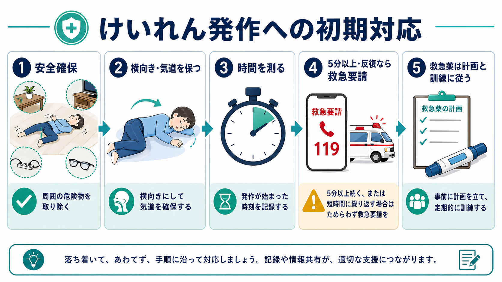
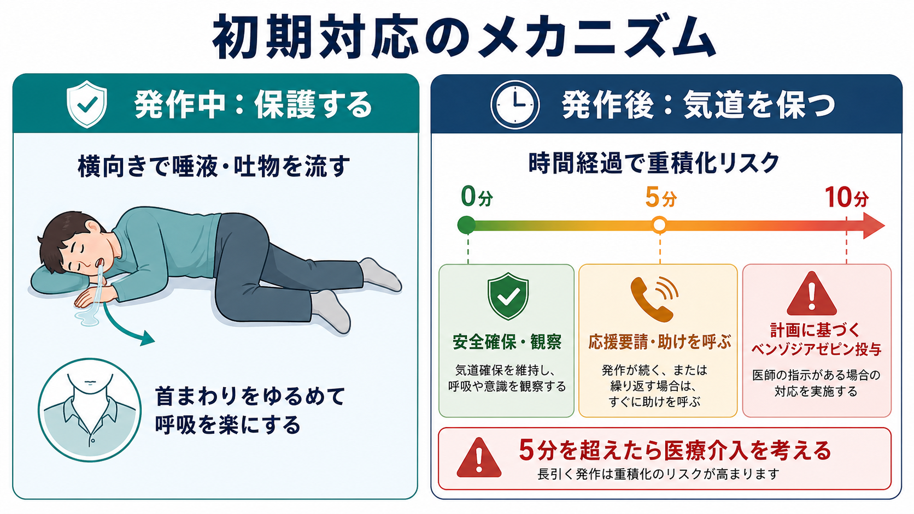
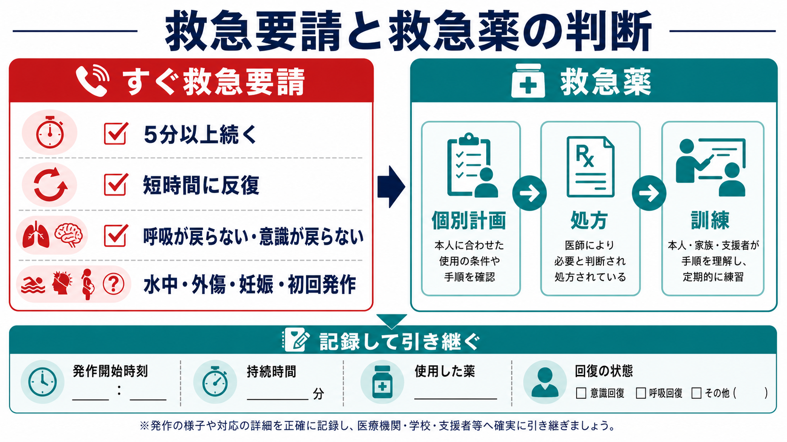

# けいれん発作への初期対応とは何か

## 要点

- けいれん発作への初期対応の第一目標は、発作を力で止めることではなく、転倒・外傷・窒息・誤嚥などの二次被害を減らし、発作時間と回復過程を正確に把握することである[1][2]。
- 全身性のけいれんでは、周囲の危険物をどけ、頭部を保護し、可能なら横向きにして気道を保つ。口の中に物を入れたり、四肢を押さえつけたりしない[1][2]。
- 発作開始時刻を確認する。5分以上続く、短時間に反復する、呼吸や意識が戻らない、外傷・水中・妊娠・初回発作などがある場合は救急要請を優先する[1][2][3]。
- 救急薬は「その人に処方され、個別の発作時対応計画があり、使う人が訓練されている」場合に、その計画へ従って使用する。薬剤名や用量を現場で推測して使うものではない[3][7]。
- 本記事は教育・研究目的の整理であり、個別の診断、救急薬の用量指示、受診要否の最終判断を代替しない。

## この記事で答える問い

けいれん発作を目の前で見たとき、最初の数分に何を優先すべきか。安全確保、気道管理、発作時間の確認、救急要請、救急薬の使用は、どの順序で考えればよいのか。

## まず結論

初期対応は「安全確保、横向き・気道確保、時間測定、救急要請判断、記録と引き継ぎ」の流れで考える。けいれんそのものを押さえ込むより、周囲の危険を減らし、呼吸と回復を見守り、5分を超えるまたは反復する発作を早く医療につなぐことが重要である[1][2][3]。

救急薬は、発作が長引く、または群発する人に対して事前に準備される介入である。NICEは、5分以上続く全般けいれん性てんかん重積状態では救急処置を行い、個別の緊急管理計画が直ちに利用できる場合はその計画に従って薬剤を投与する、としている[3]。つまり、薬を「持っているか」だけでは不十分で、いつ、誰が、どの条件で、投与後に何を観察し、いつ救急要請するかまで決めておく必要がある。

## 背景

けいれん発作は、脳の神経活動が一時的に過剰・同期的になることで、意識変容、転倒、強直、間代、呼吸の変化、発作後のもうろう状態などとして現れる。発作の原因は、てんかん、急性脳疾患、低血糖、電解質異常、感染、頭部外傷、薬物・アルコール離脱など多様である。精神科・一般医療の現場では、[[身体疾患の見逃しを防ぐ精神科初期対応とは何か|身体疾患の見逃し]]と[[医療安全とは何か|医療安全]]の両方の視点が必要になる。

多くの発作は数分以内に自然に止まるが、5分を超えて続く全般けいれん発作は自然停止しにくくなり、てんかん重積状態として扱う実務上の閾値になる[4][5]。ILAEの定義では、全般けいれん性てんかん重積では5分が治療開始を考える時点、30分が長期的影響のリスクが高まる時点として整理されている[5]。そのため、発作時間の測定は単なる記録ではなく、救急対応の分岐点である。

## 基本概念

### 安全確保

最初に行うのは、本人の体を無理に止めることではなく、周囲の環境を整えることである。硬い物、鋭利な物、熱源、コード、家具の角を遠ざけ、転落しそうな場所では安全な位置へ誘導する。眼鏡を外し、頭の下に柔らかいものを置き、衣服やネクタイなど首まわりをゆるめる[1][2]。この発想は[[転倒転落リスク管理とは何か|転倒転落リスク管理]]と重なる。

### 気道管理

可能であれば、本人を横向きにして口を下に向け、唾液や吐物が外へ流れやすい姿勢にする[1]。発作中は呼吸が不規則に見えたり、顔色が変わったりすることがあるが、口に指・スプーン・タオルなどを入れると、歯や口腔内の損傷、介助者の受傷、窒息の危険がある。気道管理は、口をこじ開けることではなく、体位、首まわりの圧迫解除、発作後の呼吸確認である。

### 時間測定

発作が始まった時刻を確認し、止まった時刻、意識が戻るまでの経過、呼吸状態を記録する。体感では数分が長く感じられるため、時計やスマートフォンで測る方がよい。CDCとEpilepsy Foundationはいずれも、5分を超える発作では緊急医療を求めることを勧めている[1][2]。

### 救急薬

救急薬は、発作クラスターや長引く発作を止める、または短縮するために用意される薬で、多くは[[ベンゾジアゼピン系薬とは何か|ベンゾジアゼピン系薬]]である[7]。ベンゾジアゼピンは[[GABAは脳で何をしているのか|GABA_A受容体]]の抑制性作用を強め、神経活動の過剰な興奮を下げる方向に働く[7]。ただし、眠気、呼吸抑制、併用薬との相互作用などのリスクもあるため、処方、訓練、観察、救急要請基準を含む個別計画が前提になる。

## 仕組み

けいれん発作への初期対応は、病態そのものをすぐに診断する手順ではなく、時間依存的に悪化しうるリスクを管理する手順である。

第一に、発作中は本人の随意的な防御動作が働きにくい。転倒、頭部打撲、舌や口腔内の損傷、家具への衝突、熱傷、水中での溺水などが起こりうる。したがって、安全確保は発作の原因にかかわらず優先される。

第二に、発作後は意識がもうろうとし、咳反射や姿勢保持が不十分になることがある。横向きにすることは、唾液や吐物を口外へ流しやすくし、[[誤嚥窒息リスク管理とは何か|誤嚥窒息リスク]]を下げるための実践的な対応である[1]。

第三に、発作時間が長いほど、自然停止しにくさ、低酸素、代謝負荷、薬物治療の必要性が問題になる。American Epilepsy Societyのガイドラインは、5分以上続く発作を治療上のてんかん重積として扱う慣行を採用し、初期安定化とベンゾジアゼピン治療を重視している[4]。日本神経学会のてんかん診療ガイドライン2018も、けいれん発作が5分以上続けば治療開始を考えるべきで、30分以上では後遺障害リスクがあると整理している[6]。

## 図解

図1は、発作時対応の全体像である。現場での順番は「安全」「横向き」「時間」「救急要請」「救急薬計画」であり、どれか一つだけを覚えるより、流れとして練習しておく方が実行しやすい。

図2は、横向き・気道確保と5分閾値の意味を示している。横向きは発作を止める操作ではなく、発作中から発作後にかけて気道と誤嚥リスクを管理する操作である。5分は、長引く発作を早く医療につなぐための実務的な境界である。

図3は、救急要請と救急薬の判断を分けて整理している。救急薬を使う場面でも、呼吸、意識、外傷、反復、投与時刻を記録し、医療者へ引き継ぐ。

## 臨床・研究との接続

臨床では、発作が止まったあとに原因を考える。既知のてんかんなのか、初回発作なのか、発熱、頭部外傷、低血糖、電解質異常、脳卒中、薬物中毒・離脱、妊娠、感染、睡眠不足、服薬中断がないかを確認する。精神科領域では、アルコール・ベンゾジアゼピン離脱、過量服薬、抗精神病薬関連の悪性症候群や代謝異常、心因性非てんかん発作との鑑別も問題になる。発作の性状を後から評価するには、目撃情報、発作開始時刻、左右差、眼球偏位、チアノーゼ、尿失禁、外傷、発作後もうろう、[[脳波EEGは何を測っているのか|脳波EEG]]などが手がかりになる。

研究・教育の観点では、初期対応は「発作を見た人が最初に何をするか」という実装問題でもある。発作時対応計画、家族・学校・施設職員への訓練、救急薬の保管場所、記録様式、救急搬送基準を事前に共有しておくことで、判断の遅れと過不足のある介入を減らせる[2][7]。医療機関では、発作後の記録を[[インシデントレポートとは何か|インシデントレポート]]や振り返りに接続し、環境調整、服薬管理、観察体制を更新する。

## よくある誤解

### 口に物を入れれば舌をかまない

口に物を入れてはいけない。歯の損傷、口腔内出血、窒息、介助者の受傷につながる。舌を飲み込むという説明も正確ではない。気道を保つには、発作が落ち着いたら横向きにし、呼吸と意識の回復を確認する[1][2]。

### 体を押さえれば発作を止められる

四肢を強く押さえても発作そのものは止まらず、骨折、脱臼、筋損傷の危険がある。必要なのは、本人がぶつかりそうなものをどけ、頭部を保護し、周囲の人を落ち着かせることである[1][2]。

### 救急車は毎回必ず呼ぶ

すべての発作で救急搬送が必要とは限らない。一方で、5分以上続く、反復する、呼吸や意識が戻らない、外傷がある、水中で起きた、妊娠中、初回発作、本人が医療を求める場合などは救急要請が必要になりやすい[1][2]。既知のてんかんであっても、いつもの発作と違う場合は慎重に扱う。

### 救急薬があれば救急要請は不要である

救急薬は救急要請の代替ではない。個別計画に従って使う場合でも、発作が止まらない、呼吸が悪い、意識が戻らない、外傷がある、初回使用で不安がある、計画に救急要請が定められている場合は、すみやかに医療へつなぐ。救急薬の使用時刻、投与量、反応、副作用を記録して引き継ぐ[3][7]。

## 関連ノート

- [[医療安全とは何か]]
- [[誤嚥窒息リスク管理とは何か]]
- [[転倒転落リスク管理とは何か]]
- [[身体疾患の見逃しを防ぐ精神科初期対応とは何か]]
- [[脳波EEGは何を測っているのか]]
- [[GABAは脳で何をしているのか]]
- [[ベンゾジアゼピン系薬とは何か]]
- [[てんかんに伴う精神症状とは何か]]
- [[アルコール離脱せん妄への対応とは何か]]
- [[インシデントレポートとは何か]]

### 関連ノート候補

- てんかん重積状態とは何か
- 発作時対応計画とは何か
- 心因性非てんかん発作とは何か
- 低血糖への初期対応とは何か
- 救急薬としてのミダゾラムとは何か

### MOC更新候補

- `content/00_MOC/` 配下の臨床実践・治療、医療安全、疾患・症候群、救急対応に関するMOCへ追加候補。
- 並列実行中の競合を避けるため、このタスクではMOC本体は更新していない。

## 理解チェック

1. けいれん発作を見たとき、最初に発作を止めようとするのではなく安全確保を優先する理由を説明できるか。
2. 横向きにすることが、発作そのものではなく気道・誤嚥リスク管理と関係する理由を説明できるか。
3. 5分という時間が、なぜ救急要請や医療介入の分岐点になるのか説明できるか。
4. 救急薬を使う前提として、処方、個別計画、訓練、記録が必要な理由を説明できるか。
5. 発作後に医療者へ引き継ぐべき情報を、開始時刻、持続時間、反復、呼吸、意識、外傷、使用薬の観点から列挙できるか。

## 参考文献

[1] Centers for Disease Control and Prevention. (2024). *First Aid for Seizures*. https://www.cdc.gov/epilepsy/first-aid-for-seizures/index.html

[2] Epilepsy Foundation. (2026). *First Aid for Seizures: Stay, Safe, Side*. https://www.epilepsy.com/learn/seizure-first-aid-and-safety/general-first-aid-steps

[3] National Institute for Health and Care Excellence. (2025). *Epilepsies in children, young people and adults: NG217, Chapter 7 Treating status epilepticus, repeated or cluster seizures, and prolonged seizures*. https://www.nice.org.uk/guidance/ng217/chapter/7-Treating-status-epilepticus-repeated-or-cluster-seizures-and-prolonged-seizures

[4] Glauser, T., Shinnar, S., Gloss, D., et al. (2016). Evidence-Based Guideline: Treatment of Convulsive Status Epilepticus in Children and Adults. *Epilepsy Currents, 16*(1), 48-61. https://doi.org/10.5698/1535-7597-16.1.48

[5] Trinka, E., Cock, H., Hesdorffer, D., et al. (2015). A definition and classification of status epilepticus: Report of the ILAE Task Force on Classification of Status Epilepticus. *Epilepsia, 56*(10), 1515-1523. https://doi.org/10.1111/epi.13121

[6] 日本神経学会. (2018). *てんかん診療ガイドライン2018*. https://www.neurology-jp.org/guidelinem/tenkan_2018.html

[7] Gidal, B., & Detyniecki, K. (2022). Rescue therapies for seizure clusters: Pharmacology and target of treatments. *Epilepsia, 63*(Suppl 1), S34-S44. https://doi.org/10.1111/epi.17341

## 未解決問題

- 家庭、学校、福祉施設、精神科病棟で、発作時対応計画と救急薬訓練をどの程度標準化できるか。
- 発作時間、発作型、発作後意識障害、呼吸状態を、非医療者がどの程度正確に記録できるか。
- 救急薬の使用しやすさ、本人・家族の心理的負担、救急搬送率、長期転帰を同時に評価する研究をどう設計するか。

## 更新ログ

- 2026-04-28: 初版作成。安全確保、気道管理、時間測定、救急要請、救急薬使用の原則と図解3点を追加。
