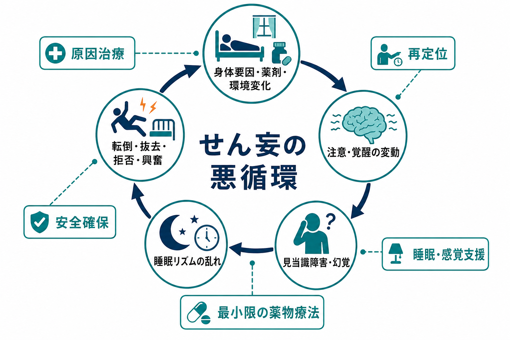
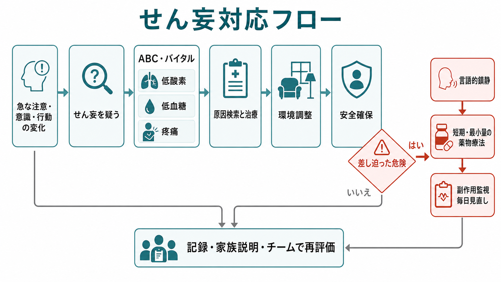

# せん妄への危機対応とは何か

## 要点

- せん妄への危機対応は、「鎮静すること」ではなく、急性の脳機能不全を疑いながら、本人・周囲・治療継続の安全を同時に守る臨床手順である。
- 最初に確認するのは、低酸素、低血糖、ショック、感染、脱水、疼痛、尿閉、便秘、薬剤、離脱、頭部外傷など、見逃すと危険な可逆的原因である[1][2]。
- 環境調整、再定位、睡眠覚醒リズム、眼鏡・補聴器、家族情報、早期離床、疼痛緩和などの非薬物的介入が基本であり、多要素介入はせん妄予防に有効性が示されている[3]。
- 薬物療法は、強い苦痛や差し迫った危険があり、非薬物的対応だけでは評価・治療・安全確保が困難な場合に、短期・最小量・毎日見直しで用いる[1][4][5]。
- 本文は教育・研究目的の整理であり、個別症例の診断や処方指示ではない。実際の対応は施設手順、診療科、救急・集中治療・精神科リエゾン体制に従う。

## この記事で答える問い

1. せん妄を「危機」として扱うのはなぜか。
2. 原因検索、環境調整、安全確保、薬物療法をどの順で考えるか。
3. 薬物療法や身体拘束を、どのように最小限の手段として位置づけるか。
4. 記録、家族説明、チーム再評価まで含めると、何が危機対応になるのか。

## まず結論

せん妄への危機対応は、急な注意・意識・行動の変化を「困った行動」として処理するのではなく、身体疾患・薬剤・環境変化が脳の情報処理を破綻させている可能性として扱うことで始まる。したがって、対応の軸は「原因検索」「環境調整」「安全確保」「必要最小限の薬物療法」であり、これらを直列ではなく並列に進める。

たとえば、夜間に点滴を抜こうとしている高齢患者では、まず転倒・抜去・暴力化を防ぐ距離と人員を確保しながら、低酸素、低血糖、疼痛、尿閉、感染、薬剤変更、睡眠不足、感覚遮断を確認する。本人を叱責しても注意機能は回復しにくく、むしろ恐怖と刺激が増えて悪循環が強まる。薬物療法を使う場合も、せん妄そのものを「治す」手段というより、原因評価と安全確保を可能にする短期的な補助と考える。

## 背景

せん妄は、急性に発症し、時間帯によって変動する注意・意識・認知の障害である。高齢、認知症、重症身体疾患、感染、手術、ICU、薬剤、脱水、疼痛、睡眠障害などが重なると発症しやすい[2][7]。この点は、[[せん妄とは何か]]、[[せん妄を起こしやすい疾患には何があるのか]]、[[高齢者のせん妄はなぜ重要なのか]]と連続している。

危機対応として重要なのは、せん妄が本人の意思や性格だけで説明できないことである。注意や見当識が揺れていると、説明を保持できず、点滴や酸素を「攻撃されているもの」と誤って解釈することがある。ここで叱責、過剰な制止、騒がしい多人数対応が加わると、恐怖、睡眠不足、抵抗、転倒、ライン抜去が増え、さらにせん妄が悪化する。

## 基本概念

### 原因検索

せん妄を疑った時点で、精神症状だけでなく身体評価を同時に行う。優先度が高いのは、低酸素、低血糖、循環不全、発熱・感染、脱水、電解質異常、疼痛、尿閉、便秘、頭部外傷、薬剤変更、抗コリン薬・鎮静薬・オピオイド・ステロイド、アルコールやベンゾジアゼピンの離脱である[1][2][7]。急な悪化では、[[アルコール離脱せん妄への対応とは何か]]、[[抗コリン性せん妄とは何か]]、[[振戦せん妄とは何か]]も鑑別に入る。

### 環境調整

環境調整は「優しい対応」ではなく、脳への入力を整理する治療的介入である。時計、カレンダー、眼鏡、補聴器、昼夜の光、睡眠を妨げない夜間ケア、不要なアラームや声かけの削減、家族やなじみの物の活用、疼痛緩和、早期離床を組み合わせる。多要素の非薬物的介入は、せん妄発症を減らす根拠があり、薬物より前に設計すべき基盤である[3]。

### 安全確保

安全確保では、本人、周囲の患者、家族、職員、治療ラインを同時に見る。転倒、抜管・抜針、誤嚥、窒息、離院、暴力化、自傷、治療拒否が差し迫っているかを確認する。これは[[医療安全とは何か]]、[[精神科医療安全の特徴は何か]]、[[転倒転落リスク管理とは何か]]、[[誤嚥窒息リスク管理とは何か]]と直接つながる。

### 薬物療法

薬物療法は、原因治療と環境調整の代替ではない。NICE は、せん妄患者が苦痛を示し、本人または周囲への危険があり、言語的・非薬物的なディエスカレーションが不十分な場合に限って、短期間のハロペリドールなどを考慮する立場を示している[1]。ICU 領域の PADIS ガイドラインも、抗精神病薬をせん妄の予防やルーチン治療として一般化しない姿勢をとる[4]。Cochrane レビューでも、非 ICU 入院患者のせん妄治療における抗精神病薬の明確な利益は限定的である[6]。

一方で、危険が差し迫り、評価や原因治療が進められない場面では、短期的な薬物療法が安全確保に必要になることがある。その場合は、年齢、認知症、パーキンソニズム、レビー小体型認知症、QT 延長、錐体外路症状、過鎮静、誤嚥、転倒、併用薬を確認し、投与後の観察と中止時期を最初から決める。

## 仕組み

せん妄では、身体的ストレス、炎症、薬剤、睡眠覚醒リズムの破綻、感覚入力の不足または過剰が重なり、注意と覚醒の調整が不安定になる。注意が保てないと、説明、場所、時間、治療目的を統合できず、幻覚・錯覚・被害的解釈が起こりやすくなる。そこに痛み、尿意、口渇、騒音、暗さ、抑制、知らない人の声かけが加わると、不安と抵抗が増える。

この悪循環を断つには、原因治療だけでも、鎮静だけでも不十分である。低酸素や感染を治療しながら、再定位し、睡眠と感覚入力を整え、転倒やライン抜去を防ぎ、どうしても必要な場合だけ薬物療法を使う。危機対応とは、この並列処理をチームで実装することである。

## 図解

下のフローは、現場での判断順序を簡略化したものである。実際には、救急度、病棟体制、身体疾患、本人の意思表示、家族情報、地域の法制度や院内手順に応じて調整する。

| 局面 | まず見ること | 対応の要点 |
|---|---|---|
| 急変確認 | ABC、バイタル、低酸素、低血糖、疼痛、意識水準 | 生命危機を先に除外し、せん妄と決めつけない |
| 原因検索 | 感染、脱水、電解質、尿閉、便秘、頭部外傷、薬剤、離脱 | 身体診察、検査、薬剤レビューを並行する |
| 環境調整 | 騒音、照明、眼鏡・補聴器、睡眠、家族情報 | 刺激を減らし、見当識を支える |
| 安全確保 | 転倒、抜去、誤嚥、離院、暴力化、自傷 | 人員配置、距離、動線、観察頻度を調整する |
| 薬物療法 | 苦痛、差し迫った危険、非薬物的対応の限界 | 短期・最小量・副作用監視・毎日見直し |
| 振り返り | 何が誘因か、何が有効か、再発予防は何か | 記録、家族説明、チーム共有につなげる |

## 臨床・研究との接続

臨床では、せん妄対応の質は「薬を使ったか」だけでは測れない。原因検索の速さ、非薬物的介入の実装度、転倒・抜去・誤嚥の予防、過鎮静の回避、身体拘束の最小化、家族説明、退院後の認知・身体機能への影響まで見る必要がある。ICU では、[[ICUせん妄とは何か]]で扱うように、疼痛、鎮静、人工呼吸、早期離床、家族参加を束ねる実装が重要になる[4]。

研究上は、せん妄の発症率や持続時間だけでなく、苦痛、睡眠、転倒、身体拘束、職員負担、家族の体験、退院後の認知機能を含めたアウトカム設計が課題になる。薬物療法の研究では、対象患者、せん妄の重症度、原因、ICU か非 ICU か、過活動型か低活動型か、評価尺度、投与経路が異なるため、結果を単純に一般化しにくい[4][6]。

## よくある誤解

### 誤解1: せん妄は精神科だけの問題である

せん妄は身体疾患、薬剤、環境、睡眠、疼痛、感覚入力が重なって起こる急性の脳機能不全である。精神科リエゾンは重要だが、初期対応は一般身体診療、看護、薬剤、リハビリ、家族情報と不可分である。

### 誤解2: 暴れる人にはまず鎮静薬を使う

差し迫った危険がある場合を除き、最初に行うべきことは安全距離、人員、声かけ、刺激低減、原因検索である。鎮静薬は評価と治療を助けるための補助であり、原因検索を遅らせるほど深く使うと、誤嚥、転倒、低活動型せん妄の見逃しにつながる。

### 誤解3: 眠らせればせん妄は治る

睡眠覚醒リズムを整えることは重要だが、過鎮静は覚醒・注意の評価を難しくし、呼吸抑制や転倒を増やすことがある。必要なのは自然な昼夜リズム、痛みの緩和、安心できる環境であり、単に意識水準を下げることではない。

### 誤解4: 身体拘束をすれば安全である

身体拘束は抜去や転倒を一時的に防ぐように見えても、恐怖、興奮、外傷、廃用、治療不信を強める可能性がある。やむを得ず検討する場合も、[[身体拘束の適応とリスク管理とは何か]]に沿って、最小限、代替困難性、観察、解除基準、説明、記録をセットにする。

## 関連ノート

- [[せん妄とは何か]]
- [[せん妄を起こしやすい疾患には何があるのか]]
- [[せん妄と認知症はどう違うのか]]
- [[高齢者のせん妄はなぜ重要なのか]]
- [[ICUせん妄とは何か]]
- [[周術期せん妄とは何か]]
- [[抗コリン性せん妄とは何か]]
- [[アルコール離脱せん妄への対応とは何か]]
- [[興奮状態への対応はどう行うか]]
- [[急速鎮静とは何か]]
- [[言語的ディエスカレーションとは何か]]
- [[薬剤副作用の早期発見はどう行うか]]
- [[身体拘束の適応とリスク管理とは何か]]
- [[転倒転落リスク管理とは何か]]
- [[誤嚥窒息リスク管理とは何か]]

### 今後の作成候補

- 低活動型せん妄への対応とは何か
- せん妄患者への家族説明はどう行うか
- せん妄時の薬剤レビューでは何を見るか
- せん妄後の認知機能フォローとは何か

### MOC更新候補

- `content/00_MOC/MOC｜臨床実践・治療.md`
- `content/00_MOC/MOC｜精神医学.md`
- `content/00_MOC/MOC｜薬物療法.md`

## 理解チェック

1. せん妄を疑ったとき、薬物療法より先に確認すべき身体的危険は何か。
2. 環境調整が「単なる配慮」ではなく介入になる理由は何か。
3. 抗精神病薬を使う場合、開始前と開始後に確認すべきリスクは何か。
4. 身体拘束や過鎮静を避けるために、チームで事前に決めておくべきことは何か。
5. せん妄の危機対応を、退院後の再発予防や家族説明につなげるには何を記録するか。

## 未解決問題

- 低活動型せん妄では危機が目立ちにくく、治療遅延や廃用につながりやすい。過活動型中心の安全対策だけでは不十分である。
- 抗精神病薬の短期使用は現場で必要になることがある一方、予後改善効果は一貫せず、副作用監視と中止判断の標準化が課題である。
- 家族参加、睡眠支援、早期離床、薬剤レビューを、忙しい病棟でどのように実装し維持するかは、研究と品質改善の双方の課題である。

## 参考文献

[1] National Institute for Health and Care Excellence. (2010, updated). *Delirium: prevention, diagnosis and management in hospital and long-term care* (Clinical guideline CG103). https://www.nice.org.uk/guidance/cg103

[2] Inouye, S. K., Westendorp, R. G. J., & Saczynski, J. S. (2014). Delirium in elderly people. *The Lancet, 383*(9920), 911-922. https://doi.org/10.1016/S0140-6736(13)60688-1

[3] Hshieh, T. T., Yue, J., Oh, E., Puelle, M., Dowal, S., Travison, T., & Inouye, S. K. (2015). Effectiveness of multicomponent nonpharmacological delirium interventions: A meta-analysis. *JAMA Internal Medicine, 175*(4), 512-520. https://doi.org/10.1001/jamainternmed.2014.7779

[4] Devlin, J. W., Skrobik, Y., Gelinas, C., et al. (2018). Clinical practice guidelines for the prevention and management of pain, agitation/sedation, delirium, immobility, and sleep disruption in adult patients in the ICU. *Critical Care Medicine, 46*(9), e825-e873. https://doi.org/10.1097/CCM.0000000000003299

[5] American Geriatrics Society Expert Panel on Postoperative Delirium in Older Adults. (2015). American Geriatrics Society abstracted clinical practice guideline for postoperative delirium in older adults. *Journal of the American Geriatrics Society, 63*(1), 142-150. https://doi.org/10.1111/jgs.13281

[6] Burry, L., Mehta, S., Perreault, M. M., et al. (2018). Antipsychotics for treatment of delirium in hospitalised non-ICU patients. *Cochrane Database of Systematic Reviews*, 6, CD005594. https://doi.org/10.1002/14651858.CD005594.pub3

[7] Marcantonio, E. R. (2017). Delirium in hospitalized older adults. *The New England Journal of Medicine, 377*(15), 1456-1466. https://doi.org/10.1056/NEJMcp1605501
